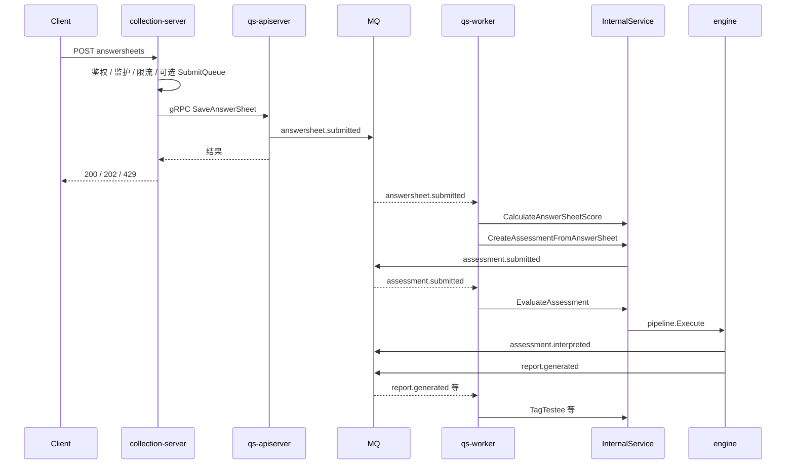
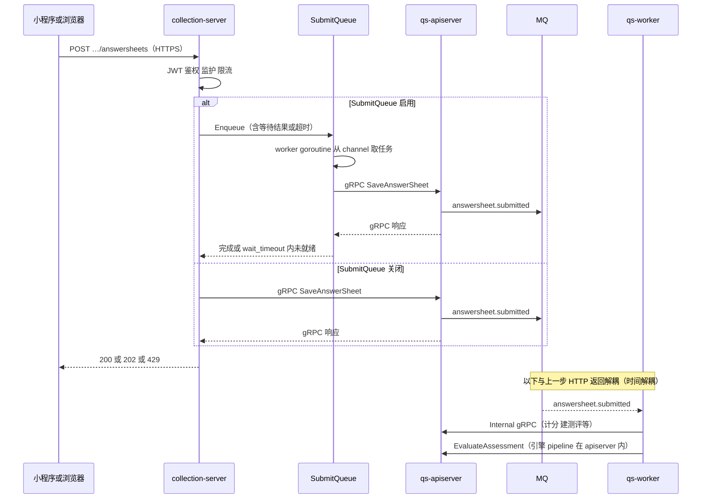
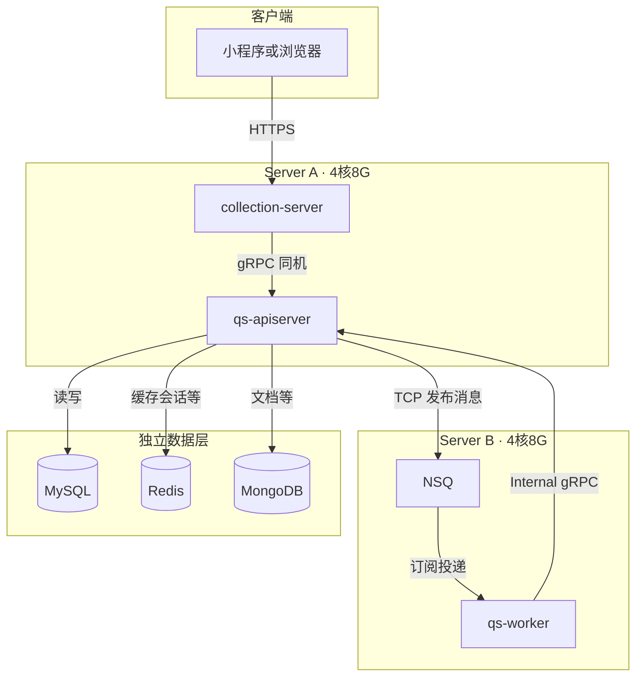

# 异步评估链路：从答卷提交到报告生成

**本文回答**：`qs-server` 的同步入口只负责“接住请求 + 落主状态 + 发事件”，计分、建测评、评估引擎和报告都在 `MQ + qs-worker + apiserver internal gRPC` 这条异步链路上推进；本文的目标是把这条链一次讲清。

与 **evaluation 模块**互参：[../02-业务模块/03-evaluation.md](../02-业务模块/03-evaluation.md)；总览见 [../00-总览/03-核心业务链路.md](../00-总览/03-核心业务链路.md)。

---

## 30 秒结论

如果只看一屏，先记住下面这张表：

| 维度 | 结论 |
| ---- | ---- |
| 主路径 | `collection-server -> qs-apiserver -> MQ -> qs-worker -> InternalService -> evaluation pipeline` |
| 同步段 | 只做鉴权、监护、限流、可选 SubmitQueue、保存答卷、发布 `answersheet.submitted` |
| 异步段 | worker 消费消息，回调 apiserver 计分、建测评、执行 `EvaluateAssessment`，再发布 `assessment.interpreted` / `report.generated` |
| 两层“异步” | 既有 collection 进程内的 SubmitQueue，也有进程间的 MQ + worker，它们解决的问题不同 |
| 运行时边界 | worker 只做订阅、调 gRPC、Ack/Nack；真正的状态机、引擎和写库仍在 apiserver |
| 当前最该主动说明的边界 | `worker.concurrency` 才是真正控制消费并发的关键配置；答卷写库后发事件没有 outbox 仍是现状风险 |

---

<!-- markdownlint-disable MD051 -->

## 目录

1. [先抓主链路](#先抓主链路)
2. [端到端时序](#端到端时序)（总览图 + 小程序/SubmitQueue/MQ/Worker 展开图）
3. [提交排队：SubmitQueue 怎么排](#提交排队submitqueue-怎么排)
4. [「异步」的两层含义](#异步的两层含义)
5. [MQ 承担什么、不承担什么](#mq-承担什么不承担什么)
6. [NSQ 与消费侧并发（MaxInFlight）](#nsq-与消费侧并发maxinflight)
7. [apiserver 发布端：RoutingPublisher 与消息形态](#apiserver-发布端routingpublisher-与消息形态)
8. [qs-worker 如何运作](#qs-worker-如何运作)
9. [evaluation engine：职责链（pipeline）如何应用](#evaluation-engine职责链pipeline如何应用)
10. [事件与 Topic 对照](#事件与-topic-对照)
11. [失败路径、重试与可观测性](#失败路径重试与可观测性)
12. [分段里程碑（与上文对照）](#分段里程碑与上文对照)
13. [部署与网络简图](#部署与网络简图)
14. [为什么必须异步](#为什么必须异步)
15. [分环节吞吐、QPS 标称与压力测试](#分环节吞吐qps-标称与压力测试)
16. [边界与注意事项](#边界与注意事项)

锚点以常见 Markdown 渲染器（如 GitHub）自动生成规则为准；若本地预览无法跳转，请用编辑器大纲视图导航。

<!-- markdownlint-enable MD051 -->

---

## 先抓主链路

真实主路径：

`collection-server → qs-apiserver → MQ → qs-worker → InternalService gRPC → evaluation engine（pipeline）`

- **同步阶段**（用户请求线程内）：鉴权、监护、限流、**可选**内存提交队列、经 gRPC 保存答卷并发布 `answersheet.submitted`。
- **异步阶段**（与请求解耦）：worker 消费消息 → 回调 apiserver 计分、建测评、执行 `EvaluateAssessment`；引擎内 **职责链** 跑完后发布 `assessment.interpreted` / `report.generated`；再继续消费做标签等。

下文「异步」包含两层：**进程内排队**（SubmitQueue）与 **进程间消息**（MQ + worker），二者解决的问题不同。

---

## 端到端时序

下列时序与 [configs/events.yaml](../../configs/events.yaml) 中 Topic **`qs.evaluation.lifecycle`**（配置键 `assessment-lifecycle`）下的测评域事件一致。为兼顾**总览**与**BFF 内 SubmitQueue**，本节用**两张图**：先全链路，再展开小程序 → collection（含队列）→ apiserver → MQ → worker 的边界。

### 总览：主链路时序



`EvaluateAssessment` 与 **pipeline** 均在 **qs-apiserver 进程**内执行；worker 只负责 **拉消息、调 gRPC、Ack/Nack**，不复制领域写模型。

### 小程序 / 浏览器与 SubmitQueue：同步段展开 + MQ + Worker

下图把 **C 端**显式画成「小程序或浏览器」（经 HTTPS 打 **collection-server**）；**SubmitQueue** 作为 **collection 进程内**对象单独成泳道，便于和后面的 **MQ**（跨进程）区分。`Submit` 关闭时，HTTP 线程内直接 gRPC，无 `SQ` 参与。



**读图提示**：**202** 多来自「已入队但 `wait_timeout` 内未拿到同步结果」，客户端需按现有接口做 **submit-status / 轮询**；**429** 可能来自限流或 **channel 满**（`ErrQueueFull`），与下文 [SubmitQueue 机制](#提交排队submitqueue-怎么排) 对照。

---

## 提交排队：SubmitQueue 怎么排

**定位**：`collection-server` 进程内的 **内存** 削峰组件，用 **带缓冲 channel + 固定数量 worker goroutine** 把「调用下游 gRPC 提交答卷」从接入线程中拆出去；**不是**跨实例共享的持久任务队列。

**机制**（见 [submit_queue.go](../../internal/collection-server/application/answersheet/submit_queue.go)）：

| 环节 | 行为 |
| ---- | ---- |
| 结构 | `jobs chan submitJob`（容量 = `queue_size`），若干 `worker()` 从 channel 取任务执行真正的 `submit`（即调 apiserver 保存答卷） |
| 入队 | `Enqueue` 里 `select`：能塞进 `jobs` 则入队；**channel 满**则返回 `ErrQueueFull` → 上层可映射为 **429** |
| 等待 | 入队后带 `respCh`；若配置了 `wait_timeout`（如 [collection-server.dev.yaml](../../configs/collection-server.dev.yaml) 里 `wait_timeout_ms`），在超时前等到结果则 **200**；否则 **queued=true** → 常对应 **202**（已接受但未在时限内完成） |
| 幂等 | 同一 `request_id` 在内存 `statuses` 里维护 `queued / processing / done / failed`；已完成可短路返回；失败需换新 `request_id` 再试 |
| 清理 | 状态带 TTL（代码中约 10 分钟量级），定期 `cleanup` 删旧条目 |

**配置示例**（开发环境，见 `submit_queue` 小节）：`enabled`、`queue_size`、`worker_count`、`wait_timeout_ms`。

**边界**：队列状态**不跨进程**；实例重启即丢内存态；适合「短时尖峰、可接受 202 + 轮询/查询状态」的场景，不承担跨天、跨实例的可靠任务语义。

---

## 「异步」的两层含义

| 层次 | 机制 | 解决的矛盾 |
| ---- | ---- | ---------- |
| **进程内** | SubmitQueue | 接入线程不必被单次 gRPC 写放大阻塞；用有限 worker 并发执行 `submit` |
| **进程间** | MQ + worker | 用户 HTTP 不必等待计分、建测评、整条评估流水线；**时间解耦**（何时算）与**空间解耦**（在 worker 机器上算） |

二者可叠加：请求可能先经队列再打到 apiserver；**无论是否排队**，答卷一旦在 apiserver 落库并发布 `answersheet.submitted`，后续评估一定走 MQ，**不会**在用户请求里同步跑 `EvaluateAssessment`。

---

## MQ 承担什么、不承担什么

**承担**（消息中间件角色）：

- **Topic 通道**：如运行时名 `qs.evaluation.lifecycle`（见 [events.yaml](../../configs/events.yaml) `topics.*.name`），把同一类业务事件交给订阅方。
- **缓冲与投递**：apiserver 发布、worker 异步消费，削峰、避免发布者与消费者同进程同线程。
- **消费组语义**：worker 以 `ServiceName` 等作为 channel 名订阅（见 [server.go](../../internal/worker/server.go) `Subscribe`），具体语义随底层实现（如 NSQ）以配置为准。

**不承担**：

- **不实现业务规则**：计分、解读、状态机仍在 **apiserver 领域与引擎**。
- **不保证「恰好一次」业务效果**：常见是 **至少一次投递**，需消费者 **幂等**（如按 `event_id` / 业务键去重）——详见项目内 MQ/事件规范。
- **不替代 SubmitQueue**：前者跨进程；后者是 collection 进程内 channel。

发布侧在 apiserver 写入成功后发事件；评估链上的新事件（如 `assessment.submitted`）同样由 **apiserver 内**在业务动作完成后发布，经 MQ 到 worker。

---

## NSQ 与消费侧并发（MaxInFlight）

当前 worker 默认走 **NSQ** 时（`messaging.provider: nsq`，见 [worker.dev.yaml](../../configs/worker.dev.yaml)），订阅端在 [server.go](../../internal/worker/server.go) `createSubscriber` 里组装 **NSQ Consumer 配置**。这里的 `messaging.*` 只对应 **QS 业务事件总线**，不包含 `IAM -> QS` 的 `iam.authz.version` 控制面通知：

| 配置来源 | 作用 |
| -------- | ---- |
| `worker.concurrency` | 映射为 **`MaxInFlight`**：若 `> 0` 则 `nsqCfg.MaxInFlight = concurrency`；若未配置或 `<= 0` 则代码里 **默认为 1** |
| `nsq-lookupd-addr` | `NewSubscriber` 使用的 lookupd 列表，发现 Topic |
| `worker.service-name` | 作为 `Subscribe(..., channel, handler)` 的 **channel 名**，多实例同 channel 时共享消费负载（NSQ 语义） |

**语义（与 NSQ 一致）**：`MaxInFlight` 表示该 consumer **同时处于「已投递、尚未 Ack 结束」的消息条数上限**。调大可提高吞吐，但会放大 **单进程内存与下游 gRPC 并发**；需与 apiserver、MySQL 等容量一起评估。

**RabbitMQ 分支**：`provider: rabbitmq` 时使用 `rabbitmq.NewSubscriber`，**当前 worker 代码路径未设置与 `MaxInFlight` 对等的参数**，并发行为以 component-base 中 RabbitMQ 实现为准。

---

## apiserver 发布端：RoutingPublisher 与消息形态

领域事件出站统一为：

1. [server.go](../../internal/apiserver/server.go)：`MessagingOptions.Enabled` 为真时 `NewPublisher()` → `component-base/pkg/messaging` 的 **NSQ 或 RabbitMQ Publisher**（见 [messaging_options.go](../../internal/pkg/options/messaging_options.go)）。
2. [container.go](../../internal/apiserver/container/container.go)：`initEventPublisher()` 构造 [eventconfig.RoutingPublisher](../../internal/pkg/eventconfig/publisher.go)。
3. `RoutingPublisher.Publish`：用 **全局事件注册表**（由 `configs/events.yaml` 加载）把 `event_type` **映射到 Topic 运行时名**，再 `publishToMQ`。

**一条消息大致长什么样**（`publishToMQ`）：

- **Payload**：领域事件 `json.Marshal` 后的正文。
- **Metadata**（便于 worker 侧 `createDispatchHandler` 直接读）：`event_type`、`aggregate_type`、`aggregate_id`、`occurred_at`、`source`（如 `apiserver`）。
- **消息 ID**：使用领域事件的 `EventID()` 作为 messaging 消息标识。

**发布模式**（`PublishMode`）：除 **MQ** 外，还可 **仅打日志**（开发常见）或 **Nop**（测试）；若 MQ Publisher 创建失败，`server.go` 会降级，且 `RoutingPublisher` 在 `mqPublisher == nil` 时也会回退到日志（见 `publishToMQ` 内判断）。

**形态说明**：与常见的「按 Topic 投递、带元数据」消息一致；本项目的 **Topic 路由、元数据键名、序列化** 由 **eventconfig + `events.yaml`** 与 `component-base/pkg/messaging` 的 Publisher 实现绑定。若需替换底层 MQ 或适配其他消息抽象，应通过 **`messaging.Publisher` / `Subscriber`**（或 component-base 扩展点）并另起迁移说明。

---

## qs-worker 如何运作

**启动**（[server.go](../../internal/worker/server.go) `PrepareRun`）：初始化 Redis、**gRPC Client Manager**（连 apiserver）、**Container**（注入 `InternalClient` 等）、按配置创建 **Subscriber**（NSQ / RabbitMQ 等由 `Messaging.Provider` 决定）、**按 Topic 订阅**、注册优雅退出时 `Stop/Close`。

**订阅模型**：

1. 从容器取出 `GetTopicSubscriptions()`（由 [events.yaml](../../configs/events.yaml) 与 eventconfig 生成需要订阅的 Topic 列表）。
2. 对每个 `topicName`：`subscriber.Subscribe(topicName, serviceName, msgHandler)`。
3. `msgHandler`（`createDispatchHandler`）：从 `Message.Metadata["event_type"]` 取事件类型；若无则 **解析 payload 信封** 补全；再调用 `container.DispatchEvent(ctx, eventType, payload)`。
4. 处理成功 **`Ack()`**，失败 **`Nack()`** 以便重试（具体重试策略依 MQ 与配置）。

**分发**（[event_dispatcher.go](../../internal/worker/application/event_dispatcher.go)）：加载 `events.yaml`、**init() 自注册**的 handler 工厂绑定到 `event_type` → 各 handler 内调 **gRPC**（如 `InternalClient.CalculateAnswerSheetScore`），**不写领域仓储**。

**结论**：worker = **事件驱动的远程过程触发器** + **依赖注入的 gRPC 客户端**；**「何时跑」**在 MQ，**「怎么写库」**在 apiserver。

---

## evaluation engine：职责链（pipeline）如何应用

**位置**：`internal/apiserver/application/evaluation/engine/`；**链组装**在 [service.go](../../internal/apiserver/application/evaluation/engine/service.go) `buildPipeline`，**链执行**在 [chain.go](../../internal/apiserver/application/evaluation/engine/pipeline/chain.go)、[handler.go](../../internal/apiserver/application/evaluation/engine/pipeline/handler.go)。

**模式**：**职责链（Chain of Responsibility）**——每个步骤实现统一 `Handler` 接口：`Handle(ctx, evalCtx)`，通过 `SetNext` 串成单向链表；`Chain.Execute` 从 **head** 调用 `Handle`，由 **BaseHandler** 在单步成功后 `next.Handle` 传递。

**当前内置顺序**（与 `buildPipeline` 一致）：

| 顺序 | 处理器 | 职责（概要） |
| ---- | ------ | ------------- |
| 1 | `ValidationHandler` | 前置校验、输入与上下文完整性 |
| 2 | `FactorScoreHandler` | 因子分 / 总分聚合（与 scale、答卷数据交互） |
| 3 | `RiskLevelHandler` | 风险等级，写得分仓储 |
| 4 | `InterpretationHandler` | 解读、构建报告、写报告仓储 |
| 5 | `EventPublishHandler` | 发布 `assessment.interpreted` 等（依赖 `EventPublisher`；未配置则可能仅领域内事件） |

**约定**（见 [handler.go](../../internal/apiserver/application/evaluation/engine/pipeline/handler.go) 包注释）：

- 任一步返回 **error** → **中断整条链**，后续 Handler 不执行。
- **扩展**：新增处理器实现 `Handler`，在 `buildPipeline` 里 `AddHandler` 插入合适位置；各步可单测。

这与 worker 里的「事件 Handler」是**不同层次**：worker 处理 **MQ 消息**；engine pipeline 处理 **单次 Evaluate 的评估上下文**。

---

## 事件与 Topic 对照

| 事件类型 | handler（yaml） | 典型生产者 | 典型消费者（yaml） | 在本链路中的位置 |
| -------- | ----------------- | ---------- | ------------------- | ---------------- |
| `answersheet.submitted` | `answersheet_submitted_handler` | 答卷提交后 | `qs-worker` 等 | 异步起点：计分 + 建测评 |
| `assessment.submitted` | `assessment_submitted_handler` | 提交测评后 | `qs-worker` 等 | 触发 `EvaluateAssessment` |
| `assessment.interpreted` | `assessment_interpreted_handler` | 引擎流水线 | 多消费者 | 解读完成 |
| `assessment.failed` | `assessment_failed_handler` | 失败路径 | logging 等 | 异常/失败分支 |
| `report.generated` | `report_generated_handler` | 引擎流水线 | `qs-worker`（标签等） | 报告就绪与后续动作 |

Topic 运行时名以 [events.yaml](../../configs/events.yaml) 为准（如 `qs.evaluation.lifecycle`）。

### 关键事件字段（payload）

下列字段可直接作为“宣讲证据表”使用，字段定义以事件代码为准，不以口头记忆为准。

| 事件 | 关键字段 | 用途 | 代码锚点 |
| ---- | -------- | ---- | -------- |
| `answersheet.submitted` | `answersheet_id`、`questionnaire_code`、`questionnaire_version`、`testee_id`、`org_id`、`filler_id`、`filler_type`、`submitted_at` | 供 worker 第一跳完成答卷计分与建测评 | [events.go](../../internal/apiserver/domain/survey/answersheet/events.go) |
| `assessment.submitted` | `assessment_id`、`testee_id`、`questionnaire_code`、`questionnaire_version`、`answersheet_id`、`scale_code`、`scale_version`、`submitted_at` | 供 worker 第二跳判断是否需要评估，并以 `assessment_id` 为后续主键 | [events.go](../../internal/apiserver/domain/evaluation/assessment/events.go) |

### 当前幂等边界

- **答卷提交本身**：collection 侧有 `request_id` 级别的 SubmitQueue 状态去重，但 `answersheets` Mongo 当前没有按业务键建立唯一约束，`repo.Create` 也是直接 `InsertOne`；因此不能讲成“durable business idempotency 已完成”。
- **建测评**：worker 第一跳先按答卷拿 Redis 锁；`CreateAssessmentFromAnswerSheet` 还会先查已有测评，MySQL `assessment.answer_sheet_id` 唯一约束进一步兜底。这一段是当前链路里最硬的幂等。
- **评估执行**：`EvaluateAssessment` 只接受 `submitted` 状态；`assessment.submitted` 被重放到已 `interpreted` 的测评时，不会再次走成功路径。
- **出站一致性**：答卷写库后发 `answersheet.submitted` 失败当前只记日志，没有 outbox/relay，应明确视为现状风险。

---

## 失败路径、重试与可观测性

### MQ 消费侧：何时 Ack / Nack

[server.go](../../internal/worker/server.go) `createDispatchHandler` 中：

- **`DispatchEvent` 成功** → `Ack()`，消息从当前 consumer 视角确认。
- **`DispatchEvent` 返回 error** → `Nack()`，交由 **底层 MQ（如 NSQ）** 对消息做重试/重排队；具体次数与退避以 **nsqd / component-base Subscriber** 实现为准，**不是**本文一张表能写死的固定「最多 N 次」。
- **既无 `event_type` 元数据、payload 又解析失败** → 记日志后 **`Ack()`**，避免毒消息无限 Nack 占满并发（属于「无法路由」而非「 transient 失败」）。

`worker.max_retries`（[options.go](../../internal/worker/options/options.go)）等配置项存在于 **WorkerOptions**，当前 **gRPC Manager 创建**（[grpc_client_registry.go](../../internal/worker/grpc_client_registry.go)）**未注入**该字段；勿把它与 **NSQ 消息重试**直接等同。

### 领域与引擎：失败如何变成事件

- **评估 pipeline** 任一步返回 **error** → 链中断，**后续 Handler 不执行**（见上文「evaluation engine：职责链（pipeline）如何应用」一节）。
- **测评聚合**可进入 **failed** 状态并发布 **`assessment.failed`**（领域见 [assessment.go](../../internal/apiserver/domain/evaluation/assessment/assessment.go) 等；事件定义见 [events.go](../../internal/apiserver/domain/evaluation/assessment/events.go)）。
- **worker** 侧 [assessment_handler.go](../../internal/worker/handlers/assessment_handler.go) `assessment_failed_handler`：当前以 **结构化日志**（`assessment failed` + `reason`）为主，**TODO** 处预留告警扩展。

### 业务侧「人工/接口重试」

测评从 failed **再跑**可走 apiserver 管理接口（如 **Retry 失败测评**），与 **MQ 自动重试**是不同通道；详见 evaluation 模块与路由注册，不在此展开。

### 排障时优先看什么

| 现象 | 优先核对 |
| ---- | -------- |
| NSQ 堆积上涨 | `worker.concurrency` / apiserver CPU / DB 慢查询 / 单条 handler 耗时 |
| 同一消息反复失败 | 日志中 **同一 `msg_id` / `event_id`**；是否可复现的**业务错误**（应修数据或修代码，而非加并发） |
| 用户看到「失败」但 MQ 正常 | 领域是否已发 **`assessment.failed`**；前端/轮询是否读到终态 |

---

## 分段里程碑（与上文对照）

| 阶段 | 要点 | 代码入口 |
| ---- | ---- | -------- |
| collection | JWT、监护、限流、**SubmitQueue** | [submission_service.go](../../internal/collection-server/application/answersheet/submission_service.go)、[submit_queue.go](../../internal/collection-server/application/answersheet/submit_queue.go) |
| apiserver 落卷 | gRPC `SaveAnswerSheet` → 应用层 `Submit` → `answersheet.submitted` | [answersheet.go](../../internal/apiserver/interface/grpc/service/answersheet.go)（入口）、[submission_service.go](../../internal/apiserver/application/survey/answersheet/submission_service.go)（`Submit` 与落库/发布） |
| worker 第一跳 | `CalculateAnswerSheetScore`、`CreateAssessmentFromAnswerSheet` | [answersheet_handler.go](../../internal/worker/handlers/answersheet_handler.go)、[internal.go](../../internal/apiserver/interface/grpc/service/internal.go) |
| worker 第二跳 | `EvaluateAssessment` → **pipeline** | [assessment_handler.go](../../internal/worker/handlers/assessment_handler.go)、[engine/service.go](../../internal/apiserver/application/evaluation/engine/service.go) |
| worker 后续 | `report.generated` → `TagTestee` 等 | [report_handler.go](../../internal/worker/handlers/report_handler.go) |

---

## 部署与网络简图

下列为**一种常见生产型划分**（与下文 **「压测验收标准（2×4C8G 应用节点）」** 小节中的拓扑一致）：**两台应用机**各 **4 vCPU / 8 GiB**；**MySQL、Redis、MongoDB** 为**独立数据层**（独立实例或托管，不与应用机争用 CPU/内存）；**NSQ**（含 nsqd、nsqlookupd 等，图中统称 **NSQ**）与 **qs-worker** 同放在 **Server B**，**qs-apiserver** 经内网向 **NSQ** 发布事件，**worker** 再回连 **apiserver** 的 Internal gRPC。



**读图要点**：

- **同机**：`collection-server` → `qs-apiserver` 多为 **127.0.0.1 或本机网卡**，低延迟；配置见各环境 `grpc_client.endpoint`。
- **跨机**：**apiserver → NSQ**、**worker → apiserver** 需 **内网可达**、放通端口与 TLS/mTLS 策略；**worker** 是否在进程内直连 **MySQL/Mongo/Redis** 以实际 `worker` 配置为准（图中未画实线，避免与「领域写集中在 apiserver」的默认叙述冲突）。
- **NSQ 独立部署**：若把 NSQ 迁到**第三台**或托管，逻辑不变，仅把 **SB** 拆成「纯 worker」与「纯 NSQ」并调整连线。

---

## 为什么必须异步

- **入口不被重计算拖住**：评估依赖多资源、多步 IO，与 HTTP 生命周期绑定会放大尾延迟。
- **失败隔离**：提交成功与评估失败可分开处理；重试在消费侧演进。
- **扩展 worker 与 apiserver 实例**：计算压力可横向加 worker（在 MQ 与消费者能力允许范围内）。

读侧保护（限流、缓存）见 [03-保护层与读侧架构：限流、背压、缓存、统计预聚合.md](./03-保护层与读侧架构：限流、背压、缓存、统计预聚合.md)。

---

## 分环节吞吐、QPS 标称与压力测试

本节把三件事放在一起：**① 配置里的标称上限/背压**（`configs/*.yaml`）；**② 固定硬件拓扑下的压测验收建议**（2×4C8G）；**③ 怎么测、看什么指标**。仓库内**没有**随代码发布的「各环节实测 QPS SLA」；标称**不等于**机器一定能跑满，**真实容量**须用 k6 + NSQ/应用指标在目标环境校准。

### 配置标称（来自 configs/*.yaml）

下列数字来自**默认/示例配置**（[collection-server.dev.yaml](../../configs/collection-server.dev.yaml)、[collection-server.prod.yaml](../../configs/collection-server.prod.yaml)、[apiserver.*.yaml](../../configs/)、[worker.*.yaml](../../configs/)、[events.yaml](../../configs/events.yaml)），代表**设计上的可调上限或背压参数**。

#### 同步 HTTP / gRPC：有「QPS」配置

| 位置 | 接口/能力 | 标称（示例：dev 与 prod 常见值） | 说明 |
| ---- | --------- | -------------------------------- | ---- |
| collection-server | `POST …/answersheets` 提交 | **全局**约 **200 QPS**（burst **300**）；**单用户** dev 常 **5 QPS**（burst 10）、prod 常 **200 QPS**（burst 300） | 全局限流 + 用户限流同时生效，多用户总吞吐主要受 **global** 约束 |
| collection-server | 查询类（submit-status、GET 等） | 全局约 **200 QPS**；单用户 dev **10 QPS** 等 | 见各环境 `rate_limit.query_*` |
| collection-server | 等报告（wait-report 类路由） | dev：全局 **80**、单用户 **2**；prod 示例：全局 **200**、单用户 **200**（均带 burst） | 以环境 `rate_limit.wait_report_*` 为准 |
| apiserver | HTTP 若对外暴露时的同类限流 | prod 示例中 submit/query/wait-report 等与 collection **同量级（约 200）**；dev 有单独 admin 等项 | 见 [apiserver.dev.yaml](../../configs/apiserver.dev.yaml)、[apiserver.prod.yaml](../../configs/apiserver.prod.yaml) `rate_limit` |
| collection → apiserver | gRPC 客户端 | `max_inflight` 常 **200** | **并发在途请求数**，不是 QPS；持续 QPS 还受单请求耗时与连接池限制 |

限流实现与路由绑定见 [routers.go](../../internal/collection-server/routers.go)（`rateLimitedHandlers`）。

#### SubmitQueue：队列与 worker 数（不是 QPS）

| 参数 | 示例值 | 含义 |
| ---- | ------ | ---- |
| `queue_size` | **1000** | 进程内可排队提交任务数，用于吸收尖峰 |
| `worker_count` | **8** | 从队列取任务并往下游的**并行度** |
| `wait_timeout_ms` | **200** ms | 同步等待槽位/处理的上限（超时可能 **202**） |

在限流允许的前提下，**持续**吞吐仍受「每任务一次或多次 gRPC + DB」耗时约束；队列只解决**短时 burst**，不单独给出一个「SubmitQueue QPS」。

#### 异步段（NSQ → worker → internal gRPC）：用并发槽位描述，不用 HTTP QPS

| 环节 | 标称参数 | 示例（dev / prod） | 如何理解「能跟多快」 |
| ---- | -------- | ------------------ | -------------------- |
| worker 消费 NSQ | **`worker.concurrency`** → `MaxInFlight` | dev **5**，prod **50** | **整进程**共用一个 NSQ consumer 的「在途未 Ack」上限；若单条 handler 平均耗时 \(T\) 秒，粗算上界约 **concurrency / T** 条/秒（**条**指消息，一条可能触发多步 internal 调用） |
| events 各 Topic | `consumer.concurrency`（`events.yaml`） | 如 `assessment-lifecycle` **4** 等 | **不**参与 `MaxInFlight` 计算；见下 **[events.yaml 与 worker 并发（谁生效）](#eventsyaml-与-worker-并发谁生效)** |
| 引擎 pipeline / DB | 无单独 QPS 配置 | — | 往往成为**实际瓶颈**；需看 p99 处理时长与连接池 |

**异步链路「有效事件吞吐」**可记为：**min(上游投递速率, worker 处理能力, apiserver/DB/引擎能力)**；其中 worker 处理能力需用 **堆积深度、消费延迟、handler 耗时** 度量，而不是单独一个 QPS 数字。

##### events.yaml 与 worker 并发（谁生效）

| 配置项 | 作用位置 | 实际效果（当前实现） |
| ------ | -------- | -------------------- |
| **`worker.concurrency`**（如 [worker.dev.yaml](../../configs/worker.dev.yaml)、[worker.prod.yaml](../../configs/worker.prod.yaml)） | [server.go](../../internal/worker/server.go) 创建 Subscriber 时传入 **`maxInFlight`** | **唯一**决定 NSQ 侧「单进程同时处理多少条未 Ack 消息」；**所有 Topic 共用**这一上限。 |
| **`topics.*.consumer.concurrency`**（[events.yaml](../../configs/events.yaml)） | [subscriber.go](../../internal/pkg/eventconfig/subscriber.go) `GetTopicsToSubscribe` → `TopicSubscription.Concurrency` | 写入**订阅元数据**，并在 [event_dispatcher.go](../../internal/worker/application/event_dispatcher.go) `PrintSubscriptionInfo` **启动日志**中打印；**未**传入 `createSubscriber`，**不**改变 NSQ `MaxInFlight`。 |
| **`topics.*.consumer.retry`**（`max_attempts` 等） | 配置结构体在 [eventconfig/config.go](../../internal/pkg/eventconfig/config.go) 中存在 | worker 消费路径以 **`Nack` + MQ 实现**为准；**勿默认** yaml 中重试次数与线上行为逐字段对应，除非你已核对 **component-base** 对 NSQ 的封装。 |

**结论**：调并发、估堆积，以 **`worker.concurrency`** 与 NSQ/下游容量为准；`events.yaml` 里同 Topic 的 `consumer.concurrency` 宜视为**文档化意图或后续扩展点**，与代码不一致时应**以代码为准**并考虑改 yaml 避免误导。

**与压测的关系**：能直接写成 **QPS** 的主要是 **HTTP 限流**一行；异步段要与**入口 QPS**分开看。需要**可写进评审材料的实测表**时，在目标环境跑 [scripts/perf/](../../scripts/perf/) 与 NSQ/应用指标，把结果作为**环境专属附录**（勿把单次压测当全局 SLA）。

### 压测验收标准（2×4C8G 应用节点）

下列为**压测验收用**建议值，与上一小节**配置标称**区分：**标称**是 yaml 里的上限/参数；**本节**在**固定硬件与拓扑**下约定「建议达标线」，**仍需实测回填**；若数据层或 MQ 与两台应用机同机混布，应**整体下调** RPS 与并发预期。

#### 基准拓扑（应用层）

与上文「**部署与网络简图**」一节对齐：**Server A** 仅 **collection + apiserver**；**Server B** 为 **worker + NSQ**；**MySQL / Redis / MongoDB** 独立。

| 项目 | 约定 |
| ---- | ---- |
| 机器规格 | **2 台**，每台 **4 vCPU、8 GiB 内存** |
| **节点 A** | 部署 `collection-server` + `qs-apiserver`（同机两进程） |
| **节点 B** | 部署 `qs-worker`（**单实例**，与 [worker.prod.yaml](../../configs/worker.prod.yaml) 中 `concurrency` 等一致）+ **NSQ**（nsqd / nsqlookupd 等，与 worker **同机**共部署于本拓扑） |
| 数据层 | **MySQL、Redis、MongoDB** 为**独立**实例（或托管），与两台 **4C8G 应用机分离**，避免与应用进程争抢资源；若数据与 MQ 必须与应用同机混布，以下 RPS/堆积标准需**下调**并单独标定。 |
| 配置对齐 | 采用与生产同结构的限流与并发：`rate_limit` 全局提交 **200 QPS** 级、`grpc_client.max_inflight` **200**、`worker.concurrency` **50**（数值以实际 yaml 为准）；**apiserver** 能访问 **NSQ** 发布地址，**worker** 能访问 **lookupd** 与 **apiserver** Internal gRPC。 |

#### 分环节标准（建议验收）

下列 **RPS** 指**可持续 5～10 分钟**、错误率与延迟满足右列「验收口径」时的**全局**吞吐（多用户、分散 Token，避免单用户触顶 per-user 限流）。

| 环节 | 指标 | 标准（2×4C8G 应用节点 + 外置数据/MQ） | 验收口径 |
| ---- | ---- | ---------------------------------------- | -------- |
| **HTTP 提交** `POST …/answersheets` | 可持续全局 RPS | **≥ 160**（约为配置全局限流 **200** 的 **80%**，留调度与抖动余量） | `http_req_failed` **小于 1%**；**429** 占比 **小于 0.1%**（队列/限流可接受边界外）；**p95** 延迟 **小于 2s**、**p99** **小于 5s**（以 k6 统计为准，不含客户端网络） |
| **HTTP 查询**（submit-status、GET 等） | 可持续全局 RPS | **≥ 160**（同上，与 `query_global_qps` 对齐时取 **min(配置, 160)** 作为目标） | 同上错误率；**p95 小于 1s**（读路径通常快于提交，若实际更严可以环境 SLA 为准） |
| **collection → apiserver gRPC** | 在上一行目标 RPS 下 | **无持续性超时**；与 `max_inflight` **200** 匹配时，**gRPC 失败/超时率小于 0.1%**（以 apiserver/collection 指标或日志为准） | 压测窗口内采样；若失败主要在 DB/MQ，先扩数据层再重测 |
| **SubmitQueue** | 进程内背压 | 在 **160 RPS** 提交目标下，**202（排队超时）** 占比 **小于 1%**；**429（队列满）** **小于 0.1%** | 与 `queue_size` / `worker_count` / `wait_timeout_ms` 联动；超标则调队列或限流，而非盲目加 k6 RPS |
| **NSQ → worker** | 消费侧 | **单 worker 实例**下，稳态 **NSQ 各相关 Topic 堆积深度不单调上升**（连续 **≥ 5 min** 观测）；**消费滞后**（从消息入队到 Ack 的可观测延迟）**p99 小于 60s**（若引擎极重，以业务可接受上限替换并注明） | nsqadmin / 自建监控；若上游仅 **160** 提交/s 仍堆积，瓶颈在 **worker 下游（apiserver internal、DB、引擎）** |
| **worker 进程** | 资源 | 节点 B 在目标负载下 **CPU 平均不大于 75%**、**内存不大于 85%**（预留 OOM 与 GC 余量） | 系统指标；持续 **100%** 说明 `concurrency` 或单条耗时过高，需削峰或扩容 worker |
| **节点 A** | 资源 | 在 **160 RPS 提交 + 按比例查询** 混合场景下，**CPU 平均不大于 75%**、**内存不大于 85%** | 同左 |

**异步段「事件条/秒」**：不设固定数字标准，采用 **min(上游投递率, worker 槽位/平均处理时长)**；在 **concurrency=50**、单条评估链路 **p50 耗时约 1～3s** 时，单实例**粗算**稳态约 **15～50 条事件/s** 量级，**仅作容量沟通参考**，以「**无恶性堆积 + 滞后 p99**」为硬标准。

#### 使用方式

- 先按下文 **「仓库内脚本（k6）」** 阶梯加压至 **160 RPS** 提交（或环境配置允许的全局上限的 **80%**），同时开少量查询/等报告接口混合流量更接近真实。
- 异步段必须看 **NSQ + worker + apiserver internal + DB**；仅 HTTP 达标不等于链路达标。
- 将本环境**实测** RPS、延迟、堆积写入测试报告附录；若高于表中标准，可更新为团队基线。

### 测什么、测不到什么（方法）

| 层次 | k6 等 HTTP 压测通常能直接打到 | 需另做观测或专项压测 |
| ---- | ----------------------------- | ---------------------- |
| **同步段** | `collection-server` 鉴权、限流、**SubmitQueue**、`POST /api/v1/answersheets` → apiserver 落卷与首跳事件 | 429（队列满）、202（排队未在 `wait_timeout` 内完成） |
| **异步段** | 不经过用户 HTTP 返回 | **NSQ 堆积**、**worker 消费延迟**、internal gRPC 耗时、引擎 pipeline、下游 DB |

结论：**接口延迟与错误率**主要反映「入口 + 同步 gRPC」；要验证「异步链路是否跟得上」，必须结合 **MQ 深度、worker 日志/指标、apiserver 与 DB 负载**（见下表）。

### 仓库内脚本（k6）

目录：[scripts/perf/](../../scripts/perf/)，基于 [k6](https://k6.io/)，常用场景包括：

| 脚本 | 侧重 |
| ---- | ---- |
| [k6-collection.js](../../scripts/perf/k6-collection.js) | 多接口混合（公开读 + 需 Token 的列表等），可通过环境变量控制 `BASE_URL`、`RPS`、`DURATION`、`VUS`，可选 `ENABLE_SUBMIT=true` + `ANSWER_BODY` 打提交 |
| [k6-answersheet-submit.js](../../scripts/perf/k6-answersheet-submit.js) | 高 RPS 连续提交答卷（脚本内为示例常量，**正式压测前务必改为本环境地址与测试账号**，勿提交真实 Token 到版本库） |
| 同目录 `k6-collection-*.js` | 问卷、量表、测评列表等读路径 |

**执行示例**（在仓库根目录，按本机修改变量；Token 用环境变量注入，勿写进文档）：

```bash
cd /path/to/qs-server
BASE_URL=http://127.0.0.1:18083 TOKEN="${QS_TEST_TOKEN}" \
  RPS=50 DURATION=2m k6 run scripts/perf/k6-collection.js
```

脚本内 `thresholds`（如 `http_req_failed`、`http_req_duration` 的 p95/p99）仅约束 **HTTP 层**；与上文「异步测不到」一致。

### 与链路参数的联动（调参方向）

加压时若出现 **入口变慢、429 增多、异步严重滞后**，可对照本文前文，按瓶颈分侧调整（示例，非唯一解）：

- **SubmitQueue**：`queue_size`、`worker_count`、`wait_timeout_ms`（[collection-server 配置](../../configs/collection-server.dev.yaml)）——进程内排队能力。
- **worker**：`concurrency` → NSQ `MaxInFlight`（见上文「NSQ 与消费侧并发」）——单 consumer 并行处理条数。
- **apiserver / DB**：同步与 internal gRPC、MySQL/Mongo 连接池与慢查询。

### 观测清单（建议）

- **NSQ**：各 Topic 消息堆积、消费延迟（nsqadmin / 自建监控）。
- **进程**：`qs-worker`、`qs-apiserver` CPU、内存、goroutine；gRPC 服务端耗时分布。
- **数据层**：MySQL/Mongo 慢查询、连接数；Redis（若参与锁或缓存）。
- **业务**：抽样核对 `answersheet.submitted` → 报告生成端到端耗时（日志中的 `event_id` / `assessment_id` 关联）。

### 安全与合规

- 仅在**测试/预发**环境执行；**不要在文档、脚本提交记录中写入长期有效的 JWT/密码**（脚本示例中的占位符上线前必须替换）。
- 超高 RPS 可能对下游与计费资源造成影响，**先小流量阶梯加压**，并预留降级与中止条件。

---

## 边界与注意事项

- **worker 不是第二套领域服务**：持久化与不变量在 **apiserver**。
- **SubmitQueue** 仅进程内内存队列；**MQ** 管跨进程；勿混用语义。
- **pipeline** 与 **worker 事件 handler** 分层不同，改扩展点时别改错层。
- 变更事件或消费者：同步 [events.yaml](../../configs/events.yaml)、领域常量、[worker 注册](../../internal/worker/handlers/registry.go) 与本篇表格。

---

*写作约定见 [CONTRIBUTING-DOCS.md](../CONTRIBUTING-DOCS.md)。*
