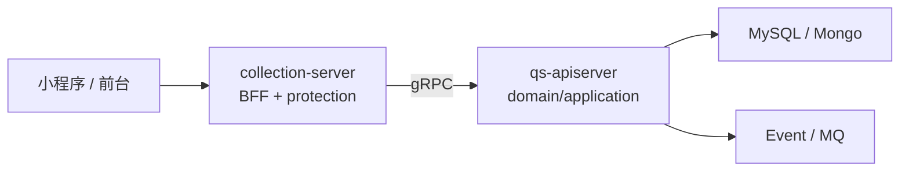

# 为什么需要 collection 保护层

**本文回答**：为什么 qs-server 不让小程序/前台直接访问 qs-apiserver，而是在前面单独放一个 collection-server；collection-server 到底是“简单转发网关”，还是承担了前台 BFF、身份投影、限流、削峰、幂等、监护关系校验、状态查询和前台契约隔离等保护职责；如果去掉它，会出现什么问题。

---

## 30 秒结论

collection-server 不是一个“多余的中间层”，它是前台提交链路的**保护层**和**BFF 层**。

| 能力 | collection-server 负责 |
| ---- | ---------------------- |
| 前台契约隔离 | 给小程序/前台暴露更窄、更稳定的 REST API |
| 认证与租户投影 | JWT、UserIdentity、TenantScope、AuthzSnapshot |
| 公开只读白名单 | 允许部分 scale read-only 接口匿名访问 |
| 入口限流 | submit / query / wait-report 分 scope 限流 |
| 提交削峰 | SubmitQueue 将提交请求转成 `202 + request_id` |
| 幂等保护 | SubmitGuard 使用 done marker + in-flight lock 做跨实例提交保护 |
| 监护关系校验 | 调 IAM/Actor 校验当前用户是否可为受试者提交 |
| gRPC 适配 | 将 REST DTO 转为 apiserver gRPC 请求 |
| 前台状态查询 | submit-status、wait-report、assessment/report 查询 |
| 治理观测 | `/governance/redis`、`/governance/resilience` |

一句话概括：

> **apiserver 负责主业务事实和领域能力，collection-server 负责保护前台入口，防止前台流量、重复提交、权限校验和长轮询直接打穿主服务。**

---

## 1. 如果没有 collection-server，会发生什么

如果小程序直接访问 qs-apiserver，看起来链路更短：

```text
小程序 -> qs-apiserver REST/gRPC -> DB/Mongo/Event
```

但问题会很快暴露。

| 问题 | 后果 |
| ---- | ---- |
| 前台请求直接打到主服务 | apiserver 同时承担前台流量和后台管理流量 |
| 答卷提交高峰无法削峰 | Mongo durable submit、IAM、gRPC、DB 容易被瞬时打满 |
| 重复点击提交直接进入主服务 | 重复 AnswerSheet / Assessment 风险上升 |
| wait-report 长轮询直接占用主服务入口 | 后台管理与内部 RPC 容易被拖慢 |
| 小程序 DTO 与主服务 DTO 强耦合 | apiserver 接口无法自由演进 |
| 前台监护关系校验散落 | 权限边界容易不一致 |
| rate limit 只能在主服务上做 | 无法区分前台 submit/query/wait-report 保护策略 |
| 前台公开只读接口难管理 | 匿名接口和后台 protected 接口混杂 |

所以 collection-server 的存在是为了在主服务前增加一个**可控、可观测、可降级的入口保护层**。

---

## 2. collection-server 的定位

collection-server 的定位不是：

```text
HTTP reverse proxy
```

也不是：

```text
纯粹转发 REST -> gRPC
```

它更接近：

```text
Frontend BFF + Submit Protection Layer + Runtime Guard
```

它一边面向小程序/前台，一边通过 gRPC 调 apiserver。



---

## 3. collection-server 与 apiserver 的职责边界

| 维度 | collection-server | qs-apiserver |
| ---- | ----------------- | ------------ |
| 调用方 | 小程序、前台用户 | 后台、运维、collection、worker |
| 接口形式 | REST BFF | REST + gRPC |
| 主职责 | 入口保护、提交削峰、前台契约 | 领域能力、持久化、评估、事件 |
| 数据写入 | 不直接写主数据 | 写 MySQL/Mongo |
| 业务事实源 | 不是 | 是 |
| 提交幂等 | SubmitGuard / request status | durable submit / DB 约束 / outbox |
| 高并发保护 | RateLimit、SubmitQueue、gRPC max-inflight | Backpressure、Outbox、domain idempotency |
| 外部身份 | 前台 JWT / IAM snapshot | IAM snapshot / service auth / mTLS |
| 报告生成 | 查询/等待 | Evaluation pipeline / report store |

关键结论：

```text
collection-server 保护入口；
qs-apiserver 处理事实。
```

---

## 4. 第一层保护：前台 REST 契约隔离

collection-server 暴露的是前台 API：

- questionnaires read。
- scales list/hot/categories/detail。
- testees。
- answersheets submit/status/detail。
- assessments list/report/wait-report。
- public info。
- health/governance。

这些 API 面向前端体验，而不是完整后台管理。

### 4.1 为什么要契约隔离

前台关心：

- 页面怎么展示。
- 答卷怎么提交。
- 报告怎么等待。
- 受试者怎么选择。
- 哪些量表可公开读取。

apiserver 关心：

- 模板生命周期。
- 发布/归档。
- 统计同步。
- 管理员能力。
- 读模型治理。
- 事件与 Outbox。

如果让前台直接使用 apiserver REST，apiserver 的接口演进会被前台绑定，后台接口也更容易误暴露。

### 4.2 公开只读白名单

collection-server 允许部分 scale GET 接口跳过 auth：

```text
GET /api/v1/scales
GET /api/v1/scales/hot
GET /api/v1/scales/categories
```

这说明 collection 层可以按前台产品体验定义更细的公开边界，而不是把 apiserver 的后台权限模型直接暴露给小程序。

---

## 5. 第二层保护：JWT / TenantScope / AuthzSnapshot 投影

collection-server 对 `/api/v1` 业务路由应用 IAM 认证链：

```text
JWTAuthMiddleware
UserIdentityMiddleware
RequireTenantIDMiddleware
RequireNumericOrgScopeMiddleware
AuthzSnapshotMiddleware
```

它和 apiserver 对齐 Principal / TenantScope / AuthzSnapshot 语义，但不做 ActiveOperator 校验，因为 collection 面向前台用户，不是后台 operator。

### 5.1 为什么要在 collection 做身份投影

如果身份投影只放在 apiserver：

- collection 无法基于 user 做限流 key。
- collection 无法做前台监护关系校验。
- collection 无法构造 writerID。
- collection 无法进行 request-level BFF 逻辑。
- 所有前台错误都要从 apiserver 透传回来。

所以 collection 必须理解当前用户是谁、在哪个 tenant/org 范围内。

### 5.2 但 collection 不做权限真值

collection 可以加载 AuthzSnapshot，但核心业务权限真值仍在 IAM 和 apiserver 的应用能力判断中。collection 的重点是入口保护和前台校验，不应替代 apiserver 的主业务权限边界。

---

## 6. 第三层保护：入口限流

collection 针对前台高频入口分 scope 限流：

```text
submit
query
wait-report
```

每个 scope 都有两层：

```text
global limiter
  -> user/ip limiter
```

如果有 Redis ops runtime，优先使用 distributed limiter；否则 fallback 到 local/local_key limiter。

### 6.1 为什么 apiserver 限流不够

apiserver 当然也可以限流，但如果只在 apiserver 限流：

- collection 到 apiserver 的 gRPC 已经被占用。
- 前台长轮询已经穿透到主服务。
- apiserver 同时处理后台管理和前台流量。
- 无法在 BFF 层区分前台 submit/query/wait-report 的不同策略。

限流越靠近入口，越能保护后端资源。

### 6.2 为什么要分 scope

submit、query、wait-report 的风险不同：

| scope | 风险 |
| ----- | ---- |
| submit | 写入、校验、gRPC、Mongo、Outbox |
| query | 查询流量、缓存、读模型 |
| wait-report | 长轮询占用连接和 handler 时间 |

如果统一一个限流器，容易出现：

- 查询挤占提交。
- 长轮询挤占普通查询。
- submit 高峰打穿后端。

分 scope 可以更细地保护不同路径。

---

## 7. 第四层保护：SubmitQueue 提交削峰

答卷提交是最容易突发的前台写入口。

collection-server 使用 SubmitQueue：

```text
bounded memory channel
worker pool
requestID status store
resilience observation
```

入队成功：

```text
202 accepted + request_id
status=queued
```

队列满：

```text
429 submit queue full
```

### 7.1 为什么需要 SubmitQueue

如果没有 SubmitQueue，所有提交请求会同步阻塞在：

- 监护关系校验。
- apiserver gRPC。
- AnswerSheet durable submit。
- Mongo。
- Outbox。

高峰下，collection goroutine 会堆积，apiserver gRPC 和 Mongo 会被瞬时打满。

SubmitQueue 的价值是：

```text
把前台提交洪峰变成受控 worker 并发
```

### 7.2 SubmitQueue 的边界

SubmitQueue 不是 MQ：

- 不持久化。
- 不跨实例。
- 不重启恢复。
- 不 ack/nack。
- 不保证 drain。

它只是 collection 进程内的削峰器。因此它后面还必须有 SubmitGuard 和 apiserver durable submit 兜底。

---

## 8. 第五层保护：SubmitGuard 幂等与重复抑制

SubmitQueue 只能做本进程 requestID 状态。跨实例重复提交需要 Redis SubmitGuard。

SubmitGuard 做两件事：

```text
done marker
+
in-flight lock
```

### 8.1 done marker

如果同一个 idempotency key 已经提交成功：

```text
返回 already submitted + answerSheetID
```

### 8.2 in-flight lock

如果同一个 key 正在提交：

```text
submit already in progress
```

### 8.3 为什么它放在 collection

因为重复提交主要来自前台入口：

- 用户重复点击。
- 小程序超时重试。
- 网络抖动重复提交。
- 客户端使用同一 idempotency key 重试。

在 collection 层处理，可以尽早挡住重复流量，不把所有重复请求打到 apiserver。

---

## 9. 第六层保护：监护关系和受试者解析

collection 的 SubmissionService 会在提交前：

1. 校验 writerID。
2. 查询受试者。
3. 兼容某些上游把 profile_id 误传成 testee_id 的情况。
4. 如果 IAM guardianship enabled，则校验当前用户是否是受试者监护人。
5. 获取 orgID。
6. 再调用 apiserver SaveAnswerSheet。

### 9.1 为什么这个逻辑放在 collection

这是前台 BFF 的典型职责：

- 前台用户语义。
- 小程序参数兼容。
- 监护关系校验。
- writer/testee/org 上下文组装。
- REST DTO -> gRPC DTO 转换。

如果直接暴露 apiserver，apiserver 就要同时处理大量前台适配细节，主服务边界会变重。

---

## 10. 第七层保护：gRPC ClientBundle 与 max-inflight

collection 不直接写数据库，而是通过 gRPC client bundle 调 apiserver：

- AnswerSheetClient。
- QuestionnaireClient。
- EvaluationClient。
- ActorClient。
- ScaleClient。

配置中有：

```text
grpc_client.endpoint
grpc_client.timeout
grpc_client.insecure
grpc_client.max_inflight
TLS cert/key/CA/serverName
```

### 10.1 为什么需要 gRPC max-inflight

即使前台入口限流，collection 到 apiserver 的 gRPC 也需要并发上限。

否则可能出现：

```text
前台请求没被限流
  -> collection 同时发大量 gRPC
  -> apiserver 被打满
```

max-inflight 是 collection 到 apiserver 之间的背压保护。

---

## 11. 第八层保护：前台状态查询

collection 维护前台状态体验：

| 状态 | 入口 |
| ---- | ---- |
| 提交状态 | `/api/v1/answersheets/submit-status` |
| 答卷详情 | `/api/v1/answersheets/:id` |
| 测评详情 | `/api/v1/assessments/:id` |
| 报告 | `/api/v1/assessments/:id/report` |
| 等待报告 | `/api/v1/assessments/:id/wait-report` |

这让前台可以采用：

```text
提交 -> accepted -> 查询提交状态 -> 等待报告
```

而不是一直阻塞在提交请求里。

---

## 12. 第九层保护：治理状态可观测

collection 暴露：

```text
/governance/redis
/governance/resilience
```

Resilience snapshot 中会展示：

- rate limit capabilities。
- SubmitQueue snapshot。
- idempotency capability。
- degraded reason。

Redis governance 会展示 ops/lock 等 runtime family 状态。

这对排查前台问题非常关键：

| 现象 | 看什么 |
| ---- | ------ |
| submit 429 | rate_limit / queue_full |
| submit-status 不更新 | SubmitQueue status |
| duplicate submit | idempotency |
| Redis lock 不可用 | redis governance |
| 限流 backend degraded | resilience snapshot |

---

## 13. 为什么不是 Nginx / API Gateway 就够了

Nginx 或 API Gateway 可以做：

- TLS termination。
- path routing。
- coarse rate limit。
- request size limit。
- load balancing。

但它做不了或不适合做：

- requestID submit status。
- AnswerSheet DTO 转 gRPC。
- 监护关系校验。
- idempotency done marker。
- SubmitQueue worker pool。
- wait-report 业务语义。
- scale read-only auth skip。
- Testee profile fallback。
- 业务级 resilience snapshot。

所以 collection-server 不是网关替代品，而是业务 BFF 和保护层。

---

## 14. 为什么不是直接在 apiserver 做这些保护

apiserver 是主业务事实服务。它已经负责：

- Survey/Scale/Evaluation/Actor/Plan/Statistics。
- MySQL/Mongo。
- Event/Outbox。
- Evaluation pipeline。
- internal REST/gRPC。
- Scheduler。
- Security/Authz。

如果再把前台 BFF 适配、提交削峰、状态查询、监护关系兼容、前台限流全部塞进去，会让 apiserver 成为一个过重入口，影响后台管理和内部处理。

collection 的价值是：

```text
把前台入口复杂性挡在主服务之外
```

---

## 15. collection 保护层的代价

这层不是免费的。

| 代价 | 说明 |
| ---- | ---- |
| 多一个进程 | 部署、监控、配置更多 |
| 多一次网络调用 | REST -> gRPC 增加 hop |
| 状态一致性更复杂 | SubmitQueue status 是进程内 |
| 多实例需要治理 | requestID status 不共享，幂等要靠 SubmitGuard |
| 文档更多 | 前台契约和后台契约要分开维护 |
| 排障链路更长 | 前台问题要查 collection + apiserver + worker |

但这些代价换来了更强的入口保护、前台契约稳定性和主服务隔离。

---

## 16. 设计不变量

后续演进应坚持：

1. collection 不直接写主业务数据库。
2. collection 不拥有 Survey/Scale/Evaluation 聚合。
3. collection 的核心职责是 BFF、保护、适配、削峰、状态查询。
4. 前台 submit/query/wait-report 必须有独立保护策略。
5. SubmitQueue 不应被当作 durable MQ。
6. 跨实例幂等必须通过 SubmitGuard 或后端 durable idempotency 兜底。
7. apiserver 仍是 AnswerSheet/Assessment/Report 事实源。
8. 前台公开接口必须显式白名单，不应隐式放行。
9. governance endpoint 默认只读。
10. collection 的保护失败应有清晰 degraded/429/status 语义。

---

## 17. 常见误区

### 17.1 “collection-server 只是转发层”

不是。它有应用服务、SubmitQueue、SubmitGuard、限流、监护关系校验和 resilience snapshot。

### 17.2 “有 apiserver 限流就不需要 collection 限流”

不够。限流越靠近前台入口越能保护后端，且 collection 能按前台场景分 scope。

### 17.3 “SubmitQueue 可以替代 MQ”

不能。它是进程内 memory channel，生命周期边界是 process_memory_no_drain。

### 17.4 “前台可以直接用 apiserver REST”

不建议。会暴露后台契约、绕过 BFF 保护，并增加主服务压力。

### 17.5 “requestID 就是全局幂等”

不完全。requestID 主要服务 collection 本地状态；跨实例和业务幂等要靠 idempotency key、SubmitGuard、apiserver durable submit。

---

## 18. 替代方案分析

### 18.1 方案 A：前台直连 apiserver

优点：

- 少一个进程。
- 少一次网络 hop。
- 初期开发快。

缺点：

- 前台流量直接冲击主服务。
- 前台 DTO 和主服务强耦合。
- 提交削峰和状态查询难做。
- 后台/前台权限混杂。
- 长轮询占用主服务入口。

结论：不适合当前系统的前台提交场景。

### 18.2 方案 B：只用 API Gateway

优点：

- 运维层能力成熟。
- 可以做统一入口和粗粒度限流。

缺点：

- 无法承载业务 BFF 语义。
- 无法做 SubmitQueue/SubmitGuard。
- 无法做监护关系校验。
- 无法进行 REST DTO -> gRPC DTO 的业务适配。

结论：Gateway 可作为外层，但不能替代 collection-server。

### 18.3 当前方案：Gateway/LB + collection + apiserver

优点：

- 层次清晰。
- 前台入口可保护。
- 主服务边界稳定。
- 可以独立扩容 collection。
- 可以独立观测前台压力。

缺点：

- 多进程部署。
- 状态和排障链路更长。

结论：更适合有高峰提交、前台 BFF 和后台管理分离需求的系统。

---

## 19. 代码锚点

### collection container / options

- `internal/collection-server/container/container.go`
- `internal/collection-server/options/options.go`

### REST router

- `internal/collection-server/transport/rest/router.go`

### Submit protection

- `internal/collection-server/application/answersheet/submit_queue.go`
- `internal/collection-server/application/answersheet/submit_queue_worker_pool.go`
- `internal/collection-server/application/answersheet/submission_service.go`
- `internal/collection-server/infra/redisops/submit_guard.go`

### gRPC client

- `internal/collection-server/infra/grpcclient`
- `internal/collection-server/integration/grpcclient`

### IAM / guardianship

- `internal/collection-server/infra/iam`
- `internal/pkg/httpauth`
- `internal/pkg/securityplane`

### Resilience / Redis governance

- `internal/pkg/ratelimit`
- `internal/pkg/resilienceplane`
- `internal/pkg/cacheplane`

---

## 20. Verify

```bash
go test ./internal/collection-server/container
go test ./internal/collection-server/options
go test ./internal/collection-server/transport/rest
go test ./internal/collection-server/application/answersheet
go test ./internal/collection-server/infra/redisops
go test ./internal/collection-server/infra/grpcclient
```

如果修改认证或授权链路：

```bash
go test ./internal/pkg/httpauth
go test ./internal/pkg/securityplane
```

如果修改文档：

```bash
make docs-hygiene
git diff --check
```

---

## 21. 下一跳

| 目标 | 文档 |
| ---- | ---- |
| 为什么使用 Outbox | `04-为什么使用Outbox.md` |
| 为什么同步提交但异步评估 | `02-为什么同步提交但异步评估.md` |
| collection REST | `../04-接口与运维/02-collection-REST.md` |
| SubmitQueue | `../03-基础设施/resilience/02-SubmitQueue提交削峰.md` |
| RateLimit | `../03-基础设施/resilience/01-RateLimit入口限流.md` |
