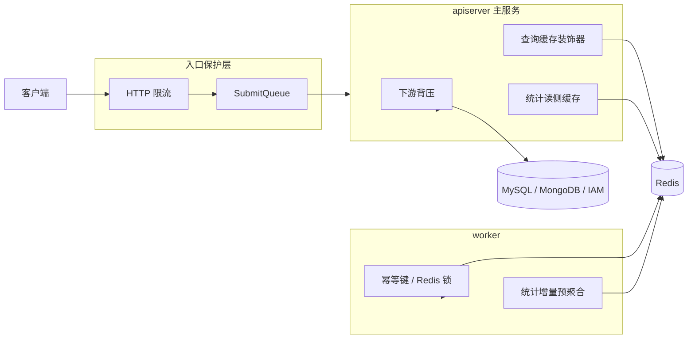

# 保护层与读侧架构：限流、背压、缓存、统计预聚合

本文介绍 `qs-server` 为什么要同时设计入口保护、依赖保护和读侧加速，而不是把性能问题理解成单一缓存问题。

## 30 秒了解系统

`qs-server` 当前并不是一个“严格的三级缓存系统”。  
更准确的理解方式是：

- 入口层先做限流和排队
- 服务层再做下游背压
- 读侧再用缓存和统计预聚合保护热点查询

也就是说，系统面对的不是单一瓶颈，而是三类不同压力：

- 突发入口流量
- 慢依赖堆积
- 热点读和统计查询

核心代码入口：

- [../../internal/pkg/middleware/limit.go](../../internal/pkg/middleware/limit.go)
- [../../internal/collection-server/application/answersheet/submit_queue.go](../../internal/collection-server/application/answersheet/submit_queue.go)
- [../../internal/pkg/backpressure/limiter.go](../../internal/pkg/backpressure/limiter.go)
- [../../internal/apiserver/server.go](../../internal/apiserver/server.go)
- [../../internal/apiserver/infra/cache](../../internal/apiserver/infra/cache)
- [../../internal/apiserver/infra/statistics/cache.go](../../internal/apiserver/infra/statistics/cache.go)
- [../../internal/worker/handlers](../../internal/worker/handlers)

## 核心架构

## 核心设计原则

- 入口压力要尽量在入口层被削平，而不是直接传给主业务服务。
- 慢依赖要在依赖层被保护，而不是让数据库连接池和外部服务被动扛压。
- 热点读要优先走缓存和预聚合，不要让每次查询都回扫主存储。
- 不同保护机制解决的是不同问题，不能把它们压成同一个“缓存层”概念。

## 当前保护层和读侧层各自负责什么

### 1. 入口限流

入口限流当前主要落在 `collection-server` 和 `apiserver` 的 Gin 中间件里：

- `Limit`
- `LimitByKey`

它负责保护高频提交和查询接口，避免单个用户或单个瞬时流量把入口直接打满。

### 2. 提交排队

限流之后，答卷提交还有一层 `SubmitQueue`。  
它负责吸收短时尖峰，让请求不至于直接把同步 gRPC 和后端写入全部压满。

这层的语义是“入口削峰”，不是“持久调度”。

### 3. 下游背压

`apiserver` 当前会给这些依赖注入 in-flight limiter：

- MySQL
- MongoDB
- IAM

这层解决的问题不是“入口太多”，而是“下游慢了以后，系统是否还能及时收缩并发，不把问题放大”。

### 4. 查询缓存

`apiserver` 当前已经对多类热点对象做了缓存装饰：

- 问卷
- 量表
- 测评详情
- 测评状态
- 受试者信息
- 计划信息

这层的目标是保护热点读和重复查询，不是替代主存储。

### 5. 统计预聚合

统计场景不是普通对象查询。当前系统会把：

- 事件幂等标记
- 日维度增量
- 累计值
- 分布信息
- 查询结果缓存

都沉到 Redis 这一层，再由同步服务周期性落回 MySQL。

因此统计模块的 Redis 使用方式，更接近“读侧模型 + 中间层”，不只是简单缓存。

## 为什么不把它简单概括成“三级缓存”

如果把这套设计直接概括成“三级缓存”，会有两个偏差。

第一，会把限流、排队和背压这些真正保护吞吐的能力忽略掉。  
但在当前系统里，前台提交能不能稳住，首先取决于入口保护，而不是某个缓存层级。

第二，会把统计预聚合误读成普通缓存。  
但统计 Redis 键不只是“查不到再回源”的缓存，它本身就是读侧模型的一部分。

所以更准确的理解方式不是“三级缓存”，而是：

- 入口保护层
- 依赖保护层
- 读侧加速层

这三层共同保护系统，而不是某一级缓存单独解决所有问题。

## 关键设计点

### 1. 保护入口和保护依赖是两件不同的事

入口限流和提交排队保护的是：

- HTTP 线程
- 前台流量尖峰
- 同步 gRPC 压力

下游背压保护的是：

- 数据库连接
- Mongo 操作并发
- IAM 调用堆积

这两层虽然都在“限压”，但对象完全不同。

### 2. 主查询缓存集中在 apiserver，而不是分散到每个进程

当前真正成体系的缓存装饰器都集中在 `apiserver`。  
这让缓存策略、TTL、命名空间、抖动和单飞都在一个地方统一管理，避免 `collection-server` 再长出第二套缓存真相。

### 3. worker 使用 Redis 的重点不是对象查询缓存

`worker` 使用 Redis 的主要目的更偏向：

- 事件幂等
- 分布式锁
- 统计增量写入

这和 `apiserver` 的对象读缓存不是同一种职责。

### 4. 统计是最典型的读侧模型场景

统计模块说明了一件事：  
在复杂查询场景里，单纯的“查库 + 缓存结果”是不够的，还需要事件驱动的预聚合和周期性落盘。

## 边界与注意事项

- 当前代码没有形成严格的 L1/L2/L3 本地内存缓存体系，主要缓存仍然集中在 Redis。
- `SubmitQueue` 是进程内内存队列，不应被理解成跨实例共享的持久消息系统。
- 下游背压目前接到的是 `MySQL / MongoDB / IAM`，不是所有依赖都已经统一接入。
- 统计模块的 Redis 层既承担缓存，也承担读侧中间层职责，理解它时不能只用“缓存命中率”视角。
