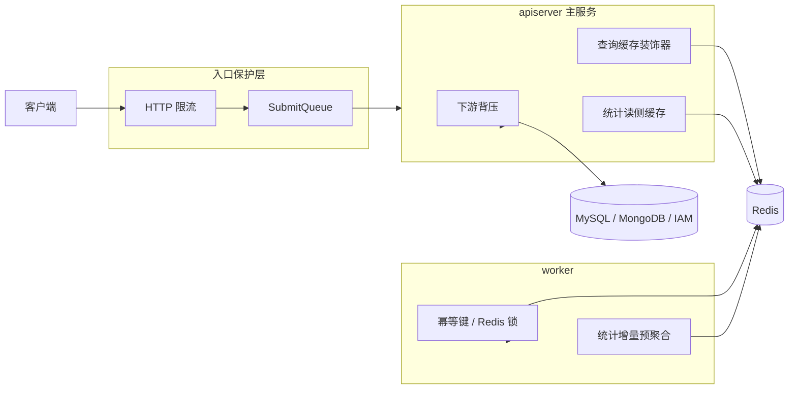
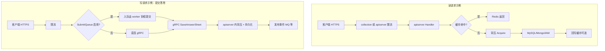
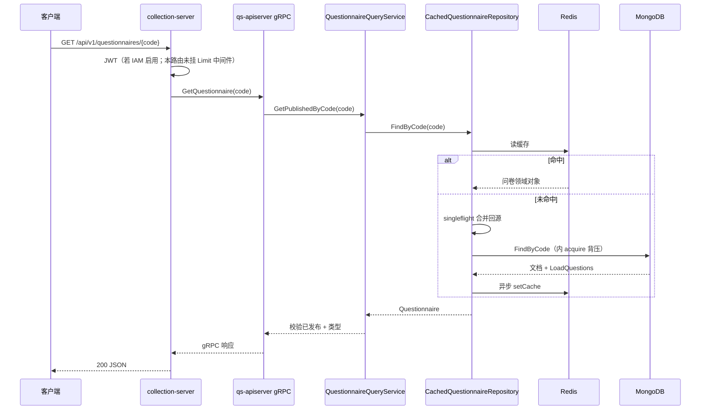
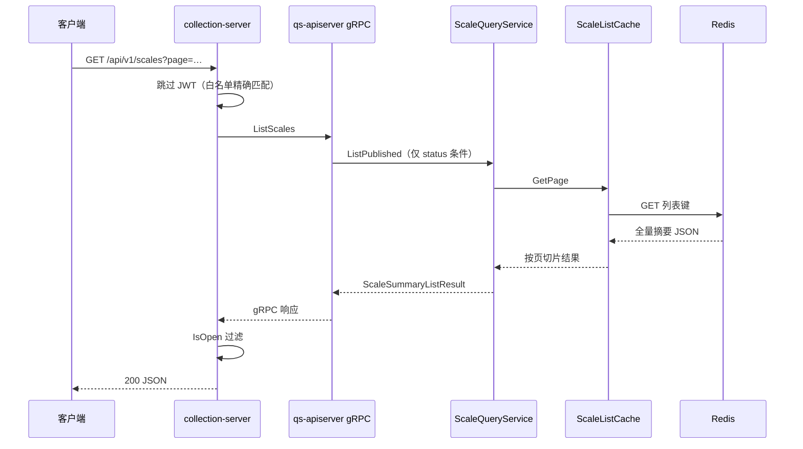

# 保护层与读侧架构：限流、背压、缓存、统计预聚合

**本文回答**：这篇专题解释 `qs-server` 为什么要同时设计入口保护、依赖保护和读侧加速三层机制，以及这些机制在代码里分别挂在哪里、解决什么压力、如何观测；本文先给结论和速查，再展开指标、链路、缓存与统计预聚合细节。

本文介绍 `qs-server` 为什么要同时设计**入口保护**、**依赖保护**和**读侧加速**，而不是把性能问题理解成单一缓存问题；并说明各机制在代码中的挂载位置与配置键。

**与前后专题互参**：异步链路上的 **SubmitQueue、MQ、worker 消费**见 [02-异步评估链路：从答卷提交到报告生成.md](./02-异步评估链路：从答卷提交到报告生成.md)（本篇只写 SubmitQueue 在「保护层」中的定位，机制细节链到 `02`）；三界模型见 [01-测评业务模型：survey、scale、evaluation 为什么分离.md](./01-测评业务模型：survey、scale、evaluation%20为什么分离.md)。

## 30 秒结论

如果只看一屏，先看下面这张表：

| 维度 | 结论 |
| ---- | ---- |
| 三层结构 | 入口层用 HTTP 限流和 SubmitQueue 挡住突发；依赖层用 in-flight 背压保护 MySQL/Mongo/IAM；读侧层用对象缓存和统计预聚合降低热点查询成本 |
| 关键配置 | 重点看 `rate_limit`、`submit_queue`、`backpressure.*`；具体数值以各环境 yaml 为准 |
| Redis 分工 | apiserver 主要做对象缓存和统计查询缓存；worker 主要做统计增量、幂等键和分布式锁，不是第二套对象缓存 |
| 路由事实 | 并非所有 GET 路由都挂 `Limit`；IAM 公开白名单是 path 精确匹配，不能想当然地按“整组路由”理解 |
| 观测入口 | 全局看 `/metrics` 与 Gin 指标；细查限流、缓存和背压时要结合结构化日志、request_id 和 Redis 键族 |
| 不要误解 | 这不是“三级缓存”专题，而是“保护层 + 读侧加速”专题；缓存只是其中一类手段 |

## 重点速查（继续往下读前先记这几条）

1. **三层分工**：入口（HTTP 限流、SubmitQueue）→ 依赖（MySQL/Mongo/IAM **in-flight 背压**）→ 读侧（apiserver **对象缓存** + **统计 Redis**；worker 侧 Redis 以锁/统计增量为主，**不是**第二套对象缓存）。  
2. **配置锚点**：`rate_limit`（collection/apiserver yaml）、`backpressure.*`（apiserver）、`submit_queue`（collection）；数字以环境为准，吞吐与压测与 [02](./02-异步评估链路：从答卷提交到报告生成.md) **互链**。  
3. **路由事实**：部分路由（如问卷/量表 **GET**）**未**挂 `Limit` 中间件；IAM **公开白名单**为 **path 精确匹配**，见「示例读链路」一节。  
4. **量表两种缓存**：**列表**多用 `ScaleListCache`（`scale:list:v1` 一类）；**单条按 code** 用 `CachedScaleRepository`（[scale_cache.go](../../internal/apiserver/infra/cache/scale_cache.go)），勿混为一谈。  
5. **观测入口**：HTTP 见 **Gin Prometheus `/metrics`**（需开启 `metrics`）；缓存命中/未命中见 **结构化日志**与 [infra/cache/metrics.go](../../internal/apiserver/infra/cache/metrics.go) 收集器；细节见下节「指标与日志索引」。

## 指标与日志索引（观测）

### HTTP 与进程级（Prometheus / Gin）

| 项 | 说明 |
| -- | ---- |
| 暴露方式 | [internal/pkg/server/genericapiserver.go](../../internal/pkg/server/genericapiserver.go)：`enableMetrics` 为真时安装 [go-gin-prometheus](https://github.com/zsais/go-gin-prometheus)，在 **Gin Engine** 上采集请求指标 |
| 路径 | 通常为 **`GET /metrics`**（与 apiserver/collection 的 **HTTP 监听端口** 同进程；若经网关，以实际路由为准） |
| 配置 | [configs/apiserver.dev.yaml](../../configs/apiserver.dev.yaml) 中 **`server.metrics`**（Gin `/metrics`）；collection 侧若有等价项以该服务 yaml 为准；**勿与** `iam.enable-metrics`（IAM gRPC 客户端指标）混淆 |
| 内容 | 以 **`gin_*`** 等为前缀的 HTTP 次数、延迟等（**具体系列名以 `/metrics` 抓取结果为准**）；用于看 **整体 QPS、5xx、延迟分布**，**不**直接区分「是否限流」——429 需结合 access 日志或网关 |

### 入口限流（429）

| 项 | 说明 |
| -- | ---- |
| 行为 | [limit.go](../../internal/pkg/middleware/limit.go) 超限返回 **429**，并设 **`Retry-After`** |
| 日志 | 依赖全局 **Gin / API 日志**中的状态码与 `request_id`；可检索 **`429`**、路径、`Limit exceeded`（`c.Error` 注入） |

### 下游背压（Acquire）

| 项 | 说明 |
| -- | ---- |
| 表现 | `Acquire` 等待槽位失败时随 **`ctx.Done()`** 返回；错误经仓储/应用层冒泡，**无统一 HTTP 码**（多为 5xx 或封装后的业务码） |
| 日志 | **MySQL/Mongo/IAM** 仓储路径上的错误日志；Mongo 见 [infra/mongo/base.go](../../internal/apiserver/infra/mongo/base.go) 调用链；调参对照 `backpressure.*.max_inflight` / `timeout_ms` |

### 对象缓存（命中 / 未命中 / 指标对象）

| 项 | 说明 |
| -- | ---- |
| 结构化日志（问卷示例） | [questionnaire_cache.go](../../internal/apiserver/infra/cache/questionnaire_cache.go)：`Questionnaire cache hit`、`Questionnaire cache miss`、`Questionnaire fallback to Mongo` 等 **Debugw** |
| 量表列表缓存 | [global_list_cache.go](../../internal/apiserver/application/scale/global_list_cache.go)：`failed to rebuild scale list cache`（**Warnw**，重建失败时） |
| 进程内指标结构 | [metrics.go](../../internal/apiserver/infra/cache/metrics.go)：`MetricsCollector` 维护 **hits/misses/errors** 与延迟聚合；经 [CacheManagerImpl.GetStats](../../internal/apiserver/infra/cache/cache_manager.go) 读出 **命中率等**（是否挂 HTTP 管理端取决于项目路由，**默认以代码内调用为准**） |

### 统计与 worker

| 项 | 说明 |
| -- | ---- |
| worker | [statistics_handler.go](../../internal/worker/handlers/statistics_handler.go)：`Redis cache is not available, skipping statistics update`（**Warn**） |
| Redis 键前缀 | 统计：[statistics/cache.go](../../internal/apiserver/infra/statistics/cache.go) 中 `stats:daily:` 等；量表列表键：`scale:list:v1`（经命名空间），见 [interface.go](../../internal/apiserver/infra/cache/interface.go) `BuildScaleListKey` |

**建议**：生产排障时 **先 `/metrics` 看全局** → **再按 request_id / path 查日志** → **最后对 Redis 键与 `backpressure` 配置做关联**；与 [02](./02-异步评估链路：从答卷提交到报告生成.md) 中 NSQ/异步指标 **互补**。

---

<!-- markdownlint-disable MD051 -->

## 目录

1. [30 秒结论](#30-秒结论)
2. [重点速查（继续往下读前先记这几条）](#重点速查继续往下读前先记这几条)
3. [指标与日志索引（观测）](#指标与日志索引观测)
4. [30 秒了解系统](#30-秒了解系统)
5. [三类压力与主要手段对照](#三类压力与主要手段对照)
6. [核心架构](#核心架构)
7. [请求路径：读链路与写链路](#请求路径读链路与写链路)
8. [核心设计原则](#核心设计原则)
9. [入口保护层：HTTP 限流与 SubmitQueue](#入口保护层http-限流与-submitqueue)
10. [依赖保护层：下游背压](#依赖保护层下游背压)
11. [读侧加速：对象查询缓存](#读侧加速对象查询缓存)
12. [示例读链路（问卷详情与量表列表对照）](#示例读链路问卷详情与量表列表对照)
13. [读侧加速：统计预聚合与 worker 写入](#读侧加速统计预聚合与-worker-写入)
14. [worker 中的 Redis（与 apiserver 对照）](#worker-中的-redis与-apiserver-对照)
15. [失败表现与可观测性](#失败表现与可观测性)
16. [与专题 02 的衔接（吞吐与压测）](#与专题-02-的衔接吞吐与压测)
17. [为什么不把它简单概括成「三级缓存」](#为什么不把它简单概括成三级缓存)
18. [关键设计点（概要）](#关键设计点概要)
19. [边界与注意事项](#边界与注意事项)

锚点以常见 Markdown 渲染器（如 GitHub）自动生成规则为准；若本地预览无法跳转，请用编辑器大纲视图导航。

<!-- markdownlint-enable MD051 -->

---

## 30 秒了解系统

`qs-server` **不是**「严格的三级缓存系统」。更准确的理解是三层**不同性质**的手段：

- **入口层**：HTTP 限流、（答卷路径上的）SubmitQueue，削平突发、保护同步 gRPC 与接入线程。
- **依赖层**：对 MySQL / MongoDB / IAM 的 **in-flight 背压**，下游慢时限制**同时占用的逻辑操作数**，避免把堆积放大到全链路。
- **读侧层**：apiserver 内 **对象查询缓存**（Redis）+ **统计预聚合**（Redis 键 + 增量）；worker 侧再用 Redis 做 **分布式锁**、**统计增量写入**等，与 apiserver 的对象读缓存**不是同一职责**。

系统面对的是三类压力：**突发入口**、**慢依赖堆积**、**热点读与统计查询**——应对方式见下一节对照表。

**核心代码入口（索引）**：

- [internal/pkg/middleware/limit.go](../../internal/pkg/middleware/limit.go)
- [internal/collection-server/routers.go](../../internal/collection-server/routers.go)、[internal/apiserver/routers.go](../../internal/apiserver/routers.go)
- [internal/collection-server/application/answersheet/submit_queue.go](../../internal/collection-server/application/answersheet/submit_queue.go)
- [internal/pkg/backpressure/limiter.go](../../internal/pkg/backpressure/limiter.go)、[internal/apiserver/server.go](../../internal/apiserver/server.go)
- [internal/pkg/database/mysql/base.go](../../internal/pkg/database/mysql/base.go)、[internal/apiserver/infra/mongo/base.go](../../internal/apiserver/infra/mongo/base.go)、[internal/apiserver/infra/iam/client.go](../../internal/apiserver/infra/iam/client.go)
- [internal/apiserver/infra/cache/](../../internal/apiserver/infra/cache/)
- [internal/apiserver/infra/statistics/cache.go](../../internal/apiserver/infra/statistics/cache.go)、[internal/worker/handlers/statistics_handler.go](../../internal/worker/handlers/statistics_handler.go)

---

## 三类压力与主要手段对照

| 压力类型 | 典型表现 | 主要手段 | 进程/位置 |
| -------- | -------- | -------- | ---------- |
| 突发入口流量 | 瞬时 QPS 冲高、单用户刷接口 | **令牌桶限流**（全局 + 按 key）、答卷路径 **SubmitQueue** | `collection-server` / `apiserver` Gin |
| 慢依赖堆积 | DB/IAM 变慢、连接占用拉长 | **in-flight 背压**（Acquire 信号量 + 超时） | `apiserver` 内 MySQL/Mongo/IAM 封装 |
| 热点读与统计查询 | 重复读问卷/量表、统计看板 | **对象缓存装饰器**、**统计 Redis 预聚合** + worker 增量写 | `apiserver` + `worker` 共用 Redis 时职责不同 |

---

## 核心架构

**读图提示**：

- **入口保护层**主要落在 **collection-server**（HTTP 限流、`SubmitQueue`）；图中 `API` 表示 **qs-apiserver**，经 gRPC 与 collection 对话，勿与「对外 REST」混淆。
- **下游背压、查询缓存、统计**以 **apiserver 进程内**为主；**worker** 侧 Redis 更偏锁、统计增量等，见下文专节。

---

## 请求路径：读链路与写链路

下图强调：**读**多在「限流 → 背压 → 缓存 → 存储」上短路；**写**（以答卷提交为例）在限流之后还可能经 **SubmitQueue**，且写路径会触发落库与事件（异步部分见 `02`）。

说明：读路径上 **背压**发生在真正访问 MySQL/Mongo/IAM 的仓储层；写路径上 **SubmitQueue** 的细节（202/429、幂等）见 [02](./02-异步评估链路：从答卷提交到报告生成.md)。

---

## 核心设计原则

- 入口压力尽量在**入口层**削平，而不是直接灌满 apiserver 的同步调用。
- 慢依赖在**依赖层**限并发，而不是仅靠连接池「硬扛」超时。
- 热点读优先走**缓存与预聚合**，避免每次打全表或重计算。
- 不同机制解决不同问题，不能合并成单一「缓存层」叙事。

---

## 入口保护层：HTTP 限流与 SubmitQueue

### HTTP 限流（429）

**实现**：[internal/pkg/middleware/limit.go](../../internal/pkg/middleware/limit.go)

| 中间件 | 作用 |
| ------ | ---- |
| `Limit(globalQPS, burst)` | 全局限流，基于 `golang.org/x/time/rate` 令牌桶；不通过则 **429**、`AbortWithStatus` |
| `LimitByKey(userQPS, burst, keyFn)` | 按 key（如用户 id）维护**独立**令牌桶；key 为空时用 `anonymous`；超限同样 **429** |

超限时会设置 **`Retry-After`**（见 `setRetryAfterHeader`，按 `Limiter.Reserve()` 估算延迟秒数）。

**路由挂载**：

- **collection-server**：[routers.go](../../internal/collection-server/routers.go) `rateLimitedHandlers` → 先 `Limit` 再 `LimitByKey`（`requestLimitKey`）；覆盖答卷提交/查询、测评列表、`wait-report` 等（同文件内 `registerAnswerSheetRoutes`、`registerEvaluationRoutes` 等）。
- **apiserver**：[routers.go](../../internal/apiserver/routers.go) 同样模式，覆盖管理端答卷、测评、受试者、计划、`batch-evaluate` 等大量路由。

**配置**：`configs/collection-server.*.yaml`、`configs/apiserver.*.yaml` 中 **`rate_limit`**（`enabled`、`submit_*`、`query_*`、`wait_report_*`、`admin_*` 等）。**全局与用户限流同时生效**，总吞吐通常受 **global** 约束更紧。具体 QPS 标称与压测建议见 [02](./02-异步评估链路：从答卷提交到报告生成.md)「分环节吞吐、QPS 标称与压力测试」。

### SubmitQueue（入口削峰）

**定位**：仅 **collection-server** 进程内、**内存** channel + 固定数量 worker，用于把「调 apiserver 保存答卷」从接入线程中拆出；**不是**跨实例队列。

**机制与边界**：详见 [02-异步评估链路](./02-异步评估链路：从答卷提交到报告生成.md) 文中的 **「提交排队：SubmitQueue 怎么排」** 一节。本篇只强调：在保护层叙事里，它是 **限流之后**、**同步 gRPC 之前**的一层 **削峰**；与 **MQ**（进程间）语义不同。

**配置**：`configs/collection-server.*.yaml` 的 `submit_queue`（`enabled`、`queue_size`、`worker_count`、`wait_timeout_ms`）。

---

## 依赖保护层：下游背压

### 要解决什么问题

入口限流管的是 **HTTP 请求速率**；**背压**管的是：在 apiserver 内部，**同时有多少个逻辑操作**在占用 MySQL / MongoDB / IAM——避免下游变慢时仍无限并发调用，把延迟和错误级联放大。

### 实现与初始化

- **Limiter 实现**：[internal/pkg/backpressure/limiter.go](../../internal/pkg/backpressure/limiter.go)：`sem chan struct{}` 容量 = `maxInflight`，`Acquire` 在拿到槽位前阻塞；可配合 `timeoutMs` 与 context 截止时间。
- **启动注入**：[internal/apiserver/server.go](../../internal/apiserver/server.go) `PrepareRun`：若 `config.Backpressure.{MySQL,Mongo,IAM}.Enabled`，则分别 `SetLimiter(NewLimiter(MaxInflight, timeout))`。
- **接入点**：
  - **MySQL**：[internal/pkg/database/mysql/base.go](../../internal/pkg/database/mysql/base.go) 中仓储路径通过 `acquire(ctx)` 再访问 DB。
  - **MongoDB**：[internal/apiserver/infra/mongo/base.go](../../internal/apiserver/infra/mongo/base.go) 同样在仓储路径 `acquire`。
  - **IAM**：[internal/apiserver/infra/iam/client.go](../../internal/apiserver/infra/iam/client.go) 在对外调用前 `acquire`。

**配置结构**：[internal/apiserver/options/options.go](../../internal/apiserver/options/options.go) `BackpressureOptions`；YAML 键 **`backpressure.mysql|mongo|iam`**：`enabled`、`max_inflight`、`timeout_ms`。示例见 [configs/apiserver.dev.yaml](../../configs/apiserver.dev.yaml)（约 `backpressure:` 段）。

### 与连接池的关系（概念上）

连接池限制**连接数**；背压 limiter 限制**同时使用这些连接推进的业务操作并发**。二者都缓解堆积，但**对象不同**，文档与调参时勿混为一谈。

---

## 读侧加速：对象查询缓存

### 组织方式

- **目录**：[internal/apiserver/infra/cache/](../../internal/apiserver/infra/cache/)：各 `*_cache.go` 为领域对象装饰器；[cache_manager.go](../../internal/apiserver/infra/cache/cache_manager.go) 管理统计与批量清理接口；[singleflight.go](../../internal/apiserver/infra/cache/singleflight.go) 防缓存击穿；[namespace.go](../../internal/apiserver/infra/cache/namespace.go) 键命名空间；[metrics.go](../../internal/apiserver/infra/cache/metrics.go) 指标。
- **TTL 与抖动**：[ttl_config.go](../../internal/apiserver/infra/cache/ttl_config.go)：`ApplyTTLOptions` 可在启动时覆盖默认 TTL；`JitterTTL` 对 TTL 做比例抖动，减轻**同时失效**。

### 默认 TTL（代码常量，可被启动配置覆盖）

| 对象/场景 | 默认 TTL（代码中变量） | 实现文件（节选） |
| --------- | ---------------------- | ---------------- |
| 量表 | 24h（`DefaultScaleCacheTTL`） | [scale_cache.go](../../internal/apiserver/infra/cache/scale_cache.go) |
| 问卷 | 12h（`DefaultQuestionnaireCacheTTL`） | [questionnaire_cache.go](../../internal/apiserver/infra/cache/questionnaire_cache.go) |
| 测评详情 | 2h（`DefaultAssessmentDetailCacheTTL`） | [assessment_detail_cache.go](../../internal/apiserver/infra/cache/assessment_detail_cache.go) |
| 测评状态 | 30m（`AssessmentStatusCacheTTL`） | [assessment_status_cache.go](../../internal/apiserver/infra/cache/assessment_status_cache.go) |
| 「我的测评」列表 | 10m（`MyAssessmentListCacheTTL`） | [my_assessment_list_cache.go](../../internal/apiserver/infra/cache/my_assessment_list_cache.go) |
| 受试者 | 2h（`DefaultTesteeCacheTTL`） | [testee_cache.go](../../internal/apiserver/infra/cache/testee_cache.go) |
| 计划 | 2h（`DefaultPlanCacheTTL`） | [plan_cache.go](../../internal/apiserver/infra/cache/plan_cache.go) |
| 空值/防穿透 | 5m（`NegativeCacheTTL`） | 多处用于未命中时的短 TTL 占位 |

**设计判断**：成体系的对象读缓存集中在 **apiserver**，避免 **collection-server** 再维护第二套对象缓存真相；collection 仍以 **限流 + SubmitQueue + gRPC** 为主。

---

## 示例读链路（问卷详情与量表列表对照）

下面两条均为 **C 端常见读路径**，对照 **鉴权白名单**、**缓存落点**（注意：**量表列表**与**单条量表**不是同一套缓存文件）。

### GET 问卷详情（按 `code`）

**可逐文件核对**：按问卷编码拉**已发布**问卷详情（含题目）；**缓存与背压均在 apiserver**；collection 仅 **BFF + gRPC**。

#### REST 与鉴权（问卷）

| 步骤 | 位置 | 说明 |
| ---- | ---- | ---- |
| 路由 | [collection-server/routers.go](../../internal/collection-server/routers.go) `GET /api/v1/questionnaires/:code` | 注册于 `registerQuestionnaireRoutes`；**当前代码未对该组路由挂 `rateLimitedHandlers`**（与答卷等路由不同），入口限流若在网关层仍可能存在 |
| Handler | [questionnaire_handler.go](../../internal/collection-server/interface/restful/handler/questionnaire_handler.go) `Get` | 从 path 取 `code`，调用 `QueryService.Get` |
| BFF | [application/questionnaire/query_service.go](../../internal/collection-server/application/questionnaire/query_service.go) `Get` | **`questionnaireClient.GetQuestionnaire`**（gRPC），无本地对象缓存 |
| IAM | 同 [routers.go](../../internal/collection-server/routers.go) `applyIAMAuth(..., isPublicScaleReadOnly)` | 启用 IAM 时，问卷路由**不在** `isPublicScaleReadOnly` 的 path 白名单（白名单目前为 `/api/v1/scales`、`/api/v1/scales/categories` 等），**默认需要 JWT**；以部署是否启用 IAM 为准。 |

#### gRPC（apiserver）

| 步骤 | 位置 | 说明 |
| ---- | ---- | ---- |
| 服务 | [interface/grpc/service/questionnaire.go](../../internal/apiserver/interface/grpc/service/questionnaire.go) `GetQuestionnaire` | 调用应用层 `GetPublishedByCode`；仅允许 **医学量表**且**已发布**，否则 `NotFound` |

#### 应用层 → 仓储

| 步骤 | 位置 | 说明 |
| ---- | ---- | ---- |
| 用例 | [application/survey/questionnaire/query_service.go](../../internal/apiserver/application/survey/questionnaire/query_service.go) `GetPublishedByCode` → `findQuestionnaireByCode` → **`repo.FindByCode`** | 校验已发布在应用层完成 |
| 缓存装饰器 | [infra/cache/questionnaire_cache.go](../../internal/apiserver/infra/cache/questionnaire_cache.go) `CachedQuestionnaireRepository.FindByCode` | ① **Redis** 按 `questionnaire:{code}`（及命名空间）尝试命中，默认 TTL 见上表 **12h**；② 未命中则用 **`Group.Do("questionnaire:"+code, ...)`**（[singleflight.go](../../internal/apiserver/infra/cache/singleflight.go)）合并回源；③ 命中 Mongo 后 **异步** `setCache` 回写 |

#### MongoDB 与背压

| 步骤 | 位置 | 说明 |
| ---- | ---- | ---- |
| 实现仓储 | [infra/mongo/questionnaire/repo.go](../../internal/apiserver/infra/mongo/questionnaire/repo.go) `FindByCode` | `FindBaseByCode` + `LoadQuestions` |
| 背压 | [infra/mongo/base.go](../../internal/apiserver/infra/mongo/base.go) | `FindOne` / `InsertOne` 等路径在操作前 **`acquire(ctx)`**，受 `backpressure.mongo` 约束（见上文「依赖保护层」） |

#### 时序简图（问卷）

**要点**：collection 本条**未挂** `Limit`；**对象缓存 + 单飞**在 `questionnaire_cache`；**Mongo 背压**在 `acquire`。**MySQL 本条不经过**。

---

### 对照：GET 量表列表（`GET /api/v1/scales`）

**场景**：分页拉**已发布量表摘要**（无因子详情），常用于首页/广场；在 IAM 开启时，该路径落在 **公开只读白名单**上，可**匿名访问**（与问卷详情不同）。

#### REST 与鉴权（量表列表）

| 步骤 | 位置 | 说明 |
| ---- | ---- | ---- |
| 路由 | [collection-server/routers.go](../../internal/collection-server/routers.go) `registerScaleRoutes` → **`GET /api/v1/scales`** | 与 `GET /categories`、`GET /:code` 同组；**未挂** `rateLimitedHandlers` |
| 白名单 | 同文件 `isPublicScaleReadOnly` | 对 **GET** 且 path（去尾 `/` 后）**精确等于** `/api/v1/scales` 或 `/api/v1/scales/categories` 时 **跳过 JWT**；**`GET /api/v1/scales/{code}` 不在白名单**，仍需 JWT |
| Handler | [scale_handler.go](../../internal/collection-server/interface/restful/handler/scale_handler.go) `List` | `QueryService.List` |
| BFF | [application/scale/query_service.go](../../internal/collection-server/application/scale/query_service.go) `List` | **`scaleClient.ListScales`**（gRPC）；collection 侧再过滤「开放主类」`IsOpen()` |

#### gRPC 与应用层

| 步骤 | 位置 | 说明 |
| ---- | ---- | ---- |
| gRPC | [interface/grpc/service/scale.go](../../internal/apiserver/interface/grpc/service/scale.go) `ListScales` | 组装 `ListScalesDTO`（含 status/title/category 等），调用 **`queryService.ListPublished`** |
| 列表逻辑 | [application/scale/query_service.go](../../internal/apiserver/application/scale/query_service.go) `ListPublished` | 强制 `conditions["status"]=published` 后：若 **`len(conditions)==1`**（仅有状态）且 **`listCache != nil`**，先 **`listCache.GetPage(page, pageSize)`**；未命中再走 **`repo.FindSummaryList` + `CountWithConditions`**；纯列表回源后会 **异步 `listCache.Rebuild`** 尝试回填 Redis |

#### 缓存：`ScaleListCache` 与 `scale_cache.go` 的分工

| 能力 | 文件 | 说明 |
| ---- | ---- | ---- |
| **整表已发布列表**（按页切片） | [application/scale/global_list_cache.go](../../internal/apiserver/application/scale/global_list_cache.go) `ScaleListCache` | Redis 键由 [CacheKeyBuilder](../../internal/apiserver/infra/cache/) `BuildScaleListKey()` 生成（注释中称 `scale:list:v1` 一类）；默认 TTL **约 10m**（`defaultScaleListCacheTTL`），带 **节点内短 TTL 内存**（约 30s）减轻 Redis/JSON 开销 |
| **单条量表按 code** | [infra/cache/scale_cache.go](../../internal/apiserver/infra/cache/scale_cache.go) `CachedScaleRepository.FindByCode` | 用于 **`GetScale` / GetPublishedByCode** 等**单条**路径，默认 TTL **24h**，模式与问卷缓存类似（Redis + singleflight 回源） |

因此：你提到的 **`scale_cache.go`** 对应的是 **按 code 读单条量表**；**公开列表**在代码里主要走 **`ScaleListCache`**（应用层），二者同属「量表读侧加速」，但**不要混为一个文件**。

**带筛选条件时**：gRPC 若传入 category、title、stage 等，`ListScales` 会写入 `dto.Conditions`，使 **`len(conditions) > 1`**，此时 **`ListPublished` 不会走 `GetPage` 快捷路径**，直接 **Mongo `FindSummaryList`**（仍经 `infra/mongo` 的 **`acquire` 背压**）。

#### 时序简图（量表列表，无额外筛选且列表缓存命中）

---

## 读侧加速：统计预聚合与 worker 写入

### Redis 中的角色

[internal/apiserver/infra/statistics/cache.go](../../internal/apiserver/infra/statistics/cache.go) 封装 **日维度**、**窗口**、**累计**、**分布** 等键（如 `stats:daily:...` 使用 Hash、`HIncrBy`、TTL）。这些键不仅是「查不到再回源」的 cache，更是**读侧统计模型**的一部分。

### 写入路径：worker 与 apiserver 共用同一封装

[internal/worker/handlers/statistics_handler.go](../../internal/worker/handlers/statistics_handler.go) 在消费 **`assessment.submitted` / `assessment.interpreted`** 等事件时，使用 **`statisticsCache.NewStatisticsCache(deps.RedisCache)`**（与 apiserver 侧同一包）调用 `IncrementDailyCount`、`IncrementWindowCount`、`IncrementAccumCount`、`IncrementDistribution` 等。

因此：**统计 Redis 的增量写入**主要在 **worker** 事件路径；**查询聚合结果**多在 **apiserver** 读路径（具体 API 以路由与应用服务为准）。Redis 不可用时 handler 会打日志并 **跳过统计更新**，不阻塞主业务（见该文件内判断）。

---

## worker 中的 Redis（与 apiserver 对照）

| 用途 | 说明 | 代码入口（示例） |
| ---- | ---- | ---------------- |
| 分布式锁 | 处理消息时防并发重入（如答卷相关） | [answersheet_handler.go](../../internal/worker/handlers/answersheet_handler.go) + [internal/worker/infra/redislock/](../../internal/worker/infra/redislock/) |
| 统计预聚合写入 | 与上一节相同，**写 Redis 统计键** | [statistics_handler.go](../../internal/worker/handlers/statistics_handler.go) |
| 对象读缓存 | **不在此做**与 apiserver 同级的问卷/量表装饰缓存 | — |

**dependencies 注入**：worker 容器侧见 [handlers/registry.go](../../internal/worker/handlers/registry.go) 中 `RedisCache` 等字段。

---

## 失败表现与可观测性

| 机制 | 典型表现 | 排查线索 |
| ---- | -------- | -------- |
| HTTP 限流 | **429**，带 `Retry-After` | 对比 `rate_limit` 与真实 QPS；区分 global 与 per-user |
| SubmitQueue 满 / 超时 | **429**（队列满）或 **202**（等待超时） | [02](./02-异步评估链路：从答卷提交到报告生成.md) 与 `submit_queue` 配置 |
| 下游背压 | `Acquire` 侧 context 取消/超时，错误随仓储冒泡到 API | `backpressure.*.max_inflight`、`timeout_ms`；MySQL/Mongo/IAM 慢查询与耗时 |
| 缓存 | 命中下降 → 下游读增多 | Redis 延迟、键空间、`infra/cache` 指标（若启用） |
| 统计 Redis | worker 日志中 Redis 不可用 | Redis 连接与 `statistics_handler` 跳过逻辑 |

---

## 与专题 02 的衔接（吞吐与压测）

- **HTTP 入口 QPS、SubmitQueue、与压测脚本**：以 [02](./02-异步评估链路：从答卷提交到报告生成.md)「分环节吞吐、QPS 标称与压力测试」为准，**避免在两篇文档各写一套冲突数字**。
- **本篇独有**：读多写少场景下，关注 **Redis 内存与热点键**、**缓存命中率**、**统计增量是否与事件量匹配**；可在压测报告中单独加「读接口」小节。

---

## 为什么不把它简单概括成「三级缓存」

若概括成「三级缓存」，容易忽略 **限流、排队、背压** 这些非缓存手段；也容易把 **统计 Redis** 误读成普通 cache——而它同时是 **读侧模型与预聚合存储**。

更准确的分法是：

- **入口保护层**（HTTP + SubmitQueue）
- **依赖保护层**（in-flight 背压）
- **读侧加速层**（对象缓存 + 统计预聚合，外加 worker 对统计的写入）

---

## 关键设计点（概要）

- **保护入口 ≠ 保护依赖**：前者管 HTTP/接入与同步 gRPC 压力，后者管 DB/IAM 并发占用。
- **对象读缓存集中在 apiserver**，TTL、命名空间、单飞、抖动在一处演进。
- **worker 的 Redis** 侧重锁与统计增量，**不是**第二套对象缓存层。
- **统计**典型地需要 **事件驱动增量 + Redis + 查询读聚合**，不是「查库 + 缓存字符串」一种模式能概括。

---

## 边界与注意事项

- 当前**没有**形成严格的本地 L1/L2/L3 内存缓存体系，主要仍依赖 **Redis**（及进程内单飞等）。
- `SubmitQueue` **仅进程内**、**不跨实例**；与 MQ 的边界见 `02`。
- **下游背压**当前接入 **MySQL、MongoDB、IAM**；其他外部依赖**未**统一接入同一套 limiter，扩写时勿过度推广。
- **统计 Redis**：评估时不能只看命中率，还要看**键语义、增量是否与业务事件一致**。
- **配置数字**以各环境 `configs/*.yaml` 为准；文档中的默认值仅帮助理解选项结构。

---

*写作约定见 [CONTRIBUTING-DOCS.md](../CONTRIBUTING-DOCS.md)。*
