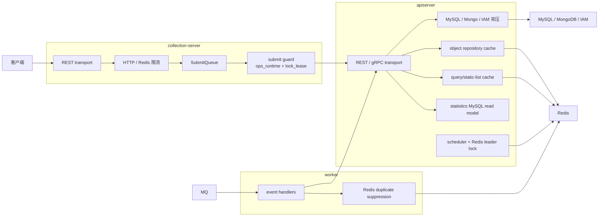

# 保护层与读侧架构：限流、背压、缓存、统计读模型

**本文回答**：`qs-server` 为什么同时需要入口限流、SubmitQueue、下游背压、Redis 读侧缓存和统计读模型；这些能力分别在 collection-server、apiserver、worker 中承担什么角色；当前 worker Redis 角色是什么。

## 30 秒结论

| 维度 | 当前结论 |
| ---- | -------- |
| 三层保护 | 入口保护、依赖保护、读侧加速分别解决不同压力，不能混成“三级缓存” |
| 入口保护 | collection-server 和 apiserver 使用 HTTP 限流；答卷提交路径还有 collection 本地 SubmitQueue |
| 依赖保护 | apiserver 对 MySQL、MongoDB、IAM 使用 in-flight 背压 |
| 读侧加速 | apiserver 拥有对象缓存、查询缓存、static-list cache、statistics query cache |
| 统计读模型 | 当前是 MySQL 统计读模型 + apiserver query cache；worker 不再承担 Redis 统计增量写入 |
| worker Redis | 当前主要是 `lock_lease`，用于事件处理重复抑制 |
| 详细 Redis 真值 | 以 [03-基础设施/12-Redis文档中心](../03-基础设施/12-Redis文档中心.md) 为入口 |

## 全景图

## 第一层：入口保护

### HTTP 限流

核心实现：

- [internal/pkg/middleware/limit.go](../../internal/pkg/middleware/limit.go)

当前挂载点：

- apiserver REST transport：[internal/apiserver/transport/rest](../../internal/apiserver/transport/rest)
- collection-server REST transport：[internal/collection-server/transport/rest/router.go](../../internal/collection-server/transport/rest/router.go)

当前语义：

- `Limit` 提供全局令牌桶。
- `LimitByKey` 提供按用户/IP 等 key 的令牌桶。
- 超限返回 `429` 并设置 `Retry-After`。
- collection-server 可使用 Redis 分布式限流；`ops_runtime` 不可用时回退到本地限流。

### SubmitQueue

核心实现：

- [internal/collection-server/application/answersheet/submit_queue.go](../../internal/collection-server/application/answersheet/submit_queue.go)

当前语义：

- 仅 collection-server 进程内。
- 使用内存 channel + worker 做答卷提交削峰。
- 不是跨实例持久队列，也不是 Redis Streams。
- 和 MQ 不同：SubmitQueue 是入口削峰，MQ 是后续异步事件分发。

## 第二层：依赖保护

核心实现：

- [internal/pkg/backpressure/limiter.go](../../internal/pkg/backpressure/limiter.go)
- apiserver 注入点：[internal/apiserver/process/resource_bootstrap.go](../../internal/apiserver/process/resource_bootstrap.go)

当前接入：

| 依赖 | 接入点 |
| ---- | ------ |
| MySQL | [internal/pkg/database/mysql/base.go](../../internal/pkg/database/mysql/base.go) |
| MongoDB | [internal/apiserver/infra/mongo/base.go](../../internal/apiserver/infra/mongo/base.go) |
| IAM | [internal/apiserver/infra/iam/client.go](../../internal/apiserver/infra/iam/client.go) |

背压限制的是“同时占用下游资源推进的逻辑操作数”，不是 HTTP QPS，也不是数据库连接池本身。

## 第三层：读侧加速

### apiserver object cache

当前 object repository cache 只在 `apiserver`：

- [internal/apiserver/infra/cache](../../internal/apiserver/infra/cache)
- [internal/apiserver/infra/cacheentry](../../internal/apiserver/infra/cacheentry)
- [internal/apiserver/infra/cachepolicy](../../internal/apiserver/infra/cachepolicy)

典型对象：

| 对象 | 文件 |
| ---- | ---- |
| scale | [scale_cache.go](../../internal/apiserver/infra/cache/scale_cache.go) |
| questionnaire | [questionnaire_cache.go](../../internal/apiserver/infra/cache/questionnaire_cache.go) |
| assessment_detail | [assessment_detail_cache.go](../../internal/apiserver/infra/cache/assessment_detail_cache.go) |
| testee | [testee_cache.go](../../internal/apiserver/infra/cache/testee_cache.go) |
| plan | [plan_cache.go](../../internal/apiserver/infra/cache/plan_cache.go) |

模式：

- repository decorator
- read-through
- negative cache 如适用
- async writeback 如适用
- 写后删或重建

### query/list cache

当前 query/list 主路径：

- [internal/apiserver/infra/cachequery](../../internal/apiserver/infra/cachequery)
- [internal/apiserver/application/scale/global_list_cache.go](../../internal/apiserver/application/scale/global_list_cache.go)
- [internal/apiserver/infra/statistics/cache.go](../../internal/apiserver/infra/statistics/cache.go)

关键差异：

- `ScaleListCache` 是 application 层 static-list rebuilder，缓存全量发布列表快照，再按页切片。
- `MyAssessmentListCache` 使用 version token + versioned key。
- statistics query cache 使用 `cacheentry` + `cachequery`，对外仍保持 TTL 驱动和 warmup 重建。

### hotset 与 warmup

治理相关读侧能力：

- target model：[internal/apiserver/cachetarget/target.go](../../internal/apiserver/cachetarget/target.go)
- hotset store：[internal/apiserver/infra/cachehotset/store.go](../../internal/apiserver/infra/cachehotset/store.go)
- coordinator：[internal/apiserver/application/cachegovernance/coordinator.go](../../internal/apiserver/application/cachegovernance/coordinator.go)
- internal REST：[internal/apiserver/transport/rest/routes_statistics.go](../../internal/apiserver/transport/rest/routes_statistics.go)

hotset 是治理候选，不是业务正确性的来源。

## 统计读模型

当前统计链路应理解为：

- worker 消费业务事件，调用 apiserver gRPC 推进业务处理。
- apiserver 的 statistics sync 从业务表重建 MySQL 统计读模型。
- apiserver statistics query cache 对统计查询结果做 Redis 缓存和 warmup。

代码：

- [internal/apiserver/application/statistics/sync_service.go](../../internal/apiserver/application/statistics/sync_service.go)
- [internal/apiserver/runtime/scheduler/statistics_sync.go](../../internal/apiserver/runtime/scheduler/statistics_sync.go)
- [internal/apiserver/infra/statistics/cache.go](../../internal/apiserver/infra/statistics/cache.go)

当前不再描述为“worker 向 Redis 写统计增量”。如果文档或排障手册中还出现 `event:processed:*`、`stats:daily:*` 等旧运行时假设，应视为历史漂移。

## worker 中的 Redis

当前 worker Redis 角色是锁与重复抑制：

- [internal/worker/process/resource_bootstrap.go](../../internal/worker/process/resource_bootstrap.go)
- [internal/worker/handlers/answersheet_handler.go](../../internal/worker/handlers/answersheet_handler.go)
- [internal/pkg/redislock](../../internal/pkg/redislock)

worker 不拥有：

- 问卷/量表 object cache。
- statistics query cache。
- Redis 统计增量写入模型。

## 排障速查

| 现象 | 优先看 |
| ---- | ------ |
| `429` | [internal/pkg/middleware/limit.go](../../internal/pkg/middleware/limit.go)、REST transport、`rate_limit` 配置 |
| 答卷提交削峰 | SubmitQueue 配置与 [submit_queue.go](../../internal/collection-server/application/answersheet/submit_queue.go) |
| DB/Mongo/IAM 慢 | backpressure 配置与对应 base/client |
| 热点读慢 | Redis family status、`infra/cache`、`cachequery`、`cacheentry` |
| 统计查询慢 | statistics MySQL read model、[infra/statistics/cache.go](../../internal/apiserver/infra/statistics/cache.go)、scheduler |
| worker 重复处理 | `answersheet_processing` lock、worker handler 日志 |
| collection 重复提交 | [submit_guard.go](../../internal/collection-server/infra/redisops/submit_guard.go) |

## 边界与注意事项

- 入口限流、SubmitQueue、背压、缓存解决的是不同压力，不应互相替代。
- collection-server 的 Redis 侧重入口保护和提交幂等，不是读缓存平台。
- apiserver 是 Redis cache 和 cache governance 的主进程。
- Redis lock 没有自动续租或 fencing token；长任务需要单独评估 TTL 和失败语义。
- 统计查询缓存不是统计事实来源；统计事实仍来自 MySQL 统计读模型与业务数据重建。

---

*写作约定见 [CONTRIBUTING-DOCS.md](../CONTRIBUTING-DOCS.md)。*
