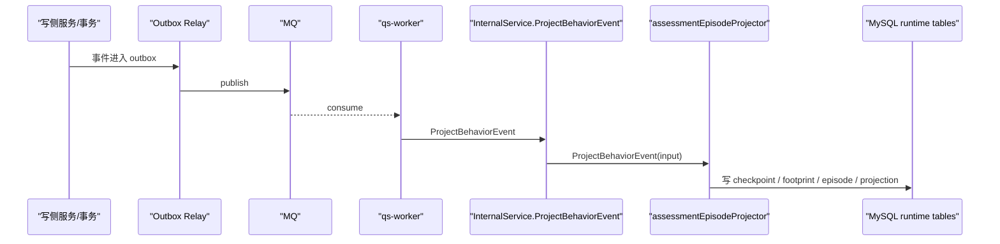

# 行为投影与assessment_episode：当前 projector 方案

**本文回答**：`qs-server` 里当前这套 behavior projector 到底在做什么、`behavior_footprint` / `assessment_episode` / `analytics_pending_event` 分别承担什么职责、为什么会有后台 reconcile 轮询、`assessment_episode record not found` 这类日志到底意味着什么。

相关文档：

- [../02-业务模块/06-statistics.md](../02-业务模块/06-statistics.md)
- [02-异步评估链路：从答卷提交到报告生成.md](./02-异步评估链路：从答卷提交到报告生成.md)
- [../04-接口与运维/05-事故复盘：2026-04-16 qs.evaluation.lifecycle 积压与 30 秒尾延迟.md](../04-接口与运维/05-事故复盘：2026-04-16%20qs.evaluation.lifecycle%20积压与%2030%20秒尾延迟.md)

---

## 30 秒结论

如果只记一屏，先记住下面这张表：

| 维度 | 当前事实 |
| ---- | -------- |
| projector 作用 | 把行为事件投影成 `behavior_footprint`、`assessment_episode` 和 `analytics_projection_*` |
| 真正创建 `assessment_episode` 的事件 | `footprint.answersheet_submitted` |
| 后续补状态的事件 | `footprint.assessment_created`、`footprint.report_generated`、`assessment.failed` |
| 为什么会有 pending | 事件允许乱序到达，后序事件可能先到，前序 episode 还不存在 |
| 后台轮询器查什么 | 查 `analytics_pending_event`，不是直接扫 `assessment_episode` |
| `record not found` 日志的真实含义 | 当前归因还没完成，不等于数据库异常 |
| 当前设计的核心问题 | `assessment_episode` 这种服务主状态由异步投影维护，天然需要补偿 |

---

## 先抓住这套设计要解决的问题

当前系统不仅要记录“评估主数据”，还要回答下面这类过程问题：

- 某个 `testee` 是通过哪个 `entry` 接入的
- 某次答卷提交最终对应哪个 `assessment`
- 这次测评是否已经生成报告，还是失败结束
- 这次测评应该归因到哪个 clinician / entry
- 某天机构、clinician、entry 的接入与完成情况分别是多少

为了回答这些问题，系统额外维护了两层运行时事实：

1. `behavior_footprint`
2. `assessment_episode`

然后再把这些事实继续汇总成：

3. `analytics_projection_org_daily`
4. `analytics_projection_clinician_daily`
5. `analytics_projection_entry_daily`

当前 projector 就是这三层之间的桥。

---

## 这套方案里的 5 张关键表

### 1. `behavior_footprint`

行为事件事实表，一行代表一个已经发生的行为。

典型事件包括：

- `entry_opened`
- `intake_confirmed`
- `testee_profile_created`
- `care_relationship_established`
- `care_relationship_transferred`
- `answersheet_submitted`
- `assessment_created`
- `report_generated`

表结构见：

- [../../internal/pkg/migration/migrations/mysql/000021_add_journey_projection_runtime.up.sql](../../internal/pkg/migration/migrations/mysql/000021_add_journey_projection_runtime.up.sql)
- [../../internal/apiserver/infra/mysql/statistics/po_journey.go](../../internal/apiserver/infra/mysql/statistics/po_journey.go)

### 2. `assessment_episode`

测评服务流程表，一行代表“一次答卷提交及其后续测评命运”。

核心字段包括：

- `answersheet_id`
- `assessment_id`
- `report_id`
- `submitted_at`
- `assessment_created_at`
- `report_generated_at`
- `failed_at`
- `status`
- `entry_id`
- `clinician_id`

它不是原始业务主表，而是一个**服务过程视角的 runtime 事实表**。

### 3. `analytics_projection_*`

日粒度分析投影表，按：

- org
- clinician
- entry

聚合各种行为和 episode 结果。

projector 在处理事件时，会边写事实、边增量更新这些投影。

### 4. `analytics_projector_checkpoint`

projector 的事件 checkpoint / 幂等表。

它的作用是：

- 防止同一个 `event_id` 被重复投影
- 记录这条事件当前是 `processing / pending / completed`

### 5. `analytics_pending_event`

projector 的补偿队列表。

当事件因为归因前提不满足而暂时无法完成时，会把事件 payload 落到这里，等待后台任务重试。

---

## 当前哪些事件会进入 projector

这套 projector 不是直接订阅数据库，而是消费业务侧已经产生好的领域事件。

### 事件来源总览

| 事件 | 来源 | 当前落点 |
| ---- | ---- | -------- |
| `footprint.entry_opened` | assessment entry resolve | `behavior_footprint` + org/clinician/entry projection |
| `footprint.intake_confirmed` | entry intake | `behavior_footprint` + projection + episode 重新归因 |
| `footprint.testee_profile_created` | intake 时新建 testee | `behavior_footprint` + projection |
| `footprint.care_relationship_established` | intake 时建立关系 | `behavior_footprint` + projection |
| `footprint.care_relationship_transferred` | clinician transfer | `behavior_footprint` + projection |
| `footprint.answersheet_submitted` | Mongo durable submit | `behavior_footprint` + 创建 episode |
| `footprint.assessment_created` | assessment submit | `behavior_footprint` + 补 episode 的 assessment 字段 |
| `footprint.report_generated` | report save success | `behavior_footprint` + 补 episode 完成态 |
| `assessment.failed` | assessment fail | 补 episode failed 态 |

### 这些事件是怎么进来的

#### assessment entry 相关事件

在 assessment entry 业务写侧，会通过 `behaviorEventStager` 把行为事件写到 MySQL outbox：

- [../../internal/apiserver/application/actor/assessmententry/service.go](../../internal/apiserver/application/actor/assessmententry/service.go)
- [../../internal/apiserver/application/statistics/journey.go](../../internal/apiserver/application/statistics/journey.go)

对应事件：

- `StageEntryOpened`
- `StageIntakeConfirmed`
- `StageTesteeProfileCreated`
- `StageCareRelationshipEstablished`

#### clinician relation transfer 事件

在关系转移写侧，会写：

- `StageCareRelationshipTransferred`

代码：

- [../../internal/apiserver/application/actor/clinician/relationship_service.go](../../internal/apiserver/application/actor/clinician/relationship_service.go)

#### answersheet submitted 事件

答卷保存成功后，在 Mongo durable submit 事务里一起写出：

- `footprint.answersheet_submitted`

代码：

- [../../internal/apiserver/infra/mongo/answersheet/durable_submit.go](../../internal/apiserver/infra/mongo/answersheet/durable_submit.go)

#### assessment created 事件

assessment 创建成功后，在 MySQL assessment 提交链路里写出：

- `footprint.assessment_created`

代码：

- [../../internal/apiserver/application/evaluation/assessment/submission_service.go](../../internal/apiserver/application/evaluation/assessment/submission_service.go)

#### report generated 事件

报告保存成功后，在解释 pipeline 里写出：

- `footprint.report_generated`

代码：

- [../../internal/apiserver/application/evaluation/engine/pipeline/interpretation.go](../../internal/apiserver/application/evaluation/engine/pipeline/interpretation.go)

#### assessment failed 事件

评估失败时会产生：

- `assessment.failed`

worker 收到后会直接转给 projector：

- [../../internal/worker/handlers/assessment_handler.go](../../internal/worker/handlers/assessment_handler.go)

---

## 从 MQ 到 projector 的运行时调用链

worker 并不在本地直接写 `behavior_footprint` / `assessment_episode`，而是把事件转交给 apiserver 的 internal gRPC。

### 运行时时序



### 代码入口

worker 把行为事件转成 gRPC 请求：

- [../../internal/worker/handlers/behavior_handler.go](../../internal/worker/handlers/behavior_handler.go)

apiserver internal gRPC 入口：

- [../../internal/apiserver/interface/grpc/service/internal.go](../../internal/apiserver/interface/grpc/service/internal.go)

真正的 projector 实现：

- [../../internal/apiserver/application/statistics/journey.go](../../internal/apiserver/application/statistics/journey.go)

---

## projector 的处理模型

当前 projector 不是“直接 switch 然后写表”，而是 3 步：

1. checkpoint 去重
2. 尝试投影
3. 如果前提不满足，则转 pending

### 1. checkpoint 去重

进入 projector 后，第一步会写 `analytics_projector_checkpoint`。

如果同一个 `event_id` 已经有 checkpoint：

- `completed`：直接跳过
- `pending`：返回 pending
- `processing`：也视为已有处理记录

代码：

- [../../internal/apiserver/application/statistics/journey.go](../../internal/apiserver/application/statistics/journey.go)
- [../../internal/apiserver/infra/mysql/statistics/journey_repository.go](../../internal/apiserver/infra/mysql/statistics/journey_repository.go)

### 2. projectEvent 分发

当前支持的行为事件分发点在：

- `applyEntryOpened`
- `applyIntakeConfirmed`
- `applyTesteeProfileCreated`
- `applyCareRelationshipEstablished`
- `applyCareRelationshipTransferred`
- `applyAnswerSheetSubmitted`
- `applyAssessmentCreated`
- `applyReportGenerated`
- `applyAssessmentFailed`

### 3. pending 补偿

只有 3 类事件会显式返回 `pending`：

- `footprint.assessment_created`
- `footprint.report_generated`
- `assessment.failed`

共同特点是：

- 它们都需要先找到某条 `assessment_episode`
- 但这条 episode 可能尚未由前序事件建立好

---

## `assessment_episode` 当前是怎么生成和补状态的

这是理解 projector 的核心。

### 第一步：`answersheet_submitted` 创建 episode

当前真正创建 `assessment_episode` 的事件，是：

- `footprint.answersheet_submitted`

处理逻辑：

1. 先 append 一条 `behavior_footprint`
2. 按 `answersheet_id` 查 episode
3. 如果不存在，就创建一条新 episode
4. 尝试从最近 30 天的 `intake_confirmed` 足迹里反推：
   - `entry_id`
   - `clinician_id`
   - `attributed_intake_at`
5. 写入 org/clinician/entry daily projection 的 `answersheet_submitted_count`

这意味着：

- 当前 episode 的“出生时刻”是 **答卷提交**
- `episode_id` 默认等于 `answersheet_id`

### 第二步：`assessment_created` 补 `assessment_id`

处理逻辑：

1. append `behavior_footprint`
2. 按 `answersheet_id` 查 episode
3. 找不到则返回 `pending`
4. 找到后补：
   - `assessment_id`
   - `assessment_created_at`
5. 更新 daily projection 的 `assessment_created_count`

### 第三步：`report_generated` 补完成态

处理逻辑：

1. append `behavior_footprint`
2. 按 `assessment_id` 查 episode
3. 找不到则返回 `pending`
4. 找到后补：
   - `report_id`
   - `report_generated_at`
   - `status = completed`
5. 更新：
   - `report_generated_count`
   - `episode_completed_count`

### 第四步：`assessment.failed` 补失败态

处理逻辑：

1. 按 `assessment_id` 查 episode
2. 找不到则返回 `pending`
3. 找到后补：
   - `status = failed`
   - `failed_at`
   - `failure_reason`
4. 更新 `episode_failed_count`

---

## 为什么会有 pending 和后台 reconcile

因为事件可能乱序。

### 理想顺序

正常理想顺序是：

1. `footprint.answersheet_submitted`
2. `footprint.assessment_created`
3. `footprint.report_generated`

这时 projector 可以顺序补齐 episode。

### 实际乱序场景

实际运行时，可能先收到：

- `assessment_created`
- `report_generated`
- `assessment.failed`

但此时：

- `answersheet_submitted` 还没被 relay / worker / projector 成功处理
- 对应 `assessment_episode` 还不存在

于是 projector 只能把这条事件先记成 pending。

### pending 不是失败，而是“稍后再归因”

当前 pending 逻辑会把事件 payload 写进：

- `analytics_pending_event`

并带上：

- `next_attempt_at`
- `last_error`
- `attempt_count`

backoff 规则：

- 初始 `10s`
- 指数退避
- 最大 `5m`

代码：

- [../../internal/apiserver/application/statistics/journey.go](../../internal/apiserver/application/statistics/journey.go)

---

## 后台 reconcile 轮询器到底在做什么

apiserver 启动后，会起一个后台协程：

- [../../internal/apiserver/server.go](../../internal/apiserver/server.go)

它的配置是固定的：

- 每 `10s` 执行一次
- 每次最多处理 `100` 条 due pending event

### 它轮询的不是 `assessment_episode`

它轮询的是：

- `analytics_pending_event`

流程是：

1. 找出 `next_attempt_at <= now` 的 pending event
2. 反序列化原始事件 payload
3. 再次调用 `projectEvent`
4. 如果仍然缺前提，继续 reschedule
5. 如果这次成功，就删除 pending row，并把 checkpoint 标成 completed

所以你看到类似：

```sql
SELECT * FROM `assessment_episode`
WHERE org_id = 1 AND assessment_id = ? ...
```

并不意味着“后台一直在创建 episode”，而是：

- 它在重试某条 `report_generated` / `assessment.failed`
- 想看看目标 episode 是否已经可以找到

---

## `assessment_episode record not found` 为什么会大量刷屏

这类日志当前容易误导。

真实语义通常是：

- 某条后序事件正在被重试归因
- 但对应 episode 还没出现
- repository 逻辑上把它当成 `nil, nil`
- projector 再把事件留在 pending

也就是说：

- 这不是数据库错误
- 更像是“乱序补偿仍未成功”

相关仓储逻辑：

- [../../internal/apiserver/infra/mysql/statistics/journey_repository.go](../../internal/apiserver/infra/mysql/statistics/journey_repository.go)

这里 `FindEpisodeByAssessmentID` / `FindEpisodeByAnswerSheetID` 在 `gorm.ErrRecordNotFound` 时会返回 `nil, nil`。  
但自定义 GORM trace logger 仍可能把这类查询打印成 `ERROR`，所以日志噪音会很大。

---

## `behavior_footprint` 与 `assessment_episode` 的关系

两者不是互相替代，而是两个视角。

### `behavior_footprint`

适合回答：

- 发生过哪些动作
- 动作发生在什么时间
- 谁是 actor / subject
- 某个 testee 的接入路径是什么

它是**事件事实表**。

### `assessment_episode`

适合回答：

- 这次答卷对应的测评服务过程是什么
- 当前是 active / completed / failed
- 什么时候创建 assessment
- 什么时候生成 report
- 应归因到哪个 entry / clinician

它是**服务主线表**。

### 当前 projector 的关键特点

当前实现里：

- `behavior_footprint` 基本是 append-only
- `assessment_episode` 是 append + mutate

也就是说，projector 同时承担了：

1. 事件事实落库
2. 服务主状态维护
3. 统计投影增量更新

这也是它现在显得比较“重”的原因。

---

## 当前方案的优点

### 1. 乱序可容忍

后序事件先到，不会直接丢。

### 2. 读侧模型统一

`behavior_footprint`、`assessment_episode`、`analytics_projection_*` 都在 MySQL，可以被 seeddata / backfill 统一消费。

### 3. 历史重建可行

现在已经有：

- `journey_rebuild_history`
- `statistics_backfill`

能基于历史表重建 runtime facts 和 projection。

---

## 当前方案的代价

### 1. `assessment_episode` 不是写侧主维护

它的主状态依赖异步事件顺序，天然需要补偿。

### 2. projector 责任偏重

现在 projector 同时处理：

- 足迹
- episode
- projection
- pending retry
- attribution rebinding

### 3. 噪音日志多

`record not found` 在设计上并不致命，但运维上很容易看成异常。

### 4. reconcile 是常驻复杂度

只要 episode 仍然靠异步事件补齐，就要一直维护：

- checkpoint
- pending queue
- retry backoff
- 后台轮询器

---

## 为什么这套方案会让后续重构聚焦在 `assessment_episode`

如果只从“设计是否闭环”看，当前最值得重构的不是 `behavior_footprint`，而是：

- `assessment_episode`

原因很简单：

- 它描述的是测评服务主状态
- 这些状态本来就紧贴写侧业务动作
- 现在却放在异步 projector 里补

所以后续如果要简化 projector，最自然的方向通常是：

1. 先把 `assessment_episode` 尽量挪到写侧维护
2. projector 退回成主要处理 `behavior_footprint` 和少量投影
3. 再看是否还需要 `analytics_pending_event + reconcile`

这也是为什么在讨论“要不要移除 projector”时，应该先把 episode 和 footprint 分开看。

---

## 一句话总结

**当前 projector 方案，本质上是“用异步事件把行为事实、测评服务主线和日投影一起补出来”；它之所以需要 pending reconcile，不是因为轮询本身重要，而是因为 `assessment_episode` 目前不是在写侧主维护，而是在事件乱序条件下由 projector 补齐。**
