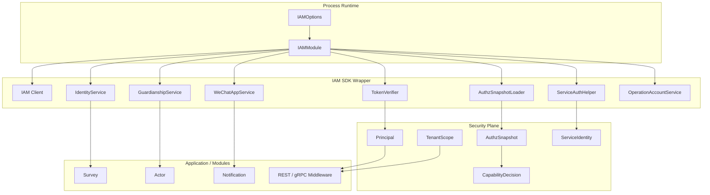

# IAM 嵌入式 SDK 边界分析

**本文回答**：为什么 qs-server 选择以“嵌入式 IAM SDK / IAMModule”的方式接入 IAM，而不是把 IAM 当成纯外部 HTTP/gRPC 服务到处调用；哪些 IAM 能力可以嵌入到 qs-server runtime；哪些能力必须被隔离在 infra / security plane / port 后面；为什么不能让 IAM SDK 类型侵入 domain/application；apiserver 和 collection-server 的 IAM 嵌入边界有什么不同。

---

## 30 秒结论

qs-server 对 IAM 的使用不是“到处调用 IAM SDK”，而是：

```text
Process Runtime
  -> IAMModule
  -> IAM SDK Wrapper
  -> TokenVerifier / ServiceAuth / Identity / Guardianship / AuthzSnapshot
  -> Projection / Port / Application Service
```

| 维度 | 结论 |
| ---- | ---- |
| 接入方式 | IAM 以 SDK wrapper + IAMModule 的形式嵌入进程 runtime |
| 核心边界 | SDK 只允许出现在 infra/container/runtime/security adapter，不能进入 domain |
| apiserver IAMModule | 能力更完整：TokenVerifier、ServiceAuth、Identity、OperationAccount、Guardianship、WeChatApp、AuthzSnapshot |
| collection IAMModule | 能力更窄：TokenVerifier、ServiceAuth、Identity、Guardianship、AuthzSnapshot |
| 权限真值 | 业务 capability 必须基于 AuthzSnapshot，不直接信任 JWT roles |
| 服务身份 | ServiceAuthHelper 只负责服务间 token/metadata，不等于用户权限 |
| 租户边界 | IAM tenant_id 通过 TenantScope 映射到 QS org scope |
| 运行时保护 | apiserver IAM client 注入 Backpressure limiter，避免 IAM 慢拖垮主服务 |
| 关闭语义 | IAMModule 统一关闭 ServiceAuthHelper、TokenVerifier、Client |
| 禁止事项 | handler/application/domain 直接依赖 IAM SDK，或用 JWT roles / local Operator roles 做业务授权 |

一句话概括：

> **IAM SDK 可以嵌入 runtime，但 IAM 语义不能侵入领域模型；qs-server 只消费“身份、租户、授权快照、服务身份、监护关系、应用配置”等经过边界转换后的能力。**

---

## 1. 为什么选择嵌入式 SDK，而不是每处手写远程调用

IAM 是 qs-server 的身份、认证、授权、服务间认证、监护关系和部分配置能力来源。

如果每个业务模块都自己调用 IAM，会出现：

| 问题 | 后果 |
| ---- | ---- |
| 每个模块都 new IAM client | 连接、超时、重试、缓存不可控 |
| handler 直接调 IAM SDK | transport 层变厚，业务逻辑散落 |
| application 直接依赖 SDK 类型 | 应用层被外部系统模型污染 |
| domain 识别 IAM user/account/role | 领域模型被身份系统耦合 |
| JWT roles 到处判断权限 | 权限绕过或权限漂移 |
| service token 到处手写 metadata | 安全风险和格式漂移 |
| IAM 慢时没有统一 backpressure | IAM 故障拖垮业务主链路 |
| 无统一关闭语义 | JWKS refresh / service token refresh 泄漏 |

因此需要一个统一的嵌入边界：

```text
IAMModule
```

IAMModule 负责把 SDK 能力变成 qs-server 可消费的 runtime capability。

---

## 2. IAM 嵌入总图



---

## 3. IAMModule 的职责

IAMModule 负责：

1. 根据配置创建 IAM client。
2. 创建 TokenVerifier。
3. 创建 ServiceAuthHelper。
4. 创建 IdentityService。
5. 创建 OperationAccountService。
6. 创建 GuardianshipService。
7. 创建 WeChatAppService。
8. 创建 AuthzSnapshotLoader。
9. 注入 runtime limiter，如 apiserver 的 IAM backpressure。
10. 提供统一 Close / HealthCheck。

IAMModule 不负责：

- 业务权限判断。
- 业务聚合建模。
- 领域不变量。
- handler 参数校验。
- 直接生成业务响应。
- 把 IAM role 映射成本地权限真值。
- 替代 Security Plane。

---

## 4. apiserver 与 collection-server 的 IAMModule 差异

### 4.1 apiserver IAMModule

apiserver 是主业务服务，需要更完整的 IAM 能力：

| 能力 | 用途 |
| ---- | ---- |
| Client | 与 IAM 通信 |
| TokenVerifier | REST/gRPC token 验证 |
| ServiceAuthHelper | 服务间认证 |
| IdentityService | 用户身份查询 |
| OperationAccountService | 后台运营账号注册/管理 |
| GuardianshipService | 监护关系查询 |
| WeChatAppService | 微信应用配置查询 |
| AuthzSnapshotLoader | IAM 授权快照加载 |

apiserver 还会把 IAM Backpressure limiter 注入 IAM client runtime options，避免 IAM 慢时拖垮主服务。

### 4.2 collection-server IAMModule

collection 是前台 BFF，IAM 能力更窄：

| 能力 | 用途 |
| ---- | ---- |
| Client | 与 IAM 通信 |
| TokenVerifier | 前台 JWT 验证 |
| ServiceAuthHelper | collection 以服务身份调 IAM 或 apiserver |
| IdentityService | 用户信息查询 |
| GuardianshipService | 前台监护关系校验 |
| AuthzSnapshotLoader | 前台授权快照加载 |

collection 不需要：

- OperationAccountService。
- WeChatAppService。
- 后台 operator 管理能力。

### 4.3 为什么能力不同

因为进程职责不同：

| 进程 | IAM 嵌入目标 |
| ---- | ------------ |
| apiserver | 主业务事实、后台管理、授权快照、外部配置、服务端鉴权 |
| collection-server | 前台 BFF 身份投影、监护关系校验、服务间调用 |
| worker | 通常通过 service auth / gRPC client 访问 apiserver，不直接承载完整 IAM 业务能力 |

这体现了一个边界原则：

```text
不是每个进程都应该嵌入完整 IAM 能力。
```

---

## 5. TokenVerifier 边界

TokenVerifier 负责：

- 使用 IAM SDK verifier 验证 token。
- 本地 JWKS 验签优先。
- 可远程降级验证。
- 提供 SDKTokenVerifier 给 REST/gRPC middleware。
- Close 时停止 JWKS 后台刷新。

TokenVerifier 不负责：

- 判断业务 capability。
- 判断用户能否访问某个问卷/量表。
- 解析本地 Operator 状态。
- 判断 service ACL。
- 修改 user/session。

### 5.1 为什么不能用 JWT roles 直接授权

JWT roles 是 token 中的身份声明视图，可能滞后，也不能完整表达 IAM resource/action。

业务权限必须走：

```text
AuthzSnapshot
  -> CapabilityDecision
```

而不是：

```text
if "admin" in claims.Roles
```

---

## 6. AuthzSnapshotLoader 边界

AuthzSnapshotLoader 负责：

- 调 IAM `GetAuthorizationSnapshot`。
- 生成 `authz.Snapshot`。
- 进程内缓存。
- singleflight 合并重复加载。
- authz_version 水位失效。
- DomainForOrg 规则。
- AppName / CasbinDomainOverride。

它不负责：

- 业务 route 决策。
- operator 本地角色真值。
- IAM policy 修改。
- 直接写本地权限。
- domain 建模。

### 6.1 为什么需要 snapshot

业务请求需要在“当前 tenant/org + user + app”维度判断权限。

如果每次 capability 都实时调用 IAM，会导致：

- 延迟高。
- IAM 压力大。
- 同一请求多次检查重复请求 IAM。
- 无法统一缓存和版本失效。

所以使用请求期授权快照：

```text
Load snapshot once
  -> middleware/context 注入
  -> capability decision
```

### 6.2 为什么需要 authz_version 水位失效

当 IAM 权限版本推进后，旧 snapshot 不能继续被长期使用。

SnapshotLoader 的 `ObserveTenantAuthzVersion` 会推进租户授权版本水位，并剔除低版本缓存。

这让本地缓存和 IAM 权限变化之间有一个受控同步机制。

---

## 7. ServiceAuthHelper 边界

ServiceAuthHelper 负责：

- 从 IAM 获取 service token。
- 周期刷新服务 token。
- 作为 PerRPC credentials 注入 metadata。
- 暴露 ServiceIdentity。
- Stop 时停止后台刷新。

它不负责：

- 用户认证。
- 用户授权。
- 业务 capability。
- mTLS 证书校验。
- ACL 决策。
- 代替 Principal。

服务间调用正确模型是：

```text
ServiceIdentity
+
Principal / TenantScope（如果代表用户）
+
AuthzSnapshot（如果需要用户业务权限）
```

而不是把 service token 当用户 token 使用。

---

## 8. GuardianshipService 边界

GuardianshipService 用于前台场景：

```text
当前用户能否为某个 IAM child / testee 提交答卷？
```

collection-server 在提交前会：

1. 查询受试者。
2. 获取 IAMChildID。
3. 调 GuardianshipService 判断是否监护人。
4. 通过后才继续提交。

这属于前台 BFF 保护逻辑。

它不应该变成：

- Survey 聚合的一部分。
- AnswerSheet 实体方法。
- Evaluation pipeline 条件。
- 本地权限真值。

---

## 9. IdentityService 边界

IdentityService 用于补充用户显示信息或身份资料，例如：

- user name。
- account info。
- profile display。
- query result enrichment。

它不应成为：

- 权限判断来源。
- 业务不变量来源。
- 强一致事务依赖。
- domain entity 的直接依赖。

正确方式是：

```text
application/query service 通过 port/adapter 查询身份信息
domain 只保存必要外部引用 ID
```

---

## 10. OperationAccountService 边界

OperationAccountService 只在 apiserver 侧需要，通常用于后台运营账号注册/管理。

它不应该出现在 collection-server。

原因：

- collection 面向前台用户。
- 运营账号属于后台管理。
- 前台 BFF 不应该持有后台账号创建能力。
- 权限风险大。

这体现了最小能力原则：

```text
哪个进程需要什么 IAM 能力，就只嵌入什么能力。
```

---

## 11. WeChatAppService 边界

WeChatAppService 在 apiserver 中用于 Notification / WeChat 配置解析：

```text
WeChatAppID
  -> IAM WeChatAppConfig
  -> AppID / AppSecret
  -> WeChat adapter
```

它不应该让 WeChat appSecret 散落到业务模块或日志里。

边界是：

- IAM 负责配置来源。
- Integrations 负责 WeChat adapter。
- Notification application service 负责业务编排。
- Domain 不接触 appSecret。

---

## 12. IAM Client 与 Backpressure

apiserver 创建 IAM client 时注入 runtime limiter：

```text
IAMModuleRuntimeOptions{
  Limiter: backpressure.Acquirer
}
```

原因：

- IAM 是外部依赖。
- IAM 慢或不可用会拖慢认证、授权快照、监护关系、配置解析。
- 需要限制 in-flight IAM 调用。
- 需要通过 Resilience 观测 IAM backpressure。

这说明嵌入 SDK 不等于无保护地调用 SDK。

---

## 13. IAM SDK 不能进入 Domain

Domain 只应表达业务概念，例如：

- Testee。
- FillerRef。
- Questionnaire。
- Assessment。
- Operator。
- PlanTask。

Domain 不应 import：

```text
github.com/FangcunMount/iam/v2/...
```

原因：

| 如果 domain 依赖 IAM SDK | 后果 |
| ------------------------ | ---- |
| 领域模型被外部系统污染 | 难测试、难迁移 |
| IAM DTO 变动影响业务模型 | 领域不稳定 |
| 业务不变量依赖远程系统 | 聚合不可纯内存验证 |
| 权限逻辑散落到实体中 | Security Plane 失效 |

Domain 可以保存外部 ID，但不应依赖外部 SDK 类型。

---

## 14. Application 层如何安全使用 IAM

Application 层可以通过窄接口使用 IAM 能力，但要避免直接依赖 SDK 类型。

推荐：

```text
IdentityService wrapper
GuardianshipService wrapper
AuthzSnapshotLoader
WeChatAppConfigProvider
RecipientResolver
```

不推荐：

```text
application service 直接调用 iam.SDK().Authz().GetAuthorizationSnapshot
application service 直接构造 IAM protobuf request
application service 直接判断 JWT roles
```

如果 application 需要 IAM 数据，应先定义 port 或使用已有 wrapper。

---

## 15. Transport 层如何使用 IAM

Transport 层负责：

- JWT middleware。
- UserIdentity projection。
- TenantScope。
- AuthzSnapshotMiddleware。
- gRPC IAMAuthInterceptor。
- mTLS identity match。
- ACL/Audit。
- 将安全视图写入 context。

Transport 层不负责：

- 领域决策。
- 修改业务状态。
- 写本地权限。
- 执行业务授权以外的用例逻辑。

---

## 16. IAM 嵌入后的分层边界

```text
IAM SDK
  -> infra/iam wrapper
  -> IAMModule
  -> securityplane projection
  -> middleware/interceptor/application port
  -> business use case
  -> domain
```

依赖方向必须单向。

禁止反向：

```text
domain -> IAM SDK
application -> raw IAM protobuf
handler -> raw IAM client everywhere
```

---

## 17. 嵌入式 SDK 的收益

### 17.1 统一生命周期

IAM client、TokenVerifier、ServiceAuthHelper 都由 IAMModule 管理和关闭。

### 17.2 统一配置

IAMOptions 统一管理：

- enabled。
- gRPC。
- JWT。
- JWKS。
- user cache。
- guardianship cache。
- authz app name。
- authz cache TTL。
- service auth。

### 17.3 统一缓存

- JWKS 本地验签缓存。
- AuthzSnapshot 缓存。
- IAM SDK user/guardianship cache。
- singleflight 合并 snapshot load。

### 17.4 统一安全语言

最终进入 qs-server 的不是 IAM raw DTO，而是：

- Principal。
- TenantScope。
- AuthzSnapshot。
- CapabilityDecision。
- ServiceIdentity。

### 17.5 更容易测试和替换

通过 wrapper/port 可以 mock：

- TokenVerifier。
- SnapshotLoader。
- GuardianshipService。
- IdentityService。
- WeChatAppService。

---

## 18. 嵌入式 SDK 的风险

| 风险 | 表现 |
| ---- | ---- |
| SDK 类型扩散 | 业务层到处 import IAM |
| 权限逻辑散落 | handler/service 直接判断 roles |
| SDK cache 与业务 cache 混淆 | 运维难排查 |
| 外部依赖过重 | IAM 慢拖垮主链路 |
| 生命周期泄漏 | JWKS/service token refresh goroutine 未关闭 |
| 进程能力过大 | collection 拥有不该有的后台能力 |
| 配置复杂 | JWT/JWKS/gRPC/authz/service auth 边界不清 |

所以嵌入 SDK 必须配套边界和 SOP。

---

## 19. 替代方案分析

### 19.1 纯远程 IAM HTTP/gRPC 调用，不嵌 SDK

优点：

- 依赖简单。
- 本地代码少。
- IAM 完全独立。

缺点：

- 每处调用都要处理 client、超时、重试、token、缓存。
- 本地验签能力弱。
- service auth metadata 容易散落。
- 业务层更容易直接拼 IAM request。
- 性能和可用性更差。

结论：不适合高频认证/授权链路。

### 19.2 完全本地复制 IAM 数据

优点：

- 查询快。
- IAM 依赖少。

缺点：

- 权限同步复杂。
- 安全风险高。
- 数据漂移。
- 本地系统变成第二个 IAM。

结论：不适合当前阶段。

### 19.3 当前方案：嵌入 SDK + Snapshot + Projection

优点：

- 本地验签和缓存。
- 统一 wrapper。
- 保持 IAM 为真值。
- qs-server 只消费投影视图。
- 可用 backpressure 保护外部依赖。
- 易与 service auth/mTLS 结合。

缺点：

- 嵌入边界需要严格维护。
- 配置和生命周期更复杂。
- 文档必须防止 SDK 侵入业务层。

结论：当前更平衡。

---

## 20. 设计不变量

后续演进必须坚持：

1. IAM SDK 不进入 domain。
2. 业务 capability 不直接看 JWT roles。
3. 本地 Operator roles 不是权限真值。
4. AuthzSnapshot 是请求期授权判断依据。
5. ServiceAuth 不等于用户认证。
6. mTLS identity match 不等于业务授权。
7. 每个进程只嵌入自己需要的 IAM 能力。
8. IAM client 必须有超时、缓存和 backpressure 策略。
9. IAMModule 必须统一 Close。
10. 新 IAM 能力必须先定义 wrapper/port，再进入业务。

---

## 21. 常见误区

### 21.1 “嵌入 SDK 就可以到处调用 IAM”

不可以。嵌入 SDK 是 runtime 优化，不是分层豁免。

### 21.2 “JWT roles 可以直接判断后台权限”

不应。业务权限必须基于 AuthzSnapshot / CapabilityDecision。

### 21.3 “collection 也应该拥有 OperationAccountService”

不应该。collection 是前台 BFF，不应拥有后台账号管理能力。

### 21.4 “ServiceAuthHelper 表示当前用户是谁”

不是。它表示当前服务身份。

### 21.5 “AuthzSnapshot 缓存越久越好”

不一定。权限变更需要通过 TTL 和 authz_version 水位失效控制。

### 21.6 “IAM 不可用时业务应该全部放行”

不能默认放行。认证/授权缺失通常应拒绝或降级到明确的受限模式。

---

## 22. 排障路径

### 22.1 TokenVerifier not configured

检查：

1. IAM enabled。
2. IAM client 创建是否成功。
3. JWKS config。
4. TokenVerifier 创建日志。
5. ForceRemoteVerification。

### 22.2 authorization snapshot required / load failed

检查：

1. AuthzSnapshotLoader 是否为 nil。
2. IAM GRPCEnabled。
3. IAM Authz app name。
4. tenantID / userID。
5. IAM GetAuthorizationSnapshot。
6. CacheTTL / authz_version。

### 22.3 service auth 不可用

检查：

1. ServiceAuth.ServiceID。
2. TargetAudience。
3. IAM 是否支持 IssueServiceToken。
4. ServiceAuthHelper 创建日志。
5. gRPC metadata authorization。

### 22.4 监护关系校验失败

检查：

1. IAM GuardianshipService 是否可用。
2. testee 是否绑定 IAMChildID。
3. userID / childID。
4. guardianship cache。
5. IAM relationship data。

### 22.5 mTLS identity mismatch

检查：

1. client certificate CN。
2. JWT Extra.service_id。
3. RequireIdentityMatch。
4. CN `.svc` 后缀规则。
5. service token 是否属于当前服务。

---

## 23. 修改指南

### 23.1 新增 IAM 能力

必须：

1. 明确该能力属于 apiserver、collection 还是 worker。
2. 在 infra/iam wrapper 中封装 SDK。
3. 在 IAMModule 中按需创建。
4. 不把 SDK type 暴露给 domain。
5. 如需 application 使用，定义 port/interface。
6. 明确缓存、超时、backpressure。
7. 明确 Close。
8. 补 tests/docs。

### 23.2 新增 IAM 授权能力

必须：

1. 更新 IAM policy/resource/action。
2. 更新 AuthzSnapshot mapping。
3. 更新 CapabilityDecision。
4. 更新 route middleware。
5. 更新 tests。
6. 不使用 JWT roles 替代。

### 23.3 新增 service-to-service 认证

必须：

1. 定义 ServiceID。
2. 定义 TargetAudience。
3. 配置 ServiceAuth。
4. 接入 PerRPC credentials。
5. 如启用 mTLS，检查 identity match。
6. 补安全文档和测试。

---

## 24. 代码锚点

### apiserver IAM

- `internal/apiserver/container/iam.go`
- `internal/apiserver/process/container_bootstrap.go`
- `internal/apiserver/infra/iam`

### collection IAM

- `internal/collection-server/container/iam_module.go`
- `internal/collection-server/process/container_bootstrap.go`
- `internal/collection-server/infra/iam`

### 通用 IAM / Security

- `internal/pkg/iamauth/snapshot_loader.go`
- `internal/pkg/grpc/interceptor_auth.go`
- `internal/pkg/securityplane`
- `internal/pkg/securityprojection`
- `internal/pkg/serviceauth`

### Authz / Capability

- `internal/apiserver/application/authz`
- `internal/apiserver/transport/rest/middleware/authz_snapshot_middleware.go`
- `internal/apiserver/transport/rest/middleware/capability_middleware.go`

---

## 25. Verify

```bash
go test ./internal/apiserver/container
go test ./internal/apiserver/infra/iam
go test ./internal/collection-server/container
go test ./internal/collection-server/infra/iam
go test ./internal/pkg/iamauth
go test ./internal/pkg/grpc
go test ./internal/pkg/securityplane
go test ./internal/apiserver/application/authz
```

如果修改 REST/gRPC 鉴权：

```bash
go test ./internal/apiserver/transport/rest/middleware
go test ./internal/apiserver/transport/grpc
go test ./internal/collection-server/transport/rest
```

如果修改文档：

```bash
make docs-hygiene
git diff --check
```

---

## 26. 下一跳

| 目标 | 文档 |
| ---- | ---- |
| 系统演进路线 | `07-系统演进路线.md` |
| Security Control Plane | `../03-基础设施/security/README.md` |
| ServiceIdentity 与 mTLS-ACL | `../03-基础设施/security/03-ServiceIdentity与mTLS-ACL.md` |
| AuthzSnapshot 与 CapabilityDecision | `../03-基础设施/security/02-AuthzSnapshot与CapabilityDecision.md` |
| Integrations 外部适配 | `../03-基础设施/integrations/README.md` |
