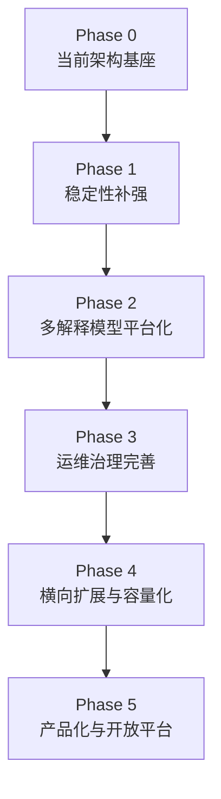

# 07-系统演进路线

**本文回答**：qs-server 在当前架构基础上，应该如何继续演进；如何从“医学量表系统”升级为“多解释模型测评平台”；哪些能力已经形成架构基座，哪些是短期必须补强的稳定性工程，哪些是中期规模化能力，哪些是长期产品化 / 平台化方向；每个阶段的目标、边界、收益、风险和验收标准是什么。

---

## 30 秒结论

qs-server 的演进路线不应该是“继续堆量表功能”，也不应该是“为了支持 MBTI 就把 MBTI 塞进 Scale”。

新的演进主线应该是：

```text
业务边界清晰
  -> 多解释模型抽象
  -> 通用测评执行引擎
  -> 事件可靠
  -> 高并发保护
  -> 读侧聚合稳定
  -> 安全边界收敛
  -> 可观测可运维
  -> 可扩展可平台化
```

当前系统已经具备较好的架构基座：

| 架构基座 | 当前状态 |
| -------- | -------- |
| 三进程拆分 | apiserver / collection-server / worker 已形成职责分离 |
| 业务模块边界 | Survey / Assessment Model / Evaluation / Interpretation Model / Actor / Plan / Statistics 已拆开 |
| 多模型资产方向 | Scale 已收敛为 Assessment Model 下的具体模型资产，MBTI / BigFive 可作为同级模型资产接入 |
| 通用测评执行 | Evaluation 保持通用测评执行层，Report 负责最终解释报告聚合 |
| 同步提交 + 异步测评执行 | AnswerSheet durable submit + Outbox + worker + Evaluation pipeline |
| collection 保护层 | 前台 BFF、限流、SubmitQueue、SubmitGuard、监护关系校验 |
| Outbox | Mongo/MySQL outbox、relay、mark failed/published、status snapshot |
| 读侧统计聚合 | ReadService、BehaviorProjector、SyncService、QueryCache、Hotset |
| IAM 嵌入边界 | IAMModule、TokenVerifier、AuthzSnapshot、ServiceAuth、Guardianship |
| Redis/Resilience | family、cache、locklease、rate limit、backpressure、queue |
| Runtime/Observability | stage pipeline、container、healthz、metrics、pprof、governance |

后续演进建议分为五个阶段：

| 阶段 | 主题 | 目标 |
| ---- | ---- | ---- |
| Phase 1 | 稳定性补强 | 把现有链路从“能跑”提升为“可稳定运行、可排障、可恢复” |
| Phase 2 | 多解释模型平台化 | 让 MBTI 作为 Scale 同级模型接入，固化 ModelRef / Provider / Context / Registry |
| Phase 3 | 运维治理完善 | 补齐 outbox/worker/cache/statistics/security/observability 的治理闭环 |
| Phase 4 | 横向扩展与容量化 | 支持多实例、高 QPS、数据层独立部署和正式压测 |
| Phase 5 | 产品化与开放平台 | 支持多机构、多模型、多报告、多通知、多接入端、operating 平台化 |

一句话概括：

> **qs-server 的下一步不是把 Scale 做成万能模型，而是从“医学量表系统”演进为“多解释模型测评平台”：Survey 管作答事实，Interpretation Model 管接入协议，Scale / MBTI / BigFive 管具体规则，Evaluation 管通用执行生命周期。**

---

## 1. 当前系统已经完成了什么

在谈演进路线前，必须先明确：qs-server 当前不是一个“从零开始”的系统，它已经形成了一套较清晰的模块化架构。

### 1.1 业务边界已经拆开

当前业务边界应升级为：

```text
Survey
Interpretation Model
Concrete Models
    Scale
    MBTI future
    BigFive future
Evaluation
Actor
Plan
Statistics
```

其中：

- Survey 负责问卷和答卷事实。
- Interpretation Model 负责 ModelRef / Provider / Context / Registry 等接入抽象。
- Scale 负责医学量表规则资产。
- MBTI / BigFive 等未来模型作为 Scale 同级的具体解释模型。
- Evaluation 负责 Assessment、EvaluationRun、EvaluationResult、InterpretReport、失败重试和事件。
- Actor 负责受试者、医生、操作员和入口。
- Plan 负责测评计划和任务。
- Statistics 负责读侧统计聚合。

这为后续从“量表系统”演进为“多解释模型平台”提供了稳定边界。

### 1.2 三进程运行时已经形成

当前运行时大致为：

```text
collection-server
  -> 面向前台小程序/收集端

qs-apiserver
  -> 主业务事实、后台 REST、内部 gRPC、调度

qs-worker
  -> 事件消费、异步测评执行、内部回调
```

这说明系统已经具备基本的“入口保护 + 主服务 + 后台异步”结构。

### 1.3 核心业务链路已经异步化

答卷提交链路已经不是同步生成报告：

```text
POST /answersheets
  -> collection SubmitQueue
  -> apiserver SaveAnswerSheet
  -> Mongo durable submit + outbox
  -> worker consume answersheet.submitted
  -> CreateAssessmentFromAnswerSheet
  -> assessment.created
  -> CompleteAssessment
  -> assessment.completed
  -> CompleteInterpretation
  -> interpretation.completed / interpretation.failed
  -> GenerateReportFromInterpretation
  -> report.generated
```

这为高并发提交、慢模型执行和报告生成提供了基础。

### 1.4 基础设施控制面已经逐步形成

当前已有：

- Event System。
- Data Access。
- 缓存模块。
- 高并发保护模块。
- Security Control Plane。
- Integrations。
- Runtime Composition Plane。
- Observability。

这些说明 qs-server 已经从“业务代码项目”开始向“有基础设施层的工程系统”演进。

---

## 2. 当前系统的主要短板

当前系统已经有架构骨架，但还存在几个明显短板。

### 2.1 多解释模型抽象仍需要落地为代码事实

文档上已经明确：MBTI 与 Scale 同级，都是具体解释模型。

但代码层仍需要逐步固化：

- ModelRef 类型与版本语义。
- InterpretationProvider 接口。
- Provider Registry。
- Provider Context 加载。
- ScaleProvider 适配。
- MBTIProvider 接入。
- Evaluation 对 Provider 的调用边界。
- EvaluationResult / InterpretReport 的通用结果表达。

否则系统会继续被旧的 Scale 中心叙事牵引。

### 2.2 Evaluation 通用执行引擎还需要继续收敛

Evaluation 已经异步化，但要成为通用引擎，还需要补强：

- Assessment failed 后的重试入口。
- EvaluationRun 执行尝试记录。
- Provider phase-level observability。
- interpretation.completed / failed 的状态语义。
- report durable save 失败后的恢复。
- waiter notification 失败后的补偿。
- 重复事件的幂等边界。

### 2.3 可靠事件链路还需要闭环

Outbox 已经存在，但还需要继续补齐：

- outbox backlog 告警。
- failed event 治理。
- replay / retry SOP。
- DLQ 或 poison event 策略。
- worker 消费失败分级。
- published 后清理/归档策略。
- interpretation.completed -> report.generated 链路排障。

否则事件可靠性只是“有 outbox”，还不是完整可靠事件系统。

### 2.4 collection 保护层仍需生产化

collection 已有 SubmitQueue、RateLimit、SubmitGuard，但还需要：

- 多实例 submit-status 一致性方案。
- SubmitQueue drain / graceful shutdown 策略。
- request_id 与 idempotency_key 的前端契约明确。
- queue full 的用户体验。
- wait-report 的 timeout 策略和容量保护。
- 前台 API 错误码标准化。

### 2.5 统计读侧仍需治理闭环

Statistics 已有 ReadService、Projector、SyncService，但还需要：

- 统计口径版本管理。
- 数据重建任务治理。
- pending behavior event 观察和告警。
- cache invalidation / version token 策略固化。
- MBTI TypeCode / Dimension 分布投影。
- interpretation model distribution。
- dashboard 与 operating 展示。
- 统计不准的 runbook。

### 2.6 IAM 边界还需要继续收敛

IAMModule 已经形成，但仍要防止：

- SDK 类型扩散。
- JWT roles 被误用。
- 本地 Operator roles 被当权限真值。
- service auth 与用户 principal 混淆。
- ACL seam 被误认为已完整实现。
- collection 拥有过大的 IAM 能力。
- 模型规则管理权限与用户报告访问权限混淆。

### 2.7 运维入口仍需分类

当前已有 governance/status，但需要继续明确：

```text
status endpoint
manual action endpoint
repair endpoint
replay endpoint
admin operation endpoint
```

不能把所有运维能力都堆到一个 `/governance` 下面。

---

## 3. 演进路线总览

建议路线如下：



| 阶段 | 目标 | 关键词 |
| ---- | ---- | ------ |
| Phase 0 | 当前已经完成的架构基座 | 模块化、三进程、Outbox、异步测评执行 |
| Phase 1 | 稳定性补强 | 幂等、重试、状态、错误码、观测 |
| Phase 2 | 多解释模型平台化 | ModelRef、Provider、Context、Registry、MBTI |
| Phase 3 | 运维治理完善 | governance、repair、replay、runbook、dashboard |
| Phase 4 | 横向扩展与容量化 | 多实例、QPS、压测、数据层拆分 |
| Phase 5 | 产品化与开放平台 | 多租户、多模型、多报告、多接入端、operating |

---

## 4. Phase 0：当前架构基座

### 4.1 已经形成的能力

| 能力 | 当前状态 |
| ---- | -------- |
| 模块拆分 | Survey / Assessment Model / Evaluation / Interpretation Model / Actor / Plan / Statistics |
| 进程拆分 | collection / apiserver / worker |
| 异步测评执行 | AnswerSheet submitted event -> worker -> Evaluation |
| 事件出站 | Mongo/MySQL Outbox + Relay |
| 前台保护 | collection RateLimit + SubmitQueue + SubmitGuard |
| Redis 能力 | cache / lock / hotset / warmup / runtime family |
| Resilience | RateLimit / Queue / Backpressure / LockLease |
| Security | Principal / OrgScope / AuthzSnapshot / ServiceIdentity |
| Statistics | ReadService / SyncService / BehaviorProjector |
| Runtime | stage pipeline / Container composition root |
| Observability | metrics / healthz / pprof / governance status |

### 4.2 这个阶段的价值

当前系统已经具备：

- 可以讲清楚业务边界。
- 可以讲清楚核心链路。
- 可以拆分文档体系。
- 可以支持演示和中小规模运行。
- 可以作为面试项目展示较完整架构。
- 可以自然解释为什么 MBTI 不放进 Scale。

### 4.3 这个阶段的限制

但它还不能直接宣称：

- 已经具备完整生产级可靠性。
- 已经具备完整多解释模型平台能力。
- 已经具备 1000 QPS 稳定承载。
- 已经具备完善运维治理平台。
- 已经具备完整 service ACL。
- 已经具备成熟 DLQ/replay/repair 能力。

这些属于后续阶段。

---

## 5. Phase 1：稳定性补强

Phase 1 的目标：

```text
把主链路从“能跑通”提升到“失败可解释、状态可查询、重试可控制”。
```

### 5.1 答卷提交链路补强

重点：

- 明确 request_id / idempotency_key 协议。
- 完善 submit-status 错误码。
- SubmitQueue failed reason 可读。
- SubmitGuard degraded-open 告警。
- queue full 用户体验策略。
- collection shutdown 时 SubmitQueue 的边界文档和行为确认。

验收标准：

- 用户重复提交不会产生重复 AnswerSheet。
- queue full 能返回稳定错误。
- submit-status 能区分 queued / processing / done / failed / expired。
- SubmitGuard Redis 不可用时有明确 degraded 观测。

### 5.2 Evaluation 失败重试补强

重点：

- Assessment failed reason 分类。
- EvaluationRun 记录。
- Provider phase-level error。
- `interpretation.failed` 事件语义。
- retry assessment internal REST。
- report save failure 处理。
- waiter notify failure 不影响主评估状态。
- worker handler 幂等测试。

验收标准：

- 任一评估失败可定位失败阶段。
- 同一个 Assessment 重试不会重复生成错误副作用。
- report 缺失可以通过 repair/retry 修复。
- worker 重复消费不会造成重复 Assessment。

### 5.3 Outbox 可靠性补强

重点：

- failed outbox status 只读查询。
- retry / replay SOP。
- poison event 标记。
- published 清理策略。
- relay lag metrics。
- EventCatalog 校验。
- `interpretation.completed` 到 `report.generated` 的排障路径。

验收标准：

- pending/failed/publishing 状态可查。
- MQ 短暂不可用恢复后事件能继续发布。
- relay 崩溃后 stale publishing 可恢复。
- failed event 不会无限静默积压。
- interpretation 完成但 report 不生成时可定位。

### 5.4 Security 边界补强

重点：

- Route capability matrix。
- AuthzSnapshot load failure 统一错误。
- JWT roles 禁用直接鉴权检查。
- OperatorRoleProjection 文档和测试。
- service auth / mTLS identity mismatch 测试。
- ACL 当前 seam 状态明确。
- read_interpretation_reports / manage_interpretation_models 权限拆分。

验收标准：

- 每条 protected route 能说明 capability。
- permission denied 可以定位是 missing_snapshot / denied / unknown_capability。
- 本地 Operator roles 不参与业务鉴权。
- service identity 和 user principal 不混淆。
- 管理 MBTI 规则不等于能读取用户 MBTI 报告。

---

## 6. Phase 2：多解释模型平台化

Phase 2 的目标：

```text
把系统从“医学量表系统”升级为“多解释模型测评平台”。
```

这是当前未来演进中最关键的一步。

### 6.1 为什么要单独设 Phase 2

因为 MBTI 不是一个普通功能点。

它会同时影响：

- 领域边界。
- 模型抽象。
- Evaluation 执行协议。
- Data Access。
- Redis cache。
- Statistics ReadModel。
- Event Catalog。
- Security capability。
- Observability metrics。
- Governance endpoint。
- 对外宣讲口径。

如果不单独规划，代码会退回旧路线：

```text
把 MBTI 塞进 Scale
让 Evaluation 继续依赖 Scale 语义
把 TypeCode / TypeProfile 塞进 Assessment 主表
```

这是需要避免的。

---

### 6.2 Phase 2-1：固化 Interpretation Model 抽象

目标：

```text
ModelRef / Provider / Context / Registry 成为稳定接入协议。
```

建议落地：

```text
ModelRef
  ModelType
  ModelCode
  ModelVersion

InterpretationProvider
  LoadContext(ctx, modelRef)
  Evaluate(ctx, input, context)

InterpretationRegistry
  Register(modelType, provider)
  Resolve(modelType)

InterpretationContext
  只读规则快照 / 执行上下文
```

验收标准：

- Evaluation 不直接依赖 MedicalScale / Factor / RiskLevel。
- ScaleProvider 通过 Provider 协议接入。
- Provider contract 有测试。
- Context cache 可回源具体模型 repository。

---

### 6.3 Phase 2-2：将 Scale 收敛为具体解释模型

目标：

```text
ScaleProvider 是一个具体 Provider，不是解释能力中心。
```

需要完成：

- Scale 文档与代码统一定位为 MedicalScale 规则资产。
- ScaleProvider 负责把 MedicalScale / Factor / Rule 转换成 EvaluationResult。
- Scale 不拥有 Assessment 状态机。
- Scale 不保存本次测评执行结果。
- Scale changed 只表达规则变化。

验收标准：

- 新增非 Scale 模型时，不需要修改 Scale domain。
- Scale 的 Factor / RiskLevel 不泄露到 Evaluation 通用抽象。
- ScaleProvider 和未来 MBTIProvider 能同级注册。

---

### 6.4 Phase 2-3：接入 MBTI 作为第二个具体模型

目标：

```text
MBTI 作为 Scale 同级模型接入，而不是 Scale 的一种特殊量表。
```

建议模型：

```text
MBTIModel
├── ModelCode
├── ModelVersion
├── QuestionnaireRef
├── Status
├── Dimensions
├── QuestionMappings
├── TypeProfiles
└── ReportTemplate
```

建议结果：

```text
EvaluationResult
  ModelType=mbti
  DimensionScores
  PreferenceResult
  TypeCode
  ProfileResult
```

建议报告：

```text
InterpretReport
  ModelType=mbti
  TypeCode
  Sections
  RenderData
  SnapshotRefs
```

验收标准：

- MBTI 不修改 Scale domain。
- MBTI 不向 Assessment 主表添加大量专用字段。
- MBTI 规则事实有独立 repository / document。
- MBTIProvider 通过 Registry 接入 Evaluation。
- MBTI 报告通过 `read_interpretation_reports` 授权。

---

### 6.5 Phase 2-4：补齐解释模型横切能力

新增模型不能只改 domain。

还要同步：

| 横切能力 | 需要补充 |
| -------- | -------- |
| Event | `interpretation-model.changed`、`interpretation.completed`、`interpretation.failed` |
| DataAccess | MBTIModel document、mapper、repository、migration |
| Redis | MBTIModelListCache、Context cache、WarmupTarget |
| Statistics | MBTI TypeCode / Dimension 分布 |
| Security | read/manage interpretation models、read reports |
| Observability | model_type/provider/phase 指标 |
| Governance | 模型列表、Context、队列、执行状态 drill-down |

验收标准：

- 新增模型有完整接入 SOP。
- 新增模型不污染基础设施事实源。
- Metrics 使用低基数 `model_type`，不使用 `model_code`。
- Governance 可以 drill down，但 summary 不产生高基数指标。

---

## 7. Phase 3：运维治理完善

Phase 3 的目标：

```text
从“开发者能排查”演进为“运维 / operating 能按 SOP 操作”。
```

### 7.1 Governance endpoint 分层

建议将 governance 能力分层：

```text
/status
/metrics
/actions
/repair
/replay
```

其中：

| 类型 | 语义 |
| ---- | ---- |
| status | 只读 |
| metrics | Prometheus |
| actions | 受控手工操作 |
| repair | 数据修复 |
| replay | 事件重放 |

不能把 repair/replay/release lock 混在普通 status endpoint 里。

### 7.2 Operating 接入

Operating 可以逐步接入：

- Redis family status。
- Resilience status。
- Outbox status。
- Event catalog status。
- Statistics sync status。
- Assessment failed list。
- Interpretation failed list。
- Pending behavior events。
- Cache warmup status。
- Authz sync version status。
- MBTI model list cache status。

目标不是让 operating 直接改数据，而是先做到：

```text
看得见
能定位
有 SOP
```

### 7.3 Runbook 体系

需要形成以下 runbook：

| 问题 | Runbook |
| ---- | ------- |
| submit 429 | RateLimit / SubmitQueue |
| report 不生成 | AnswerSheet -> Outbox -> Worker -> Evaluation -> Interpretation -> Report |
| Outbox failed | EventCatalog / MQ / Relay |
| Interpretation failed | Provider / Context / Rule / EvaluationRun |
| Statistics 不准 | Projector / Sync / Cache |
| Redis degraded | Family status / fallback |
| permission denied | Principal / OrgScope / Snapshot / Capability |
| worker backlog | MQ topic/channel / handler / gRPC |
| MBTI 执行慢 | model_type=mbti metrics + governance drill-down |
| CPU / 内存高 | pprof / metrics / logs |

### 7.4 审计和权限

所有 action 类治理接口必须具备：

- internal auth。
- operator capability。
- request_id。
- audit log。
- 参数范围限制。
- dry-run，如适用。
- 幂等语义。

---

## 8. Phase 4：横向扩展与容量化

Phase 4 的目标：

```text
从单实例 / 小规模部署演进为多实例、高 QPS、可压测验收的系统。
```

### 8.1 应用层横向扩展

建议演进：

```text
collection-server N 实例
qs-apiserver N 实例
qs-worker N 实例
LB / service discovery
```

需要处理：

- SubmitQueue 是进程内状态。
- request_id status 多实例不共享。
- SubmitGuard 必须可用。
- scheduler 依赖 leader lock。
- worker duplicate suppression。
- Outbox 多实例 relay claim。
- Redis lock family 可用性。
- sticky session 是否必要。
- model context cache 的一致性和失效策略。

### 8.2 数据层独立部署

QPS 上来后，应独立规划：

- MySQL。
- MongoDB。
- Redis。
- NSQ/MQ。
- IAM。
- ObjectStorage。
- Monitoring。

不能把所有东西都放在一台机器上硬撑。

### 8.3 容量档位

建议用档位管理：

| 档位 | 目标 |
| ---- | ---- |
| 100 QPS | 单机验证 |
| 200 QPS | 保守生产基线 |
| 300 QPS | 单实例上限附近 |
| 500 QPS | 应用双实例 |
| 700 QPS | 应用多实例 + 数据层独立 |
| 1000 QPS | 正式压测 + LB + 数据层容量预算 |

### 8.4 压测验收

必须压测：

- submit。
- submit-status。
- wait-report。
- assessment/report query。
- scale/questionnaire list。
- interpretation model list。
- mbti model list。
- worker event consumption。
- outbox relay。
- statistics overview。
- cache hit/miss。

指标：

- p95。
- p99。
- 5xx。
- 429。
- queue depth。
- backpressure timeout。
- outbox lag。
- worker backlog。
- interpretation execution duration。
- DB slow query。
- Redis degraded。
- memory/RSS。

---

## 9. Phase 5：产品化与开放平台

Phase 5 的目标：

```text
从项目型系统演进为可运营、可扩展、可接入的平台。
```

### 9.1 解释模型平台化

方向：

- Scale / MBTI / BigFive 同级模型管理。
- 模型版本管理更严格。
- 模型发布后不可变。
- 模型模板导入/导出。
- 规则变更影响分析。
- 历史报告规则版本追踪。
- Provider contract 标准化。

### 9.2 测评流程产品化

方向：

- Plan 模板。
- 多阶段任务。
- 通知策略。
- 自动提醒。
- 未完成追踪。
- 家长/医生协作。
- 风险闭环。

### 9.3 统计和运营平台化

方向：

- operating dashboard。
- 统计口径版本。
- 手工重建。
- 行为旅程分析。
- 医生绩效分析。
- 受试者生命周期分析。
- 机构级运营视图。
- MBTI / BigFive 等模型分布分析。

### 9.4 多接入端

方向：

- 小程序。
- 后台管理。
- 医生端。
- 机构端。
- 外部系统 SDK。
- Webhook。

需要更严格的：

- API contract。
- versioning。
- service auth。
- org scope。
- rate limit。
- audit。

### 9.5 AI 解读能力

未来如果接入 AI 解读，不建议直接塞进 Evaluation pipeline 主链路。

建议作为：

```text
Evaluation base report
  -> AI interpretation enrichment
  -> async task
  -> versioned AI report section
  -> audit + prompt/version trace
```

这样可以避免 AI 不稳定性影响基础报告生成。

---

## 10. 各主题演进优先级

### 10.1 P0：必须优先

| 主题 | 原因 |
| ---- | ---- |
| Outbox failed / replay SOP | 事件链路可靠性的核心 |
| Evaluation failed retry | 报告生成主链路必须可恢复 |
| interpretation.completed -> report.generated 排障 | 多解释模型链路必须可观察 |
| submit-status 语义稳定 | 前台体验基础 |
| Authz route matrix | 安全边界必须可审计 |
| Redis/Resilience status | 高并发保护必须可观测 |

### 10.2 P1：短期重要

| 主题 | 原因 |
| ---- | ---- |
| ModelRef / Provider / Context 固化 | 多解释模型平台基础 |
| ScaleProvider 适配 | 把 Scale 收敛为具体模型 |
| MBTIProvider MVP | 验证平台扩展能力 |
| Statistics sync governance | 统计不准必须可修复 |
| Worker backlog dashboard | 异步链路必须可观察 |
| EventCatalog 校验 | 防止事件路由漂移 |
| CapabilityDecision reason 观测 | 排查权限问题 |
| pprof / metrics 运维文档 | 性能排障基础 |

### 10.3 P2：中期规模化

| 主题 | 原因 |
| ---- | ---- |
| 多实例部署 | QPS 提升 |
| LB / service discovery | 横向扩展 |
| 数据层独立 | 避免单机资源瓶颈 |
| K8s / Helm | 标准化部署 |
| 压测套件 | 容量验收 |
| Governance drill-down | 运维效率 |

### 10.4 P3：长期产品化

| 主题 | 原因 |
| ---- | ---- |
| Operating 平台 | 运维产品化 |
| 解释模型规则平台 | 规则资产管理 |
| 多通知渠道 | 产品闭环 |
| AI 解读 | 产品差异化 |
| 外部开放 API | 平台生态 |

---

## 11. 推荐的近期执行顺序

如果要落地，我建议近期按下面顺序推进：

```text
1. Outbox status + failed event runbook
2. Assessment failed retry + report repair
3. ModelRef / Provider / Context / Registry 代码固化
4. ScaleProvider 适配
5. MBTIProvider MVP
6. SubmitQueue / SubmitGuard / submit-status 契约固化
7. Authz capability route matrix
8. Statistics sync / behavior pending governance
9. Worker backlog / event handler dashboard
10. QPS 200-300 压测基线
11. 多实例部署验证
```

原因是：

- Outbox 和 Evaluation 是主链路可靠性。
- ModelRef / Provider / Context 是多解释模型平台基础。
- MBTI 是验证新架构的第一个非 Scale 模型。
- Submit 是前台体验入口。
- Security 是生产底线。
- Statistics 是后台/运营价值。
- 压测和多实例是后续规模化前提。

---

## 12. 不建议的演进方式

### 12.1 不建议把 MBTI 塞进 Scale

这是当前最需要避免的错误路线。

错误路线：

```text
MedicalScale
  + MBTI Dimension
  + MBTI TypeCode
  + TypeProfile
```

问题：

- 污染 MedicalScale 模型。
- Factor / RiskLevel 语义被滥用。
- Scale domain 变成万能解释模型。
- 后续 BigFive / 职业兴趣仍然会继续污染 Scale。

正确路线：

```text
ScaleProvider implements InterpretationProvider
MBTIProvider implements InterpretationProvider
BigFiveProvider implements InterpretationProvider
```

---

### 12.2 不建议让 Evaluation 依赖 MedicalScale

Evaluation 应依赖：

```text
ModelRef
Provider
Context
EvaluationResult
InterpretReport
```

而不是依赖：

```text
MedicalScale
Factor
RiskLevel
```

否则 Evaluation 无法成为通用测评执行引擎。

---

### 12.3 不建议先做微服务拆分

当前系统虽然模块多，但不建议立即拆成多个独立微服务。

原因：

- 业务边界还在稳定中。
- 运维复杂度会陡增。
- 事务和事件治理还需要补强。
- 当前模块化单体 + 三进程已经足够支撑中期。

更合理路线：

```text
先模块化单体打稳
再按瓶颈拆独立服务
```

### 12.4 不建议先上复杂数仓

统计当前可以先用业务库读模型 + 同步 + cache。

等到数据量和分析需求明显扩大后，再考虑：

- CDC。
- OLAP。
- ClickHouse。
- 数据仓库。
- BI。

### 12.5 不建议把 AI 解读放进基础报告主链路

AI 能力不稳定、成本高、延迟不可控。应作为增强层异步执行，而不是阻塞基础评估报告。

### 12.6 不建议把 governance endpoint 做成“万能操作台”

status 和 action 必须分离。repair/replay/release lock 等操作必须有权限、审计和 SOP。

---

## 13. 风险地图

| 风险 | 主要来源 | 应对 |
| ---- | -------- | ---- |
| 报告不生成 | Outbox / Worker / Evaluation / Interpretation | status + retry + runbook |
| 重复提交 | 前台重试 / 多实例 | SubmitGuard + durable idempotency |
| 统计不准 | 投影延迟 / sync 窗口 / cache | SyncService + pending reconcile + cache version |
| 权限绕过 | JWT roles 误用 | AuthzSnapshot + capability matrix |
| 高峰雪崩 | submit/wait-report | RateLimit + SubmitQueue + Backpressure |
| 事件积压 | MQ/relay/worker | outbox backlog + worker dashboard |
| Redis 故障 | cache/lock/rate limit | family status + degraded policy |
| IAM 故障 | auth/authz/guardianship | backpressure + fail-closed / clear errors |
| 模型规则污染 | 把 MBTI 塞进 Scale | Interpretation Model + Provider contract |
| Evaluation 污染 | 把 Factor / RiskLevel 泄露进 Evaluation | ModelRef / Provider / Context |
| 运维误操作 | governance action | audit + scope limit + SOP |

---

## 14. 演进验收标准

### 14.1 Phase 1 验收

- submit 429 / queue full / duplicate / failed 都有稳定语义。
- Outbox pending/failed/publishing 可查。
- Assessment failed 可重试。
- permission denied 可定位原因。
- Redis degraded 可观测。
- worker duplicate skip 可解释。

### 14.2 Phase 2 验收

- ModelRef / Provider / Context / Registry 已有代码事实。
- ScaleProvider 通过统一 Provider 接入。
- MBTIProvider MVP 可执行。
- Evaluation 不直接依赖 MedicalScale / Factor / RiskLevel。
- MBTI 不修改 Scale domain。
- MBTI 结果进入 EvaluationResult / InterpretReport。
- MBTI TypeCode 分布进入 Statistics ReadModel。
- MBTI 报告访问权限与模型管理权限拆开。

### 14.3 Phase 3 验收

- Operating 能看到主链路状态。
- 有 outbox replay/repair SOP。
- 有 statistics sync/rebuild SOP。
- 有 event backlog runbook。
- 有 interpretation failed runbook。
- 有 security audit log。
- 有 dashboard。

### 14.4 Phase 4 验收

- 200/300/500 QPS 压测通过。
- collection/apiserver/worker 可多实例。
- scheduler leader lock 正常。
- outbox relay 多实例不重复 claim。
- worker 重复消费幂等。
- 数据层资源可独立调优。

### 14.5 Phase 5 验收

- 解释模型规则平台化。
- 运营平台可用。
- 多渠道通知。
- 外部接入 API 稳定。
- AI 增强链路不影响基础评估。

---

## 15. 设计不变量

无论怎么演进，都应坚持：

1. Survey / Interpretation Model / Concrete Models / Evaluation 不重新合并。
2. Scale 是具体医学量表模型，不是解释模型抽象层。
3. MBTI 与 Scale 同级，都是具体解释模型。
4. Evaluation 不依赖 MedicalScale / Factor / RiskLevel。
5. Evaluation 通过 ModelRef / Provider / Context 执行模型。
6. AnswerSheet 提交事实先落库。
7. Evaluation 继续异步执行。
8. collection 继续作为前台保护层。
9. Outbox 继续作为可靠出站边界。
10. 统计读侧继续和写模型分离。
11. IAM SDK 不进入 domain。
12. 业务授权继续基于 AuthzSnapshot。
13. 报告访问权限和模型规则管理权限必须拆开。
14. Governance status 默认只读。
15. 多实例扩展不能破坏幂等和锁语义。
16. 规则变化事件不默认触发历史 Assessment 重算。

---

## 16. 常见误区

### 16.1 “系统复杂了，所以应该拆微服务”

不一定。当前更需要的是把模块化单体内部的可靠性和治理补齐。

### 16.2 “Outbox 有了，就不用管 worker 幂等”

错误。Outbox 是 producer-side reliability，worker 仍要 consumer-side idempotency。

### 16.3 “统计慢就加 Redis”

不一定。统计慢可能是 read model、sync、projection 或 SQL 设计问题。

### 16.4 “QPS 提升只要调大限流”

错误。还要看 DB、Mongo、Redis、MQ、IAM、worker、gRPC max-inflight 和 backpressure。

### 16.5 “AI 解读应该直接替代现有报告”

不建议。AI 应该先作为增强层，而不是基础报告真值。

### 16.6 “MBTI 就是另一种 Scale”

不对。MBTI 与 Scale 同级，都是具体解释模型。Scale 的 Factor / RiskLevel 不应被强行复用为 MBTI 的 Dimension / TypeCode。

### 16.7 “Evaluation 只要能跑 Scale 就够了”

不够。下一阶段 Evaluation 应成为通用测评执行引擎，通过 Provider 接入不同模型。

---

## 17. 代码锚点

### 架构装配

- `internal/apiserver/container`
- `internal/apiserver/process`
- `internal/collection-server/container`
- `internal/worker`

### Interpretation Model / Evaluation

- `internal/apiserver/container/modules/evaluation/assemble.go`
- `internal/apiserver/application/evaluation`
- `internal/apiserver/domain/evaluation`
- `docs/02-业务模块/interpretation-model/README.md`
- `docs/02-业务模块/evaluation/README.md`

### 事件与 Outbox

- `internal/apiserver/application/eventing`
- `internal/apiserver/infra/mongo/eventoutbox`
- `internal/apiserver/infra/mysql/eventoutbox`
- `internal/apiserver/process/runtime_bootstrap.go`

### Worker

- `internal/worker/handlers/answersheet_handler.go`
- `internal/worker/handlers/assessment_handler.go`
- `internal/worker/handlers/interpretation_handler.go`

### Statistics

- `internal/apiserver/application/statistics`
- `internal/apiserver/infra/mysql/statistics`
- `internal/apiserver/container/modules/statistics/assemble.go`

### Security / IAM

- `internal/apiserver/container/iam.go`
- `internal/collection-server/container/iam_module.go`
- `internal/pkg/iamauth`
- `internal/pkg/securityplane`

### Resilience / Redis

- `internal/pkg/resilienceplane`
- `internal/pkg/cacheplane`
- `internal/pkg/locklease`
- `internal/pkg/ratelimit`

---

## 18. Verify

阶段演进不是单个测试命令能覆盖的，但每次改动至少应跑：

```bash
go test ./internal/apiserver/...
go test ./internal/collection-server/...
go test ./internal/worker/...
go test ./internal/pkg/...
```

如果新增解释模型：

```bash
go test ./internal/apiserver/application/evaluation/...
go test ./internal/apiserver/domain/evaluation/...
go test ./internal/apiserver/infra/mongo/...
go test ./internal/apiserver/infra/cachequery
```

文档：

```bash
make docs-hygiene
git diff --check
```

接口契约：

```bash
make docs-rest
make docs-verify
```

容量压测：

```bash
k6 run scripts/perf/k6-collection.js
```

---

## 19. 下一跳

| 目标 | 文档 |
| ---- | ---- |
| 为什么拆分 Survey / Interpretation Model / Evaluation | `01-为什么拆分Survey-InterpretationModel-Evaluation.md` |
| 为什么同步提交但异步测评执行 | `02-为什么同步提交但异步测评执行.md` |
| 为什么需要 collection 保护层 | `03-为什么需要collection保护层.md` |
| 为什么使用 Outbox | `04-为什么使用Outbox.md` |
| 为什么需要读侧统计聚合 | `05-为什么需要读侧统计聚合.md` |
| IAM 嵌入式 SDK 边界分析 | `06-IAM嵌入式SDK边界分析.md` |
| 多解释模型扩展专题 | `08-多解释模型扩展专题--从Scale到MBTI.md` |
| Evaluation 通用执行引擎专题 | `09-Evaluation通用执行引擎专题.md` |
| 解释模型事件与缓存治理专题 | `10-解释模型事件与缓存治理专题.md` |
