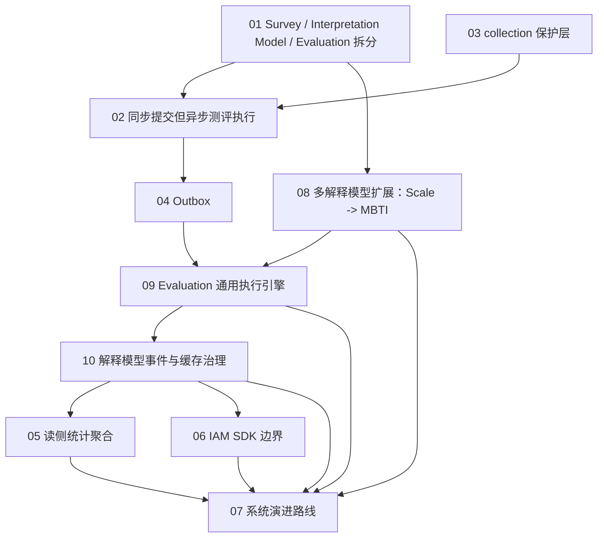

# 05-专题分析 阅读地图

**本文回答**：`05-专题分析/` 这一组文档应该如何阅读；它和 `02-业务模块/`、`03-基础设施/`、`04-接口与运维/` 的区别是什么；这些专题分别回答哪些“为什么”；如何用它们组织架构讲述、面试表达和后续演进决策。

---

## 30 秒结论

`05-专题分析/` 不是模块说明书，也不是接口手册，而是 qs-server 的 **架构决策解释层**。

它重点回答：

```text
为什么要拆分 Survey / Assessment Model / Evaluation / Interpretation Model？
为什么 Scale 不再作为独立核心模块？
为什么 MBTI / SBTI / BigFive 应该作为 Assessment Model 下的同级模型资产？
为什么 AnswerSheet 要同步提交，但测评执行要异步完成？
为什么需要 collection-server 保护前台入口？
为什么需要 Outbox 保证事件可靠出站？
为什么统计要走读侧聚合？
为什么 IAM SDK 可以嵌入 runtime，但不能侵入 domain？
为什么事件、缓存、统计、安全、观测都要围绕模型快照、执行结果和报告事实对齐？
系统下一步应该怎么演进？
```

当前专题主线已经从旧的：

```text
Survey -> Scale -> Evaluation
```

升级为：

```text
Survey -> Assessment Model -> Evaluation -> Interpretation Model / Report
```

其中：

```text
Survey
    作答事实层，负责 Questionnaire / AnswerSheet / AnswerSheetSubmittedEvent

Assessment Model
    测评模型资产层，负责 Kind / Snapshot / Binding / Payload

Evaluation
    测评执行层，负责 Assessment / EvaluationRun / EvaluationResult / Retry / Events

Interpretation Model / Report
    解释模型与报告产出层，负责 builder / adapter / InterpretReport / durable saver
```

一句话概括：

> **业务模块文档讲“是什么”，基础设施文档讲“怎么做”，专题分析讲“为什么必须这样设计，以及这样设计的代价是什么”。**

---

## 1. 本组文档定位

`05-专题分析/` 的定位是：

```text
Architecture Decision Analysis
```

它不负责：

- 罗列接口字段。
- 复述业务实体属性。
- 重写模块 README。
- 逐行解释源码。
- 写部署命令。
- 写配置项说明。

它负责：

- 把关键架构选择讲清楚。
- 分析替代方案。
- 明确收益与代价。
- 固化设计不变量。
- 给后续演进提供边界。
- 形成面试 / 宣讲时的高质量论证链。

---

## 2. 和其它文档组的关系

| 文档组 | 负责 |
| ------ | ---- |
| `00-总览/` | 系统全局视角、核心链路、源码事实矩阵 |
| `01-运行时/` | 三进程运行时、进程间调用、事件驱动链路 |
| `02-业务模块/` | Survey、Assessment Model、Evaluation、Interpretation Model、Actor、Plan、Statistics 的领域模型和模块职责 |
| `03-基础设施/` | Event、DataAccess、Redis、Resilience、Security、Integrations、Runtime、Observability 的机制深讲 |
| `04-接口与运维/` | REST/gRPC 契约、配置、部署、调度、健康检查、排障、容量 |
| `05-专题分析/` | 架构决策、取舍、代价、演进路线 |
| `06-宣讲/` | 对外讲解、技术分享、面试表达、证据链组织 |

### 2.1 关系示例

如果想了解 AnswerSheet 提交：

| 想知道 | 应看 |
| ------ | ---- |
| 答卷聚合是什么 | `02-业务模块/10-survey/` |
| 提交 REST 怎么调 | `04-接口与运维/02-collection-REST.md` |
| SubmitQueue 怎么实现 | `03-基础设施/concurrency/03-SubmitQueue提交削峰链路.md` |
| Outbox 怎么发布事件 | `03-基础设施/event/03-Outbox可靠出站链路.md` |
| 为什么要同步提交但异步测评执行 | `05-专题分析/02-为什么同步提交但异步测评执行.md` |

如果想了解新增 MBTI：

| 想知道 | 应看 |
| ------ | ---- |
| 为什么 MBTI 不放进 Scale | `05-专题分析/08-多解释模型扩展专题--从Scale到MBTI.md` |
| MBTI 如何作为模型资产接入 | `02-业务模块/20-assessment-model/README.md`、`05-专题分析/08-多解释模型扩展专题--从Scale到MBTI.md` |
| MBTI 规则如何持久化 | `03-基础设施/data-access/README.md` |
| MBTI 模型列表如何缓存 | `03-基础设施/cache/03-L2-Redis缓存设计.md` |
| MBTI 报告权限如何控制 | `03-基础设施/security/05-安全边界与降级.md` |
| MBTI 执行慢如何观测 | `03-基础设施/observability/06-告警与故障定位.md` |

---

## 3. 文档地图

当前建议目录：

```text
05-专题分析/
├── README.md
├── 01-为什么拆分Survey-InterpretationModel-Evaluation.md
├── 02-为什么同步提交但异步测评执行.md
├── 03-为什么需要collection保护层.md
├── 04-为什么使用Outbox.md
├── 05-为什么需要读侧统计聚合.md
├── 06-IAM嵌入式SDK边界分析.md
├── 07-系统演进路线.md
├── 08-多解释模型扩展专题--从Scale到MBTI.md
├── 09-Evaluation通用执行引擎专题.md
└── 10-解释模型事件与缓存治理专题.md
```

| 顺序 | 文档 | 核心问题 |
| ---- | ---- | -------- |
| 1 | [01-为什么拆分Survey-InterpretationModel-Evaluation.md](./01-为什么拆分Survey-InterpretationModel-Evaluation.md) | 为什么作答事实、解释模型协议、具体模型规则、测评执行不能合成一个大模块 |
| 2 | [02-为什么同步提交但异步测评执行.md](./02-为什么同步提交但异步测评执行.md) | 为什么 AnswerSheet 要同步落库，但 Assessment / Interpretation / Report 要异步推进 |
| 3 | [03-为什么需要collection保护层.md](./03-为什么需要collection保护层.md) | 为什么前台小程序不能直接打 apiserver |
| 4 | [04-为什么使用Outbox.md](./04-为什么使用Outbox.md) | 为什么有 MQ 还需要 Outbox |
| 5 | [05-为什么需要读侧统计聚合.md](./05-为什么需要读侧统计聚合.md) | 为什么统计不能每次实时从业务写模型算 |
| 6 | [06-IAM嵌入式SDK边界分析.md](./06-IAM嵌入式SDK边界分析.md) | 为什么 IAM SDK 可以嵌入 runtime，但不能侵入 domain |
| 7 | [07-系统演进路线.md](./07-系统演进路线.md) | 系统下一阶段如何从可运行演进到可治理、可扩展、可产品化 |
| 8 | [08-多解释模型扩展专题--从Scale到MBTI.md](./08-多解释模型扩展专题--从Scale到MBTI.md) | 为什么 MBTI 与 Scale 同级，为什么需要 Interpretation Model 抽象 |
| 9 | [09-Evaluation通用执行引擎专题.md](./09-Evaluation通用执行引擎专题.md) | 为什么 Evaluation 应该是通用测评执行引擎，而不是结果模块或 Scale 专用流水线 |
| 10 | [10-解释模型事件与缓存治理专题.md](./10-解释模型事件与缓存治理专题.md) | 解释模型变化如何影响事件、缓存、统计、权限和观测治理 |

---

## 4. 推荐阅读路径

### 4.1 按核心业务链路阅读

如果想理解“从提交答卷到报告生成”的完整设计：

```text
01-为什么拆分Survey-InterpretationModel-Evaluation
  -> 02-为什么同步提交但异步测评执行
  -> 03-为什么需要collection保护层
  -> 04-为什么使用Outbox
  -> 09-Evaluation通用执行引擎专题
```

读完后应能回答：

1. Survey、Interpretation Model、Concrete Models、Evaluation 为什么是不同边界？
2. AnswerSheet 保存和 Evaluation 执行为什么分开？
3. collection-server 为什么不是简单网关？
4. Outbox 为什么是可靠异步链路的关键？
5. Evaluation 为什么应该围绕 Assessment 生命周期，而不是围绕 Scale 算法？

---

### 4.2 按多解释模型扩展阅读

如果想理解“为什么 MBTI 不放进 Scale，以及如何扩展新模型”：

```text
01-为什么拆分Survey-InterpretationModel-Evaluation
  -> 08-多解释模型扩展专题--从Scale到MBTI
  -> 09-Evaluation通用执行引擎专题
  -> 10-解释模型事件与缓存治理专题
```

读完后应能回答：

1. Scale 的真实边界是什么？
2. MBTI 为什么不能作为 Scale 的一种特殊 Factor？
3. ModelRef / Provider / Context / Registry 分别解决什么问题？
4. ScaleProvider 与 MBTIProvider 为什么是同级实现？
5. 新增模型为什么会牵动事件、缓存、统计、安全和观测？

---

### 4.3 按后台管理与运营阅读

如果想理解“后台统计、运营、权限”的设计：

```text
05-为什么需要读侧统计聚合
  -> 06-IAM嵌入式SDK边界分析
  -> 10-解释模型事件与缓存治理专题
  -> 07-系统演进路线
```

读完后应能回答：

1. 统计为什么需要读模型和同步服务？
2. MBTI TypeCode 分布为什么属于 Statistics ReadModel，而不是 Prometheus label？
3. BehaviorProjector 为什么需要 checkpoint 和 pending retry？
4. IAM SDK 为什么可以嵌入 runtime？
5. 模型规则管理权限和报告访问权限为什么必须拆开？
6. 系统下一阶段应该优先补哪些能力？

---

### 4.4 按面试讲述阅读

如果要准备 Go / 架构 / DDD 面试，可按这个顺序：

```text
01-为什么拆分Survey-InterpretationModel-Evaluation
  -> 02-为什么同步提交但异步测评执行
  -> 04-为什么使用Outbox
  -> 08-多解释模型扩展专题--从Scale到MBTI
  -> 09-Evaluation通用执行引擎专题
  -> 03-为什么需要collection保护层
  -> 05-为什么需要读侧统计聚合
  -> 06-IAM嵌入式SDK边界分析
  -> 10-解释模型事件与缓存治理专题
  -> 07-系统演进路线
```

讲述逻辑：

```text
先讲领域拆分
再讲主链路时序
再讲可靠事件
再讲多解释模型扩展
再讲 Evaluation 通用执行引擎
再讲入口保护
再讲读侧统计
再讲安全边界
再讲事件、缓存、观测治理
最后讲演进路线
```

---

## 5. 专题之间的关系



这些专题可以理解为：

| 层次 | 专题 |
| ---- | ---- |
| 领域边界 | 01、08 |
| 主链路时序 | 02、09 |
| 前台入口保护 | 03 |
| 可靠事件出站 | 04、10 |
| 读侧运营能力 | 05、10 |
| 安全与外部系统边界 | 06、10 |
| 后续演进 | 07 |

---

## 6. 每篇专题的核心判断

### 6.1 为什么拆分 Survey / Interpretation Model / Evaluation

核心判断：

> Survey 解决“作答事实如何定义和提交”，Interpretation Model 解决“不同解释模型如何统一接入测评执行”，Concrete Models 解决“具体模型规则如何表达”，Evaluation 解决“一次测评如何执行、追踪、失败、重试、产出结果和报告”。

设计不变量：

- Survey 不直接生成报告。
- Interpretation Model 不保存具体规则事实。
- Scale 是医学量表解释模型，不是所有解释能力的中心。
- MBTI 与 Scale 同级，都是具体解释模型。
- Evaluation 不依赖 MedicalScale / Factor / RiskLevel。
- Evaluation 通过 ModelRef / Provider / Context 执行具体模型。

---

### 6.2 为什么同步提交但异步测评执行

核心判断：

> 同步提交保证“答案不会丢”，异步测评执行保证“解释模型执行和报告生成不拖垮提交体验”。

设计不变量：

- AnswerSheet 保存是提交事实边界。
- 提交成功不等于测评完成。
- Evaluation 不阻塞前台提交。
- 解释模型执行不阻塞前台提交。
- 报告等待通过 status / wait-report，而不是同步提交等待。

---

### 6.3 为什么需要 collection 保护层

核心判断：

> apiserver 负责主业务事实和领域能力，collection-server 负责保护前台入口，防止前台流量、重复提交、权限校验和长轮询直接打穿主服务。

设计不变量：

- collection 不直接写主业务数据库。
- collection 不拥有业务聚合。
- collection 不关心后续由 Scale、MBTI 还是 BigFive 解释。
- 前台 submit/query/wait-report 必须有独立保护策略。
- SubmitQueue 不是 durable MQ。
- SubmitGuard 只保护提交入口，Assessment / Interpretation 幂等仍归 Evaluation。

---

### 6.4 为什么使用 Outbox

核心判断：

> Outbox 把“业务事实落库”和“事件可靠出站”绑定在同一个持久化事务里，把 MQ 不稳定性从主写链路中隔离出去。

设计不变量：

- 关键业务事件必须和业务事实同事务 stage。
- Outbox 不能保证 consumer exactly-once。
- Consumer 仍然必须幂等。
- EventCatalog 是 topic 解析真值。
- `assessment.created / assessment.completed / interpretation.completed / report.generated` 是阶段事实。
- `interpretation-model.changed` 是规则变化事件，不是某次测评完成事件。

---

### 6.5 为什么需要读侧统计聚合

核心判断：

> 写模型回答“业务事实是什么”，读侧统计聚合回答“面向报表和运营视角，如何高效、稳定、可修复地看这些事实”。

设计不变量：

- 统计查询不直接散查多个业务模块。
- 复杂统计优先进入 ReadModel。
- 统计重建必须有锁和窗口。
- 行为投影必须有 checkpoint 和 pending retry。
- MBTI TypeCode 分布属于 Statistics ReadModel。
- TypeProfile 文案属于具体模型规则事实源，不复制进统计表。

---

### 6.6 IAM 嵌入式 SDK 边界分析

核心判断：

> IAM SDK 可以嵌入 runtime，但 IAM 语义不能侵入领域模型。

设计不变量：

- IAM SDK 不进入 domain。
- 业务 capability 不直接看 JWT roles。
- AuthzSnapshot 是请求期授权判断依据。
- 每个进程只嵌入自己需要的 IAM 能力。
- 模型规则管理权限和用户报告访问权限必须拆开。
- `manage_interpretation_models` 不等于 `read_interpretation_reports`。

---

### 6.7 系统演进路线

核心判断：

> qs-server 下一阶段不应该盲目堆新业务功能，也不应该过早拆微服务，而是先把现有主干链路打磨到生产级，并逐步从医学量表系统演进为多解释模型测评平台。

设计不变量：

- 不急于拆微服务。
- 不急于上复杂数仓。
- 不把 MBTI 塞进 Scale。
- 不让 Evaluation 依赖 MedicalScale。
- 不把 AI 解读塞进基础报告主链路。
- 不把 governance endpoint 做成万能操作台。

---

### 6.8 多解释模型扩展专题：从 Scale 到 MBTI

核心判断：

> Scale 是具体解释模型，MBTI 是另一个具体解释模型；二者应通过统一 Interpretation Model 抽象接入 Evaluation，而不是让 MBTI 污染 MedicalScale 模型。

设计不变量：

- ScaleProvider 与 MBTIProvider 同级。
- ModelRef 必须包含 ModelType / ModelCode / ModelVersion。
- Context 是只读规则快照，不是可变领域聚合。
- Provider 不保存结果。
- EvaluationResult / InterpretReport 归 Evaluation 事实源。

---

### 6.9 Evaluation 通用执行引擎专题

核心判断：

> Evaluation 管的是一次 Assessment 的执行生命周期，不是某一个模型的算法，也不是简单结果表。

设计不变量：

- Assessment 是执行事实。
- EvaluationRun 是执行尝试。
- EvaluationResult 是结构化结果快照。
- InterpretReport 是报告事实。
- Retry 必须使用原始 ModelRef / RuleSnapshotRef。
- 失败必须落到 Assessment failed 和 EvaluationRun failed。

---

### 6.10 解释模型事件与缓存治理专题

核心判断：

> 解释模型扩展会影响事件、缓存、统计、安全和观测，但这些横切能力只服务事实流转与治理，不应反向成为模型事实源。

设计不变量：

- 规则事实在具体模型模块。
- 执行事实在 Evaluation。
- 统计事实在 ReadModel。
- 缓存可回源。
- Metrics label 只能用低基数 `model_type`，不能用 `model_code`。
- Governance endpoint 默认只读或受控。
- 规则变化事件不默认触发历史测评重算。

---

## 7. 可复用的架构讲述模板

### 7.1 30 秒版本

```text
qs-server 是一个面向心理、医学和人格测评场景的 Go 后端系统。

它把测评分成四层：Survey 负责问卷和答卷事实；Interpretation Model 定义解释模型接入协议；Scale、MBTI 等具体模型负责规则表达；Evaluation 作为通用测评执行引擎，按 ModelRef 加载 Provider 执行模型，并产出 EvaluationResult 和 InterpretReport。

系统通过 Outbox、Worker、Redis、ReadModel、安全控制面和 Governance endpoint，保证答卷提交、异步执行、报告生成、统计查询和排障观测的可靠性。
```

### 7.2 3 分钟版本

可以按以下顺序展开：

```text
1. 业务背景：测评不是简单问卷，而是“作答 + 模型解释 + 报告”
2. 领域拆分：Survey / Interpretation Model / Concrete Models / Evaluation
3. 主链路：AnswerSheet -> Assessment -> Provider -> Result -> Report
4. 可靠性：Outbox / Worker / Retry / Idempotency
5. 高并发：collection-server / RateLimit / SubmitQueue / SubmitGuard
6. 数据层：Mongo / MySQL / ReadModel / Redis
7. 安全与观测：AuthzSnapshot / Capability / Metrics / Governance
8. 扩展性：MBTI 与 Scale 同级接入
```

### 7.3 面试追问版本

常见追问：

| 追问 | 应答文档 |
| ---- | -------- |
| 为什么不一个模块搞定？ | 01 |
| 为什么不提交后直接生成报告？ | 02 |
| collection-server 和网关有什么区别？ | 03 |
| MQ 已经可靠，为什么还要 Outbox？ | 04 |
| 为什么 MBTI 不放进 Scale？ | 08 |
| Evaluation 为什么是通用执行引擎？ | 09 |
| interpretation-model.changed 和 interpretation.completed 有什么区别？ | 10 |
| 统计为什么不用实时 SQL？ | 05 |
| IAM SDK 嵌入会不会污染业务？ | 06 |
| 下一步怎么演进？ | 07 |

---

## 8. 旧表达替换规则

维护专题文档时，优先替换这些旧表达：

| 旧表达 | 新表达 |
| ------ | ------ |
| Scale 管怎么算和怎么解释 | Scale 是 Assessment Model 下的医学量表模型资产 |
| Evaluation 管结果和报告 | Evaluation 管一次测评执行生命周期，Interpretation Model / Report 管最终报告 |
| Evaluation Pipeline = FactorScore / RiskLevel / Interpretation | Evaluation 执行模型，Report builder / adapter 组装 InterpretReport |
| MBTI 是 Scale 的一种 | MBTI 与 Scale 同级，都是 Assessment Model 下的模型资产 |
| `assessment.submitted` | `assessment.created` / `assessment.completed` |
| `assessment.interpreted` | `interpretation.completed` |
| `CalculateAnswerSheetScore` | `Provider.Evaluate` / `CompleteAssessment` |
| ScaleChangedEvent 自动重算历史 | 规则变化只触发缓存失效 / 读模型刷新，历史重算需 ReEvaluationJob |

---

## 9. 后续维护原则

1. 专题分析只写“为什么”，不重复模块 README。
2. 每篇专题必须包含替代方案分析。
3. 每篇专题必须写收益和代价。
4. 每篇专题必须写设计不变量。
5. 每篇专题必须有代码锚点。
6. 新增重大架构决策时，优先补专题，而不是散落到模块文档。
7. 专题文档不能脱离源码事实。
8. 演进路线应定期回顾，不应变成静态口号。
9. 凡涉及解释模型扩展，必须区分规则变化、一次执行、报告生成、统计投影和缓存治理。
10. 凡涉及 MBTI / BigFive 等新模型，不得反向污染 Scale、Evaluation 主模型或基础设施事实源。

---

## 10. 下一步建议

建议按以下顺序继续维护：

| 顺序 | 文档 | 动作 |
| ---- | ---- | ---- |
| 1 | `01-为什么拆分survey-scale-evaluation.md` | 重写或重命名为 `01-为什么拆分Survey-InterpretationModel-Evaluation.md` |
| 2 | `02-为什么同步提交但异步评估.md` | 重写为同步提交但异步测评执行 |
| 3 | `04-为什么使用Outbox.md` | 同步新的事件语义 |
| 4 | `07-系统演进路线.md` | 更新多解释模型平台演进路线 |
| 5 | `08-多解释模型扩展专题--从Scale到MBTI.md` | 新增 |
| 6 | `09-Evaluation通用执行引擎专题.md` | 新增 |
| 7 | `10-解释模型事件与缓存治理专题.md` | 新增 |
| 8 | `03-为什么需要collection保护层.md` | 补充解释模型边界 |
| 9 | `05-为什么需要读侧统计聚合.md` | 补充 MBTI / 模型统计 |
| 10 | `06-IAM嵌入式SDK边界分析.md` | 补充解释模型权限 |

当前重点不是继续无节制扩充专题数量，而是把系统主叙事从“量表系统”切换为“多解释模型测评平台”。
