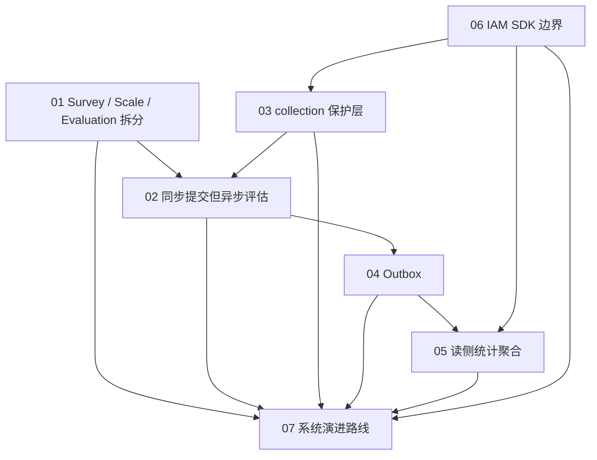

# 05-专题分析 阅读地图

**本文回答**：`05-专题分析/` 这一组文档应该如何阅读；它和 `02-业务模块/`、`03-基础设施/`、`04-接口与运维/` 的区别是什么；这 7 篇专题分别回答哪些“为什么”；如何用它们组织架构讲述、面试表达和后续演进决策。

---

## 30 秒结论

`05-专题分析/` 不是模块说明书，也不是接口手册，而是 qs-server 的**架构决策解释层**。

它重点回答：

```text
为什么这样拆？
为什么这样异步？
为什么需要保护层？
为什么需要 Outbox？
为什么需要读侧聚合？
为什么 IAM 以 SDK 形式嵌入？
系统下一步应该怎么演进？
```

新版目录：

```text
05-专题分析/
├── README.md
├── 01-为什么拆分survey-scale-evaluation.md
├── 02-为什么同步提交但异步评估.md
├── 03-为什么需要collection保护层.md
├── 04-为什么使用Outbox.md
├── 05-为什么需要读侧统计聚合.md
├── 06-IAM嵌入式SDK边界分析.md
└── 07-系统演进路线.md
```

一句话概括：

> **业务模块文档讲“是什么”，基础设施文档讲“怎么做”，专题分析讲“为什么必须这样设计，以及这样设计的代价是什么”。**

---

## 1. 本组文档定位

`05-专题分析/` 的定位是：

```text
Architecture Decision Analysis
```

它不负责：

- 罗列接口字段。
- 复述业务实体属性。
- 重写模块 README。
- 逐行解释源码。
- 写部署命令。
- 写配置项说明。

它负责：

- 把关键架构选择讲清楚。
- 分析替代方案。
- 明确收益与代价。
- 固化设计不变量。
- 给后续演进提供边界。
- 形成面试/宣讲时的高质量论证链。

---

## 2. 和其它文档组的关系

| 文档组 | 负责 |
| ------ | ---- |
| `00-总览/` | 系统全局视角、核心链路、源码事实矩阵 |
| `01-运行时/` | 三进程运行时、进程间调用、事件驱动链路 |
| `02-业务模块/` | Survey / Scale / Evaluation / Actor / Plan / Statistics 的领域模型和模块职责 |
| `03-基础设施/` | Event、DataAccess、Redis、Resilience、Security、Integrations、Runtime、Observability 的机制深讲 |
| `04-接口与运维/` | REST/gRPC 契约、配置、部署、调度、健康检查、排障、容量 |
| `05-专题分析/` | 架构决策、取舍、代价、演进路线 |

### 2.1 关系示例

如果想了解 AnswerSheet 提交：

| 想知道 | 应看 |
| ------ | ---- |
| 答卷聚合是什么 | `02-业务模块/survey/` |
| 提交 REST 怎么调 | `04-接口与运维/02-collection-REST.md` |
| SubmitQueue 怎么实现 | `03-基础设施/resilience/02-SubmitQueue提交削峰.md` |
| Outbox 怎么发布事件 | `03-基础设施/event/02-Publish与Outbox.md` |
| 为什么要同步提交但异步评估 | `05-专题分析/02-为什么同步提交但异步评估.md` |

---

## 3. 文档地图

| 顺序 | 文档 | 核心问题 |
| ---- | ---- | -------- |
| 1 | [01-为什么拆分survey-scale-evaluation.md](./01-为什么拆分survey-scale-evaluation.md) | 为什么问卷、量表、评估不能合成一个大模块 |
| 2 | [02-为什么同步提交但异步评估.md](./02-为什么同步提交但异步评估.md) | 为什么 AnswerSheet 要同步落库，但 Evaluation 要异步执行 |
| 3 | [03-为什么需要collection保护层.md](./03-为什么需要collection保护层.md) | 为什么前台小程序不能直接打 apiserver |
| 4 | [04-为什么使用Outbox.md](./04-为什么使用Outbox.md) | 为什么有 MQ 还需要 Outbox |
| 5 | [05-为什么需要读侧统计聚合.md](./05-为什么需要读侧统计聚合.md) | 为什么统计不能每次实时从业务写模型算 |
| 6 | [06-IAM嵌入式SDK边界分析.md](./06-IAM嵌入式SDK边界分析.md) | 为什么 IAM SDK 可以嵌入 runtime，但不能侵入 domain |
| 7 | [07-系统演进路线.md](./07-系统演进路线.md) | 系统下一阶段应该如何从可运行演进到可治理、可扩展、可产品化 |

---

## 4. 推荐阅读路径

### 4.1 按核心业务链路阅读

如果想理解“从提交答卷到报告生成”的完整设计：

```text
01-为什么拆分survey-scale-evaluation
  -> 02-为什么同步提交但异步评估
  -> 03-为什么需要collection保护层
  -> 04-为什么使用Outbox
```

读完后应能回答：

1. Survey、Scale、Evaluation 为什么是三个边界？
2. AnswerSheet 保存和 Evaluation 执行为什么分开？
3. collection-server 为什么不是简单网关？
4. Outbox 为什么是可靠异步链路的关键？

---

### 4.2 按后台管理与运营阅读

如果想理解“后台统计、运营、权限”的设计：

```text
05-为什么需要读侧统计聚合
  -> 06-IAM嵌入式SDK边界分析
  -> 07-系统演进路线
```

读完后应能回答：

1. 统计为什么需要读模型和同步服务？
2. BehaviorProjector 为什么需要 checkpoint 和 pending retry？
3. IAM SDK 为什么可以嵌入 runtime？
4. AuthzSnapshot 为什么是业务权限判断依据？
5. 系统下一阶段应该优先补哪些能力？

---

### 4.3 按面试讲述阅读

如果要准备 Go / 架构 / DDD 面试，可按这个顺序：

```text
01-为什么拆分survey-scale-evaluation
  -> 02-为什么同步提交但异步评估
  -> 04-为什么使用Outbox
  -> 03-为什么需要collection保护层
  -> 05-为什么需要读侧统计聚合
  -> 06-IAM嵌入式SDK边界分析
  -> 07-系统演进路线
```

讲述逻辑：

```text
先讲领域拆分
再讲主链路时序
再讲可靠事件
再讲入口保护
再讲读侧统计
再讲安全边界
最后讲演进路线
```

---

## 5. 七篇专题之间的关系



这 7 篇可以理解为：

| 层次 | 专题 |
| ---- | ---- |
| 领域边界 | 01 |
| 主链路时序 | 02 |
| 前台入口保护 | 03 |
| 可靠事件出站 | 04 |
| 读侧运营能力 | 05 |
| 安全与外部系统边界 | 06 |
| 后续演进 | 07 |

---

## 6. 每篇专题的核心判断

### 6.1 为什么拆分 Survey / Scale / Evaluation

核心判断：

> Survey 解决“收集什么答案”，Scale 解决“这些答案如何被医学规则解释”，Evaluation 解决“一次测评如何执行、落库、出报告”。

设计不变量：

- Survey 不直接生成报告。
- Scale 不保存 Assessment。
- Evaluation 不修改 Questionnaire / MedicalScale。
- Evaluation 通过 InputSnapshot 读取输入。

---

### 6.2 为什么同步提交但异步评估

核心判断：

> 同步提交保证“答案不会丢”，异步评估保证“报告生成不拖垮提交体验”。

设计不变量：

- AnswerSheet 保存是提交事实边界。
- 提交成功不等于评估完成。
- Evaluation 不阻塞前台提交。
- 报告等待通过 status / wait-report，而不是同步提交等待。

---

### 6.3 为什么需要 collection 保护层

核心判断：

> apiserver 负责主业务事实和领域能力，collection-server 负责保护前台入口，防止前台流量、重复提交、权限校验和长轮询直接打穿主服务。

设计不变量：

- collection 不直接写主业务数据库。
- collection 不拥有业务聚合。
- 前台 submit/query/wait-report 必须有独立保护策略。
- SubmitQueue 不是 durable MQ。

---

### 6.4 为什么使用 Outbox

核心判断：

> Outbox 把“业务事实落库”和“事件可靠出站”绑定在同一个持久化事务里，把 MQ 不稳定性从主写链路中隔离出去。

设计不变量：

- 关键业务事件必须和业务事实同事务 stage。
- Outbox 不能保证 consumer exactly-once。
- Consumer 仍然必须幂等。
- EventCatalog 是 topic 解析真值。

---

### 6.5 为什么需要读侧统计聚合

核心判断：

> 写模型回答“业务事实是什么”，读侧统计聚合回答“面向报表和运营视角，如何高效、稳定、可修复地看这些事实”。

设计不变量：

- 统计查询不直接散查多个业务模块。
- 复杂统计优先进入 ReadModel。
- 统计重建必须有锁和窗口。
- 行为投影必须有 checkpoint 和 pending retry。

---

### 6.6 IAM 嵌入式 SDK 边界分析

核心判断：

> IAM SDK 可以嵌入 runtime，但 IAM 语义不能侵入领域模型。

设计不变量：

- IAM SDK 不进入 domain。
- 业务 capability 不直接看 JWT roles。
- AuthzSnapshot 是请求期授权判断依据。
- 每个进程只嵌入自己需要的 IAM 能力。

---

### 6.7 系统演进路线

核心判断：

> qs-server 下一阶段不应该盲目堆新业务功能，也不应该过早拆微服务，而是先把现有主干链路打磨到生产级。

设计不变量：

- 不急于拆微服务。
- 不急于上复杂数仓。
- 不把 AI 解读塞进基础报告主链路。
- 不把 governance endpoint 做成万能操作台。

---

## 7. 可复用的架构讲述模板

### 7.1 30 秒版本

```text
qs-server 是一个问卷&量表测评系统。系统把 Survey、Scale、Evaluation 拆成三个边界：Survey 负责问卷和答卷，Scale 负责量表规则，Evaluation 负责测评执行和报告生成。

前台请求先进入 collection-server，由它做认证、限流、提交削峰、幂等和监护关系校验，再通过 gRPC 调 apiserver 保存 AnswerSheet。AnswerSheet 保存后通过 Outbox 发出 answersheet.submitted 事件，由 worker 异步触发计分、创建 Assessment 和报告生成。

后台统计不直接扫业务写模型，而是通过 Statistics 读侧聚合、BehaviorProjector、SyncService 和 QueryCache 支撑运营查询。权限和身份通过 IAMModule 嵌入 SDK，但业务授权以 AuthzSnapshot 为准，不直接依赖 JWT roles。
```

### 7.2 3 分钟版本

可以按以下顺序展开：

```text
1. 领域拆分：Survey / Scale / Evaluation
2. 主链路：同步提交 + 异步评估
3. 入口保护：collection-server
4. 可靠事件：Outbox
5. 读侧能力：Statistics read model
6. 安全边界：IAMModule / AuthzSnapshot
7. 演进路线：可靠性、治理、容量、产品化
```

### 7.3 面试追问版本

常见追问：

| 追问 | 应答文档 |
| ---- | -------- |
| 为什么不一个模块搞定？ | 01 |
| 为什么不提交后直接生成报告？ | 02 |
| collection-server 和网关有什么区别？ | 03 |
| MQ 已经可靠，为什么还要 Outbox？ | 04 |
| 统计为什么不用实时 SQL？ | 05 |
| IAM SDK 嵌入会不会污染业务？ | 06 |
| 下一步怎么演进？ | 07 |

---

## 8. 后续维护原则

1. 专题分析只写“为什么”，不重复模块 README。
2. 每篇专题必须包含替代方案分析。
3. 每篇专题必须写收益和代价。
4. 每篇专题必须写设计不变量。
5. 每篇专题必须有代码锚点。
6. 新增重大架构决策时，优先补专题，而不是散落到模块文档。
7. 专题文档不能脱离源码事实。
8. 演进路线应定期回顾，不应变成静态口号。

---

## 9. 下一步建议

如果继续完善 `05-专题分析/`，后续可以补充但不急：

| 可选专题 | 价值 |
| -------- | ---- |
| 为什么暂不拆微服务 | 解释模块化单体的阶段合理性 |
| 为什么暂不上数仓 | 解释当前 read model + sync 的阶段合理性 |
| 为什么 AI 解读应作为增强层 | 防止 AI 能力污染基础报告链路 |
| 为什么 governance endpoint 默认只读 | 防止运维接口变成危险操作台 |
| 为什么 Redis 分 family | 解释 cache/lock/sdk/hotset 隔离 |

当前 7 篇已经足够覆盖主干架构决策，不建议继续无节制扩充。
