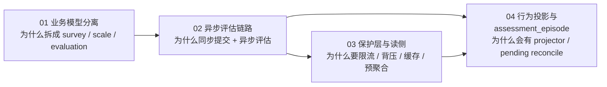

# 专题分析

**本文回答**：`05-专题分析` 这一组文档不再按进程或模块切分，而是专门回答 `qs-server` 为什么会被设计成现在这样，以及跨模块、跨运行时的关键判断该如何理解。

## 30 秒结论

如果只看一屏，先记住下面这张表：

| 维度 | 结论 |
| ---- | ---- |
| 本组作用 | 解释“为什么这样拆、为什么这样跑、为什么要这样保护”，不是重复模块内对象清单 |
| 三个核心问题 | 为什么 `survey / scale / evaluation` 分离；为什么提交同步但评估异步；为什么保护层与读侧要单独存在 |
| 阅读方式 | 先抓设计判断，再回到 `00/02/03` 找代码、契约和运行时证据 |
| 真值边界 | 专题文写“跨层问题”；模块静态设计看 [02-业务模块](../02-业务模块/)，事件/缓存/配置机制看 [03-基础设施](../03-基础设施/)；行为投影细节看 [behavior-projection/README.md](./behavior-projection/README.md) |

## 重点速查

1. **专题文优先回答“为什么”**：对象和目录只作为证据，不是正文主角。  
2. **图要跟着问题走**：拆界问题放对象/边界图，链路问题放时序图，保护层问题放读写/削峰图。  
3. **不要把专题写成第二份模块文**：模块内模型、接口和代码锚点，优先回到 [02-业务模块](../02-业务模块/)。  
4. **这组最适合在读完总览后进入**：先有系统骨架，再读专题，理解会稳定得多。  

## 为什么这一组要单独存在

很多关键判断不能只靠单篇模块文说明白：

- 只看 `survey`，解释不了为什么 `scale` 不能并进去
- 只看 `evaluation`，解释不了为什么前台请求不能同步跑完整评估
- 只看 `03-基础设施`，解释不了保护层为什么要围绕这条业务链而存在

所以这一组承担的是**跨模块、跨进程、跨机制的设计解释层**。

## 专题地图

先看这张图，再决定先读哪篇。

| 顺序 | 文档 | 先回答什么问题 |
| ---- | ---- | -------------- |
| 1 | [01-测评业务模型：survey、scale、evaluation 为什么分离.md](./01-测评业务模型：survey、scale、evaluation%20为什么分离.md) | 为什么主业务一定要拆成采集、规则、产出三界 |
| 2 | [02-异步评估链路：从答卷提交到报告生成.md](./02-异步评估链路：从答卷提交到报告生成.md) | 为什么提交答卷同步返回，而计分和报告走异步链 |
| 3 | [03-保护层与读侧架构：限流、背压、缓存、统计预聚合.md](./03-保护层与读侧架构：限流、背压、缓存、统计预聚合.md) | 为什么系统稳定性依赖保护层和读侧，而不是单一缓存 |
| 4 | [behavior-projection/README.md](./behavior-projection/README.md) | 当前行为 projector 到底在做什么，为什么会有 pending reconcile |

## 与其他层如何分工

| 文档层 | 优先回答什么 | 与本组关系 |
| ------ | ------------ | ---------- |
| [00-总览](../00-总览/) | 系统地图、主链路、代码边界 | 专题的全局坐标系 |
| [01-运行时](../01-运行时/) | 三进程协作、调用方向、时序 | 专题的运行时证据 |
| [02-业务模块](../02-业务模块/) | 模块边界、对象、服务、模块内关键设计 | 专题的静态设计证据 |
| [03-基础设施](../03-基础设施/) | 事件、存储、缓存、限流、IAM、配置 | 专题的机制证据 |
| [04-接口与运维](../04-接口与运维/) | REST / gRPC 契约、端口、调度 | 专题中的对外面与运维证据 |

## 建议阅读顺序

第一次读这组文档，建议顺序是：

1. [01-测评业务模型：survey、scale、evaluation 为什么分离.md](./01-测评业务模型：survey、scale、evaluation%20为什么分离.md)
2. [02-异步评估链路：从答卷提交到报告生成.md](./02-异步评估链路：从答卷提交到报告生成.md)
3. [03-保护层与读侧架构：限流、背压、缓存、统计预聚合.md](./03-保护层与读侧架构：限流、背压、缓存、统计预聚合.md)
4. [behavior-projection/README.md](./behavior-projection/README.md)
配合阅读：

- [../00-总览/01-系统地图.md](../00-总览/01-系统地图.md)
- [../00-总览/03-核心业务链路.md](../00-总览/03-核心业务链路.md)
- [../02-业务模块](../02-业务模块/)
- [../03-基础设施](../03-基础设施/)

原 [04-行为投影与assessment_episode：当前projector方案.md](./04-行为投影与assessment_episode：当前projector方案.md) 保留为兼容入口；深讲与长期维护以 [behavior-projection/README.md](./behavior-projection/README.md) 为准。

这组文档解释的是**当前代码里的核心设计判断**，不展开设计演进史，也不重复模块级接口清单。

## Redis / Cache 文档现在放在哪

缓存 / Redis 这条线已经从专题层收口回基础设施真值层：

- 当前实现与运行边界：
  [../03-基础设施/06-Redis使用情况.md](../03-基础设施/06-Redis使用情况.md)
- 三层设计与落地手册：
  [../03-基础设施/11-Redis三层设计与落地手册.md](../03-基础设施/11-Redis三层设计与落地手册.md)

旧的 [05-缓存体系设计：从零散缓存到统一缓存平台.md](../_archive/05-专题分析/05-缓存体系设计：从零散缓存到统一缓存平台.md) 现已迁入 archive，只保留演进背景。
