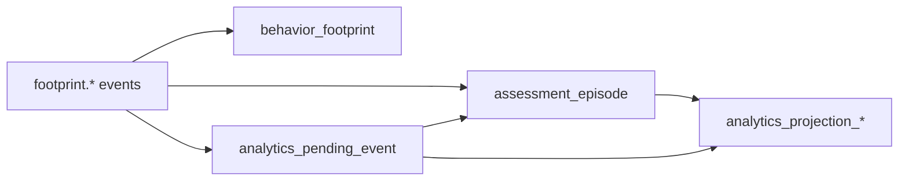
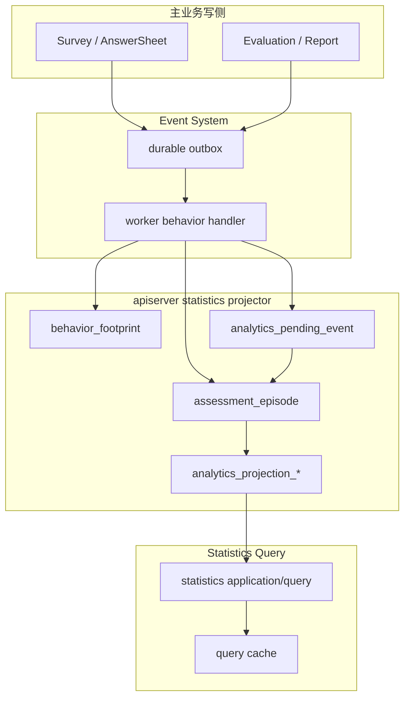
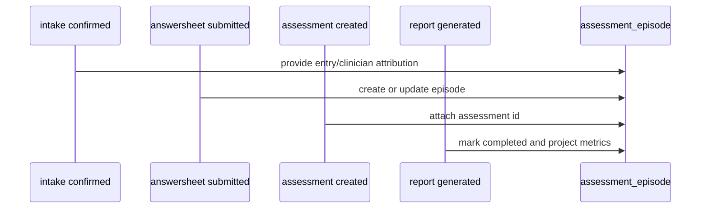

# Behavior Projection 整体模型

**本文回答**：行为投影中的 footprint、pending event、assessment episode 和 analytics projection 分别是什么，以及它们为什么不能合并成一个表。

## 30 秒结论

| 模型 | 定位 |
| ---- | ---- |
| `behavior_footprint` | 原始行为足迹，用于保留发生过的事件事实 |
| `assessment_episode` | 围绕一次测评的统计旅程，串联 intake、submit、assessment、report、failed |
| `analytics_projection_*` | 面向统计查询的聚合读模型 |
| `analytics_pending_event` | 乱序或暂缺归因条件时的延迟重放队列 |

## 专题要解决什么问题

行为投影解决的是“业务事件已经发生，但统计查询需要按另一种视角组织事实”的问题。主业务模型关注写入正确性：答卷是否提交、测评是否完成、报告是否生成。统计读侧关注分析视角：某个受试者经历了怎样的测评旅程、某个医生负责的测评完成率如何、某段时间内失败或完成趋势如何。

如果直接用业务表实时 join，会遇到三类问题：

| 问题 | 影响 |
| ---- | ---- |
| 跨事件归因 | intake、submit、assessment、report 可能不按顺序发生 |
| 查询形态不同 | 统计需要按时间、组织、医生、受试者、状态聚合 |
| 历史回溯 | 需要保留原始行为事实，以便排查投影是否正确 |

因此 behavior projection 把模型拆成四类：原始事实、旅程状态、查询投影、pending 补偿。

## 主模型图



这套模型的关键不是“把所有行为存进一个大表”，而是分清原始事实、旅程状态和查询聚合。这样统计查询可以快，回溯和补偿也有依据。

## 架构设计



主业务写侧不直接更新统计投影；它只发布 footprint 事件。投影写入统一回到 apiserver statistics projector，这样事务、归因和补偿规则集中在一个地方。

## 领域模型设计

| 模型 | 类型 | 设计职责 |
| ---- | ---- | -------- |
| `BehaviorFootprint` | 原始事实 | 保存行为发生的事实，不承担查询优化 |
| `AssessmentEpisode` | 统计旅程聚合 | 串联一次测评从 intake 到 report/failed 的关键时间点 |
| `AnalyticsProjection` | 读模型 | 面向统计 API 的聚合结果 |
| `AnalyticsPendingEvent` | 补偿队列 | 表达暂时无法归因或需要重放的事件 |
| Projector | 应用服务 / 领域服务边界 | 根据事件类型更新 footprint、episode、pending、projection |

## 设计模式应用

| 模式 | 具体体现 | 为什么使用 |
| ---- | -------- | ---------- |
| CQRS / Read Model | 业务写模型与统计读模型分离 | 统计查询形态和业务写模型不同 |
| Outbox | `footprint.*` durable_outbox | 保证行为事件可靠出站 |
| Projector | `application/statistics/journey.go` | 把事件事实转成统计投影 |
| 状态机 | episode/pending 状态推进 | 乱序和失败需要显式状态 |
| 重试队列 | `analytics_pending_event` | 归因条件缺失时延迟重放 |

## 为什么不合成一个表

一个大表看起来简单，但会把原始事实、归因状态和查询聚合混在一起。一旦投影规则变更，很难判断某一行是原始事实还是衍生结果；一旦乱序事件到达，也很难表达“现在不能投影但未来可以重放”。四类模型拆开后，排障路径更长，但事实层次清楚。

## 为什么需要 episode

`assessment_episode` 解决的是跨事件归因问题：一次测评可能先有答卷提交，后有测评创建，再有报告生成或失败；clinician/entry 归因也可能依赖更早或更晚到达的 intake 事件。



## 边界表

| 边界 | 当前事实 |
| ---- | -------- |
| 不改业务写模型 | projector 不修改 AnswerSheet、Assessment 或 Report 权威状态 |
| 不做强一致查询 | 统计投影允许异步最终一致，pending/reconcile 负责补偿 |
| 不吞掉原始事实 | footprint 保留原始行为事实，projection 只是查询优化 |
| 不替代事件系统 | event catalog、outbox、worker ack/nack 仍以 Event System truth layer 为准 |

## 取舍与边界

| 取舍 | 当前选择 |
| ---- | -------- |
| 最终一致 | 统计投影允许延迟，换取写侧低耦合 |
| 归因补偿 | pending/reconcile 显式表达，而不是静默丢弃 |
| 原始事实保留 | footprint 不被 projection 替代，便于审计 |
| 不承诺 exactly-once | 通过 outbox、幂等投影和 pending 降低风险，但不宣称 exactly-once |

## 代码锚点与测试锚点

- 领域 journey 模型：[internal/apiserver/domain/statistics/journey.go](../../../internal/apiserver/domain/statistics/journey.go)
- projector 主逻辑：[internal/apiserver/application/statistics/journey.go](../../../internal/apiserver/application/statistics/journey.go)
- 数据结构：[internal/apiserver/infra/mysql/statistics/po_journey.go](../../../internal/apiserver/infra/mysql/statistics/po_journey.go)
- Event System 文档：[../../03-基础设施/event/README.md](../../03-基础设施/event/README.md)

## Verify

```bash
go test ./internal/apiserver/application/statistics
```
