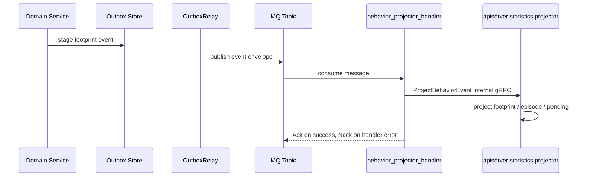
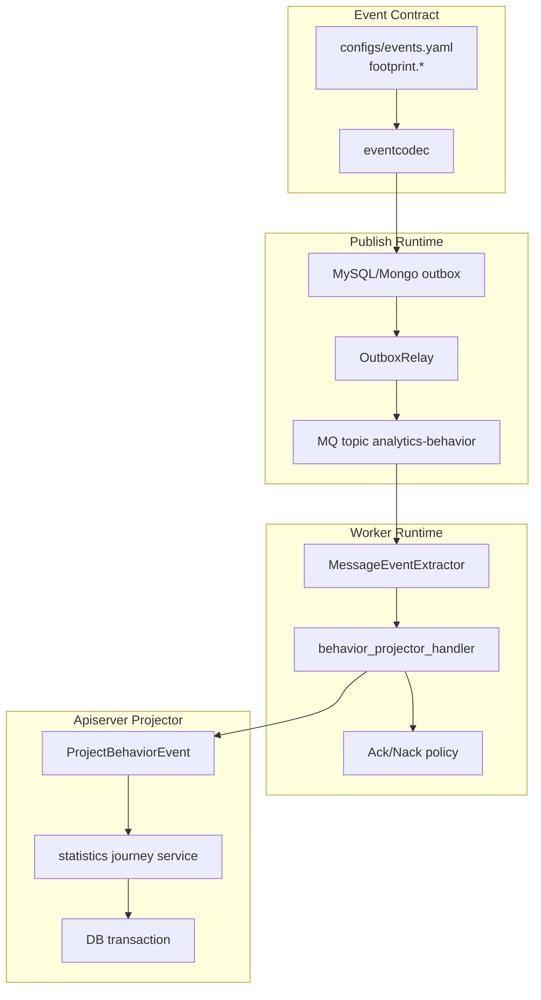
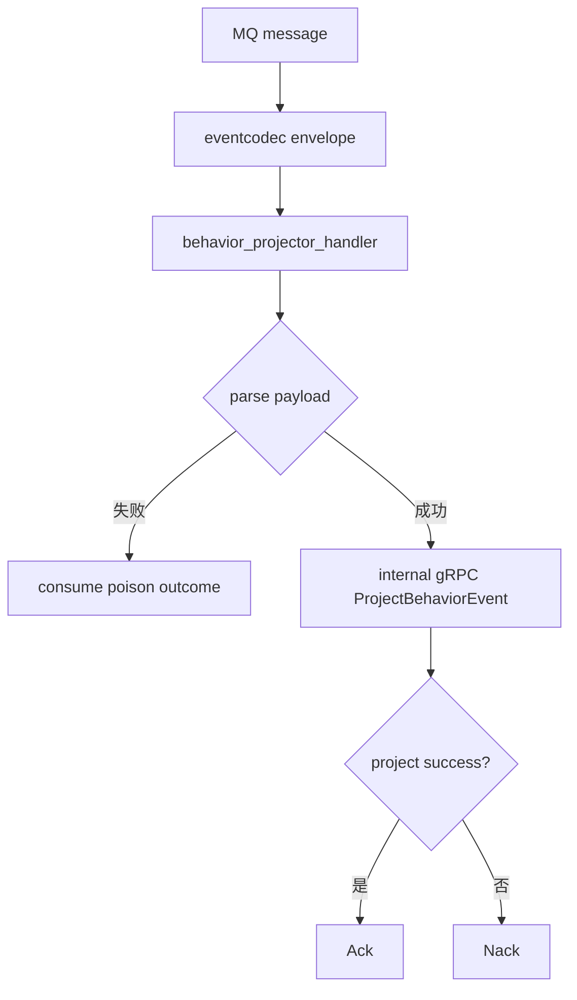

# Behavior Projection 运行时链路

**本文回答**：footprint 事件如何从业务侧写入 outbox，经 worker 消费后调用 apiserver projector，并最终更新统计读模型。

## 30 秒结论

| 阶段 | 当前事实 |
| ---- | -------- |
| 事件契约 | `footprint.*` 事件在 `configs/events.yaml` 中归属 `analytics-behavior` topic |
| 可靠出站 | footprint 事件属于 durable outbox，先进入 outbox，再由 relay 发布 |
| 消费端 | worker `behavior_projector_handler` 解析事件并通过 internal gRPC 调用 apiserver |
| 投影端 | apiserver `statistics/journey.go` 在事务内更新 footprint、episode、projection 或 pending |

## 运行时链路要解决什么问题

行为投影既要可靠接收业务事实，又要避免 worker 直接操作 apiserver 数据库。运行时链路的设计目标是：

| 目标 | 设计 |
| ---- | ---- |
| 可靠出站 | footprint 事件走 durable outbox |
| 消费解耦 | worker 只做事件适配和调用 internal gRPC |
| 写模型权威 | 投影写入仍在 apiserver 事务内完成 |
| 可重试 | handler 失败走 Nack，业务暂缺归因进入 pending |

## 时序图



worker 只负责事件适配和调用，不直接写统计表。统计读模型的事务边界留在 apiserver 内部。

## 架构分层



这个分层复用了事件系统的通用模型：契约在 catalog，编码在 codec，发布在 outbox/runtime，消费在 worker runtime，业务投影回到 apiserver。

## Handler 分发

`behavior_projector_handler` 按 event type 解析 payload，并组装 `ProjectBehaviorEventRequest`。解析失败属于 poison message，消费层按事件系统的 Ack/Nack 策略处理；业务处理失败则返回 error，让 MQ 走 Nack。



## 设计模式与取舍

| 模式 / 技法 | 位置 | 作用 |
| ----------- | ---- | ---- |
| Adapter | worker handler 将 event payload 转 internal gRPC | worker 不直接依赖 apiserver repository |
| Outbox relay | apiserver 可靠发布 footprint 事件 | publish 与业务事务解耦 |
| Settlement policy | worker messaging Ack/Nack | poison、成功、失败路径统一 |
| Transaction Script | apiserver projector | 在一个事务内更新 footprint/episode/projection/pending |

替代方案是 worker 直接写统计数据库。这个方案减少一次 gRPC，但会让 worker 持有 apiserver 数据模型和事务规则，后续 schema 变化会同时影响两个进程。当前设计选择多一次 internal RPC，换取写模型权威集中。

## 当前不支持

| 能力 | 边界 |
| ---- | ---- |
| worker 本地投影事务 | 当前所有投影写入回到 apiserver |
| operating 手工重放 | 事件系统只提供只读状态，不提供 replay/repair 动作 |
| exactly-once 消费 | 依赖幂等投影和 pending 降低重复风险，不承诺 exactly-once |

## 代码锚点与测试锚点

- 事件契约：[configs/events.yaml](../../../configs/events.yaml)
- worker handler：[internal/worker/handlers/behavior_handler.go](../../../internal/worker/handlers/behavior_handler.go)
- worker event runtime：[internal/worker/integration/eventing/](../../../internal/worker/integration/eventing/)、[internal/worker/integration/messaging/](../../../internal/worker/integration/messaging/)
- apiserver projector：[internal/apiserver/application/statistics/journey.go](../../../internal/apiserver/application/statistics/journey.go)

## Verify

```bash
go test ./internal/worker/handlers ./internal/worker/integration/messaging ./internal/apiserver/application/statistics
```
