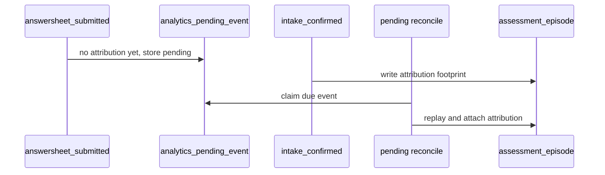
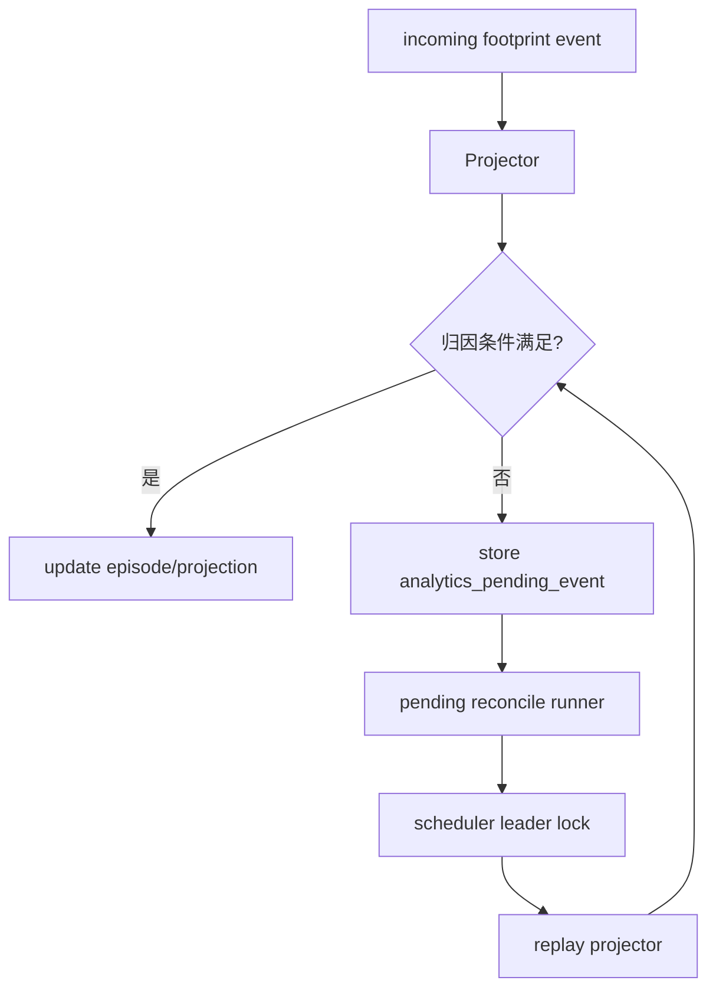
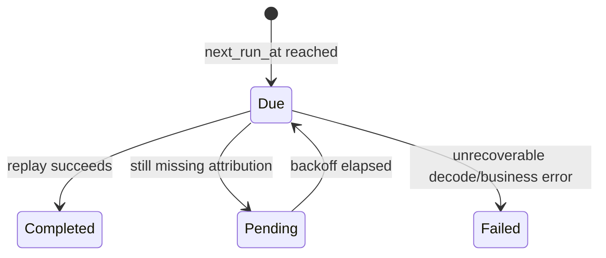

# Pending 与 Reconcile

**本文回答**：为什么行为投影需要 pending event，以及 reconcile scheduler 当前解决什么问题、不解决什么问题。

## 30 秒结论

| 问题 | 结论 |
| ---- | ---- |
| pending 为什么存在 | 事件乱序或归因条件缺失时，立即投影会产生错误归因 |
| pending 存什么 | event id、event type、payload、下一次重试时间、原因和 attempt |
| reconcile 做什么 | 周期性扫描 pending，到期后重放 projector |
| 不做什么 | 不保证 exactly-once，不替代 outbox，不修改业务写模型 |

## Pending 要解决什么问题

行为事件可能乱序到达，或者某个事件到达时缺少归因条件。例如 submit 先到，但 intake/entry 归因还没到；report generated 先到，但 assessment episode 还没建立。如果此时强行写 projection，会产生错误归因；如果直接丢弃，会丢失统计事实。

Pending 把这种状态显式化：事件已经发生，但现在还不能安全投影。它保存 payload、原因、attempt 和下一次重试时间，等待 reconcile 重新尝试。

## 乱序场景



pending 的价值是把“暂时无法正确归因”变成显式状态，而不是悄悄丢失或写错。

## 架构设计



reconcile runner 是运行时补偿机制；pending 是投影领域的显式状态。二者分开可以让 projector 在正常路径中只做一次判断，而不把重试循环写进业务处理函数。

## Reconcile 边界

| 边界 | 当前事实 |
| ---- | -------- |
| 触发方式 | runtime scheduler 触发 pending reconcile runner |
| 锁语义 | scheduler leader lock 避免多实例重复跑同一轮 |
| 失败语义 | 失败后按 retry/backoff 语义继续留在 pending |
| 状态来源 | `analytics_pending_event` 是 projector 自己的补偿队列 |

## 设计模式应用

| 模式 / 技法 | 位置 | 作用 |
| ----------- | ---- | ---- |
| 状态机 | pending due/completed/failed/retry | 让补偿状态可观察、可测试 |
| Retry with backoff | pending attempt / next run | 避免立即重试压垮系统 |
| Leader lease | scheduler reconcile runner | 多实例下避免同一轮重复扫描 |
| Split phase | 先保存 pending，再由 reconcile 重放 | 把“无法投影”和“投影失败”区分开 |

## 状态流



具体状态字符串和错误语义以 [internal/apiserver/application/statistics/journey.go](../../../internal/apiserver/application/statistics/journey.go) 与 MySQL repository 为准。

## 为什么不直接等待依赖事件

事件消费线程不能同步等待未来事件，否则会占用 worker 并拖慢整个 topic。把缺失条件写成 pending 后，当前消息可以完成处理或进入明确补偿状态；后续由 reconcile 统一重试。这个设计牺牲了实时性，换取 worker 消费稳定性和排障可见性。

## 取舍与边界

| 边界 | 当前选择 |
| ---- | -------- |
| 不替代 outbox | pending 只补偿投影归因，不负责事件可靠发布 |
| 不提供手工 replay | 当前通过 scheduler 自动 reconcile |
| 不承诺 exactly-once | 重放需要 projector 幂等，文档不宣称强 exactly-once |
| 不修改业务写模型 | pending 只影响统计投影 |

## 代码锚点与测试锚点

- pending 状态与 backoff：[internal/apiserver/application/statistics/journey.go](../../../internal/apiserver/application/statistics/journey.go)
- scheduler leader lock：[internal/apiserver/runtime/scheduler/](../../../internal/apiserver/runtime/scheduler/)
- MySQL repository：[internal/apiserver/infra/mysql/statistics/journey_repository.go](../../../internal/apiserver/infra/mysql/statistics/journey_repository.go)
- Resilience lock 文档：[../../03-基础设施/resilience/04-RedisLock幂等与重复抑制.md](../../03-基础设施/resilience/04-RedisLock幂等与重复抑制.md)

## Verify

```bash
go test ./internal/apiserver/application/statistics ./internal/apiserver/runtime/scheduler
```
