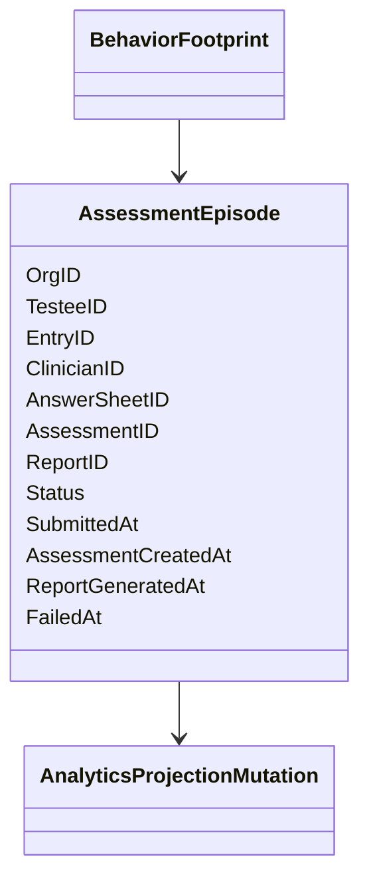
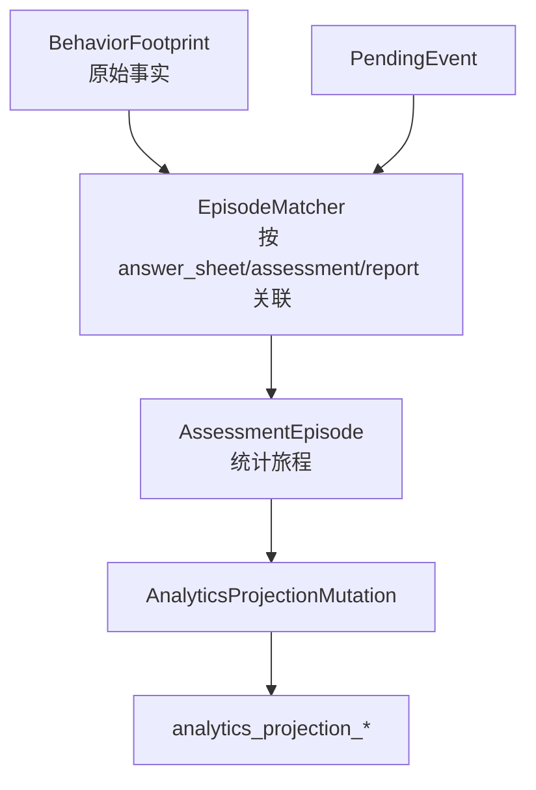
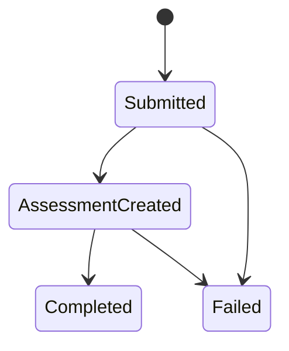

# assessment_episode 边界

**本文回答**：`assessment_episode` 是什么、为什么它不是 Assessment 的复制表，以及它在统计口径中承担哪些不变量。

## 30 秒结论

| 问题 | 结论 |
| ---- | ---- |
| episode 是什么 | 一次测评旅程的统计归因记录 |
| episode 不是啥 | 不是 Assessment 权威状态表，也不是 Report 权威表 |
| 核心字段 | org/testee、entry/clinician、answer_sheet、assessment、report、status、时间点 |
| 不变量 | 同一 answer sheet 或 assessment 的事件应落到同一 episode 上 |

## episode 要解决什么问题

统计口径需要回答“某一次测评旅程经历了哪些关键节点”。业务写模型中这些节点分散在 AnswerSheet、Assessment、Report 和 Actor entry 里；直接查询它们会导致复杂 join 和归因不稳定。`assessment_episode` 把这些跨事件事实组合成统计读侧旅程。

它不是业务表的复制，而是统计模型：

| 事实 | 业务权威 | episode 中的作用 |
| ---- | -------- | ---------------- |
| answer sheet submitted | Survey/AnswerSheet | 旅程开始或提交时间 |
| assessment created | Evaluation/Assessment | 评估处理节点 |
| report generated | Evaluation/Report | 完成节点 |
| assessment failed | Evaluation/Assessment | 失败节点 |
| entry/clinician | Actor/Plan/Sources | 归因维度 |

## 模型关系



episode 把一组跨时间、跨事件的事实串成统计旅程。它服务统计读模型，不参与业务命令校验。

## 架构设计



投影器需要先定位 episode，再决定是更新旅程、写 projection，还是进入 pending。episode 是连接原始事件和统计读模型的中间状态。

## 状态语义



状态推进来自 footprint 事件，而不是外部手工更新。若事件乱序，projector 通过查找 answer sheet / assessment / report 相关 episode 来补齐。

## 设计模式与不变量

| 模式 / 技法 | 作用 |
| ----------- | ---- |
| Read model aggregate | episode 是统计读侧聚合，不是写侧聚合 |
| 状态机 | submitted -> assessment_created -> completed/failed |
| 幂等关联 | 通过 answer_sheet/assessment/report 维持同一旅程 |
| Projection mutation | episode 变化再派生统计投影 |

关键不变量是同一测评旅程不应因为事件乱序被拆成多个 episode。代码上必须优先通过稳定业务标识关联，而不是只按事件时间插入新行。

## 归因边界

| 场景 | episode 行为 |
| ---- | ------------ |
| 先 intake 后 submit | submit 时可直接带上 entry/clinician 归因 |
| 先 submit 后 intake | submit 进入 pending 或先建 episode，后续 intake/reconcile 补归因 |
| assessment created 到达 | 通过 answer sheet 或 assessment id 关联 episode |
| report generated 到达 | 通过 assessment id 关联 episode 并标记 completed |
| assessment failed 到达 | 记录失败原因和 failed_at，不回写 Assessment 权威表 |

## 为什么不是 Assessment 复制表

Assessment 是业务写模型，负责测评状态和结果；episode 是统计读模型，负责跨事件归因和聚合查询。复制 Assessment 会遗漏 intake、entry、clinician 等统计归因，也会把统计补偿逻辑误塞回业务状态。当前设计让 episode 只服务统计，不参与业务命令，这使它可以被重放、修正和重建，而不影响用户看到的测评权威状态。

## 取舍与边界

| 取舍 | 当前选择 |
| ---- | -------- |
| 归因完整性 | 通过 pending/reconcile 补齐 | 统计结果可能延迟 |
| 业务隔离 | episode 不回写 Assessment | 需要双向排障：业务表和投影表都要看 |
| 查询性能 | projection 基于 episode 派生 | 投影规则变更需要重放或补偿 |

## 代码锚点与测试锚点

- episode 领域类型：[internal/apiserver/domain/statistics/journey.go](../../../internal/apiserver/domain/statistics/journey.go)
- episode 投影逻辑：[internal/apiserver/application/statistics/journey.go](../../../internal/apiserver/application/statistics/journey.go)
- episode PO：[internal/apiserver/infra/mysql/statistics/po_journey.go](../../../internal/apiserver/infra/mysql/statistics/po_journey.go)

## Verify

```bash
go test ./internal/apiserver/domain/statistics ./internal/apiserver/application/statistics
```
