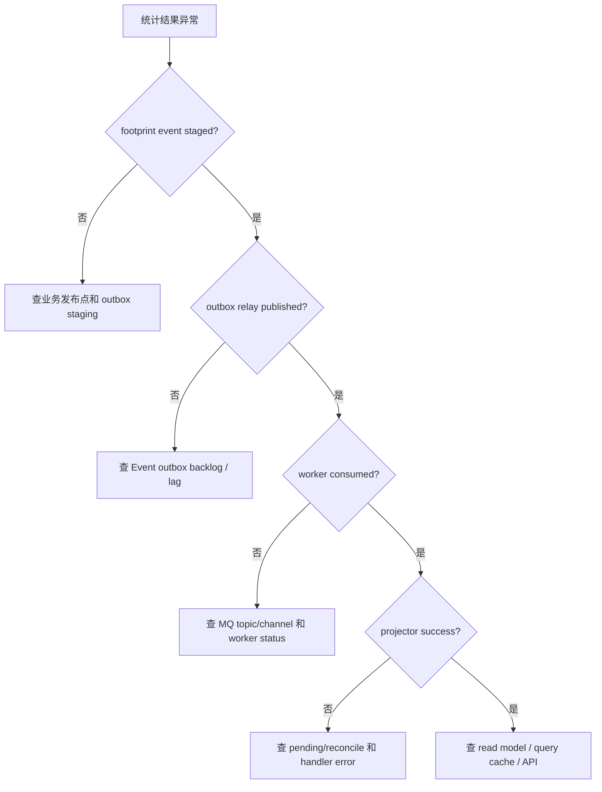

# 排障与演进边界

**本文回答**：行为投影出问题时应按什么顺序定位，以及哪些能力当前不能说成已支持。

## 30 秒结论

| 方向 | 结论 |
| ---- | ---- |
| 先看事件 | 确认 `footprint.*` 是否进入 outbox 并被 relay 发布 |
| 再看消费 | 确认 worker 是否 Ack/Nack，handler 是否返回业务错误 |
| 再看投影 | 确认 episode/pending/projection 是否在 apiserver 事务中写入 |
| 最后看查询 | 确认统计读接口是否读取 projection 或 query cache |
| 否定边界 | 当前不是 exactly-once 投影，也不是手工治理平台 |

## 排障文档要解决什么问题

行为投影跨 Event、Worker、Internal gRPC、Statistics projector、MySQL read model 和 Query Cache。问题出现时，如果直接看最终统计接口，很难判断是事件没发、消息没消费、投影没写、pending 未重放，还是查询缓存未刷新。本篇把排障路径按“事实从哪里断掉”拆开。

## 排障决策树



## 分层排障矩阵

| 层 | 先看什么 | 典型原因 | 证据 |
| -- | -------- | -------- | ---- |
| 事件出站 | outbox backlog / publish outcome | durable event 未发布、relay 失败 | Event System status / Prometheus |
| MQ 消费 | worker consume outcome | poison payload、handler error、Nack 重试 | worker logs / consume metrics |
| Projector | pending count / episode 状态 | 归因缺失、乱序、业务校验失败 | `analytics_pending_event`、projector logs |
| Read model | projection 表和 query cache | 投影已写但查询未命中或缓存旧 | statistics API / cache governance |
| Scheduler | pending reconcile runner | leader lock contention、reconcile 失败 | scheduler logs / resilience metrics |

## 设计模式视角下的排障

| 模式 | 排障含义 |
| ---- | -------- |
| Outbox | 如果事件没发布，先查 outbox 状态而不是 worker |
| Adapter | worker handler 只适配事件；业务失败应在 apiserver projector 找原因 |
| Pending state machine | 暂缺归因不是丢失，而是进入显式 pending |
| Read model | 最终查询异常不一定代表业务写模型错误 |

## 当前不支持

| 能力 | 当前边界 |
| ---- | -------- |
| exactly-once projection | 当前以 durable outbox + worker ack/nack + 幂等投影降低风险，不承诺 exactly-once |
| 手工重放单个 footprint | 当前没有 operating 治理动作；只能通过已有 outbox/pending/reconcile 机制 |
| 动态修改 attribution window | `behaviorAttributionWindow` 是代码常量，不是运行时配置 |
| 用 episode 替代业务查询 | episode 是统计读侧模型，不是业务写模型 |

这些否定边界很重要：如果对外宣称 exactly-once 或手工治理，运维和业务会期待系统具备当前没有实现的恢复能力。当前支持的是“可靠出站 + 可观测消费 + pending/reconcile 补偿 + 读侧投影”，不是完整事件治理平台。

## 演进建议

| 触发条件 | 建议 |
| -------- | ---- |
| pending 长期积压 | 先补 Grafana/operating 只读指标，再评估手工 retry |
| attribution 规则频繁变化 | 抽出规则模型和 contract tests，不要直接改 SQL |
| projection 查询变慢 | 优先优化 read model 和 cache，不要把聚合塞回业务写路径 |

## 为什么先补观测再做治理

手工 retry、单事件 replay、动态 attribution window 都是治理能力，它们会改变系统运行状态。如果在缺少 backlog、pending、consume outcome 和 projection 证据的情况下直接做治理按钮，很容易把误操作变成新的数据污染。当前演进顺序应是：先补只读状态和指标，再评估只读证据是否足以支持治理动作。

## 代码锚点与测试锚点

- Event 观测：[../../03-基础设施/event/05-观测与排障.md](../../03-基础设施/event/05-观测与排障.md)
- worker consume：[../../03-基础设施/event/03-Worker消费与AckNack.md](../../03-基础设施/event/03-Worker消费与AckNack.md)
- projector：[internal/apiserver/application/statistics/journey.go](../../../internal/apiserver/application/statistics/journey.go)
- statistics query cache：[../../02-业务模块/statistics/03-QueryCache与治理.md](../../02-业务模块/statistics/03-QueryCache与治理.md)

## Verify

```bash
go test ./internal/apiserver/application/statistics ./internal/worker/handlers
python scripts/check_docs_hygiene.py
```
