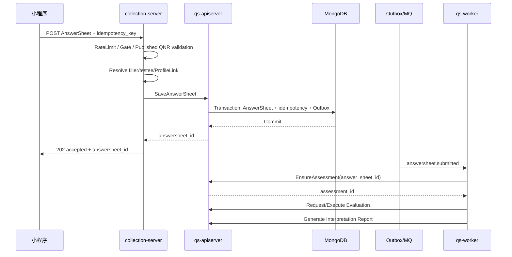

# P. 代码分析报告：答卷可靠受理重构

> 状态：代码已实施（方案 B 已直接切换；本地单元、竞态、契约、文档和构建验证通过，Replica Set 故障注入与环境压测待发布前执行）。
>
> 本报告可以作为独立重构任务的输入。它以当前代码、REST/gRPC 契约、事件配置和压测口径为事实源，明确当前实现、目标契约、推荐方案、改造阶段和验收条件。
>
> 核心结论：`202 Accepted` 应当表示 `AnswerSheet + Outbox` 已经持久化，而不是只表示请求进入 collection-server 的进程内队列。Evaluation 和报告生成继续保持异步。

## 0A. 2026-07-24 后续决议：替换 SubmitGuard

本文记录的 2026-07-18 `SubmitGuard` 方案已被后续专项替换。当前代码：

1. 删除了 contention 后立即 fall-through 的旧 `SubmitGuard`；
2. 使用 `SubmitCoalescer` 选择跨实例 owner；
3. contender 有界等待 Redis completion signal，随后必须从 Mongo durable path 回读；
4. Redis acquire/signal 故障 degraded-open，Mongo unique index、fingerprint 与 AnswerSheet + Outbox transaction 仍是最终正确性来源；
5. `submit.coalescing_enabled=false` 可回滚效率优化，但不会改变 durable correctness。

当前行为与验证入口见[可靠提交：跨实例合并与幂等](../03-基础设施/concurrency/30-可靠提交-跨实例合并与幂等.md)。本文后续 `SubmitGuard` 内容仅保留为当时的分析与决策历史，不再描述现行实现。

## 0B. 2026-07-24 后续决议：持久结果优先回读

现行编排进一步明确为：

1. HTTP 鉴权、Gate、RateLimit 后只做本地静态 envelope 校验；
2. coalescer owner、contender、Redis degraded-open 和关闭 coalescer 的路径都先调用 additive `LookupAnswerSheetSubmission`；
3. hit 直接返回原 AnswerSheet ID，不重新访问 questionnaire、ProfileLink、testee 或 transaction；
4. conflict 返回 409，readback error 返回可重试 503，只有明确 miss 才执行完整校验与 `SaveAnswerSheet`；
5. fingerprint 使用唯一 canonical encoder；回读以已存 AnswerSheet 的 org
   和本次稳定输入计算候选值，并与接受时冻结的
   `submit_meta.fingerprint` 比较；只有 legacy 数据缺失 fingerprint 时才按
   既有算法回退重算，不改变历史字节语义；
6. 旧 apiserver 的 `Unimplemented` 仅作为滚动发布兼容回退，其他基础设施错误不得伪装为 miss。

这一决议不改变 Mongo unique index、AnswerSheet 文档、AnswerSheet + Outbox
transaction 或 commit-unknown recovery。关闭 Redis coalescing 只回滚效率优化，
不会关闭持久结果优先回读。

## 0. 方案 B 实施决议（2026-07-18）

本文后续章节保留了重构前的证据、备选方案和风险分析；与本节冲突时，以本节和当前代码/OpenAPI 为准。终局决策是：

1. Submit Gate 直接执行可靠保存，删除进程内 SubmitQueue、Worker Pool 和状态表。
2. `202` 固定返回 `accepted + request_id + answersheet_id`，且只能在 AnswerSheet、填写人级幂等记录和 Outbox 同事务提交后返回。
3. 幂等事实为 `(writer_id, idempotency_key)`；SHA-256 指纹不同时返回 409，相同时返回原 AnswerSheet。
4. collection 不再同步调用 `EnsureAssessment`；`answersheet.submitted` Worker 是 Assessment Intake 的唯一正常入口。
5. 删除 `/answersheets/submit-status`，新增 `/answersheets/{id}/assessment-readiness?testee_id=...`，不设兼容期和旧路径开关。
6. Redis SubmitGuard 只是可降级的跨实例并发租约，不存储最终结果；Redis 故障时 degraded-open，由 Mongo 幂等收敛。

直接切换后不允许回滚到“进程内入队即 202”的旧二进制。异常时只能降低并发、暂停提交并返回 503，或向前修复。

### 0.1 本地实施验证

- `go test ./internal/apiserver/... ./internal/collection-server/... ./internal/worker/...`：通过。
- 可靠提交、Mongo adapter、collection 答卷与 Worker 关键包 `go test -race`：通过。
- `make docs-verify`、`make perf-verify`：通过；新增 reliable-submit 24/s、48/s burst、96/s boundary profile 均可被 K6 解析。
- qs-collection-system 在 Node 16.20.2 下通过严格类型检查、121 个 UI 测试、契约测试、生产构建和包体检查。
- Mongo Replica Set 集成用例已加入，使用 `QS_SERVER_TEST_MONGO_URI` 驱动；本地未提供该环境，因此发布前仍需执行真实事务、故障注入和目标吞吐验收。

## 1. 分析目标

本报告回答以下问题：

1. 当前 `POST /api/v1/answersheets` 在什么时刻返回 `202 Accepted`？
2. 当前 `202` 与 AnswerSheet、Assessment、Outbox 的持久化边界是什么？
3. collection-server 在返回 `202` 后异常退出，是否可能丢失请求？
4. 把 AnswerSheet 和 Outbox 持久化移动到 `202` 之前，会不会破坏入口并发能力？
5. SubmitQueue、SubmitGuard、`request_id`、`idempotency_key` 和 `submit-status` 应该怎样重新定位？
6. 如何在提交 p95 `< 500ms` 和 300 QPS 混合容量目标下完成改造？
7. 重构需要哪些测试、压测、故障注入和灰度保护？

本报告的主要目标是“重构前分析”，不是直接给出代码补丁。

## 2. 分析范围

### 2.1 包含范围

- collection-server 答卷 REST 提交入口；
- 提交前问卷校验、身份解析和 ProfileLink 访问判断；
- SubmitQueue 的准入、状态和 Worker Pool；
- SubmitGuard 与幂等键；
- collection-server 到 qs-apiserver 的答卷 gRPC 写入；
- qs-apiserver 中 AnswerSheet 与 Outbox 的事务持久化；
- `answersheet.submitted` 驱动 Assessment 创建的 Worker 链路；
- `202`、`429`、`503`、`request_id`、`answersheet_id` 和 `assessment_id` 契约；
- 300 QPS 混合压测中的答卷提交场景。

### 2.2 不包含范围

- Evaluation 具体计分算法；
- Interpretation 报告模板和报告内容；
- Redis/cache 整体重构；
- 前端页面改造的具体代码；
- MQ、MongoDB 或 NSQ 的生产扩容实施；
- Plan 任务生成策略；
- 将 collection-server 拆分为独立微服务。

这些模块可能受到接口契约影响，但不属于本次核心重构范围。

## 3. 三十秒结论

当前答卷提交链路是：

```text
请求校验
  -> 进入 collection-server 内存队列
  -> 返回 202 + request_id
  -> Queue Worker 调用 qs-apiserver
  -> Mongo 事务保存 AnswerSheet + Outbox
  -> 同步 EnsureAssessment
  -> submit-status = done
```

因此，当前 `202` 只表示“进程内排队成功”，不表示用户答案已经持久化。

如果 collection-server 在返回 202 后、Queue Worker 持久化前异常退出：

- Queue 中的请求可能消失；
- 进程内 `submit-status` 也会消失；
- MongoDB 中没有 AnswerSheet；
- Outbox 中没有 `answersheet.submitted`；
- 系统无法仅凭服务端事实恢复该请求。

推荐目标链路是：

```text
请求校验与准入
  -> Mongo 事务保存 AnswerSheet + Outbox
  -> 返回 202 + request_id + answersheet_id
  -> qs-worker 消费 answersheet.submitted
  -> 幂等 EnsureAssessment
  -> Evaluation
  -> Interpretation
```

该方案会增加单次提交请求的同步耗时，但不会必然降低系统的有效处理能力。当前 `mixed_300` 中答卷提交目标为 24/s；按照 p95 `500ms` 粗略计算，平均约需要承载 12 个在途提交。是否真正满足目标必须通过新的持久化受理压测验证，不能沿用当前“内存入队即返回”的延迟数据。

## 4. 当前入口与调用路径

### 4.1 REST 入口

当前入口为：

```text
POST /api/v1/answersheets
```

事实源：

- [`api/rest/collection.yaml`](../../api/rest/collection.yaml)
- [`internal/collection-server/transport/rest/handler/answersheet_handler.go`](../../internal/collection-server/transport/rest/handler/answersheet_handler.go)
- [`internal/collection-server/transport/rest/router.go`](../../internal/collection-server/transport/rest/router.go)

路由已经经过独立的 submit RateLimit 和 Submit Concurrency Gate。当前生产配置包括：

- SubmitQueue Worker：56；
- SubmitQueue Size：2800；
- Submit 并发上限：96。

配置事实源：[`configs/collection-server.prod.yaml`](../../configs/collection-server.prod.yaml)。

### 4.2 Handler 返回 202 的时点

`AnswerSheetHandler.Submit` 完成以下工作：

1. 绑定请求；
2. 获取填写人身份；
3. 获取或生成 `request_id`；
4. 调用 `SubmissionService.SubmitQueued`；
5. 入队成功后立即返回 `202 Accepted`。

当前响应为：

```json
{
  "code": 0,
  "message": "accepted",
  "data": {
    "status": "queued",
    "request_id": "..."
  }
}
```

此时响应中没有 `answersheet_id`，因为 AnswerSheet 尚未持久化。

### 4.3 入队前校验

`SubmissionService.SubmitQueued` 在入队前读取精确问卷版本并执行答案规格校验。

已确认的行为包括：

- 只能提交已发布问卷版本；
- 问卷读取能力不可用时返回 `Unavailable`；
- 答案格式或选项不符合问卷规格时返回 `InvalidArgument`；
- 校验成功后才进入 SubmitQueue。

该校验可以减少无效请求进入写链路，但 collection-server 的校验不能替代 qs-apiserver 的权威校验。

### 4.4 SubmitQueue 当前语义

SubmitQueue 使用：

```go
jobs chan submitJob
```

其运行边界明确是进程内内存：

- Queue 数据不持久化；
- 状态表不持久化；
- 状态默认保留十分钟；
- 多实例之间不共享 Queue 状态；
- 进程重启后状态无法恢复。

SubmitQueue 当前负责：

- 有界入队；
- Queue Full 快速拒绝；
- 同一 `request_id` 的进程内重复抑制；
- Worker Pool 调度；
- `queued / processing / done / failed` 状态记录；
- Queue 深度、在途数量和状态数量观测；
- 主动 Drain/Resume 控制。

### 4.5 Queue Worker 后续处理

Queue Worker 从内存 Channel 取出任务后执行 `submitWithGuard`，再进入 `submitSync`。

`submitSync` 当前依次完成：

1. 校验填写人；
2. 解析 ProfileLink 与受试者；
3. 通过 gRPC 保存 AnswerSheet；
4. 同步调用 `EnsureAssessment`；
5. 同时获得 `answersheet_id` 与 `assessment_id`；
6. 将 Queue 状态写为 `done`。

这意味着当前 `submit-status=done` 表达的是：

> AnswerSheet 与 Assessment 都已经持久化。

它不是单纯的“AnswerSheet 已接收”。

### 4.6 qs-apiserver 持久化边界

qs-apiserver 的 AnswerSheet 提交服务使用 `TransactionalSubmissionDurableStore`。

在一个 Mongo 事务中完成：

1. 保存 AnswerSheet；
2. 保存入站幂等记录；
3. Stage AnswerSheet 领域事件到 Outbox。

事务提交成功后，AnswerSheet 领域事件被清理，并触发 post-commit 通知。

因此，真正可靠的受理边界已经存在：

```text
TransactionalSubmissionDurableStore.CreateDurably 成功返回
```

问题不在 apiserver 内部缺少可靠持久化，而在 collection-server 提前返回了 `202`。

### 4.7 answersheet.submitted 后续链路

`answersheet.submitted` 在 [`configs/events.yaml`](../../configs/events.yaml) 中声明为 `durable_outbox`。

qs-worker 对该事件执行：

1. 解析 AnswerSheet 事件数据；
2. 对 AnswerSheet 处理进行重复抑制；
3. 调用 internal gRPC `EnsureAssessment`；
4. 已存在 Assessment 时进行幂等恢复；
5. 后续驱动 Evaluation。

因此，AnswerSheet 持久化后，Assessment 创建已经拥有异步、可重放的恢复链路。

当前 collection-server 在 Queue Worker 中同步 `EnsureAssessment`，与事件链路形成两条创建入口。它们依靠 `EnsureAssessment` 幂等收敛，但同步调用延长了提交处理时间，也让“答卷已接收”和“Assessment 已创建”两个状态耦合在一起。

## 5. 当前职责与依赖

| 组件 | 当前职责 | 重构后建议职责 |
| --- | --- | --- |
| REST Handler | 绑定请求、生成 request_id、入队、返回 202 | 绑定请求、调用可靠受理用例、持久化成功后返回 202 |
| Submit RateLimit | 控制提交速率 | 保留 |
| Submit Concurrency Gate | 控制写路径在途请求 | 保留，并成为保护 Mongo 写入的关键边界 |
| SubmitQueue | 内存入队、立即确认、后台持久化、状态保存 | 改为有界调度/短时等待，或在可靠受理路径稳定后退役 |
| SubmitGuard | 跨实例幂等与重复抑制 | 保留，但不能替代数据库幂等约束 |
| Questionnaire L1 | 提交前快速读取精确问卷版本 | 保留；不可用时快速拒绝，不允许无保护回源 |
| collection SubmissionService | BFF 校验、身份解析、持久化、同步 EnsureAssessment | BFF 校验、身份解析、调用可靠持久化；移除同步 EnsureAssessment |
| apiserver AnswerSheet service | 权威校验、AnswerSheet 与 Outbox 持久化 | 保持为可靠受理事实中心 |
| qs-worker | 消费 answersheet.submitted，EnsureAssessment | 保持，并成为 Assessment 创建的唯一正常异步入口 |
| submit-status | 进程内 Queue 状态 | 兼容期保留；长期改为持久化事实查询或由 answersheet_id 替代 |

## 6. 行为、契约与不变量边界

### 6.1 当前 202 契约

当前事实：

```text
202 = 请求通过前置校验并进入 collection-server 进程内队列
```

它不保证：

- AnswerSheet 已保存；
- Outbox 已保存；
- Assessment 已创建；
- 进程重启后可以恢复；
- `submit-status` 可以跨实例查询。

### 6.2 目标 202 契约

已确认的目标是：

```text
202 = AnswerSheet + Outbox 已在事务中持久化
```

它应当保证：

- 用户答案已经成为可查询业务事实；
- 相同幂等键重试能够返回同一 AnswerSheet；
- 驱动后续处理的可靠事件已经建立；
- collection-server 在响应后退出不会丢失 AnswerSheet；
- 后续失败会进入明确状态，而不是让答卷消失。

它不保证：

- Assessment 已经创建；
- Evaluation 已经完成；
- 报告已经生成；
- 报告一定成功。

### 6.3 request_id 与 idempotency_key

两个字段不能继续混为同一种语义。

| 字段 | 责任 |
| --- | --- |
| `request_id` | 一次 HTTP 请求及其日志、追踪和响应关联 |
| `idempotency_key` | 同一个业务提交意图的重复请求收敛键 |

当前代码在没有显式 `idempotency_key` 时，会使用 `request_id` 作为有效幂等键。这为兼容提供了兜底，但客户端可靠重试应当显式复用 `idempotency_key`。

目标契约建议：

- 客户端生成并持久保存 `idempotency_key`，直到收到可靠受理响应；
- 网络超时或 429/503 后使用同一幂等键重试；
- 每次 HTTP 请求可以拥有新的 `request_id`；
- 服务端数据库唯一约束是最终幂等事实源；
- Redis SubmitGuard 只用于提前抑制并发重复，不拥有最终结果。

### 6.4 answersheet_id 与 assessment_id

当前 `submit-status=done` 要求同时存在：

- `answersheet_id`；
- `assessment_id`。

目标契约需要拆分两个阶段：

```text
AnswerSheetAccepted
  -> AssessmentPending
  -> AssessmentReady
  -> EvaluationProcessing
  -> ReportReady / Failed
```

推荐 202 响应至少返回：

```json
{
  "status": "accepted",
  "request_id": "...",
  "answersheet_id": "..."
}
```

`assessment_id` 可以暂时为空，由后续接口按 `answersheet_id` 查询。

### 6.5 HTTP 错误语义

| 状态码 | 目标语义 |
| --- | --- |
| `202` | AnswerSheet 与 Outbox 已持久化，后续异步处理中 |
| `400` | 请求或答案不符合问卷规格，不应原样重试 |
| `401/403` | 身份或受试者关系不允许提交 |
| `409` | 仅在确实存在无法幂等收敛的业务冲突时使用 |
| `429` | 当前入口容量不足，客户端保留答案并按 Retry-After 重试 |
| `503` | 问卷校验、下游持久化或保护能力不可用，客户端使用同一幂等键重试 |
| `500` | 未分类服务端错误；不能返回 202 |

### 6.6 最重要的不变量

1. 未持久化 AnswerSheet 时不得返回 202；
2. AnswerSheet 保存与可靠 Outbox 事件必须原子提交；
3. 相同幂等键只能产生一个有效 AnswerSheet；
4. 202 后 collection-server 退出不能影响 AnswerSheet 和后续事件；
5. Evaluation 和 Interpretation 不得回到同步提交链路；
6. 无法在容量预算内可靠持久化时必须拒绝，不能无限排队；
7. Redis、内存 Queue 和本地状态不能成为最终幂等或受理事实源；
8. Assessment 创建失败不能被描述成“答卷未收到”。

## 7. 测试与可观测性现状

### 7.1 已有保护

当前已有测试覆盖：

- SubmitQueue 正常入队；
- Queue Full；
- 同一 request_id 重复入队；
- Retryable LockLease 失败后的重入；
- Drain、Resume 和 Drain Timeout；
- SubmitStatus 的 AnswerSheetID/AssessmentID 不变量；
- AnswerSheet 与事件在事务上下文中 Stage；
- Stage 失败时事务失败；
- 入站幂等命中；
- Worker 重放时幂等 EnsureAssessment；
- REST OpenAPI 路径存在性。

### 7.2 现有观测

当前链路已经记录或暴露：

- `request_id`；
- `idempotency_key`；
- Queue depth/capacity；
- queued/processing/done/failed 数量；
- in-flight/outstanding；
- SubmitGuard 与 LockLease 结果；
- AnswerSheetID；
- AssessmentID；
- 提交总耗时；
- Outbox pending/publishing/failed；
- Worker 处理错误。

### 7.3 关键缺口

重构前需要补齐：

- “返回 202 后立即杀死 collection-server”的故障注入测试；
- “202 必须能查询到 AnswerSheet”的契约测试；
- “Outbox Stage 失败不能返回 202”的集成测试；
- “Mongo Commit 成功但 HTTP 响应丢失”时相同幂等键重试测试；
- 多实例下使用不同 request_id、相同 idempotency_key 的并发测试；
- 提交链路分阶段延迟指标；
- 202 后事件排水和 Assessment 最终创建指标；
- 客户端超时重试的端到端验证。

## 8. 分析指标与判定

| 指标 | 判定 | 证据与触发标准 |
| --- | --- | --- |
| 入口路径清晰度 | 绿 | REST -> Queue -> gRPC -> Mongo -> Event -> Worker 可完整追踪 |
| 行为边界清晰度 | 绿 | 当前 202 与目标 202 的差异可以明确列出 |
| 可靠受理 | 红 | 当前 202 返回早于任何持久化，进程崩溃可丢失请求 |
| 责任内聚 | 黄 | SubmitQueue 同时承担削峰、立即确认、状态存储和后台业务执行 |
| 依赖扩散 | 黄 | collection submitSync 同时了解身份、ProfileLink、AnswerSheet 和 Assessment intake |
| 测试保护 | 黄 | 单组件测试较强，但缺少 202 崩溃窗口和跨进程集成测试 |
| 可观测性 | 黄 | Queue/Outbox 可观测，但 request 状态重启即丢，阶段延迟不足 |
| 变更放大 | 黄 | 修改 202 语义会影响 REST DTO、OpenAPI、前端轮询、Queue、压测和运维文档 |
| 安全可提取性 | 黄 | 持久化边界清楚，但必须先补契约测试和性能基线再切换 |

红项可以通过以下证据推翻：证明 `202` 返回前存在未发现的持久化 Queue 或请求日志，并能在 collection-server 崩溃后自动恢复。当前代码没有这类绑定。

## 9. 主要风险点

### 9.1 202 后进程崩溃导致请求丢失

这是当前最重要的可靠性缺口。

```text
Enqueue 成功
  -> 返回 202
  -> collection-server 崩溃
  -> 内存 Queue 消失
  -> AnswerSheet 不存在
  -> Outbox 不存在
```

### 9.2 普通关闭流程未自动 Drain Queue

Queue 支持治理命令触发 Drain，但普通 collection-server 生命周期关闭流程没有把 Queue Drain 作为关闭钩子。

即使补充优雅关闭：

- 也只能降低正常发布风险；
- 不能处理进程崩溃、节点故障和强制终止；
- 不能替代持久化受理。

因此，“加 Drain”不是本问题的完整修复。

### 9.3 submit-status 是进程内状态

当前状态：

- 默认十分钟 TTL；
- 不跨实例；
- 重启后消失；
- 不是业务事实。

在多实例或故障切换场景中，客户端可能拿着有效 request_id 查询到 404。

### 9.4 当前延迟指标不能证明目标方案

当前 K6 的提交请求在入队后即结束，因此测到的是“入队 p95”，不是“持久化受理 p95”。

重构后必须重新建立基线。

### 9.5 同步 EnsureAssessment 扩大 202 前候选链路

如果只是让 Handler 等待当前 Queue Worker 完整结束，响应时间还包含同步 `EnsureAssessment`。

目标方案应利用现有 `answersheet.submitted` 事件，把 Assessment 创建留在异步链路。

### 9.6 Queue Size 与 500ms SLA 不匹配

当前 Queue Size 为 2800。按 24/s 计算，完全排空约需要：

```text
2800 / 24 ≈ 117 秒
```

如果目标路径让 HTTP 请求等待 Queue 完成，不能允许请求在大队列中长期等待。Queue 必须具备极短等待预算，超时后返回 429/503。

### 9.7 客户端契约迁移

当前客户端习惯：

```text
202 + request_id
  -> submit-status
  -> done 后取得 answersheet_id + assessment_id
```

目标客户端可以改为：

```text
202 + answersheet_id
  -> 按 answersheet_id 查询 Assessment
  -> 查询 Evaluation / Report 状态
```

服务端切换前必须确认 collection-system 的兼容策略。

## 10. 初步发现与设计判断

### 10.1 发现一：当前提高的是确认吞吐量，不是持久化吞吐量

内存 Queue 可以让 collection-server 更快返回 202，但所有请求最终仍需要经过：

- ProfileLink 查询；
- gRPC；
- Mongo AnswerSheet 写入；
- Outbox 写入；
- Assessment 创建。

因此，Queue 只能吸收有限突发，不能提高下游长期可持续吞吐量。

### 10.2 发现二：可靠持久化基础已经具备

qs-apiserver 已经实现 AnswerSheet、入站幂等和 Outbox 的事务持久化。

推荐方案不需要新增一套持久化提交命令，主要需要调整 collection-server 的确认时点和职责边界。

### 10.3 发现三：Assessment 已有异步恢复入口

`answersheet.submitted` Worker 已经幂等调用 `EnsureAssessment`。

因此可以把同步边界收缩到 AnswerSheet + Outbox，而不必把 Assessment 创建包含在 202 前。

### 10.4 发现四：24/s 提交目标具有可行性，但尚未验证

在 `mixed_300` 中：

```text
submit = 24/s
```

若 p95 目标为 500ms，根据 Little's Law 粗略估算：

```text
平均在途提交 ≈ 24 × 0.5 = 12
```

当前 Submit Concurrency 为 96，数量上有余量。但数据库事务、ProfileLink、网络延迟和尖刺仍需实测。

### 10.5 设计判断

推荐：

> 采用“AnswerSheet + Outbox 持久化后返回 202”的可靠受理方案，不引入额外持久化命令层；SubmitQueue 改为有界准入/短时调度，或在新路径稳定后退役。

## 11. 方案比较

### 11.1 方案 A：保持当前内存入队即返回

```text
Enqueue -> 202 -> Persist
```

优点：

- 响应最快；
- 瞬时入队能力强；
- 改动最小。

缺点：

- 202 后可能丢失；
- submit-status 不持久化；
- 多实例语义不稳定；
- 容量数据掩盖真实写入延迟。

结论：不推荐作为长期方案。

### 11.2 方案 B：AnswerSheet + Outbox 后返回 202

```text
Admission -> Persist AnswerSheet + Outbox -> 202 -> Worker
```

优点：

- 202 语义可靠；
- 复用现有事务边界；
- 不新增提交命令模型；
- AnswerSheet 成为唯一受理事实；
- 事件链可以恢复后续流程。

缺点：

- HTTP 请求耗时增加；
- 写流量更直接地反映下游能力；
- 需要客户端、DTO、Queue 和压测迁移。

结论：推荐。

### 11.3 方案 C：持久化提交命令后返回 202

```text
Persist SubmissionCommand -> 202 -> Build AnswerSheet -> Worker
```

优点：

- 可以快速可靠接收更大突发；
- 后台慢慢转换为 AnswerSheet。

缺点：

- 新增 SubmissionCommand 聚合和状态机；
- 需要命令重放、清理、查询和失败恢复；
- 同时维护 Command、AnswerSheet、Assessment 三套生命周期；
- 显著增加运维与认知成本。

结论：当前 24/s 提交目标下没有必要。未来提交达到数百或上千 QPS，且业务要求服务端无条件接管峰值时再重新评估。

## 12. 推荐目标架构

### 12.1 目标时序



### 12.2 202 前允许的工作

必须保留：

- REST 输入校验；
- 身份认证；
- 受试者关系和 OrgScope 校验；
- 精确已发布问卷校验；
- Submit RateLimit；
- Submit Concurrency Gate；
- AnswerSheet 持久化；
- 入站幂等记录；
- Outbox Stage 与事务提交。

### 12.3 202 后的工作

必须异步：

- EnsureAssessment；
- Evaluation 创建与执行；
- Outcome 提交；
- Interpretation；
- 报告生成；
- 报告后处理和通知。

### 12.4 SubmitQueue 的目标定位

有两个可接受方向。

#### 方向一：改为有界等待调度器

Handler 入队后等待 Worker 完成 AnswerSheet 持久化，再返回 202。

要求：

- Job 必须带结果 Channel/Future；
- 等待时间必须包含在 500ms 总预算内；
- 超过等待预算返回 429/503；
- Queue 深度需要显著小于当前 2800，或只把它作为内部调度容量；
- 不等待 EnsureAssessment。

#### 方向二：移除 SubmitQueue，使用并发 Gate

Handler 通过 Submit Gate 后直接调用可靠保存用例。

要求：

- Gate 达到上限时快速拒绝；
- Mongo/gRPC 具有明确超时；
- 使用客户端幂等重试吸收持续过载；
- 通过 K6 验证短时突发能力。

推荐先比较两个方向的复杂度和压测结果。不要为了保留 Queue 而保留 Queue。

### 12.5 submit-status 的目标定位

推荐分两阶段处理。

兼容阶段：

- 保留 `/answersheets/submit-status`；
- 202 直接返回 `answersheet_id`；
- submit-status 可以继续提供 Assessment readiness；
- queued 不再表示“尚未持久化”。

终局阶段：

- AnswerSheet 接收结果由 `answersheet_id` 表达；
- Assessment 通过 `answersheet_id` 查询；
- Evaluation/Report 使用各自状态接口；
- 进程内 submit-status 退役，或只保留短期兼容。

## 13. 推荐改造边界

### 13.1 collection REST Handler

重点文件：

- [`internal/collection-server/transport/rest/handler/answersheet_handler.go`](../../internal/collection-server/transport/rest/handler/answersheet_handler.go)
- [`internal/collection-server/application/answersheet/dto.go`](../../internal/collection-server/application/answersheet/dto.go)

目标：

- Handler 等待可靠受理结果；
- 202 响应增加 `answersheet_id`；
- 不再把 `queued` 作为受理成功的唯一事实；
- 429/503 保留 Retry-After；
- 明确网络超时后的幂等重试说明。

### 13.2 collection SubmissionService

重点文件：

- [`internal/collection-server/application/answersheet/submission_service.go`](../../internal/collection-server/application/answersheet/submission_service.go)
- [`internal/collection-server/application/answersheet/submission_committer.go`](../../internal/collection-server/application/answersheet/submission_committer.go)

目标：

- 将“可靠保存 AnswerSheet”提炼成清晰用例；
- 保留 BFF 身份和 ProfileLink 校验；
- 移除正常路径中的同步 `EnsureAssessment`；
- 明确 AnswerSheet 保存成功、Assessment 尚未创建的返回语义；
- 保持显式幂等键贯穿 gRPC。

### 13.3 SubmitQueue

重点文件：

- `internal/collection-server/application/answersheet/submit_queue.go`（方案 B 已删除）
- `internal/collection-server/application/answersheet/submit_queue_worker_pool.go`（方案 B 已删除）

目标：

- 决定改造成短时有界调度器，还是退役；
- 不再把进程内状态当作可靠受理事实；
- 保留 Queue Full、Drain 和观测能力时，重新定义状态；
- 删除或迁移已经不再使用的 `wait_timeout_ms` 兼容配置；
- 避免让大 Queue 掩盖持续过载。

### 13.4 qs-apiserver AnswerSheet

重点文件：

- [`internal/apiserver/application/survey/answersheet/transactional_durable_store.go`](../../internal/apiserver/application/survey/answersheet/transactional_durable_store.go)
- [`internal/apiserver/infra/mongo/answersheet/durable_submit.go`](../../internal/apiserver/infra/mongo/answersheet/durable_submit.go)
- [`internal/apiserver/transport/grpc/service/answersheet.go`](../../internal/apiserver/transport/grpc/service/answersheet.go)

目标：

- 保持 AnswerSheet + idempotency + Outbox 原子提交；
- 明确 gRPC 成功响应等同于可靠受理；
- 保持重复幂等请求返回同一 AnswerSheet；
- 补充事务提交和事件存在性集成测试；
- 增加持久化阶段延迟指标。

### 13.5 Worker 与 Assessment Intake

重点文件：

- [`internal/worker/handlers/answersheet_handler.go`](../../internal/worker/handlers/answersheet_handler.go)
- [`internal/apiserver/application/journey/assessmentintake/service.go`](../../internal/apiserver/application/journey/assessmentintake/service.go)

目标：

- 验证 Worker 重放能够独立恢复 Assessment；
- 确保 EnsureAssessment 幂等；
- collection 移除同步 EnsureAssessment 后不影响医学、人格和行为能力链路；
- 失败通过 NACK/重试和状态观测恢复。

### 13.6 API 与客户端

重点契约：

- [`api/rest/collection.yaml`](../../api/rest/collection.yaml)
- [`api/grpc/proto/answersheet/answersheet.proto`](../../api/grpc/proto/answersheet/answersheet.proto)

目标：

- `SubmitAcceptedResponse` 增加 `answersheet_id`；
- 明确 `assessment_id` 异步就绪；
- 明确 `idempotency_key` 重试要求；
- 更新 collection-system 提交、轮询和错误恢复流程；
- 保持旧客户端兼容窗口。

## 14. 分阶段实施建议

### Phase 0：建立行为基线

目标：在不改变行为的前提下记录当前事实。

工作：

- 增加当前 202 契约测试：确认返回时 AnswerSheet 可能尚不存在；
- 增加 Queue wait、preflight、ProfileLink、gRPC、Mongo transaction、EnsureAssessment 分段耗时；
- 记录 24/s Submit 下的真实持久化吞吐和队列等待；
- 记录 202 后到 AnswerSheet 可查询的延迟分布；
- 记录 202 后到 Assessment 可查询的延迟分布。

退出条件：能够量化当前“快速 202”和“实际持久化”之间的差距。

### Phase 1：固化可靠受理契约

目标：先用测试定义目标，不切换生产行为。

工作：

- 添加 `202 -> AnswerSheet exists` 契约测试；
- 添加 `202 -> Outbox event exists` 契约测试；
- 添加相同幂等键并发提交测试；
- 添加 Mongo Commit 成功但客户端超时的重试测试；
- 更新 OpenAPI 目标 DTO；
- 明确客户端重试协议。

退出条件：目标契约能够通过测试表达，旧实现预期不能通过这些目标测试。

### Phase 2：实现可靠保存用例

目标：建立不包含同步 EnsureAssessment 的可靠受理路径。

工作：

- 拆分 collection `submitSync`；
- 建立 `AcceptDurably` 或等价用例；
- 返回 AnswerSheetID；
- 让 `answersheet.submitted` Worker 独立负责 EnsureAssessment；
- 保持旧路径可通过配置或内部开关对照验证。

退出条件：可靠保存路径通过单元、集成和幂等测试。

### Phase 3：改造 Queue/准入语义

目标：保证可靠路径不会击穿 apiserver 和 MongoDB。

候选工作：

- Queue 改为带结果的有界调度器；或
- 直接使用 Submit Gate；
- 设置独立的准入等待和持久化超时；
- 超时返回 429/503；
- 调整 Queue Size、Worker Count 和 Max Submit Concurrency；
- 增加 load shedding 指标。

退出条件：24/s Submit 下 p95 `<500ms`，持续过载时可以稳定拒绝而不是无限排队。

### Phase 4：切换 202 与客户端契约

目标：正式使 202 表示可靠受理。

工作：

- 202 响应包含 `answersheet_id`；
- collection-system 使用相同 idempotency_key 重试；
- 兼容旧 submit-status；
- 按实例、机构或流量比例灰度；
- 对比旧路径和新路径成功率、p95、Mongo、Outbox 和 Worker backlog。

退出条件：灰度与全量期间无答卷丢失，容量指标满足目标。

### Phase 5：退役旧语义

目标：删除不再需要的进程内受理事实。

工作：

- 退役“内存入队即 202”；
- 评估 submit-status 是否继续存在；
- 删除无用状态、配置和兼容代码；
- 更新运行时、接口、运维和宣讲文档；
- 增加架构测试防止弱 202 回归。

退出条件：代码、契约、前端、压测和文档统一使用可靠受理语义。

## 15. 测试计划

### 15.1 单元测试

- Handler 只有在可靠保存成功后返回 202；
- 保存失败返回 5xx/503，绝不返回 202；
- 相同幂等键返回同一 AnswerSheetID；
- 不同 request_id 不影响幂等收敛；
- AssessmentID 尚未生成时 202 仍然成功；
- Queue/Gate 满时返回 429；
- Queue Draining 时返回 503；
- Retry-After 存在；
- 显式 idempotency_key 不被 request_id 覆盖。

### 15.2 Mongo 事务集成测试

要求测试环境使用支持事务的 MongoDB 拓扑。

场景：

- AnswerSheet 与 Outbox 同时提交；
- Outbox Stage 失败时 AnswerSheet 回滚；
- AnswerSheet 写失败时 Outbox 不存在；
- 幂等记录冲突时返回已完成 AnswerSheet；
- Commit 结果不确定时通过幂等查询收敛；
- 同一幂等键高并发只产生一个 AnswerSheet。

### 15.3 故障注入测试

- 返回 202 后立即终止 collection-server；
- Mongo Commit 后、HTTP 响应前断开网络；
- Outbox Relay 暂停；
- Worker 停止后继续提交，再恢复 Worker；
- Redis 不可用；
- ProfileLink 查询超时；
- apiserver gRPC 超时；
- Mongo 连接池耗尽；
- Queue/Gate 达到上限。

核心断言：

```text
凡是客户端收到 202 的请求，都能查询到同一 AnswerSheet。
```

### 15.4 事件与幂等测试

- `answersheet.submitted` 重复投递；
- Worker 重启后重放；
- Redis Lock 不可用时的降级执行；
- Assessment 已存在时 EnsureAssessment 幂等返回；
- 已创建但未提交的 Assessment 可以被重放恢复；
- 不产生重复 Evaluation 终态。

### 15.5 Race 与并发测试

建议执行：

```bash
go test -race ./internal/collection-server/application/answersheet/...
go test -race ./internal/apiserver/application/survey/answersheet/...
go test -race ./internal/worker/handlers/...
```

重点检查：

- 同幂等键并发；
- Queue/Gate 状态迁移；
- Drain 与在途请求；
- 响应 Future/Channel 关闭；
- 超时后后台任务是否泄漏。

### 15.6 契约测试

- OpenAPI 202 DTO；
- `answersheet_id` 类型保持 string，避免 JavaScript uint64 精度问题；
- 429/503/Retry-After；
- submit-status 兼容；
- gRPC SaveAnswerSheet 幂等键传递；
- collection-system 契约测试。

## 16. 性能与容量验收

### 16.1 提交专项

需要新增“可靠受理提交”专项 profile，不能只依赖当前混合脚本。

建议覆盖：

- 24/s 持续 10 分钟；
- 48/s 短时突发；
- 96/s 准入边界；
- Queue/Gate 满后的稳定拒绝；
- Redis 不可用时的保守模式；
- Worker 暂停时 AnswerSheet 持久化与 Outbox 积压。

### 16.2 核心指标

| 指标 | 目标 |
| --- | --- |
| Submit p95 | `< 500ms` |
| Submit success rate | `> 99%` |
| 202 后 AnswerSheet 可查询 | `100%` |
| 同幂等键重复 AnswerSheet | `0` |
| 未持久化却返回 202 | `0` |
| Queue/Gate 无限等待 | `0` |
| HTTP 全局失败率 | `< 1%` |
| K6 checks | `> 99%` |
| mixed_300 chain probe 高档失败 | `0` 为目标 |
| Outbox 排水 | 压测结束后三分钟内回落到接近 0 |

### 16.3 300 QPS 验收

最终仍需执行 [300 QPS 混合场景压测 SOP](../04-接口与运维/11-300QPS混合场景压测SOP.md)。

当前容量口径：

- 8C/16G：完整 `mixed_300` 目标；
- 4C/8G：不承诺完整 `mixed_300`；
- 混合流量中 Submit 为 24/s；
- 新链路必须重新校准 K6 Submit VU，避免因响应时间变长产生 dropped iterations。

### 16.4 分阶段延迟预算

500ms 预算需要通过实测拆分，不在设计阶段虚构固定数字。

应至少观测：

```text
rate_limit_wait_ms
submit_gate_wait_ms
questionnaire_preflight_ms
profile_access_ms
grpc_save_answersheet_ms
mongo_transaction_ms
submit_total_ms
```

若 p95 超标，应先定位阶段，再决定优化或降低准入。不能通过重新提前返回 202 隐藏问题。

## 17. 可观测性要求

### 17.1 日志关联字段

- request_id；
- idempotency_key（注意脱敏与长度限制）；
- answersheet_id；
- assessment_id；
- questionnaire_code/version；
- filler_id；
- testee_id；
- org_id；
- submit phase；
- result/error class；
- duration_ms。

### 17.2 指标

- reliable submit accepted/rejected；
- idempotency hit/conflict；
- gate wait/reject；
- queue wait/depth（若保留）；
- gRPC save latency/error；
- Mongo transaction latency/error；
- Outbox stage latency/error；
- 202-to-assessment-ready；
- 202-to-report-ready；
- Worker replay/duplicate skip；
- AnswerSheet accepted but Assessment pending/failed。

高基数字段如 request_id、answersheet_id 不得作为 metrics label，只进入日志和 trace。

### 17.3 告警

- 202 后 AnswerSheet 查询失败；
- AnswerSheet 已存在但长时间无 Assessment；
- Outbox oldest age 持续增长；
- Submit p95 超过 500ms；
- Gate reject/429 持续升高；
- Mongo transaction error 升高；
- 幂等冲突异常升高。

## 18. 灰度与回滚

### 18.1 灰度原则

- 先增加指标和目标路径，不立即切换；
- 使用机构、实例或小比例流量灰度；
- 同时比较旧路径与新路径的 submit p95、成功率、Mongo、Outbox 和 Worker backlog；
- 灰度期间客户端必须支持相同幂等键重试；
- 扩大流量前执行故障注入。

### 18.2 回滚边界

在公开契约正式切换前，可以通过配置退回旧路径进行对照。

一旦对客户端承诺：

```text
202 = AnswerSheet 已持久化
```

就不能在无通知情况下回滚为“内存入队即 202”，否则会静默降低可靠性契约。

切换后的安全回滚应当：

- 保留 202 前持久化；
- 可以关闭新的 Queue 调度优化；
- 可以降低并发和扩大拒绝；
- 可以暂时禁用非必要后处理；
- 不能恢复弱受理语义。

## 19. 实施红线

重构过程中不得：

1. 把 Evaluation 或报告重新放回同步请求；
2. 使用 Redis 代替 AnswerSheet 的最终持久化；
3. 用本地 Queue 状态代替数据库幂等；
4. 在 Outbox Stage 失败时仍返回 202；
5. 为了 p95 好看提前返回；
6. 在 Queue 满时无限阻塞；
7. 用无限协程绕过 Submit Gate；
8. 删除旧 submit-status 前不做客户端迁移；
9. 让 request_id 承担无法跨请求复用的业务幂等职责；
10. 把“答卷已接收”和“报告已完成”重新合并成一个状态。

## 20. 开放决策

实施任务开始前仍需确认：

1. SubmitQueue 是改造成有界等待调度器，还是由 Submit Gate 直接替代？
2. 500ms 中为准入等待预留多少预算？
3. `SubmitAcceptedResponse` 是否立即增加 `answersheet_id`，还是新增版本化响应？
4. submit-status 兼容保留多长时间？
5. collection-system 如何持久保存和复用 `idempotency_key`？
6. AnswerSheet 已接收但 Assessment 创建失败时，前台展示什么状态？
7. 是否需要单独的 Assessment readiness 查询，还是复用现有按 AnswerSheet 查询入口？
8. 灰度开关按实例、机构还是请求比例生效？

这些问题不改变目标原则，但会影响实施批次和兼容策略。

## 21. 推荐实施顺序

最小安全顺序：

1. 补当前行为与崩溃窗口测试；
2. 增加分阶段延迟和可靠性指标；
3. 建立只负责 AnswerSheet + Outbox 的可靠受理用例；
4. 让 Worker 成为正常 EnsureAssessment 入口；
5. 比较 Queue 调度器与直接 Gate；
6. 增加 answersheet_id 响应和客户端幂等重试；
7. 灰度切换 202 语义；
8. 执行 Submit 专项和 mixed_300；
9. 退役旧内存受理语义；
10. 同步运行时、接口、运维、专题和宣讲文档。

不要先大规模删除 SubmitQueue 或 submit-status，再补契约和测试。

## 22. 验收清单

### 22.1 正确性

- [ ] 202 前 AnswerSheet 已持久化；
- [ ] 202 前 Outbox 已持久化；
- [ ] 相同幂等键只产生一个 AnswerSheet；
- [ ] 202 后杀死 collection-server，AnswerSheet 仍可查询；
- [ ] Worker 恢复后 Assessment 能继续创建；
- [ ] 报告失败不影响 AnswerSheet 存在；
- [ ] 未持久化请求只返回错误，不返回 202。

### 22.2 性能

- [ ] Submit 24/s、10 分钟，p95 `<500ms`；
- [ ] Submit success rate `>99%`；
- [ ] mixed_300 通过目标资源档位；
- [ ] 无 dropped iterations 异常；
- [ ] Mongo 连接池无耗尽；
- [ ] 持续过载时稳定返回 429/503；
- [ ] Outbox 在三分钟内排空。

### 22.3 兼容

- [ ] OpenAPI 已更新；
- [ ] answersheet_id 使用 string；
- [ ] collection-system 已适配；
- [ ] 旧 submit-status 在兼容期可用；
- [ ] request_id 与 idempotency_key 文档清晰；
- [ ] Retry-After 和重试策略已验证。

### 22.4 运维

- [ ] 新链路指标进入治理页面或监控；
- [ ] 告警规则已配置；
- [ ] 灰度和回滚步骤已演练；
- [ ] 故障注入已执行；
- [ ] 运行手册已更新。

## 23. 事实源索引

| 事实 | 入口 |
| --- | --- |
| REST 202 返回点 | [`internal/collection-server/transport/rest/handler/answersheet_handler.go`](../../internal/collection-server/transport/rest/handler/answersheet_handler.go) |
| SubmitQueue 内存边界（历史） | `internal/collection-server/application/answersheet/submit_queue.go`（方案 B 已删除） |
| Queue Worker（历史） | `internal/collection-server/application/answersheet/submit_queue_worker_pool.go`（方案 B 已删除） |
| collection 提交编排 | [`internal/collection-server/application/answersheet/submission_service.go`](../../internal/collection-server/application/answersheet/submission_service.go) |
| AnswerSheet gRPC ACL | [`internal/collection-server/port/acl/answersheet.go`](../../internal/collection-server/port/acl/answersheet.go) |
| AnswerSheet gRPC client | [`internal/collection-server/infra/grpcclient/answersheet_client.go`](../../internal/collection-server/infra/grpcclient/answersheet_client.go) |
| apiserver gRPC 入口 | [`internal/apiserver/transport/grpc/service/answersheet.go`](../../internal/apiserver/transport/grpc/service/answersheet.go) |
| 事务可靠保存 | [`internal/apiserver/application/survey/answersheet/transactional_durable_store.go`](../../internal/apiserver/application/survey/answersheet/transactional_durable_store.go) |
| Mongo 幂等与 AnswerSheet 写入 | [`internal/apiserver/infra/mongo/answersheet/durable_submit.go`](../../internal/apiserver/infra/mongo/answersheet/durable_submit.go) |
| answersheet.submitted Worker | [`internal/worker/handlers/answersheet_handler.go`](../../internal/worker/handlers/answersheet_handler.go) |
| Assessment Intake | [`internal/apiserver/application/journey/assessmentintake/service.go`](../../internal/apiserver/application/journey/assessmentintake/service.go) |
| 事件投递语义 | [`configs/events.yaml`](../../configs/events.yaml) |
| collection 生产配置 | [`configs/collection-server.prod.yaml`](../../configs/collection-server.prod.yaml) |
| REST 契约 | [`api/rest/collection.yaml`](../../api/rest/collection.yaml) |
| gRPC 契约 | [`api/grpc/proto/answersheet/answersheet.proto`](../../api/grpc/proto/answersheet/answersheet.proto) |
| 300 QPS 压测口径 | [300 QPS 混合场景压测 SOP](../04-接口与运维/11-300QPS混合场景压测SOP.md) |

## 24. 下一步建议

把本报告交给独立重构任务后，第一批工作应严格限制为：

1. 添加当前行为与目标契约测试；
2. 添加提交阶段延迟指标；
3. 设计 `AcceptDurably` 应用服务边界；
4. 比较“Queue 有界等待”和“直接 Submit Gate”两个最小原型；
5. 不修改公开 202 契约，不删除旧 Queue。

完成第一批后，基于测试、指标和 24/s Submit 专项数据，再决定第二批实现。

这能避免在缺少性能证据和客户端兼容方案时，一次性改写整条提交链路。
