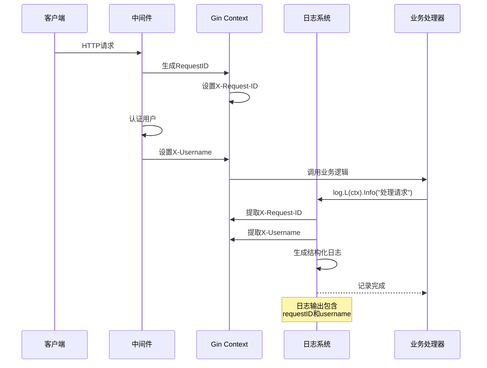

# 📝 日志模块设计

## 📋 目录

- [设计概述](#design-overview)
- [基于Zap的日志架构](#zap-based-logging-architecture)
- [上下文感知日志](#context-aware-logging)
- [结构化日志设计](#structured-logging-design)
- [日志中间件系统](#logging-middleware-system)
- [性能优化策略](#performance-optimization-strategies)

## 🎯 设计概述 {#design-overview}

本项目的日志模块基于**Uber Zap**构建了高性能、结构化的日志系统，采用**上下文感知**设计，实现了**零分配**的日志记录和**灵活的输出格式**。

### 🏗️ 设计目标

1. **高性能**: 基于Zap的零分配日志记录
2. **结构化**: 支持键值对的结构化日志
3. **上下文感知**: 自动提取请求上下文信息
4. **多级别**: 支持Debug、Info、Warn、Error、Panic、Fatal六个级别
5. **多格式**: 支持JSON和Console两种输出格式
6. **中间件集成**: 与HTTP中间件无缝集成

### 🎨 架构设计原则

- **单例模式**: 全局统一的日志实例
- **工厂模式**: 基于配置创建不同的日志器
- **适配器模式**: 兼容标准库log接口
- **上下文模式**: 支持请求链路追踪

## 🚀 基于Zap的日志架构 {#zap-based-logging-architecture}

### 📦 核心结构

```go
// pkg/log/log.go

// Logger 日志接口定义
type Logger interface {
    // 基础日志方法
    Debug(msg string, fields ...Field)
    Info(msg string, fields ...Field)
    Warn(msg string, fields ...Field)
    Error(msg string, fields ...Field)
    Panic(msg string, fields ...Field)
    Fatal(msg string, fields ...Field)
    
    // 格式化日志方法
    Debugf(format string, v ...interface{})
    Infof(format string, v ...interface{})
    // ... 其他格式化方法
    
    // 键值对日志方法
    Debugw(msg string, keysAndValues ...interface{})
    Infow(msg string, keysAndValues ...interface{})
    // ... 其他键值对方法
    
    // 上下文和配置方法
    V(level Level) InfoLogger
    WithValues(keysAndValues ...interface{}) Logger
    WithName(name string) Logger
    WithContext(ctx context.Context) context.Context
    Flush()
}

// zapLogger 基于Zap的日志实现
type zapLogger struct {
    zapLogger *zap.Logger    // 底层Zap日志器
    infoLogger               // 嵌入InfoLogger
}
```

### 🔧 日志器工厂

```go
// New 创建日志器
func New(opts *Options) *zapLogger {
    if opts == nil {
        opts = NewOptions()
    }

    // 解析日志级别
    var zapLevel zapcore.Level
    if err := zapLevel.UnmarshalText([]byte(opts.Level)); err != nil {
        zapLevel = zapcore.InfoLevel
    }

    // 配置编码器
    encoderConfig := zapcore.EncoderConfig{
        MessageKey:     "message",
        LevelKey:       "level",
        TimeKey:        "timestamp",
        NameKey:        "logger",
        CallerKey:      "caller",
        StacktraceKey:  "stacktrace",
        LineEnding:     zapcore.DefaultLineEnding,
        EncodeLevel:    encodeLevel,
        EncodeTime:     timeEncoder,
        EncodeDuration: milliSecondsDurationEncoder,
        EncodeCaller:   zapcore.ShortCallerEncoder,
    }

    // 构建Zap配置
    loggerConfig := &zap.Config{
        Level:             zap.NewAtomicLevelAt(zapLevel),
        Development:       opts.Development,
        DisableCaller:     opts.DisableCaller,
        DisableStacktrace: opts.DisableStacktrace,
        Sampling: &zap.SamplingConfig{
            Initial:    100,
            Thereafter: 100,
        },
        Encoding:         opts.Format,
        EncoderConfig:    encoderConfig,
        OutputPaths:      opts.OutputPaths,
        ErrorOutputPaths: opts.ErrorOutputPaths,
    }

    // 创建Zap日志器
    l, err := loggerConfig.Build(
        zap.AddStacktrace(zapcore.PanicLevel), 
        zap.AddCallerSkip(1),
    )
    if err != nil {
        panic(err)
    }

    logger := &zapLogger{
        zapLogger: l.Named(opts.Name),
        infoLogger: infoLogger{
            log:   l,
            level: zap.InfoLevel,
        },
    }

    // 集成klog
    klog.InitLogger(l)
    zap.RedirectStdLog(l)

    return logger
}
```

### ⚙️ 配置选项设计

```go
// pkg/log/options.go

// Options 日志配置选项
type Options struct {
    Level               string   `json:"level" mapstructure:"level"`                               // 日志级别
    Format              string   `json:"format" mapstructure:"format"`                           // 输出格式
    EnableColor         bool     `json:"enable-color" mapstructure:"enable-color"`               // 启用颜色
    DisableCaller       bool     `json:"disable-caller" mapstructure:"disable-caller"`           // 禁用调用者信息
    DisableStacktrace   bool     `json:"disable-stacktrace" mapstructure:"disable-stacktrace"`   // 禁用堆栈跟踪
    OutputPaths         []string `json:"output-paths" mapstructure:"output-paths"`               // 输出路径
    ErrorOutputPaths    []string `json:"error-output-paths" mapstructure:"error-output-paths"`   // 错误输出路径
    Development         bool     `json:"development" mapstructure:"development"`                 // 开发模式
    Name                string   `json:"name" mapstructure:"name"`                               // 日志器名称
}

// NewOptions 创建默认配置
func NewOptions() *Options {
    return &Options{
        Level:               "info",
        Format:              "console",
        EnableColor:         true,
        DisableCaller:       false,
        DisableStacktrace:   true,
        OutputPaths:         []string{"stdout"},
        ErrorOutputPaths:    []string{"stderr"},
        Development:         false,
        Name:                "",
    }
}
```

## 🌐 上下文感知日志 {#context-aware-logging}

### 📝 上下文日志设计

日志系统的核心特性是**上下文感知**，能自动从请求上下文中提取信息（如RequestID、Username等）并添加到日志中。

#### 1. 上下文Logger获取

```go
// L 从上下文获取Logger
func L(ctx context.Context) *zapLogger {
    return std.L(ctx)
}

func (l *zapLogger) L(ctx context.Context) *zapLogger {
    if ctx == nil {
        return l
    }

    // 克隆Logger避免并发问题
    logger := l.clone()

    // 从上下文提取字段
    fields := make([]zap.Field, 0)

    // 提取RequestID
    if requestID := getRequestIDFromContext(ctx); requestID != "" {
        fields = append(fields, zap.String("requestID", requestID))
    }

    // 提取Username
    if username := getUsernameFromContext(ctx); username != "" {
        fields = append(fields, zap.String("username", username))
    }

    // 提取其他上下文字段
    if traceID := getTraceIDFromContext(ctx); traceID != "" {
        fields = append(fields, zap.String("traceID", traceID))
    }

    if len(fields) > 0 {
        logger.zapLogger = logger.zapLogger.With(fields...)
    }

    return logger
}
```

#### 2. 上下文字段提取

```go
// 从Gin Context提取RequestID
func getRequestIDFromContext(ctx context.Context) string {
    if ginCtx, ok := ctx.(*gin.Context); ok {
        if requestID, exists := ginCtx.Get("X-Request-ID"); exists {
            if id, ok := requestID.(string); ok {
                return id
            }
        }
    }
    return ""
}

// 从Context提取Username
func getUsernameFromContext(ctx context.Context) string {
    if ginCtx, ok := ctx.(*gin.Context); ok {
        if username, exists := ginCtx.Get("X-Username"); exists {
            if name, ok := username.(string); ok {
                return name
            }
        }
    }
    return ""
}
```

### 🔄 上下文传播机制



## 🏗️ 结构化日志设计 {#structured-logging-design}

### 📊 字段类型系统

```go
// pkg/log/types.go

// Field 日志字段类型别名
type Field = zap.Field

// Level 日志级别类型
type Level = zapcore.Level

// 便捷字段构造函数
func String(key, val string) Field {
    return zap.String(key, val)
}

func Int(key string, val int) Field {
    return zap.Int(key, val)
}

func Int64(key string, val int64) Field {
    return zap.Int64(key, val)
}

func Bool(key string, val bool) Field {
    return zap.Bool(key, val)
}

func Error(err error) Field {
    return zap.Error(err)
}

func Duration(key string, val time.Duration) Field {
    return zap.Duration(key, val)
}

func Any(key string, val interface{}) Field {
    return zap.Any(key, val)
}
```

### 📝 多种日志记录方式

#### 1. 结构化字段日志

```go
// 使用结构化字段
log.Info("用户登录成功", 
    String("username", "alice"),
    String("ip", "192.168.1.100"),
    Duration("duration", time.Millisecond*150),
    Int("status_code", 200),
)

// 输出 (JSON格式):
// {
//   "level": "info",
//   "timestamp": "2024-01-15T10:30:00.123Z",
//   "message": "用户登录成功",
//   "username": "alice",
//   "ip": "192.168.1.100", 
//   "duration": "150ms",
//   "status_code": 200
// }
```

#### 2. 格式化字符串日志

```go
// 使用格式化字符串
log.Infof("用户 %s 从 %s 登录成功，耗时 %v", 
    "alice", "192.168.1.100", time.Millisecond*150)

// 输出:
// 2024-01-15 10:30:00.123  INFO  用户 alice 从 192.168.1.100 登录成功，耗时 150ms
```

#### 3. 键值对日志

```go
// 使用键值对
log.Infow("用户登录成功",
    "username", "alice",
    "ip", "192.168.1.100",
    "duration", time.Millisecond*150,
    "status_code", 200,
)
```

### 🎨 自定义编码器

```go
// 时间编码器
func timeEncoder(t time.Time, enc zapcore.PrimitiveArrayEncoder) {
    enc.AppendString(t.Format("2006-01-02 15:04:05.000"))
}

// 毫秒持续时间编码器
func milliSecondsDurationEncoder(d time.Duration, enc zapcore.PrimitiveArrayEncoder) {
    enc.AppendFloat64(float64(d) / float64(time.Millisecond))
}

// 彩色级别编码器
func colorLevelEncoder(level zapcore.Level, enc zapcore.PrimitiveArrayEncoder) {
    switch level {
    case zapcore.DebugLevel:
        enc.AppendString("🐛 DEBUG")
    case zapcore.InfoLevel:
        enc.AppendString("ℹ️ INFO")
    case zapcore.WarnLevel:
        enc.AppendString("⚠️ WARN")
    case zapcore.ErrorLevel:
        enc.AppendString("❌ ERROR")
    case zapcore.PanicLevel:
        enc.AppendString("💥 PANIC")
    case zapcore.FatalLevel:
        enc.AppendString("💀 FATAL")
    }
}
```

## 🌐 日志中间件系统 {#logging-middleware-system}

### 📝 HTTP日志中间件

日志中间件负责记录HTTP请求的详细信息，并将上下文信息注入到后续的日志中。

#### 1. 基础日志中间件

```go
// internal/pkg/middleware/logger.go

// Logger 日志中间件
func Logger() gin.HandlerFunc {
    return func(c *gin.Context) {
        start := time.Now()
        path := c.Request.URL.Path
        raw := c.Request.URL.RawQuery

        // 处理请求
        c.Next()

        // 计算耗时
        latency := time.Since(start)
        
        // 获取上下文相关的日志器
        logger := log.L(c)
        
        // 记录请求日志
        if raw != "" {
            path = path + "?" + raw
        }

        logger.Infow("HTTP请求处理完成",
            "method", c.Request.Method,
            "path", path,
            "status", c.Writer.Status(),
            "latency", latency,
            "client_ip", c.ClientIP(),
            "user_agent", c.Request.UserAgent(),
            "body_size", c.Writer.Size(),
        )
    }
}
```

#### 2. 增强日志中间件

```go
// internal/pkg/middleware/enhanced_logger.go

// EnhancedLogger 增强日志中间件
func EnhancedLogger() gin.HandlerFunc {
    return gin.LoggerWithFormatter(func(param gin.LogFormatterParams) string {
        var statusColor, methodColor, resetColor string
        if param.IsOutputColor() {
            statusColor = param.StatusCodeColor()
            methodColor = param.MethodColor()
            resetColor = param.ResetColor()
        }

        if param.Latency > time.Minute {
            param.Latency = param.Latency.Truncate(time.Second)
        }

        // 使用结构化日志记录
        log.L(param.Keys).Infow("HTTP请求",
            "timestamp", param.TimeStamp.Format("2006/01/02 - 15:04:05"),
            "status", param.StatusCode,
            "method", param.Method,
            "path", param.Path,
            "latency", param.Latency,
            "client_ip", param.ClientIP,
            "error", param.ErrorMessage,
        )

        return fmt.Sprintf("%v |%s %3d %s| %13v | %15s |%s %-7s %s %#v\n%s",
            param.TimeStamp.Format("2006/01/02 - 15:04:05"),
            statusColor, param.StatusCode, resetColor,
            param.Latency,
            param.ClientIP,
            methodColor, param.Method, resetColor,
            param.Path,
            param.ErrorMessage,
        )
    })
}
```

### 🔧 SQL日志记录

```go
// pkg/logger/sql.go

// SQLLogger GORM日志适配器
type SQLLogger struct {
    logger *zap.Logger
}

// NewSQLLogger 创建SQL日志器
func NewSQLLogger(logger *zap.Logger) *SQLLogger {
    return &SQLLogger{logger: logger}
}

// LogMode 设置日志模式
func (l *SQLLogger) LogMode(level logger.LogLevel) logger.Interface {
    return l
}

// Info 记录信息日志
func (l *SQLLogger) Info(ctx context.Context, msg string, data ...interface{}) {
    l.logger.Sugar().Infof(msg, data...)
}

// Warn 记录警告日志
func (l *SQLLogger) Warn(ctx context.Context, msg string, data ...interface{}) {
    l.logger.Sugar().Warnf(msg, data...)
}

// Error 记录错误日志
func (l *SQLLogger) Error(ctx context.Context, msg string, data ...interface{}) {
    l.logger.Sugar().Errorf(msg, data...)
}

// Trace 记录SQL执行跟踪
func (l *SQLLogger) Trace(ctx context.Context, begin time.Time, fc func() (string, int64), err error) {
    elapsed := time.Since(begin)
    sql, rows := fc()
    
    fields := []zap.Field{
        zap.String("sql", sql),
        zap.Duration("elapsed", elapsed),
        zap.Int64("rows", rows),
    }
    
    if err != nil {
        fields = append(fields, zap.Error(err))
        l.logger.Error("SQL执行错误", fields...)
    } else if elapsed > 200*time.Millisecond {
        l.logger.Warn("慢SQL查询", fields...)
    } else {
        l.logger.Debug("SQL执行", fields...)
    }
}
```

## ⚡ 性能优化策略 {#performance-optimization-strategies}

### 🚀 零分配优化

#### 1. 字段预分配

```go
// 避免: 频繁分配临时字段
func logUserAction(userID int64, action string, details map[string]interface{}) {
    // 每次调用都会分配新的slice
    fields := []zap.Field{
        zap.Int64("user_id", userID),
        zap.String("action", action),
    }
    for k, v := range details {
        fields = append(fields, zap.Any(k, v))
    }
    log.Info("用户操作", fields...)
}

// 优化: 使用预分配的字段切片
func logUserActionOptimized(userID int64, action string, details map[string]interface{}) {
    // 预分配容量，减少内存分配
    fields := make([]zap.Field, 0, 2+len(details))
    fields = append(fields,
        zap.Int64("user_id", userID),
        zap.String("action", action),
    )
    for k, v := range details {
        fields = append(fields, zap.Any(k, v))
    }
    log.Info("用户操作", fields...)
}
```

#### 2. 字符串池优化

```go
// 字符串缓存池
var stringPool = sync.Pool{
    New: func() interface{} {
        return make([]string, 0, 10)
    },
}

// 复用字符串切片
func logWithStringPool(messages []string) {
    strs := stringPool.Get().([]string)
    defer stringPool.Put(strs[:0])
    
    for _, msg := range messages {
        log.Info("批量日志", zap.String("message", msg))
    }
}
```

### 📊 异步日志记录

```go
// 异步日志缓冲区
type AsyncLogger struct {
    logger   *zapLogger
    buffer   chan LogEntry
    batchSize int
    ticker   *time.Ticker
}

type LogEntry struct {
    Level   zapcore.Level
    Message string
    Fields  []zap.Field
}

// NewAsyncLogger 创建异步日志器
func NewAsyncLogger(logger *zapLogger, bufferSize, batchSize int, flushInterval time.Duration) *AsyncLogger {
    al := &AsyncLogger{
        logger:    logger,
        buffer:    make(chan LogEntry, bufferSize),
        batchSize: batchSize,
        ticker:    time.NewTicker(flushInterval),
    }
    
    go al.flushLoop()
    return al
}

// 异步刷新循环
func (al *AsyncLogger) flushLoop() {
    batch := make([]LogEntry, 0, al.batchSize)
    
    for {
        select {
        case entry := <-al.buffer:
            batch = append(batch, entry)
            if len(batch) >= al.batchSize {
                al.flushBatch(batch)
                batch = batch[:0]
            }
        case <-al.ticker.C:
            if len(batch) > 0 {
                al.flushBatch(batch)
                batch = batch[:0]
            }
        }
    }
}

// 批量刷新日志
func (al *AsyncLogger) flushBatch(batch []LogEntry) {
    for _, entry := range batch {
        switch entry.Level {
        case zapcore.InfoLevel:
            al.logger.Info(entry.Message, entry.Fields...)
        case zapcore.WarnLevel:
            al.logger.Warn(entry.Message, entry.Fields...)
        case zapcore.ErrorLevel:
            al.logger.Error(entry.Message, entry.Fields...)
        }
    }
}
```

### 🔍 条件日志记录

```go
// 条件日志记录避免不必要的字符串格式化
func ConditionalLog(condition bool, level zapcore.Level, msg string, fields ...zap.Field) {
    if !log.CheckIntLevel(int32(level)) {
        return // 日志级别不满足，直接返回
    }
    
    if condition {
        switch level {
        case zapcore.DebugLevel:
            log.Debug(msg, fields...)
        case zapcore.InfoLevel:
            log.Info(msg, fields...)
        case zapcore.WarnLevel:
            log.Warn(msg, fields...)
        case zapcore.ErrorLevel:
            log.Error(msg, fields...)
        }
    }
}

// 使用示例
ConditionalLog(user.IsVIP(), zapcore.InfoLevel, "VIP用户操作",
    zap.String("username", user.Username),
    zap.String("action", "premium_feature_access"),
)
```

## 📚 实际应用示例

### 🔧 在业务代码中的使用

```go
// internal/apiserver/application/user/creator.go

func (c *UserCreator) CreateUser(ctx context.Context, req port.UserCreateRequest) (*port.UserResponse, error) {
    // 获取上下文相关的日志器
    logger := log.L(ctx)
    
    // 记录业务开始
    logger.Infow("开始创建用户",
        "username", req.Username,
        "email", req.Email,
    )
    
    // 业务逻辑验证
    if c.usernameExists(ctx, req.Username) {
        logger.Warnw("用户名已存在",
            "username", req.Username,
        )
        return nil, errors.WithCode(code.ErrUserAlreadyExists, "username already exists")
    }
    
    // 创建用户
    user := user.NewUserBuilder().
        WithUsername(req.Username).
        WithPassword(req.Password).
        WithEmail(req.Email).
        Build()
    
    // 保存用户
    start := time.Now()
    if err := c.userRepo.Save(ctx, user); err != nil {
        logger.Errorw("用户保存失败",
            "username", req.Username,
            "error", err,
            "duration", time.Since(start),
        )
        return nil, fmt.Errorf("failed to save user: %w", err)
    }
    
    // 记录成功
    logger.Infow("用户创建成功",
        "user_id", user.ID().Value(),
        "username", user.Username(),
        "duration", time.Since(start),
    )
    
    return &port.UserResponse{
        ID:       user.ID().Value(),
        Username: user.Username(),
        // ... 其他字段
    }, nil
}
```

### 📊 日志输出示例

#### JSON格式输出

```json
{
  "level": "info",
  "timestamp": "2024-01-15T10:30:00.123Z",
  "requestID": "req-123456789",
  "username": "alice",
  "message": "用户创建成功",
  "user_id": 12345,
  "username": "bob",
  "duration": 45.6,
  "caller": "user/creator.go:89"
}
```

#### Console格式输出

```text
2024-01-15 10:30:00.123  INFO  [req-123456789] [alice] 用户创建成功  user_id=12345 username=bob duration=45.6ms  user/creator.go:89
```

## 🎯 设计总结

日志模块设计实现了：

### 1. **高性能架构**

- 基于Zap的零分配日志记录
- 异步日志批量处理
- 条件日志避免不必要开销

### 2. **结构化设计**

- 统一的字段类型系统
- 多种日志记录方式
- 自定义编码器支持

### 3. **上下文感知**

- 自动提取请求上下文
- 链路追踪信息传播
- 用户身份关联

### 4. **灵活配置**

- 多种输出格式支持
- 可配置的日志级别
- 动态输出路径

### 5. **生产就绪**

- 完整的错误处理
- 优雅的资源管理
- 性能监控支持

这种设计为构建可观测性强的企业级应用提供了坚实基础。
