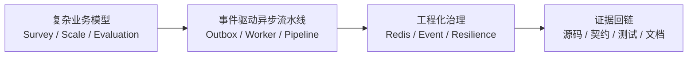

# 项目定位与受众画像

**本文回答**：`qs-server` 应该被公开讲成一个“复杂业务模型 + 事件驱动异步流水线 + 工程化治理”并存的后端项目；这篇文档负责先统一项目定位，再统一适合对谁讲、怎么讲。

## 30 秒结论

如果只看一屏，先看下面这张表：

| 维度 | 结论 |
| ---- | ---- |
| 项目定位 | 这是一个“复杂业务模型 + 异步评估流水线 + 工程治理”并存的后端项目，不是普通问卷 CRUD |
| 最值得先讲的三点 | 三域拆分、同步提交与异步评估解耦、工程治理证据 |
| 最适合的听众 | 关心业务建模、异步系统、工程治理的人最容易抓住亮点 |
| 最容易讲歪的方向 | 不要讲成“微服务系统”或“表单系统加异步任务” |
| 最合适的开场方式 | 先给 30 秒项目口径，再按 2 分钟版本展开运行时、建模和工程边界 |
| 回链原则 | 所有定位判断都应能回到 `00-05` 真值层和实际代码证据 |

## 定位主图

## 重点速查

- 第一定位是“测评系统”，不是“问卷系统”。
- 第一技术亮点是边界拆分，不是组件数量。
- 第一工程亮点是“知道哪些已经落地、哪些还是风险边界”，不是把规划稿讲成现状。

## 项目定位

`qs-server` 更适合被讲成一个**复杂业务模型 + 事件驱动异步流水线 + 工程化治理**并存的后端项目，而不是“普通问卷 CRUD”。

- **复杂业务模型**：核心不是保存题目，而是把 `survey`、`scale`、`evaluation` 拆成稳定边界，让答卷、量表规则、测评生命周期分别收敛到自己的模型里。证据见 [../02-业务模块](../02-业务模块/) 和 [../05-专题分析/01-测评业务模型：survey、scale、evaluation 为什么分离.md](../05-专题分析/01-测评业务模型：survey、scale、evaluation%20为什么分离.md)。
- **事件驱动异步流水线**：提交答卷不是链路终点，而是异步评估的起点；后面还有 MQ、worker、internal gRPC、pipeline、报告与标签。证据见 [../05-专题分析/02-异步评估链路：从答卷提交到报告生成.md](../05-专题分析/02-异步评估链路：从答卷提交到报告生成.md)。
- **工程化治理**：不是单点接口堆代码，而是有 SubmitQueue、限流/背压、worker 并发控制、文档/契约校验链。证据见 [../05-专题分析/03-保护层与读侧架构：限流、背压、缓存、统计预聚合.md](../05-专题分析/03-保护层与读侧架构：限流、背压、缓存、统计预聚合.md)、[../../scripts/check_docs_hygiene.py](../../scripts/check_docs_hygiene.py)、[../../scripts/compare_api_docs.py](../../scripts/compare_api_docs.py)。

## 更适合的听众

| 听众类型 | 更容易被什么打动 |
| -------- | ---------------- |
| 关心**业务建模**的人 | `survey / scale / evaluation` 为什么分离，而不是把问卷、量表、测评揉成一坨 |
| 关心**异步系统**的人 | `answersheet.submitted -> assessment.submitted -> EvaluateAssessment` 这条链怎么跑、哪里做幂等 |
| 关心**工程治理**的人 | 并发、背压、重试、一致性边界，以及文档和契约的可信度 |

## 30 秒版本

`qs-server` 是一个围绕心理测评/问卷场景的后端系统，`qs-apiserver` 是主业务中心，前面有 `collection-server` 做 BFF，后面有 `qs-worker` 作为异步驱动器消费事件并推进评估。它的难点不在于表单提交，而在于把答卷、量表规则、测评状态机、报告生成和下游副作用拆成清晰边界，并通过事件驱动把同步提交和异步评估串起来。

## 2 分钟版本

1. 从运行时看，它不是单服务。用户请求先进 `collection-server`，做鉴权、监护、限流和可选 SubmitQueue，再经 gRPC 进入 `qs-apiserver`；答卷落库后发布 `answersheet.submitted`，`qs-worker` 再驱动后续评估链路。证据见 [../00-总览/03-核心业务链路.md](../00-总览/03-核心业务链路.md)。
2. 从建模看，`survey` 负责问卷与答卷，`scale` 负责量表规则，`evaluation` 负责测评生命周期、得分、风险和报告。这样答卷提交、量表变更和评估结果不会互相污染。证据见 [../02-业务模块/01-survey.md](../02-业务模块/01-survey.md)、[../02-业务模块/02-scale.md](../02-业务模块/02-scale.md)、[../02-业务模块/03-evaluation.md](../02-业务模块/03-evaluation.md)。
3. 从异步链路看，第一跳是 `answersheet.submitted` 触发答卷计分与创建测评，第二跳是 `assessment.submitted` 触发 `EvaluateAssessment`，引擎内部用职责链完成校验、因子分、风险、解读和发事件。证据见 [../05-专题分析/02-异步评估链路：从答卷提交到报告生成.md](../05-专题分析/02-异步评估链路：从答卷提交到报告生成.md)。
4. 从工程上看，这个项目既有已经落地的保护措施，也有值得主动承认的风险边界。比如答卷提交已经补齐 durable submit 与 outbox，评估主链关键事件也已按 MySQL / Mongo 边界 outbox 化；当前更该主动承认的风险，是 durable 幂等仍是显式 `idempotency_key` opt-in，而且并不是所有事件都已进入同等级可靠出站。证据见 [03-主链路 1：提交答卷.md](./03-主链路%201：提交答卷.md) 和 [04-主链路 2：异步评估流水线.md](./04-主链路%202：异步评估流水线.md)。

## 不建议这样讲

- 不要把它讲成“问卷系统外加一个异步任务”。真正的核心是测评域和评估流水线，而不是页面表单。
- 不要把它讲成“微服务系统”。当前更准确的说法是**以 `apiserver` 为主业务中心的多进程协作架构**。
- 不要把规划稿讲成现状，尤其是提交幂等、出站一致性和重试次数。

## 证据入口

- 总览与主链路：[../00-总览](../00-总览/)
- 业务边界：[../02-业务模块](../02-业务模块/)
- 异步链路：[../05-专题分析/02-异步评估链路：从答卷提交到报告生成.md](../05-专题分析/02-异步评估链路：从答卷提交到报告生成.md)
- 保护层与治理：[../05-专题分析/03-保护层与读侧架构：限流、背压、缓存、统计预聚合.md](../05-专题分析/03-保护层与读侧架构：限流、背压、缓存、统计预聚合.md)
