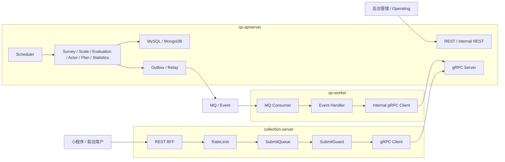

# 三进程架构讲法

**本文回答**：对外介绍 qs-server 时，如何把 `collection-server`、`qs-apiserver`、`qs-worker` 三个进程讲清楚；三者分别解决什么问题、如何协作、为什么不是微服务、为什么不是单服务、面试中被追问时应该如何回答。

---

## 1. 先给结论

> **qs-server 采用的是“前台保护层 + 主业务中心 + 异步执行器”的三进程协作架构：collection-server 保护前台入口，qs-apiserver 承载主业务事实和内部能力，qs-worker 消费事件推进异步评估。**

一句话拆开：

```text
collection-server：挡前台流量
qs-apiserver：管业务事实
qs-worker：跑异步任务
```

更正式一点：

| 进程 | 一句话定位 |
| ---- | ---------- |
| collection-server | 面向小程序/前台的 BFF 和提交保护层 |
| qs-apiserver | 主业务中心，负责领域模型、持久化、REST/gRPC、Outbox、调度 |
| qs-worker | 异步事件消费者，负责把提交后的评估链路往后推进 |

---

## 2. 30 秒讲法

> **这个系统不是单服务直连数据库，而是拆成三个进程协作。前台请求先进入 collection-server，它负责 JWT 身份投影、前台限流、SubmitQueue 削峰、SubmitGuard 幂等和状态查询；真正的业务事实写入由 qs-apiserver 完成，比如保存 AnswerSheet、创建 Assessment、生成 Report、写 Outbox；而评估这类慢任务由 qs-worker 消费事件后，通过 internal gRPC 回调 apiserver 来执行。这样前台提交、主业务处理和异步评估就被隔离开了。**

这个版本适合：

- 面试开场。
- 技术分享里的架构概览。
- 被问“你系统怎么部署”的第一轮回答。

---

## 3. 1 分钟讲法

> **我把 qs-server 的运行时拆成三个进程，但它不是那种完全独立数据库、完全独立发布的微服务，而是围绕一个主业务中心做职责隔离。**
>
> **第一层是 collection-server，它面向前台小程序，是 BFF 和保护层。它不直接写主数据库，而是做认证、租户投影、监护关系校验、限流、SubmitQueue 削峰、SubmitGuard 幂等，然后通过 gRPC 调 apiserver。**
>
> **第二层是 qs-apiserver，它是主业务中心，承载 Survey、Scale、Evaluation、Actor、Plan、Statistics 等领域模块，负责 MySQL/Mongo 持久化、Outbox、后台 REST、内部 gRPC 和调度任务。**
>
> **第三层是 qs-worker，它不直接对前端暴露接口，而是消费事件，比如 answersheet.submitted，然后通过 internal gRPC 调 apiserver 执行答卷计分、创建 Assessment、运行 Evaluation Pipeline。**
>
> **这样设计的目的，是把前台高峰、主业务事实和后台慢任务分开治理。**

---

## 4. 三进程主图



讲图时用这个顺序：

```text
用户从左边进来
collection 先挡住前台流量
apiserver 在中间保存事实
outbox 把事件发出去
worker 从右边异步消费
最后 worker 再回调 apiserver
```

---

## 5. 三个进程分别解决什么问题

### 5.1 collection-server：前台入口保护问题

collection-server 解决的问题是：

> **前台流量不可控，不能直接打主业务服务。**

它负责：

- 前台 REST API。
- JWT / UserIdentity / TenantScope。
- 公开只读接口白名单。
- submit/query/wait-report 限流。
- SubmitQueue 提交削峰。
- SubmitGuard 重复提交抑制。
- 监护关系校验。
- REST DTO 到 gRPC DTO 的转换。
- submit-status。
- wait-report。
- governance 状态。

它不负责：

- 保存主业务事实。
- 直接写 MySQL/Mongo。
- 执行 Evaluation Pipeline。
- 后台管理。
- 量表发布。
- 统计同步。
- operator 管理。

讲法：

> **collection-server 不是普通网关，而是带业务语义的 BFF 和保护层。**

---

### 5.2 qs-apiserver：主业务中心问题

qs-apiserver 解决的问题是：

> **系统必须有一个承载领域模型、主状态和内部能力的中心。**

它负责：

- Survey：Questionnaire / AnswerSheet。
- Scale：MedicalScale / Factor / InterpretationRule。
- Evaluation：Assessment / Score / Report / Pipeline。
- Actor：Testee / Clinician / Operator。
- Plan：Plan / Task。
- Statistics：ReadModel / Sync / BehaviorProjector。
- MySQL / Mongo 持久化。
- EventCatalog / Outbox / Relay。
- 后台 REST。
- internal REST。
- gRPC server。
- Scheduler。
- Security / AuthzSnapshot。
- Redis/cache/governance 集成。

它不应该负责：

- 直接承受所有前台高峰。
- 前台 BFF 适配细节。
- worker MQ 消费循环。
- 所有长任务同步执行。

讲法：

> **apiserver 是主业务中心，collection 和 worker 都围绕它协作。**

---

### 5.3 qs-worker：异步执行问题

qs-worker 解决的问题是：

> **评估、报告、事件副作用这类慢任务，不应该阻塞用户请求。**

它负责：

- 订阅 MQ 事件。
- 消费 answersheet.submitted。
- 调 internal gRPC 计算答卷分。
- 创建 Assessment。
- 推进 Evaluation。
- 处理评估相关后续事件。
- 做重复事件抑制。
- 控制 worker concurrency。
- Ack/Nack。

它不负责：

- 暴露前台 REST。
- 直接写主业务库。
- 绕过 apiserver 调领域服务。
- 保存问卷/量表定义。
- 自己维护一套业务模型。

讲法：

> **worker 是异步执行器，不是另一个业务中心。**

---

## 6. 为什么不是单进程

可以这样回答：

> **如果系统是单进程，当然部署简单，但前台提交、后台管理、内部调度、MQ 消费和评估 pipeline 都会挤在一个 runtime 里。前台高峰、报告生成慢、统计重建、worker backlog 都会互相影响。**

单进程的问题：

| 问题 | 后果 |
| ---- | ---- |
| 前台提交和后台管理共用入口 | 前台高峰影响后台 |
| 慢评估任务在请求线程中执行 | 用户等待和超时 |
| MQ 消费和 REST 请求抢资源 | 稳定性差 |
| 无法单独扩容前台入口 | 扩容成本高 |
| 无法单独调整 worker 并发 | 异步链路难治理 |
| 运维视角混乱 | 不知道问题来自入口、主服务还是 worker |

所以拆成三进程：

```text
入口保护
主业务事实
异步执行
```

---

## 7. 为什么不是微服务

这点要讲准，不要为了显得高级说“微服务”。

推荐说法：

> **我更愿意把它定义为三进程协作的模块化后端，而不是完整微服务。因为当前 apiserver 仍是主业务中心，Survey、Scale、Evaluation 等模块共享一个进程和部分基础设施；collection 和 worker 是围绕主业务中心拆出来的入口保护层和异步执行器。**

为什么不叫微服务：

| 微服务特征 | 当前 qs-server |
| ---------- | -------------- |
| 每个服务独立业务边界 | 主要业务边界仍在 apiserver 内 |
| 每个服务可独立部署演进 | 三进程可部署，但业务模块不是独立服务 |
| 每个服务通常独立数据所有权 | Survey/Scale/Evaluation 仍在 apiserver 管理 |
| 服务间复杂治理 | 当前主要是 BFF/gRPC/worker 协作 |

更准确的定位：

```text
模块化单体主业务中心
+
前台 BFF
+
异步 worker
```

或者：

```text
三进程协作架构
```

---

## 8. 为什么 collection 不直接写数据库

这是常见追问。

回答：

> **collection-server 的职责是前台入口保护，不是主业务事实源。如果让它直接写数据库，它就会复制 Survey/Evaluation 的业务规则，主状态会分裂。**

原因：

| 如果 collection 直接写 DB | 问题 |
| ------------------------ | ---- |
| 重复实现答卷校验 | Survey 规则散落 |
| 重复实现幂等逻辑 | 主事实不统一 |
| 无法复用 apiserver Outbox | 事件出站边界分裂 |
| 前台 BFF 变成业务服务 | 职责变重 |
| 数据一致性难保证 | 多处写模型 |

所以 collection 只做：

```text
认证 / 校验前置 / 限流 / 削峰 / 幂等保护 / DTO 转换
```

真正保存 AnswerSheet 仍交给 apiserver。

---

## 9. 为什么 worker 不直接写数据库

回答：

> **worker 消费事件后也不直接写业务库，而是通过 internal gRPC 回调 apiserver。这样 Evaluation 的业务规则、状态机、事务和 Outbox 都仍然收口在 apiserver。**

如果 worker 直接写库，会有问题：

| 问题 | 后果 |
| ---- | ---- |
| worker 复制 Evaluation 业务逻辑 | 规则分裂 |
| 状态机散落 | Assessment 状态难维护 |
| 事务边界不统一 | Score/Report/Outbox 一致性变差 |
| 权限/审计绕过 | 内部操作不可控 |
| 测试复杂 | 两套写入口 |

正确链路：

```text
worker consume event
  -> internal gRPC
  -> apiserver application service
  -> repository / outbox / state machine
```

---

## 10. 三进程如何对应主链路

### 10.1 答卷提交链路

```text
Client
  -> collection-server REST
  -> SubmitQueue / SubmitGuard
  -> apiserver gRPC SaveAnswerSheet
  -> Mongo durable submit + Outbox
  -> return submit result / request status
```

讲法：

> **提交链路由 collection 承接流量，由 apiserver 保存事实。**

---

### 10.2 异步评估链路

```text
Outbox Relay
  -> MQ
  -> worker consume answersheet.submitted
  -> InternalService
  -> CalculateAnswerSheetScore
  -> CreateAssessmentFromAnswerSheet
  -> EvaluateAssessment
  -> Score / Report
```

讲法：

> **评估链路由 worker 触发，但业务执行仍回到 apiserver。**

---

### 10.3 后台管理链路

```text
Admin / Operating
  -> apiserver REST / internal REST
  -> Application service
  -> MySQL / Mongo / Redis / Event
```

讲法：

> **后台管理不经过 collection，因为 collection 只服务前台 BFF 场景。**

---

## 11. 这个架构的收益

### 11.1 职责清楚

| 进程 | 职责 |
| ---- | ---- |
| collection | 前台入口 |
| apiserver | 业务事实 |
| worker | 异步推进 |

### 11.2 可独立保护

- collection 可以单独做前台限流。
- apiserver 可以做 DB/Mongo/IAM backpressure。
- worker 可以单独控制消费并发。
- scheduler 可以通过 leader lock 控制多实例任务。

### 11.3 可独立扩容

未来可以：

- 前台压力大：扩 collection。
- 主业务压力大：扩 apiserver。
- 异步积压：扩 worker。
- 报告慢：调 worker concurrency / pipeline / DB。

### 11.4 故障隔离更清楚

| 现象 | 先查 |
| ---- | ---- |
| submit 429 | collection |
| 保存答卷失败 | apiserver |
| 报告没生成 | worker + apiserver Evaluation |
| event 积压 | Outbox / MQ / worker |
| 后台接口慢 | apiserver |
| 前台 wait-report 慢 | collection + Evaluation |

---

## 12. 这个架构的代价

不能只讲好处，也要能说代价。

| 代价 | 说明 |
| ---- | ---- |
| 多进程部署复杂 | 需要配置、端口、日志、健康检查 |
| 多一次网络跳转 | collection 到 apiserver gRPC |
| 状态查询复杂 | SubmitQueue status 是 collection 内存态 |
| 链路排障更长 | 需要查 collection、apiserver、worker |
| 契约维护更多 | REST + gRPC + event catalog |
| 多实例治理更复杂 | lock、幂等、queue、worker 并发要设计 |

推荐表达：

> **我不是为了拆而拆。这个架构有运维复杂度，但它换来的是入口保护、异步解耦和故障隔离。**

---

## 13. 面试常见追问

### 13.1 为什么不让前端直接调 apiserver？

回答：

> **因为 apiserver 是主业务中心，不应该直接承受前台提交高峰和小程序适配细节。collection-server 可以按前台场景做限流、SubmitQueue、SubmitGuard、监护关系校验和状态查询，避免前台流量直接打穿主服务。**

---

### 13.2 collection-server 和网关有什么区别？

回答：

> **网关通常做路由、TLS、粗粒度限流；collection-server 做的是业务 BFF：它知道 submit、query、wait-report 的不同保护策略，也知道 request_id、idempotency_key、监护关系、gRPC DTO 转换和 submit-status。这些不是普通网关适合承担的。**

---

### 13.3 worker 为什么还要回调 apiserver？

回答：

> **因为 apiserver 才是业务事实中心。worker 只负责事件驱动和异步推进，不直接拥有 Evaluation 状态机和 repository。回调 apiserver 可以让 Assessment 状态、Score、Report、Outbox 和事务边界保持统一。**

---

### 13.4 这是微服务吗？

回答：

> **我不会把它强行叫微服务。更准确地说，它是以 apiserver 为主业务中心的三进程协作架构。业务模块仍然在 apiserver 内部按 DDD 边界组织，collection 和 worker 分别作为前台保护层和异步执行器。**

---

### 13.5 三进程以后怎么扩展？

回答：

> **如果前台流量大，优先扩 collection；如果主业务处理慢，扩 apiserver 和优化 DB/缓存；如果事件积压，扩 worker 或调 worker concurrency。扩容前提是 SubmitGuard、Outbox claim、worker 幂等、scheduler leader lock 这些横向扩展边界要稳。**

---

## 14. 讲图脚本

你可以边画图边讲：

```text
左边是前台用户，请求先进 collection-server。
collection 的重点不是写数据，而是保护入口：认证、限流、排队、幂等、状态查询。

中间是 apiserver，它是主业务中心。
所有核心领域模型、数据库写入、Outbox、REST/gRPC、调度任务都在这里收口。

右边是 worker，它消费事件，不直接给前端提供接口。
它收到 answersheet.submitted 之后，通过 internal gRPC 回到 apiserver，推进评估和报告生成。

所以这张图其实表达了三个边界：
前台入口边界、主业务事实边界、异步执行边界。
```

---

## 15. 不要这样讲

### 15.1 不要说“我做了三个微服务”

容易被追问到：

- 独立数据库？
- 独立部署？
- 服务治理？
- API gateway？
- 配置中心？
- tracing？
- 服务发现？

当前项目更准确是“三进程协作”。

### 15.2 不要说“collection 只是转发”

会把亮点讲没。

collection 的亮点是：

- BFF。
- RateLimit。
- SubmitQueue。
- SubmitGuard。
- Guardianship。
- submit-status。
- wait-report。

### 15.3 不要说“worker 负责评估业务”

更准确：

```text
worker 负责触发异步评估；
评估业务执行仍在 apiserver application service。
```

### 15.4 不要说“apiserver 什么都干”

apiserver 是主业务中心，但前台保护和异步消费已经拆出去了。要体现边界，而不是把它讲成大泥球。

---

## 16. 最终背诵版

> **我把 qs-server 的运行时讲成三进程协作：collection-server 是前台 BFF 和保护层，负责认证、限流、SubmitQueue 削峰、SubmitGuard 幂等和状态查询；qs-apiserver 是主业务中心，负责 Survey、Scale、Evaluation、Actor、Plan、Statistics 等领域模块，以及 MySQL/Mongo 持久化、Outbox、REST/gRPC 和调度；qs-worker 是异步执行器，消费事件后通过 internal gRPC 回调 apiserver 推进计分、创建 Assessment 和报告生成。**
>
> **所以它不是微服务，也不是单服务 CRUD，而是一个以 apiserver 为主业务中心，通过 collection 隔离前台流量、通过 worker 隔离慢任务的三进程架构。**

---

## 17. 证据回链

| 判断 | 证据 |
| ---- | ---- |
| 旧版提交主链路是 Client → collection → apiserver → outbox → worker | `docs/06-宣讲/03-主链路 1：提交答卷.md` |
| collection 是 BFF / RateLimit / SubmitQueue | `docs/05-专题分析/03-为什么需要collection保护层.md` |
| apiserver 是主业务中心 | `docs/04-接口与运维/03-gRPC契约.md`、`docs/03-基础设施/runtime/00-整体架构.md` |
| worker 通过事件驱动和 internal gRPC 推进评估 | `docs/05-专题分析/02-为什么同步提交但异步评估.md` |
| 三进程不是完整微服务 | `docs/05-专题分析/07-系统演进路线.md` |
