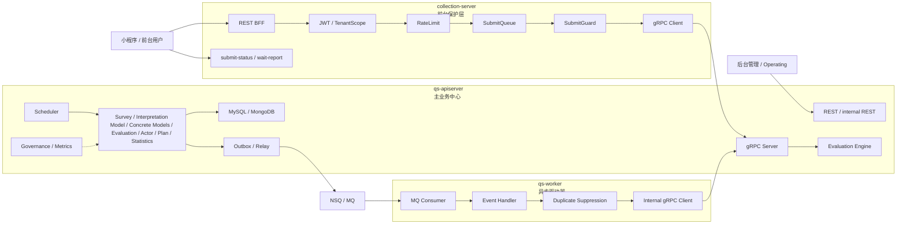

# 02-三进程架构讲法

**本文回答**：对外介绍 qs-server 时，如何把 `collection-server`、`qs-apiserver`、`qs-worker` 三个进程讲清楚；三者分别解决什么问题、如何协作、为什么不是微服务、为什么不是单服务；在新版“多解释模型测评平台”主线下，如何把三进程架构和 Survey / Interpretation Model / Concrete Models / Evaluation 业务边界、异步测评执行链路、Outbox、SubmitQueue、SubmitGuard、Internal gRPC、worker concurrency 联系起来讲。

---

## 30 秒结论

qs-server 采用的是：

```text
前台保护层 + 主业务中心 + 异步驱动器
```

三个进程分别是：

| 进程 | 一句话定位 | 核心职责 |
| ---- | ---------- | -------- |
| `collection-server` | 面向前台小程序 / 收集端的 BFF 和保护层 | 认证投影、租户范围、限流、SubmitQueue、SubmitGuard、submit-status、wait-report、gRPC 转发 |
| `qs-apiserver` | 主业务中心和事实源入口 | Survey、Interpretation Model、Scale、Evaluation、Actor、Plan、Statistics、REST/gRPC、MySQL/Mongo、Outbox、Scheduler |
| `qs-worker` | 事件消费者和异步驱动器 | 消费 MQ 事件，通过 internal gRPC 回调 apiserver，推进 Assessment、Interpretation、Report |

一句话概括：

> **collection 保护前台入口，apiserver 保存主业务事实和执行领域逻辑，worker 消费事件并回调 apiserver 推进异步测评执行。**

注意：这不是严格意义上的完整微服务架构。

更准确的表达是：

```text
以 qs-apiserver 为主业务中心的三进程协作架构
```

---

## 1. 为什么这一篇要更新

旧讲法通常是：

```text
collection-server：挡前台流量
qs-apiserver：管业务事实
qs-worker：跑异步评估
```

这条线基本正确，但现在需要更新两个关键点。

### 1.1 “异步评估”要升级为“异步测评执行”

旧表达：

```text
worker 消费 answersheet.submitted
  -> CalculateAnswerSheetScore
  -> CreateAssessmentFromAnswerSheet
  -> EvaluateAssessment
  -> Score / Report
```

新版表达：

```text
worker 消费事件
  -> CreateAssessmentFromAnswerSheet
  -> assessment.created
  -> CompleteAssessment
  -> assessment.completed
  -> CompleteInterpretation
  -> interpretation.completed / interpretation.failed
  -> GenerateReportFromInterpretation
  -> report.generated
```

核心变化：

```text
Evaluation 不再是 Scale 专用评估流水线；
Evaluation 是通用测评执行引擎；
Scale / MBTI / BigFive 通过 Provider 同级接入。
```

---

### 1.2 apiserver 业务边界要升级

旧表达：

```text
Survey / Scale / Evaluation / Actor / Plan / Statistics
```

新版表达：

```text
Survey
Interpretation Model
Concrete Models
    Scale
    MBTI future
    BigFive future
Evaluation
Actor
Plan
Statistics
```

其中：

- Survey 管作答事实。
- Interpretation Model 管 `ModelRef / Provider / Context / Registry`。
- Concrete Models 管具体规则，例如 Scale、MBTI、BigFive。
- Evaluation 管 `Assessment / EvaluationRun / EvaluationResult / InterpretReport`。

这会直接影响三进程讲法：worker 不再“跑量表评估”，而是“驱动 Evaluation 通过 Provider 执行具体解释模型”。

---

## 2. 10 秒讲法

> **qs-server 是三进程协作：collection 保护前台入口，apiserver 保存主业务事实，worker 消费事件异步推进测评执行。**

适合：

- 面试官问“你系统怎么跑”。
- 技术分享架构概览。
- 白板画图开场。

---

## 3. 30 秒讲法

> **这个系统不是单服务直连数据库，而是拆成 collection-server、qs-apiserver、qs-worker 三个进程协作。前台请求先进入 collection-server，它负责 JWT 身份投影、TenantScope、前台限流、SubmitQueue 削峰、SubmitGuard 幂等、submit-status 和 wait-report；真正的业务事实写入由 qs-apiserver 完成，比如保存 AnswerSheet、创建 Assessment、保存 EvaluationResult、生成 InterpretReport、写 Outbox；qs-worker 消费 MQ 事件后，不直接写业务库，而是通过 internal gRPC 回调 apiserver，推进 Assessment、Interpretation 和 Report。这样前台提交、主业务事实和后台慢任务就被隔离开了。**

这个版本适合：

- 面试第一轮架构介绍。
- 技术分享运行时概览。
- 被问“为什么有三个进程”。

---

## 4. 1 分钟讲法

> **我把 qs-server 的运行时拆成三个进程，但它不是那种每个模块独立数据库、独立发布治理的完整微服务，而是以 apiserver 为主业务中心的三进程协作架构。**
>
> **第一层是 collection-server，它面向前台小程序，是 BFF 和保护层。它不直接写主数据库，而是做认证投影、租户范围、监护关系校验、限流、SubmitQueue 削峰、SubmitGuard 幂等、submit-status、wait-report，然后通过 gRPC 调 apiserver。**
>
> **第二层是 qs-apiserver，它是主业务中心，承载 Survey、Interpretation Model、Scale、Evaluation、Actor、Plan、Statistics 等业务模块，负责 MySQL / Mongo 持久化、Outbox、后台 REST、内部 gRPC、Scheduler、Security、Statistics 和 Governance。**
>
> **第三层是 qs-worker，它不对前台暴露接口，而是消费事件，通过 internal gRPC 回调 apiserver 推进异步测评执行。比如从 `answersheet.submitted` 开始，逐步推进 `assessment.created`、`assessment.completed`、`interpretation.completed / failed`、`report.generated`。**
>
> **这样设计的目的，是把前台高峰、主业务事实和后台慢任务分开治理。**

---

## 5. 三进程主图



讲图顺序：

```text
1. 用户从左边进入 collection。
2. collection 先做认证投影、限流、排队和幂等保护。
3. 真正写业务事实的是中间 apiserver。
4. apiserver 写 AnswerSheet / Assessment / Result / Report，并 stage Outbox。
5. Outbox relay 把事件发布到 MQ。
6. worker 从右边消费事件。
7. worker 通过 internal gRPC 回调 apiserver，继续推进业务。
```

---

## 6. 三个进程分别解决什么问题

### 6.1 collection-server：前台入口保护问题

collection-server 解决的问题是：

> **前台流量不可控，不能直接打主业务服务。**

它负责：

- 前台 REST API。
- JWT / UserIdentity / TenantScope 投影。
- 公开只读接口白名单。
- 监护关系校验。
- submit / query / wait-report 限流。
- SubmitQueue 提交削峰。
- SubmitGuard 重复提交抑制。
- REST DTO 到 gRPC DTO 的转换。
- submit-status。
- wait-report。
- collection governance 状态。

它不负责：

- 保存主业务事实。
- 直接写 MySQL / Mongo。
- 执行 Evaluation Engine。
- 直接调用 Provider。
- 发布量表或 MBTI 模型。
- 生成 InterpretReport。
- 统计同步。
- operator 管理。

推荐讲法：

> **collection-server 不是普通网关，而是带业务语义的 BFF 和前台保护层。**

---

### 6.2 qs-apiserver：主业务中心问题

qs-apiserver 解决的问题是：

> **系统必须有一个承载领域模型、主状态、事务边界和内部能力的中心。**

它负责：

- Survey：Questionnaire / AnswerSheet。
- Interpretation Model：ModelRef / Provider / Context / Registry 的接入抽象。
- Concrete Models：Scale / 未来 MBTI / BigFive 等具体模型规则。
- Evaluation：Assessment / EvaluationRun / EvaluationResult / InterpretReport。
- Actor：Testee / Clinician / Operator。
- Plan：Plan / Task。
- Statistics：ReadModel / Sync / BehaviorProjector。
- MySQL / Mongo 持久化。
- EventCatalog / Outbox / Relay。
- 后台 REST。
- internal REST。
- gRPC server。
- Scheduler。
- Security / AuthzSnapshot。
- Redis / cache / governance 集成。

它不应该负责：

- 直接承受所有前台高峰。
- 小程序 BFF 适配细节。
- worker MQ 消费循环。
- 所有慢任务同步阻塞前台提交。
- 把所有解释模型规则都塞进 Scale。

推荐讲法：

> **apiserver 是主业务中心，collection 和 worker 都围绕它协作。**

---

### 6.3 qs-worker：异步驱动问题

qs-worker 解决的问题是：

> **Assessment、Interpretation、Report 这类异步测评执行阶段，不应该阻塞用户提交请求。**

它负责：

- 订阅 MQ 事件。
- 消费 `answersheet.submitted`。
- 消费 `assessment.created`。
- 消费 `assessment.completed`。
- 消费 `interpretation.completed / interpretation.failed`。
- 通过 internal gRPC 回调 apiserver。
- 做重复事件抑制。
- 控制 worker concurrency。
- Ack / Nack。
- 记录事件消费状态和错误。

它不负责：

- 暴露前台 REST。
- 直接写主业务库。
- 绕过 apiserver 调 repository。
- 保存问卷 / 量表 / MBTI 定义。
- 自己维护一套 Evaluation 状态机。
- 直接执行 Provider 算法并保存报告事实。

推荐讲法：

> **worker 是异步驱动器，不是另一个业务中心。**

---

## 7. 三进程如何对应新版主链路

### 7.1 答卷提交链路

```text
Client
  -> collection-server REST
  -> RateLimit / SubmitQueue / SubmitGuard
  -> apiserver gRPC SaveAnswerSheet
  -> Survey durable save AnswerSheet
  -> stage answersheet.submitted Outbox
  -> return submit result / request status
```

讲法：

> **提交链路由 collection 承接流量，由 apiserver 保存 AnswerSheet 事实。**

---

### 7.2 异步测评执行链路

新版链路：

```text
Outbox Relay
  -> MQ
  -> worker consume answersheet.submitted
  -> internal gRPC CreateAssessmentFromAnswerSheet
  -> assessment.created
  -> worker consume assessment.created
  -> internal gRPC CompleteAssessment
  -> assessment.completed
  -> worker consume assessment.completed
  -> internal gRPC CompleteInterpretation
  -> ModelRef / Provider / Context / EvaluationResult
  -> interpretation.completed / interpretation.failed
  -> worker consume interpretation.completed
  -> internal gRPC GenerateReportFromInterpretation
  -> InterpretReport
  -> report.generated
```

讲法：

> **异步链路由 worker 触发，但业务执行、状态机、结果保存和 Outbox 仍然收口在 apiserver。**

---

### 7.3 后台管理链路

```text
Admin / Operating
  -> apiserver REST / internal REST
  -> Application service
  -> MySQL / Mongo / Redis / Event
```

讲法：

> **后台管理不经过 collection，因为 collection 只服务前台 BFF 场景。**

---

## 8. 为什么不是单进程

可以这样回答：

> **如果系统是单进程，部署简单，但前台提交、后台管理、内部调度、MQ 消费、Evaluation Engine、报告生成、统计同步都会挤在一个 runtime 里。前台高峰、报告生成慢、统计重建、worker backlog 会互相影响。**

单进程的问题：

| 问题 | 后果 |
| ---- | ---- |
| 前台提交和后台管理共用入口 | 前台高峰影响后台 |
| 慢测评执行在请求线程中执行 | 用户等待和超时 |
| MQ 消费和 REST 请求抢资源 | 稳定性差 |
| 无法单独扩容前台入口 | 扩容成本高 |
| 无法单独调整 worker 并发 | 异步链路难治理 |
| 运维视角混乱 | 不知道问题来自入口、主服务还是 worker |
| 故障隔离差 | 报告慢可能拖慢提交 |

所以拆成三进程：

```text
入口保护
主业务事实
异步驱动
```

---

## 9. 为什么不是微服务

这点要讲准，不要为了显得高级说“微服务”。

推荐说法：

> **我更愿意把它定义为三进程协作的模块化后端，而不是完整微服务。因为当前 apiserver 仍是主业务中心，Survey、Interpretation Model、Scale、Evaluation 等模块共享一个进程和部分基础设施；collection 和 worker 是围绕主业务中心拆出来的入口保护层和异步驱动器。**

为什么不叫微服务：

| 微服务特征 | 当前 qs-server |
| ---------- | -------------- |
| 每个服务独立业务边界 | 主要业务边界仍在 apiserver 内 |
| 每个服务独立数据所有权 | Survey / Scale / Evaluation 仍由 apiserver 管理 |
| 每个服务独立发布治理 | 当前是三进程部署，不是多业务服务治理 |
| 服务间复杂治理 | 当前主要是 BFF / gRPC / worker 协作 |
| 每个服务可独立演进成产品 | 当前还不是这个阶段 |

更准确的定位：

```text
模块化主业务中心
+
前台 BFF
+
异步 worker
```

或者：

```text
三进程协作架构
```

---

## 10. 为什么 collection 不直接写数据库

这是常见追问。

推荐回答：

> **collection-server 的职责是前台入口保护，不是主业务事实源。如果让它直接写数据库，它就会复制 Survey / Evaluation 的业务规则，主状态会分裂。**

如果 collection 直接写 DB：

| 问题 | 后果 |
| ---- | ---- |
| 重复实现答卷校验 | Survey 规则散落 |
| 重复实现提交幂等 | 主事实不统一 |
| 无法复用 apiserver Outbox | 事件出站边界分裂 |
| 前台 BFF 变成业务服务 | 职责变重 |
| 数据一致性难保证 | 多处写模型 |
| 后续模型扩展困难 | collection 可能被迫理解 Provider / Evaluation |

所以 collection 只做：

```text
认证投影 / 租户范围 / 监护关系校验 / 限流 / 削峰 / 幂等保护 / DTO 转换 / 状态查询
```

真正保存 AnswerSheet 仍交给 apiserver。

---

## 11. 为什么 worker 不直接写数据库

推荐回答：

> **worker 消费事件后也不直接写业务库，而是通过 internal gRPC 回调 apiserver。这样 Evaluation 的业务规则、状态机、事务和 Outbox 都仍然收口在 apiserver。**

如果 worker 直接写库，会有问题：

| 问题 | 后果 |
| ---- | ---- |
| worker 复制 Evaluation 业务逻辑 | 规则分裂 |
| 状态机散落 | Assessment 状态难维护 |
| 事务边界不统一 | Result / Report / Outbox 一致性变差 |
| 安全 / 审计绕过 | 内部操作不可控 |
| 测试复杂 | 两套写入口 |
| 多解释模型接入分裂 | Provider 调用边界不统一 |

正确链路：

```text
worker consume event
  -> internal gRPC
  -> apiserver application service
  -> domain / repository / outbox / state machine
```

---

## 12. 三进程与业务边界的关系

三进程不是业务限界上下文。

它们是运行时职责拆分。

业务边界在 apiserver 内部：

```text
Survey
Interpretation Model
Concrete Models
Evaluation
Actor
Plan
Statistics
```

运行时进程是：

```text
collection-server
qs-apiserver
qs-worker
```

二者关系：

| 运行时进程 | 主要接触的业务边界 |
| ---------- | ------------------ |
| collection-server | Survey submit/query 的前台入口、Actor / Guardianship 相关校验、Report wait/query |
| qs-apiserver | 所有主业务边界和基础设施集成 |
| qs-worker | Event -> InternalService -> Evaluation / Report / Statistics projection |

讲法：

> **限界上下文回答“业务事实怎么拆”，三进程回答“运行时压力怎么隔离”。**

---

## 13. 三进程与多解释模型的关系

多解释模型不是靠多进程实现的。

多解释模型靠：

```text
ModelRef
Provider
Context
Registry
Evaluation Engine
```

三进程只负责运行时推进：

```text
collection 接收答卷
apiserver 保存事实和执行 Evaluation
worker 异步触发下一阶段
```

也就是说：

```text
Scale / MBTI / BigFive 的扩展点在 apiserver 的 Interpretation Model / Evaluation 中，
不是在 worker 里写一堆模型算法。
```

讲法：

> **worker 不知道具体模型算法。它只驱动事件；具体模型通过 apiserver 内的 Provider 接入 Evaluation。**

---

## 14. 这个架构的收益

### 14.1 职责清楚

| 进程 | 职责 |
| ---- | ---- |
| collection | 前台入口和保护 |
| apiserver | 主业务事实和领域能力 |
| worker | 异步事件驱动 |

### 14.2 可独立保护

- collection 可以单独做前台限流。
- collection 可以用 SubmitQueue 削峰。
- apiserver 可以做 DB / Mongo / IAM backpressure。
- worker 可以单独控制消费并发。
- scheduler 可以通过 leader lock 控制多实例任务。

### 14.3 可独立扩容

未来可以：

- 前台压力大：扩 collection。
- 主业务压力大：扩 apiserver。
- 异步积压：扩 worker。
- 报告慢：调 worker concurrency / Evaluation / DB / Mongo。
- Provider 慢：优化 Context cache 或 Provider 算法。

### 14.4 故障隔离更清楚

| 现象 | 先查 |
| ---- | ---- |
| submit 429 | collection RateLimit / SubmitQueue |
| 保存答卷失败 | apiserver Survey / Mongo |
| AnswerSheet 已保存但 Assessment 没创建 | Outbox / MQ / worker / CreateAssessment handler |
| Assessment 已完成但报告没生成 | interpretation.completed / report generation |
| event 积压 | Outbox / MQ / worker |
| 后台接口慢 | apiserver |
| 前台 wait-report 慢 | collection + Evaluation / Report |
| MBTI Provider 慢 | Evaluation metrics + Context cache + Provider logs |

---

## 15. 这个架构的代价

不能只讲好处，也要能说代价。

| 代价 | 说明 |
| ---- | ---- |
| 多进程部署复杂 | 需要配置、端口、日志、健康检查 |
| 多一次网络跳转 | collection 到 apiserver gRPC |
| 状态查询复杂 | SubmitQueue status 是 collection 进程内状态 |
| 链路排障更长 | 需要查 collection、apiserver、outbox、MQ、worker |
| 契约维护更多 | REST + gRPC + event catalog |
| 多实例治理更复杂 | lock、幂等、queue、worker 并发要设计 |
| 观测要求更高 | 需要 metrics、logs、governance status |

推荐表达：

> **我不是为了拆而拆。这个架构有运维复杂度，但它换来的是入口保护、异步解耦和故障隔离。**

---

## 16. 面试常见追问

### 16.1 为什么不让前端直接调 apiserver？

回答：

> **因为 apiserver 是主业务中心，不应该直接承受前台提交高峰和小程序适配细节。collection-server 可以按前台场景做限流、SubmitQueue、SubmitGuard、监护关系校验和状态查询，避免前台流量直接打穿主服务。**

---

### 16.2 collection-server 和网关有什么区别？

回答：

> **网关通常做路由、TLS、粗粒度限流；collection-server 做的是业务 BFF：它知道 submit、query、wait-report 的不同保护策略，也知道 request_id、idempotency_key、监护关系、gRPC DTO 转换和 submit-status。这些不是普通网关适合承担的。**

---

### 16.3 worker 为什么还要回调 apiserver？

回答：

> **因为 apiserver 才是业务事实中心。worker 只负责事件驱动和异步推进，不直接拥有 Evaluation 状态机和 repository。回调 apiserver 可以让 Assessment 状态、EvaluationResult、InterpretReport、Outbox 和事务边界保持统一。**

---

### 16.4 这是微服务吗？

回答：

> **我不会把它强行叫微服务。更准确地说，它是以 apiserver 为主业务中心的三进程协作架构。业务模块仍然在 apiserver 内部按 DDD 边界组织，collection 和 worker 分别作为前台保护层和异步驱动器。**

---

### 16.5 三进程以后怎么扩展？

回答：

> **如果前台流量大，优先扩 collection；如果主业务处理慢，扩 apiserver 和优化 DB / Mongo / Redis；如果事件积压，扩 worker 或调 worker concurrency。扩容前提是 SubmitGuard、Outbox claim、worker 幂等、scheduler leader lock 这些横向扩展边界要稳。**

---

### 16.6 worker 是不是可以直接执行 MBTI 算法？

回答：

> **不建议。worker 只做事件消费和流程驱动。MBTI 算法应该作为 MBTIProvider 接入 apiserver 内的 Evaluation Engine。这样 Provider、Context、Result、Report、状态机和 Outbox 都在统一边界内。**

---

## 17. 讲图脚本

可以边画图边讲：

```text
左边是前台用户，请求先进 collection-server。
collection 的重点不是写数据，而是保护入口：认证投影、限流、排队、幂等、状态查询。

中间是 apiserver，它是主业务中心。
所有核心领域模型、数据库写入、Outbox、REST/gRPC、调度任务都在这里收口。

右边是 worker，它消费事件，不直接给前端提供接口。
它收到 answersheet.submitted 之后，通过 internal gRPC 回到 apiserver，推进 Assessment 创建、解释模型执行和报告生成。

所以这张图表达三个运行时边界：
前台入口边界、主业务事实边界、异步驱动边界。
```

---

## 18. 不要这样讲

### 18.1 不要说“我做了三个微服务”

容易被追问到：

- 独立数据库？
- 独立发布？
- 服务治理？
- API gateway？
- 配置中心？
- tracing？
- 服务发现？

当前项目更准确是：

```text
三进程协作架构
```

---

### 18.2 不要说“collection 只是转发”

会把亮点讲没。

collection 的亮点是：

- BFF。
- RateLimit。
- SubmitQueue。
- SubmitGuard。
- Guardianship。
- submit-status。
- wait-report。

---

### 18.3 不要说“worker 负责评估业务”

更准确：

```text
worker 负责触发异步测评执行；
业务执行仍在 apiserver application service / Evaluation Engine。
```

---

### 18.4 不要说“apiserver 什么都干”

apiserver 是主业务中心，但前台保护和异步消费已经拆出去了。

要体现边界，而不是把它讲成大泥球。

---

### 18.5 不要说“worker 直接跑 Scale / MBTI”

更准确：

```text
worker 触发 CompleteInterpretation；
apiserver 内的 Evaluation Engine 通过 Provider 执行具体模型。
```

---

## 19. 最终背诵版

> **我把 qs-server 的运行时讲成三进程协作：collection-server 是前台 BFF 和保护层，负责认证投影、TenantScope、限流、SubmitQueue 削峰、SubmitGuard 幂等和状态查询；qs-apiserver 是主业务中心，负责 Survey、Interpretation Model、Scale、Evaluation、Actor、Plan、Statistics 等业务模块，以及 MySQL / Mongo 持久化、Outbox、REST / gRPC、调度和 Security；qs-worker 是异步驱动器，消费事件后通过 internal gRPC 回调 apiserver，推进 Assessment 创建、Interpretation Provider 执行和报告生成。**
>
> **所以它不是微服务，也不是单服务 CRUD，而是一个以 apiserver 为主业务中心，通过 collection 隔离前台流量、通过 worker 隔离慢任务的三进程架构。**

---

## 20. 证据回链

| 判断 | 证据 |
| ---- | ---- |
| collection 是前台 BFF / 保护层 | `docs/05-专题分析/03-为什么需要collection保护层.md` |
| 同步提交但异步测评执行 | `docs/05-专题分析/02-为什么同步提交但异步测评执行.md` |
| 三进程不是完整微服务 | `docs/05-专题分析/07-系统演进路线.md` |
| 新业务边界 | `docs/05-专题分析/01-为什么拆分Survey-InterpretationModel-Evaluation.md` |
| 多解释模型 Provider | `docs/05-专题分析/08-多解释模型扩展专题--从Scale到MBTI.md` |
| Evaluation 通用执行引擎 | `docs/05-专题分析/09-Evaluation通用执行引擎专题.md` |
| Event / Outbox | `docs/05-专题分析/04-为什么使用Outbox.md`、`docs/03-基础设施/event/README.md` |
| Runtime | `docs/01-运行时/README.md` |
| gRPC 契约 | `docs/04-接口与运维/03-gRPC契约.md` |
