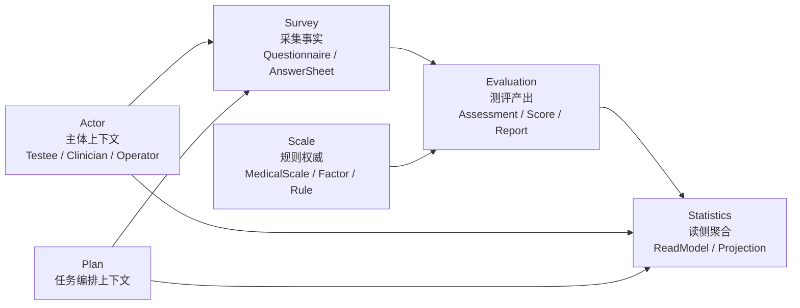

# DDD 与限界上下文讲法

**本文回答**：对外介绍 qs-server 时，如何把 DDD 和限界上下文讲清楚；怎样说明 Survey、Scale、Evaluation 为什么必须拆开；Actor、Plan、Statistics 又分别处在什么位置；如何避免把 DDD 讲成空泛术语；面试中被追问“你怎么体现 DDD”时，如何回答得具体、有证据、有取舍。

---

## 1. 先给结论

> **qs-server 不是为了“用 DDD”而拆模块，而是因为测评业务里存在三类变化源：Survey 管采集事实，Scale 管规则权威，Evaluation 管测评产出；它们生命周期、变化原因、存储形态和失败语义都不同，所以必须拆成不同限界上下文。**

最核心的一句话：

```text
Survey 管“填什么”
Scale 管“怎么算和怎么解释”
Evaluation 管“这一次测评执行后的结果”
```

这句话比直接说“我用了 DDD”更有说服力。

---

## 2. 30 秒讲法

> **我在 qs-server 里主要用 DDD 解决边界问题，而不是套概念。这个系统如果只叫问卷系统，会把问卷、量表规则、评估状态和报告生成混在一起。所以我把核心业务拆成 Survey、Scale、Evaluation：Survey 负责问卷模板和答卷提交，Scale 负责医学/心理量表、因子和解读规则，Evaluation 负责 Assessment 状态机、计分、风险和报告。Actor、Plan、Statistics 则作为主体、任务编排和读侧统计上下文与它们协作。**

适合用于：

- 面试官问“你项目里怎么用 DDD？”
- 技术分享中引入领域地图。
- 解释为什么不是一个大模块。

---

## 3. 1 分钟讲法

> **这个项目里 DDD 最重要的是限界上下文，不是聚合名字。**
>
> **在测评业务里，问卷、量表和评估结果很容易混在一起，但它们其实是三个不同问题：问卷是收集载体，关心题目、选项、答卷和答案校验；量表是规则资产，关心因子、计分规则、风险阈值和解读文案；评估是执行实例，关心一次 Assessment 的状态流转、分数、报告和失败重试。**
>
> **所以我把它拆成 Survey、Scale、Evaluation 三个核心上下文。它们之间不是互相拿对方聚合来改，而是通过引用、快照、应用服务和事件协作。比如答卷提交后，Survey 只保证 AnswerSheet 保存和 submitted 事件出站，Evaluation 后续通过 InputResolver 读取答卷、问卷和量表快照，再执行评估 pipeline。**
>
> **这样做的好处是新题型、新量表规则、新报告流程可以各自演进，不会互相污染。**

---

## 4. 领域地图主图



讲图顺序：

```text
先讲中间三块：Survey / Scale / Evaluation
再讲左边参与者和任务：Actor / Plan
最后讲右边读侧：Statistics
```

不要一上来讲所有模块。先抓主干。

---

## 5. 核心上下文一：Survey

### 5.1 一句话

> **Survey 是采集事实上下文，负责问卷模板和用户提交的答卷。**

### 5.2 它负责什么

- Questionnaire。
- Question。
- Option。
- Validation rule。
- AnswerSheet。
- 答案校验。
- 答卷提交。
- AnswerSheet durable save。
- answersheet.submitted event。

### 5.3 它不负责什么

- 量表因子。
- 风险等级。
- 专业解读。
- Assessment 状态机。
- 报告生成。
- 统计报表。

### 5.4 面试讲法

> **Survey 的核心是“采集”。它保证用户提交的答案符合问卷结构和校验规则，并且把 AnswerSheet 作为事实保存下来。它不负责生成报告，因为提交成功和评估完成是两个不同生命周期。**

---

## 6. 核心上下文二：Scale

### 6.1 一句话

> **Scale 是规则权威上下文，负责医学/心理量表规则资产。**

### 6.2 它负责什么

- MedicalScale。
- Factor。
- 题目与因子的关系。
- 计分策略。
- 风险等级。
- 解读规则。
- 量表分类。
- 量表发布。
- 量表列表和热门查询。

### 6.3 它不负责什么

- 用户答卷提交。
- AnswerSheet 持久化。
- Assessment 创建。
- Report 保存。
- 评估失败重试。
- 前台提交削峰。

### 6.4 面试讲法

> **Scale 不是问卷的一部分，而是规则资产。问卷负责收集答案，量表负责解释答案。把 Scale 单独拆出来，是为了让因子、计分规则、风险阈值和解读文案可以独立管理和发布。**

---

## 7. 核心上下文三：Evaluation

### 7.1 一句话

> **Evaluation 是测评产出上下文，负责一次测评的状态、计分、风险和报告。**

### 7.2 它负责什么

- Assessment。
- Assessment 状态机。
- AssessmentScore。
- EvaluationResult。
- InterpretReport。
- Evaluation Pipeline。
- 失败记录。
- 重试边界。
- 报告等待通知。
- evaluation 相关 outbox。

### 7.3 它不负责什么

- 编辑问卷。
- 编辑量表规则。
- 前台提交保护。
- 监护关系校验。
- 统计读模型重建。

### 7.4 面试讲法

> **Evaluation 的核心不是规则定义，而是执行实例。它读取 Survey 和 Scale 的输入快照，执行 pipeline，产出分数、风险和报告。它不反向修改问卷或量表。**

---

## 8. 支撑上下文：Actor

### 8.1 一句话

> **Actor 负责业务参与者，而不是简单复用 IAM 用户表。**

它包括：

- Testee。
- Clinician。
- Operator。
- AssessmentEntry。
- Profile link。
- 本地角色投影。

### 8.2 为什么需要 Actor

因为测评业务里的参与者不是单纯 IAM user：

| IAM | Actor |
| --- | ----- |
| 认证身份 | 业务角色 |
| user/account/tenant | testee/clinician/operator |
| token / authz | 受试者、医生、操作员、入口 |
| 权限真值 | 业务协作关系 |

讲法：

> **IAM 解决“你是谁、你有什么权限”，Actor 解决“你在测评业务里扮演什么角色”。**

---

## 9. 支撑上下文：Plan

### 9.1 一句话

> **Plan 负责长期测评任务编排，不是一次 Assessment。**

它包括：

- EvaluationPlan。
- PlanTask。
- 任务开放。
- 任务完成。
- 任务取消。
- 调度。
- 通知事件。

### 9.2 为什么需要 Plan

因为真实业务不是只有“一次测评”，还会有：

- 周期性测评。
- 多次复测。
- 计划任务。
- 任务打开。
- 未完成提醒。
- 完成率统计。

讲法：

> **Evaluation 管一次测评结果，Plan 管一组测评任务的编排。**

---

## 10. 读侧上下文：Statistics

### 10.1 一句话

> **Statistics 是读侧聚合上下文，服务运营查询，不反向污染写模型。**

它包括：

- ReadService。
- StatisticsReadModel。
- BehaviorProjector。
- SyncService。
- QueryCache。
- Hotset。

### 10.2 为什么需要 Statistics

因为后台统计不适合每次实时从 Survey、Evaluation、Actor、Plan 里 join 和 group by。

讲法：

> **写模型回答业务事实，Statistics 回答运营视角。**

---

## 11. 为什么 Survey / Scale / Evaluation 必须拆开

可以从四个角度讲。

### 11.1 生命周期不同

| 上下文 | 生命周期 |
| ------ | -------- |
| Survey | 问卷创建、发布、答卷提交 |
| Scale | 量表规则维护、发布、规则稳定 |
| Evaluation | Assessment 创建、评估执行、报告生成、失败重试 |

### 11.2 变化原因不同

| 变化 | 落点 |
| ---- | ---- |
| 新题型 | Survey |
| 新答案校验 | Survey |
| 新因子规则 | Scale |
| 新风险等级 | Scale |
| 新报告格式 | Evaluation |
| 新评估重试 | Evaluation |

### 11.3 存储形态不同

| 上下文 | 存储倾向 |
| ------ | -------- |
| Survey | Questionnaire / AnswerSheet 文档型 |
| Scale | 规则资产 + 查询缓存 |
| Evaluation | Assessment/Score 结构化 + Report 文档型 |

### 11.4 失败语义不同

| 失败 | 语义 |
| ---- | ---- |
| 答案校验失败 | 提交失败 |
| 量表规则缺失 | 评估输入失败 |
| 报告生成失败 | Evaluation failed，可重试 |
| 统计同步失败 | 读侧延迟或不准 |

一句话总结：

> **它们不是一个对象的不同字段，而是三个不同生命周期的业务事实。**

---

## 12. 跨上下文如何协作

### 12.1 不靠大聚合

不要设计成：

```text
Assessment {
  Questionnaire
  Scale
  AnswerSheet
  Report
}
```

这样会让 Assessment 变成大泥球。

### 12.2 靠引用和快照

Evaluation 通过：

```text
QuestionnaireRef
AnswerSheetRef
MedicalScaleRef
InputSnapshot
```

读取评估所需事实。

### 12.3 靠事件

Survey 提交后发：

```text
answersheet.submitted
```

后续由 worker 推动 Evaluation。

### 12.4 靠 application service

跨上下文编排不放在 domain entity 里，而是放在 application service / pipeline / resolver 里。

---

## 13. 怎么讲聚合

不要说：

```text
我们用了很多聚合
```

要说：

```text
每个聚合负责保护自己的不变量
```

### 13.1 Questionnaire

不变量：

- 题目结构。
- 选项结构。
- 发布状态。
- 版本。

讲法：

> **Questionnaire 保护问卷结构和版本。**

### 13.2 AnswerSheet

不变量：

- 引用的问卷 code/version。
- 答案集合。
- 填写人。
- 提交时间。

讲法：

> **AnswerSheet 是一次采集事实，不等于一次评估结果。**

### 13.3 MedicalScale

不变量：

- 因子。
- 题目映射。
- 计分规则。
- 解读规则。
- 发布规则。

讲法：

> **MedicalScale 是规则权威。**

### 13.4 Assessment

不变量：

- 状态流转。
- 关联 AnswerSheet。
- 关联 Scale。
- 评估结果。
- 失败原因。

讲法：

> **Assessment 是一次评估执行实例。**

---

## 14. 怎么讲限界上下文

可以用这段：

> **我判断限界上下文时，不是按数据库表拆，也不是按接口路径拆，而是看变化原因。问卷题型变化、量表规则变化、评估报告变化，是三类不同变化源，所以分别收敛到 Survey、Scale、Evaluation。Actor、Plan、Statistics 是围绕主链路的支撑上下文：Actor 处理业务参与者，Plan 处理任务编排，Statistics 处理读侧聚合。**

这段比“我们用了 DDD 分层架构”更有说服力。

---

## 15. 怎么讲“不是微服务拆分”

DDD 和微服务容易被混淆。

推荐说法：

> **这里的限界上下文首先是代码和模型边界，不等于物理微服务边界。当前系统更准确是模块化单体主业务中心 + collection BFF + worker 异步执行。这样能先把业务边界做稳，再决定未来哪些模块值得独立服务化。**

不要说：

```text
我们有六个限界上下文，所以是六个微服务。
```

这不准确。

---

## 16. 常见面试追问

### 16.1 你怎么判断 Survey 和 Scale 要拆开？

回答：

> **Survey 关注题目和答案，Scale 关注因子、计分和解读。问卷是收集载体，量表是规则资产。它们变化原因不同：新增题型主要影响 Survey，修改风险阈值主要影响 Scale。所以拆开。**

---

### 16.2 Evaluation 为什么不放到 Scale 里？

回答：

> **Scale 是规则定义，Evaluation 是执行实例。一个量表规则可以被很多次 Assessment 使用。Assessment 有状态机、失败重试、报告和结果持久化，这些不应该污染 Scale。**

---

### 16.3 AnswerSheet 和 Assessment 有什么区别？

回答：

> **AnswerSheet 是用户提交的答案事实；Assessment 是系统基于这份答卷和某套量表规则执行出来的一次测评实例。提交成功不等于评估完成。**

---

### 16.4 Statistics 为什么算一个上下文？

回答：

> **因为统计查询的口径和写模型不同。它面向运营查询，需要 read model、sync、projection、cache 和 repair。如果每次实时查写模型，会拖慢主库，也会让统计口径散落。**

---

### 16.5 Actor 为什么不是 IAM？

回答：

> **IAM 管认证和授权，Actor 管测评业务里的角色，比如 testee、clinician、operator。它们有关联，但不是一回事。**

---

## 17. 不要这样讲 DDD

### 17.1 不要堆术语

不要一上来讲：

```text
实体、值对象、聚合、领域服务、仓储、限界上下文
```

应该先讲业务问题：

```text
问卷、量表、评估为什么不能混在一起
```

### 17.2 不要把包名当限界上下文

包名只是实现。限界上下文要能解释：

- 负责什么不变量。
- 为什么变化原因独立。
- 与其它上下文怎么协作。
- 不能做什么。

### 17.3 不要说所有模块都是核心域

核心主链是：

```text
Survey / Scale / Evaluation
```

Actor、Plan、Statistics 是重要支撑上下文，但讲述时不要把所有东西都说成核心域，否则重点会散。

### 17.4 不要把 DDD 和微服务绑定

DDD 是建模方法，微服务是部署架构。当前项目不要强行讲成微服务。

---

## 18. 讲图脚本

可以这样讲领域地图：

```text
这张图中间是三个核心边界。
Survey 管采集事实，用户填什么、答案是否合法、答卷怎么保存。
Scale 管规则权威，哪些题属于哪个因子、怎么算分、怎么解释风险。
Evaluation 管测评产出，一次评估怎么创建、怎么计算、怎么生成报告、失败怎么处理。

左边 Actor 是业务参与者，解决受试者、医生、操作员这些角色问题。
Plan 是任务编排，解决长期测评计划和任务流转。
右边 Statistics 是读侧聚合，解决后台统计和运营查询。

这些上下文通过引用、快照、事件和应用服务协作，而不是用一个大聚合把所有东西塞进去。
```

---

## 19. 最终背诵版

> **我在 qs-server 里使用 DDD，重点不是套术语，而是拆清楚变化原因。测评业务里，问卷、量表和评估结果很容易混在一起，但它们其实是三个不同边界：Survey 管采集事实，包括 Questionnaire 和 AnswerSheet；Scale 管规则权威，包括 MedicalScale、Factor、计分和解读规则；Evaluation 管测评产出，包括 Assessment、Score、Report 和评估状态机。**
>
> **它们之间不通过大聚合互相嵌套，而是通过引用、输入快照、事件和应用服务协作。比如 Survey 保存 AnswerSheet 后发出 answersheet.submitted，worker 再触发 Evaluation 通过 InputResolver 读取答卷、问卷和量表快照，执行评估 pipeline。**
>
> **这样做的收益是：新增题型、新增量表规则、新增报告流程、新增统计口径都能在各自边界内演进，而不是互相污染。**

---

## 20. 证据回链

| 判断 | 证据 |
| ---- | ---- |
| 不是为了 DDD 而 DDD，而是采集、规则、结果三类变化源不同 | 旧版 `docs/06-宣讲/05-DDD 领域地图与模块协作.md` |
| Survey / Scale / Evaluation 拆分 | `docs/05-专题分析/01-为什么拆分survey-scale-evaluation.md` |
| AnswerSheet 不等于 Assessment | `docs/05-专题分析/02-为什么同步提交但异步评估.md` |
| Statistics 是读侧聚合 | `docs/05-专题分析/05-为什么需要读侧统计聚合.md` |
| IAM 和 Actor 边界不同 | `docs/05-专题分析/06-IAM嵌入式SDK边界分析.md` |
