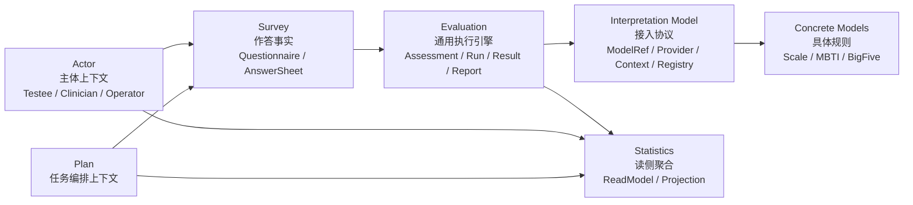

# 03-DDD 与限界上下文讲法

**本文回答**：对外介绍 qs-server 时，如何把 DDD 和限界上下文讲清楚；如何说明 Survey、Interpretation Model、Concrete Models、Evaluation 为什么要拆开；Scale 为什么不再是所有解释能力中心；MBTI 为什么不应该放进 Scale；Actor、Plan、Statistics 又分别处在什么位置；如何避免把 DDD 讲成空泛术语；面试中被追问“你怎么体现 DDD”时，如何回答得具体、有证据、有取舍。

---

## 30 秒结论

`qs-server` 使用 DDD 的重点不是“用了实体、值对象、聚合、仓储这些名词”，而是用限界上下文拆清楚测评业务中的不同变化原因。

新版主线是：

```text
Survey
    管作答事实：Questionnaire / AnswerSheet

Interpretation Model
    管接入协议：ModelRef / Provider / Context / Registry

Concrete Models
    管具体规则：Scale / MBTI / BigFive

Evaluation
    管执行生命周期：Assessment / EvaluationRun / EvaluationResult / InterpretReport
```

最核心的一句话：

> **问卷是作答载体，解释模型是规则资产，Evaluation 是执行实例；它们生命周期、变化原因、事实源和失败语义不同，所以不能塞进一个大模块。**

旧表达：

```text
Survey 管“填什么”
Scale 管“怎么算和怎么解释”
Evaluation 管“这一次测评执行后的结果”
```

新版表达：

```text
Survey 管“用户填了什么”
Interpretation Model 管“模型如何统一接入”
Scale / MBTI / BigFive 管“具体规则是什么”
Evaluation 管“这一次测评如何执行、失败、重试和生成报告”
```

---

## 1. 为什么这一篇必须更新

旧版讲法把核心上下文归纳为：

```text
Survey / Scale / Evaluation
```

并把 Scale 表达为：

```text
规则权威上下文
```

这在系统只支持医学量表时可以成立。

但当系统准备支持 MBTI、BigFive、职业兴趣测评等新模型后，这个表达会有问题：

```text
Scale 是医学量表模型；
MBTI 不是 MedicalScale；
BigFive 也不是 MedicalScale；
Evaluation 不应该依赖 Factor / RiskLevel 这些 Scale 专有概念；
真正需要抽象出来的是 Interpretation Model。
```

所以新版 DDD 讲法必须从：

```text
Survey / Scale / Evaluation
```

升级为：

```text
Survey / Interpretation Model / Concrete Models / Evaluation
```

其中：

```text
Concrete Models
├── Scale
├── MBTI
└── BigFive
```

---

## 2. 10 秒讲法

> **我在 qs-server 里用 DDD 主要是拆边界：Survey 管作答事实，Interpretation Model 管模型接入协议，Scale / MBTI 等具体模型管规则，Evaluation 管一次测评执行生命周期。**

适合：

- 面试快速回答。
- 技术分享中引入领域图。
- 回答“你怎么体现 DDD”。

---

## 3. 30 秒讲法

> **这个项目里 DDD 最重要的是限界上下文，不是聚合名字。测评业务里，问卷、解释模型规则、测评执行和报告很容易混在一起，但它们其实是不同问题：Survey 管问卷和答卷事实；Interpretation Model 管 ModelRef、Provider、Context、Registry 这些统一接入协议；Scale、MBTI、BigFive 这些 Concrete Models 管具体规则；Evaluation 管 Assessment、EvaluationRun、EvaluationResult、InterpretReport、失败重试和事件。这样新增题型、新增模型规则、新增报告流程和新增统计口径可以各自演进，不会互相污染。**

适合用于：

- 面试官问“你项目里怎么用 DDD？”
- 技术分享中引入领域地图。
- 解释为什么不是一个大模块。

---

## 4. 1 分钟讲法

> **我在 qs-server 里用 DDD，主要不是为了套实体、值对象、聚合这些术语，而是为了解决测评业务中几个变化原因不同的问题。**
>
> **Survey 是作答事实上下文，负责 Questionnaire、Question、Option、SubmissionSpec、AnswerSheet 和答案校验。它回答的是“用户填了什么，以及这份答卷是否是一个可靠事实”。**
>
> **Interpretation Model 是解释模型接入上下文，负责 ModelRef、Provider、Context、Registry。它回答的是“不同解释模型如何用统一协议接入 Evaluation”。**
>
> **Concrete Models 是具体解释模型规则上下文，当前最典型的是 Scale，未来还可以有 MBTI、BigFive。Scale 负责 MedicalScale、Factor、ScoringSpec、RiskLevel 这些医学量表语义；MBTI 则应该负责 Dimension、TypeCode、TypeProfile 这些人格模型语义。**
>
> **Evaluation 是通用测评执行上下文，负责 Assessment、EvaluationRun、EvaluationResult、InterpretReport、失败重试和事件出站。它不直接依赖 MedicalScale / Factor / RiskLevel，而是通过 ModelRef 解析 Provider，加载 Context，执行具体模型。**
>
> **这样拆的收益是：新题型影响 Survey，新解释模型影响 Concrete Model 和 Provider，新执行状态影响 Evaluation，新统计口径影响 Statistics，不会互相污染。**

---

## 5. 领域地图主图



讲图顺序：

```text
先讲中间主链路：Survey -> Evaluation -> Interpretation Model -> Concrete Models
再讲左边参与者和任务：Actor / Plan
最后讲右边读侧：Statistics
```

不要一上来讲所有模块。先抓主干。

---

## 6. 核心上下文一：Survey

### 6.1 一句话

> **Survey 是作答事实上下文，负责问卷模板和用户提交的答卷。**

### 6.2 它负责什么

- Questionnaire。
- Question。
- Option。
- SubmissionSpec。
- Validation rule。
- AnswerValue。
- AnswerSheet。
- 答案校验。
- 答卷提交。
- AnswerSheet durable save。
- `answersheet.submitted` event。

### 6.3 它不负责什么

- MedicalScale 因子。
- MBTI TypeCode。
- BigFive Trait。
- Provider Registry。
- Assessment 状态机。
- EvaluationRun。
- EvaluationResult。
- InterpretReport。
- 统计报表。

### 6.4 面试讲法

> **Survey 的核心是“作答事实”。它保证用户提交的答案符合问卷结构和提交规格，并把 AnswerSheet 作为事实保存下来。它不负责执行解释模型，也不负责生成报告，因为提交成功和测评完成是两个生命周期。**

---

## 7. 核心上下文二：Interpretation Model

### 7.1 一句话

> **Interpretation Model 是解释模型接入上下文，负责让 Scale、MBTI、BigFive 等模型用统一协议接入 Evaluation。**

### 7.2 它负责什么

- ModelRef。
- ModelType。
- ModelCode。
- ModelVersion。
- InterpretationProvider。
- InterpretationContext。
- InterpretationRegistry。
- Provider contract。
- Context loading contract。
- Provider execution contract。

### 7.3 它不负责什么

- MedicalScale 的完整规则。
- MBTIModel 的完整规则。
- BigFiveModel 的完整规则。
- AnswerSheet 持久化。
- Assessment 状态机。
- EvaluationResult 持久化。
- InterpretReport 持久化。
- 统计投影。

### 7.4 面试讲法

> **Interpretation Model 不是一个新的万能规则模块，它更像一层接入协议。Evaluation 只认识 ModelRef、Provider、Context 和 Result contract；具体规则仍然归 Scale、MBTI、BigFive 各自的具体模型上下文。**

---

## 8. 核心上下文三：Concrete Models

### 8.1 一句话

> **Concrete Models 是具体解释模型规则上下文，负责 Scale、MBTI、BigFive 等模型各自的规则资产。**

### 8.2 它包括什么

```text
Concrete Models
├── Scale
│   ├── MedicalScale
│   ├── Factor
│   ├── ScoringSpec
│   ├── RiskLevel
│   └── InterpretationRule
├── MBTI
│   ├── MBTIModel
│   ├── DimensionRule
│   ├── QuestionMapping
│   ├── TypeCode
│   └── TypeProfile
└── BigFive
    ├── BigFiveModel
    ├── TraitRule
    ├── TraitScore
    └── TraitProfile
```

### 8.3 Scale 的新定位

> **Scale 是具体医学量表解释模型，不是所有解释能力的抽象层。**

Scale 负责：

- MedicalScale。
- Factor。
- 题目与因子的关系。
- 计分策略。
- 风险等级。
- 解读规则。
- 量表分类。
- 量表发布。
- 量表列表和热门查询。

Scale 不负责：

- MBTI TypeCode。
- MBTI TypeProfile。
- BigFive Trait。
- Provider Registry。
- Assessment 状态机。
- EvaluationRun。
- InterpretReport 生命周期。

### 8.4 MBTI 为什么不放进 Scale

MBTI 的自然模型是：

```text
Dimension
Preference
TypeCode
TypeProfile
ReportTemplate
```

Scale 的自然模型是：

```text
MedicalScale
Factor
ScoringSpec
RiskLevel
InterpretationRule
```

如果把 MBTI 塞进 Scale，会导致：

```text
Factor 被滥用成 Dimension；
RiskLevel 被滥用成 TypeCode；
InterpretationRule 被滥用成 TypeProfile；
MedicalScale 变成万能解释模型。
```

面试讲法：

> **MBTI 和 Scale 都能解释答卷，但解释模型不同。Scale 是医学量表模型，MBTI 是人格类型模型。它们应该通过统一 Provider 协议同级接入 Evaluation，而不是让 MBTI 污染 Scale。**

---

## 9. 核心上下文四：Evaluation

### 9.1 一句话

> **Evaluation 是通用测评执行上下文，负责一次 Assessment 的执行生命周期。**

### 9.2 它负责什么

- Assessment。
- Assessment 状态机。
- EvaluationRun。
- EvaluationResult。
- InterpretReport。
- ModelRef 解析。
- Provider 调用编排。
- 失败记录。
- 重试边界。
- 报告等待通知。
- evaluation 相关 outbox。
- `assessment.created`。
- `assessment.completed`。
- `interpretation.completed / interpretation.failed`。
- `report.generated`。

### 9.3 它不负责什么

- 编辑问卷。
- 编辑 Scale 规则。
- 编辑 MBTI 规则。
- 前台提交保护。
- 监护关系校验。
- 统计读模型重建。
- 直接依赖 MedicalScale / Factor / RiskLevel。

### 9.4 面试讲法

> **Evaluation 的核心不是“算量表分数”，而是一次测评执行生命周期。它基于 AnswerSheet 和 ModelRef 创建 Assessment，通过 Provider 执行具体模型，保存 EvaluationResult 和 InterpretReport，并记录失败、重试和事件。**

---

## 10. 支撑上下文：Actor

### 10.1 一句话

> **Actor 负责测评业务参与者，而不是简单复用 IAM 用户表。**

它包括：

- Testee。
- Clinician。
- Operator。
- AssessmentEntry。
- Profile link。
- 本地角色投影。

### 10.2 为什么需要 Actor

因为测评业务里的参与者不是单纯 IAM user：

| IAM | Actor |
| --- | ----- |
| 认证身份 | 业务角色 |
| user/account/tenant | testee/clinician/operator |
| token / authz | 受试者、医生、操作员、入口 |
| 权限真值 | 业务协作关系 |

讲法：

> **IAM 解决“你是谁、你有什么权限”，Actor 解决“你在测评业务里扮演什么角色”。**

---

## 11. 支撑上下文：Plan

### 11.1 一句话

> **Plan 负责长期测评任务编排，不是一次 Assessment。**

它包括：

- EvaluationPlan。
- PlanTask。
- 任务开放。
- 任务完成。
- 任务取消。
- 调度。
- 通知事件。

### 11.2 为什么需要 Plan

因为真实业务不是只有“一次测评”，还会有：

- 周期性测评。
- 多次复测。
- 计划任务。
- 任务打开。
- 未完成提醒。
- 完成率统计。

讲法：

> **Evaluation 管一次测评执行，Plan 管一组测评任务的编排。**

---

## 12. 读侧上下文：Statistics

### 12.1 一句话

> **Statistics 是读侧聚合上下文，服务运营查询，不反向污染写模型。**

它包括：

- ReadService。
- StatisticsReadModel。
- BehaviorProjector。
- SyncService。
- QueryCache。
- Hotset。

### 12.2 为什么需要 Statistics

因为后台统计不适合每次实时从 Survey、Evaluation、Actor、Plan、Concrete Models 里 join 和 group by。

讲法：

> **写模型回答业务事实，Statistics 回答运营视角。**

---

## 13. 为什么 Survey / Interpretation Model / Concrete Models / Evaluation 必须拆开

可以从四个角度讲。

### 13.1 生命周期不同

| 上下文 | 生命周期 |
| ------ | -------- |
| Survey | 问卷创建、发布、答卷提交 |
| Interpretation Model | Provider 注册、模型引用、Context 加载协议 |
| Concrete Models | 规则维护、发布、归档、版本冻结 |
| Evaluation | Assessment 创建、Provider 执行、结果保存、报告生成、失败重试 |

### 13.2 变化原因不同

| 变化 | 落点 |
| ---- | ---- |
| 新题型 | Survey |
| 新答案校验 | Survey |
| 新 Provider contract | Interpretation Model |
| 新医学量表因子 | Scale |
| 新 MBTI TypeProfile | MBTI |
| 新 BigFive TraitRule | BigFive |
| 新报告生成策略 | Evaluation |
| 新评估重试策略 | Evaluation |
| 新统计口径 | Statistics |

### 13.3 存储形态不同

| 上下文 | 存储倾向 |
| ------ | -------- |
| Survey | Questionnaire / AnswerSheet 文档型 |
| Concrete Models | 规则资产 + 发布版本 + Context cache |
| Evaluation | Assessment/Run 结构化 + Result/Report 快照 |
| Statistics | ReadModel / Projection / QueryCache |

### 13.4 失败语义不同

| 失败 | 语义 |
| ---- | ---- |
| 答案校验失败 | 提交失败 |
| ModelRef 无效 | Evaluation 输入失败 |
| Provider 未注册 | Interpretation failed |
| Context 加载失败 | Interpretation failed，可重试或修复规则 |
| 报告生成失败 | Report failed，可补偿 |
| 统计同步失败 | 读侧延迟或不准 |

一句话总结：

> **它们不是一个对象的不同字段，而是不同生命周期的业务事实。**

---

## 14. 跨上下文如何协作

### 14.1 不靠大聚合

不要设计成：

```text
Assessment {
  Questionnaire
  AnswerSheet
  MedicalScale
  MBTIModel
  Report
}
```

这样会让 Assessment 变成大泥球。

### 14.2 靠引用和快照

Evaluation 通过：

```text
QuestionnaireRef
AnswerSheetRef
ModelRef
RuleSnapshotRef
InputSnapshot
```

读取执行所需事实。

### 14.3 靠 Provider 协议

```text
ModelRef
  -> Registry.Resolve(model_type)
  -> Provider.LoadContext(modelRef)
  -> Provider.Evaluate(input, context)
  -> EvaluationResult
```

### 14.4 靠事件

Survey 提交后发：

```text
answersheet.submitted
```

后续由 worker 推动：

```text
assessment.created
assessment.completed
interpretation.completed / interpretation.failed
report.generated
```

### 14.5 靠 application service

跨上下文编排不放在 domain entity 里，而是放在 application service / pipeline / resolver / engine 里。

---

## 15. 怎么讲聚合

不要说：

```text
我们用了很多聚合
```

要说：

```text
每个聚合负责保护自己的不变量
```

### 15.1 Questionnaire

不变量：

- 题目结构。
- 选项结构。
- 提交规格。
- 发布状态。
- 版本。

讲法：

> **Questionnaire 保护问卷结构和版本。**

### 15.2 AnswerSheet

不变量：

- 引用的问卷 code/version。
- 答案集合。
- 填写人。
- 提交时间。
- 答案类型和值合法。

讲法：

> **AnswerSheet 是一次作答事实，不等于一次测评结果。**

### 15.3 MedicalScale

不变量：

- 因子。
- 题目映射。
- 计分规则。
- 解读规则。
- 发布规则。

讲法：

> **MedicalScale 是医学量表规则资产。**

### 15.4 MBTIModel

不变量：

- 维度规则。
- 题目映射。
- TypeCode。
- TypeProfile。
- 报告模板。
- 发布版本。

讲法：

> **MBTIModel 是人格类型解释规则资产，不应该塞进 MedicalScale。**

### 15.5 Assessment

不变量：

- 状态流转。
- 关联 AnswerSheet。
- 关联 ModelRef。
- 执行结果引用。
- 报告引用。
- 失败原因。

讲法：

> **Assessment 是一次测评执行实例。**

---

## 16. 怎么讲限界上下文

可以用这段：

> **我判断限界上下文时，不是按数据库表拆，也不是按接口路径拆，而是看变化原因、生命周期、事实源和失败语义。问卷题型变化、解释模型规则变化、测评执行状态变化、报告生成变化、统计口径变化，是不同变化源，所以分别收敛到 Survey、Interpretation Model、Concrete Models、Evaluation、Statistics。Actor、Plan 是围绕主链路的支撑上下文，分别处理业务参与者和任务编排。**

这段比“我们用了 DDD 分层架构”更有说服力。

---

## 17. 怎么讲“不是微服务拆分”

DDD 和微服务容易被混淆。

推荐说法：

> **这里的限界上下文首先是代码和模型边界，不等于物理微服务边界。当前系统更准确是模块化主业务中心 + collection BFF + worker 异步驱动。这样能先把业务边界做稳，再决定未来哪些模块值得独立服务化。**

不要说：

```text
我们有多个限界上下文，所以是多个微服务。
```

这不准确。

---

## 18. 常见面试追问

### 18.1 你怎么判断 Survey 和 Scale 要拆开？

回答：

> **Survey 关注题目、答案、提交规格和 AnswerSheet；Scale 关注 MedicalScale、Factor、计分和医学量表解读。问卷是作答载体，Scale 是具体医学量表规则资产。新增题型主要影响 Survey，修改风险阈值主要影响 Scale，所以拆开。**

---

### 18.2 MBTI 为什么不放到 Scale 里？

回答：

> **因为 Scale 是医学量表模型，核心是 Factor、ScoringSpec、RiskLevel；MBTI 的核心是 Dimension、Preference、TypeCode、TypeProfile。把 MBTI 塞进 Scale 会污染 MedicalScale 语义。更合理的是让 MBTIProvider 和 ScaleProvider 同级接入 Evaluation。**

---

### 18.3 Evaluation 为什么不放到 Scale 里？

回答：

> **Scale 是规则定义，Evaluation 是执行实例。一个模型规则可以被很多次 Assessment 使用。Assessment 有状态机、失败重试、EvaluationResult、InterpretReport 和事件出站，这些不应该污染 Scale。**

---

### 18.4 AnswerSheet 和 Assessment 有什么区别？

回答：

> **AnswerSheet 是用户提交的答案事实；Assessment 是系统基于这份答卷和某个 ModelRef 创建的一次测评执行实例。提交成功不等于测评完成。**

---

### 18.5 Statistics 为什么算一个上下文？

回答：

> **因为统计查询的口径和写模型不同。它面向运营查询，需要 read model、sync、projection、cache 和 repair。如果每次实时查写模型，会拖慢主库，也会让统计口径散落。**

---

### 18.6 Actor 为什么不是 IAM？

回答：

> **IAM 管认证和授权，Actor 管测评业务里的角色，比如 testee、clinician、operator。它们有关联，但不是一回事。**

---

### 18.7 Interpretation Model 是不是新的大聚合？

回答：

> **不是。Interpretation Model 不是保存所有规则的大聚合，它更像接入协议层。具体规则仍在 Scale、MBTI、BigFive 中；Evaluation 只通过 ModelRef、Provider、Context、Registry 调用它们。**

---

## 19. 不要这样讲 DDD

### 19.1 不要堆术语

不要一上来讲：

```text
实体、值对象、聚合、领域服务、仓储、限界上下文
```

应该先讲业务问题：

```text
问卷、解释模型规则、测评执行和报告事实为什么不能混在一起
```

### 19.2 不要把包名当限界上下文

包名只是实现。限界上下文要能解释：

- 负责什么不变量。
- 为什么变化原因独立。
- 与其它上下文怎么协作。
- 不能做什么。

### 19.3 不要说所有模块都是核心域

核心主链是：

```text
Survey / Interpretation Model / Concrete Models / Evaluation
```

Actor、Plan、Statistics 是重要支撑上下文，但讲述时不要把所有东西都说成核心域，否则重点会散。

### 19.4 不要把 DDD 和微服务绑定

DDD 是建模方法，微服务是部署架构。当前项目不要强行讲成微服务。

### 19.5 不要把 Scale 讲成解释模型抽象

Scale 是具体医学量表模型。

解释模型抽象是：

```text
Interpretation Model
```

---

## 20. 讲图脚本

可以这样讲领域地图：

```text
这张图中间是主链路。
Survey 管作答事实，用户填什么、答案是否合法、答卷怎么保存。
Evaluation 管一次测评执行，Assessment 怎么创建、Provider 怎么执行、结果和报告怎么生成、失败怎么处理。
Interpretation Model 管模型接入协议，ModelRef 怎么表达、Provider 怎么解析、Context 怎么加载。
Concrete Models 管具体规则，Scale、MBTI、BigFive 各自维护自己的规则资产。

左边 Actor 是业务参与者，解决受试者、医生、操作员这些角色问题。
Plan 是任务编排，解决长期测评计划和任务流转。
右边 Statistics 是读侧聚合，解决后台统计和运营查询。

这些上下文通过引用、快照、Provider 协议、事件和应用服务协作，而不是用一个大聚合把所有东西塞进去。
```

---

## 21. 最终背诵版

> **我在 qs-server 里使用 DDD，重点不是套术语，而是拆清楚变化原因。测评业务里，问卷、解释模型规则、测评执行和报告事实很容易混在一起，但它们其实是不同边界：Survey 管作答事实，包括 Questionnaire 和 AnswerSheet；Interpretation Model 管接入协议，包括 ModelRef、Provider、Context、Registry；Scale、MBTI、BigFive 这些 Concrete Models 管具体规则；Evaluation 管测评执行，包括 Assessment、EvaluationRun、EvaluationResult、InterpretReport 和失败重试。**
>
> **它们之间不通过大聚合互相嵌套，而是通过引用、输入快照、ModelRef、Provider、事件和应用服务协作。比如 Survey 保存 AnswerSheet 后发出 `answersheet.submitted`，worker 再触发 Evaluation 创建 Assessment，随后通过 ModelRef 解析 Provider，加载 Context，执行具体模型，并最终生成 EvaluationResult 和 InterpretReport。**
>
> **这样做的收益是：新增题型、新增 Scale 规则、新增 MBTI 模型、新增报告流程、新增统计口径都能在各自边界内演进，而不是互相污染。**

---

## 22. 证据回链

| 判断 | 证据 |
| ---- | ---- |
| DDD 是为了拆分不同变化源，不是堆术语 | `docs/05-专题分析/01-为什么拆分Survey-InterpretationModel-Evaluation.md` |
| Survey / Interpretation Model / Concrete Models / Evaluation 新主线 | `docs/05-专题分析/01-为什么拆分Survey-InterpretationModel-Evaluation.md` |
| MBTI 不应该放进 Scale | `docs/05-专题分析/08-多解释模型扩展专题--从Scale到MBTI.md` |
| Evaluation 是通用执行引擎 | `docs/05-专题分析/09-Evaluation通用执行引擎专题.md` |
| 解释模型事件与缓存治理 | `docs/05-专题分析/10-解释模型事件与缓存治理专题.md` |
| AnswerSheet 不等于 Assessment | `docs/05-专题分析/02-为什么同步提交但异步测评执行.md` |
| Statistics 是读侧聚合 | `docs/05-专题分析/05-为什么需要读侧统计聚合.md` |
| IAM 和 Actor 边界不同 | `docs/05-专题分析/06-IAM嵌入式SDK边界分析.md` |
