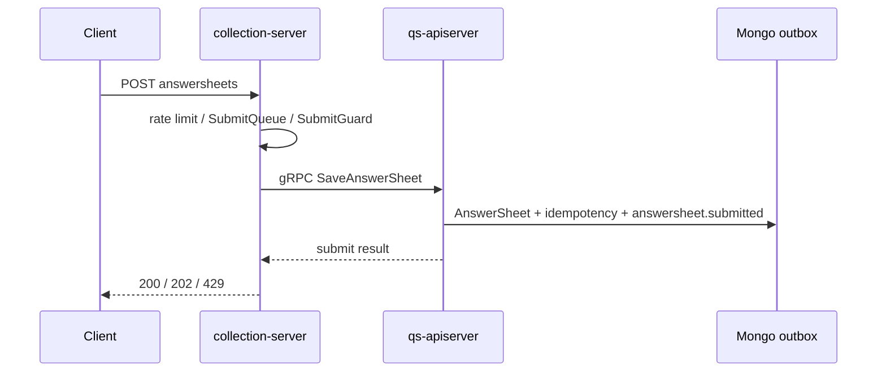

# 主链路 1：提交答卷

**本文回答**：这篇文档负责把“提交答卷”这条主链路讲成一段可口述、可回链的材料，重点说明同步阶段到底做了什么、异步从哪里开始、`200 / 202 / 429` 分别意味着什么，以及当前幂等和一致性最需要如实说明的边界。

## 30 秒讲法

这条链的目标不是在用户请求里把整套测评算完，而是**尽快完成接入侧校验、答卷落库和异步起点固化**。请求先进 `collection-server`，做鉴权、监护、限流和可选 SubmitQueue，再走 gRPC 到 `qs-apiserver` 保存答卷；答卷会与业务幂等记录和 `answersheet.submitted` outbox 同事务落库，再由 apiserver relay 异步补发事件，把后续计分和测评创建交给异步链路。

## 重点速查

如果只看一屏，先看下面这张表：

| 维度 | 结论 |
| ---- | ---- |
| 同步阶段目标 | 尽快完成接入校验、答卷落库，以及把异步起点 durable 化，不在请求线程里直接跑完整评估 |
| 入口路径 | `Client -> collection-server REST -> 可选 SubmitQueue -> apiserver gRPC SaveAnswerSheet` |
| 异步起点 | 答卷保存成功后写入 `answersheet.submitted` outbox，由 apiserver relay 异步补发，后续交给 worker 第一跳处理 |
| 状态码口径 | `200` 表示同步拿到结果；`202` 表示已入队待查状态；`429` 表示 SubmitQueue 满 |
| 当前最强幂等 | 下游“按答卷唯一建测评”有 Redis 锁 + 预查 + MySQL 唯一约束 |
| 当前最弱边界 | 同步入口仍保留 `request_id` 的单实例内存态状态机；真正 durable 幂等依赖调用方显式传 `idempotency_key` |

## 主链路图

## 标准链路

1. 客户端请求 `collection-server` 的 `POST /api/v1/answersheets`。入口见 [collection.yaml](../../api/rest/collection.yaml) 和 [answersheet_handler.go](../../internal/collection-server/interface/restful/handler/answersheet_handler.go)。
2. `collection-server` 在 application 层做鉴权上下文处理、监护关系校验、限流和可选 SubmitQueue。证据见 [submission_service.go](../../internal/collection-server/application/answersheet/submission_service.go) 和 [submit_queue.go](../../internal/collection-server/application/answersheet/submit_queue.go)。
3. 若队列未启用或在等待窗口内拿到结果，就直接返回 `200`；若已入队但 `wait_timeout` 内未完成，就返回 `202` 和 `request_id`，前端再查 `submit-status`。`request_id` 只服务这条队列状态机，不再承担 durable 幂等语义。证据见 [answersheet_handler.go](../../internal/collection-server/interface/restful/handler/answersheet_handler.go)。
4. `collection-server` 通过 gRPC 调 `AnswerSheetService/SaveAnswerSheet`，可选把 `idempotency_key` 透传给 apiserver；`qs-apiserver` 在 [submission_service.go](../../internal/apiserver/application/survey/answersheet/submission_service.go) 里完成问卷校验、答案校验和 `AnswerSheet` 聚合创建。
5. `qs-apiserver` 会在一个 Mongo 事务里同时写入答卷、业务幂等记录和 `answersheet.submitted` outbox；真正出站由 apiserver relay 补发，把链路交给 worker。证据见 [durable_submit.go](../../internal/apiserver/infra/mongo/answersheet/durable_submit.go) 和 [process/runtime_bootstrap.go](../../internal/apiserver/process/runtime_bootstrap.go)。

## 节点与证据

| 节点 | 当前实现 | 证据 |
| ---- | -------- | ---- |
| REST 入口 | `AnswerSheetHandler.Submit` 接收请求，可能返回 `200` / `202` / `429` | [answersheet_handler.go](../../internal/collection-server/interface/restful/handler/answersheet_handler.go) |
| BFF 排队 | SubmitQueue 用内存 channel + worker goroutine 处理下游提交 | [submit_queue.go](../../internal/collection-server/application/answersheet/submit_queue.go)、[../05-专题分析/02-异步评估链路：从答卷提交到报告生成.md](../05-专题分析/02-异步评估链路：从答卷提交到报告生成.md) |
| gRPC 落卷 | `SaveAnswerSheet` 进入 apiserver survey 应用服务 | [answersheet.go](../../internal/apiserver/interface/grpc/service/answersheet.go)、[submission_service.go](../../internal/apiserver/application/survey/answersheet/submission_service.go) |
| Mongo 持久化 | `answersheets` + `answersheet_submit_idempotency` + `domain_event_outbox` 同事务写入 | [repo.go](../../internal/apiserver/infra/mongo/answersheet/repo.go)、[durable_submit.go](../../internal/apiserver/infra/mongo/answersheet/durable_submit.go) |
| 异步起点 | `answersheet.submitted` 事件 payload 含答卷、问卷、受试者、组织、填写人信息 | [events.go](../../internal/apiserver/domain/survey/answersheet/events.go)、[../05-专题分析/02-异步评估链路：从答卷提交到报告生成.md](../05-专题分析/02-异步评估链路：从答卷提交到报告生成.md) |

## 当前幂等与一致性口径

| 状态 | 结论 | 证据 |
| ---- | ---- | ---- |
| `已实现` | `collection-server` 的 SubmitQueue 对同一 `request_id` 做**单实例、短期内存态**去重和状态查询，适合承接 202 场景，但不跨实例、不持久化 | [submit_queue.go](../../internal/collection-server/application/answersheet/submit_queue.go)、[../05-专题分析/02-异步评估链路：从答卷提交到报告生成.md](../05-专题分析/02-异步评估链路：从答卷提交到报告生成.md) |
| `已实现` | 调用方显式传 `idempotency_key` 时，apiserver 会按业务键做 durable 幂等：重复提交返回已有答卷，不会重复创建答卷或重复写 outbox | [submission_service.go](../../internal/apiserver/application/survey/answersheet/submission_service.go)、[durable_submit.go](../../internal/apiserver/infra/mongo/answersheet/durable_submit.go) |
| `已实现` | 下游“创建测评”这一步更强：worker 先按答卷拿 Redis 锁，apiserver 再按 `answer_sheet_id` 预查，MySQL 还有 `uk_answer_sheet_id` 唯一约束兜底 | [answersheet_handler.go](../../internal/worker/handlers/answersheet_handler.go)、[internal.go](../../internal/apiserver/interface/grpc/service/internal.go)、[po.go](../../internal/apiserver/infra/mysql/evaluation/po.go) |
| `已实现` | 答卷写库成功后，`answersheet.submitted` 通过 outbox/relay 最终补发，不再暴露“保存成功但事件直接 publish 失败就丢失”的窗口 | [durable_submit.go](../../internal/apiserver/infra/mongo/answersheet/durable_submit.go)、[process/runtime_bootstrap.go](../../internal/apiserver/process/runtime_bootstrap.go) |

## 保证矩阵

| 主题 | 当前能讲成已保证 | 当前不能讲过头 |
| ---- | ---------------- | -------------- |
| 接入受理 | `collection-server` 能用 `200 / 202 / 429` 清楚表达同步完成、排队等待和入口过载 | 不能讲成“所有提交都稳定同步完成” |
| BFF 幂等 | `request_id` 级别的单实例、短期内存态状态查询已存在 | 不能把 `request_id` 讲成 durable 业务幂等；durable 幂等以 `idempotency_key` 为准 |
| 下游建测评 | 按答卷唯一建测评的幂等更强，已有锁、预查和唯一约束 | 不能把这层幂等外推成“整条提交链都已闭环幂等” |
| 写库后发事件 | 当前可以明确讲成“答卷 + outbox 同事务，relay 最终补发；评估主链关键事件也已按 MySQL / Mongo 边界 outbox 化” | 不能把这个结论外推到所有事件；`task.*`、`questionnaire.changed`、`scale.changed` 仍不是 outbox 事件 |

## 失败路径

- `429`：SubmitQueue 的 channel 满，`collection-server` 直接返回 `submit queue full`。证据见 [answersheet_handler.go](../../internal/collection-server/interface/restful/handler/answersheet_handler.go)。
- `202`：已入队，但 `wait_timeout` 内没有同步拿到结果；前端应再查 `submit-status`。证据见 [submit_queue.go](../../internal/collection-server/application/answersheet/submit_queue.go)。
- `500`：问卷校验、答案校验、gRPC 或 Mongo 写失败时，提交流程直接失败。证据见 [submission_service.go](../../internal/apiserver/application/survey/answersheet/submission_service.go)。
- “主状态成功、异步没起”：当前 `answersheet.submitted` 已经用 Mongo outbox/relay 收口，评估主链里的 `assessment.submitted` / `assessment.failed` 走 MySQL outbox，`assessment.interpreted` / `report.generated` 走 Mongo report-save outbox；不要把这个结论外推到所有其它事件。

## 宣讲时建议强调

- 这条链的设计目标是**缩短请求线程里的工作量**，而不是把所有一致性问题都压给 MQ。
- 当前幂等是分层做的：BFF 有 `request_id` 级别的短期状态查询，答卷提交可选 `idempotency_key` 走 durable 幂等，下游创建测评还有按答卷唯一建测评的第二层保护。
- 如果被问“下一步会改什么”，更准确的答案应转到“是否把 outbox 推广到更多事件，以及是否让没有 `idempotency_key` 的提交也获得更强业务幂等”。

## 别说过头

- 不要说“提交答卷已经对所有客户端天然 durable 幂等”；更准确的说法是“显式传 `idempotency_key` 的请求已具备 durable 幂等，其余请求仍主要依赖下游第二层保护”。
- 不要说“所有事件都已经有 outbox”；当前只覆盖 `answersheet.submitted` 和评估主链关键事件。
- 不要把 `202` 讲成失败，它代表的是“已受理，但改走状态查询模式”。

## 回链入口

- 真值层主链路：[../00-总览/03-核心业务链路.md](../00-总览/03-核心业务链路.md)
- 异步专题：[../05-专题分析/02-异步评估链路：从答卷提交到报告生成.md](../05-专题分析/02-异步评估链路：从答卷提交到报告生成.md)
