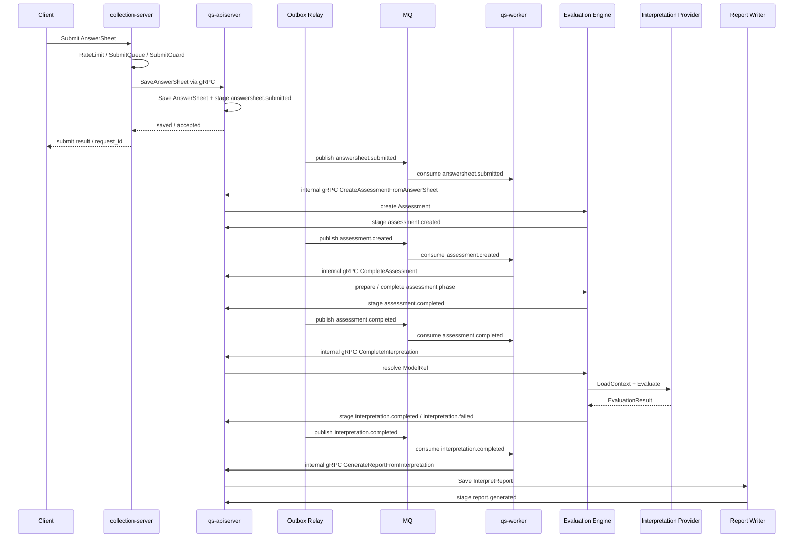
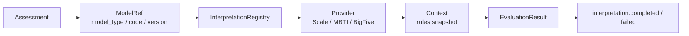

# 04-异步测评执行链路讲法

**本文回答**：对外介绍 qs-server 时，如何把“用户提交答卷之后，系统如何异步推进 Assessment、Interpretation、Report”的主链路讲清楚；如何从旧的“异步评估链路”升级为“异步测评执行链路”；如何串起 collection-server、SubmitQueue、SubmitGuard、Survey、Outbox、MQ、qs-worker、Internal gRPC、Evaluation Engine、Interpretation Provider、EvaluationResult、InterpretReport、失败重试和观测治理；如何在面试中说明这条链的可靠性、幂等边界和工程取舍。

---

## 30 秒结论

新版主链路不再讲：

```text
AnswerSheet saved
  -> answersheet.submitted
  -> CalculateAnswerSheetScore
  -> CreateAssessmentFromAnswerSheet
  -> assessment.submitted
  -> EvaluateAssessment
  -> Validation / FactorScore / RiskLevel / Interpretation
  -> Score / Report
```

而是讲：

```text
AnswerSheet saved
  -> answersheet.submitted
  -> assessment.created
  -> assessment.completed
  -> interpretation.completed / interpretation.failed
  -> report.generated
```

内部执行模型从旧的：

```text
Scale 专用 Evaluation Pipeline
```

升级为：

```text
Evaluation Engine
  -> ModelRef
  -> InterpretationRegistry
  -> Provider.LoadContext
  -> Provider.Evaluate
  -> EvaluationResult
  -> InterpretReport
```

最关键的一句话：

> **同步提交保证 AnswerSheet 事实可靠保存，异步测评执行保证 Assessment、Interpretation 和 Report 可以在后台被可靠推进、失败可查、重复可幂等、模型可扩展。**

再压缩：

> **collection 保护提交入口，apiserver 保存事实和执行状态机，worker 只消费事件并通过 internal gRPC 回调 apiserver 推进下一阶段。**

---

## 1. 为什么这一篇必须更新

旧文件标题是：

```text
04-异步评估链路讲法.md
```

建议后续重命名为：

```text
04-异步测评执行链路讲法.md
```

原因是“异步评估”容易让人以为：

```text
worker 收到答卷后，跑 Scale 评估流水线，算分、算风险、生成报告。
```

这仍然是旧的 Scale 中心表达。

新版表达要强调：

```text
Evaluation 是通用测评执行引擎；
Scale / MBTI / BigFive 是具体 Provider；
worker 不跑模型算法；
worker 只是消费事件并回调 apiserver；
apiserver 内部通过 ModelRef / Provider / Context 执行具体解释模型；
报告生成是 interpretation.completed 之后的独立阶段。
```

---

## 2. 10 秒讲法

> **用户提交答卷后，系统同步保存 AnswerSheet，后续通过 Outbox、MQ、worker 和 internal gRPC 异步推进 Assessment 创建、解释模型执行和报告生成。**

适合：

- 面试官问“主链路怎么跑”。
- 技术分享中讲核心时序。
- 白板图开头。

---

## 3. 30 秒讲法

> **用户提交答卷时，系统不会在请求线程里同步生成报告。前台请求先进 collection-server，经过限流、SubmitQueue、SubmitGuard 后，通过 gRPC 调 apiserver 保存 AnswerSheet。apiserver 保存答卷时，会把 `answersheet.submitted` 通过 Outbox 同事务 stage 下来。Outbox relay 发布事件后，worker 消费事件并通过 internal gRPC 回调 apiserver：先基于 AnswerSheet 创建 Assessment，产生 `assessment.created`；再推进 Assessment 执行，产生 `assessment.completed`；随后通过 ModelRef 解析 Provider，加载 Context 并执行 Scale / MBTI 等具体解释模型，成功后产生 `interpretation.completed`，失败则产生 `interpretation.failed`；最后生成 InterpretReport，并产生 `report.generated`。**

这段适合：

- 技术分享核心链路。
- 面试官问“异步链路怎么设计”。
- 被问“为什么用了 MQ / Outbox / Worker”。

---

## 4. 1 分钟讲法

> **这条链路可以分成四段。**
>
> **第一段是同步提交。前台请求先进 collection-server，先做认证投影、TenantDomain/OrgScope、限流、SubmitQueue 削峰和 SubmitGuard 幂等保护，然后通过 gRPC 调 apiserver。apiserver 在 Survey 边界里校验并保存 AnswerSheet，同时 stage `answersheet.submitted` Outbox。这里的目标不是生成报告，而是保证答卷事实可靠保存。**
>
> **第二段是事件出站。Outbox relay 把 `answersheet.submitted` 发布到 MQ。这里不能只靠 MQ，因为 MQ 不解决业务数据库 commit 和 publish 之间的双写一致性。Outbox 的价值是把业务事实和待发布事件同事务保存。**
>
> **第三段是 worker 驱动。worker 消费事件后不直接写业务库，而是通过 internal gRPC 回调 apiserver。第一跳创建 Assessment，产生 `assessment.created`；第二跳推进 Assessment 执行，产生 `assessment.completed`。**
>
> **第四段是通用解释执行。apiserver 内部的 Evaluation Engine 根据 ModelRef 找到 Provider，加载 Provider Context，执行 ScaleProvider 或 MBTIProvider，保存 EvaluationResult，产生 `interpretation.completed / failed`。报告生成则在 interpretation completed 后继续推进，保存 InterpretReport 并产生 `report.generated`。**

---

## 5. 3 分钟讲法

> **这条异步测评执行链路的设计目标，是把“用户提交答卷”和“系统生成报告”解耦。因为答卷提交必须快、反馈要确定；但测评执行涉及模型解析、Context 加载、Provider 执行、结果保存、报告生成、事件出站、统计投影和等待者通知，链路长、耗时不可控、失败面也大，不能全部卡在前台请求里。**
>
> **所以系统先同步完成作答事实落库。collection-server 承接前台请求，做认证投影、限流、SubmitQueue 和 SubmitGuard，然后通过 gRPC 调 apiserver 保存 AnswerSheet。apiserver 保存答卷时，会把 AnswerSheet 和 `answersheet.submitted` 事件通过 Outbox 绑定在同一个持久化边界里。这样即使 MQ 暂时不可用，也不会出现“答卷已经保存，但后续测评永远不开始”的问题。**
>
> **之后进入异步阶段。Outbox relay 把事件发到 MQ，worker 消费后通过 internal gRPC 回调 apiserver。worker 自己不直接写业务库，也不持有 Evaluation 状态机；它只是异步驱动器。第一阶段 apiserver 基于 AnswerSheet 创建 Assessment，并发出 `assessment.created`；第二阶段推进 Assessment 执行并发出 `assessment.completed`；第三阶段进入解释模型执行：Evaluation Engine 读取 ModelRef，通过 InterpretationRegistry 找到 ScaleProvider、MBTIProvider 等具体 Provider，加载 Context，执行模型并保存 EvaluationResult，然后发出 `interpretation.completed` 或 `interpretation.failed`；最后再根据结果生成 InterpretReport，并发出 `report.generated`。**
>
> **这套设计的收益是：提交链路短，评估链路可重试；事件出站有 Outbox，worker 消费有 Ack/Nack；状态机在 apiserver 统一治理；Scale、MBTI、BigFive 等模型通过 Provider 同级接入，Evaluation 不被 Scale 的 Factor / RiskLevel 语义污染。代价是链路更长，排障要跨 collection、AnswerSheet、Outbox、MQ、worker、Internal gRPC、Assessment、Provider、Result、Report，所以必须配套 metrics、logs、governance status 和 runbook。**

---

## 6. 新版主链路图



讲图时重点说：

```text
左边是提交，右边是异步测评执行。
中间用 Outbox 和 MQ 断开。
worker 只负责驱动，apiserver 仍是业务事实中心。
Evaluation 通过 ModelRef / Provider / Context 执行具体模型。
interpretation.completed 不等于 report.generated。
```

---

## 7. 一条链路，四个层次

| 层次 | 关注点 | 对应实现 |
| ---- | ------ | -------- |
| 前台入口 | 提交不要打穿主服务 | collection-server / RateLimit / SubmitQueue / SubmitGuard |
| 事实落库 | AnswerSheet 事实不能丢 | Survey / SaveAnswerSheet / Mongo / Outbox |
| 事件驱动 | 后续阶段可靠推进 | EventCatalog / Outbox / MQ / Worker / Internal gRPC |
| 测评执行 | 从答卷和 ModelRef 生成结果和报告 | Evaluation Engine / Provider / Result / Report |

不要只讲“用了 MQ”。

要讲：

```text
前台保护
事实可靠
事件可靠
执行可治理
```

---

## 8. 第一段：同步保存 AnswerSheet

第一段目标不是生成报告，而是固化业务事实：

```text
用户提交了这份答卷
```

同步阶段做：

1. collection-server 接收请求。
2. 身份与 TenantDomain/OrgScope 投影。
3. 监护关系或访问范围校验。
4. RateLimit。
5. SubmitQueue 削峰。
6. SubmitGuard 幂等保护。
7. gRPC 调 apiserver。
8. apiserver 校验问卷和答案。
9. 保存 AnswerSheet。
10. stage `answersheet.submitted` outbox。

### 8.1 这一段要讲清的点

> **答卷保存是同步事实边界，报告生成不是。**

如果面试官问“提交成功意味着什么”，回答：

> **提交成功只意味着 AnswerSheet 已被可靠保存，或者请求已被 collection 受理进入状态查询流程；不代表 Assessment 已完成，更不代表报告已经生成。**

---

## 9. 第二段：Outbox 发出 `answersheet.submitted`

AnswerSheet 保存后，不能只在内存里 publish 事件。

原因：

```text
DB 保存成功
MQ publish 失败
```

会导致：

```text
答卷有了
Assessment 永远不创建
报告永远不生成
```

所以使用 Outbox：

```text
AnswerSheet + domain_event_outbox
```

同事务保存或同持久化边界保存。

### 9.1 这一段要讲清的点

> **Outbox 解决的不是消费端重试，而是生产端 DB 与 MQ 双写一致性。**

面试官问“有 MQ 为什么还要 Outbox”，回答：

> **MQ 只能保证消息系统内部的投递，不保证业务数据库 commit 和 MQ publish 是原子操作。Outbox 把待发布事件和业务事实放在同一个持久化边界里，后续由 relay 重试发布。**

---

## 10. 第三段：worker 消费 `answersheet.submitted`

worker 收到 `answersheet.submitted` 后，不直接操作数据库，而是通过 internal gRPC 调 apiserver。

这一跳通常做：

```text
CreateAssessmentFromAnswerSheet
```

### 10.1 为什么要创建 Assessment

Assessment 表示：

```text
系统基于某份 AnswerSheet 和某个 ModelRef 创建的一次测评执行实例
```

它是后续执行状态、结果、报告、失败重试和 wait-report 的主线索。

### 10.2 为什么 worker 不直接创建 Assessment

因为 Assessment 的状态机、唯一约束、事务和 Outbox 都在 apiserver 内。

正确模式：

```text
worker consume event
  -> internal gRPC
  -> apiserver application service
```

而不是：

```text
worker -> DB
```

### 10.3 产生的新事件

创建成功后，系统产生：

```text
assessment.created
```

它表达的是：

```text
已基于 AnswerSheet 创建 Assessment
```

不要继续使用旧语义：

```text
assessment.submitted
```

---

## 11. 第四段：`assessment.created` 推进 Assessment 执行

`assessment.created` 之后，worker 再触发下一跳：

```text
CompleteAssessment
```

这一阶段的目标是把 Assessment 从“已创建”推进到“测评执行阶段已完成准备或执行”。

完成后发出：

```text
assessment.completed
```

### 11.1 为什么拆成多跳

拆成多跳有几个好处：

| 好处 | 说明 |
| ---- | ---- |
| 状态更清晰 | 创建、执行、解释、报告分开 |
| 失败边界更清楚 | Assessment 创建失败、Provider 执行失败、报告生成失败可区分 |
| 重试更可控 | 每一阶段可以按阶段事实重试或补偿 |
| 扩展性更好 | 可以插入人工审核、模型选择、任务关联、重算任务 |
| 观测更准确 | 可以看到卡在哪个阶段 |

### 11.2 旧事件语义为什么不够

旧语义：

```text
assessment.submitted
assessment.interpreted
```

问题：

```text
submitted 不清楚是“Assessment 已创建”还是“待执行”；
interpreted 不清楚是“Provider 完成”还是“报告完成”；
不利于区分 Evaluation 阶段、Interpretation 阶段和 Report 阶段。
```

新版语义更清楚：

```text
assessment.created
assessment.completed
interpretation.completed / interpretation.failed
report.generated
```

---

## 12. 第五段：Evaluation Engine 执行 Provider

`assessment.completed` 之后进入解释模型执行阶段。

核心流程：

```text
CompleteInterpretation
  -> resolve ModelRef
  -> Registry.Resolve(model_type)
  -> Provider.LoadContext(modelRef)
  -> Provider.Evaluate(input, context)
  -> Save EvaluationResult
  -> stage interpretation.completed / interpretation.failed
```

### 12.1 Provider 执行图



### 12.2 ScaleProvider 怎么讲

> **ScaleProvider 负责加载 MedicalScale、Factor、ScoringSpec、RiskLevel 等医学量表规则，并产出 Scale 结构化结果。**

### 12.3 MBTIProvider 怎么讲

> **MBTIProvider 负责加载 MBTIModel、DimensionRule、QuestionMapping、TypeProfile 等规则，并产出 dimension scores、preference result、TypeCode 等结构化结果。**

### 12.4 Provider 不做什么

Provider 不应该：

- 直接修改 AnswerSheet。
- 直接修改 Assessment 状态。
- 直接保存 InterpretReport 主事实。
- 直接发布 Outbox event。
- 直接做统计投影。
- 直接做权限判断。

这些由 Evaluation / Application / Infrastructure 层负责。

---

## 13. 第六段：InterpretReport 生成

`interpretation.completed` 表示：

```text
具体 Provider 已完成解释，并产生 EvaluationResult
```

它不等于：

```text
报告已经生成
```

报告生成是下一阶段：

```text
GenerateReportFromInterpretation
  -> read EvaluationResult
  -> build report sections / render data
  -> save InterpretReport
  -> stage report.generated
```

### 13.1 为什么 report.generated 要单独建模

因为报告生成也可能失败：

- ReportTemplate 缺失。
- render data 构建失败。
- Mongo / document store 不可用。
- report outbox stage 失败。
- waiter notify 失败。

所以要区分：

```text
interpretation.completed
report.generated
```

面试讲法：

> **Provider 执行成功只表示有了结构化结果，不代表报告事实已经保存。报告生成是独立阶段，成功保存 InterpretReport 后才发 `report.generated`。**

---

## 14. AssessmentID / ModelRef / ReportID 怎么讲

| ID / Ref | 语义 |
| -------- | ---- |
| AnswerSheetID | 用户提交了哪份答卷 |
| AssessmentID | 系统基于这份答卷创建了哪次测评执行 |
| ModelRef | 这次执行使用哪个解释模型和版本 |
| EvaluationResultID | Provider 执行产生的结构化结果 |
| ReportID | 最终生成的报告事实 |

面试讲法：

> **AnswerSheetID 是提交事实线索，AssessmentID 是执行生命周期线索，ModelRef 是规则版本线索，ReportID 是报告交付线索。**

---

## 15. 幂等怎么讲

不要说：

```text
MQ 保证不重复
```

这不准确。

更准确：

> **这条链的幂等是分层做的：collection 层有 SubmitGuard，AnswerSheet durable submit 有 idempotency key，worker 处理同一业务键有 duplicate suppression，apiserver 创建 Assessment 时有预查和唯一约束兜底，Evaluation 和 Report 阶段有状态机和结果唯一性约束。**

### 15.1 幂等分层表

| 层 | 幂等 / 重复抑制 |
| -- | --------------- |
| collection | SubmitGuard done marker + in-flight lock |
| AnswerSheet save | idempotency key + durable submit |
| worker | duplicate suppression / processing lock |
| Assessment 创建 | answer_sheet_id 预查 + 唯一约束 |
| Interpretation 执行 | Assessment 状态机 + EvaluationRun |
| Report 生成 | report unique key / status guard |
| Outbox / MQ | 至少一次出站 / 投递，consumer 必须幂等 |

### 15.2 面试回答

> **我不会把这条链说成 exactly-once。更准确的是 producer-side 用 Outbox 保证事件可靠出站，consumer-side 用锁、唯一约束和状态机实现业务幂等。**

---

## 16. 失败怎么讲

异步链路一定会失败，关键是能否解释和恢复。

### 16.1 失败分类

| 失败点 | 表现 | 排查方向 |
| ------ | ---- | -------- |
| collection queue full | 提交被拒绝或等待 | SubmitQueue / RateLimit |
| AnswerSheet 保存失败 | 提交失败 | Survey / Mongo / validation |
| Outbox pending 堆积 | 事件没出站 | relay / MQ / EventCatalog |
| worker Nack | 消费失败 | handler / internal gRPC / downstream |
| CreateAssessment 失败 | Assessment 未创建 | Evaluation submission / uniqueness |
| CompleteAssessment 失败 | Assessment 卡在 created | Evaluation state / input |
| Provider resolve 失败 | interpretation.failed | ModelRef / Registry |
| Context load 失败 | interpretation.failed | Scale / MBTI repository / cache |
| Provider evaluate 失败 | interpretation.failed | rule invalid / algorithm error |
| EvaluationResult 保存失败 | interpretation failed 或 retry | result repository |
| Report 保存失败 | interpretation completed 但 report 缺失 | Report writer / Mongo |
| WaiterNotify 失败 | 前台等待未及时通知 | waiter registry / logs |
| Statistics 未更新 | 读侧滞后 | projector / sync / cache |

### 16.2 失败讲法

> **异步链路不追求“永远不失败”，而是追求失败可定位、可重试、不会污染提交事实。**

---

## 17. 重试怎么讲

重试要谨慎讲，不要承诺代码里没有证据的固定次数。

推荐说法：

> **worker 失败会走 MQ 的 Nack / retry 语义，Outbox 发布失败会 MarkFailed 并设置 nextAttemptAt 等待后续 relay 重试；Evaluation 失败应记录失败阶段和原因，后续通过 Assessment retry 或 repair 入口补偿。具体重试次数和退避策略要以当前 MQ 与 worker 配置为准，不能口头写死。**

### 17.1 哪些可以确定讲

| 能力 | 是否可讲 |
| ---- | -------- |
| Outbox publish failed 会 MarkFailed | 可以 |
| Outbox 设置 nextAttemptAt | 可以 |
| worker error 后进入 Nack 路径 | 可以 |
| Evaluation 失败会进入 failed 状态 | 可以 |
| 失败阶段和原因应记录 | 可以 |
| 固定重试 3 次 | 不要，除非有当前代码证据 |
| 所有失败都会自动修复 | 不要 |

---

## 18. 可靠性怎么讲

最推荐的表达：

> **这条链不是靠单点技术保证可靠，而是通过“事实落库 + Outbox + MQ + worker Ack/Nack + internal gRPC + 状态机 + 幂等约束 + 观测治理”组合起来保证可恢复。**

### 18.1 可靠性分层

| 层 | 解决什么 |
| -- | -------- |
| collection | 前台削峰、重复提交抑制 |
| durable submit | 答卷事实不丢 |
| Outbox | DB 与 MQ 双写一致性 |
| MQ | 进程间异步投递 |
| Worker | 消费与驱动 |
| Internal gRPC | 回到主业务中心执行 |
| State machine | 防止非法重复执行 |
| Unique constraint | 防止重复 Assessment / Report |
| Observability | 排查 backlog / failed / slow phase |

---

## 19. 为什么不是同步测评执行

简短回答：

> **因为测评执行链路包含 ModelRef 解析、Provider Context 加载、模型执行、结果保存、报告生成、事件出站、统计投影和通知，慢且失败面大。如果放在提交请求里，会拖慢前台体验，也会让一次提交承担过多副作用。**

详细回答：

| 同步执行问题 | 后果 |
| ------------ | ---- |
| 延迟高 | 用户提交等待 |
| 失败面大 | 报告失败导致提交失败 |
| 无法削峰 | 高峰时主链路被拖垮 |
| 重试复杂 | 部分副作用已发生 |
| 模块耦合 | Survey / Evaluation / Provider / Report 混杂 |
| 模型扩展受限 | 新模型会拖慢提交主链路 |

---

## 20. 为什么不是 worker 直接跑所有逻辑

回答：

> **worker 只做异步驱动，不直接拥有业务模型。因为 Assessment 状态机、EvaluationResult / InterpretReport 持久化、Outbox 和事务都在 apiserver 内。如果 worker 直接写数据库或直接跑 Provider 并保存报告，就会把 Evaluation 业务逻辑复制一份，状态和事务边界会分裂。**

---

## 21. 为什么不是只用 MQ，不用 Outbox

回答：

> **MQ 只解决消息传输，不解决“业务数据库保存成功但消息没发出去”的双写问题。Outbox 要解决的是 producer-side reliability：业务事实和待发布事件同事务保存，再由 relay 发布到 MQ。**

---

## 22. 面试常见追问

### 22.1 这条链路是最终一致吗？

回答：

> **是。AnswerSheet 保存和 Report 生成是最终一致。提交成功后报告可能还没生成，前端通过 submit-status 和 wait-report 感知状态。系统用 Outbox 和 worker 保证后续链路可推进，而不是让提交请求同步等报告。**

---

### 22.2 事件会不会重复消费？

回答：

> **可能，所以不能说 exactly-once。系统通过多层幂等降低重复副作用：collection 有 SubmitGuard，worker 有处理锁，apiserver 创建 Assessment 前按 answer_sheet_id 预查，并有唯一约束兜底，Evaluation 和 Report 也有状态机限制。**

---

### 22.3 如果 worker 挂了怎么办？

回答：

> **AnswerSheet 已经保存，事件在 Outbox/MQ 里。worker 挂了会导致 Assessment / Report 推进延迟，但不会导致答卷事实丢失。worker 恢复后可以继续消费；如果事件还没出站，Outbox relay 会继续发布。**

---

### 22.4 如果 MQ 挂了怎么办？

回答：

> **答卷保存时事件先写 Outbox，所以 MQ 挂了不会导致事件直接丢。MQ 恢复后 relay 可以继续把 pending/failed 的 outbox 事件发布出去。代价是 Assessment、Interpretation 和 Report 生成延迟。**

---

### 22.5 如果 Provider 执行失败怎么办？

回答：

> **提交事实不回滚。Provider 执行失败属于 Interpretation 阶段，应记录失败阶段和原因，产生 `interpretation.failed` 或进入 Assessment failed 语义，后续通过 retry / repair / 人工排查处理。**

---

### 22.6 `assessment.completed` 是不是报告完成？

回答：

> **不是。`assessment.completed` 表示 Evaluation 层的测评执行阶段完成；`interpretation.completed` 表示具体 Provider 执行完成；`report.generated` 才表示报告事实已经保存。**

---

### 22.7 `report.changed` 会不会自动重算历史报告？

回答：

> **不应默认如此。它是规则变化事件，主要用于缓存失效、Context warmup、读模型刷新和治理预热。历史重算会改变执行结果和报告事实，必须显式建模为 ReEvaluationJob / RepairJob / BackfillJob。**

---

### 22.8 这条链路怎么观测？

回答：

> **从几个点看：collection 的 submit-status，apiserver 的 outbox pending/failed，MQ/worker backlog，worker handler logs，InternalService 调用错误，Assessment 状态，Interpretation 执行耗时，Report 是否生成，最后还有 resilience/cache/event/interpretation 的 metrics 和 governance status。**

---

## 23. 不要这样讲

### 23.1 不要说“MQ 保证可靠”

不准确。

应该说：

```text
Outbox 保证业务事实与待发事件同事务；
MQ 负责进程间投递；
worker 和业务幂等保证消费端副作用可控。
```

### 23.2 不要说“worker 负责评估领域”

不准确。

应该说：

```text
worker 负责异步驱动；
apiserver 内的 Evaluation 模块负责测评执行领域逻辑。
```

### 23.3 不要说“提交成功就有报告”

不准确。

应该说：

```text
提交成功表示 AnswerSheet 已保存或请求已受理；
报告生成是异步结果。
```

### 23.4 不要说“这条链 exactly-once”

不准确。

应该说：

```text
至少一次投递 + 业务幂等。
```

### 23.5 不要承诺固定重试次数

除非当前代码和配置明确，否则不要说：

```text
失败重试 3 次
```

推荐说：

```text
失败进入 Nack / MarkFailed / nextAttemptAt 机制，具体次数和退避以 MQ 和配置为准。
```

### 23.6 不要继续使用旧事件语义

不建议继续讲：

```text
assessment.submitted
assessment.interpreted
```

推荐统一讲：

```text
assessment.created
assessment.completed
interpretation.completed / interpretation.failed
report.generated
```

---

## 24. 讲图脚本

可以这样边画边讲：

```text
这张图从左到右看。

第一段是前台提交。
用户提交答卷后，collection-server 先做入口保护，然后调用 apiserver 保存 AnswerSheet。
这里我们只承诺答卷事实保存，不在请求里生成报告。

第二段是事件出站。
apiserver 保存 AnswerSheet 时，会把 answersheet.submitted 写入 Outbox。
Outbox relay 再把事件发到 MQ，这样避免 DB 保存成功但 MQ publish 失败导致事件丢失。

第三段是 worker 驱动。
worker 消费 answersheet.submitted 后，不直接写数据库，而是通过 internal gRPC 回到 apiserver。
它创建 Assessment，并发出 assessment.created。

第四段是 Evaluation Engine。
Assessment 继续被推进到 assessment.completed，随后通过 ModelRef 找到 Provider，加载 Context，执行 Scale / MBTI 等具体模型，并保存 EvaluationResult。

第五段是报告生成。
interpretation.completed 只表示 Provider 执行完成，不表示报告已经保存。
报告保存成功后，才发 report.generated。

所以这条链的核心是：
同步保存事实，异步推进执行；
worker 驱动流程，apiserver 承载领域；
Outbox 解决可靠出站，状态机和幂等解决重复消费；
Provider 抽象解决多解释模型扩展。
```

---

## 25. 最终背诵版

> **异步测评执行链路可以理解为“同步保存答卷事实，异步推进 Assessment、Interpretation 和 Report”。前台提交先经过 collection-server 的限流、SubmitQueue 和 SubmitGuard，然后通过 gRPC 调 apiserver 保存 AnswerSheet。apiserver 保存答卷时，会把 AnswerSheet 和 `answersheet.submitted` 事件通过 Outbox 同事务落库，避免 DB 与 MQ 双写不一致。**
>
> **Outbox relay 把事件发布到 MQ 后，qs-worker 消费事件并通过 internal gRPC 回调 apiserver。第一跳基于 AnswerSheet 创建 Assessment，产生 `assessment.created`；第二跳推进 Assessment 执行，产生 `assessment.completed`；第三跳进入解释模型执行，Evaluation Engine 通过 ModelRef 解析 Provider，加载 Context，执行 ScaleProvider 或 MBTIProvider，产出 EvaluationResult，并产生 `interpretation.completed` 或 `interpretation.failed`；最后基于结果生成 InterpretReport，并产生 `report.generated`。**
>
> **这套设计的关键是：worker 只是异步驱动器，真正的状态机、结果、报告和 Outbox 仍然在 apiserver；事件投递不是 exactly-once，而是通过 Outbox、Ack/Nack、锁、唯一约束和状态机共同实现可靠推进和业务幂等；模型扩展不是靠在 worker 里写 if/else，而是靠 ModelRef / Provider / Context 接入 Evaluation。**

---

## 26. 证据回链

| 判断 | 证据 |
| ---- | ---- |
| 同步提交但异步测评执行 | `docs/05-专题分析/02-为什么同步提交但异步测评执行.md` |
| Outbox 可靠出站 | `docs/05-专题分析/04-为什么使用Outbox.md`、`docs/03-基础设施/event/03-Outbox可靠出站链路.md` |
| worker Ack/Nack 和消费边界 | `docs/03-基础设施/event/04-MQ发布与消费链路.md` |
| Evaluation 是通用执行引擎 | `docs/05-专题分析/09-Evaluation通用执行引擎专题.md` |
| 多解释模型 Provider | `docs/05-专题分析/08-多解释模型扩展专题--从Scale到MBTI.md` |
| 解释模型事件与缓存治理 | `docs/05-专题分析/10-解释模型事件与缓存治理专题.md` |
| Evaluation 模块文档 | `docs/02-业务模块/30-evaluation/README.md` |
| Interpretation Model 文档 | `docs/02-业务模块/40-interpretation/README.md` |
| Event 目录与契约 | `docs/03-基础设施/event/02-领域事件设计.md` |
