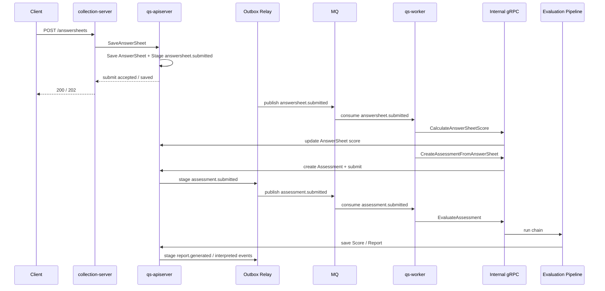
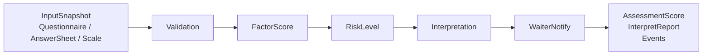

# 异步评估链路讲法

**本文回答**：对外介绍 qs-server 时，如何把“答卷提交之后的异步评估链路”讲清楚；如何串起 Event System、Outbox、Worker、Internal gRPC、Assessment 状态机、Evaluation Engine Pipeline、Report 生成和失败重试；如何在面试中说明这条链的可靠性、幂等边界和工程取舍。

---

## 1. 先给结论

> **异步评估链路的核心是：前台只同步完成答卷保存，后续通过 Outbox 发出 `answersheet.submitted`，由 worker 消费事件并通过 internal gRPC 回调 apiserver，创建 Assessment、执行 Evaluation Pipeline，最终生成分数、风险和报告。**

压缩成一句话：

```text
AnswerSheet saved
  -> answersheet.submitted
  -> worker
  -> internal gRPC
  -> Assessment
  -> Evaluation Pipeline
  -> Score / Report
```

最关键的讲法：

> **worker 不拥有评估业务，它只是异步驱动器；真正的状态机、计分、报告和 Outbox 仍然收口在 apiserver。**

---

## 2. 30 秒讲法

> **用户提交答卷后，系统不会在请求线程里同步生成报告。apiserver 会先把 AnswerSheet 和 `answersheet.submitted` 事件通过 Outbox 持久化下来，然后 Outbox relay 把事件发布到 MQ。qs-worker 消费这个事件后，通过 internal gRPC 回调 apiserver，先计算答卷分数，再创建 Assessment；如果 Assessment 关联了量表，就继续触发 Evaluation Pipeline。Pipeline 内部会完成输入校验、因子计分、风险判断、解读报告生成和等待者通知。这样提交链路保持短，评估链路可以异步、可重试、可观测。**

这段适合：

- 技术分享中讲主链路。
- 面试官问“异步评估怎么做？”
- 被问“为什么用了 MQ / Outbox / Worker？”

---

## 3. 1 分钟讲法

> **这条链路可以分成三段。**
>
> **第一段是同步事实落库。前台请求先进 collection-server，经限流、SubmitQueue、SubmitGuard 后通过 gRPC 调 apiserver。apiserver 在 Survey 边界里校验并保存 AnswerSheet，同时把 `answersheet.submitted` 事件 stage 到 Outbox。这里的目标是保证答卷事实不会丢。**
>
> **第二段是事件驱动。Outbox relay 把 `answersheet.submitted` 发布到 MQ，worker 消费后不直接写数据库，而是通过 InternalService 回调 apiserver。worker 第一跳会先计算答卷分，再调用 `CreateAssessmentFromAnswerSheet` 创建 Assessment。这样 Assessment 的状态机、唯一性和事务仍然在 apiserver 内部。**
>
> **第三段是真正评估。Assessment submitted 后，worker 再触发 `EvaluateAssessment`。apiserver 内部的 Evaluation Engine Pipeline 会按职责链执行：Validation、FactorScore、RiskLevel、Interpretation、WaiterNotify，最终保存 AssessmentScore 和 InterpretReport，并通过 outbox 发出后续事件。**

---

## 4. 3 分钟讲法

> **这条异步评估链路的设计目标，是把“用户提交答卷”与“系统生成报告”解耦。因为答卷提交必须快，报告生成却涉及量表规则、因子计分、风险判断、报告存储、通知和统计，不能全部卡在前台请求里。**
>
> **所以系统把链路拆成两个阶段。第一阶段是同步提交：collection-server 承接前台请求，做认证、限流、排队和幂等保护，然后调用 apiserver 保存 AnswerSheet。apiserver 保存答卷时，会把 AnswerSheet、幂等记录和 `answersheet.submitted` outbox 放进同一个持久化事务里。这样即使 MQ 暂时不可用，也不会出现答卷保存成功但事件丢失。**
>
> **第二阶段是异步评估：Outbox relay 把事件发到 MQ，worker 消费后通过 internal gRPC 回调 apiserver。worker 本身不直接操作业务数据库，也不拥有评估领域模型，它只是驱动器。真正的答卷计分、Assessment 创建、状态机流转、Pipeline 执行和报告保存都在 apiserver 内。**
>
> **这条链里有两个关键事件。`answersheet.submitted` 表示答卷已经可靠保存，是创建 Assessment 的起点；`assessment.submitted` 表示一次测评已经进入待评估状态，是执行 Evaluation Pipeline 的起点。Pipeline 再按 Validation、FactorScore、RiskLevel、Interpretation、WaiterNotify 分阶段推进。**
>
> **这套设计的收益是：提交链路短，评估链路可重试；事件出站有 Outbox，worker 消费有 Ack/Nack；状态机在 apiserver 里统一治理，统计和报告也可以从 Evaluation 的结果侧继续扩展。代价是链路更长，排障要跨 AnswerSheet、Outbox、MQ、worker、InternalService、Assessment 和 Report，所以必须配套观测、状态和 runbook。**

---

## 5. 异步评估主图



讲图时重点说：

```text
左边是提交，右边是评估。
中间用 Outbox 和 MQ 断开。
worker 只负责驱动，apiserver 仍是业务事实中心。
```

---

## 6. 一条链路，三个层次

这条链路可以按三个层次讲：

| 层次 | 关注点 | 对应实现 |
| ---- | ------ | -------- |
| 业务时序 | 提交答卷后，不同步等报告 | 同步 AnswerSheet，异步 Evaluation |
| 事件系统 | 业务事实如何可靠驱动后续动作 | Outbox + EventCatalog + MQ + Worker |
| 测评引擎 | 如何从输入快照生成评估结果 | Evaluation Pipeline |

这三个层次要一起讲，不能只讲“用了 MQ”。

---

## 7. 第一段：同步保存 AnswerSheet

第一段目标不是生成报告，而是固化业务事实：

```text
用户提交了这份答卷
```

同步阶段做：

1. collection-server 接收请求。
2. 身份与租户投影。
3. 限流。
4. SubmitQueue 削峰。
5. SubmitGuard 幂等保护。
6. gRPC 调 apiserver。
7. apiserver 校验问卷和答案。
8. 保存 AnswerSheet。
9. stage `answersheet.submitted` outbox。

### 7.1 这一段要讲清的点

> **答卷保存是同步事实边界，报告生成不是。**

如果面试官问“提交成功意味着什么”，回答：

> **提交成功只意味着 AnswerSheet 已被可靠保存，或者请求已被 collection 受理进入状态查询流程；不代表评估报告已经生成。**

---

## 8. 第二段：Outbox 发出 answersheet.submitted

AnswerSheet 保存后，不能直接在内存里 publish 事件。

原因：

```text
DB 保存成功
MQ publish 失败
```

会导致：

```text
答卷有了
评估永远不开始
```

所以使用 Outbox：

```text
AnswerSheet + idempotency + domain_event_outbox
```

同事务保存。

### 8.1 这一段要讲清的点

> **Outbox 解决的不是消费端重试，而是生产端 DB 与 MQ 双写一致性。**

面试官问“有 MQ 为什么还要 Outbox”，回答：

> **MQ 只能保证消息系统内部的投递，不保证业务数据库 commit 和 MQ publish 是原子操作。Outbox 把待发布事件和业务事实放在同一个持久化事务里，后续由 relay 重试发布。**

---

## 9. 第三段：worker 消费 answersheet.submitted

worker 收到 `answersheet.submitted` 后，不直接操作数据库，而是通过 internal gRPC 调 apiserver。

第一跳通常做两件事：

```text
CalculateAnswerSheetScore
CreateAssessmentFromAnswerSheet
```

### 9.1 为什么先算答卷分

答卷分属于 Survey / AnswerSheet 自身的结果，它可以作为后续 Evaluation 输入的一部分。

### 9.2 为什么要创建 Assessment

Assessment 表示：

```text
基于某份 AnswerSheet 和某套规则创建的一次测评实例
```

它是后续得分、报告、状态查询和 wait-report 的主键。

### 9.3 为什么 worker 不直接创建 Assessment

因为 Assessment 的状态机、唯一约束、事务和 Outbox 都在 apiserver 内。

正确模式：

```text
worker consume event
  -> internal gRPC
  -> apiserver application service
```

而不是：

```text
worker -> DB
```

---

## 10. 第四段：assessment.submitted 触发真正评估

创建 Assessment 后，如果它关联了量表，就进入待评估状态，并通过事件触发第二跳：

```text
assessment.submitted
```

worker 再消费这个事件，调用：

```text
EvaluateAssessment
```

### 10.1 为什么拆成两跳

不是所有 AnswerSheet 都一定能立即进入完整评估。

拆成两跳有几个好处：

| 好处 | 说明 |
| ---- | ---- |
| 建测评和评估执行解耦 | Assessment 创建成功后，评估可以单独失败/重试 |
| AssessmentID 明确 | 第二跳之后以 Assessment 为主键 |
| 状态更清楚 | created/submitted/interpreted/failed |
| 错误边界更清楚 | 建测评失败和评估失败可区分 |
| 扩展性更好 | 后续可插入人工审核、规则选择、任务关联 |

### 10.2 无量表怎么办

如果 Assessment 没有关联 Scale，不应强行跑 Evaluation Pipeline。

讲法：

> **没有量表不是系统错误，而是业务上没有评估规则，所以 worker 可以显式跳过。**

---

## 11. 第五段：Evaluation Pipeline

Evaluation Pipeline 是真正的测评引擎。

可以这样讲：

> **Pipeline 用职责链把复杂评估拆成几个稳定步骤：先校验上下文，再算因子分，再判断风险，再生成解读报告，最后通知等待报告的请求。**

### 11.1 Pipeline 主图



### 11.2 每一步怎么讲

| Step | 对外讲法 |
| ---- | -------- |
| Validation | 检查评估上下文是否完整，例如答卷、问卷、量表是否能构成有效输入 |
| FactorScore | 根据量表因子和答卷答案计算各因子得分 |
| RiskLevel | 根据分数匹配风险等级，保存结构化 AssessmentScore |
| Interpretation | 根据风险和规则生成 InterpretReport |
| WaiterNotify | 通知等待报告的请求，不阻塞主评估语义 |

### 11.3 Pipeline 的重点

不要讲成：

```text
一个函数里算完报告
```

要讲成：

```text
一条可拆解、可测试、可失败定位的职责链
```

---

## 12. InputSnapshot 怎么讲

Evaluation 不直接拥有 Survey 和 Scale 聚合，而是通过 InputResolver 获取评估输入快照：

```text
Questionnaire snapshot
AnswerSheet snapshot
MedicalScale snapshot
```

讲法：

> **Evaluation 读取 Survey 和 Scale 的事实，但不修改它们。它拿到的是输入快照，而不是把其它聚合嵌进自己的聚合里。**

为什么这样做：

- 避免跨聚合修改。
- 让 Evaluation pipeline 只依赖评估所需字段。
- 支持未来 read model / cache / snapshot table 优化。
- 失败时可以明确是哪个输入缺失。

---

## 13. AssessmentID 的讲法

AssessmentID 是第二跳之后的主线索。

可以这样讲：

> **AnswerSheetID 是提交事实的主键，AssessmentID 是评估过程和结果的主键。**

| ID | 语义 |
| -- | ---- |
| AnswerSheetID | 用户提交了哪份答卷 |
| AssessmentID | 系统基于这份答卷执行了哪次评估 |
| ReportID | 通常与 Assessment 关联，用于报告查询 |
| Score | 以 Assessment 为主查询结构化得分 |

### 13.1 为什么重要

因为前台后续查的是：

- Assessment 状态。
- AssessmentScore。
- InterpretReport。
- wait-report。
- trend。

这些都不应继续围绕 AnswerSheet 做主键。

---

## 14. 幂等怎么讲

不要说：

```text
MQ 保证不重复
```

这不准确。

更准确：

> **这条链的幂等是分层做的：collection 层有 SubmitGuard，AnswerSheet durable submit 有 idempotency key，worker 处理同一答卷有 Redis duplicate suppression，apiserver 创建 Assessment 时有预查和唯一约束，Evaluation 状态机也限制只有 submitted 状态才能执行。**

### 14.1 幂等分层表

| 层 | 幂等/重复抑制 |
| -- | ------------- |
| collection | SubmitGuard done marker + in-flight lock |
| AnswerSheet save | idempotency key + durable submit |
| worker 第一跳 | answersheet processing lock |
| apiserver 建 Assessment | answer_sheet_id 预查 + 唯一约束 |
| Evaluation | Assessment 状态机 |
| Outbox / MQ | 至少一次出站/投递，consumer 必须幂等 |

### 14.2 面试回答

> **我不会把这条链说成 exactly-once。更准确的是 producer-side 用 Outbox 保证事件可靠出站，consumer-side 用锁、唯一约束和状态机实现业务幂等。**

---

## 15. 失败怎么讲

异步链路一定会失败，关键是能否解释和恢复。

### 15.1 失败分类

| 失败点 | 表现 | 排查方向 |
| ------ | ---- | -------- |
| AnswerSheet 保存失败 | 提交失败 | Survey / Mongo / validation |
| Outbox pending 堆积 | 事件没出站 | relay / MQ / event catalog |
| worker Nack | 消费失败 | handler / gRPC / downstream |
| CalculateAnswerSheetScore 失败 | 第一跳失败 | Survey scoring |
| CreateAssessmentFromAnswerSheet 失败 | Assessment 未创建 | Evaluation submission |
| EvaluateAssessment 失败 | Assessment failed | Pipeline / input snapshot |
| Report 保存失败 | 无报告 | Mongo report store |
| WaiterNotify 失败 | 前台等待未及时通知 | waiter registry / logs |
| Statistics 未更新 | 读侧滞后 | projector / sync / cache |

### 15.2 失败讲法

> **异步链路不追求“永远不失败”，而是追求失败可定位、可重试、不会污染提交事实。**

---

## 16. 重试怎么讲

重试要谨慎讲，不要承诺代码里没有证据的固定次数。

推荐说法：

> **worker 失败会走 MQ 的 Nack / retry 语义，Outbox 发布失败会 MarkFailed 并设置 nextAttemptAt 等待后续 relay 重试；至于具体重试次数和退避策略，要以当前 MQ 与 worker 配置为准，不能口头写死。**

### 16.1 哪些可以确定讲

| 能力 | 是否可讲 |
| ---- | -------- |
| Outbox publish failed 会 MarkFailed | 可以 |
| Outbox 设置 nextAttemptAt | 可以 |
| worker error 后进入 Nack 路径 | 可以 |
| Evaluation 失败会进入 failed 状态 | 可以 |
| 固定重试 3 次 | 不要，除非有当前代码证据 |
| 所有失败都会自动修复 | 不要 |

---

## 17. 可靠性怎么讲

最推荐的表达：

> **这条链不是靠单点技术保证可靠，而是通过“事实落库 + Outbox + worker Ack/Nack + 状态机 + 幂等约束 + 观测治理”组合起来保证可恢复。**

### 17.1 可靠性分层

| 层 | 解决什么 |
| -- | -------- |
| Durable submit | 答卷事实不丢 |
| Outbox | DB 与 MQ 双写一致性 |
| MQ | 进程间异步投递 |
| Worker | 消费与驱动 |
| Internal gRPC | 回到主业务中心执行 |
| State machine | 防止非法重复执行 |
| Unique constraint | 防止重复 Assessment |
| Observability | 排查 backlog / failed |

---

## 18. 为什么不是同步评估

简短回答：

> **因为评估链路包含计分、风险、报告、事件、统计和通知，慢且失败面大。如果放在提交请求里，会拖慢前台体验，也会让一次提交承担过多副作用。**

详细回答：

| 同步评估问题 | 后果 |
| ------------ | ---- |
| 延迟高 | 用户提交等待 |
| 失败面大 | 报告失败导致提交失败 |
| 无法削峰 | 高峰时主链路被拖垮 |
| 重试复杂 | 部分副作用已发生 |
| 模块耦合 | Survey / Scale / Evaluation 混杂 |

---

## 19. 为什么不是 worker 直接跑所有逻辑

回答：

> **worker 只做异步驱动，不直接拥有业务模型。因为 Assessment 状态机、Score/Report 持久化、Outbox 和事务都在 apiserver 内。如果 worker 直接写数据库，就会把 Evaluation 业务逻辑复制一份，状态和事务边界会分裂。**

---

## 20. 为什么不是只用 MQ，不用 Outbox

回答：

> **MQ 只解决消息传输，不解决“业务数据库保存成功但消息没发出去”的双写问题。Outbox 要解决的是 producer-side reliability：业务事实和待发布事件同事务保存，再由 relay 发布到 MQ。**

---

## 21. 面试常见追问

### 21.1 这条链路是最终一致吗？

回答：

> **是。AnswerSheet 保存和 Report 生成是最终一致。提交成功后报告可能还没生成，前端通过 submit-status 和 wait-report 感知状态。系统用 Outbox 和 worker 保证后续链路可推进，而不是让提交请求同步等报告。**

---

### 21.2 事件会不会重复消费？

回答：

> **可能，所以不能说 exactly-once。系统通过多层幂等降低重复副作用：worker 对同一 AnswerSheet 有处理锁，apiserver 创建 Assessment 前按 answer_sheet_id 预查，并有唯一约束兜底，Evaluation 也有状态机限制。**

---

### 21.3 如果 worker 挂了怎么办？

回答：

> **AnswerSheet 已经保存，事件在 Outbox/MQ 里。worker 恢复后可以继续消费；如果事件还没出站，Outbox relay 会继续发布；如果消费失败，会走 Nack / retry 语义。关键是提交事实不会因为 worker 挂了而丢。**

---

### 21.4 如果 MQ 挂了怎么办？

回答：

> **答卷保存时事件先写 Outbox，所以 MQ 挂了不会导致事件直接丢。MQ 恢复后 relay 可以继续把 pending/failed 的 outbox 事件发布出去。代价是报告生成延迟。**

---

### 21.5 如果 Evaluation Pipeline 失败怎么办？

回答：

> **提交事实不回滚。Assessment 会进入失败或错误状态，后续可以根据失败原因做重试或人工排查。这个失败属于评估阶段，不应该反向影响已经保存的 AnswerSheet。**

---

### 21.6 这条链路怎么观测？

回答：

> **从几个点看：collection 的 submit-status，apiserver 的 outbox pending/failed，MQ/worker backlog，worker handler logs，InternalService 调用错误，Assessment 状态，Report 是否生成，最后还有 resilience/cache/event 的 metrics 和 governance status。**

---

## 22. 不要这样讲

### 22.1 不要说“MQ 保证可靠”

不准确。

应该说：

```text
Outbox 保证业务事实与待发事件同事务；
MQ 负责进程间投递；
worker 和业务幂等保证消费端副作用可控。
```

### 22.2 不要说“worker 负责评估领域”

不准确。

应该说：

```text
worker 负责异步驱动；
apiserver 内的 Evaluation 模块负责评估领域逻辑。
```

### 22.3 不要说“提交成功就有报告”

不准确。

应该说：

```text
提交成功表示 AnswerSheet 已保存或请求已受理；
报告生成是异步结果。
```

### 22.4 不要说“这条链 exactly-once”

不准确。

应该说：

```text
至少一次投递 + 业务幂等。
```

### 22.5 不要承诺固定重试次数

除非当前代码和配置明确，否则不要说：

```text
失败重试 3 次
```

推荐说：

```text
失败进入 Nack / MarkFailed / nextAttemptAt 机制，具体次数和退避以 MQ 和配置为准。
```

---

## 23. 讲图脚本

可以这样边画边讲：

```text
这张图从左到右看。

第一段是前台提交。
用户提交答卷后，collection-server 先做入口保护，然后调用 apiserver 保存 AnswerSheet。
这里我们只承诺答卷事实保存，不在请求里生成报告。

第二段是事件出站。
apiserver 保存 AnswerSheet 时，会把 answersheet.submitted 写入 Outbox。
Outbox relay 再把事件发到 MQ，这样避免 DB 保存成功但 MQ publish 失败导致事件丢失。

第三段是 worker 驱动。
worker 消费 answersheet.submitted 后，不直接写数据库，而是通过 internal gRPC 回到 apiserver。
它先计算答卷分，再创建 Assessment。

第四段是评估引擎。
Assessment submitted 后，worker 再触发 EvaluateAssessment。
apiserver 的 Evaluation Pipeline 按 Validation、FactorScore、RiskLevel、Interpretation、WaiterNotify 生成分数和报告。

所以这条链的核心是：
同步保存事实，异步计算结果；
worker 驱动流程，apiserver 承载领域；
Outbox 解决可靠出站，状态机和幂等解决重复消费。
```

---

## 24. 最终背诵版

> **异步评估链路可以理解为“同步保存答卷事实，异步推进测评结果”。前台提交先经过 collection-server 的限流、SubmitQueue 和 SubmitGuard，然后通过 gRPC 调 apiserver 保存 AnswerSheet。apiserver 保存答卷时，会把 AnswerSheet 和 `answersheet.submitted` 事件通过 Outbox 同事务落库，避免 DB 与 MQ 双写不一致。**
>
> **Outbox relay 把事件发布到 MQ 后，qs-worker 消费事件并通过 internal gRPC 回调 apiserver。第一跳会先计算答卷分，再创建 Assessment；第二跳通过 `assessment.submitted` 触发 `EvaluateAssessment`，进入 Evaluation Pipeline。Pipeline 负责校验输入、计算因子分、判断风险等级、生成解读报告和通知等待者。**
>
> **这套设计的关键是：worker 只是异步驱动器，真正的状态机、分数、报告和 Outbox 仍然在 apiserver；事件投递不是 exactly-once，而是通过 Outbox、Ack/Nack、锁、唯一约束和状态机共同实现可靠推进和业务幂等。**

---

## 25. 证据回链

| 判断 | 证据 |
| ---- | ---- |
| 异步链路可以压缩为 answersheet.submitted -> worker -> internal gRPC -> assessment.submitted -> EvaluateAssessment -> pipeline | 旧版 `docs/06-宣讲/04-主链路 2：异步评估流水线.md` |
| worker 是订阅、分发和回调，业务状态机仍在 apiserver | 旧版 `docs/06-宣讲/04-主链路 2：异步评估流水线.md` |
| 同步提交但异步评估的专题分析 | `docs/05-专题分析/02-为什么同步提交但异步评估.md` |
| Outbox 的专题分析 | `docs/05-专题分析/04-为什么使用Outbox.md` |
| Evaluation 模块和 Pipeline | `docs/02-业务模块/evaluation/02-EnginePipeline.md` |
