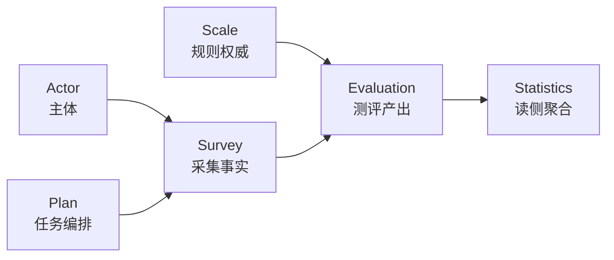

# DDD 领域地图与模块协作

**本文回答**：这篇文档负责把 `qs-server` 的领域拆分讲成清楚的边界图，重点解释为什么 `survey / scale / evaluation` 必须分离、支撑子域放在哪里、跨域靠什么协作，以及在叙述时该怎样把聚合、不变量和版本口径讲成同一套话。

## 30 秒讲法

`qs-server` 的核心不是把所有逻辑塞进一个“问卷服务”，而是把**问卷与答卷**、**量表规则**、**测评生命周期与结果**拆成三个核心边界：`survey`、`scale`、`evaluation`。这样做的目的，是让“采集数据”“定义规则”“产出结果”三类变化分开演进，再通过事件和引用值对象协作。

## 重点速查

如果只看一屏，先看下面这张表：

| 维度 | 结论 |
| ---- | ---- |
| 三个核心上下文 | `survey` 管采集事实，`scale` 管规则权威，`evaluation` 管测评状态机与结果 |
| 支撑子域 | `validation` 和 `calculation` 提供复用能力，但不拥有主业务终态 |
| 跨域协作 | 主要靠引用值对象、领域事件和少量 internal gRPC，不靠一个大聚合硬塞一切 |
| 最重要的不变量 | 答卷不等于测评，量表不接管测评生命周期，测评结果不反向定义问卷或量表结构 |
| 版本口径 | 问卷版本是最硬的跨域锚点；量表不能在叙述里擅自夸大成“完整多版本治理已闭环” |
| 最适合强调的点 | 这不是为了“DDD 而 DDD”，而是为了把采集、规则、结果三类变化源拆开演进 |

## 领域地图主图

## 讲解时先回答的问题

DDD 领域地图这一页最容易讲成“我们用了 DDD”。更有效的讲法是先回答“为什么需要这些边界”：

| 业务问题 | 对应边界 |
| -------- | -------- |
| 问卷题型和答卷事实会频繁变化 | Survey |
| 计分、因子、风险规则需要单独审计 | Scale |
| 测评状态、报告和失败补偿需要状态机 | Evaluation |
| 计划任务是长期编排，不是一次测评 | Plan |
| 业务参与者不是 IAM 用户表 | Actor |
| 查询和统计口径不同于写模型 | Statistics |

这张地图的重点不是“模块数量”，而是每个模块对应一个变化原因。

## 领域地图

| 上下文 | 自己负责什么 | 不负责什么 | 与其他上下文的关系 |
| ------ | ------------ | ---------- | ------------------ |
| `survey` | `Questionnaire`、`AnswerSheet`、答卷提交与基础校验 | 量表规则、测评状态机、报告生成 | 提交后发布 `answersheet.submitted`，给 `evaluation` 提供答卷与问卷版本事实 |
| `scale` | `MedicalScale`、因子、阈值、计分/解读规则元数据 | 用户提交流程、测评状态机 | 被 `evaluation` 消费，但不接管测评流程 |
| `evaluation` | `Assessment`、`AssessmentScore`、`InterpretReport`、状态机、评估引擎、报告查询 | 问卷编辑、题目结构权威、量表内容编辑 | 消费 `survey` 与 `scale` 的事实，产出测评结果与报告 |
| `validation` | 答案与规则校验能力 | 业务聚合生命周期 | 作为支撑子域，被 `survey` / `evaluation` 调用 |
| `calculation` | 计分、公式和计算值对象 | 聚合状态机 | 作为支撑子域，被 `survey` / `evaluation` 使用 |

核心证据见 [../02-业务模块/01-survey.md](../02-业务模块/01-survey.md)、[../02-业务模块/02-scale.md](../02-业务模块/02-scale.md)、[../02-业务模块/03-evaluation.md](../02-业务模块/03-evaluation.md)。

## 模式地图

| 模式 | 典型模块 | 宣讲重点 |
| ---- | -------- | -------- |
| 状态机 | Questionnaire、Assessment、Task、Pending | 防止状态字段被任意改写 |
| 策略模式 | Survey validation、Scale scoring、Evaluation interpretation | 新能力扩展点稳定，不污染主流程 |
| 职责链 | Evaluation Engine Pipeline | 把复杂评估拆成可测试阶段 |
| Builder | Report | 报告组装与评估状态分离 |
| 防腐层 | Actor/IAM、Worker/Internal gRPC | 外部模型不直接污染领域模型 |
| Read Model | Statistics、Behavior Projection | 查询口径与写模型分离 |

讲这些模式时要始终回到具体代码和业务问题，不要把模式当成标签。

## 聚合、不变量与边界

| 聚合 / 核心对象 | 应该记住的不变量 | 为什么要放在这个上下文 |
| ---------------- | ---------------- | ---------------------- |
| `Questionnaire` | 问卷版本、题目集合、发布状态 | 问卷结构变化属于采集域，不应混进测评结果域 |
| `AnswerSheet` | 提交时刻的问卷引用、填写人、答案集合 | 答卷是一次采集结果，不等于一次测评结果 |
| `MedicalScale` | 因子、阈值、风险规则、适用问卷关联 | 量表是规则权威源，不应被答卷写模型持有 |
| `Assessment` | `pending -> submitted -> interpreted / failed` 状态机，跨域引用与业务来源 | 测评是一次评估行为，生命周期独立于答卷存储 |
| `AssessmentScore` | 结构化得分与趋势分析入口 | 更适合 SQL 查询与聚合 |
| `InterpretReport` | 维度解读、建议和报告视图 | 更适合文档型存储与灵活查询 |

## 跨域协作规则

1. `survey` 不内嵌 `scale` 规则。答卷提交后只发布事件，不在提交流程里硬塞整条评估流水线。
2. `evaluation` 不直接拥有问卷和量表的权威数据，而是持有 `QuestionnaireRef`、`AnswerSheetRef`、`MedicalScaleRef` 之类的引用值对象。证据见 [assessment.go](../../internal/apiserver/domain/evaluation/assessment/assessment.go)。
3. `scale` 为评估提供规则，但不接管测评生命周期；真正的状态迁移和事件发布在 `Assessment` 聚合内。证据见 [assessment.go](../../internal/apiserver/domain/evaluation/assessment/assessment.go)。
4. 支撑子域 `validation` / `calculation` 提供能力，不定义主业务流程。

## 版本与引用口径

- 问卷版本是最硬的跨域锚点之一。`AnswerSheetSubmittedData` 会把 `questionnaire_code` 和 `questionnaire_version` 一起带进异步链路。证据见 [events.go](../../internal/apiserver/domain/survey/answersheet/events.go)。
- `engine.Service.Evaluate` 在评估时不是盲目读“最新问卷”，而是先从答卷取出提交时记录的问卷信息，再按 `code + version` 加载问卷。证据见 [service.go](../../internal/apiserver/application/evaluation/engine/service.go)。
- `Assessment` 同时持有 `QuestionnaireRef`、`AnswerSheetRef` 和可选 `MedicalScaleRef`，说明测评域关注的是**引用和值对象快照**，而不是直接嵌入其他聚合。证据见 [assessment.go](../../internal/apiserver/domain/evaluation/assessment/assessment.go)。
- 量表侧当前读取路径以 `MedicalScaleRef` 和 `scale_code` 为主，宣讲里不应自行扩写成“量表完整多版本治理已经闭环”，除非你再拿出现有 scale 文档与代码逐项证明。证据见 [../02-业务模块/02-scale.md](../02-业务模块/02-scale.md)。

## 为什么不是一个大模块

- 如果把问卷、量表和测评揉成一个模块，答卷提交、规则演进和报告查询会共用一套对象，模型会极快膨胀。
- 把三者拆开后，`survey` 能专注采集，`scale` 能专注规则权威，`evaluation` 能专注状态机和结果。
- 这种拆分也解释了为什么 `AssessmentScore` 与 `InterpretReport` 可以用不同存储，而不需要让“测评表”承载一切。

## 代价要主动说清楚

| 代价 | 为什么可接受 |
| ---- | ------------ |
| 跨模块引用增加 | 用引用值对象、事件和 application service 控制边界 |
| 读者理解门槛提高 | 通过 business deep docs 和专题文档降低认知成本 |
| 异步最终一致 | 用 outbox、pending、reconcile 和观测指标控制风险 |
| 测试范围变大 | 每个 truth layer 都有 contract tests 和 Verify 命令 |

## 宣讲时建议强调

- 这不是为了“DDD 而 DDD”，而是因为三个变化源不同：题目会改、规则会改、测评结果会长出来。
- 当前架构不是微服务拆域，而是**模块化单体 + 多进程协作**；DDD 主要用来稳住领域边界，不是为了服务数量。
- 如果被追问“为什么支撑子域单列”，答案是：校验和计算被多个主域复用，但它们不拥有业务终态。

## 回链入口

- 业务模型专题：[../05-专题分析/01-测评业务模型：survey、scale、evaluation 为什么分离.md](../05-专题分析/01-测评业务模型：survey、scale、evaluation%20为什么分离.md)
- survey 模块：[../02-业务模块/01-survey.md](../02-业务模块/01-survey.md)
- scale 模块：[../02-业务模块/02-scale.md](../02-业务模块/02-scale.md)
- evaluation 模块：[../02-业务模块/03-evaluation.md](../02-业务模块/03-evaluation.md)
