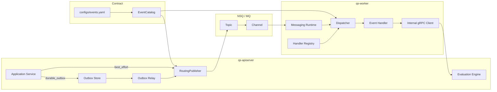
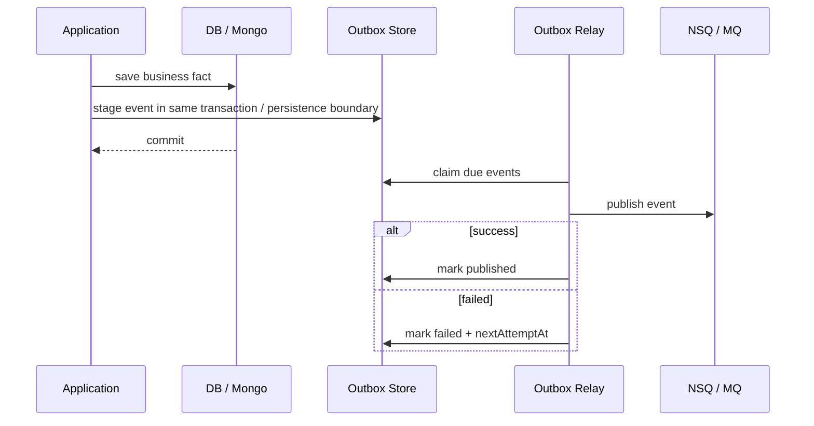

# 05-事件与 Outbox 讲法

**本文回答**：对外介绍 qs-server 时，如何把 EventCatalog、Outbox、RoutingPublisher、NSQ/MQ、Outbox Relay、Worker Ack/Nack 和业务幂等串成一套清晰讲法；为什么“接入 MQ”不等于“事件可靠”；为什么新版事件语义要从 `assessment.submitted / assessment.interpreted` 升级为 `assessment.created / assessment.completed / interpretation.completed / report.generated`；如何说明事件系统与 Evaluation Engine、Interpretation Provider、Statistics ReadModel、Redis cache governance 的边界。

---

## 30 秒结论

qs-server 的事件系统不是简单地“把消息发到 NSQ”。

它分成五层：

```text
EventCatalog 管契约
RoutingPublisher 管路由发布
Outbox 管可靠出站
NSQ/MQ 管消息传输
Worker + 业务状态机管消费推进与幂等
```

最关键的判断：

> **MQ 解决“消息如何从一个进程投递到另一个进程”，Outbox 解决“业务事实保存成功后，对应事件不能丢”。这两个问题不是一回事。**

新版主事件链路统一使用：

```text
answersheet.submitted
  -> assessment.created
  -> assessment.completed
  -> interpretation.completed / interpretation.failed
  -> report.generated
```

不再继续使用旧语义：

```text
assessment.submitted
assessment.interpreted
```

一句话概括：

> **事件系统负责表达阶段事实，Outbox 负责可靠出站，Worker 负责异步驱动，Evaluation 负责业务状态机，Provider 负责具体解释模型。**

---

## 1. 为什么这一篇必须更新

旧版讲法仍然把事件系统和旧 Evaluation Pipeline 绑定在一起：

```text
answersheet.submitted
  -> CalculateAnswerSheetScore
  -> CreateAssessmentFromAnswerSheet
  -> assessment.submitted
  -> EvaluateAssessment
  -> Validation / FactorScore / RiskLevel / Interpretation
  -> assessment.interpreted / report.generated
```

这套表达的问题是：

```text
assessment.submitted 语义不清楚；
assessment.interpreted 把 Provider 执行和报告生成混在一起；
CalculateAnswerSheetScore 仍然是 Scale 中心表达；
Validation / FactorScore / RiskLevel 是医学量表内部语义，不适合 MBTI / BigFive；
worker 看起来像在直接执行评估算法。
```

新版表达必须升级为：

```text
answersheet.submitted
  -> assessment.created
  -> assessment.completed
  -> interpretation.completed / interpretation.failed
  -> report.generated
```

同时要强调：

```text
worker 只消费事件并回调 apiserver；
apiserver 内的 Evaluation Engine 编排状态机；
Provider 执行具体解释模型；
report.generated 只在 InterpretReport 可靠保存后产生。
```

---

## 2. 10 秒讲法

> **qs-server 的事件系统分成契约、出站、传输、消费和幂等五层：EventCatalog 定义事件，Outbox 保证关键事件可靠出站，MQ 负责投递，Worker 消费后回调 apiserver，业务状态机保证重复消费不产生重复副作用。**

---

## 3. 30 秒讲法

> **qs-server 的异步测评执行链路以事件系统为主干。业务模块产生领域事件，例如 `answersheet.submitted`、`assessment.created`、`assessment.completed`、`interpretation.completed`、`report.generated`。EventCatalog 负责把 event type 映射到 topic、delivery class 和 handler；关键事件不会直接 publish，而是先和业务事实一起写入 Outbox，再由 relay 发布到 NSQ/MQ；MQ 负责投递给 worker；worker 根据 event type 分发到 handler，处理成功 Ack，失败 Nack；handler 不直接绕过 apiserver 写库，而是通过 internal gRPC 回调 apiserver 推进 Assessment、Interpretation 和 Report。**

适合用于：

- 技术分享讲事件架构。
- 面试官问“为什么用 MQ？”
- 面试官问“MQ 如何保证可靠？”
- 面试官问“Outbox 解决什么问题？”
- 面试官问“为什么事件会重复消费？”

---

## 4. 1 分钟讲法

> **我在 qs-server 里没有把事件系统简单理解为 MQ，而是拆成契约、发布、可靠出站、传输、消费和业务幂等几层。**
>
> **第一层是 EventCatalog，事件类型、topic、delivery class、aggregate、domain、handler 都集中在 `configs/events.yaml` 里定义。发布端和消费端围绕同一份事件契约协作。**
>
> **第二层是发布层，apiserver 里的 RoutingPublisher 根据 event type 找 topic，并按当前 publish mode 走 mq、logging 或 nop。**
>
> **第三层是 Outbox。对于 `answersheet.submitted`、`assessment.created`、`assessment.completed`、`interpretation.completed`、`interpretation.failed`、`report.generated` 这类主链路关键事件，不能直接 publish MQ，而是要和业务事实同持久化边界写入 outbox，再由 relay 异步发布。**
>
> **第四层是 NSQ/MQ，它负责 topic/channel 级别的进程间投递。**
>
> **第五层是 worker 消费。worker 从 message envelope 解析 event_type，通过 dispatcher 找 handler；handler 成功就 Ack，失败就 Nack，无法解析的 poison message Ack 并记录观测，避免无限重投。**
>
> **最后一层是业务幂等。因为 MQ 不是 exactly-once，consumer 必须通过锁、唯一约束、状态机和 checkpoint 防止重复副作用。**

---

## 5. 3 分钟讲法

> **在 qs-server 中，事件系统是异步测评执行链路的主干。用户提交答卷后，apiserver 保存 AnswerSheet，同时 stage `answersheet.submitted` 事件。这个事件后续会驱动 worker 创建 Assessment，再通过 `assessment.created`、`assessment.completed` 推进 Evaluation Engine，最后通过 `interpretation.completed` 触发报告生成，并在报告可靠保存后产生 `report.generated`。**
>
> **这里有一个关键问题：很多人说“用了 MQ，所以异步可靠”，这不准确。MQ 只负责消息传输，不负责业务数据库和 MQ publish 之间的一致性。比如 AnswerSheet 已经保存成功，但进程在 publish MQ 前崩溃，MQ 根本不知道这条事件存在。**
>
> **所以关键事件要走 Outbox：业务事实和待发布事件在同一个持久化边界里写入。比如答卷保存时，AnswerSheet 和 `answersheet.submitted` outbox 一起落库。事务或持久化边界成功后，即使 MQ 暂时不可用，事件也在 outbox 里；relay 会 claim due events，发布成功就 mark published，失败就 mark failed 并设置下一次重试时间。**
>
> **MQ 作为消息传输层，把事件发到 worker。worker 不是业务事实中心，它消费事件后通过 internal gRPC 回调 apiserver。apiserver 内部的 application service / Evaluation Engine 才负责状态机、Provider 调用、EvaluationResult 保存、InterpretReport 保存和新的 Outbox event staging。**
>
> **所以我对事件可靠性的理解不是 exactly-once，而是：producer 端用 Outbox 保证可靠出站，MQ 负责至少一次投递，consumer 端用锁、唯一约束、checkpoint 和状态机做业务幂等。**

---

## 6. 事件系统主图



讲图顺序：

```text
先讲契约：configs/events.yaml / EventCatalog。
再讲出站：best_effort / durable_outbox。
再讲传输：NSQ topic/channel。
再讲消费：worker dispatcher / handler。
最后讲业务推进：handler 通过 internal gRPC 回到 apiserver，由 Evaluation Engine 推进状态机。
```

---

## 7. 新主事件链路

主链路使用这些事件：

```text
answersheet.submitted
  -> assessment.created
  -> assessment.completed
  -> interpretation.completed / interpretation.failed
  -> report.generated
```

### 7.1 `answersheet.submitted`

语义：

```text
AnswerSheet 事实已可靠保存。
```

典型后续：

```text
CreateAssessmentFromAnswerSheet
```

---

### 7.2 `assessment.created`

语义：

```text
系统已经基于 AnswerSheet 和 ModelRef 创建了一次 Assessment。
```

典型后续：

```text
CompleteAssessment
```

---

### 7.3 `assessment.completed`

语义：

```text
Evaluation 层的测评执行阶段已完成，可以进入具体解释模型执行或下一阶段处理。
```

注意：

```text
assessment.completed 不等于报告已生成。
```

---

### 7.4 `interpretation.completed`

语义：

```text
具体 Interpretation Provider 已完成解释，并产生 EvaluationResult。
```

典型后续：

```text
GenerateReportFromInterpretation
```

---

### 7.5 `interpretation.failed`

语义：

```text
具体 Provider 执行失败。
```

典型原因：

```text
provider_not_found
context_load_failed
rule_invalid
questionnaire_mismatch
evaluate_failed
```

---

### 7.6 `report.generated`

语义：

```text
InterpretReport 已可靠保存。
```

注意：

```text
interpretation.completed 不等于 report.generated。
```

---

## 8. 废弃旧事件语义

不再推荐这样讲：

```text
assessment.submitted
assessment.interpreted
```

原因：

| 旧事件 | 问题 |
| ------ | ---- |
| `assessment.submitted` | 不清楚是 Assessment 已创建、待执行，还是已提交到评估队列 |
| `assessment.interpreted` | 不清楚是 Provider 执行完成、报告生成完成，还是解释文案生成完成 |

新版事件更清楚：

| 新事件 | 更准确表达 |
| ------ | ---------- |
| `assessment.created` | Assessment 已创建 |
| `assessment.completed` | Evaluation 执行阶段完成 |
| `interpretation.completed` | Provider 解释完成 |
| `interpretation.failed` | Provider 解释失败 |
| `report.generated` | 报告事实已保存 |

---

## 9. 规则变化事件 vs 一次执行事件

事件要区分两类。

### 9.1 一次执行事件

表示某次 Assessment 的生命周期变化：

```text
answersheet.submitted
assessment.created
assessment.completed
interpretation.completed
interpretation.failed
report.generated
```

这些通常与业务事实强相关，适合 durable_outbox。

---

### 9.2 规则变化事件

表示模型规则或目录变化：

```text
report.changed
assessment_model.changed
mbti-model.published
mbti-model.archived
```

这些通常用于：

- 缓存失效。
- StaticList rebuild。
- Context cache warmup。
- 读模型刷新。
- Governance status 更新。

规则变化事件不应该默认触发历史 Assessment 重算。

历史重算必须显式建模为：

```text
ReEvaluationJob
RepairJob
BackfillJob
```

---

## 10. 为什么不是“用了 MQ 就够了”

### 10.1 MQ 解决什么

MQ 解决的是：

```text
一个进程如何把消息异步投递给另一个进程
```

它擅长：

- topic/channel。
- 异步解耦。
- worker 消费。
- 失败重试。
- 消费并发。
- 削峰填谷。

### 10.2 MQ 不解决什么

MQ 不解决：

```text
业务数据库 commit 和 MQ publish 是否原子
```

典型问题：

```text
AnswerSheet 保存成功
进程还没 publish MQ 就崩溃
```

这时：

- 数据库里有答卷。
- MQ 里没有消息。
- worker 不会处理。
- Assessment 永远不创建。
- Report 永远不生成。

所以需要 Outbox。

### 10.3 标准回答

面试官问“用了 NSQ 后为什么还要 Outbox？”

回答：

> **NSQ/MQ 负责消息投递，但不负责数据库和消息发布之间的原子性。Outbox 解决的是 producer-side reliability：业务事实和待发布事件同事务或同持久化边界保存，后续 relay 再发布到 MQ。这样即使 MQ 暂时不可用或进程崩溃，事件也不会因为 publish 失败而丢失。**

---

## 11. EventCatalog 怎么讲

EventCatalog 是事件系统的契约层。

它来自：

```text
configs/events.yaml
```

主要定义：

- topic。
- event type。
- delivery class。
- aggregate。
- domain。
- handler。

### 11.1 对外讲法

> **我没有把 topic、event type 和 handler 散落在代码里，而是用 EventCatalog 集中定义事件契约。发布端根据 event type 路由 topic，worker 启动时也会校验 events.yaml 中的 handler 是否真的注册。**

### 11.2 它解决什么

| 问题 | EventCatalog 解决方式 |
| ---- | --------------------- |
| event type 到 topic 散落 | YAML 统一定义 |
| 发布端和消费端认知不一致 | 共享同一 catalog |
| 新增事件忘注册 handler | worker dispatcher 初始化校验 |
| 事件可靠性等级不清 | delivery class 显式标注 |
| 文档和代码漂移 | 可以通过 docs/test 校验降低风险 |

### 11.3 不能讲过头

不要说：

```text
EventCatalog 保证事件不丢
```

它只保证契约集中，不保证可靠性。

可靠性来自：

```text
Outbox + Relay + MQ + Consumer Idempotency
```

---

## 12. Delivery class 怎么讲

事件不是一视同仁。

qs-server 可以按 delivery class 分为：

```text
best_effort
durable_outbox
```

### 12.1 best_effort

适合：

- 缓存刷新。
- 轻量通知。
- 模型列表刷新。
- 规则变化后的 warmup 触发。
- 可以容忍失败的副作用。

讲法：

> **best_effort 事件即使发布失败，也不应该回滚主业务状态。它适合轻量副作用和治理类通知。**

例子：

```text
questionnaire.changed
assessment_model.changed
report.changed
mbti-model.published
```

### 12.2 durable_outbox

适合：

- 主链路关键事件。
- 测评执行推进事件。
- 报告生成事件。
- 失败补偿事件。
- 行为投影事件。

讲法：

> **durable_outbox 事件必须和业务事实同持久化边界 stage，因为它们驱动后续关键流程。**

例子：

```text
answersheet.submitted
assessment.created
assessment.completed
interpretation.completed
interpretation.failed
interpretation.report.generated
```

### 12.3 这层设计的价值

> **事件系统不是所有事件都最强一致，而是按业务重要性分等级。**

---

## 13. RoutingPublisher 怎么讲

RoutingPublisher 的职责：

```text
给定一个 domain event
根据 event type 查 topic
按当前 publish mode 发布
```

### 13.1 Publish mode

| mode | 说明 |
| ---- | ---- |
| mq | 发到 MQ |
| logging | 只记录日志 |
| nop | 不发消息 |

### 13.2 对外讲法

> **RoutingPublisher 让业务模块不关心 NSQ topic 名称。业务模块只产生领域事件，Publisher 根据 EventCatalog 路由。开发和测试环境可以切到 logging/nop，生产使用 MQ。**

### 13.3 注意边界

RoutingPublisher 只负责发布，不负责决定事件是否必须走 Outbox。

Outbox relay 最终也会调用 RoutingPublisher。

所以不能简单在 RoutingPublisher 里禁止 durable event 发布，否则 relay 也发不出去。

---

## 14. Outbox 怎么讲

Outbox 是 producer-side reliability。

### 14.1 Outbox 流程



### 14.2 Outbox 状态

```text
pending
publishing
published
failed
```

讲法：

> **Outbox 让事件有状态：待发布、发布中、已发布、失败待重试。这样异步链路不再是黑盒。**

### 14.3 MySQL / Mongo Outbox

| Outbox | 用途 |
| ------ | ---- |
| Mongo Outbox | AnswerSheet、Report 等 Mongo 持久化边界 |
| MySQL Outbox | Assessment、Evaluation、Interpretation 等 MySQL 状态边界 |

讲法：

> **Outbox 跟着业务事实的存储边界走。AnswerSheet 是 Mongo 文档，所以它的 submitted 事件走 Mongo Outbox；Assessment / Evaluation 状态更多落在 MySQL，所以生命周期事件走 MySQL Outbox；Report 如果是文档事实，也可以走 Report / Mongo Outbox。**

---

## 15. NSQ / MQ 怎么讲

NSQ / MQ 是消息传输层。

### 15.1 为什么选择 NSQ

对外可以这样说：

> **在当前项目阶段，NSQ 的优势是简单、轻量、部署成本低，适合 Go 后端里做 topic/channel 的异步解耦。我们用它承接 Outbox relay 发布出来的事件，再由 worker 订阅处理。**

### 15.2 它在链路中的位置

```text
Outbox Relay / RoutingPublisher
  -> NSQ topic
  -> worker channel
```

它不参与：

- 业务事务。
- AnswerSheet 保存。
- Assessment 状态机。
- Provider 执行。
- Report 保存。
- 权限判断。
- 统计口径。

### 15.3 不要这样讲

不要说：

```text
NSQ 保证整个链路可靠
```

更准确：

```text
NSQ 负责消息投递，Outbox 负责消息出站前的可靠性，worker handler 负责消费端幂等。
```

---

## 16. Worker 消费怎么讲

Worker 消费流程：

```text
MQ message
  -> messaging runtime
  -> parse event_type
  -> dispatcher
  -> handler registry
  -> concrete handler
  -> internal gRPC call apiserver
  -> Ack / Nack
```

### 16.1 Dispatcher 的价值

> **Dispatcher 确保 events.yaml 中声明的 handler 必须在 worker registry 里存在，否则 worker 启动时就失败。这样可以避免新增事件但忘记写消费者。**

### 16.2 Ack/Nack 语义

| 场景 | 处理 |
| ---- | ---- |
| 解析不到 event_type | Ack poison message，避免无限重试，并记录观测 |
| handler 成功 | Ack |
| handler 失败 | Nack |
| Ack/Nack 自身失败 | 记录观测 |

### 16.3 为什么 poison message 要 Ack

无法解析 event type 的消息通常不是重试能修好的。

一直 Nack 会导致毒消息反复投递，占用队列。

---

## 17. 消费端幂等怎么讲

一定要强调：

> **MQ 消费不是 exactly-once，所以 handler 必须幂等。**

在 qs-server 中，幂等有多种来源：

| 场景 | 幂等方式 |
| ---- | -------- |
| 同一答卷重复触发创建 Assessment | Redis processing lock + answer_sheet_id 预查 + MySQL unique |
| 同一 Assessment 重复推进 | Assessment 状态机 |
| 同一 Provider 重复执行 | EvaluationRun / 状态 guard / result unique |
| 同一 Report 重复生成 | report unique key / status guard |
| 行为事件重复投影 | projector checkpoint |
| Outbox 重复 publish | event_id + consumer 幂等 |
| Submit 重复 | SubmitGuard + durable idempotency |

讲法：

> **Outbox 保证 producer 端不丢事件；consumer 端必须通过业务键、状态机、唯一约束和 checkpoint 处理重复投递。**

---

## 18. 事件系统和 Evaluation 怎么串

### 18.1 主链路

```text
answersheet.submitted
  -> answersheet_submitted_handler
  -> internal gRPC CreateAssessmentFromAnswerSheet
  -> assessment.created
  -> assessment_created_handler
  -> internal gRPC CompleteAssessment
  -> assessment.completed
  -> assessment_completed_handler
  -> internal gRPC CompleteInterpretation
  -> ModelRef / Provider / Context / EvaluationResult
  -> interpretation.completed / interpretation.failed
  -> interpretation_completed_handler
  -> internal gRPC GenerateReportFromInterpretation
  -> InterpretReport
  -> report.generated
```

### 18.2 怎么讲

> **事件系统负责把“某个阶段事实已经发生”通知出去，Evaluation Engine 负责在收到触发后把 Assessment 从一个阶段推进到下一个阶段。二者边界是：事件系统不承载业务状态机，Evaluation 不关心 MQ 细节。**

---

## 19. 事件系统和 Statistics 怎么串

统计读侧的行为旅程由后台扫描器重建。

扫描事实：入口解析/接入日志、答卷、测评和报告。

链路：

```text
业务事实表
  -> behavior_journey_scan
  -> BehaviorProjector
  -> checkpoint / pending retry
  -> statistics read model
```

讲法：

> **统计行为旅程由后台轮询器按固定窗口扫描业务事实形成读侧视图；它不依赖 MQ 行为事件。**

---

## 20. 事件系统和解释模型缓存治理怎么串

解释模型扩展后，事件系统还要支撑模型规则变化后的缓存治理。

典型规则变化事件：

```text
report.changed
assessment_model.changed
mbti-model.published
```

典型后续动作：

```text
StaticList invalidation / rebuild
Provider Context cache invalidation / warmup
WarmupTarget status update
Statistics read model refresh
Governance status update
```

讲法：

> **规则变化事件不表示某次测评完成，它主要用于缓存失效、Context warmup 和治理刷新。它不应该默认触发历史 Assessment 重算。**

---

## 21. 事件系统和 Plan / Notification 怎么串

Plan task 事件如：

```text
task.opened
task.completed
task.expired
task.canceled
```

当前更偏通知类或运营类副作用。

讲法：

> **Plan task 的事件更多是通知类或运营类副作用，不像 AnswerSheet submitted 这样直接驱动核心报告生成，所以可以按 best_effort 或业务重要性逐步升级。如果某个 task 事件未来变成强依赖，就应升级为 durable_outbox。**

---

## 22. 可靠性怎么讲

推荐用这句话：

> **事件链路的可靠性是分段保证的：主事实和事件起点由 Outbox 同持久化边界保证；事件传输由 MQ 保证至少一次投递；消费端由 Ack/Nack 和业务幂等保证可重试；状态机和唯一约束防止重复副作用。**

### 22.1 可靠性矩阵

| 层 | 保证 | 不保证 |
| -- | ---- | ------ |
| Outbox | 业务事实与事件起点同持久化边界 | 下游一定成功 |
| MQ | 消息投递和重试 | exactly-once |
| Worker Ack/Nack | 成功/失败结算 | 业务天然幂等 |
| Handler 幂等 | 重复投递不造成重复副作用 | MQ 不重复 |
| 状态机 | 防非法状态重入 | 所有异常自动恢复 |
| Observability | 可观察 pending / failed / backlog | 自动修复所有问题 |

---

## 23. 失败怎么讲

### 23.1 Publish 失败

如果 Outbox relay publish 失败：

```text
mark failed
nextAttemptAt
attempt_count + 1
```

后续 relay 可以继续 claim。

### 23.2 Worker 失败

handler error：

```text
Nack
```

让 MQ 后续重投。

### 23.3 Poison message

无法解析 event_type：

```text
Ack
record poison_acked
```

避免无限重投。

### 23.4 Handler 重复执行

通过：

- lock。
- unique constraint。
- state machine。
- checkpoint。

避免重复副作用。

---

## 24. 为什么 event 不替代业务状态机

回答：

> **事件表示某个阶段事实已经发生，但业务状态真值仍在聚合和数据库里。比如 `assessment.created` 表示 Assessment 已创建，但是否能继续推进，仍要看 Assessment 当前状态；如果事件被重复投递到已经 completed 的 Assessment，状态机应该拒绝重复执行或走幂等返回。**

不要让事件成为唯一状态源，除非明确采用 Event Sourcing。

当前 qs-server 是：

```text
事件驱动 + Outbox
```

不是：

```text
Event Sourcing
```

---

## 25. 为什么不是 Event Sourcing

可以这样回答：

> **当前系统使用事件驱动和 Outbox，但不是 Event Sourcing。业务状态仍然存储在 MySQL/Mongo 的聚合表或文档中，事件用于异步驱动、统计投影和副作用通知，不作为重建全部业务状态的唯一来源。**

区别：

| Event-driven + Outbox | Event Sourcing |
| --------------------- | -------------- |
| 状态存业务表/文档 | 状态从事件流重建 |
| 事件用于通知和异步流程 | 事件是唯一事实源 |
| Outbox 保证出站 | Event Store 是核心存储 |
| 查询读模型可独立 | 一切从 event log 派生 |

---

## 26. 面试标准回答

### 26.1 问：你们为什么用 NSQ / MQ？

答：

> **我们需要把答卷提交后的 Assessment 创建、解释模型执行、报告生成、统计投影这些慢任务从请求线程里拆出去。NSQ 轻量，适合 Go 项目做 topic/channel 的异步解耦，worker 可以独立控制消费并发。它在系统里的角色是消息传输层。**

---

### 26.2 问：NSQ 消息丢了怎么办？

答：

> **主链路关键事件不是直接依赖一次 publish。apiserver 会先把业务事实和事件写入 Outbox，relay 再发布到 NSQ。即使 NSQ 暂时不可用，事件还在 outbox 里，后续可以重试。**

---

### 26.3 问：重复消费怎么办？

答：

> **我不把 MQ 讲成 exactly-once。worker handler 要按业务幂等设计，比如同一 AnswerSheet 创建 Assessment 时有 Redis lock、预查和唯一约束；Evaluation 受 Assessment 状态机约束；Report 有唯一约束或状态 guard；行为投影有 checkpoint。**

---

### 26.4 问：Outbox 和 MQ 的区别？

答：

> **Outbox 是生产端可靠性，解决 DB 与 MQ publish 双写不一致；MQ 是传输层，解决进程间异步投递；worker 是消费端，解决 handler 执行和 Ack/Nack。**

---

### 26.5 问：所有事件都需要 Outbox 吗？

答：

> **不需要。主链路关键事件需要 durable_outbox，比如答卷提交、Assessment 生命周期、解释完成/失败、报告生成；轻量通知、缓存刷新和部分规则变化事件可以 best_effort。这样可以在可靠性和实现成本之间做分层。**

---

### 26.6 问：`report.changed` 和 `interpretation.completed` 有什么区别？

答：

> **`report.changed` 是规则变化事件，主要触发缓存失效、Context warmup、读模型刷新和治理状态更新；`interpretation.completed` 是一次执行事件，表示某个 Assessment 的 Provider 执行完成。前者不应默认触发历史 Assessment 重算。**

---

## 27. 不要这样讲

### 27.1 不要说“用了 NSQ，所以可靠”

应该说：

```text
NSQ 负责消息传输；
Outbox 负责业务事实和事件起点一致；
consumer 幂等负责重复投递。
```

### 27.2 不要说“Outbox 保证 exactly-once”

应该说：

```text
Outbox 保证 producer-side reliable publish，consumer 仍要幂等。
```

### 27.3 不要说“事件系统就是异步任务”

太低。

应该说：

```text
事件系统是模块之间的异步阶段事实通知机制，承载测评执行推进、统计投影、通知副作用和跨模块协作。
```

### 27.4 不要说“worker 拥有事件对应业务状态”

应该说：

```text
worker 消费事件并驱动 apiserver，主写模型仍在 apiserver。
```

### 27.5 不要说“这是 Event Sourcing”

当前不是。

应该说：

```text
事件驱动 + Outbox，不是 Event Sourcing。
```

### 27.6 不要继续讲旧事件

不要继续使用：

```text
assessment.submitted
assessment.interpreted
```

统一使用：

```text
assessment.created
assessment.completed
interpretation.completed / interpretation.failed
report.generated
```

---

## 28. 讲图脚本

可以这样边画边讲：

```text
我把事件系统分成五层。

第一层是事件契约，也就是 configs/events.yaml。它定义 event type、topic、delivery class 和 handler。
第二层是业务发布。业务模块只产生领域事件，不关心 NSQ topic。
第三层是 Outbox。关键事件必须先和业务状态同持久化边界写入 outbox。
第四层是 MQ。当前默认用 NSQ 做 topic/channel 投递。
第五层是 Worker。Worker 根据 event_type 分发到 handler，成功 Ack，失败 Nack，毒消息 Ack 并记录观测。

Worker 消费后不是直接写库，而是通过 internal gRPC 回到 apiserver。
apiserver 内部由 Evaluation Engine 推进 Assessment、Interpretation 和 Report。

所以这套设计不是简单“发消息”，而是把事件契约、可靠出站、消息投递、消费驱动和业务幂等分开治理。
```

---

## 29. 最终背诵版

> **qs-server 的事件系统可以分成 EventCatalog、RoutingPublisher、Outbox、NSQ/MQ 和 Worker 五层。EventCatalog 用 `configs/events.yaml` 定义 event type、topic、delivery class 和 handler；RoutingPublisher 根据 event type 路由到 topic；对于关键事件，比如 `answersheet.submitted`、`assessment.created`、`assessment.completed`、`interpretation.completed`、`interpretation.failed`、`report.generated`，业务模块不会直接 publish，而是先把事件和业务事实一起写入 Outbox，再由 relay 发布到 MQ；MQ 负责进程间投递；worker 消费后按 handler 分发，成功 Ack、失败 Nack。**
>
> **所以我不会说“用了 NSQ 就可靠”。更准确的是：Outbox 解决生产端 DB 与 MQ 双写一致性，MQ 解决消息传输，worker 和业务状态机解决消费端重复和失败。整个链路是至少一次投递 + 业务幂等，而不是 exactly-once。**
>
> **在新版测评链路里，事件表达的是阶段事实：`answersheet.submitted` 表示答卷事实已保存，`assessment.created` 表示测评实例已创建，`assessment.completed` 表示 Evaluation 阶段已完成，`interpretation.completed` 表示 Provider 解释完成，`report.generated` 表示报告事实已保存。事件系统不承载业务状态机，Evaluation 不关心 MQ 细节，Provider 不直接发布事件。**

---

## 30. 证据回链

| 判断 | 证据 |
| ---- | ---- |
| Event System 由 EventCatalog、RoutingPublisher、Outbox、Worker Dispatcher、Messaging Runtime、Ack/Nack、observability 协作 | `docs/03-基础设施/event/README.md` |
| EventCatalog / events.yaml 是事件契约入口 | `docs/03-基础设施/event/02-领域事件设计.md` |
| Publish / Outbox 负责可靠出站 | `docs/03-基础设施/event/03-Outbox可靠出站链路.md` |
| Worker dispatcher / Ack/Nack 是消费边界 | `docs/03-基础设施/event/04-MQ发布与消费链路.md` |
| Outbox 是专题决策 | `docs/05-专题分析/04-为什么使用Outbox.md` |
| 新事件语义 | `docs/05-专题分析/10-解释模型事件与缓存治理专题.md` |
| Evaluation 通用执行引擎 | `docs/05-专题分析/09-Evaluation通用执行引擎专题.md` |
| 多解释模型 Provider | `docs/05-专题分析/08-多解释模型扩展专题--从Scale到MBTI.md` |
| 异步测评执行链路 | `docs/06-宣讲/04-异步评估链路讲法.md` |
