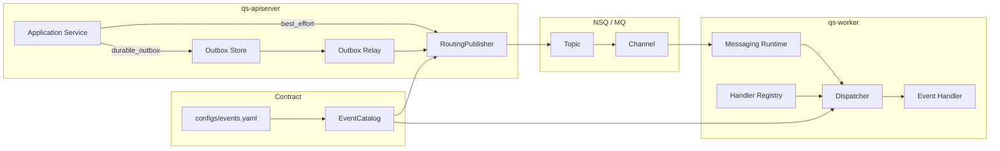
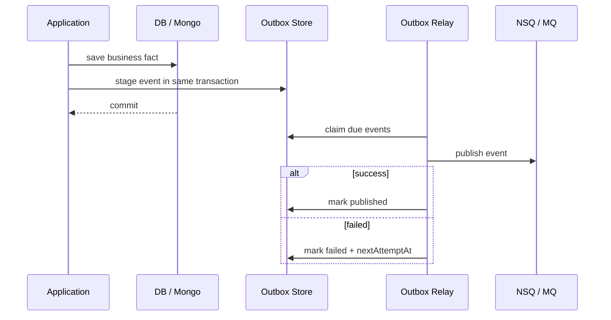

# 事件与 Outbox 讲法

**本文回答**：对外介绍 qs-server 时，如何把 Event System、NSQ/MQ、Outbox、EventCatalog、RoutingPublisher、Relay、Worker Ack/Nack 串成一套清晰讲法；为什么“接入 MQ”不等于“事件可靠”；为什么有 NSQ 之后仍然需要 Outbox；面试中被追问事件一致性、重复消费、失败重试时应该怎么回答。

---

## 1. 先给结论

> **qs-server 的事件系统不是简单“把消息发到 NSQ”，而是分成三层：EventCatalog 定义事件契约，Outbox 解决业务事实与事件出站的一致性，NSQ/MQ 负责进程间投递，worker 再通过 Ack/Nack 和业务幂等推进后续处理。**

压缩成一句话：

```text
EventCatalog 管契约
Outbox 管可靠出站
NSQ 管消息投递
Worker 管消费处理
业务状态机管幂等
```

最关键的讲法：

> **MQ 解决“怎么把消息从一个进程送到另一个进程”，Outbox 解决“业务数据库保存成功后，消息不能丢”。这两个问题不是一回事。**

---

## 2. 30 秒讲法

> **qs-server 的异步链路以事件系统为核心。业务模块产生领域事件，比如 `answersheet.submitted`，EventCatalog 负责把 event type 映射到 topic 和 handler；如果事件是主链路关键事件，就不会直接 publish，而是先和业务事实一起写入 Outbox，再由 relay 发布到 NSQ。NSQ 负责把消息投递给 worker，worker 根据 event type 找到 handler，处理成功 Ack，失败 Nack，无法解析的 poison message 会 Ack 并记录观测。这样事件系统把“业务事实、可靠出站、消息传输、消费处理”四件事拆开治理。**

适合用于：

- 技术分享讲事件架构。
- 面试官问“为什么用 MQ？”
- 面试官问“MQ 如何保证可靠？”
- 面试官问“Outbox 解决什么问题？”

---

## 3. 1 分钟讲法

> **我在项目里没有把事件系统简单理解为 MQ，而是拆成契约、发布、可靠出站、传输、消费五层。**
>
> **第一层是 EventCatalog，事件类型、topic、delivery 类型、handler 都在 `configs/events.yaml` 里集中定义。这样发布端和消费端都能围绕同一个契约协作。**
>
> **第二层是发布层，apiserver 里的 RoutingPublisher 根据 event type 找 topic，然后按 publish mode 走 mq、logging 或 nop。**
>
> **第三层是 Outbox。对于 `answersheet.submitted`、`assessment.submitted`、`report.generated` 这类关键事件，不能直接 publish MQ，而是要和业务事实同事务写入 outbox，再由 relay 异步发布。这样可以避免 AnswerSheet 保存成功但消息没发出去。**
>
> **第四层是 NSQ/MQ，它负责 topic/channel 级别的进程间投递。**
>
> **第五层是 worker 消费，worker 会从消息 metadata 或 envelope 中解析 event_type，再通过 dispatcher 找到 handler；handler 成功就 Ack，失败就 Nack，无法解析的 poison message 会 Ack 避免无限重投。**

---

## 4. 3 分钟讲法

> **这个项目里，事件系统是异步评估链路的主干。用户提交答卷后，apiserver 保存 AnswerSheet，同时产生 `answersheet.submitted` 事件。这个事件后续会驱动 worker 创建 Assessment，再由 `assessment.submitted` 驱动 Evaluation Pipeline，最后生成分数、风险和报告。**
>
> **但这里有个关键问题：很多人说“我用了 MQ，所以异步可靠”，这其实是不准确的。MQ 只负责消息传输，不负责业务数据库和 MQ publish 之间的一致性。比如 AnswerSheet 已经保存成功，但进程在 publish NSQ 前崩溃，MQ 根本不知道这条事件存在。**
>
> **所以我在关键事件上使用 Outbox：业务事实和待发布事件在同一个持久化事务里写入。比如答卷保存时，AnswerSheet、idempotency 记录和 `answersheet.submitted` outbox 一起落库。事务成功后，即使 MQ 暂时不可用，事件也在 outbox 里；relay 会不断 claim due events，发布成功就 mark published，失败就 mark failed 并设置下一次重试时间。**
>
> **NSQ 则作为消息传输层。事件通过 topic 发到 worker，worker 的 dispatcher 根据 `configs/events.yaml` 中的 handler 名称进行显式注册。消费成功 Ack，handler 失败 Nack，poison message Ack 并记录观测。**
>
> **所以我对事件可靠性的理解不是 exactly-once，而是：producer 端用 Outbox 保证可靠出站，MQ 负责至少一次投递，consumer 端用锁、唯一约束、checkpoint 和状态机做业务幂等。**

---

## 5. 事件系统主图



讲图时按这个顺序：

```text
先讲契约：events.yaml
再讲出站：best_effort / durable_outbox
再讲传输：NSQ topic/channel
再讲消费：worker dispatcher + handler
最后讲可靠性：Outbox + Ack/Nack + 幂等
```

---

## 6. 为什么不是“用了 MQ 就够了”

这句话是本篇最核心的面试点。

### 6.1 MQ 解决什么

MQ 解决的是：

```text
一个进程如何把消息异步投递给另一个进程
```

它擅长：

- topic/channel。
- 异步解耦。
- worker 消费。
- 失败重试。
- 消费并发。
- 削峰填谷。

### 6.2 MQ 不解决什么

MQ 不解决：

```text
业务数据库 commit 和 MQ publish 是否原子
```

典型问题：

```text
AnswerSheet 保存成功
进程还没 publish NSQ 就崩溃
```

这时：

- 数据库里有答卷。
- NSQ 里没有消息。
- worker 不会处理。
- 报告永远不生成。

所以需要 Outbox。

### 6.3 标准回答

面试官问“用了 NSQ 后为什么还要 Outbox？”

回答：

> **NSQ 负责消息投递，但不负责数据库和消息发布之间的原子性。Outbox 解决的是 producer-side reliability：业务事实和待发布事件同事务保存，后续 relay 再发布到 NSQ。这样即使 MQ 暂时不可用或进程崩溃，事件也不会因为 publish 失败而丢失。**

---

## 7. EventCatalog 怎么讲

EventCatalog 是事件系统的契约层。

它来自：

```text
configs/events.yaml
```

主要定义：

- topic。
- event type。
- delivery。
- aggregate。
- domain。
- handler。

### 7.1 怎么对外讲

> **我没有把 topic 和 handler 散落在代码里，而是用 EventCatalog 集中定义事件契约。发布端根据 event type 路由 topic，worker 启动时也会校验 events.yaml 中的 handler 是否真的注册。**

### 7.2 它解决什么

| 问题 | EventCatalog 解决方式 |
| ---- | --------------------- |
| event type 到 topic 散落 | YAML 统一定义 |
| 发布端和消费端认知不一致 | 共享同一 catalog |
| 新增事件忘注册 handler | worker dispatcher 初始化校验 |
| 事件可靠性等级不清 | delivery 显式标注 |
| 文档和代码漂移 | 可以做 docs/test 校验 |

### 7.3 不能讲过头

不要说：

```text
EventCatalog 保证事件不丢
```

它不保证可靠性。它只保证契约集中。

可靠性来自：

```text
Outbox + Relay + MQ + Consumer Idempotency
```

---

## 8. delivery 怎么讲

事件不是一视同仁的。

qs-server 把事件分成两类：

```text
best_effort
durable_outbox
```

### 8.1 best_effort

适合：

- 缓存刷新。
- 轻量通知。
- 计划任务通知。
- 可以容忍失败的副作用。

讲法：

> **best_effort 事件即使发布失败，也不应该回滚主业务状态。它适合轻量副作用。**

例子：

```text
questionnaire.changed
scale.changed
task.opened
task.completed
```

### 8.2 durable_outbox

适合：

- 主链路关键事件。
- 评估推进事件。
- 报告生成事件。
- 行为投影事件。

讲法：

> **durable_outbox 事件必须和业务事实同事务 stage，因为它们驱动后续关键流程。**

例子：

```text
answersheet.submitted
assessment.submitted
assessment.interpreted
assessment.failed
report.generated
footprint.*
```

### 8.3 这层设计的价值

不是所有事件都用 Outbox，因为成本不同：

| 类型 | 成本 | 可靠性 |
| ---- | ---- | ------ |
| best_effort | 低 | 尽力而为 |
| durable_outbox | 高 | 可重试、可观测、可恢复 |

讲法：

> **事件系统的设计不是所有事件都最强一致，而是按业务重要性分等级。**

---

## 9. RoutingPublisher 怎么讲

RoutingPublisher 的职责：

```text
给定一个 domain event
根据 event type 查 topic
按当前 publish mode 发布
```

### 9.1 Publish Mode

| mode | 说明 |
| ---- | ---- |
| mq | 发到 MQ |
| logging | 只记录日志 |
| nop | 不发消息 |

环境默认：

| 环境 | 默认 |
| ---- | ---- |
| production | mq |
| development | logging |
| testing | nop |

### 9.2 怎么讲

> **RoutingPublisher 让业务模块不关心 NSQ topic 名称。业务模块只产生领域事件，Publisher 根据 EventCatalog 路由。开发和测试环境可以切到 logging/nop，生产使用 MQ。**

### 9.3 注意边界

RoutingPublisher 只负责发布，不负责决定事件是否要 Outbox。

Outbox relay 最终也要调用 RoutingPublisher。

所以不能简单在 RoutingPublisher 里禁止 durable event 发布，否则 relay 也发不出去。

---

## 10. Outbox 怎么讲

Outbox 是 producer-side reliability。

### 10.1 Outbox 流程



### 10.2 Outbox 状态

```text
pending
publishing
published
failed
```

讲法：

> **Outbox 让事件有状态：待发布、发布中、已发布、失败待重试。这样异步链路不再是黑盒。**

### 10.3 MySQL / Mongo Outbox

当前有两类：

| Outbox | 用途 |
| ------ | ---- |
| Mongo Outbox | AnswerSheet、Report 等 Mongo 持久化边界 |
| MySQL Outbox | Assessment 等 MySQL 持久化边界 |

讲法：

> **Outbox 跟着业务事实的存储边界走。AnswerSheet 是 Mongo 文档，所以它的 submitted 事件走 Mongo transaction；Assessment 是 MySQL 状态，所以它的 lifecycle 事件走 MySQL outbox。**

---

## 11. NSQ 怎么讲

NSQ 是当前默认 MQ 思路下的消息传输层。

### 11.1 为什么选择 NSQ

对外可以这样说：

> **在当前项目阶段，NSQ 的优势是简单、轻量、部署成本低，适合 Go 后端里做 topic/channel 的异步解耦。我们用它承接 Outbox relay 发布出来的事件，再由 worker 订阅处理。**

### 11.2 NSQ 在链路中的位置

NSQ 只在这里：

```text
Outbox Relay / RoutingPublisher
  -> NSQ topic
  -> worker channel
```

它不参与：

- 业务事务。
- AnswerSheet 保存。
- Assessment 状态机。
- Report 保存。
- 权限判断。
- 统计口径。

### 11.3 不要这样讲

不要说：

```text
NSQ 保证整个链路可靠
```

更准确：

```text
NSQ 负责消息投递，Outbox 负责消息出站前的可靠性，worker handler 负责消费端幂等。
```

---

## 12. Worker 消费怎么讲

Worker 消费流程：

```text
NSQ message
  -> messaging runtime
  -> parse event_type
  -> dispatcher
  -> handler registry
  -> concrete handler
  -> Ack / Nack
```

### 12.1 Dispatcher 的价值

> **Dispatcher 确保 events.yaml 中声明的 handler 必须在 worker registry 里存在，否则 worker 启动时就失败。这样可以避免新增事件但忘记写消费者。**

### 12.2 Ack/Nack 语义

| 场景 | 处理 |
| ---- | ---- |
| 解析不到 event_type | Ack poison message，避免无限重试 |
| handler 成功 | Ack |
| handler 失败 | Nack |
| Ack/Nack 自身失败 | 记录观测 |

### 12.3 为什么 poison message 要 Ack

因为无法解析 event type 的消息通常不是重试能修好的。一直 Nack 会导致毒消息反复投递，占用队列。

---

## 13. 消费端幂等怎么讲

一定要强调：

> **MQ 消费不是 exactly-once，所以 handler 必须幂等。**

在 qs-server 中，幂等有多种来源：

| 场景 | 幂等方式 |
| ---- | -------- |
| 同一答卷重复触发创建 Assessment | Redis processing lock + answer_sheet_id 预查 + MySQL unique |
| 同一 Assessment 重复评估 | Assessment 状态机 |
| 行为事件重复投影 | projector checkpoint |
| Outbox 重复 publish | event_id + consumer 幂等 |
| Submit 重复 | SubmitGuard + durable idempotency |

讲法：

> **Outbox 保证 producer 端不丢事件；consumer 端必须通过业务键、状态机、唯一约束和 checkpoint 处理重复投递。**

---

## 14. 事件系统和测评引擎怎么串

这是这篇和上一篇《异步评估链路讲法》的衔接。

### 14.1 主链路

```text
answersheet.submitted
  -> answersheet_submitted_handler
  -> CalculateAnswerSheetScore
  -> CreateAssessmentFromAnswerSheet
  -> assessment.submitted
  -> assessment_submitted_handler
  -> EvaluateAssessment
  -> Evaluation Pipeline
  -> assessment.interpreted / report.generated
```

### 14.2 怎么讲

> **事件系统负责把“某个业务事实已经发生”通知出去，测评引擎负责在收到触发后，把 Assessment 从 submitted 推进到 interpreted 或 failed。二者的边界是：事件系统不承载业务状态机，Evaluation 不关心 MQ 细节。**

---

## 15. 事件系统和统计怎么串

统计读侧依赖行为投影事件。

典型事件：

```text
footprint.answer_sheet_submitted
footprint.report_generated
footprint.entry_opened
footprint.intake_confirmed
```

链路：

```text
domain event
  -> analytics-behavior topic
  -> behavior_projector_handler
  -> BehaviorProjector
  -> checkpoint / pending retry
  -> statistics read model
```

讲法：

> **统计不是每次实时扫业务写模型，而是通过行为事件投影形成读侧视图。事件系统给统计提供了低耦合的数据进入方式。**

---

## 16. 事件系统和 Plan/Notification 怎么串

Plan task 事件如：

```text
task.opened
task.completed
task.expired
task.canceled
```

当前更偏 best_effort，用于通知和轻量副作用。

讲法：

> **Plan task 的事件更多是通知类或运营类副作用，不像 AnswerSheet submitted 那样直接驱动核心报告生成，所以当前可以按 best_effort 处理。未来如果某个 task 事件变成强依赖，就应升级为 durable_outbox。**

---

## 17. 可靠性怎么讲

推荐用这句话：

> **事件链路的可靠性是分段保证的：主事实和事件起点由 Outbox 同事务保证；事件传输由 NSQ/MQ 保证至少一次投递；消费端由 Ack/Nack 和业务幂等保证可重试；状态机和唯一约束防止重复副作用。**

### 17.1 可靠性矩阵

| 层 | 保证 | 不保证 |
| -- | ---- | ------ |
| Outbox | 业务事实与事件起点同事务 | 下游一定成功 |
| NSQ/MQ | 消息投递和重试 | exactly-once |
| Worker Ack/Nack | 成功/失败结算 | 业务天然幂等 |
| Handler 幂等 | 重复投递不造成重复副作用 | MQ 不重复 |
| 状态机 | 防非法状态重入 | 所有异常自动恢复 |
| Observability | 可观察 pending/failed/backlog | 自动修复所有问题 |

---

## 18. 失败怎么讲

### 18.1 Publish 失败

如果 Outbox relay publish 失败：

```text
MarkFailed
nextAttemptAt
attempt_count + 1
```

后续 relay 可以继续 claim。

### 18.2 Worker 失败

handler error：

```text
Nack
```

让 MQ 后续重投。

### 18.3 Poison message

无法解析 event_type：

```text
Ack
record poison_acked
```

避免无限重投。

### 18.4 Handler 重复执行

通过：

- lock。
- unique constraint。
- state machine。
- checkpoint。

来避免重复副作用。

---

## 19. 为什么 event 不替代业务状态机

这也是常见追问。

回答：

> **事件表示某个业务事实已经发生，但业务状态的真值仍在聚合和数据库里。比如 `assessment.submitted` 表示 Assessment 已进入 submitted 状态，但是否能执行评估，仍要看 Assessment 当前状态；如果事件被重复投递到 interpreted 状态，状态机应该拒绝重复执行。**

不要让事件成为唯一状态源，除非你明确采用 event sourcing。当前 qs-server 不是 event sourcing。

---

## 20. 为什么不是 Event Sourcing

可以这样回答：

> **当前系统使用事件驱动和 Outbox，但不是 Event Sourcing。业务状态仍然存储在 MySQL/Mongo 的聚合表/文档中，事件用于异步驱动和副作用通知，不作为重建全部业务状态的唯一来源。**

区别：

| Event-driven + Outbox | Event Sourcing |
| --------------------- | -------------- |
| 状态存业务表/文档 | 状态从事件流重建 |
| 事件用于通知和异步流程 | 事件是唯一事实源 |
| Outbox 保证出站 | Event Store 是核心存储 |
| 查询读模型可独立 | 一切从 event log 派生 |

qs-server 当前属于：

```text
事件驱动 + Outbox
```

不是：

```text
Event Sourcing
```

---

## 21. 讲给面试官的标准回答

### 21.1 问：你们为什么用 NSQ？

答：

> **我们需要把答卷提交后的评估、报告、统计投影这些慢任务从请求线程里拆出去。NSQ 轻量、适合 Go 项目做 topic/channel 的异步解耦，worker 可以独立控制消费并发。它在系统里的角色是消息传输层。**

### 21.2 问：NSQ 消息丢了怎么办？

答：

> **主链路关键事件不是直接依赖一次 publish。apiserver 会先把业务事实和事件写入 Outbox，relay 再发布到 NSQ。即使 NSQ 暂时不可用，事件还在 outbox 里，后续可以重试。**

### 21.3 问：重复消费怎么办？

答：

> **我们不把 MQ 讲成 exactly-once。worker handler 要按业务幂等设计，比如同一 AnswerSheet 创建 Assessment 时有 Redis lock、预查和唯一约束；Evaluation 也受 Assessment 状态机约束；行为投影有 checkpoint。**

### 21.4 问：Outbox 和 MQ 的区别？

答：

> **Outbox 是生产端可靠性，解决 DB 与 MQ publish 双写不一致；MQ 是传输层，解决进程间异步投递；worker 是消费端，解决 handler 执行和 Ack/Nack。**

### 21.5 问：所有事件都需要 Outbox 吗？

答：

> **不需要。主链路关键事件需要 durable_outbox，比如答卷提交、评估、报告；轻量通知和缓存刷新可以 best_effort。这样可以在可靠性和实现成本之间做分层。**

---

## 22. 不要这样讲

### 22.1 不要说“用了 NSQ，所以可靠”

应该说：

```text
NSQ 负责消息传输；
Outbox 负责业务事实和事件起点一致；
consumer 幂等负责重复投递。
```

### 22.2 不要说“Outbox 保证 exactly-once”

应该说：

```text
Outbox 保证 producer-side reliable publish，consumer 仍要幂等。
```

### 22.3 不要说“事件系统就是异步任务”

太低。

应该说：

```text
事件系统是模块之间的异步事实通知机制，承载评估推进、统计投影、通知副作用和跨模块协作。
```

### 22.4 不要说“worker 拥有事件对应业务状态”

应该说：

```text
worker 消费事件并驱动 apiserver，主写模型仍在 apiserver。
```

### 22.5 不要说“这是 Event Sourcing”

当前不是。

应该说：

```text
事件驱动 + Outbox，不是 Event Sourcing。
```

---

## 23. 讲图脚本

可以这样边画边讲：

```text
我把事件系统分成五层。

第一层是事件契约，也就是 events.yaml。它定义 event type、topic、delivery 和 handler。
第二层是业务发布。业务模块只产生领域事件，不关心 NSQ topic。
第三层是 Outbox。关键事件必须先和业务状态同事务写入 outbox。
第四层是 MQ。当前默认用 NSQ 做 topic/channel 投递。
第五层是 Worker。Worker 根据 event_type 分发到 handler，成功 Ack，失败 Nack，毒消息 Ack 并记录观测。

所以这套设计不是简单“发消息”，而是把事件契约、可靠出站、消息投递和消费幂等分开治理。
```

---

## 24. 最终背诵版

> **qs-server 的事件系统可以分成 EventCatalog、RoutingPublisher、Outbox、NSQ 和 Worker 五层。EventCatalog 用 `configs/events.yaml` 定义 event type、topic、delivery 和 handler；RoutingPublisher 根据 event type 路由到 topic；对于关键事件，比如 `answersheet.submitted`、`assessment.submitted`、`report.generated`，业务模块不会直接 publish，而是先把事件和业务事实一起写入 Outbox，再由 relay 发布到 NSQ；NSQ 负责进程间投递；worker 消费后按 handler 分发，成功 Ack、失败 Nack。**
>
> **所以我不会说“用了 NSQ 就可靠”。更准确的是：Outbox 解决生产端 DB 与 MQ 双写一致性，NSQ 解决消息传输，worker 和业务状态机解决消费端重复和失败。整个链路是至少一次投递 + 业务幂等，而不是 exactly-once。**

---

## 25. 证据回链

| 判断 | 证据 |
| ---- | ---- |
| 不能把用了 MQ 讲成一致性天然解决 | 旧版 `docs/06-宣讲/06-关键决策卡.md` |
| Event System 由 configs/events.yaml、eventcatalog、RoutingPublisher、Outbox、Worker Dispatcher、Messaging Runtime、Ack/Nack、observability 协作 | `docs/03-基础设施/event/00-整体架构.md` |
| best_effort / durable_outbox 是两种 delivery 语义 | `docs/03-基础设施/event/00-整体架构.md` |
| Worker dispatcher 会校验 handler registry | `docs/03-基础设施/event/00-整体架构.md` |
| Poison message Ack，handler failure Nack | `docs/03-基础设施/event/00-整体架构.md` |
