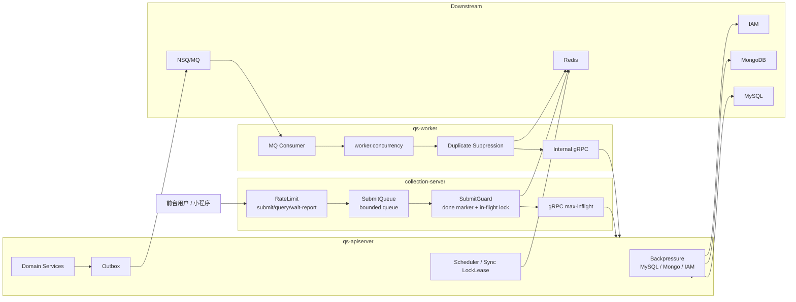

# 高并发治理讲法

**本文回答**：对外介绍 qs-server 时，如何讲清楚“高并发治理”；如何把 RateLimit、SubmitQueue、SubmitGuard、gRPC max-inflight、Backpressure、LockLease、Worker concurrency、幂等和观测串成一条分层保护链；面试中被问“你怎么做高并发”的时候，如何回答得具体、可信、不夸大。

---

## 1. 先给结论

> **qs-server 的高并发治理不是一个“限流开关”，而是一条从前台入口到下游依赖的分层保护链：入口限流挡突发，SubmitQueue 削峰，SubmitGuard 防重复提交，gRPC max-inflight 限制跨进程并发，apiserver Backpressure 保护 MySQL/Mongo/IAM，LockLease 做跨实例互斥，worker concurrency 控制异步消费。**

压缩成一句话：

```text
RateLimit 挡入口
SubmitQueue 接短峰
SubmitGuard 防重复
max-inflight 控制 RPC
Backpressure 护下游
LockLease 管互斥
Worker concurrency 控消费
Metrics/Status 做观测
```

最重要的讲法：

> **高并发治理的目标不是“让所有请求都成功”，而是在压力超过系统承载时，用可解释的方式拒绝、排队、背压、跳过或降级，保护主链路不雪崩。**

---

## 2. 30 秒讲法

> **qs-server 的高并发治理是分层做的。前台请求先进 collection-server，先按 submit、query、wait-report 分 scope 限流；答卷提交再进入 SubmitQueue，用有界队列把突发请求削成固定 worker 并发；重复提交通过 SubmitGuard 的 done marker 和 in-flight lock 抑制；collection 到 apiserver 的 gRPC 还有 max-inflight 控制；apiserver 内部对 MySQL、Mongo、IAM 做 Backpressure，避免下游慢时继续放大压力；调度、统计同步和 worker 重复事件用 Redis LockLease 做短期互斥；最后通过 resilience metrics 和 governance status 观察每个保护点的 outcome。**

---

## 3. 1 分钟讲法

> **我不会把高并发只理解成“加一个限流器”。在这个项目里，请求压力从前台一路传到 DB、Mongo、IAM、MQ 和 worker，所以保护也必须分层。**
>
> **第一层是入口保护：collection-server 对 submit、query、wait-report 分 scope 限流，必要时基于 Redis 做分布式限流，失败时返回明确的 429。**
>
> **第二层是提交削峰：答卷提交不是直接同步压到 apiserver，而是先进 collection 的 SubmitQueue。SubmitQueue 是有界内存队列，队列满就返回 429，入队成功就返回 202 和 request_id，让前端查状态。**
>
> **第三层是幂等和重复抑制：SubmitGuard 用 Redis done marker 和 in-flight lock 防止重复提交；worker 消费重复事件时也通过 Redis lock、业务唯一约束和状态机兜底。**
>
> **第四层是下游背压：apiserver 对 MySQL、Mongo、IAM 这种下游依赖做 in-flight 限制，等待槽位超时就失败，而不是无限堆 goroutine。**
>
> **最后是观测：所有保护点都用 resilienceplane 的 kind/outcome 统一记录，比如 rate_limited、queue_full、backpressure_timeout、lock_contention、duplicate_skipped。这样高并发下不是黑盒，而是能解释“压力被挡在了哪一层”。**

---

## 4. 3 分钟讲法

> **这个项目里的高并发压力主要来自前台答卷提交、报告查询、wait-report 长轮询、worker 事件消费、统计同步和下游依赖变慢。我的设计不是试图让所有请求都硬扛过去，而是分层保护。**
>
> **在入口层，collection-server 是前台 BFF 和保护层。它会先对 submit、query、wait-report 做限流，按全局和 user/ip 两级保护。这样前台用户重复刷新或集中提交时，压力会先被挡在 collection。**
>
> **在提交链路，真正高风险的是 POST answersheets。这里我用了 SubmitQueue，它是 collection 进程内的有界队列，队列满返回 429，入队后由固定 worker pool 调 apiserver。它不是 MQ，也不是持久队列，但它能把短时间洪峰削成可控的下游并发。**
>
> **在重复提交上，用户可能重复点击或网络重试，所以 collection 后面还有 SubmitGuard。SubmitGuard 用 Redis 的 done marker 复用已完成结果，用 in-flight lock 抑制正在处理的重复请求。即使后面 worker 重复消费，apiserver 创建 Assessment 也有 answer_sheet_id 预查和唯一约束，Evaluation 还有状态机保护。**
>
> **在下游层，apiserver 不会无限把请求压到 MySQL、Mongo、IAM，而是通过 Backpressure 限制 in-flight 操作数。下游慢时，上游等待槽位，超时就返回错误。这和 SQL timeout 不同，它保护的是进入下游之前的并发槽位。**
>
> **在异步层，worker 通过 worker.concurrency 控制 MQ 消费并发；重复事件通过锁和幂等保护；调度类任务，比如 statistics sync、scheduler leader，也用 Redis LockLease 控制多实例并发。**
>
> **最后，所有这些保护点都不是散落日志里，而是通过 resilienceplane 的统一 vocabulary 观察：rate_limit、queue、backpressure、lock、idempotency、duplicate_suppression，每个都有 bounded outcome。这样当系统出现 429、queue full、backpressure timeout 或 duplicate skipped 时，我能解释它是在哪一层被保护住的。**

---

## 5. 高并发治理主图



讲图时强调：

```text
不是一个点保护所有压力，
而是每一段链路都有自己的保护点。
```

---

## 6. 高并发问题从哪里来

在 qs-server 中，高并发不是抽象概念，而是来自具体场景。

| 场景 | 压力来源 |
| ---- | -------- |
| 前台集中提交答卷 | POST /answersheets 突增 |
| 用户重复点击提交 | 同一答卷重复进入后端 |
| 报告未生成时频繁刷新 | assessment/report 查询压力 |
| wait-report 长轮询 | 连接和 handler 占用 |
| worker 批量消费事件 | internal gRPC / DB / Mongo 压力 |
| 统计同步 | MySQL 聚合和锁竞争 |
| Redis/IAM/DB 变慢 | 上游 goroutine 堆积 |
| 多实例 scheduler | 重复执行任务风险 |

所以治理目标不是“所有请求都成功”，而是：

```text
能挡住的挡住
能排队的排队
能复用的复用
该失败的快速失败
下游慢时停止继续施压
```

---

## 7. 第一层：入口限流

### 7.1 要讲什么

入口限流解决：

```text
请求还没进入核心链路前，先判断是否超过系统可承载速率。
```

collection-server 按前台场景区分：

```text
submit
query
wait-report
```

apiserver 也有自己的后台 REST 入口保护。

### 7.2 为什么要分 scope

submit、query、wait-report 的风险不同：

| scope | 风险 |
| ----- | ---- |
| submit | 写入、校验、gRPC、Mongo、Outbox |
| query | 读模型、cache、DB |
| wait-report | 长轮询，占用连接和 handler |
| admin/internal | 后台管理和治理操作 |

如果所有接口共用一个限流器，会出现：

- 长轮询挤占提交。
- 查询挤占提交。
- 前台挤占后台。
- 无法解释 429 来源。

### 7.3 面试讲法

> **我没有只在 Nginx 或 apiserver 做统一限流，而是把前台入口按 submit、query、wait-report 分 scope 保护。因为这些接口的资源消耗和失败语义不同。**

---

## 8. 第二层：SubmitQueue 提交削峰

### 8.1 要讲什么

SubmitQueue 解决：

```text
短时间大量提交时，不要让所有请求同时打到 apiserver。
```

它是 collection-server 内的有界队列：

```text
HTTP submit
  -> enqueue
  -> worker pool
  -> submitWithGuard
  -> gRPC SaveAnswerSheet
```

### 8.2 返回语义

| 结果 | 语义 |
| ---- | ---- |
| 202 | 已受理入队，前端用 request_id 查状态 |
| 429 | 队列满，系统明确拒绝 |
| done | 后台 worker 已完成提交 |
| failed | 提交失败，需要新 request_id 或处理错误 |

### 8.3 它不是什么

SubmitQueue 不是：

- MQ。
- durable queue。
- Redis queue。
- 跨实例状态中心。
- exactly-once 保证。
- 数据库事务。

它只是：

```text
collection 进程内的入口削峰器
```

### 8.4 面试讲法

> **SubmitQueue 的价值是把用户提交洪峰削成固定 worker 并发。它不承诺持久化，所以后面还要有 SubmitGuard 和 apiserver durable submit 兜底。**

---

## 9. 第三层：SubmitGuard 幂等与重复抑制

### 9.1 要讲什么

用户可能重复点击或网络重试，所以要防止同一提交重复打到 apiserver。

SubmitGuard 做两件事：

```text
done marker
in-flight lock
```

### 9.2 done marker

如果同一个 idempotency key 已经完成：

```text
直接复用结果
```

### 9.3 in-flight lock

如果同一个 idempotency key 正在处理：

```text
拒绝或提示进行中
```

### 9.4 面试讲法

> **SubmitGuard 不是为了提升吞吐，而是为了避免重复提交造成重复答卷或重复下游副作用。它和 SubmitQueue 不同：Queue 解决洪峰，Guard 解决重复。**

---

## 10. 第四层：gRPC max-inflight

### 10.1 要讲什么

collection-server 到 apiserver 是 gRPC 调用。

即使入口限流和 SubmitQueue 存在，也要控制：

```text
同时有多少请求正在打 apiserver
```

否则可能：

```text
collection 自己扛住了
apiserver 被 gRPC 并发打爆
```

### 10.2 面试讲法

> **我不仅在 HTTP 入口做保护，也控制 collection 到 apiserver 的 gRPC in-flight。因为保护要覆盖跨进程边界，否则只是把压力从 HTTP 层搬到 gRPC 层。**

---

## 11. 第五层：apiserver Backpressure

### 11.1 要讲什么

Backpressure 保护下游依赖：

- MySQL。
- Mongo。
- IAM。
- 外部服务。

它限制的是：

```text
同时进入某个下游依赖的 in-flight 操作数
```

### 11.2 它和超时的区别

| Backpressure | Timeout |
| ------------ | ------- |
| 进入下游前等槽位 | 下游执行中等待结果 |
| 防止并发过多 | 防止单次操作过久 |
| 控制压力 | 控制单请求耗时 |

### 11.3 面试讲法

> **Backpressure 不是慢 SQL 优化，也不是请求超时。它是在调用下游前先拿并发槽位，避免下游已经慢了，上游还继续无限加压。**

---

## 12. 第六层：LockLease

### 12.1 要讲什么

LockLease 用 Redis 做短期互斥。

典型场景：

| 场景 | 用途 |
| ---- | ---- |
| SubmitGuard | 同一提交 in-flight 抑制 |
| Scheduler leader | 多实例只有一个实例跑调度 |
| Statistics sync | 同一 org/window 避免重复重建 |
| Worker duplicate gate | 同一 AnswerSheet 事件避免并发重复处理 |
| Behavior pending reconcile | 避免多实例重复补偿 |

### 12.2 它不保证什么

LockLease 不保证：

- exactly-once。
- 业务事务。
- 永久互斥。
- fencing token。
- 消费端一定不重复。

### 12.3 面试讲法

> **Redis lock 只是短期互斥和重复抑制，不能替代业务幂等。真正的正确性还要靠唯一约束、状态机和 idempotency record。**

---

## 13. 第七层：Worker concurrency

### 13.1 要讲什么

worker 消费 MQ 时也需要并发控制。

否则：

```text
MQ 积压一恢复
worker 突然打满 apiserver / DB / Mongo
```

worker concurrency 的作用是：

- 控制同一时间处理的事件数量。
- 间接控制 internal gRPC 压力。
- 避免 worker 自己过载。
- 配合 MQ backoff/retry。

### 13.2 不要讲过头

不要说：

```text
worker concurrency 保证下游安全
```

它只是一个上限。下游仍需要：

- apiserver Backpressure。
- DB pool。
- Mongo timeout。
- handler 幂等。
- Outbox status。
- retry/Nack 策略。

---

## 14. 第八层：业务状态机和唯一约束

真正高并发下，不能只靠限流和锁。

例如同一 AnswerSheet 触发两次创建 Assessment，最终还要靠：

- answer_sheet_id 预查。
- MySQL unique key。
- Assessment 状态机。
- Evaluation 只接受 submitted 状态。
- Report 1:1 关系。

讲法：

> **技术保护挡住大部分重复和洪峰，业务正确性还要靠状态机和唯一约束兜底。**

---

## 15. ResiliencePlane 怎么讲

ResiliencePlane 不是具体限流器，而是统一语言和观测。

它统一这些概念：

```text
ProtectionKind
Outcome
Subject
Decision
RuntimeSnapshot
Prometheus metrics
```

### 15.1 ProtectionKind

| Kind | 含义 |
| ---- | ---- |
| rate_limit | 限流 |
| queue | 队列 |
| backpressure | 下游背压 |
| lock | 锁 |
| idempotency | 幂等 |
| duplicate_suppression | 重复抑制 |

### 15.2 Outcome

常见 outcome：

```text
allowed
rate_limited
queue_accepted
queue_full
backpressure_acquired
backpressure_timeout
lock_acquired
lock_contention
idempotency_hit
duplicate_skipped
degraded_open
```

### 15.3 面试讲法

> **我没有把限流、队列、背压、锁抽成一个万能框架，因为它们语义不同。但我用 resilienceplane 统一观测语言，这样排障时能知道请求是在哪个保护点被拒绝或降级。**

---

## 16. 高并发治理和三进程的关系

| 进程 | 主要保护点 |
| ---- | ---------- |
| collection-server | RateLimit、SubmitQueue、SubmitGuard、gRPC max-inflight |
| qs-apiserver | Backpressure、LockLease、durable idempotency、scheduler leader lock |
| qs-worker | worker.concurrency、duplicate suppression、Ack/Nack |
| Redis | rate limit、locklease、idempotency、status |
| MySQL/Mongo/IAM | 被 Backpressure 保护 |
| MQ | 被 worker concurrency 和 Ack/Nack 保护 |

讲法：

> **三进程不是只为代码拆分，也是为了把不同压力源放在不同进程治理。**

---

## 17. 高并发下的典型场景

### 17.1 场景一：很多用户同时提交

链路：

```text
RateLimit
  -> SubmitQueue
  -> SubmitGuard
  -> gRPC max-inflight
  -> apiserver SaveAnswerSheet
  -> Mongo / Outbox
```

被保护点：

- 超过入口速率：429。
- 队列满：429。
- 重复提交：idempotency hit / in-flight。
- apiserver 压力大：gRPC max-inflight。
- Mongo 慢：apiserver backpressure 或 Mongo timeout。

### 17.2 场景二：报告查询被频繁刷新

链路：

```text
query rate limit
  -> cache/query cache
  -> apiserver read model
  -> wait-report limiter
```

被保护点：

- wait-report 独立限流。
- QueryCache 降低 DB 压力。
- report 未生成返回 pending，而不是阻塞无限等待。

### 17.3 场景三：worker 积压后突然恢复

链路：

```text
MQ backlog
  -> worker.concurrency
  -> duplicate suppression
  -> internal gRPC
  -> apiserver backpressure
```

被保护点：

- worker 并发上限。
- 重复事件锁。
- apiserver 下游背压。
- Evaluation 状态机。

### 17.4 场景四：IAM 变慢

链路：

```text
JWT/AuthzSnapshot/Guardianship
  -> IAM client
  -> IAM backpressure
```

被保护点：

- IAM in-flight limiter。
- AuthzSnapshot cache。
- user/guardianship cache。
- 超时和错误返回。

---

## 18. 常见面试追问

### 18.1 你怎么做高并发？

回答：

> **我不是只做一个限流器，而是按链路分层治理。前台入口有 RateLimit，答卷提交有 SubmitQueue，重复提交有 SubmitGuard，collection 到 apiserver 有 gRPC max-inflight，apiserver 对 MySQL/Mongo/IAM 有 Backpressure，worker 消费有 concurrency 和 duplicate suppression，最后用 resilienceplane 统一记录 outcome 和 status。**

---

### 18.2 SubmitQueue 和 MQ 有什么区别？

回答：

> **SubmitQueue 是 collection 进程内的有界队列，解决前台短峰削峰；MQ 是进程间消息系统，解决异步事件投递。SubmitQueue 不持久化，不跨实例，不替代 Outbox 和 NSQ。**

---

### 18.3 Redis 锁能不能保证 exactly-once？

回答：

> **不能。Redis lock 只能做短期互斥和重复抑制。正确性还要靠业务幂等，比如 done marker、answer_sheet_id 唯一约束、Assessment 状态机和 checkpoint。**

---

### 18.4 Backpressure 和限流有什么区别？

回答：

> **限流挡的是入口请求速率，Backpressure 挡的是下游并发压力。比如用户请求进入系统后，在调用 MySQL/Mongo/IAM 前还要拿槽位，避免下游变慢时上游继续加压。**

---

### 18.5 高并发下你怎么观测？

回答：

> **看 resilience metrics 和 status：rate_limited 看入口限流，queue_full 看 SubmitQueue，backpressure_timeout 看下游槽位，lock_contention 看锁竞争，duplicate_skipped 看重复事件。再结合 collection/apiserver/worker 的日志和 governance status 判断压力在哪一层被挡住。**

---

### 18.6 你压测过吗？

建议谨慎回答：

> **当前文档里有容量档位和压测建议，但我不会把没有完整压测报告的数据讲成已验证 SLO。可以讲的是架构上已经有入口限流、削峰、背压、锁、幂等等保护点；真正的 QPS 承诺需要结合 k6 压测、DB/Mongo/Redis/MQ/IAM 资源和 p95/p99 数据来确认。**

---

## 19. 不要这样讲

### 19.1 不要说“用了 Redis 就能抗高并发”

Redis 只是工具。关键是：

- 用在哪里。
- 出错怎么办。
- 是否有业务兜底。
- 是否可观测。

### 19.2 不要说“SubmitQueue 保证提交不丢”

不准确。SubmitQueue 是内存队列，进程退出不保证 drain。提交事实可靠性来自 apiserver durable submit。

### 19.3 不要说“有锁就没有重复”

不准确。锁会过期、失败、降级，仍要业务幂等。

### 19.4 不要说“Backpressure 解决慢 SQL”

不准确。Backpressure 只限制并发槽位，慢 SQL 要靠索引、SQL 优化和数据库治理。

### 19.5 不要说“系统已经支持 1000 QPS”

除非有压测报告。更安全的讲法是：

```text
架构有分层保护和容量档位建议，QPS 承诺需要压测验收。
```

---

## 20. 讲图脚本

可以这样边画边讲：

```text
我把高并发治理分成入口、队列、幂等、RPC、下游、异步和观测七层。

第一层是入口限流，先按 submit、query、wait-report 把前台流量分开。
第二层是 SubmitQueue，答卷提交进有界队列，队列满就明确 429。
第三层是 SubmitGuard，用 Redis done marker 和 in-flight lock 防重复提交。
第四层是 collection 到 apiserver 的 gRPC max-inflight，防止跨进程并发过大。
第五层是 apiserver 的 Backpressure，对 MySQL、Mongo、IAM 做 in-flight 限制。
第六层是 worker concurrency 和 duplicate suppression，防止 MQ 积压恢复时打穿 apiserver。
第七层是 resilienceplane，把所有保护点的结果统一成 allowed、rate_limited、queue_full、backpressure_timeout、duplicate_skipped 这类 outcome。

这套设计的目标不是让请求永远成功，而是在超过承载时清楚地知道压力被挡在哪一层。
```

---

## 21. 最终背诵版

> **qs-server 的高并发治理是分层做的。前台请求先进 collection-server，先按 submit、query、wait-report 做入口限流；答卷提交再进入 SubmitQueue，把突发请求削成固定 worker 并发；重复提交通过 SubmitGuard 的 done marker 和 in-flight lock 抑制；collection 到 apiserver 的 gRPC 还有 max-inflight 控制；apiserver 内部对 MySQL、Mongo、IAM 用 Backpressure 限制 in-flight 操作数；worker 消费 MQ 时通过 worker.concurrency 控制并发，并用 duplicate suppression 防止重复事件并发处理。**
>
> **我不会把这套东西讲成一个万能高并发框架。RateLimit、Queue、Backpressure、Lock、Idempotency 语义不同，所以具体能力分别实现，但通过 resilienceplane 统一观测 outcome。这样当系统出现 429、queue full、backpressure timeout、lock contention 或 duplicate skipped 时，我能解释压力是在哪一层被保护住的。**

---

## 22. 证据回链

| 判断 | 证据 |
| ---- | ---- |
| 工程治理要讲真实保护和风险边界 | 旧版 `docs/06-宣讲/07-工程治理与证据.md` |
| Resilience Plane 包含入口限流、SubmitQueue、Backpressure、LockLease、幂等、重复抑制和观测 | `docs/03-基础设施/resilience/00-整体架构.md` |
| resilienceplane 不是万能框架，只是 vocabulary + observer + status snapshot | `docs/03-基础设施/resilience/00-整体架构.md` |
| SubmitQueue 不是 MQ，LockLease 不是 exactly-once，Backpressure 不是 SQL timeout | `docs/03-基础设施/resilience/00-整体架构.md` |
| worker.concurrency 是真实生效路径，重试次数不能无证据承诺 | 旧版 `docs/06-宣讲/07-工程治理与证据.md` |
