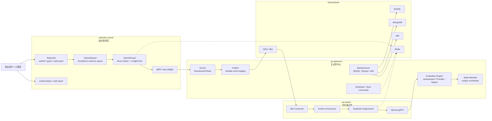

# 06-高并发治理讲法

**本文回答**：对外介绍 qs-server 时，如何把“高并发治理”讲清楚；如何把 RateLimit、SubmitQueue、SubmitGuard、gRPC max-inflight、Backpressure、LockLease、Worker concurrency、Outbox、业务幂等、Metrics 和 Governance 串成一条分层保护链；面试中被问“你怎么做高并发”“怎么抗峰值”“怎么保护下游”“怎么处理重复提交”时，如何回答得具体、可信、不夸大。

---

## 30 秒结论

qs-server 的高并发治理不是一个“限流开关”，而是一条从前台入口到下游依赖、从同步提交到异步测评执行的分层保护链。

新版讲法：

```text
RateLimit 挡入口
SubmitQueue 接短峰
SubmitGuard 防重复
gRPC max-inflight 控跨进程并发
Backpressure 护 MySQL / Mongo / IAM
LockLease 管短期互斥
Worker concurrency 控异步消费
Outbox + 状态机 + 唯一约束兜底幂等
Metrics / Governance 负责观测和排障
```

最重要的一句话：

> **高并发治理的目标不是“让所有请求都成功”，而是在压力超过系统承载时，用可解释的方式限流、排队、拒绝、背压、跳过、降级或延迟推进，保护 AnswerSheet 提交、Assessment 执行、Interpretation Provider 和 Report 生成这些主链路不雪崩。**

注意：不要把这个能力讲成“系统已验证 1000 QPS”。

更准确的表达是：

```text
系统具备分层保护设计；
真实 QPS 需要压测报告证明；
没有压测数据时，只讲保护点、容量思路和观测指标。
```

---

## 1. 为什么这一篇要更新

旧版讲法已经覆盖 RateLimit、SubmitQueue、SubmitGuard、Backpressure、LockLease、Worker concurrency 等内容，方向是对的。

但现在需要更新三点。

### 1.1 主链路要从“答卷提交 + 异步评估”升级为“异步测评执行”

旧表达容易停在：

```text
前台提交答卷
  -> 进入队列
  -> worker 异步评估
```

新版要讲成：

```text
前台提交 AnswerSheet
  -> collection 保护入口
  -> apiserver durable submit
  -> Outbox 推动 answersheet.submitted
  -> worker 驱动 assessment.created / assessment.completed
  -> Evaluation Engine 执行 Provider
  -> interpretation.completed / failed
  -> report.generated
```

也就是说，高并发治理不仅保护提交接口，也保护后续：

- Assessment 创建。
- Provider 执行。
- Report 生成。
- Statistics 投影。
- wait-report 查询。

---

### 1.2 高并发治理要和三进程职责对齐

新版三进程定位是：

```text
collection-server：前台 BFF 和保护层
qs-apiserver：主业务中心和事实源入口
qs-worker：事件消费者和异步驱动器
```

因此高并发治理也要分三段讲：

| 进程 | 主要保护点 |
| ---- | ---------- |
| collection-server | RateLimit / SubmitQueue / SubmitGuard / gRPC max-inflight / submit-status / wait-report |
| qs-apiserver | Backpressure / durable idempotency / Outbox / 状态机 / Scheduler LockLease |
| qs-worker | worker concurrency / duplicate suppression / Ack-Nack / internal gRPC |

---

### 1.3 不要把保护点讲成“万能保证”

几个边界必须讲清楚：

| 能力 | 能做什么 | 不能做什么 |
| ---- | -------- | ---------- |
| RateLimit | 控制入口速率 | 不能保证业务幂等 |
| SubmitQueue | 削短峰 | 不是持久队列 |
| SubmitGuard | 抑制重复提交 | 不能替代 durable submit |
| Backpressure | 保护下游并发槽位 | 不能优化慢 SQL |
| LockLease | 短期互斥 | 不保证 exactly-once |
| Worker concurrency | 控制消费并发 | 不能替代业务状态机 |
| Outbox | 保证可靠出站 | 不保证 consumer exactly-once |
| Metrics | 观察问题 | 不自动修复问题 |

---

## 2. 10 秒讲法

> **qs-server 的高并发治理是分层保护：collection 负责入口限流、排队和幂等，apiserver 负责下游背压和业务状态机，worker 负责消费并发和重复事件抑制，最后用 metrics 和 governance 定位压力被挡在哪一层。**

---

## 3. 30 秒讲法

> **qs-server 的高并发治理不是只加一个限流器，而是按链路分层做。前台请求先进 collection-server，先按 submit、query、wait-report 分 scope 限流；答卷提交再进入 SubmitQueue，用有界内存队列把短时间洪峰削成固定 worker 并发；重复提交通过 SubmitGuard 的 done marker 和 in-flight lock 抑制；collection 到 apiserver 的 gRPC 还有 max-inflight 控制；apiserver 内部对 MySQL、Mongo、IAM 做 Backpressure，避免下游慢时继续堆 goroutine；worker 消费 MQ 时用 worker.concurrency 控制并发，并用 duplicate suppression 防止重复事件并发处理；最后通过 resilience metrics 和 governance status 观察 rate_limited、queue_full、backpressure_timeout、lock_contention、duplicate_skipped 等 outcome。**

---

## 4. 1 分钟讲法

> **我不会把高并发只理解成“加一个限流器”。在 qs-server 里，请求压力会从前台一路传到 collection、apiserver、MySQL、Mongo、IAM、Outbox、MQ 和 worker，所以保护也必须分层。**
>
> **第一层是入口保护。collection-server 对 submit、query、wait-report 分 scope 限流，避免不同资源消耗的接口互相挤占。**
>
> **第二层是提交削峰。答卷提交不是直接全部打到 apiserver，而是先进 collection 的 SubmitQueue。SubmitQueue 是进程内有界队列，队列满就明确返回 429，入队成功则返回 request_id，前端可以查 submit-status。**
>
> **第三层是幂等和重复抑制。SubmitGuard 用 Redis done marker 复用已完成结果，用 in-flight lock 抑制正在处理的重复请求。worker 消费重复事件时，也要靠锁、状态机和唯一约束兜底。**
>
> **第四层是下游背压。apiserver 调 MySQL、Mongo、IAM 这类依赖前先拿 in-flight 槽位，下游慢时快速失败或等待超时，而不是无限堆积 goroutine。**
>
> **第五层是异步消费保护。worker.concurrency 控制 MQ 消费并发，duplicate suppression 避免同一业务事件并发执行，最终仍由 apiserver 的状态机和唯一约束保证正确性。**
>
> **最后所有保护点都要可观测。出现 429、queue full、backpressure timeout、lock contention、duplicate skipped 时，要能知道压力被挡在哪一层。**

---

## 5. 3 分钟讲法

> **这个项目里的高并发压力主要来自前台答卷提交、报告查询、wait-report 等待、worker 事件消费、统计同步和下游依赖变慢。我的设计不是试图让所有请求都硬扛过去，而是分层保护。**
>
> **在入口层，collection-server 是前台 BFF 和保护层。它会先对 submit、query、wait-report 做限流，按全局和 user/ip 等维度保护。这样前台集中提交、重复刷新或长轮询占用资源时，压力会先被挡在 collection，而不是直接打到 apiserver。**
>
> **在提交链路里，真正高风险的是 POST answersheets。这里我用了 SubmitQueue，它是 collection 进程内的有界队列，队列满返回 429，入队后由固定 worker pool 调 apiserver。它不是 MQ，也不是持久队列，但它能把短时间洪峰削成可控的下游并发。**
>
> **在重复提交上，用户可能重复点击或网络重试，所以 collection 后面还有 SubmitGuard。SubmitGuard 用 Redis 的 done marker 复用已完成结果，用 in-flight lock 抑制正在处理的重复请求。即使后面 worker 重复消费，apiserver 创建 Assessment 也有 answer_sheet_id 预查和唯一约束，Evaluation 还有状态机保护。**
>
> **在下游层，apiserver 不会无限把请求压到 MySQL、Mongo、IAM，而是通过 Backpressure 限制 in-flight 操作数。下游慢时，上游等待槽位，超时就返回错误。这和 SQL timeout 不同，它保护的是进入下游之前的并发槽位。**
>
> **在异步层，worker 通过 worker.concurrency 控制 MQ 消费并发；重复事件通过 LockLease、业务唯一约束和状态机兜底；Outbox 负责关键事件可靠出站，但 Outbox 不保证 consumer exactly-once。**
>
> **最后，所有这些保护点都不应该散落在日志里，而是通过统一 vocabulary 观察：rate_limit、queue、backpressure、lock、idempotency、duplicate_suppression，每个保护点都有明确 outcome。这样当系统出现 429、queue full、backpressure timeout 或 duplicate skipped 时，我能解释它是在哪一层被保护住的。**

---

## 6. 高并发治理主图



讲图时强调：

```text
不是一个点保护所有压力，
而是每一段链路都有自己的保护点。
```

---

## 7. 高并发压力从哪里来

在 qs-server 中，高并发不是抽象概念，而是来自具体业务场景。

| 场景 | 压力来源 | 主要保护点 |
| ---- | -------- | ---------- |
| 前台集中提交答卷 | `POST /answersheets` 突增 | RateLimit / SubmitQueue / gRPC max-inflight |
| 用户重复点击提交 | 同一答卷重复进入后端 | SubmitGuard / durable idempotency |
| 报告未生成时频繁刷新 | report query 压力 | query rate limit / QueryCache / pending 状态 |
| wait-report 长轮询 | 连接和 handler 占用 | wait-report limiter / timeout |
| worker 批量消费事件 | internal gRPC / DB / Mongo 压力 | worker.concurrency / Backpressure |
| Outbox 积压恢复 | 事件集中出站 | relay batch / MQ / worker concurrency |
| 统计同步 | MySQL 聚合和锁竞争 | LockLease / sync window / query cache |
| Redis / IAM / DB 变慢 | 上游 goroutine 堆积 | Backpressure / timeout / degraded policy |
| 多实例 scheduler | 重复执行任务风险 | leader LockLease |
| MBTI Provider 执行慢 | Context load / Evaluate 耗时 | model_type metrics / Context cache / Governance |

治理目标不是：

```text
所有请求都成功
```

而是：

```text
能挡住的挡住
能排队的排队
能复用的复用
该失败的快速失败
下游慢时停止继续施压
异步积压时可观测、可恢复
```

---

## 8. 第一层：入口限流 RateLimit

### 8.1 要解决什么

入口限流解决：

```text
请求还没进入核心链路前，先判断是否超过系统可承载速率。
```

collection-server 按前台场景分 scope：

```text
submit
query
wait-report
```

apiserver 也可以对后台 REST / internal route 做自己的保护。

---

### 8.2 为什么要分 scope

submit、query、wait-report 的资源消耗不同。

| scope | 风险 |
| ----- | ---- |
| submit | 写入、校验、gRPC、Mongo、Outbox |
| query | 读模型、cache、DB |
| wait-report | 长轮询，占用连接和 handler |
| admin/internal | 后台管理、治理操作、内部推进 |

如果所有接口共用一个限流器，会出现：

- wait-report 挤占 submit。
- query 挤占 submit。
- 前台挤占后台。
- 无法解释 429 来源。

---

### 8.3 面试讲法

> **我没有只在 Nginx 或 apiserver 做统一限流，而是把前台入口按 submit、query、wait-report 分 scope 保护。因为这些接口消耗的资源不同，失败语义也不同。**

---

## 9. 第二层：SubmitQueue 提交削峰

### 9.1 要解决什么

SubmitQueue 解决：

```text
短时间大量提交时，不要让所有请求同时打到 apiserver。
```

它是 collection-server 内的有界队列：

```text
HTTP submit
  -> enqueue
  -> worker pool
  -> submitWithGuard
  -> gRPC SaveAnswerSheet
```

---

### 9.2 返回语义

| 结果 | 语义 |
| ---- | ---- |
| 202 | 已受理入队，前端用 request_id 查状态 |
| 429 | 队列满，系统明确拒绝 |
| done | 后台 worker 已完成提交 |
| failed | 提交失败，需要新 request_id 或处理错误 |
| expired | 状态已过期，需要重新提交或重新查询 |

---

### 9.3 SubmitQueue 不是什么

SubmitQueue 不是：

- MQ。
- durable queue。
- Redis queue。
- 跨实例状态中心。
- exactly-once 保证。
- 数据库事务。
- 报告生成队列。

它只是：

```text
collection 进程内的入口削峰器
```

---

### 9.4 面试讲法

> **SubmitQueue 的价值是把用户提交洪峰削成固定 worker 并发。它不承诺持久化，所以后面还要有 SubmitGuard 和 apiserver durable submit 兜底。**

---

## 10. 第三层：SubmitGuard 幂等与重复抑制

### 10.1 要解决什么

用户可能重复点击或网络重试，所以要防止同一提交重复打到 apiserver。

SubmitGuard 做两件事：

```text
done marker
in-flight lock
```

---

### 10.2 done marker

如果同一个 idempotency key 已经完成：

```text
直接复用结果
```

讲法：

> **done marker 解决的是“已经完成的重复请求怎么返回一致结果”。**

---

### 10.3 in-flight lock

如果同一个 idempotency key 正在处理：

```text
拒绝、等待或提示进行中
```

讲法：

> **in-flight lock 解决的是“正在处理中的重复请求不要并发打到下游”。**

---

### 10.4 面试讲法

> **SubmitGuard 不是为了提升吞吐，而是为了避免重复提交造成重复答卷或重复下游副作用。它和 SubmitQueue 不同：Queue 解决洪峰，Guard 解决重复。**

---

## 11. 第四层：gRPC max-inflight

### 11.1 要解决什么

collection-server 到 apiserver 是 gRPC 调用。

即使入口限流和 SubmitQueue 存在，也要控制：

```text
同时有多少请求正在打 apiserver
```

否则可能：

```text
collection 自己扛住了
apiserver 被 gRPC 并发打爆
```

---

### 11.2 面试讲法

> **我不仅在 HTTP 入口做保护，也控制 collection 到 apiserver 的 gRPC in-flight。因为保护要覆盖跨进程边界，否则只是把压力从 HTTP 层搬到 gRPC 层。**

---

## 12. 第五层：apiserver Backpressure

### 12.1 要解决什么

Backpressure 保护下游依赖：

- MySQL。
- Mongo。
- IAM。
- 外部服务。
- 可能还有 report writer / object storage。

它限制的是：

```text
同时进入某个下游依赖的 in-flight 操作数
```

---

### 12.2 Backpressure 和 timeout 的区别

| Backpressure | Timeout |
| ------------ | ------- |
| 进入下游前等槽位 | 下游执行中等待结果 |
| 防止并发过多 | 防止单次操作过久 |
| 控制压力 | 控制单请求耗时 |
| 保护下游 | 保护调用者等待时间 |

---

### 12.3 Backpressure 和慢 SQL 的区别

Backpressure 不能替代：

- 索引优化。
- SQL 改写。
- 慢查询分析。
- 连接池治理。
- 数据模型优化。

它只是：

```text
下游慢时，不继续无上限加压
```

---

### 12.4 面试讲法

> **Backpressure 不是慢 SQL 优化，也不是请求超时。它是在调用下游前先拿并发槽位，避免下游已经慢了，上游还继续无限加压。**

---

## 13. 第六层：LockLease

### 13.1 要解决什么

LockLease 用 Redis 做短期互斥。

典型场景：

| 场景 | 用途 |
| ---- | ---- |
| SubmitGuard | 同一提交 in-flight 抑制 |
| Scheduler leader | 多实例只有一个实例跑调度 |
| Statistics sync | 同一 org/window 避免重复重建 |
| Worker duplicate gate | 同一 AnswerSheet / Assessment 事件避免并发重复处理 |
| Behavior pending reconcile | 避免多实例重复补偿 |
| Cache governance warmup | 避免多个实例同时 warmup 同一 target |

---

### 13.2 它不保证什么

LockLease 不保证：

- exactly-once。
- 业务事务。
- 永久互斥。
- fencing token。
- 消费端一定不重复。
- Redis 故障时自动正确。

---

### 13.3 面试讲法

> **Redis lock 只是短期互斥和重复抑制，不能替代业务幂等。真正的正确性还要靠唯一约束、状态机和 idempotency record。**

---

## 14. 第七层：Worker concurrency

### 14.1 要解决什么

worker 消费 MQ 时也需要并发控制。

否则：

```text
MQ 积压一恢复
worker 突然打满 apiserver / DB / Mongo
```

worker concurrency 的作用是：

- 控制同一时间处理的事件数量。
- 间接控制 internal gRPC 压力。
- 避免 worker 自己过载。
- 配合 MQ backoff/retry。
- 为不同 topic/channel 设置消费容量边界。

---

### 14.2 不要讲过头

不要说：

```text
worker concurrency 保证下游安全
```

它只是一个上限。下游仍需要：

- apiserver Backpressure。
- DB pool。
- Mongo timeout。
- handler 幂等。
- Outbox status。
- retry / Nack 策略。

---

### 14.3 面试讲法

> **worker.concurrency 解决的是异步消费侧的吞吐上限，不解决业务正确性。正确性仍然靠 internal gRPC 回到 apiserver 后的状态机、唯一约束和幂等。**

---

## 15. 第八层：Outbox 与异步链路削峰

### 15.1 要解决什么

Outbox 不是限流器，但它对高并发有两个间接价值：

```text
提交链路和后续测评执行解耦；
MQ / worker 可以按自己的速度推进后续阶段。
```

答卷提交阶段只需要：

```text
Save AnswerSheet + stage answersheet.submitted
```

后续：

```text
Assessment / Interpretation / Report
```

可以由 Outbox、MQ 和 worker 异步推进。

---

### 15.2 面试讲法

> **Outbox 不直接提升吞吐，但它让提交链路不用同步等待 Assessment、Provider 和 Report。高峰时，提交事实先可靠落库，后续测评执行可以按 worker concurrency 和下游容量慢慢推进。**

---

## 16. 第九层：业务状态机和唯一约束

真正高并发下，不能只靠限流和锁。

例如同一 AnswerSheet 触发两次创建 Assessment，最终还要靠：

- answer_sheet_id 预查。
- MySQL unique key。
- Assessment 状态机。
- EvaluationRun attempt。
- InterpretReport 唯一约束或状态 guard。
- Report generated event 幂等。

讲法：

> **技术保护挡住大部分重复和洪峰，业务正确性还要靠状态机和唯一约束兜底。**

---

## 17. ResiliencePlane 怎么讲

ResiliencePlane 不是具体限流器，而是统一语言和观测。

它统一这些概念：

```text
ProtectionKind
Outcome
Subject
Decision
RuntimeSnapshot
Prometheus metrics
Governance status
```

### 17.1 ProtectionKind

| Kind | 含义 |
| ---- | ---- |
| rate_limit | 限流 |
| queue | 队列 |
| backpressure | 下游背压 |
| lock | 锁 |
| idempotency | 幂等 |
| duplicate_suppression | 重复抑制 |
| degraded | 降级 |

### 17.2 Outcome

常见 outcome：

```text
allowed
rate_limited
queue_accepted
queue_full
queue_timeout
backpressure_acquired
backpressure_timeout
lock_acquired
lock_contention
idempotency_hit
duplicate_skipped
degraded_open
degraded_closed
```

### 17.3 面试讲法

> **我没有把限流、队列、背压、锁抽成一个万能框架，因为它们语义不同。但我用 resilienceplane 统一观测语言，这样排障时能知道请求是在哪个保护点被拒绝、排队、跳过或降级。**

---

## 18. 高并发治理和三进程的关系

| 进程 | 主要保护点 |
| ---- | ---------- |
| collection-server | RateLimit、SubmitQueue、SubmitGuard、gRPC max-inflight、submit-status、wait-report |
| qs-apiserver | Backpressure、LockLease、durable idempotency、Outbox、状态机、scheduler leader lock |
| qs-worker | worker.concurrency、duplicate suppression、Ack/Nack |
| Redis | rate limit、locklease、idempotency、status、cache |
| MySQL/Mongo/IAM | 被 Backpressure、连接池、timeout 保护 |
| MQ | 被 worker concurrency 和 Ack/Nack 消费边界保护 |

讲法：

> **三进程不是只为代码拆分，也是为了把不同压力源放在不同进程治理。**

---

## 19. 高并发治理和多解释模型的关系

多解释模型引入后，高并发治理不只保护答卷提交，还要保护 Provider 执行。

例如 MBTIProvider 可能带来：

- Context load 压力。
- TypeProfile / ReportTemplate 加载压力。
- EvaluationResult 写入压力。
- Report generation 压力。
- MBTI TypeCode 统计投影压力。

治理策略：

| 压力 | 保护点 |
| ---- | ------ |
| Provider Context 加载 | Context cache / Backpressure / timeout |
| Provider 执行慢 | worker concurrency / phase metrics / timeout |
| Report 生成慢 | report writer backpressure / async stage |
| TypeCode 统计高频查询 | Statistics ReadModel / QueryCache |
| 模型列表查询 | StaticList cache / WarmupTarget |
| 模型规则变化 | interpretation-model.changed / cache governance |

讲法：

> **多解释模型扩展后，高并发治理要从“提交保护”扩展到“模型执行保护”。不同模型可能慢在不同 phase，所以 metrics 需要带低基数 model_type / provider / phase。**

---

## 20. 典型场景一：很多用户同时提交

链路：

```text
RateLimit
  -> SubmitQueue
  -> SubmitGuard
  -> gRPC max-inflight
  -> apiserver SaveAnswerSheet
  -> Mongo / Outbox
```

被保护点：

| 现象 | 保护点 |
| ---- | ------ |
| 超过入口速率 | RateLimit 返回 429 |
| 队列满 | SubmitQueue 返回 429 |
| 重复提交 | SubmitGuard idempotency hit / in-flight |
| gRPC 并发过高 | max-inflight |
| Mongo 慢 | apiserver Backpressure / Mongo timeout |
| Outbox publish 慢 | Outbox pending，不阻塞提交事实 |

讲法：

> **提交高峰先在 collection 层削峰，真正进入 apiserver 的并发是被控制过的。**

---

## 21. 典型场景二：报告查询被频繁刷新

链路：

```text
query rate limit
  -> QueryCache / Report query
  -> pending / generated / failed status
  -> wait-report limiter
```

被保护点：

- query scope 限流。
- wait-report 独立限流。
- QueryCache 降低 DB 压力。
- report 未生成返回 pending，而不是无限阻塞。
- wait-report 超时返回明确状态。

讲法：

> **报告没生成时，不应该让前端无限刷新打穿后端。系统要返回 pending / failed / generated 这样的状态语义，并对 query 和 wait-report 分开限流。**

---

## 22. 典型场景三：worker 积压后突然恢复

链路：

```text
MQ backlog
  -> worker.concurrency
  -> duplicate suppression
  -> internal gRPC
  -> apiserver Backpressure
  -> Evaluation state machine
```

被保护点：

- worker 并发上限。
- 重复事件锁。
- internal gRPC 边界。
- apiserver 下游背压。
- Evaluation 状态机。
- Outbox / handler failure 可观测。

讲法：

> **MQ 积压恢复时，不能让 worker 无限并发把 apiserver 和数据库打爆。worker concurrency 是第一层，apiserver Backpressure 和状态机是第二层。**

---

## 23. 典型场景四：IAM 变慢

链路：

```text
JWT / AuthzSnapshot / Guardianship
  -> IAM client
  -> IAM Backpressure
  -> cache / timeout / fail closed or degraded policy
```

被保护点：

- IAM in-flight limiter。
- AuthzSnapshot cache。
- user / guardianship cache。
- 超时返回。
- 安全接口 fail closed。
- 非关键治理接口可考虑 degraded。

讲法：

> **IAM 是安全依赖，不能慢了就无限堆请求。需要 backpressure、timeout 和清晰的 fail-closed / degraded 策略。**

---

## 24. 典型场景五：MBTI Provider 执行慢

链路：

```text
assessment.completed
  -> CompleteInterpretation
  -> MBTIProvider.LoadContext
  -> MBTIProvider.Evaluate
  -> EvaluationResult
  -> InterpretReport
```

排查：

- 看 `model_type="mbti"` 的 execution duration。
- 看 phase 是 load_context 还是 evaluate。
- 看 Context cache 命中率。
- 看 worker backlog。
- 看 report generation lag。
- 看 DB / Mongo / Redis backpressure。

讲法：

> **多解释模型后，高并发和性能问题要按 model_type / provider / phase 定位，不能只看整体接口耗时。**

---

## 25. 常见面试追问

### 25.1 你怎么做高并发？

回答：

> **我不是只做一个限流器，而是按链路分层治理。前台入口有 RateLimit，答卷提交有 SubmitQueue，重复提交有 SubmitGuard，collection 到 apiserver 有 gRPC max-inflight，apiserver 对 MySQL/Mongo/IAM 有 Backpressure，worker 消费有 concurrency 和 duplicate suppression，最后用 resilience metrics 和 governance status 统一记录 outcome 和排障状态。**

---

### 25.2 SubmitQueue 和 MQ 有什么区别？

回答：

> **SubmitQueue 是 collection 进程内的有界队列，解决前台短峰削峰；MQ 是进程间消息系统，解决异步事件投递。SubmitQueue 不持久化，不跨实例，不替代 Outbox 和 NSQ。**

---

### 25.3 Redis 锁能不能保证 exactly-once？

回答：

> **不能。Redis lock 只能做短期互斥和重复抑制。正确性还要靠业务幂等，比如 done marker、answer_sheet_id 唯一约束、Assessment 状态机、EvaluationRun 和 checkpoint。**

---

### 25.4 Backpressure 和限流有什么区别？

回答：

> **限流挡的是入口请求速率，Backpressure 挡的是下游并发压力。比如用户请求进入系统后，在调用 MySQL/Mongo/IAM 前还要拿槽位，避免下游变慢时上游继续加压。**

---

### 25.5 高并发下怎么观测？

回答：

> **看 resilience metrics 和 governance status：rate_limited 看入口限流，queue_full 看 SubmitQueue，backpressure_timeout 看下游槽位，lock_contention 看锁竞争，duplicate_skipped 看重复事件，worker backlog 看异步积压，再结合 collection / apiserver / worker 日志判断压力在哪一层被挡住。**

---

### 25.6 你压测过吗？

谨慎回答：

> **当前可以讲系统有分层保护和容量档位建议，但如果没有完整压测报告，我不会承诺固定 QPS。真正的 QPS 要看 k6 压测、p95/p99、5xx、429、queue depth、backpressure timeout、DB 慢查询、MQ backlog、worker lag、interpretation execution duration 等指标。**

---

### 25.7 如果 SubmitQueue 满了怎么办？

回答：

> **返回明确 429 或业务错误，告诉前端当前系统繁忙。高并发治理不是让所有请求都进入系统，而是在超出承载时快速、可解释地拒绝，保护主链路。**

---

### 25.8 如果 Redis 挂了怎么办？

回答：

> **要看能力类型。Redis 如果用于缓存，可以降级回源；如果用于限流或锁，必须明确 degraded-open 还是 fail-closed。比如安全相关或幂等相关能力不能随意 open；非关键查询缓存可以降级。具体策略要通过 family status 和 governance 暴露。**

---

## 26. 不要这样讲

### 26.1 不要说“用了 Redis 就能抗高并发”

Redis 只是工具。

关键是：

- 用在哪里。
- 出错怎么办。
- 是否有业务兜底。
- 是否可观测。

---

### 26.2 不要说“SubmitQueue 保证提交不丢”

不准确。

SubmitQueue 是内存队列，进程退出不保证 drain。

提交事实可靠性来自：

```text
apiserver durable submit
```

---

### 26.3 不要说“有锁就没有重复”

不准确。

锁会过期、失败、降级。

仍要：

```text
业务幂等 + 唯一约束 + 状态机
```

---

### 26.4 不要说“Backpressure 解决慢 SQL”

不准确。

Backpressure 只限制并发槽位。

慢 SQL 要靠：

- 索引。
- SQL 改写。
- explain。
- 慢查询日志。
- 数据模型优化。

---

### 26.5 不要说“系统已经支持 1000 QPS”

除非有压测报告。

更安全的讲法：

```text
架构有分层保护和容量档位建议，QPS 承诺需要压测验收。
```

---

### 26.6 不要说“高并发只是提交接口问题”

不准确。

高并发还会影响：

- report query。
- wait-report。
- worker backlog。
- Provider execution。
- Statistics sync。
- Redis / IAM / DB。

---

## 27. 讲图脚本

可以这样边画边讲：

```text
我把高并发治理分成入口、队列、幂等、RPC、下游、异步、状态机和观测几层。

第一层是入口限流，先按 submit、query、wait-report 把前台流量分开。
第二层是 SubmitQueue，答卷提交进有界队列，队列满就明确 429。
第三层是 SubmitGuard，用 Redis done marker 和 in-flight lock 防重复提交。
第四层是 collection 到 apiserver 的 gRPC max-inflight，防止跨进程并发过大。
第五层是 apiserver 的 Backpressure，对 MySQL、Mongo、IAM 做 in-flight 限制。
第六层是 worker concurrency 和 duplicate suppression，防止 MQ 积压恢复时打穿 apiserver。
第七层是 Outbox、状态机和唯一约束，用来保证异步链路可靠出站和消费端幂等。
第八层是 resilience metrics 和 governance status，把所有保护点的结果统一成 allowed、rate_limited、queue_full、backpressure_timeout、duplicate_skipped 这类 outcome。

这套设计的目标不是让请求永远成功，而是在超过承载时清楚地知道压力被挡在哪一层。
```

---

## 28. 最终背诵版

> **qs-server 的高并发治理是分层做的。前台请求先进 collection-server，先按 submit、query、wait-report 做入口限流；答卷提交再进入 SubmitQueue，把突发请求削成固定 worker 并发；重复提交通过 SubmitGuard 的 done marker 和 in-flight lock 抑制；collection 到 apiserver 的 gRPC 还有 max-inflight 控制；apiserver 内部对 MySQL、Mongo、IAM 用 Backpressure 限制 in-flight 操作数；worker 消费 MQ 时通过 worker.concurrency 控制并发，并用 duplicate suppression 防止重复事件并发处理。**
>
> **我不会把这套东西讲成一个万能高并发框架。RateLimit、Queue、Backpressure、Lock、Idempotency 语义不同，所以具体能力分别实现，但通过 resilienceplane 统一观测 outcome。这样当系统出现 429、queue full、backpressure timeout、lock contention 或 duplicate skipped 时，我能解释压力是在哪一层被保护住的。真正的业务正确性还要靠 durable submit、Outbox、状态机、唯一约束和消费端幂等兜底。**

---

## 29. 证据回链

| 判断 | 证据 |
| ---- | ---- |
| 三进程协作与前台保护层 | `docs/06-宣讲/02-三进程架构讲法.md` |
| 异步测评执行链路 | `docs/06-宣讲/04-异步评估链路讲法.md` |
| 事件与 Outbox | `docs/06-宣讲/05-事件与Outbox讲法.md` |
| collection 保护层 | `docs/05-专题分析/03-为什么需要collection保护层.md` |
| 同步提交但异步测评执行 | `docs/05-专题分析/02-为什么同步提交但异步测评执行.md` |
| Outbox 可靠出站 | `docs/05-专题分析/04-为什么使用Outbox.md` |
| 高并发保护模块包含入口限流、SubmitQueue、Backpressure、LockLease、幂等、重复抑制和观测 | `docs/03-基础设施/concurrency/README.md` |
| SubmitQueue 不是 MQ，LockLease 不是 exactly-once，Backpressure 不是 SQL timeout | `docs/03-基础设施/concurrency/README.md` |
| Worker 消费边界 | `docs/03-基础设施/event/03-Worker消费与AckNack.md` |
| Evaluation 通用执行引擎 | `docs/05-专题分析/09-Evaluation通用执行引擎专题.md` |
| 多解释模型 Provider 执行保护 | `docs/05-专题分析/08-多解释模型扩展专题--从Scale到MBTI.md` |
