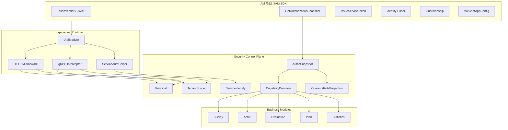
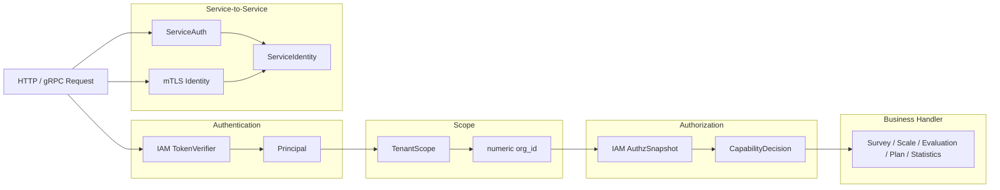

# IAM 与安全讲法

**本文回答**：对外介绍 qs-server 时，如何讲清楚 qs-server 与 IAM 项目的连接关系；IAM 在系统里负责什么，qs-server 自己又负责什么；如何讲 Principal、TenantScope、AuthzSnapshot、CapabilityDecision、ServiceAuth、mTLS、OperatorRoleProjection；面试中被问认证、授权、租户、服务间安全时，如何回答得清楚、可信、不越界。

---

## 1. 先给结论

> **qs-server 不自己实现一套完整 IAM，而是通过 IAMModule 嵌入 IAM SDK，把 IAM 的认证、授权快照、服务间认证、监护关系和应用配置能力接入进来；qs-server 再把这些外部安全事实投影成自己的 Principal、TenantScope、AuthzSnapshot、CapabilityDecision 和 ServiceIdentity，用于业务权限判断和运行时安全控制。**

压缩成一句话：

```text
IAM 管身份与权限真值；
qs-server 管业务边界与能力判断；
Security Plane 负责把两者连接成统一语言。
```

更短：

```text
JWT 证明“你是谁”，TenantScope 证明“你在哪个组织”，AuthzSnapshot 判断“你能做什么”。
```

---

## 2. 30 秒讲法

> **qs-server 和 IAM 的关系可以理解为：IAM 是身份和授权真值来源，qs-server 通过 IAMModule 把 IAM SDK 嵌入 runtime。HTTP 和 gRPC 请求进来后，先用 IAM TokenVerifier 验证 JWT，再投影出 Principal 和 TenantScope；需要业务权限时，qs-server 通过 IAM GetAuthorizationSnapshot 加载当前用户在当前 tenant/org 下的 resource/action 权限，再用 CapabilityDecision 判断是否允许操作。服务间调用则通过 ServiceAuth bearer token 和可选 mTLS identity match 来表达 ServiceIdentity。这里最重要的边界是：JWT roles 不是业务权限真值，本地 Operator roles 也不是权限真值，真正的 capability 判断基于 IAM AuthzSnapshot。**

适合用于：

- 面试官问“你怎么做认证授权？”
- 面试官问“IAM 项目和 qs-server 怎么协作？”
- 技术分享中讲安全控制面。
- 解释为什么不能直接用 JWT roles。

---

## 3. 1 分钟讲法

> **我把 qs-server 的安全链路拆成几层。**
>
> **第一层是认证。HTTP 和 gRPC 都通过 IAM 的 TokenVerifier 验证 token，token 验证后不会直接进入业务，而是先投影成 Principal，表达当前调用者是谁。**
>
> **第二层是租户范围。IAM token 里有 tenant_id，qs-server 通过 TenantScope 保存 raw tenant_id，同时把它解析成 numeric org_id。因为 QS 的业务数据是按机构组织隔离的，所以 protected route 通常要求 tenant_id 存在且能解析成 org_id。**
>
> **第三层是授权。qs-server 不直接用 JWT roles 判断业务能力，而是通过 IAM GetAuthorizationSnapshot 加载当前用户在当前 domain 下的 roles 和 resource/action permissions，然后用 CapabilityDecision 判断 read_questionnaires、manage_scales、evaluate_assessments 这类能力。**
>
> **第四层是服务间安全。collection-server、worker、apiserver 之间的 gRPC 调用可以通过 ServiceAuthHelper 注入 bearer metadata，同时 gRPC 层支持 mTLS identity seam 和 service_id 与证书 CN 的一致性检查。**
>
> **第五层是本地投影。Operator 本地 roles 只是把 IAM snapshot roles 投影到本地，用于展示和协作，不作为权限真值。**

---

## 4. 3 分钟讲法

> **qs-server 没有自己重新实现一套用户体系和权限系统，而是把 IAM 作为身份与授权的外部真值系统接入进来。但我没有让 IAM SDK 类型直接进入业务领域模型，而是通过 IAMModule 和 Security Control Plane 做边界隔离。**
>
> **在进程启动时，apiserver 和 collection-server 都会根据 IAMOptions 创建 IAMModule。apiserver 的 IAMModule 能力更完整，包括 TokenVerifier、ServiceAuthHelper、IdentityService、OperationAccountService、GuardianshipService、WeChatAppService 和 AuthzSnapshotLoader；collection-server 作为前台 BFF，能力更窄，主要是 TokenVerifier、ServiceAuthHelper、IdentityService、GuardianshipService 和 AuthzSnapshotLoader。这样每个进程只嵌入自己需要的 IAM 能力。**
>
> **请求进来以后，HTTP 侧先经过 JWT middleware，再通过 UserIdentityMiddleware 投影出 Principal 和 TenantScope。Principal 回答“谁在调用”，TenantScope 回答“在哪个 tenant/org 范围内调用”。gRPC 侧则通过 IAMAuthInterceptor 从 metadata 里提取 bearer token，使用 SDK TokenVerifier 验证，再把 user/account/tenant/session/token/roles 等写入 context。**
>
> **授权上，我不会直接用 JWT roles。因为 token roles 可能滞后，也无法完整表达 resource/action。qs-server 会通过 AuthzSnapshotLoader 调 IAM 的 GetAuthorizationSnapshot，拿到当前用户在当前 Casbin domain 下的 roles、permissions、authz_version，再通过 CapabilityDecision 判断某个业务能力是否允许。比如是否能管理量表、读取答卷、触发评估重试。**
>
> **服务间调用上，ServiceAuthHelper 负责生成 service token 并注入 gRPC metadata；mTLS identity seam 可以进一步校验 JWT service_id 和证书 CN 是否一致。本地 Operator roles 则是 IAM snapshot roles 的投影，方便后台展示和查询，但不作为权限真值。**
>
> **所以这套设计的核心不是“我用了 JWT”，而是把身份、租户范围、授权快照、业务 capability、服务身份和本地投影拆开，不把它们混成一个 roles 判断。**

---

## 5. IAM 与 qs-server 关系图



讲图顺序：

```text
先讲 IAM 是外部真值
再讲 IAMModule 是嵌入边界
再讲 Security Plane 是统一语言
最后讲业务模块只消费投影和决策，不直接依赖 IAM SDK
```

---

## 6. IAMModule 怎么讲

### 6.1 一句话

> **IAMModule 是 qs-server 接入 IAM SDK 的 runtime 组合根。**

它负责：

- 创建 IAM client。
- 创建 TokenVerifier。
- 创建 ServiceAuthHelper。
- 创建 IdentityService。
- 创建 GuardianshipService。
- 创建 AuthzSnapshotLoader。
- apiserver 侧还创建 OperationAccountService、WeChatAppService。
- 统一 Close，停止 token refresh / JWKS refresh / client。

### 6.2 apiserver 与 collection 的差异

| 能力 | apiserver | collection-server | 说明 |
| ---- | --------- | ----------------- | ---- |
| TokenVerifier | 有 | 有 | REST/gRPC token 验证 |
| ServiceAuthHelper | 有 | 有 | 服务间认证 |
| IdentityService | 有 | 有 | 用户资料查询 |
| GuardianshipService | 有 | 有 | 监护关系校验 |
| AuthzSnapshotLoader | 有 | 有 | 授权快照 |
| OperationAccountService | 有 | 无 | 后台运营账号能力 |
| WeChatAppService | 有 | 无 | 微信应用配置 |
| IAM Backpressure | 有 | 视集成而定 | 防止 IAM 慢拖垮主链路 |

### 6.3 为什么差异化

> **每个进程只嵌入自己需要的 IAM 能力。collection 是前台 BFF，不应该拥有后台 OperationAccount 和 WeChatAppConfig 管理能力；apiserver 是主业务中心，需要完整 IAM integration。**

---

## 7. Principal 怎么讲

### 7.1 一句话

> **Principal 回答“谁在调用”。**

Principal 包含：

- Kind。
- Source。
- UserID。
- AccountID。
- TenantID。
- SessionID。
- TokenID。
- Username。
- Roles。
- AMR。

### 7.2 来源

| 来源 | Source |
| ---- | ------ |
| HTTP JWT | http_jwt |
| gRPC JWT | grpc_jwt |
| service auth | service_auth |
| mTLS | mtls |

### 7.3 关键边界

Principal 不是：

- 权限判断结果。
- 本地用户聚合。
- Operator。
- AuthzSnapshot。
- CapabilityDecision。

讲法：

> **Principal 只告诉系统“当前调用者是谁”，不直接说明他能做什么。**

---

## 8. TenantScope 怎么讲

### 8.1 一句话

> **TenantScope 回答“当前调用发生在哪个租户/机构范围内”。**

它同时保存：

```text
TenantID：IAM token 中的原始 tenant_id
OrgID：QS 业务中使用的数字 org_id
HasNumericOrg：tenant_id 是否能解析成有效 org_id
```

### 8.2 为什么 tenant_id 和 org_id 不能混为一谈

IAM 的 tenant_id 是身份系统里的租户声明，可能是字符串。

QS 的 org_id 是业务数据隔离的数字组织 ID。

如果混用，会出现：

- 非数字 tenant 无法查业务数据。
- org_id=0 误当合法组织。
- 每个 handler 自己 ParseUint。
- Casbin domain 和 QS org 边界混乱。

### 8.3 面试讲法

> **我没有在业务 handler 里到处解析 tenant_id，而是把它统一投影成 TenantScope。这样既保留 IAM 原始 tenant，又能明确 QS 当前请求是否具有 numeric org scope。**

---

## 9. AuthzSnapshot 怎么讲

### 9.1 一句话

> **AuthzSnapshot 是 IAM 在一次请求中的授权快照，回答“这个人在这个组织范围内有哪些 resource/action”。**

它包含：

- Roles。
- Permissions。
- AuthzVersion。
- CasbinDomain。
- IAMAppName。

### 9.2 为什么不用 JWT roles

JWT roles 有几个问题：

| 问题 | 后果 |
| ---- | ---- |
| 可能滞后 | 用户权限变化后旧 token 仍携带旧 roles |
| 粒度粗 | 无法表达 resource/action |
| 无 authz_version | 无法判断权限版本 |
| 容易散落判断 | handler 里到处 if role == admin |
| 不适合多租户 domain | tenant/org 边界不清 |

### 9.3 为什么用 Snapshot

Snapshot 的好处：

- 单次请求加载一次。
- 资源动作清晰。
- 有 authz_version。
- 可缓存。
- 可用 singleflight。
- 可由外部 version 推进失效。
- middleware 和 application/authz 共用。

### 9.4 面试讲法

> **JWT 只做认证，AuthzSnapshot 做授权。token 里有 roles 也不能直接当业务权限真值，业务 capability 要看 IAM snapshot 里的 resource/action。**

---

## 10. CapabilityDecision 怎么讲

### 10.1 一句话

> **CapabilityDecision 把 IAM 的 resource/action 翻译成 qs-server 的业务能力判断。**

例如：

| Capability | 业务含义 |
| ---------- | -------- |
| read_questionnaires | 读取问卷 |
| manage_questionnaires | 管理问卷 |
| read_scales | 读取量表 |
| manage_scales | 管理量表 |
| read_answersheets | 读取答卷 |
| manage_evaluation_plans | 管理测评计划 |
| evaluate_assessments | 触发/重试测评 |

### 10.2 Decision outcome

| Outcome | 说明 |
| ------- | ---- |
| allowed | 允许 |
| denied | 权限不满足 |
| missing_snapshot | 缺少授权快照 |
| unknown_capability | 未知能力 |
| invalid_scope | scope 无效 |

### 10.3 为什么要 Decision

不用只返回 true/false，是因为排障需要知道：

- 是没加载 snapshot？
- 是 capability 未注册？
- 是权限不满足？
- 是 scope 无效？

讲法：

> **CapabilityDecision 让 permission denied 可解释，而不是只有一个 403。**

---

## 11. ServiceAuth 与 ServiceIdentity 怎么讲

### 11.1 一句话

> **ServiceAuth 解决服务间调用的身份问题，ServiceIdentity 描述哪个服务在调用。**

在 qs-server 中：

- collection-server 调 apiserver。
- worker 调 apiserver。
- apiserver 调 IAM。
- service auth 生成 bearer metadata。
- gRPC server 用 IAMAuthInterceptor 验证 token。

### 11.2 和用户 Principal 的区别

| Principal | ServiceIdentity |
| --------- | --------------- |
| 用户/服务认证主体 | 专门表达服务身份 |
| UserID/TenantID/Roles | ServiceID/Audience/CN |
| 用于用户请求和授权 | 用于服务间认证/ACL |
| 和 AuthzSnapshot 结合 | 和 service auth / mTLS 结合 |

### 11.3 面试讲法

> **用户访问和服务间访问不是一回事。用户侧用 Principal + TenantScope + AuthzSnapshot；服务间用 ServiceIdentity + ServiceAuth，必要时再加 mTLS identity match。**

---

## 12. mTLS 与 ACL 怎么讲

### 12.1 当前能力

可以讲：

- gRPC server 有 mTLS identity seam。
- IAMAuthInterceptor 支持 JWT service_id 与 mTLS CN 一致性检查。
- gRPC server 有 ACL/Audit interceptor seam。

要谨慎讲：

- ACL 文件加载和完整策略治理仍是后续增强。
- 不要把 seam 讲成完整 ACL 平台。

### 12.2 面试讲法

> **mTLS 解决连接和证书层面的服务身份，service auth 解决 bearer token 里的服务声明，两者可以做 identity match。至于服务是否能访问某个 gRPC method，则属于 ACL 层，当前系统有 seam，但完整 ACL 策略还应继续完善。**

---

## 13. OperatorRoleProjection 怎么讲

### 13.1 一句话

> **OperatorRoleProjection 是把 IAM roles 投影成本地 Operator 展示角色，但不作为权限真值。**

### 13.2 为什么需要

后台需要：

- 展示操作员角色。
- 查询 operator。
- 本地协作视图。
- 降低每次展示都查 IAM 的成本。

### 13.3 为什么不能用它做权限判断

因为投影可能：

- 延迟。
- 失败。
- 未触发。
- 和 IAM policy 暂时不一致。

权限判断仍应基于：

```text
AuthzSnapshot
```

### 13.4 面试讲法

> **本地 Operator roles 是读侧投影，不是权限真值。它服务展示和协作查询，业务 capability 仍基于 IAM AuthzSnapshot 判断。**

---

## 14. HTTP 安全链路怎么讲

HTTP 请求可以这样讲：

```text
JWTAuthMiddleware
  -> UserIdentityMiddleware
  -> RequireTenantID
  -> RequireNumericOrgScope
  -> ActiveOperator / AuthzSnapshot
  -> Capability middleware
  -> Handler
```

### 14.1 讲法

> **HTTP 入口先验证 token，再投影身份和租户范围，再加载授权快照，最后按业务 capability 判断。这个顺序很重要：没有身份就没有 scope，没有 scope 就不能加载正确 domain 下的 snapshot，没有 snapshot 就不能做 capability。**

### 14.2 collection 和 apiserver 差异

| 进程 | HTTP 安全重点 |
| ---- | ------------- |
| collection-server | 前台用户身份、租户、监护关系、AuthzSnapshot |
| apiserver | 后台 operator、ActiveOperator、Capability、internal governance |

---

## 15. gRPC 安全链路怎么讲

gRPC 请求可以这样讲：

```text
metadata bearer token
  -> IAMAuthInterceptor
  -> optional mTLS identity match
  -> context user/tenant injection
  -> AuthzSnapshotUnaryInterceptor
  -> handler
```

### 15.1 讲法

> **gRPC 不靠 HTTP header middleware，而是通过 metadata bearer token 和 interceptor 链完成认证。IAMAuthInterceptor 负责 token 验证和 claims 注入；AuthzSnapshotUnaryInterceptor 再加载 IAM 授权快照，供后续 internal service 使用。**

---

## 16. IAM 和业务模块的边界

不要让业务模块直接 import IAM SDK。

正确依赖方向：

```text
IAM SDK
  -> infra/iam wrapper
  -> IAMModule
  -> securityprojection / middleware / application port
  -> business use case
  -> domain
```

错误方向：

```text
domain -> IAM SDK
application -> raw IAM protobuf everywhere
handler -> raw IAM client
```

### 16.1 面试讲法

> **IAM SDK 可以嵌入 runtime，但 IAM SDK 类型不能侵入领域模型。Domain 只保存必要的外部引用 ID，具体认证、授权、监护关系和配置解析放在 infra/application 边界。**

---

## 17. 安全链路主图



讲图脚本：

```text
先认证，得到 Principal。
再确定 TenantScope。
再加载 AuthzSnapshot。
再做 CapabilityDecision。
服务间调用另走 ServiceIdentity。
业务模块只看到投影后的安全事实，不直接依赖 IAM SDK。
```

---

## 18. 常见面试追问

### 18.1 你怎么做认证？

回答：

> **HTTP 和 gRPC 都用 IAM TokenVerifier。HTTP 是 JWT middleware，gRPC 是 IAMAuthInterceptor，从 metadata 提取 bearer token。验证后不直接进业务，而是投影成 Principal。**

---

### 18.2 你怎么做多租户？

回答：

> **IAM token 里有 tenant_id，qs-server 用 TenantScope 保留原始 tenant_id，同时把它解析成业务 org_id。需要访问 QS 业务数据的接口要求 tenant_id 存在且能解析成 numeric org_id。这样 IAM 租户和 QS 组织范围不会在 handler 里散落解析。**

---

### 18.3 你怎么做授权？

回答：

> **不是直接用 JWT roles。qs-server 会通过 IAM GetAuthorizationSnapshot 拉取当前用户在当前 domain 下的 roles 和 permissions，然后用 application/authz 中的 CapabilityDecision 判断业务能力。**

---

### 18.4 为什么不用 JWT roles？

回答：

> **JWT roles 可能滞后，也不能完整表达 resource/action。比如管理量表、读取答卷、触发评估重试是不同资源动作，不能只看 token 里有没有 admin。**

---

### 18.5 IAM 不可用怎么办？

回答：

> **认证和授权这种安全关键链路不能默认放行。TokenVerifier 和 SnapshotLoader 有本地缓存/降级能力，但需要 snapshot 的请求如果加载失败，应按失败处理。IAM 慢也应通过 backpressure 和 timeout 保护主链路。**

---

### 18.6 本地 Operator roles 有什么用？

回答：

> **它是 IAM snapshot roles 的本地投影，用于后台展示和协作查询，不作为权限判断真值。业务权限仍然看 AuthzSnapshot。**

---

### 18.7 service auth 和 mTLS 怎么分工？

回答：

> **service auth 提供 bearer token 中的服务声明，mTLS 提供连接证书身份。两者可以做 identity match，比如 JWT service_id 和证书 CN 是否一致。真正的 service ACL 是另一个层面的访问控制。**

---

## 19. 不要这样讲

### 19.1 不要说“JWT roles 做权限”

不准确，也危险。

应该说：

```text
JWT 做认证和身份声明；
AuthzSnapshot 做授权；
CapabilityDecision 做业务能力判断。
```

### 19.2 不要说“IAM SDK 到处调用”

应该说：

```text
IAM SDK 通过 IAMModule 和 wrapper 嵌入 runtime；
业务层消费投影和 port，不直接依赖 SDK。
```

### 19.3 不要说“mTLS 开了就完全安全”

mTLS 只解决服务身份的一部分，不替代 user auth、service auth、ACL 和 capability。

### 19.4 不要说“Operator roles 是权限”

Operator roles 是投影，不是权限真值。

### 19.5 不要说“ACL 已完整落地”

当前可以说有 seam 和身份一致性检查，但完整 ACL 策略和文件加载仍要谨慎表达。

---

## 20. 讲图脚本

可以这样边画边讲：

```text
我把安全链路拆成三部分。

第一部分是用户身份。
请求进来后，HTTP 通过 JWT middleware，gRPC 通过 IAMAuthInterceptor，都会用 IAM TokenVerifier 验证 token。
验证后得到 Principal，它只说明当前调用者是谁。

第二部分是租户和授权。
Principal 里有 tenant_id，但 QS 业务需要 org_id，所以我用 TenantScope 统一解析。
然后通过 IAM 的 GetAuthorizationSnapshot 拿到 resource/action 权限，再用 CapabilityDecision 判断业务能力。
这里不直接用 JWT roles。

第三部分是服务间安全。
collection、worker、apiserver 之间的 gRPC 可以通过 ServiceAuthHelper 注入 bearer token，也可以结合 mTLS 做身份一致性检查。
本地 Operator roles 只是 IAM roles 的投影，服务展示和查询，不参与权限真值判断。
```

---

## 21. 最终背诵版

> **qs-server 和 IAM 的关系是：IAM 是身份和授权真值，qs-server 通过 IAMModule 把 IAM SDK 嵌入 runtime，然后把 IAM 的 token、tenant、roles、permissions、service token 等外部安全事实投影成自己的安全控制面模型。**
>
> **具体链路上，HTTP 和 gRPC 都先用 IAM TokenVerifier 验证 JWT，得到 Principal；再通过 TenantScope 确定当前 tenant/org 范围；需要业务授权时，通过 AuthzSnapshotLoader 调 IAM GetAuthorizationSnapshot，拿到当前用户在当前 domain 下的 resource/action 权限，再用 CapabilityDecision 判断是否能读取问卷、管理量表、读取答卷或触发评估。**
>
> **我不会直接用 JWT roles 做业务权限，也不会把本地 Operator roles 当权限真值。服务间调用则通过 ServiceAuth bearer token 和可选 mTLS identity match 表达 ServiceIdentity。整体上，IAM SDK 只在 runtime/infra/security 边界内使用，domain 不直接依赖 IAM SDK。**

---

## 22. 证据回链

| 判断 | 证据 |
| ---- | ---- |
| Security Control Plane 统一 Principal、TenantScope、AuthzSnapshot、CapabilityDecision、ServiceIdentity | `docs/03-基础设施/security/00-整体架构.md` |
| IAM 是认证和授权真值，JWT roles 不是 capability 真值 | `docs/03-基础设施/security/00-整体架构.md` |
| HTTP/gRPC 都有 snapshot 注入链路 | `docs/03-基础设施/security/00-整体架构.md` |
| ServiceIdentity 来自 service auth bearer metadata 与 mTLS identity | `docs/03-基础设施/security/00-整体架构.md` |
| OperatorRoleProjection 是本地投影，不是权限真值 | `docs/03-基础设施/security/00-整体架构.md` |
| IAMModule 嵌入边界分析 | `docs/05-专题分析/06-IAM嵌入式SDK边界分析.md` |
