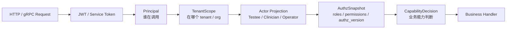

# 07-IAM 与安全讲法

**本文回答**：对外介绍 qs-server 时，如何把 IAM 接入、认证、授权、租户范围、业务主体、服务间调用、CapabilityDecision、AuthzSnapshot、模型管理权限和报告访问权限讲清楚；如何说明“JWT 证明你是谁，但不等于你能做什么”；为什么不能直接用 JWT roles 做业务授权；为什么能管理 MBTI 模型规则，不等于能查看用户 MBTI 报告；以及如何在面试中把安全边界讲得准确、不夸大。

---

## 30 秒结论

qs-server 的安全讲法不要停留在：

```text
接口加了 JWT 鉴权
```

更准确的主线是：

```text
Authentication
    证明调用者是谁

TenantScope
    证明调用发生在哪个 tenant / org 范围

Actor Projection
    证明调用者在测评业务中扮演什么角色

AuthzSnapshot
    从 IAM 拉取用户在当前 domain 下的 resource/action 权限快照

CapabilityDecision
    把 resource/action 权限映射为 qs-server 的业务能力判断

ServiceAuth
    保护 collection-server / qs-worker / qs-apiserver 之间的内部调用
```

一句话概括：

> **JWT 证明“你是谁”，TenantScope 证明“你在哪个组织范围”，AuthzSnapshot 判断“你能做什么”，CapabilityDecision 把 IAM 权限翻译成 qs-server 的业务能力。**

尤其要讲清：

```text
JWT roles 不是权限真值；
Operator 本地 roles 只是业务投影；
IAM 才是授权事实源；
能管理解释模型规则，不等于能查看用户测评报告；
服务身份和用户身份不能混用。
```

---

## 1. 为什么这一篇要更新

旧版安全讲法围绕：

```text
JWT
IAM SDK
AuthzSnapshot
CapabilityDecision
ServiceAuth
mTLS
OperatorRoleProjection
```

这些方向仍然正确。

但现在需要同步多解释模型平台化之后的新边界：

```text
Scale 是医学量表模型；
MBTI / BigFive 是同级解释模型；
Interpretation Model 是统一接入协议；
Evaluation 是通用测评执行引擎；
Report 是用户敏感数据；
模型规则管理权限和报告访问权限必须拆开。
```

因此安全讲法必须补充：

- `read_interpretation_models`。
- `manage_interpretation_models`。
- `read_interpretation_reports`。
- `trigger_evaluation`。
- `read_assessments`。
- `manage_assessment_repair`。
- `read_statistics`。
- `read_governance`。
- `manage_governance`。
- ServiceAuth 对 worker / collection / apiserver 内部调用的保护。
- Governance endpoint 的权限边界。

---

## 2. 10 秒讲法

> **qs-server 不直接用 JWT roles 做业务权限，而是用 IAM 验证身份，再通过 TenantScope、AuthzSnapshot 和 CapabilityDecision 判断当前用户能不能读答卷、看报告、管理模型或触发测评执行。**

---

## 3. 30 秒讲法

> **qs-server 通过 IAMModule 接入 IAM。请求进来后，HTTP / gRPC 中间件先验证 JWT 或 Service Token，投影成 Principal；再解析 TenantScope，确认当前调用发生在哪个 tenant / org 范围；如果业务接口需要授权，就通过 AuthzSnapshotLoader 向 IAM 拉取当前 subject 在 qs-server domain 下的 resource/action 权限快照；最后由 CapabilityDecision 判断是否具备具体业务能力，比如读取问卷、提交答卷、读取 Assessment、管理解释模型、读取用户报告或查看统计。这里不会直接信任 JWT roles，因为 roles 可能滞后、粒度粗，也无法表达 resource/action 和业务关系。**

适合用于：

- 面试官问“你怎么做认证授权？”
- 面试官问“IAM 项目和 qs-server 怎么协作？”
- 技术分享中讲安全控制面。
- 解释为什么不能直接用 JWT roles。

---

## 4. 1 分钟讲法

> **我把 qs-server 的安全边界分成五层。第一层是认证，验证 JWT 或服务 token，回答“谁在调用”；第二层是 TenantScope，回答“在什么租户和机构范围内调用”；第三层是业务主体投影，比如 Testee、Clinician、Operator，它回答“这个人在测评业务里扮演什么角色”；第四层是 AuthzSnapshot，它从 IAM 获取当前用户的 roles、permissions、authz_version 等授权快照；第五层是 CapabilityDecision，把 IAM 的 resource/action 权限翻译成 qs-server 的业务能力，比如 read questionnaires、submit answersheets、read reports、manage interpretation models。**
>
> **我不会说 JWT roles 就能做完整授权。JWT 更适合证明身份和携带少量声明，但业务权限要看 IAM 授权快照。尤其在测评系统中，答卷和报告涉及隐私数据，能管理 MBTI 模型规则，不等于能查看用户 MBTI 报告；能查看机构统计，也不等于能查看某个受试者的原始答卷。**

---

## 5. 3 分钟讲法

> **qs-server 没有自己重新实现一套用户体系和权限系统，而是把 IAM 作为身份与授权的外部真值系统接入进来。但我没有让 IAM SDK 类型直接进入业务领域模型，而是通过 IAMModule 和 Security Control Plane 做边界隔离。**
>
> **请求进来以后，HTTP 和 gRPC 都会先通过 IAM 的 TokenVerifier 验证 token。token 验证后不会直接进入业务，而是先投影成 Principal，表达当前调用者是谁；再通过 TenantScope 确定当前请求发生在哪个 tenant / org 范围内。对于需要业务授权的接口，qs-server 会通过 AuthzSnapshotLoader 调 IAM 的 GetAuthorizationSnapshot，拿到当前用户在当前 domain 下的 roles、permissions、authz_version，再通过 CapabilityDecision 判断某个业务能力是否允许。**
>
> **我不会直接用 JWT roles。因为 token roles 可能滞后，也无法完整表达 resource/action。比如管理解释模型、读取用户报告、查看统计、触发 Evaluation repair 是不同能力，不能只看 token 里有没有 admin。**
>
> **服务间调用上，collection-server、qs-worker、qs-apiserver 之间的 internal gRPC 通过 ServiceAuth 表达服务身份，必要时再叠加 mTLS identity match，校验 JWT service_id 和证书 CN / SAN 是否一致。本地 Operator roles 则是 IAM snapshot roles 的投影，方便后台展示和查询，但不作为权限真值。**
>
> **所以这套设计的核心不是“我用了 JWT”，而是把身份、租户范围、业务主体、授权快照、业务 capability、服务身份和本地投影拆开，不把它们混成一个 roles 判断。**

---

## 6. 安全主图



讲图脚本：

```text
这张图从左到右看。
JWT 或 Service Token 先解决认证问题。
认证通过后形成 Principal，说明谁在调用。
TenantScope 说明调用发生在哪个组织范围。
Actor Projection 说明这个 IAM 用户在 qs-server 业务中是什么角色。
AuthzSnapshot 从 IAM 拉取当前 resource/action 权限快照。
CapabilityDecision 最后判断能不能执行某个业务能力。
```

---

## 7. IAM 与 qs-server 的关系

### 7.1 一句话

> **IAM 是身份与授权事实源，qs-server 是测评业务系统；Security Plane 负责把 IAM 的外部安全事实投影成 qs-server 可用的业务安全语言。**

### 7.2 关系边界

| IAM 负责 | qs-server 负责 |
| -------- | -------------- |
| 账号与身份 | 测评业务主体 |
| Token 验证 | Principal 投影 |
| tenant / org 声明 | TenantScope 使用和业务隔离 |
| roles / permissions | CapabilityDecision |
| service token | Internal gRPC ServiceAuth |
| 授权版本 | snapshot cache / invalidation |
| 用户和权限事实源 | Survey / Evaluation / Report / Statistics 业务判断 |

### 7.3 不要讲错

不要说：

```text
qs-server 自己实现 IAM。
```

应该说：

```text
qs-server 通过 IAMModule 嵌入 IAM SDK，并把 IAM 事实投影成自己的安全控制面模型。
```

---

## 8. IAMModule 怎么讲

### 8.1 一句话

> **IAMModule 是 qs-server 接入 IAM SDK 的 runtime 组合根。**

它负责：

- 创建 IAM client。
- 创建 TokenVerifier。
- 创建 ServiceAuthHelper。
- 创建 IdentityService。
- 创建 ProfileLinkService。
- 创建 AuthzSnapshotLoader。
- apiserver 侧还可创建 OperationAccountService、WeChatAppService。
- 统一 Close，停止 token refresh / JWKS refresh / client。

### 8.2 apiserver 与 collection 的差异

| 能力 | apiserver | collection-server | 说明 |
| ---- | --------- | ----------------- | ---- |
| TokenVerifier | 有 | 有 | REST/gRPC token 验证 |
| ServiceAuthHelper | 有 | 有 | 服务间认证 |
| IdentityService | 有 | 有 | 用户资料查询 |
| ProfileLinkService | 有 | 有 | 监护关系校验 |
| AuthzSnapshotLoader | 有 | 有 | 授权快照 |
| OperationAccountService | 有 | 无 | 后台运营账号能力 |
| WeChatAppService | 有 | 无 | 微信应用配置 |
| IAM Backpressure | 有 | 视集成而定 | 防止 IAM 慢拖垮主链路 |

### 8.3 为什么差异化

> **每个进程只嵌入自己需要的 IAM 能力。collection 是前台 BFF，不应该拥有后台 OperationAccount 和 WeChatAppConfig 管理能力；apiserver 是主业务中心，需要更完整的 IAM integration。**

---

## 9. Authentication：证明你是谁

### 9.1 一句话

> **Authentication 解决身份真实性问题，不直接解决业务权限问题。**

### 9.2 输入

可能包括：

- 用户 JWT。
- Service token。
- internal bearer token。
- mTLS client identity。

### 9.3 输出

通常投影为：

```text
Principal
SubjectID
TenantID
OrgID
Token claims
Auth source
```

### 9.4 不要讲错

不要说：

```text
JWT 验证通过，所以可以访问所有接口。
```

应该说：

```text
JWT 验证通过，只说明请求来自一个已认证主体；能不能访问具体资源，还要经过授权判断。
```

---

## 10. Principal 怎么讲

### 10.1 一句话

> **Principal 回答“谁在调用”。**

Principal 可以包含：

- Kind。
- Source。
- UserID。
- AccountID。
- TenantID。
- SessionID。
- TokenID。
- Username。
- Roles。
- AMR。

### 10.2 来源

| 来源 | Source |
| ---- | ------ |
| HTTP JWT | http_jwt |
| gRPC JWT | grpc_jwt |
| service auth | service_auth |
| mTLS | mtls |

### 10.3 关键边界

Principal 不是：

- 权限判断结果。
- 本地用户聚合。
- Operator。
- AuthzSnapshot。
- CapabilityDecision。

讲法：

> **Principal 只告诉系统“当前调用者是谁”，不直接说明他能做什么。**

---

## 11. TenantScope：证明在哪个范围

### 11.1 一句话

> **TenantScope 解决多租户和组织范围问题。**

它通常同时保存：

```text
TenantID：IAM token 中的原始 tenant_id
OrgID：QS 业务中使用的数字 org_id
HasNumericOrg：tenant_id 是否能解析成有效 org_id
```

### 11.2 为什么 tenant_id 和 org_id 不能混为一谈

IAM 的 tenant_id 是身份系统里的租户声明，可能是字符串。

QS 的 org_id 是业务数据隔离的数字组织 ID。

如果混用，会出现：

- 非数字 tenant 无法查业务数据。
- org_id=0 误当合法组织。
- 每个 handler 自己 ParseUint。
- Casbin domain 和 QS org 边界混乱。

### 11.3 面试讲法

> **我没有在业务 handler 里到处解析 tenant_id，而是把它统一投影成 TenantScope。这样既保留 IAM 原始 tenant，又能明确 QS 当前请求是否具有 numeric org scope。**

---

## 12. Actor：业务主体不是 IAM 用户

### 12.1 一句话

> **IAM user 是身份，Actor 是测评业务中的角色。**

### 12.2 区别

| IAM | Actor |
| --- | ----- |
| 认证身份 | 业务主体 |
| user / account / tenant | testee / clinician / operator |
| token / roles / permissions | 受试者、医生、操作员、监护关系 |
| 授权事实源 | 业务协作关系和本地投影 |

### 12.3 为什么要区分

一个 IAM 用户可能在测评业务中是：

- 家长。
- 医生。
- 机构操作员。
- 管理员。
- 受试者本人。

不同业务角色访问的数据不同。

### 12.4 面试讲法

> **我不会把 IAM user 直接等同于 qs-server 的业务主体。IAM 负责身份和授权，Actor 负责测评业务里的角色投影，比如 Testee、Clinician、Operator。**

---

## 13. AuthzSnapshot：授权快照

### 13.1 一句话

> **AuthzSnapshot 是 qs-server 从 IAM 获取的当前授权快照，用于做本地业务能力判断。**

### 13.2 它包含什么

可能包括：

- subject。
- tenant。
- org。
- roles。
- permissions。
- resources。
- actions。
- authz_version。
- expire time。

### 13.3 为什么不用 JWT roles

JWT roles 有几个问题：

| 问题 | 说明 |
| ---- | ---- |
| 滞后 | 角色变更后 token 仍可能有效 |
| 粒度粗 | roles 不一定表达 resource/action |
| 无上下文 | 难表达 tenant/org/resource/scope |
| 不适合细粒度 | 读取报告、管理模型、触发修复是不同能力 |
| 难撤销 | token 生命周期内可能继续携带旧声明 |

### 13.4 面试讲法

> **JWT roles 可以作为身份声明或粗粒度提示，但不应该作为业务权限真值。qs-server 的业务授权基于 IAM AuthzSnapshot，里面有 resource/action 和 authz_version，CapabilityDecision 再把它映射到业务能力。**

---

## 14. CapabilityDecision：业务能力判断

### 14.1 一句话

> **CapabilityDecision 是把 IAM 权限快照翻译成 qs-server 业务能力的判断器。**

### 14.2 为什么需要它

IAM 通常表达：

```text
resource / action / scope
```

业务代码更想问：

```text
能不能读取这份问卷？
能不能提交答卷？
能不能读取这个 Assessment？
能不能查看用户报告？
能不能管理解释模型？
能不能触发 Evaluation retry？
能不能查看统计看板？
```

CapabilityDecision 就负责把两者衔接起来。

### 14.3 推荐能力

| Capability | 含义 |
| ---------- | ---- |
| `read_questionnaires` | 读取问卷 |
| `manage_questionnaires` | 管理问卷 |
| `submit_answersheets` | 提交答卷 |
| `read_answersheets` | 读取答卷 |
| `read_assessments` | 读取测评执行 |
| `trigger_evaluation` | 触发测评执行或重算 |
| `read_interpretation_models` | 读取解释模型规则或列表 |
| `manage_interpretation_models` | 管理 Scale / MBTI / BigFive 等规则 |
| `read_interpretation_reports` | 读取用户测评报告 |
| `read_statistics` | 查看统计读模型 |
| `read_governance` | 查看治理状态 |
| `manage_governance` | 执行治理、修复、warmup、replay 等操作 |

### 14.4 Decision outcome

| Outcome | 说明 |
| ------- | ---- |
| allowed | 允许 |
| denied | 权限不满足 |
| missing_snapshot | 缺少授权快照 |
| unknown_capability | 未知能力 |
| invalid_scope | scope 无效 |

讲法：

> **CapabilityDecision 让 permission denied 可解释，而不是只有一个 403。**

---

## 15. 多解释模型后的权限拆分

多解释模型后，权限边界必须更清楚。

### 15.1 规则管理权限

用于管理模型规则：

```text
read_interpretation_models
manage_interpretation_models
```

覆盖：

- Scale。
- MBTI。
- BigFive。
- 未来职业兴趣模型。
- 规则发布。
- 规则归档。
- 模型列表。
- Provider Context warmup。

### 15.2 报告访问权限

用于读取用户报告：

```text
read_interpretation_reports
```

覆盖：

- Scale report。
- MBTI report。
- BigFive report。
- 用户历史报告。
- 医生视角报告。
- 机构视角报告。

### 15.3 两者不能混用

最重要的安全边界：

> **能管理 MBTI 模型规则，不等于能查看用户 MBTI 报告。**

原因：

| 权限 | 风险 |
| ---- | ---- |
| manage_interpretation_models | 配置和发布规则，影响后续评估 |
| read_interpretation_reports | 读取用户敏感数据，涉及隐私 |

### 15.4 面试讲法

> **模型规则管理是配置权限，用户报告访问是隐私数据权限。二者必须拆开，否则后台配置人员可能越权查看用户报告。**

---

## 16. ServiceAuth 与 ServiceIdentity 怎么讲

### 16.1 一句话

> **ServiceAuth 保护 collection、worker、apiserver 之间的内部调用，ServiceIdentity 描述哪个服务在调用。**

### 16.2 典型调用

```text
collection-server -> qs-apiserver gRPC SaveAnswerSheet
qs-worker -> qs-apiserver internal gRPC CreateAssessmentFromAnswerSheet
qs-worker -> qs-apiserver internal gRPC CompleteInterpretation
qs-worker -> qs-apiserver internal gRPC GenerateReportFromInterpretation
scheduler -> internal service
```

### 16.3 Service identity 和 User identity 的区别

| 类型 | 说明 |
| ---- | ---- |
| User identity | 用户身份，回答“哪个用户在操作” |
| Service identity | 服务身份，回答“哪个服务在调用内部接口” |

服务身份不能替代用户身份。

例如：

```text
worker 可以代表系统推进 report generation，
但不能因为 worker 是可信服务，就绕过用户数据访问审计。
```

### 16.4 mTLS 与 Service Token

可以这样讲：

> **Service token 表达服务声明，mTLS 表达连接证书身份。更严格的做法是做 identity match，例如 token 中的 service_id 和证书 CN / SAN 一致。**

### 16.5 面试讲法

> **服务间调用和用户请求是两个安全问题。用户请求要校验 Principal、TenantScope 和 Capability；内部调用要校验 ServiceIdentity，必要时再做 mTLS identity match。**

---

## 17. mTLS 与 ACL 怎么讲

### 17.1 当前能力

可以讲：

- gRPC server 有 mTLS identity seam。
- IAMAuthInterceptor 支持 JWT service_id 与 mTLS CN 一致性检查。
- gRPC server 有 ACL / Audit interceptor seam。

要谨慎讲：

- ACL 文件加载和完整策略治理仍是后续增强。
- 不要把 seam 讲成完整 ACL 平台。

### 17.2 面试讲法

> **mTLS 解决连接和证书层面的服务身份，service auth 解决 bearer token 里的服务声明，两者可以做 identity match。至于服务是否能访问某个 gRPC method，则属于 ACL 层，当前系统有 seam，但完整 ACL 策略还应继续完善。**

---

## 18. OperatorRoleProjection 怎么讲

### 18.1 一句话

> **OperatorRoleProjection 是把 IAM roles 投影成本地 Operator 展示角色，但不作为权限真值。**

### 18.2 为什么需要

后台需要：

- 展示操作员角色。
- 查询 operator。
- 本地协作视图。
- 降低每次展示都查 IAM 的成本。

### 18.3 为什么不能用它做权限判断

因为投影可能：

- 延迟。
- 失败。
- 未触发。
- 和 IAM policy 暂时不一致。

权限判断仍应基于：

```text
AuthzSnapshot
```

### 18.4 面试讲法

> **本地 Operator roles 是读侧投影，不是权限真值。它服务展示和协作查询，业务 capability 仍基于 IAM AuthzSnapshot 判断。**

---

## 19. HTTP 安全链路怎么讲

HTTP 请求可以这样讲：

```text
JWTAuthMiddleware
  -> UserIdentityMiddleware
  -> RequireTenantID
  -> RequireNumericOrgScope
  -> ActiveOperator / AuthzSnapshot
  -> Capability middleware
  -> Handler
```

### 19.1 讲法

> **HTTP 入口先验证 token，再投影身份和租户范围，再加载授权快照，最后按业务 capability 判断。这个顺序很重要：没有身份就没有 scope，没有 scope 就不能加载正确 domain 下的 snapshot，没有 snapshot 就不能做 capability。**

### 19.2 collection 和 apiserver 差异

| 进程 | HTTP 安全重点 |
| ---- | ------------- |
| collection-server | 前台用户身份、租户、监护关系、AuthzSnapshot |
| apiserver | 后台 operator、ActiveOperator、Capability、internal governance |

---

## 20. gRPC 安全链路怎么讲

gRPC 请求可以这样讲：

```text
metadata bearer token
  -> IAMAuthInterceptor
  -> optional mTLS identity match
  -> context user/tenant injection
  -> AuthzSnapshotUnaryInterceptor
  -> handler
```

### 20.1 讲法

> **gRPC 不靠 HTTP header middleware，而是通过 metadata bearer token 和 interceptor 链完成认证。IAMAuthInterceptor 负责 token 验证和 claims 注入；AuthzSnapshotUnaryInterceptor 再加载 IAM 授权快照，供后续 internal service 使用。**

---

## 21. collection-server 的安全边界

collection-server 面向前台，所以它要做：

- 用户 token 验证或投影。
- TenantScope 提取。
- 监护关系校验。
- submit / query / wait-report 限流。
- SubmitGuard 幂等。
- DTO 校验。
- 调 apiserver 时带 service auth。

它不应该做：

- 直接保存 AnswerSheet。
- 直接写 Report。
- 直接绕过 apiserver 读敏感数据。
- 执行 Provider。
- 管理 Interpretation Model。

讲法：

> **collection 是前台保护层，不是授权事实源。它可以做入口校验和保护，但主业务授权和事实写入仍在 apiserver。**

---

## 22. worker 的安全边界

worker 通过 MQ 收到事件后，会通过 internal gRPC 回调 apiserver。

它要做：

- 验证事件 envelope。
- 解析 event_type。
- 使用 ServiceAuth 调 internal gRPC。
- 记录 handler 执行结果。
- Ack / Nack。

它不应该做：

- 接收前台用户请求。
- 直接写主业务库。
- 直接绕过 apiserver 状态机。
- 直接保存 InterpretReport。
- 直接访问用户报告给外部。

讲法：

> **worker 是可信的内部执行者，但不是业务授权中心；它通过服务身份驱动 apiserver，业务状态和审计仍在 apiserver 收口。**

---

## 23. apiserver 的安全边界

apiserver 是主业务中心，因此它要做：

- 用户认证中间件。
- ServiceAuth 中间件。
- TenantScope middleware。
- AuthzSnapshot 加载。
- CapabilityDecision。
- business handler guard。
- Audit log seam。
- Governance endpoint guard。
- Internal route guard。

它负责最终判断：

```text
这个请求能不能执行这个业务动作
```

尤其是：

- 后台管理接口。
- 报告读取接口。
- 解释模型管理接口。
- 统计查询接口。
- 维修 / 重试 / replay / warmup / governance 操作。

---

## 24. Governance endpoint 的安全边界

Governance endpoint 可能查看或操作：

- cache status。
- warmup target。
- outbox status。
- worker backlog。
- evaluation failure。
- report lag。
- retry / repair / replay。
- service degraded status。

因此不能开放给普通用户。

建议能力：

```text
read_governance
manage_governance
```

或更细：

```text
read_cache_status
manage_cache_warmup
read_event_status
manage_event_replay
read_evaluation_failures
manage_evaluation_repair
```

讲法：

> **Governance endpoint 不是普通健康检查，它可能暴露内部状态甚至触发修复动作，因此必须有独立 capability 和审计。**

---

## 25. Report 访问为什么敏感

InterpretReport 可能包含：

- 心理测评结果。
- 医学风险等级。
- MBTI TypeCode。
- TypeProfile。
- 医生建议。
- 受试者信息。
- 儿童或家庭相关数据。
- 历史趋势。

因此报告读取必须比模型规则读取更谨慎。

### 25.1 面试讲法

> **模型规则是配置资产，报告是用户敏感数据。管理规则的人不一定有权读取报告。**

---

## 26. Statistics 访问为什么也要授权

Statistics 看起来是聚合数据，但仍可能泄露：

- 某机构高风险人数。
- 某医生负责对象情况。
- 某模型结果分布。
- MBTI TypeCode 分布。
- 特定小范围人群的敏感统计。

因此统计接口也要有：

```text
read_statistics
```

并且按 tenant/org 范围过滤。

讲法：

> **统计不是天然安全的。聚合数据在小样本范围下仍可能暴露隐私，因此也要按 tenant/org 和 capability 控制。**

---

## 27. AI 解读的安全边界

如果未来接入 AI 解读，不应该直接进入基础主链路。

风险：

- prompt 泄露敏感信息。
- LLM 输出不可控。
- report source 不可追溯。
- 用户数据外传。
- 审核与回滚困难。

推荐讲法：

> **AI 解读应该作为基础报告之后的增强层，带 prompt_version、model_version、input_snapshot、review status 和审计记录，不应该替代基础 EvaluationResult 和 InterpretReport。**

---

## 28. 安全能力矩阵

| 场景 | 需要的能力 |
| ---- | ---------- |
| 前台提交答卷 | `submit_answersheets` + subject relationship |
| 前台查询提交状态 | request owner / guardian relationship |
| 读取问卷 | `read_questionnaires` |
| 读取答卷 | `read_answersheets` |
| 读取 Assessment | `read_assessments` |
| 查看用户报告 | `read_interpretation_reports` |
| 管理 Scale / MBTI / BigFive | `manage_interpretation_models` |
| 读取模型列表 | `read_interpretation_models` |
| 触发重算 / 修复 | `trigger_evaluation` / `manage_assessment_repair` |
| 查看统计 | `read_statistics` |
| 查看治理状态 | `read_governance` |
| 执行治理动作 | `manage_governance` |
| worker 回调 internal gRPC | `service:qs-worker` ServiceIdentity |
| collection 调 apiserver gRPC | `service:collection-server` ServiceIdentity |

---

## 29. 典型场景一：用户提交答卷

链路：

```text
JWT -> Principal -> TenantScope -> Guardian/Testee relationship -> submit_answersheets -> collection submit -> apiserver durable save
```

讲法：

> **提交答卷不仅是 token 有效，还要看这个用户是否对目标受试者和问卷有提交关系。collection 可以做前台关系校验，apiserver 仍负责主事实保存和业务边界。**

---

## 30. 典型场景二：医生查看报告

链路：

```text
JWT -> Principal -> TenantScope -> Clinician relationship -> read_interpretation_reports -> report query
```

讲法：

> **医生能查看报告，不是因为他登录了，而是因为他在当前 tenant/org 范围内与受试者或任务有关联，并且具备 read_interpretation_reports capability。**

---

## 31. 典型场景三：运营管理 MBTI 模型

链路：

```text
JWT -> Principal -> TenantScope -> Operator -> manage_interpretation_models -> MBTIModel publish / archive
```

讲法：

> **管理 MBTI 模型是配置权限，不代表能读取用户 MBTI 报告。**

---

## 32. 典型场景四：worker 推进报告生成

链路：

```text
MQ event -> worker handler -> ServiceAuth -> internal gRPC -> apiserver Evaluation service -> Report save
```

讲法：

> **worker 使用服务身份推进内部流程，不使用某个用户的 JWT。它可以驱动 report generation，但仍要经过 apiserver 的 internal service 边界、状态机和审计。**

---

## 33. 典型场景五：Governance 修复失败任务

链路：

```text
Operator JWT -> Principal -> TenantScope -> manage_governance / manage_assessment_repair -> repair action -> audit
```

讲法：

> **治理动作比读状态更敏感。查看失败列表和执行 repair/replay 应该是不同 capability，执行动作必须有审计。**

---

## 34. 常见面试追问

### 34.1 你们怎么做认证授权？

回答：

> **认证上，通过 IAM TokenVerifier 验证 JWT 或 service token，形成 Principal；租户范围通过 TenantScope 表达；授权上，不直接信 JWT roles，而是通过 AuthzSnapshotLoader 从 IAM 获取 resource/action 权限快照，再由 CapabilityDecision 判断具体业务能力。**

---

### 34.2 为什么不用 JWT roles 直接做授权？

回答：

> **JWT roles 可能滞后，粒度也太粗。比如管理解释模型、读取用户报告、查看统计、触发 Evaluation repair 是不同能力，不能靠一个 admin role 粗放判断。业务授权应该看 IAM 里的 resource/action 和 authz_version。**

---

### 34.3 Operator roles 有什么用？

回答：

> **Operator roles 是 qs-server 本地业务投影，用于展示、协作和本地查询，不是授权事实源。真正的授权事实源仍然是 IAM。**

---

### 34.4 collection-server 是否能绕过 apiserver 权限？

回答：

> **不能。collection 是前台保护层，可以做入口校验和幂等保护，但主业务事实和最终授权仍应在 apiserver 收口。collection 调 apiserver 需要 ServiceAuth，同时业务请求仍携带用户身份和 TenantScope。**

---

### 34.5 worker 是内部服务，是否可以直接写报告？

回答：

> **不建议。worker 可以用 ServiceAuth 调 internal gRPC，但 Report 保存、Assessment 状态机和 Outbox 仍应由 apiserver 内部业务服务完成。这样状态、事务和审计边界统一。**

---

### 34.6 能管理 MBTI 模型，是否能看用户 MBTI 报告？

回答：

> **不能默认如此。模型管理是配置权限，报告访问是隐私数据权限。前者用 `manage_interpretation_models`，后者用 `read_interpretation_reports`。这两个 capability 必须拆开。**

---

### 34.7 ServiceAuth 和用户授权有什么区别？

回答：

> **ServiceAuth 证明哪个服务在调用内部接口，用户授权证明哪个用户能访问哪个业务资源。worker 或 collection 的服务身份不能替代用户权限。**

---

### 34.8 统计数据也需要权限吗？

回答：

> **需要。统计虽然是聚合数据，但仍可能泄露某个机构或小范围人群的敏感测评分布，所以至少要按 tenant/org 过滤，并需要 `read_statistics` capability。**

---

### 34.9 IAM 不可用怎么办？

回答：

> **认证和授权这种安全关键链路不能默认放行。TokenVerifier 和 SnapshotLoader 可以有本地缓存或降级策略，但需要 snapshot 的请求如果加载失败，应按失败处理。IAM 慢也应通过 backpressure 和 timeout 保护主链路。**

---

### 34.10 service auth 和 mTLS 怎么分工？

回答：

> **service auth 提供 bearer token 中的服务声明，mTLS 提供连接证书身份。两者可以做 identity match，比如 JWT service_id 和证书 CN 是否一致。真正的 service ACL 是另一个层面的访问控制。**

---

## 35. 不要这样讲

### 35.1 不要说“JWT 验过就安全”

应该说：

```text
JWT 只解决认证，业务权限还要看 AuthzSnapshot 和 CapabilityDecision。
```

### 35.2 不要说“JWT roles 就是权限”

应该说：

```text
JWT roles 只是声明或提示，权限真值在 IAM resource/action 快照。
```

### 35.3 不要说“Operator 本地角色就是权限真值”

应该说：

```text
Operator roles 是本地投影，授权以 IAM 为准。
```

### 35.4 不要说“内部接口不需要安全”

应该说：

```text
internal gRPC 也需要 ServiceAuth，最好配合 mTLS identity match。
```

### 35.5 不要说“管理模型就能看报告”

应该说：

```text
模型规则管理和用户报告访问必须拆开。
```

### 35.6 不要说“统计数据不敏感”

应该说：

```text
统计数据也要按 tenant/org 和 capability 控制，小样本统计仍可能泄露隐私。
```

### 35.7 不要说“AI 解读可以直接替换基础报告”

应该说：

```text
AI 解读是增强层，不应该替代基础 EvaluationResult 和 InterpretReport 主事实。
```

### 35.8 不要说“IAM SDK 到处调用”

应该说：

```text
IAM SDK 通过 IAMModule 和 wrapper 嵌入 runtime；业务层消费投影和 port，不直接依赖 SDK。
```

### 35.9 不要说“mTLS 开了就完全安全”

mTLS 只解决服务身份的一部分，不替代 user auth、service auth、ACL 和 capability。

### 35.10 不要说“ACL 已完整落地”

当前可以说有 seam 和身份一致性检查，但完整 ACL 策略和文件加载仍要谨慎表达。

---

## 36. 安全讲法和多解释模型的关系

多解释模型之后，安全不只保护“量表”。

需要保护：

- Scale 规则。
- MBTI 规则。
- BigFive 规则。
- ModelRef。
- Provider Context。
- EvaluationResult。
- InterpretReport。
- Statistics ReadModel。
- Governance endpoint。

统一口径：

```text
规则资产权限
执行事实权限
报告访问权限
统计访问权限
治理操作权限
```

对应能力：

```text
read_interpretation_models
manage_interpretation_models
read_assessments
trigger_evaluation
read_interpretation_reports
read_statistics
read_governance
manage_governance
```

---

## 37. 安全讲法和事件链路的关系

事件链路里也有安全边界：

```text
worker consume event
  -> ServiceAuth
  -> internal gRPC
  -> apiserver application service
```

不要让 worker 绕过：

- internal auth。
- state machine。
- repository boundary。
- audit seam。
- governance guard。

讲法：

> **事件是异步触发信号，不是绕过安全和业务边界的通行证。**

---

## 38. 安全讲法和高并发的关系

安全依赖也需要 resilience：

- IAM 慢不能让请求无限堆积。
- AuthzSnapshot cache 需要 TTL 和 version。
- 安全相关接口应 fail closed。
- 非关键治理查询可按策略 degraded。
- ServiceAuth 校验失败必须拒绝。

讲法：

> **安全链路也要做 backpressure 和超时，但不能为了可用性随便放开权限。**

---

## 39. IAM 和业务模块的边界

不要让业务模块直接 import IAM SDK。

正确依赖方向：

```text
IAM SDK
  -> infra/iam wrapper
  -> IAMModule
  -> securityprojection / middleware / application port
  -> business use case
  -> domain
```

错误方向：

```text
domain -> IAM SDK
application -> raw IAM protobuf everywhere
handler -> raw IAM client
```

### 39.1 面试讲法

> **IAM SDK 可以嵌入 runtime，但 IAM SDK 类型不能侵入领域模型。Domain 只保存必要的外部引用 ID，具体认证、授权、监护关系和配置解析放在 infra/application 边界。**

---

## 40. 讲图脚本

可以这样边画边讲：

```text
我把安全链路拆成三部分。

第一部分是用户身份。
请求进来后，HTTP 通过 JWT middleware，gRPC 通过 IAMAuthInterceptor，都会用 IAM TokenVerifier 验证 token。
验证后得到 Principal，它只说明当前调用者是谁。

第二部分是租户和授权。
Principal 里有 tenant_id，但 QS 业务需要 org_id，所以我用 TenantScope 统一解析。
然后通过 IAM 的 GetAuthorizationSnapshot 拿到 resource/action 权限，再用 CapabilityDecision 判断业务能力。
这里不直接用 JWT roles。

第三部分是服务间安全。
collection、worker、apiserver 之间的 gRPC 可以通过 ServiceAuthHelper 注入 bearer token，也可以结合 mTLS 做身份一致性检查。
本地 Operator roles 只是 IAM roles 的投影，服务展示和查询，不参与权限真值判断。
```

---

## 41. 最终背诵版

> **qs-server 的安全设计不是简单“接口加 JWT”。我把它分成认证、租户范围、业务主体、授权快照和业务能力判断五层：JWT 或 Service Token 先通过 IAM TokenVerifier 验证，形成 Principal；TenantScope 确定当前 tenant/org；Actor 投影说明这个人在测评业务里是 testee、clinician 还是 operator；AuthzSnapshot 从 IAM 拉取 resource/action 权限快照；CapabilityDecision 再判断能不能读取问卷、提交答卷、读取报告、管理解释模型、查看统计或执行治理动作。**
>
> **这里最重要的是不要把 JWT roles 当成业务权限真值。JWT 证明“你是谁”，TenantScope 证明“你在哪个组织”，AuthzSnapshot 才判断“你能做什么”。Operator 本地 roles 只是业务投影，不是授权事实源。多解释模型之后，还要把模型规则管理和用户报告访问拆开：能管理 MBTI 模型规则，不等于能查看用户 MBTI 报告。服务间调用则通过 ServiceAuth 和可选 mTLS identity match 保护，worker 和 collection 的服务身份不能替代用户权限。**

---

## 42. 证据回链

| 判断 | 证据 |
| ---- | ---- |
| Security Control Plane 统一 Principal、TenantScope、AuthzSnapshot、CapabilityDecision、ServiceIdentity | `docs/03-基础设施/security/00-整体架构.md` |
| IAM 是认证和授权真值，JWT roles 不是 capability 真值 | `docs/03-基础设施/security/00-整体架构.md` |
| HTTP/gRPC 都有 snapshot 注入链路 | `docs/03-基础设施/security/00-整体架构.md` |
| ServiceIdentity 来自 service auth bearer metadata 与 mTLS identity | `docs/03-基础设施/security/00-整体架构.md` |
| OperatorRoleProjection 是本地投影，不是权限真值 | `docs/03-基础设施/security/00-整体架构.md` |
| IAMModule 嵌入边界分析 | `docs/05-专题分析/06-IAM嵌入式SDK边界分析.md` |
| 多解释模型扩展后的 capability | `docs/05-专题分析/08-多解释模型扩展专题--从Scale到MBTI.md` |
| Evaluation 通用执行引擎 | `docs/05-专题分析/09-Evaluation通用执行引擎专题.md` |
| 解释模型事件与缓存治理 | `docs/05-专题分析/10-解释模型事件与缓存治理专题.md` |
| 三进程架构 | `docs/06-宣讲/02-三进程架构讲法.md` |
| 异步测评执行链路 | `docs/06-宣讲/04-异步评估链路讲法.md` |
| 高并发治理 | `docs/06-宣讲/06-高并发治理讲法.md` |
