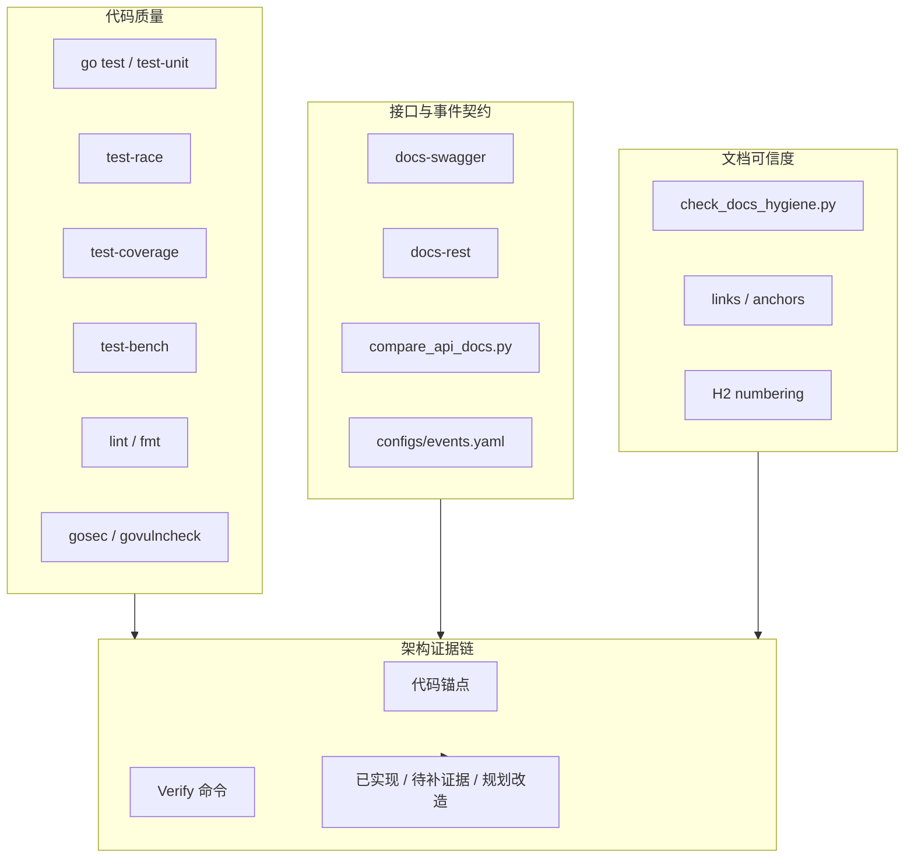
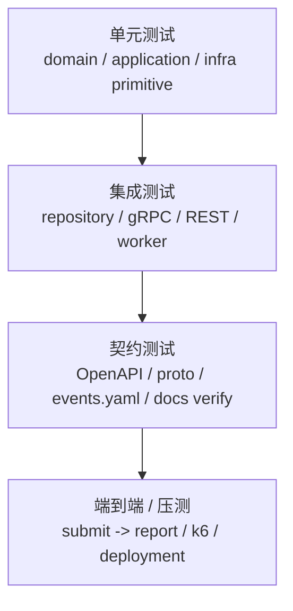

# 08-工程质量与测试讲法

**本文回答**：对外介绍 qs-server 时，如何证明这不是“纸面架构”；如何把单元测试、集成测试、契约校验、文档卫生、REST/Swagger 对比、lint、安全扫描、race、coverage、CI/CD、架构证据链和风险边界组织成一套可信的工程质量讲法；在新版“多解释模型测评平台”主线下，如何证明 Survey / Interpretation Model / Concrete Models / Evaluation、异步测评执行、Outbox、高并发治理、IAM 安全、统计读侧和 Governance 不是只存在于文档里。

---

## 30 秒结论

qs-server 的工程质量不要只讲：

```text
我写了测试
```

而要讲成一条证据链：

```text
代码能测
契约能比
文档能校验
架构能回链
风险能说明
```

最重要的一句话：

> **工程质量不是说“用了哪些工具”，而是能把“设计结论”回链到代码、测试、契约、文档校验和 Verify 命令。**

新版宣讲中，质量证据要覆盖这些核心主线：

```text
Survey 作答事实
Interpretation Model 接入协议
Concrete Models 具体规则
Evaluation 通用执行引擎
异步测评执行链路
Event + Outbox
Resilience 高并发治理
Security / IAM
Statistics ReadModel
Observability / Governance
```

一句话概括：

> **如果某个架构点无法回链到源码、测试、契约或验证命令，就不要把它讲成已落地能力。**

---

## 1. 为什么这一篇要更新

旧版文档的质量主线基本正确：

```text
go test
lint
security
swagger / api/rest 对比
docs-hygiene
代码锚点
Verify 命令
风险边界
```

但需要同步三类变化。

### 1.1 业务主线变了

旧版仍然围绕：

```text
Survey / Scale / Evaluation
异步评估
CalculateAnswerSheetScore
assessment.submitted / assessment.interpreted
```

新版必须围绕：

```text
Survey / Interpretation Model / Concrete Models / Evaluation
异步测评执行
ModelRef / Provider / Context / EvaluationResult / InterpretReport
assessment.created / assessment.completed / interpretation.completed / report.generated
```

因此测试讲法也要更新：

```text
不是只测 Scale pipeline，
而是要测 Evaluation Engine 如何通过 Provider 执行不同解释模型。
```

---

### 1.2 证据链要区分“已实现 / 待补证据 / 规划改造”

多解释模型平台化之后，文档里有一部分是当前代码已落地能力，有一部分是下一阶段要补的设计。

宣讲时必须区分：

| 状态 | 讲法 |
| ---- | ---- |
| 已实现 | 有源码、测试、配置、Verify 命令支撑 |
| 待补证据 | 有局部代码或设计，但测试/文档/观测还不完整 |
| 规划改造 | 当前作为路线，不讲成现状 |

---

### 1.3 工程质量要覆盖“多解释模型 + 治理闭环”

新版项目不是单纯 CRUD，也不是单纯量表系统。

所以质量证据不能只覆盖接口和 repository，还要覆盖：

- Provider contract。
- ModelRef 解析。
- Context loading。
- EvaluationRun。
- EvaluationResult。
- InterpretReport。
- interpretation events。
- interpretation-model.changed。
- model_type metrics。
- cache governance。
- capability matrix。

---

## 2. 10 秒讲法

> **我用代码测试、接口契约对比、文档卫生检查和架构证据链证明项目不是纸面设计；哪些没有完整证据的能力，我会明确讲成待补证据或后续演进。**

---

## 3. 30 秒讲法

> **我在 qs-server 里把工程质量分成几层：代码层用 `go test`、单元测试、race、coverage、benchmark 覆盖核心模块；静态质量层用 lint、fmt、maintainability、gosec、govulncheck 做代码和安全检查；接口契约层用 swagger 生成 OpenAPI，再用脚本对比 `api/rest` 和 swagger 的 path/method 是否一致；文档可信度层用 docs-hygiene 检查 Markdown 链接、锚点和章节编号；架构证据层要求每个核心设计都能回链到源码、测试、配置和 Verify 命令。这样我介绍 Survey、Interpretation Model、Evaluation、Outbox、Resilience、Security 和 Statistics 时，不是只讲图，而是能说明证据在哪里。**

---

## 4. 1 分钟讲法

> **这个项目文档比较多，架构也比较复杂，所以我不希望它变成“看起来很完整，实际上不可验证”的纸面架构。**
>
> **在代码层面，Makefile 提供统一入口：`test`、`test-unit`、`test-coverage`、`test-race`、`test-bench`、`lint`、`security`、`docs-verify` 等。核心模块比如 Survey、Evaluation、Statistics、Event、Redis、Resilience、Security 都应该在各自文档里给出源码锚点和 Verify 命令。**
>
> **在契约层面，REST 文档不是手写后就不管了，而是通过 `docs-swagger` 生成 swagger，再通过 `docs-rest` 生成 `api/rest` 的 OpenAPI 摘要，最后 `docs-verify` 比较 `api/rest` 和 swagger 的 path/method 覆盖。**
>
> **在文档层面，`docs-hygiene` 检查 Markdown 相对链接、fragment anchor 和 H2 编号，避免文档引用漂移。**
>
> **在宣讲层面，我会主动标明哪些能力是已实现，哪些是待补证据，哪些是规划改造。比如 MBTIProvider、完整 ACL、完整压测报告、operating 平台，如果代码证据不完整，就不能讲成当前已落地。**

---

## 5. 3 分钟讲法

> **我在 qs-server 里比较重视工程证据，因为这个项目不只是写接口，还涉及 DDD 边界、异步测评执行、Outbox、高并发治理、IAM 安全、统计读侧、Redis 缓存治理和多解释模型扩展。如果没有质量门禁，很容易变成文档和代码各说各话。**
>
> **第一层是代码级测试和质量检查。Makefile 统一了 `go test`、短测试、覆盖率、race、benchmark、lint、fmt、安全扫描等入口。开发时不需要记一堆命令，每类质量动作都有标准入口。**
>
> **第二层是契约校验。REST 接口通过 swag 生成 swagger，再生成 `api/rest/apiserver.yaml` 和 `api/rest/collection.yaml`。为了防止手写文档和真实 swagger 漂移，`compare_api_docs.py` 会比较 OpenAPI 和 swagger 里的 method/path 覆盖。**
>
> **第三层是文档校验。这个项目文档体系很重，所以 `check_docs_hygiene.py` 会扫描 docs 下的 Markdown，检查相对链接是否存在、fragment anchor 是否能找到、H2 编号是否连续。这样文档不是纯说明稿，而是可以被 CI 检查的工程资产。**
>
> **第四层是架构证据链。每篇业务模块、基础设施和专题文档都应该回链代码锚点和 Verify 命令。比如 Outbox 文档应指向 eventing、outbox store、relay 和 worker handler；Resilience 文档应指向 RateLimit、SubmitQueue、SubmitGuard、Backpressure、LockLease 和 metrics；Security 文档应指向 Principal、OrgScope、AuthzSnapshot、CapabilityDecision、ServiceIdentity；Evaluation 文档应指向 Assessment、EvaluationRun、Provider contract、EvaluationResult 和 InterpretReport。**
>
> **最后，我会主动承认当前证据边界：没有完整压测报告，就不承诺固定 QPS；重试次数依赖 MQ 或组件配置，就不口头说死；某些能力如果只是 seam 或规划改造，就不讲成完整落地。这个边界感反而能让项目介绍更可信。**

---

## 6. 工程质量主图



讲图脚本：

```text
代码层保证能跑；
契约层保证接口和事件不漂；
文档层保证链接和章节不坏；
证据层保证宣讲结论能回链到源码、测试和验证命令。
```

---

## 7. 第一层：代码测试怎么讲

### 7.1 Makefile 统一入口

Makefile 里有这些典型入口：

```text
test
test-unit
test-coverage
test-race
test-bench
test-all
```

讲法：

> **我没有把测试命令散落在 README 里，而是通过 Makefile 统一入口。这样不同质量动作有固定命令，也方便接入 CI。**

---

### 7.2 不同测试的作用

| 命令 | 作用 |
| ---- | ---- |
| `make test` | 跑全部 Go tests |
| `make test-unit` | 跑 short unit tests |
| `make test-coverage` | 生成覆盖率 |
| `make test-race` | race detector |
| `make test-bench` | benchmark |
| `make test-all` | 组合完整测试动作 |

---

### 7.3 面试讲法

> **我通常会按改动范围跑对应 package tests；提交前跑全量或关键链路 tests。比如改 Evaluation Engine，就跑 application/evaluation 和 domain/evaluation；改 Outbox，就跑 eventing、mongo/mysql outbox 和 worker handler；改接口契约，就跑 docs-rest/docs-verify。**

---

## 8. 第二层：静态质量怎么讲

Makefile 中包含：

```text
lint
fmt
fmt-check
maintainability-lint
security-govulncheck
security-gosec
```

### 8.1 lint / fmt

作用：

- 统一代码格式。
- 提前发现静态问题。
- 降低 review 噪音。

### 8.2 security

作用：

- govulncheck：检查 Go 依赖和标准库漏洞。
- gosec：检查常见 Go 安全问题。

### 8.3 面试讲法

> **静态质量工具不是为了好看，而是把格式、安全和可维护性问题前置到 CI/Makefile 阶段，避免靠人工 review 才发现。**

---

## 9. 第三层：REST 契约校验怎么讲

这个项目的 REST 契约有两个层面：

```text
swagger generated from code
api/rest OpenAPI docs
```

### 9.1 docs-swagger

`docs-swagger` 会对 apiserver 和 collection-server 运行 swag：

```text
swag init ...
```

生成内部 swagger 文件。

### 9.2 docs-rest

`docs-rest` 会从 swagger 生成：

```text
api/rest/apiserver.yaml
api/rest/collection.yaml
```

### 9.3 docs-verify

`docs-verify` 包含：

```text
docs-rest
docs-hygiene
compare_api_docs.py
```

`compare_api_docs.py` 会比较：

- `api/rest/*.yaml`。
- `internal/*/docs/swagger.json`。

重点比较：

```text
path / method coverage
```

### 9.4 面试讲法

> **接口文档不是手写完就算数。我通过 swagger 生成和 OpenAPI 对比，确保 api/rest 里的 path/method 没有和代码生成物漂移。**

---

## 10. 第四层：事件契约校验怎么讲

新版主链路高度依赖事件：

```text
answersheet.submitted
assessment.created
assessment.completed
interpretation.completed / interpretation.failed
report.generated
```

因此事件契约也必须纳入质量证据。

### 10.1 事件契约入口

```text
configs/events.yaml
```

它应该定义：

- event type。
- topic。
- aggregate。
- domain。
- delivery class。
- handler。

### 10.2 需要校验什么

| 检查 | 目的 |
| ---- | ---- |
| event type 是否唯一 | 防止事件语义冲突 |
| delivery class 是否合理 | 区分 best_effort / durable_outbox |
| handler 是否注册 | 防止发布后没人消费 |
| topic/channel 是否存在 | 防止路由错误 |
| 新旧事件是否混用 | 禁止 `assessment.submitted / assessment.interpreted` 回流 |

### 10.3 面试讲法

> **异步系统不能只测 handler。事件契约也要成为质量对象：events.yaml 里声明的 event type、topic、delivery class 和 handler 要能和 worker registry 对上，否则很容易出现事件发出去了但没人消费。**

---

## 11. 第五层：文档卫生怎么讲

项目文档很多，如果不检查，链接很容易坏。

`check_docs_hygiene.py` 检查：

1. Markdown 相对链接是否存在。
2. Markdown fragment anchor 是否能对应真实 heading。
3. 如果文件使用编号 H2，编号是否连续、不重复、不跳号。
4. 默认排除 docs/_archive。

### 11.1 为什么重要

因为这个项目依赖大量文档讲清：

- 业务边界。
- 架构决策。
- 运行时。
- 基础设施。
- 接口与运维。
- 专题分析。
- 宣讲。

如果链接和锚点坏了，文档体系就不可信。

### 11.2 面试讲法

> **我把文档也当作工程资产处理，而不是纯说明稿。docs-hygiene 会检查链接、锚点和编号，docs-verify 会把接口契约和 swagger 对齐。这样文档能持续跟代码协同演进。**

---

## 12. 第六层：架构证据链怎么讲

对外讲架构时，要避免：

```text
我设计了 Outbox
我设计了 Resilience
我设计了 Security
我设计了多解释模型平台
```

但没有证据。

更好的讲法是：

```text
每个设计结论都有代码锚点和 Verify 命令
```

例如：

| 架构点 | 证据 |
| ------ | ---- |
| Survey / Interpretation Model / Evaluation 拆分 | domain/application packages + 专题文档 |
| 异步测评执行 | worker handler + internal gRPC + Evaluation Engine |
| Provider 执行 | ModelRef / Provider / Context / EvaluationResult tests |
| Outbox | outboxcore + mysql/mongo outbox store + relay tests |
| Event | events.yaml + dispatcher + handler registry |
| Resilience | RateLimit + SubmitQueue + SubmitGuard + Backpressure + LockLease + metrics |
| Security | Principal / OrgScope / AuthzSnapshot / CapabilityDecision / ServiceIdentity tests |
| Statistics | ReadService + SyncService + BehaviorProjector |
| REST 契约 | swagger + api/rest + compare_api_docs |
| 文档体系 | check_docs_hygiene |

---

## 13. 测试金字塔怎么讲



### 13.1 单元测试

适合：

- domain 状态机。
- value object。
- policy。
- Provider contract。
- ModelRef parser。
- cache key builder。
- outbox core。
- capability decision。

### 13.2 集成测试

适合：

- repository。
- Mongo/MySQL outbox。
- gRPC service。
- REST handler。
- worker handler。
- Redis lock/rate limit adapter。

### 13.3 契约测试

适合：

- OpenAPI / swagger。
- proto service registry。
- events.yaml handler registry。
- docs links/anchors。

### 13.4 端到端和压测

适合：

- submit -> assessment -> interpretation -> report。
- Outbox -> MQ -> worker。
- high QPS submit。
- wait-report。
- worker backlog。

当前如果没有完整压测报告，不应过度承诺。

---

## 14. 关键链路应该怎么测

### 14.1 答卷提交链路

重点测：

- DTO validation。
- SubmitQueue accepted/full/duplicate。
- SubmitGuard done/in-flight。
- gRPC SaveAnswerSheet。
- AnswerSheet durable submit。
- `answersheet.submitted` outbox。

### 14.2 异步测评执行链路

旧版写法是：

```text
CalculateAnswerSheetScore
assessment.submitted
EvaluateAssessment
assessment.interpreted
```

新版应测试：

- `answersheet.submitted` handler。
- `CreateAssessmentFromAnswerSheet`。
- `assessment.created` event。
- `CompleteAssessment`。
- `assessment.completed` event。
- `CompleteInterpretation`。
- ModelRef resolve。
- Provider.LoadContext。
- Provider.Evaluate。
- EvaluationResult save。
- `interpretation.completed / interpretation.failed`。
- `GenerateReportFromInterpretation`。
- InterpretReport save。
- `report.generated`。

### 14.3 Provider 链路

重点测：

- ModelRef 无效。
- provider not found。
- context load failed。
- questionnaire mismatch。
- provider evaluate failed。
- provider evaluate success。
- result normalized。
- report input snapshot。

### 14.4 Outbox 链路

重点测：

- stage records。
- claim due events。
- mark published。
- mark failed。
- retry delay。
- stale publishing。
- publisher mode。

### 14.5 Resilience 链路

重点测：

- rate_limit allowed/rate_limited。
- queue_accepted / queue_full。
- backpressure_timeout。
- lock_contention。
- idempotency_hit。
- duplicate_skipped。
- metrics outcome。

### 14.6 Security 链路

重点测：

- Principal projection。
- OrgScope org_id。
- AuthzSnapshot load。
- Capability allowed/denied。
- missing_snapshot。
- unknown_capability。
- service identity projection。
- model/report capability split。

### 14.7 Statistics 链路

重点测：

- BehaviorProjector。
- pending retry。
- SyncService window。
- QueryCache hit/miss。
- MBTI TypeCode distribution read model。
- repair/rebuild。

---

## 15. 工程质量怎么和宣讲绑定

宣讲时不要孤立讲测试。

要绑定业务问题：

| 业务/架构问题 | 工程质量证据 |
| ------------- | ------------ |
| 答卷不能丢 | durable submit + outbox tests |
| 事件不能丢 | outbox relay tests |
| 不能重复建 Assessment | unique constraint + handler tests |
| Provider 不能污染 Evaluation | Provider contract tests |
| Scale / MBTI 不能互相污染 | Concrete model tests + ModelRef tests |
| 高并发不能打穿系统 | SubmitQueue / Backpressure tests |
| 权限不能靠 roles | CapabilityDecision tests |
| 报告访问必须和模型管理拆开 | capability matrix tests |
| 文档不能漂 | docs-hygiene / docs-verify |
| 接口不能漂 | compare_api_docs |

讲法：

> **每个高风险架构点都应该有对应的测试或校验入口。**

---

## 16. 多解释模型后的质量重点

多解释模型平台化后，新增模型不是只加一个 handler。

新增 MBTIProvider 这类模型时，应验证：

```text
ModelRef
Provider registration
Context loading
Rule document / PO mapper
Evaluate result schema
InterpretReport section builder
events
cache warmup
statistics read model
capability
metrics model_type label
```

### 16.1 新增模型测试清单

| 测试点 | 目的 |
| ------ | ---- |
| ModelRef parser | 确保 model_type/code/version 正确 |
| Registry resolve | 确保 provider 注册成功 |
| Context loader | 确保规则快照可加载 |
| Provider evaluate | 确保具体模型算法正确 |
| Result schema | 确保输出可被 Evaluation 存储 |
| Report builder | 确保解释结果可生成报告 |
| Event emission | 确保 completed/failed 事件正确 |
| Cache governance | 确保 changed 事件能触发缓存治理 |
| Statistics projection | 确保 TypeCode / trait 分布可统计 |
| Security capability | 确保规则管理和报告访问拆开 |
| Metrics | 确保 model_type/provider/phase 可观测 |

---

## 17. 风险边界怎么讲

可信的项目介绍必须说清楚风险边界。

### 17.1 当前可以讲成已实现

| 能力 | 证据 |
| ---- | ---- |
| Makefile 统一测试/构建入口 | Makefile |
| REST 文档生成和对比 | docs-rest / compare_api_docs.py |
| docs 链接锚点检查 | check_docs_hygiene.py |
| SubmitQueue 代码级保护 | collection answersheet tests |
| Outbox 基础能力 | eventing/outbox tests |
| Security 模型和 projection | securityplane/securityprojection tests |
| Resilience vocabulary/metrics | resilienceplane tests |
| Statistics 读侧基座 | statistics application tests |

### 17.2 需要谨慎讲

| 能力 | 推荐说法 |
| ---- | -------- |
| 完整压测结论 | “有容量档位建议，仍需压测验收” |
| 固定消息重试次数 | “取决于 MQ / component-base 实现，不能无证据承诺” |
| 完整 ACL | “有 seam，仍需策略和文件加载完善” |
| 全事件 outbox | “主链路关键事件已 outbox 化，best_effort 事件仍存在” |
| 完整 operating 平台 | “是下一阶段治理方向” |
| MBTIProvider 完整落地 | “以当前源码为准；若未落地，只能讲成下一阶段计划” |
| interpretation-model.changed 全链路治理 | “设计已明确，落地情况以事件、缓存、治理代码为准” |

---

## 18. 面试常见追问

### 18.1 你怎么保证代码质量？

回答：

> **我会从几层讲。代码层有 go test、coverage、race、lint、security；接口层有 swagger 生成和 api/rest 对比；事件层有 events.yaml 和 handler registry；文档层有 docs-hygiene 检查链接和锚点；架构层每篇核心文档都有代码锚点和 Verify 命令。这样质量不是靠口头保证，而是有命令和脚本可验证。**

---

### 18.2 你怎么证明文档没有漂移？

回答：

> **REST 契约通过 swagger 生成，再用 compare_api_docs 比对 api/rest 和 swagger 的 path/method；Markdown 文档通过 check_docs_hygiene 检查相对链接、fragment anchors 和 H2 编号。虽然这不能证明所有描述都完全正确，但至少能防止链接、接口路径和章节结构漂移。**

---

### 18.3 你怎么测试异步链路？

回答：

> **异步链路拆层测试。Outbox 测 stage/claim/mark published/mark failed；worker handler 测事件解析和 internal gRPC 调用；Evaluation Engine 测 ModelRef、Provider、Context、Result、Report；状态机测 created/completed/failed/retry；端到端再测 submit 到 report。不能只靠一个 E2E 覆盖所有细节。**

---

### 18.4 你怎么保证权限没问题？

回答：

> **权限链路也拆层：TokenVerifier 是认证，Principal/OrgScope 是投影，AuthzSnapshot 是授权快照，CapabilityDecision 是业务能力判断。测试上要覆盖 allowed、denied、missing_snapshot、unknown_capability、invalid_scope，以及 manage_interpretation_models 和 read_interpretation_reports 的权限拆分，不能只测一个 admin 成功路径。**

---

### 18.5 你有压测吗？

谨慎回答：

> **当前可以讲架构上有 RateLimit、SubmitQueue、Backpressure、worker concurrency 和容量档位建议，但如果没有完整压测报告，我不会直接承诺某个 QPS。真正 QPS 要用 k6 或类似工具跑 submit、query、wait-report、worker backlog，并看 p95/p99、429、5xx、DB 慢查询、queue depth、backpressure timeout、MQ backlog 和 interpretation execution duration。**

---

### 18.6 你怎么证明多解释模型不是纸面设计？

回答：

> **要看三类证据。第一是接口和模型契约：ModelRef、Provider、Context、EvaluationResult 是否有代码和测试；第二是执行链路：Evaluation Engine 是否通过 Registry resolve Provider，而不是直接依赖 Scale；第三是横切治理：事件、缓存、统计、权限和 metrics 是否能按 model_type 扩展。如果这些证据不完整，就只能说是演进方向。**

---

## 19. 不要这样讲

### 19.1 不要说“测试覆盖率很高”但不给证据

如果没有覆盖率数据，不要说高。

可以说：

```text
项目有 coverage 入口，关键模块有对应 Verify 命令。
```

### 19.2 不要说“文档和代码完全一致”

任何项目都会漂移。

更可信说法：

```text
通过 docs-hygiene 和 docs-verify 降低漂移风险。
```

### 19.3 不要说“所有链路都有 E2E”

如果没有，不要说。

可以说：

```text
核心链路按单元、集成、契约和主链路测试分层覆盖。
```

### 19.4 不要说“安全已经完全没问题”

更准确：

```text
认证/授权链路有明确分层和测试入口，但 ACL、mTLS 策略和 operator projection 仍需持续治理。
```

### 19.5 不要说“高并发已经验证 1000 QPS”

没有压测报告就不要承诺。

### 19.6 不要说“MBTIProvider 已完整落地”

除非当前源码已经完成 Provider、Context、Result、Report、events、cache、statistics、security、metrics 的闭环。

### 19.7 不要说“Outbox 保证 exactly-once”

Outbox 保证 producer-side reliable publish，consumer 仍需幂等。

---

## 20. 讲图脚本

可以这样边画边讲：

```text
我把工程质量分成四层。

第一层是代码层，Go test、race、coverage、lint、安全扫描保证代码基本质量。
第二层是契约层，REST 文档不是手写后就不管，而是 swagger 生成、api/rest 生成，再用 compare_api_docs 对比 path/method；事件契约也通过 events.yaml 和 handler registry 管理。
第三层是文档层，docs-hygiene 会检查 Markdown 相对链接、锚点和章节编号。
第四层是架构证据层，每篇核心文档都要有代码锚点和 Verify 命令。

所以我讲这个项目时，不是只讲设计图，而是每个关键设计都能回到代码、测试或校验脚本。
如果没有证据，我会明确说它是待补证据或后续演进。
```

---

## 21. 最终背诵版

> **我在 qs-server 里把工程质量分成代码、契约、文档和架构证据四层。代码层通过 Makefile 统一 test、unit、coverage、race、benchmark、lint、安全扫描这些入口；契约层通过 swagger 生成 REST 文档，再用 compare_api_docs 对比 api/rest 和 swagger 的 path/method，避免接口文档漂移，事件契约则通过 events.yaml 和 handler registry 管理；文档层用 check_docs_hygiene 检查 Markdown 链接、锚点和章节编号；架构证据层则要求每篇核心文档都有代码锚点和 Verify 命令。**
>
> **所以我不会把这个项目讲成只有架构图，而是强调每个关键设计都要有证据链：比如 Outbox 有 outbox store 和 relay 测试，Resilience 有 SubmitQueue、Backpressure、LockLease 和 metrics，Security 有 Principal、OrgScope、AuthzSnapshot 和 CapabilityDecision，Evaluation 要能证明 ModelRef、Provider、Context、EvaluationResult 和 InterpretReport 这条链路。对于没有完整证据的能力，比如固定重试次数、完整压测结论、完整 ACL、MBTIProvider 完整落地，我会明确讲成待补证据或后续演进。**

---

## 22. 证据回链

| 判断 | 证据 |
| ---- | ---- |
| Makefile 包含 test/lint/security/docs 入口 | `Makefile` |
| docs-hygiene 检查链接、锚点和 H2 编号 | `scripts/check_docs_hygiene.py` |
| compare_api_docs 比较 api/rest 和 swagger path/method | `scripts/compare_api_docs.py` |
| docs-verify 组合 docs-rest 和 docs-hygiene | `Makefile` |
| 三进程运行时证据 | `docs/06-宣讲/02-三进程架构讲法.md` |
| DDD 与限界上下文证据 | `docs/06-宣讲/03-DDD与限界上下文讲法.md` |
| 异步测评执行链路证据 | `docs/06-宣讲/04-异步评估链路讲法.md` |
| Event / Outbox 证据 | `docs/06-宣讲/05-事件与Outbox讲法.md`、`docs/03-基础设施/event/README.md` |
| 高并发治理证据 | `docs/06-宣讲/06-高并发治理讲法.md` |
| IAM 与安全证据 | `docs/06-宣讲/07-IAM与安全讲法.md`、`docs/03-基础设施/security/README.md` |
| 多解释模型扩展证据 | `docs/05-专题分析/08-多解释模型扩展专题--从Scale到MBTI.md` |
| Evaluation 通用执行引擎证据 | `docs/05-专题分析/09-Evaluation通用执行引擎专题.md` |
| 解释模型事件与缓存治理证据 | `docs/05-专题分析/10-解释模型事件与缓存治理专题.md` |
