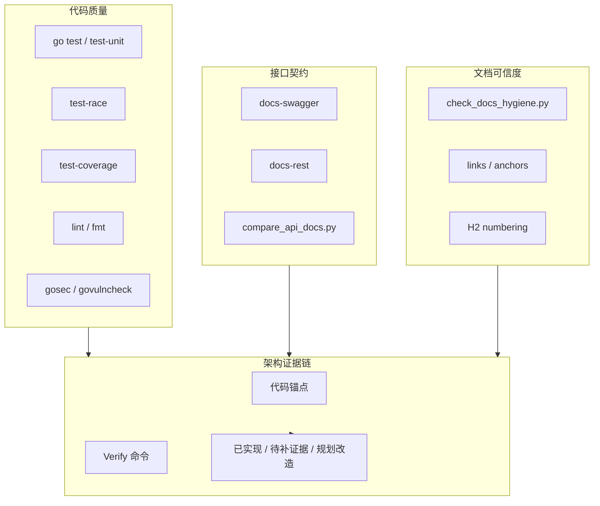
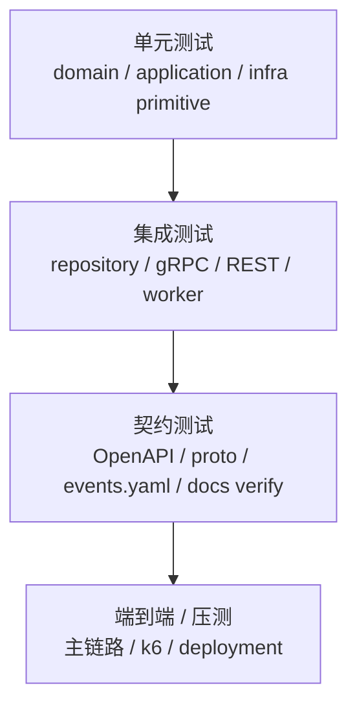

# 工程质量与测试讲法

**本文回答**：对外介绍 qs-server 时，如何证明这不是“纸面架构”；如何把单元测试、集成测试、契约校验、文档卫生、REST/Swagger 对比、lint、安全扫描、race、coverage、CI/CD 和风险边界组织成一套可信的工程质量讲法；面试中被追问“你怎么保证质量”“怎么证明架构是真的”时，如何回答。

---

## 1. 先给结论

> **qs-server 的工程质量不是靠一句“我写了测试”来证明，而是用多层证据链证明：核心业务模块有单元测试，接口契约有 OpenAPI/Swagger 对比，文档有链接和锚点卫生检查，构建有 Makefile 统一入口，代码有 lint/security/race/coverage 等质量门禁，关键链路还通过专题文档回链到源码和 Verify 命令。**

压缩成一句话：

```text
代码能测
契约能比
文档能校验
构建有入口
风险边界主动说明
```

最重要的讲法：

> **工程质量不是说“用了哪些工具”，而是能把“设计结论”回链到代码、测试、契约和文档校验。**

---

## 2. 30 秒讲法

> **我在这个项目里把工程质量分成几层：第一是代码测试层，用 `go test ./...`、单元测试、race、coverage、benchmark 覆盖核心模块；第二是静态质量层，用 lint、fmt、maintainability、gosec、govulncheck 做代码和安全检查；第三是接口契约层，用 swagger 生成 OpenAPI，再用脚本对比 `api/rest` 和 swagger 的 path/method 是否一致；第四是文档可信度层，用 docs-hygiene 检查 Markdown 链接、锚点和章节编号，避免文档只是规划稿。这样我介绍架构时可以把每个结论回链到源码、测试和文档校验，而不是只讲 PPT。**

---

## 3. 1 分钟讲法

> **这个项目文档比较多，架构也比较复杂，所以我不希望它变成“看起来很完整，实际上不可验证”的纸面架构。**
>
> **在代码层面，Makefile 提供了统一的测试入口：`test`、`test-unit`、`test-coverage`、`test-race`、`test-bench`、`lint`、`security` 等。核心模块比如 Survey、Evaluation、Statistics、Event、Redis、Resilience、Security 都在各自文档里写了 Verify 命令，要求改动后能回到对应 package 跑测试。**
>
> **在契约层面，REST 文档不是手写后就不管了，而是通过 `docs-swagger` 生成 swagger，再通过 `docs-rest` 生成 `api/rest` 的 OpenAPI 摘要，最后 `docs-verify` 会比较 `api/rest` 和 swagger 的 path/method 覆盖。**
>
> **在文档层面，`docs-hygiene` 会检查 Markdown 相对链接、锚点和 H2 编号，防止文档引用漂移。这样我对外讲项目时，能说清楚哪些是当前已实现、哪些是待补证据、哪些只是规划改造。**

---

## 4. 3 分钟讲法

> **我在 qs-server 里比较重视工程证据，因为这个项目不只是写接口，还涉及 DDD 边界、异步事件、Outbox、高并发治理、IAM 安全和统计读侧。如果没有质量门禁，很容易变成文档和代码各说各话。**
>
> **第一层是代码级测试和质量检查。Makefile 里统一了 `go test ./...`、短测试、覆盖率、race、benchmark、lint、fmt、安全扫描等入口。这样开发时不需要记一堆命令，每类质量动作都有标准入口。**
>
> **第二层是契约校验。REST 接口通过 swag 生成 swagger，再用脚本生成 `api/rest/apiserver.yaml` 和 `api/rest/collection.yaml`。为了防止手写文档和真实 swagger 漂移，`compare_api_docs.py` 会比较 OpenAPI 和 swagger 里的 method/path 覆盖。**
>
> **第三层是文档校验。这个项目文档体系很重，所以我写了 `check_docs_hygiene.py` 来扫描 docs 下的 Markdown，检查相对链接是否存在、fragment anchor 是否能找到、H2 编号是否连续。这样文档不是纯说明稿，而是可以被 CI 检查的资产。**
>
> **第四层是架构证据链。每篇业务模块、基础设施和专题文档都会给代码锚点和 Verify 命令，比如 Outbox 文档会指向 outbox store、relay、eventing tests；Resilience 文档会指向 rate limit、SubmitQueue、Backpressure、LockLease；Security 文档会指向 Principal、TenantScope、AuthzSnapshot、CapabilityDecision 的测试。**
>
> **最后，我会主动承认当前证据边界：如果没有完整压测报告，就不承诺固定 QPS；如果重试次数依赖底层 MQ，就不口头说死；如果某些能力是 seam 或规划改造，就不讲成已落地。这反而能让项目讲述更可信。**

---

## 5. 工程质量主图



讲图时可以这样说：

```text
代码层保证能跑；
契约层保证接口文档不漂；
文档层保证链接和章节不坏；
证据层保证宣讲结论能回链到源码和测试。
```

---

## 6. 第一层：代码测试怎么讲

### 6.1 Makefile 统一入口

Makefile 里有：

```text
test
test-unit
test-coverage
test-race
test-bench
test-all
```

讲法：

> **我没有把测试命令散落在 README 里，而是通过 Makefile 统一入口。这样不同质量动作有固定命令，也方便接入 CI。**

### 6.2 不同测试的作用

| 命令 | 作用 |
| ---- | ---- |
| `make test` | 跑全部 Go tests |
| `make test-unit` | 跑 short unit tests |
| `make test-coverage` | 生成覆盖率 |
| `make test-race` | race detector |
| `make test-bench` | benchmark |
| `make test-all` | 组合完整测试动作 |

### 6.3 面试讲法

> **我通常会按改动范围跑对应 package tests；提交前跑全量或关键链路 tests。比如改 Evaluation pipeline，就跑 application/evaluation；改 Outbox，就跑 eventing、mongo/mysql outbox；改接口契约，就跑 docs-rest/docs-verify。**

---

## 7. 第二层：静态质量怎么讲

Makefile 中包含：

```text
lint
fmt
fmt-check
maintainability-lint
security-govulncheck
security-gosec
```

### 7.1 lint / fmt

作用：

- 统一代码格式。
- 提前发现静态问题。
- 降低 review 噪音。

### 7.2 security

作用：

- govulncheck：检查依赖和标准库漏洞。
- gosec：检查常见安全问题。

### 7.3 面试讲法

> **静态质量工具不是为了好看，而是把格式、安全和可维护性问题前置到 CI/Makefile 阶段，避免靠人工 review 才发现。**

---

## 8. 第三层：REST 契约校验怎么讲

这个项目的 REST 契约有两个层面：

```text
swagger generated from code
api/rest OpenAPI docs
```

### 8.1 docs-swagger

`docs-swagger` 会对 apiserver 和 collection-server 运行 swag：

```text
swag init ...
```

生成内部 swagger 文件。

### 8.2 docs-rest

`docs-rest` 会从 swagger 生成：

```text
api/rest/apiserver.yaml
api/rest/collection.yaml
```

### 8.3 docs-verify

`docs-verify` 包含：

```text
docs-rest
docs-hygiene
compare_api_docs.py
```

`compare_api_docs.py` 会比较：

- `api/rest/*.yaml`。
- `internal/*/docs/swagger.json`。

重点比较：

```text
path / method coverage
```

### 8.4 面试讲法

> **接口文档不是手写完就算数。我通过 swagger 生成和 OpenAPI 对比，确保 api/rest 里的 path/method 没有和代码生成物漂移。**

---

## 9. 第四层：文档卫生怎么讲

项目文档很多，如果不检查，链接很容易坏。

`check_docs_hygiene.py` 检查：

1. Markdown 相对链接是否存在。
2. Markdown fragment anchor 是否能对应真实 heading。
3. 如果文件使用编号 H2，编号是否连续、不重复、不跳号。
4. 默认排除 docs/_archive。

### 9.1 为什么重要

因为这个项目依赖大量文档讲清：

- 业务边界。
- 架构决策。
- 运行时。
- 基础设施。
- 运维。
- 宣讲。

如果链接和锚点坏了，文档体系就不可信。

### 9.2 面试讲法

> **我把文档也当作工程资产处理，而不是纯说明稿。docs-hygiene 会检查链接、锚点和编号，docs-verify 会把接口契约和 swagger 对齐。这样文档能持续跟代码协同演进。**

---

## 10. 第五层：架构证据链怎么讲

对外讲架构时，要避免：

```text
我设计了 Outbox
我设计了 Resilience
我设计了 Security
```

但没有证据。

更好的讲法是：

```text
每个设计结论都有代码锚点和 Verify 命令
```

例如：

| 架构点 | 证据 |
| ------ | ---- |
| Survey / Scale / Evaluation 拆分 | assembler + domain/application packages + 专题文档 |
| 异步评估 | worker handler + internal gRPC + Evaluation pipeline |
| Outbox | outboxcore + mysql/mongo outbox store + relay tests |
| Resilience | RateLimit + SubmitQueue + Backpressure + LockLease + metrics |
| Security | Principal/TenantScope/AuthzSnapshot/CapabilityDecision tests |
| Statistics | ReadService + SyncService + BehaviorProjector |
| REST 契约 | swagger + api/rest + compare_api_docs |
| 文档体系 | check_docs_hygiene |

---

## 11. 测试金字塔怎么讲

可以把测试分为四类：



### 11.1 单元测试

适合：

- domain 状态机。
- pipeline handler。
- value object。
- policy。
- cache key builder。
- outbox core。
- capability decision。

### 11.2 集成测试

适合：

- repository。
- Mongo/MySQL outbox。
- gRPC service。
- REST handler。
- worker handler。
- Redis lock/rate limit adapter。

### 11.3 契约测试

适合：

- OpenAPI / swagger。
- events.yaml handler registry。
- proto service registry。
- docs links/anchors。

### 11.4 端到端和压测

适合：

- submit -> report。
- Outbox -> worker。
- high QPS submit。
- wait-report。
- worker backlog。

当前如果没有完整压测报告，不应过度承诺。

---

## 12. 关键链路应该怎么测

### 12.1 答卷提交链路

重点测：

- DTO validation。
- SubmitQueue accepted/full/duplicate。
- SubmitGuard done/in-flight。
- gRPC SaveAnswerSheet。
- AnswerSheet durable submit。
- answersheet.submitted outbox。

### 12.2 异步评估链路

重点测：

- answersheet handler。
- CalculateAnswerSheetScore。
- CreateAssessmentFromAnswerSheet。
- assessment.submitted handler。
- EvaluateAssessment。
- pipeline step。
- report save。
- failure path。

### 12.3 Outbox 链路

重点测：

- stage records。
- claim due events。
- mark published。
- mark failed。
- retry delay。
- stale publishing。
- publisher mode。

### 12.4 Resilience 链路

重点测：

- rate_limit allowed/rate_limited。
- queue_full。
- backpressure_timeout。
- lock_contention。
- idempotency_hit。
- duplicate_skipped。
- metrics outcome。

### 12.5 Security 链路

重点测：

- Principal projection。
- TenantScope numeric org。
- AuthzSnapshot load。
- Capability allowed/denied。
- missing_snapshot。
- unknown_capability。
- service identity projection。

---

## 13. 工程质量怎么和宣讲绑定

宣讲时不要孤立讲测试。

要绑定业务问题：

| 业务/架构问题 | 工程质量证据 |
| ------------- | ------------ |
| 答卷不能丢 | durable submit + outbox tests |
| 事件不能丢 | outbox relay tests |
| 不能重复建 Assessment | unique constraint + handler tests |
| 高并发不能打穿系统 | SubmitQueue / Backpressure tests |
| 权限不能靠 roles | CapabilityDecision tests |
| 文档不能漂 | docs-hygiene / docs-verify |
| 接口不能漂 | compare_api_docs |

讲法：

> **每个高风险架构点都应该有对应的测试或校验入口。**

---

## 14. 风险边界怎么讲

可信的项目介绍必须说清楚风险边界。

### 14.1 当前可以讲成已实现

| 能力 | 证据 |
| ---- | ---- |
| Makefile 统一测试/构建入口 | Makefile |
| REST 文档生成和对比 | docs-rest / compare_api_docs.py |
| docs 链接锚点检查 | check_docs_hygiene.py |
| SubmitQueue 代码级保护 | collection answersheet tests |
| Outbox 基础能力 | eventing/outbox tests |
| Security 模型和 projection | securityplane/securityprojection tests |
| Resilience vocabulary/metrics | resilienceplane tests |

### 14.2 需要谨慎讲

| 能力 | 推荐说法 |
| ---- | -------- |
| 完整压测结论 | “有容量档位建议，仍需压测验收” |
| 固定消息重试次数 | “取决于 MQ / component-base 实现，不能无证据承诺” |
| 完整 ACL | “有 seam，仍需策略和文件加载完善” |
| 全事件 outbox | “主链路关键事件已 outbox 化，best_effort 事件仍存在” |
| 完整 operating 平台 | “是下一阶段治理方向” |

---

## 15. 面试常见追问

### 15.1 你怎么保证代码质量？

回答：

> **我会从几层讲。代码层有 go test、coverage、race、lint、security；接口层有 swagger 生成和 api/rest 对比；文档层有 docs-hygiene 检查链接和锚点；架构层每篇核心文档都有代码锚点和 Verify 命令。这样质量不是靠口头保证，而是有命令和脚本可验证。**

---

### 15.2 你怎么证明文档没有漂移？

回答：

> **REST 契约通过 swagger 生成，再用 compare_api_docs 比对 api/rest 和 swagger 的 path/method；Markdown 文档通过 check_docs_hygiene 检查相对链接、fragment anchors 和 H2 编号。虽然这不能证明所有描述都完全正确，但至少能防止链接、接口路径和章节结构漂移。**

---

### 15.3 你怎么测试异步链路？

回答：

> **异步链路拆层测试。Outbox 测 stage/claim/mark published/mark failed；worker handler 测事件解析和 internal gRPC 调用；Evaluation pipeline 测每个 step；状态机测 submitted/interpreted/failed；端到端再测 submit 到 report 的主链路。不能只靠一个 E2E 覆盖所有细节。**

---

### 15.4 你怎么保证权限没问题？

回答：

> **权限链路也拆层：TokenVerifier 是认证，Principal/TenantScope 是投影，AuthzSnapshot 是授权快照，CapabilityDecision 是业务能力判断。测试上要覆盖 allowed、denied、missing_snapshot、unknown_capability 和 scope 错误，不能只测一个 admin 成功路径。**

---

### 15.5 你有压测吗？

谨慎回答：

> **当前可以讲架构上有 RateLimit、SubmitQueue、Backpressure、worker concurrency 和容量档位建议，但如果没有完整压测报告，我不会直接承诺某个 QPS。真正 QPS 要用 k6 或类似工具跑 submit、query、wait-report、worker backlog，并看 p95/p99、429、5xx、DB 慢查询、queue depth 和 backpressure timeout。**

---

## 16. 不要这样讲

### 16.1 不要说“测试覆盖率很高”但不给证据

如果没有覆盖率数据，不要说高。

可以说：

```text
项目有 coverage 入口，关键模块有对应 Verify 命令。
```

### 16.2 不要说“文档和代码完全一致”

任何项目都会漂移。

更可信说法：

```text
通过 docs-hygiene 和 docs-verify 降低漂移风险。
```

### 16.3 不要说“所有链路都有 E2E”

如果没有，不要说。

可以说：

```text
核心链路按单元、集成、契约和主链路测试分层覆盖。
```

### 16.4 不要说“安全已经完全没问题”

更准确：

```text
认证/授权链路有明确分层和测试入口，但 ACL、mTLS 策略和 operator projection 仍需持续治理。
```

### 16.5 不要说“高并发已经验证 1000 QPS”

没有压测报告就不要承诺。

---

## 17. 讲图脚本

可以这样边画边讲：

```text
我把工程质量分成四层。

第一层是代码层，Go test、race、coverage、lint、安全扫描保证代码基本质量。
第二层是契约层，REST 文档不是手写后就不管，而是 swagger 生成、api/rest 生成，再用 compare_api_docs 对比 path/method。
第三层是文档层，docs-hygiene 会检查 Markdown 相对链接、锚点和章节编号。
第四层是架构证据层，每篇核心文档都要有代码锚点和 Verify 命令。

所以我讲这个项目时，不是只讲设计图，而是每个关键设计都能回到代码、测试或校验脚本。
```

---

## 18. 最终背诵版

> **我在 qs-server 里把工程质量分成代码、契约、文档和架构证据四层。代码层通过 Makefile 统一 test、unit、coverage、race、benchmark、lint、安全扫描这些入口；契约层通过 swagger 生成 REST 文档，再用 compare_api_docs 对比 api/rest 和 swagger 的 path/method，避免接口文档漂移；文档层用 check_docs_hygiene 检查 Markdown 链接、锚点和章节编号；架构证据层则要求每篇核心文档都有代码锚点和 Verify 命令。**
>
> **所以我不会把这个项目讲成只有架构图，而是强调每个关键设计都要有证据链：比如 Outbox 有 outbox store 和 relay 测试，Resilience 有 SubmitQueue、Backpressure、LockLease 和 metrics，Security 有 Principal、TenantScope、AuthzSnapshot 和 CapabilityDecision。对于没有完整证据的能力，比如固定重试次数、完整压测结论、完整 ACL，我会明确讲成待补证据或后续演进。**

---

## 19. 证据回链

| 判断 | 证据 |
| ---- | ---- |
| 工程治理要讲真实保护和风险边界 | 旧版 `docs/06-宣讲/07-工程治理与证据.md` |
| Makefile 包含 test/lint/security/docs 入口 | `Makefile` |
| docs-hygiene 检查链接、锚点和 H2 编号 | `scripts/check_docs_hygiene.py` |
| compare_api_docs 比较 api/rest 和 swagger path/method | `scripts/compare_api_docs.py` |
| docs-verify 组合 docs-rest 和 docs-hygiene | `Makefile` |
