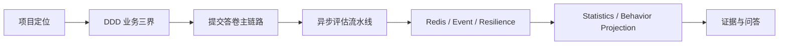
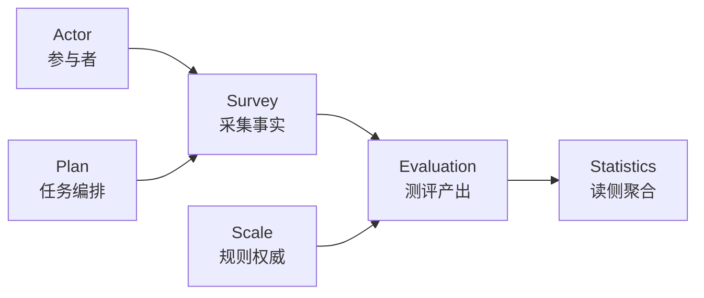
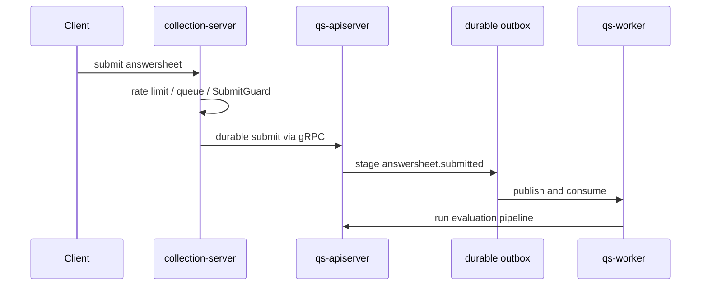

# 30 分钟技术分享脚本

**本文回答**：如果要用 30 分钟介绍 `qs-server`，应该按什么顺序讲、每段讲到什么深度，以及每个关键结论回链到哪里。

## 30 秒结论

| 时间 | 主题 | 目标 |
| ---- | ---- | ---- |
| 0-3 分钟 | 项目定位 | 说明这是三进程测评业务后端，不是单体 CRUD |
| 3-8 分钟 | 业务三界 | 讲清 Survey / Scale / Evaluation 为什么分离 |
| 8-14 分钟 | 主链路 | 讲同步提交与异步评估如何协作 |
| 14-20 分钟 | 横切系统 | 讲 Redis / Event / Resilience 三个 truth layer |
| 20-25 分钟 | 读侧与行为投影 | 讲统计读模型和 behavior projection |
| 25-30 分钟 | 工程治理与边界 | 讲测试、文档、否定边界和后续演进 |

## 分享主线



## 讲法原则

这份脚本不是把所有文档压缩一遍，而是把系统设计讲成“问题 -> 模型 -> 模式 -> 取舍 -> 证据”的节奏。每段都要主动回答：

| 问题 | 讲法 |
| ---- | ---- |
| 这个模块解决什么问题 | 用业务痛点开场，不从目录结构开场 |
| 架构怎么设计 | 展示一张主图，说明调用方向和职责边界 |
| 领域模型是什么 | 点出聚合、状态机、领域服务或读模型 |
| 用了什么模式 | 只讲源码真实存在的状态机、职责链、策略、Outbox、防腐层等 |
| 为什么这样设计 | 对比至少一个替代方案 |
| 代价是什么 | 主动讲最终一致性、复杂度、延迟或维护成本 |

## 0-3 分钟：项目定位

一句话口径：`qs-server` 是围绕“问卷采集、量表规则、测评产出”的三进程后端系统，核心不是表单 CRUD，而是同步入口、异步评估、读侧统计和高并发保护的协作。

建议展示：

| 素材 | 回链 |
| ---- | ---- |
| 系统地图 | [../00-总览/01-系统地图.md](../00-总览/01-系统地图.md) |
| 代码组织 | [../00-总览/02-代码组织与边界.md](../00-总览/02-代码组织与边界.md) |
| one-pager | [02-qs-server one-pager.md](./02-qs-server%20one-pager.md) |

讲稿提示：先讲“系统为什么不是普通 CRUD”。真正难点不是保存问卷，而是把采集事实、规则权威、测评产出、异步事件、读侧统计和高并发保护组合在一起。

## 3-8 分钟：业务三界

结论先讲：Survey 管事实采集，Scale 管规则权威，Evaluation 管产出状态。三者如果合并，会把“答卷事实、规则变更、报告产出”揉成一个高耦合模型。



回链：

| 结论 | 证据 |
| ---- | ---- |
| 三界分离 | [../05-专题分析/01-测评业务模型：survey、scale、evaluation 为什么分离.md](../05-专题分析/01-测评业务模型：survey、scale、evaluation%20为什么分离.md) |
| Survey 深讲 | [../02-业务模块/survey/README.md](../02-业务模块/survey/README.md) |
| Scale 深讲 | [../02-业务模块/scale/README.md](../02-业务模块/scale/README.md) |
| Evaluation 深讲 | [../02-业务模块/evaluation/README.md](../02-业务模块/evaluation/README.md) |

讲稿提示：这里必须讲取舍。三界分离让模型更稳，但跨模块引用、事件和版本兼容会增加复杂度。不要只讲“模块清晰”，要讲“为什么值得付出这部分复杂度”。

## 8-14 分钟：主链路

讲法：前台提交答卷必须快且可控，所以 collection-server 做入口保护、排队和幂等；apiserver 是业务写模型权威；评估和报告通过事件系统异步推进。



回链：

- [03-主链路 1：提交答卷.md](./03-主链路%201：提交答卷.md)
- [04-主链路 2：异步评估流水线.md](./04-主链路%202：异步评估流水线.md)
- [../05-专题分析/02-异步评估链路：从答卷提交到报告生成.md](../05-专题分析/02-异步评估链路：从答卷提交到报告生成.md)

讲稿提示：明确两个模式：Outbox 保证业务写入和事件出站的边界一致性；Evaluation pipeline 用职责链把校验、计分、风险、报告拆成可测试步骤。也要明确否定边界：这不是 exactly-once。

## 14-20 分钟：横切系统

这一段不要展开所有实现，只讲“为什么像平台层”：

| 横切系统 | 30 秒讲法 | 深讲入口 |
| -------- | --------- | -------- |
| Redis | 非结构存储系统，分 Cache / Lock / Governance | [../03-基础设施/redis/README.md](../03-基础设施/redis/README.md) |
| Event | 事件契约、发布/outbox、worker 消费、观测 | [../03-基础设施/event/README.md](../03-基础设施/event/README.md) |
| Resilience | 限流、队列、背压、锁、幂等、降级 | [../03-基础设施/resilience/README.md](../03-基础设施/resilience/README.md) |

讲稿提示：这三层的共同点是都建立了 truth layer：模型包、契约测试、文档入口、观测指标。可以强调“优雅”不是抽象很多类，而是每种横切能力有明确模型和维护 SOP。

## 20-25 分钟：读侧与行为投影

结论：Statistics 不是主业务写模型的附属查询，而是读侧聚合模块；behavior projection 负责把 footprint 事件投影到 `assessment_episode` 和 analytics projection。

回链：

- [../02-业务模块/statistics/README.md](../02-业务模块/statistics/README.md)
- [../05-专题分析/behavior-projection/README.md](../05-专题分析/behavior-projection/README.md)

讲稿提示：这段要讲 CQRS/read model 的取舍：查询更快、归因更清楚，但需要接受最终一致、pending/reconcile 和投影排障成本。

## 25-30 分钟：证据与边界

最后必须讲清否定边界：

| 不要这样讲 | 应该这样讲 |
| ---------- | ---------- |
| 系统支持 exactly-once | 当前通过 durable outbox、Ack/Nack、幂等和补偿降低风险，不承诺 exactly-once |
| collection-server 是业务写模型 | collection-server 是入口 BFF，主业务写模型在 apiserver |
| Redis 是一个统一缓存平台 | Redis 在本项目有 Cache、Lock、Governance 等分层语义 |
| 宣讲文档就是事实来源 | 宣讲层只做表达，事实回链到源码和 truth layer |

## Verify

```bash
python scripts/check_docs_hygiene.py
```
