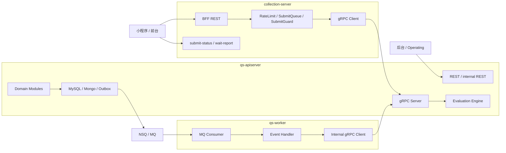
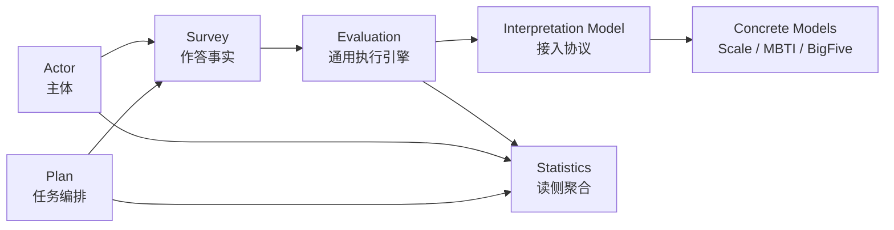
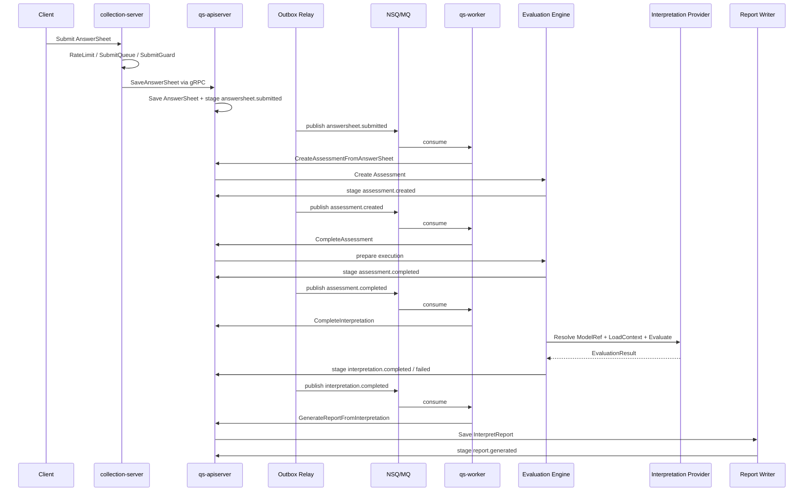
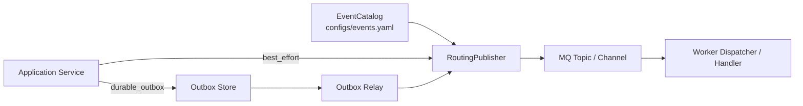
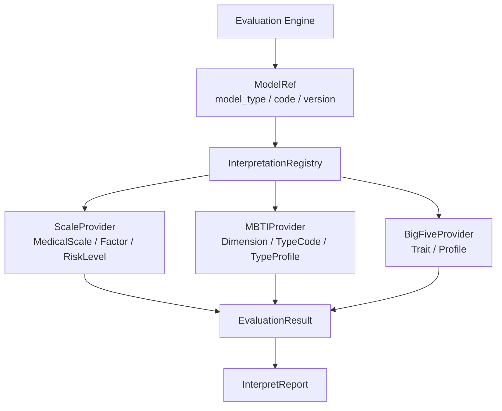
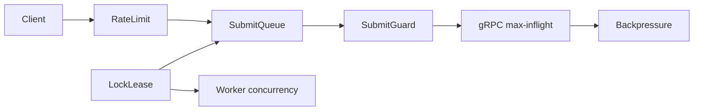
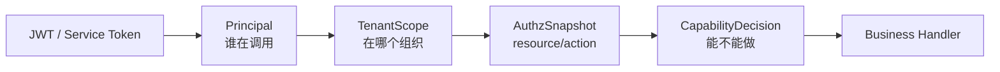

# 09-30 分钟技术分享脚本

**本文回答**：如果要用 30 分钟对外介绍 `qs-server`，应该按什么顺序讲、每段讲多深、每张图怎么讲、哪些句子可以直接口述、哪些内容只在追问时展开；同时也服务于面试中的“项目完整介绍”。

---

## 30 秒结论

这场分享的目标，不是把所有代码细节讲完，而是让听众建立一个准确判断：

> **qs-server 不是普通问卷 CRUD，也不只是医学量表系统，而是一个面向心理、医学和人格测评场景的多解释模型测评后端。它把作答事实、解释模型规则、测评执行生命周期和报告事实拆开，通过 collection-server / qs-apiserver / qs-worker 三进程协作，以及 Outbox、Worker、Redis、ReadModel、IAM、Metrics、Governance 等基础设施治理能力，把“用户提交答卷”稳定推进为“测评结果、解释报告和运营统计”。**

听众听完后应该记住 6 件事：

```text
1. qs-server 不是问卷 CRUD，而是多解释模型测评平台。
2. Survey / Interpretation Model / Concrete Models / Evaluation 是核心业务边界。
3. collection-server / qs-apiserver / qs-worker 是运行时三进程协作。
4. 答卷同步提交，Assessment / Interpretation / Report 异步推进。
5. Outbox 解决业务事实和事件发布的双写一致性，MQ 只负责传输。
6. 高并发、安全、统计、观测和工程质量都有明确治理边界。
```

---

## 1. 30 分钟时间表

| 时间 | 主题 | 目标 |
| ---- | ---- | ---- |
| 0:00 - 2:30 | 项目定位 | 讲清 qs-server 是什么，不是什么 |
| 2:30 - 5:00 | 业务背景与问题 | 说明为什么不是普通问卷 CRUD |
| 5:00 - 8:30 | 三进程架构 | 讲清 collection / apiserver / worker |
| 8:30 - 12:30 | DDD 与限界上下文 | 讲清 Survey / Interpretation Model / Concrete Models / Evaluation |
| 12:30 - 18:00 | 异步测评执行链路 | 串起 AnswerSheet / Assessment / Provider / Result / Report |
| 18:00 - 21:30 | 事件与 Outbox | 讲清 EventCatalog、Outbox、MQ、Worker、幂等 |
| 21:30 - 24:00 | 多解释模型扩展 | 讲清 Scale -> MBTI -> BigFive 的扩展方式 |
| 24:00 - 26:00 | 高并发治理 | 讲清 RateLimit / SubmitQueue / SubmitGuard / Backpressure |
| 26:00 - 28:00 | IAM 与安全 | 讲清 Principal / TenantScope / AuthzSnapshot / Capability |
| 28:00 - 29:20 | 工程质量与观测 | 证明不是纸面架构 |
| 29:20 - 30:00 | 总结与 Q&A 引导 | 收束主线，抛出追问点 |

如果只有 20 分钟，压缩策略：

```text
项目定位 2min
业务背景 2min
三进程 3min
DDD 3min
异步测评执行 + Outbox 6min
多解释模型 + 高并发 + IAM + 质量 4min
```

如果有 45 分钟，扩展策略：

```text
DDD 与多解释模型 +6min
异步测评执行链路 +5min
事件与 Outbox +4min
高并发治理 +4min
IAM 与安全 +3min
观测治理 +3min
Q&A +7min
```

---

## 2. 分享主线图

```mermaid
flowchart LR
    A["项目定位<br/>多解释模型测评平台"]
    B["业务问题<br/>作答 / 解释 / 报告 / 统计 / 权限"]
    C["三进程<br/>collection / apiserver / worker"]
    D["DDD<br/>Survey / Interpretation Model / Concrete Models / Evaluation"]
    E["异步测评执行<br/>AnswerSheet -> Assessment -> Provider -> Result -> Report"]
    F["Event + Outbox<br/>可靠出站 + MQ + Worker"]
    G["Model Extensibility<br/>Scale / MBTI / BigFive Provider"]
    H["Resilience<br/>限流 / 队列 / 背压 / 锁"]
    I["Security<br/>Principal / Snapshot / Capability"]
    J["质量证据<br/>测试 / 契约 / 文档 / 观测"]

    A --> B --> C --> D --> E --> F --> G --> H --> I --> J
```



开场可以直接说：

> **今天我会按一条主线讲：先讲 qs-server 为什么不是普通问卷系统，再讲运行时三进程和 DDD 边界，之后重点讲答卷提交到报告生成的异步测评执行链路，再展开事件可靠性、多解释模型扩展、高并发治理、IAM 安全和工程质量证据。**

---

## 3. 0:00 - 2:30 项目定位

### 3.1 目标

让听众立刻明白：

```text
这是测评系统；
不是普通问卷 CRUD；
不是单纯医学量表系统；
技术重点是边界、异步、可靠性、扩展性和治理。
```

### 3.2 可直接口述

> **qs-server 是一个面向心理、医学和人格测评场景的 Go 后端系统。它不是普通问卷 CRUD，也不只是医学量表系统。它的核心业务是：用户提交答卷后，系统根据不同解释模型生成结构化结果和解读报告。**
>
> **所以我把系统拆成四层：Survey 负责问卷和答卷事实；Interpretation Model 定义解释模型接入协议；Scale、MBTI、BigFive 等具体模型负责规则表达；Evaluation 作为通用测评执行引擎，按 ModelRef 加载 Provider 执行模型，并产出 EvaluationResult 和 InterpretReport。运行时上，collection-server 保护前台入口，qs-apiserver 保存主业务事实，qs-worker 消费事件异步推进执行。工程上用 Outbox、Redis、ReadModel、IAM AuthzSnapshot、Metrics 和 Governance endpoint 支撑可靠性、高并发、安全、统计和排障。**

### 3.3 可以展示的关键词

```text
多解释模型测评平台
Survey / Interpretation Model / Concrete Models / Evaluation
collection / apiserver / worker
同步提交 / 异步测评执行
Outbox / MQ / Worker
Provider / ModelRef / Context
Resilience / IAM / Statistics / Observability
```

### 3.4 过渡语

> **接下来我先不讲技术名词，先讲业务问题：为什么这个系统不能简单做成一个问卷 CRUD。**

---

## 4. 2:30 - 5:00 业务背景与问题

### 4.1 目标

说明业务复杂度来自哪里。

### 4.2 可直接口述

> **在心理、医学和人格测评场景里，用户填写的不是普通表单，而是一份需要被解释模型处理的测评数据。系统要根据答案计算结构化结果、生成报告，还要支持医生、机构、后台运营做统计和追踪。**
>
> **所以这个项目的难点不是“怎么保存问卷答案”，而是：作答事实、解释模型规则、测评执行、报告生成、统计查询和权限控制这些变化原因都不同；前台提交要快，但模型执行和报告生成可能慢；答卷保存成功后，后续事件又不能丢；未来还要支持 MBTI、BigFive 等新模型接入。**

### 4.3 业务问题表

| 业务问题 | 技术后果 |
| -------- | -------- |
| 问卷、模型规则、执行结果容易混在一起 | 需要 DDD 边界 |
| 医学量表、MBTI、BigFive 规则不同 | 需要 Interpretation Model 抽象 |
| 提交要快，报告生成慢 | 需要异步测评执行 |
| 前台流量不可控 | 需要 collection 保护层 |
| 事件不能丢 | 需要 Outbox |
| 统计不能实时扫写模型 | 需要读侧聚合 |
| 权限和隐私复杂 | 需要 IAM / AuthzSnapshot |
| 异步链路复杂 | 需要 Metrics / Governance / Runbook |

### 4.4 过渡语

> **针对这些问题，系统运行时不是一个单进程，而是拆成了三个职责不同的进程。**

---

## 5. 5:00 - 8:30 三进程架构

### 5.1 目标

讲清楚运行时骨架。

### 5.2 主图



### 5.3 可直接口述

> **我把运行时讲成三进程协作，但它不是完整微服务。collection-server 是前台 BFF 和保护层，负责认证、限流、SubmitQueue 削峰、SubmitGuard 幂等和提交状态查询；qs-apiserver 是主业务中心，负责 Survey、Interpretation Model、Scale、Evaluation、Actor、Plan、Statistics 等模块，以及 MySQL / Mongo 持久化、Outbox、REST / gRPC 和调度；qs-worker 是异步驱动器，消费事件后通过 internal gRPC 回调 apiserver 推进 Assessment 创建、解释模型执行和报告生成。**

### 5.4 重点句

> **collection 保护入口，apiserver 保存事实和编排业务能力，worker 消费事件推进异步。**

### 5.5 不要讲错

不要说：

```text
这是三个微服务。
```

更准确：

```text
这是以 apiserver 为主业务中心的三进程协作架构。
```

### 5.6 过渡语

> **运行时讲清楚之后，再看业务模型。为什么 apiserver 里面不是一个大问卷模块，而是拆成多个限界上下文？**

---

## 6. 8:30 - 12:30 DDD 与限界上下文

### 6.1 目标

说明 DDD 是为了解决变化原因，不是堆术语。

### 6.2 主图



### 6.3 可直接口述

> **这个项目里 DDD 最重要的是限界上下文，不是聚合名字。测评业务里，问卷、解释模型、执行结果和报告很容易混在一起，但它们其实是不同问题。Survey 管作答事实，关心 Questionnaire、题目、选项、提交规格、AnswerSheet 和答案校验；Interpretation Model 管统一接入协议，关心 ModelRef、Provider、Context、Registry；Scale、MBTI、BigFive 这些 Concrete Models 管具体规则；Evaluation 管一次测评执行生命周期，关心 Assessment、EvaluationRun、EvaluationResult、InterpretReport、失败重试和事件。**
>
> **这也是为什么 MBTI 不应该放进 Scale。Scale 是医学量表模型，里面有 Factor、RiskLevel、InterpretationRule 这些医学量表语义；MBTI 更自然的是 Dimension、Preference、TypeCode、TypeProfile。它们都能解释答卷，但应该作为同级 Provider 接入 Evaluation。**

### 6.4 重点句

```text
Survey 管作答事实。
Interpretation Model 管接入协议。
Scale / MBTI / BigFive 管具体规则。
Evaluation 管一次测评执行生命周期。
```

### 6.5 面试加分句

> **我判断限界上下文时，不是按数据库表拆，也不是按接口路径拆，而是看变化原因、生命周期和事实源。**

### 6.6 过渡语

> **有了这些领域边界后，最核心的一条链路就是：用户提交答卷后，系统如何异步生成测评结果和报告。**

---

## 7. 12:30 - 18:00 异步测评执行链路

### 7.1 目标

这是分享的核心段落。要讲清楚：

```text
同步保存答卷事实；
异步推进 Assessment / Interpretation / Report；
worker 只是驱动器；
apiserver 承载状态机和 Evaluation Engine；
Provider 执行具体解释模型。
```

### 7.2 主图



### 7.3 可直接口述

> **异步测评执行链路可以理解为“同步保存答卷事实，异步推进测评结果和报告”。前台提交先经过 collection-server 的限流、SubmitQueue 和 SubmitGuard，然后通过 gRPC 调 apiserver 保存 AnswerSheet。apiserver 保存答卷时，会把 AnswerSheet 和 `answersheet.submitted` 事件通过 Outbox 同事务落库，避免 DB 与 MQ 双写不一致。**
>
> **Outbox relay 把事件发布到 MQ 后，qs-worker 消费事件并通过 internal gRPC 回调 apiserver。第一跳基于 AnswerSheet 创建 Assessment，产生 `assessment.created`；第二跳推进 Assessment 执行，产生 `assessment.completed`；第三跳解析 ModelRef，通过 Registry 找到 ScaleProvider 或 MBTIProvider，加载 Context 并执行 Provider，成功后产生 `interpretation.completed`，失败则产生 `interpretation.failed`；最后基于 EvaluationResult 生成 InterpretReport，并产生 `report.generated`。**
>
> **这套设计的关键是：worker 只是异步驱动器，真正的状态机、结果、报告和 Outbox 仍然在 apiserver；事件投递不是 exactly-once，而是通过 Outbox、Ack/Nack、锁、唯一约束和状态机共同实现可靠推进和业务幂等。**

### 7.4 新旧链路对比

| 旧表达 | 新表达 |
| ------ | ------ |
| 异步评估 | 异步测评执行 |
| `assessment.submitted` | `assessment.created` / `assessment.completed` |
| `assessment.interpreted` | `interpretation.completed` |
| `CalculateAnswerSheetScore` | `Provider.Evaluate` / `CompleteInterpretation` |
| `Validation -> FactorScore -> RiskLevel -> Interpretation` | `ModelRef -> Provider -> Context -> EvaluationResult -> InterpretReport` |

### 7.5 过渡语

> **刚才反复提到了 Outbox 和 MQ。下一段单独讲：为什么用了 MQ 之后还需要 Outbox。**

---

## 8. 18:00 - 21:30 事件与 Outbox

### 8.1 目标

讲清楚：

```text
EventCatalog 管契约；
Outbox 管可靠出站；
MQ 管消息传输；
Worker 管消费驱动；
业务状态机管幂等。
```

### 8.2 主图



### 8.3 可直接口述

> **我不会说“用了 MQ 就可靠”。MQ 负责的是消息从一个进程传到另一个进程，但它不解决业务数据库 commit 和 MQ publish 的原子性。比如 AnswerSheet 保存成功后，进程还没 publish MQ 就崩溃，MQ 根本不知道这条事件。**
>
> **所以关键事件走 Outbox：业务事实和待发布事件同事务保存，relay 后台 claim due events，publish 成功就 mark published，失败就 mark failed 并设置下一次重试时间。MQ 是传输层，worker 是消费层，消费端还要靠锁、唯一约束、状态机和 checkpoint 保证幂等。**

### 8.4 重点句

> **Outbox 是 producer-side reliability，MQ 是 transport，worker handler 是 consumer-side processing。**

### 8.5 新事件语义

```text
answersheet.submitted
  -> assessment.created
  -> assessment.completed
  -> interpretation.completed / interpretation.failed
  -> report.generated
```

### 8.6 不要讲错

不要说：

```text
Outbox 保证 exactly-once。
```

更准确：

```text
Outbox 保证可靠出站；consumer 仍需幂等。
```

### 8.7 过渡语

> **有了这条通用事件链路后，系统就可以从 Scale 扩展到 MBTI。下一段讲为什么 MBTI 不应该塞进 Scale。**

---

## 9. 21:30 - 24:00 多解释模型扩展

### 9.1 目标

让听众明白：

```text
Scale 是具体解释模型，不是抽象层；
MBTI 与 Scale 同级；
Evaluation 通过 Provider 接入不同模型。
```

### 9.2 主图



### 9.3 可直接口述

> **这里是我觉得这个项目后续最重要的演进点：从“医学量表系统”升级为“多解释模型测评平台”。早期我们可以说 Scale 管怎么算和怎么解释，因为只有医学量表。但支持 MBTI 后，这个说法就不准确了。Scale 里面的 Factor、RiskLevel、InterpretationRule 是医学量表语义；MBTI 更自然的是 Dimension、Preference、TypeCode、TypeProfile。**
>
> **所以 MBTI 不应该塞进 Scale，也不应该让 Evaluation 写一堆 if model_type == mbti。更合理的方式是抽象 Interpretation Model：Assessment 保存 ModelRef，Evaluation 通过 Registry 找 Provider，Provider 加载 Context 并执行模型。ScaleProvider、MBTIProvider、BigFiveProvider 是同级实现。**

### 9.4 重点句

> **Scale 是医学量表解释模型，MBTI 是另一个解释模型，二者应通过统一 Provider 协议同级接入 Evaluation。**

### 9.5 横切影响

新增 MBTI 不只改一个 domain，还会影响：

| 横切能力 | 影响 |
| -------- | ---- |
| Event | `interpretation-model.changed`、`interpretation.completed` |
| DataAccess | MBTIModel document、mapper、repository、migration |
| Redis | MBTIModelListCache、Context cache、WarmupTarget |
| Statistics | MBTI TypeCode / Dimension 分布 |
| Security | `read_interpretation_reports`、`manage_interpretation_models` |
| Observability | `model_type="mbti"` 指标维度 |
| Governance | 模型缓存、队列、执行状态 drill-down |

### 9.6 过渡语

> **模型扩展讲完后，再回到运行时保护：高峰流量来了，系统怎么不被打穿。**

---

## 10. 24:00 - 26:00 高并发治理

### 10.1 目标

让听众知道高并发不是只加限流。

### 10.2 主图



### 10.3 可直接口述

> **qs-server 的高并发治理是分层做的。前台请求先进 collection-server，先按 submit、query、wait-report 做入口限流；答卷提交再进入 SubmitQueue，把突发请求削成固定 worker 并发；重复提交通过 SubmitGuard 的 done marker 和 in-flight lock 抑制；collection 到 apiserver 的 gRPC 还有 max-inflight 控制；apiserver 内部对 MySQL、Mongo、IAM 用 Backpressure 限制 in-flight 操作数；worker 消费 MQ 时通过 worker.concurrency 控制并发，并用 duplicate suppression 防止重复事件并发处理。**
>
> **我不会把这套东西讲成一个万能高并发框架。RateLimit、Queue、Backpressure、Lock、Idempotency 语义不同，所以具体能力分别实现，但通过 resilienceplane 统一观测 outcome。**

### 10.4 重点句

> **高并发治理的目标不是让所有请求都成功，而是压力超过系统承载时，能明确知道它被挡在哪一层。**

### 10.5 过渡语

> **除了流量治理，测评系统还有一个敏感问题：谁能看谁的答卷和报告？这就进入 IAM 和安全。**

---

## 11. 26:00 - 28:00 IAM 与安全

### 11.1 目标

讲清楚：

```text
IAM 是身份和授权真值；
JWT roles 不是权限真值；
AuthzSnapshot 判断 capability；
模型规则管理权限和用户报告访问权限要拆开。
```

### 11.2 主图



### 11.3 可直接口述

> **qs-server 不自己实现完整 IAM，而是通过 IAMModule 嵌入 IAM SDK。HTTP 和 gRPC 都先用 IAM TokenVerifier 验证 token，投影成 Principal；再用 TenantScope 确定当前 tenant/org；需要业务授权时，通过 IAM GetAuthorizationSnapshot 拉取当前用户在当前 domain 下的 resource/action 权限，再用 CapabilityDecision 判断能不能读取问卷、管理解释模型、读取答卷或触发评估。**
>
> **我不会直接用 JWT roles 做业务权限，因为 token roles 可能滞后，也不能完整表达 resource/action。本地 Operator roles 只是 IAM roles 的投影，用于展示和协作查询，也不是权限真值。服务间调用则通过 ServiceAuth bearer token 和可选 mTLS identity match 表达 ServiceIdentity。**
>
> **支持 MBTI 后，权限还要拆得更清楚：能管理 MBTI 模型规则，不等于能查看用户 MBTI 报告。前者是 `manage_interpretation_models`，后者是 `read_interpretation_reports`。**

### 11.4 重点句

```text
JWT 证明“你是谁”。
TenantScope 证明“你在哪个组织”。
AuthzSnapshot 判断“你能做什么”。
```

### 11.5 过渡语

> **最后，我想补一段工程质量：这个项目不是只停留在架构图，而是有测试、契约、文档和观测证据来支撑。**

---

## 12. 28:00 - 29:20 工程质量与观测

### 12.1 目标

证明不是纸面架构。

### 12.2 可直接口述

> **我把工程质量分成代码、契约、文档、观测和架构证据几层。代码层通过 Makefile 统一 test、unit、coverage、race、benchmark、lint、安全扫描这些入口；契约层通过 swagger 生成 REST 文档，再对比 api/rest 和 swagger 的 path/method，避免接口文档漂移；文档层用 docs-hygiene 检查 Markdown 链接、锚点和章节编号；观测层通过 Metrics、pprof、healthz 和 Governance endpoint 暴露关键运行状态；架构证据层则要求每篇核心文档都有代码锚点和 Verify 命令。**
>
> **对于没有完整证据的能力，比如固定重试次数、完整压测结论、完整 ACL、MBTIProvider 代码落地，我会明确讲成待补证据或后续演进，而不是包装成已完成。**

### 12.3 重点句

> **工程质量不是说“我写了测试”，而是每个关键设计都有代码、测试、契约、观测或文档校验能回链。**

### 12.4 过渡语

> **最后用不到一分钟把整条线收束。**

---

## 13. 29:20 - 30:00 总结

### 13.1 可直接口述

> **总结一下，qs-server 的价值不是接口数量，而是边界和链路。业务上，它把作答事实、解释模型规则、测评执行生命周期和报告事实拆成 Survey、Interpretation Model、Concrete Models、Evaluation；运行时上，它用 collection-server、apiserver、worker 三进程隔离前台入口、主业务事实和异步执行；链路上，它用 Outbox 和 MQ 推进异步测评执行；扩展上，它让 Scale、MBTI、BigFive 作为同级 Provider 接入 Evaluation；工程上，它用 RateLimit、SubmitQueue、SubmitGuard、Backpressure、LockLease、IAM AuthzSnapshot、Statistics ReadModel、Metrics 和 Governance endpoint 治理高并发、安全、运营查询和排障。**
>
> **如果后续继续演进，我会优先补强 Outbox failed/replay、Evaluation failed retry、ModelRef / Provider / Context 代码事实、MBTIProvider MVP、统计治理、压测报告和 operating 运维平台，而不是过早拆微服务或盲目堆新功能。**

### 13.2 Q&A 引导

可以主动抛出：

```text
如果大家感兴趣，我可以展开三块：
1. 为什么 MBTI 不应该放进 Scale，而是通过 Provider 接入 Evaluation；
2. Outbox 为什么不是 MQ 的替代，而是 DB/MQ 双写一致性方案；
3. SubmitQueue / Backpressure / LockLease 这套高并发保护链怎么落地。
```

---

## 14. 常见时间失控处理

### 14.1 如果 DDD 段讲太久

压缩为：

```text
Survey 管作答事实；
Interpretation Model 管接入协议；
Scale / MBTI 管具体规则；
Evaluation 管执行生命周期。
```

详细聚合不展开，后面异步链路会自然串起来。

### 14.2 如果异步链路讲太久

保留核心：

```text
AnswerSheet saved
  -> Outbox
  -> worker
  -> Assessment
  -> Provider
  -> EvaluationResult
  -> InterpretReport
```

其它细节放 Q&A。

### 14.3 如果时间只剩 5 分钟

直接讲：

```text
1. 项目不是问卷 CRUD，而是多解释模型测评平台。
2. 四个核心边界：Survey / Interpretation Model / Concrete Models / Evaluation。
3. 三个运行时进程：collection / apiserver / worker。
4. 主链路：同步提交答卷，异步推进 Assessment / Interpretation / Report。
5. 治理：Outbox + Resilience + IAM + Statistics + Observability + 工程质量证据。
```

---

## 15. 互动问题准备

### 15.1 开场互动

> **如果你们做过问卷系统，可以先想一个问题：用户提交答案后，是不是一定要同步生成报告？这个问题就是我后面要讲的主线。**

### 15.2 DDD 段互动

> **大家可以判断一下：MBTI 应该放在 Scale 里，还是和 Scale 同级作为一个解释模型？**

### 15.3 Outbox 段互动

> **如果 DB 保存成功，但 publish MQ 前进程崩了，这条业务事件在哪里？**

### 15.4 高并发段互动

> **如果系统返回 429，你希望能知道它是被限流挡住、队列满了，还是下游背压超时？**

---

## 16. 面试版压缩脚本：5 分钟

如果面试只给 5 分钟：

> **我介绍一个最有代表性的项目 qs-server。它是面向心理、医学和人格测评场景的 Go 后端，不是普通问卷 CRUD。业务上我把它拆成 Survey、Interpretation Model、Concrete Models、Evaluation：Survey 管问卷和答卷事实，Interpretation Model 管 ModelRef、Provider、Context、Registry 这些接入协议，Scale、MBTI 等具体模型管规则，Evaluation 管 Assessment、EvaluationRun、EvaluationResult 和 InterpretReport。**
>
> **运行时上，它是 collection-server、qs-apiserver、qs-worker 三进程协作。collection 是前台 BFF 和保护层，负责限流、SubmitQueue、SubmitGuard 和状态查询；apiserver 是主业务中心，负责领域模型、MySQL/Mongo 持久化、Outbox、REST/gRPC 和调度；worker 消费事件，通过 internal gRPC 回调 apiserver 推进异步测评执行。**
>
> **主链路是：用户提交答卷后，系统同步保存 AnswerSheet，并通过 Outbox 写入 `answersheet.submitted`；worker 消费后创建 Assessment，产生 `assessment.created`；后续通过 `assessment.completed` 进入解释模型执行，Provider 产出 EvaluationResult 后产生 `interpretation.completed`，最后生成 InterpretReport 并产生 `report.generated`。这里我不会说 MQ 天然可靠，而是用 Outbox 解决 DB 与 MQ 双写一致性，用 worker Ack/Nack 和业务幂等处理重复消费。**
>
> **高并发上，我做了分层保护：入口限流、SubmitQueue 削峰、SubmitGuard 防重复、gRPC max-inflight、apiserver Backpressure、Redis LockLease、worker concurrency。安全上通过 IAMModule 接入 IAM，JWT 做认证，AuthzSnapshot 做业务授权。工程质量上有 Go tests、lint/security、Swagger/OpenAPI 对比、docs hygiene 校验和 Governance endpoint 观测。**

---

## 17. 面试版压缩脚本：2 分钟

> **qs-server 是一个面向心理、医学和人格测评场景的多解释模型测评后端，核心不是保存问卷答案，而是把答卷提交稳定推进为 EvaluationResult、InterpretReport 和统计数据。**
>
> **业务上我拆了 Survey、Interpretation Model、Concrete Models、Evaluation 四个边界：Survey 管问卷和答卷，Interpretation Model 管统一 Provider 协议，Scale、MBTI 等模型管具体规则，Evaluation 管 Assessment、Result 和 Report。运行时上是三进程：collection-server 保护前台入口，apiserver 处理主业务事实，worker 消费事件推进异步测评执行。**
>
> **主链路是同步提交 AnswerSheet、异步生成 Report。AnswerSheet 保存时会把 `answersheet.submitted` 写入 Outbox，relay 发布到 MQ，worker 消费后通过 internal gRPC 回到 apiserver 创建 Assessment，并通过 ModelRef / Provider / Context 执行具体解释模型。**
>
> **工程上，collection 有 RateLimit、SubmitQueue、SubmitGuard，apiserver 有 Backpressure 和 Outbox，worker 有 concurrency 和 duplicate suppression；安全上通过 IAM AuthzSnapshot 做能力判断，不直接用 JWT roles。**

---

## 18. 不能说过头的点

| 不要说 | 应该说 |
| ------ | ------ |
| 这是微服务系统 | 这是以 apiserver 为主业务中心的三进程协作架构 |
| MQ 保证可靠 | Outbox 保证 producer-side reliable publish，MQ 负责传输 |
| 事件 exactly-once | 至少一次投递 + 业务幂等 |
| SubmitQueue 保证不丢 | SubmitQueue 是内存削峰，事实可靠性来自 durable submit |
| JWT roles 做权限 | JWT 做认证，AuthzSnapshot 做授权 |
| Scale 管所有解释模型 | Scale 是医学量表模型，Interpretation Model 才是接入抽象 |
| MBTI 是 Scale 的一种 | MBTI 与 Scale 同级，都是具体解释模型 |
| Evaluation 是算量表分数 | Evaluation 是通用测评执行引擎 |
| 已经压测 1000 QPS | 有容量档位建议，QPS 需要压测报告支撑 |
| 完整 ACL 已落地 | 有 service identity/mTLS/ACL seam，完整策略仍需完善 |
| MBTIProvider 已完整落地 | 以当前源码事实为准，未落地则讲成下一阶段计划 |

---

## 19. 分享前检查清单

| 检查项 | 是否完成 |
| ------ | -------- |
| 准备一张三进程图 | ☐ |
| 准备一张 DDD 领域地图 | ☐ |
| 准备一张异步测评执行链路图 | ☐ |
| 准备一张 Outbox 图 | ☐ |
| 准备一张多解释模型 Provider 图 | ☐ |
| 准备一张高并发分层保护图 | ☐ |
| 准备一张 IAM 安全链路图 | ☐ |
| 背熟 30 秒项目定位 | ☐ |
| 背熟 5 分钟面试版 | ☐ |
| 明确哪些是已实现，哪些是待补证据 | ☐ |
| 准备 Q&A 追问证据索引 | ☐ |

---

## 20. 证据回链

| 段落 | 文档 |
| ---- | ---- |
| 项目定位 | `00-项目一句话定位.md` |
| 业务背景 | `01-业务背景与问题.md` |
| 三进程架构 | `02-三进程架构讲法.md` |
| DDD | `03-DDD与限界上下文讲法.md` |
| 异步测评执行 | `04-异步测评执行链路讲法.md` |
| 事件与 Outbox | `05-事件与Outbox讲法.md` |
| 高并发治理 | `06-高并发治理讲法.md` |
| IAM 与安全 | `07-IAM与安全讲法.md` |
| 工程质量 | `08-工程质量与测试讲法.md` |
| 多解释模型扩展 | `../05-专题分析/08-多解释模型扩展专题--从Scale到MBTI.md` |
| Evaluation 通用执行引擎 | `../05-专题分析/09-Evaluation通用执行引擎专题.md` |
| 解释模型事件与缓存治理 | `../05-专题分析/10-解释模型事件与缓存治理专题.md` |
