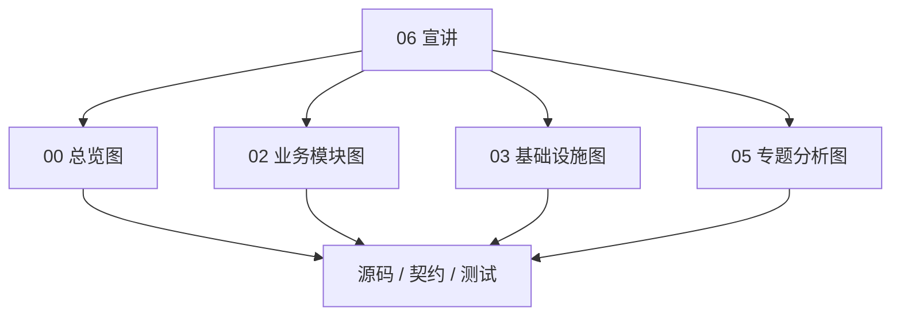

# 架构图素材索引

**本文回答**：宣讲时可以直接复用哪些 Mermaid 图，以及这些图的事实来源在哪里。

## 30 秒结论

| 图类型 | 优先来源 |
| ------ | -------- |
| 系统总图 | `00-总览` |
| 业务模块图 | `02-业务模块/*/README.md` 与 `00-整体模型.md` |
| 横切系统图 | Redis / Event / Resilience 深讲目录 |
| 行为投影图 | `05-专题分析/behavior-projection` |
| 问答证据图 | 本文只索引，不复制维护第二份事实 |

## 素材地图



## 图怎么讲

图不是装饰。每张图在宣讲时都应该承担一个明确问题：

| 图类型 | 要回答的问题 | 讲法 |
| ------ | ------------ | ---- |
| 架构图 | 系统为什么这样分层 | 先讲职责，再讲调用方向 |
| 领域模型图 | 聚合和值对象如何组织 | 先讲不变量，再讲关系 |
| 状态机图 | 状态为什么不能任意跳转 | 先讲非法转移风险 |
| 时序图 | 运行时怎么协作 | 先讲同步/异步边界 |
| 决策树 | 新能力该落到哪里 | 先讲判断问题，而不是列步骤 |

如果一张图不能说明问题、模型、模式或取舍，优先不要放进宣讲。

## 系统与运行时图

| 使用场景 | 推荐图 | 回链 |
| -------- | ------ | ---- |
| 30 秒项目定位 | 系统地图 | [../00-总览/01-系统地图.md](../00-总览/01-系统地图.md) |
| 解释代码边界 | 三进程与目录边界 | [../00-总览/02-代码组织与边界.md](../00-总览/02-代码组织与边界.md) |
| 解释提交主链 | 核心业务链路 | [../00-总览/03-核心业务链路.md](../00-总览/03-核心业务链路.md) |
| 解释进程协作 | 进程间通信 | [../01-运行时/04-进程间通信.md](../01-运行时/04-进程间通信.md) |

## 业务模块图

| 模块 | 推荐图 | 回链 |
| ---- | ------ | ---- |
| Survey | Questionnaire / AnswerSheet 主模型 | [../02-业务模块/survey/00-整体模型.md](../02-业务模块/survey/00-整体模型.md) |
| Scale | MedicalScale / Factor / InterpretationRule | [../02-业务模块/scale/00-整体模型.md](../02-业务模块/scale/00-整体模型.md) |
| Evaluation | Assessment / Pipeline / Report | [../02-业务模块/evaluation/00-整体架构.md](../02-业务模块/evaluation/00-整体架构.md) |
| Plan | Plan / Task / Scheduler | [../02-业务模块/plan/00-整体模型.md](../02-业务模块/plan/00-整体模型.md) |
| Actor | Testee / Clinician / Operator | [../02-业务模块/actor/00-整体模型.md](../02-业务模块/actor/00-整体模型.md) |
| Statistics | Read model / Sync / Cache | [../02-业务模块/statistics/00-整体模型.md](../02-业务模块/statistics/00-整体模型.md) |

## 横切系统图

| 系统 | 推荐图 | 回链 |
| ---- | ------ | ---- |
| Redis | 四层架构图、三进程 Redis 角色图 | [../03-基础设施/redis/00-整体架构.md](../03-基础设施/redis/00-整体架构.md) |
| Event | 事件系统总图、outbox 状态机、worker Ack/Nack | [../03-基础设施/event/00-整体架构.md](../03-基础设施/event/00-整体架构.md) |
| Resilience | Resilience Plane 总图、能力矩阵 | [../03-基础设施/resilience/00-整体架构.md](../03-基础设施/resilience/00-整体架构.md)、[../03-基础设施/resilience/07-能力矩阵.md](../03-基础设施/resilience/07-能力矩阵.md) |

## 专题图

| 专题 | 推荐图 | 回链 |
| ---- | ------ | ---- |
| 三界分离 | survey / scale / evaluation 边界图 | [../05-专题分析/01-测评业务模型：survey、scale、evaluation 为什么分离.md](../05-专题分析/01-测评业务模型：survey、scale、evaluation%20为什么分离.md) |
| 异步评估 | 答卷提交到报告生成时序 | [../05-专题分析/02-异步评估链路：从答卷提交到报告生成.md](../05-专题分析/02-异步评估链路：从答卷提交到报告生成.md) |
| 保护层与读侧 | 限流 / 背压 / 缓存 / 预聚合 | [../05-专题分析/03-保护层与读侧架构：限流、背压、缓存、统计预聚合.md](../05-专题分析/03-保护层与读侧架构：限流、背压、缓存、统计预聚合.md) |
| 行为投影 | footprint -> episode -> projection | [../05-专题分析/behavior-projection/00-整体模型.md](../05-专题分析/behavior-projection/00-整体模型.md) |

## 使用规则


宣讲层可以调整讲法，但不要把 Mermaid 图复制成第二份长期维护的事实图。图有误时，应回到对应 truth layer 修。

## Verify

```bash
python scripts/check_docs_hygiene.py
```
