# 架构图素材索引

**本文回答**：`06-宣讲` 中可以使用哪些架构图；每张图适合放在哪一页、回答什么问题、讲图时应该怎么讲；哪些图应该复用 truth layer，哪些图可以作为宣讲图；如何避免“图很好看，但事实不准确”。

---

## 1. 先给结论

> **宣讲图不是装饰，而是帮助听众建立“业务问题 → 架构边界 → 运行时链路 → 工程治理”的认知路径。**

本目录建议优先准备 8 张图：

| 顺序 | 图 | 用途 |
| ---- | -- | ---- |
| 1 | 项目定位图 | 说明 qs-server 不是问卷 CRUD，而是测评后端 |
| 2 | 三进程架构图 | 说明 collection / apiserver / worker 的职责 |
| 3 | DDD 领域地图 | 说明 Survey / Scale / Evaluation 为什么拆 |
| 4 | 异步评估链路图 | 说明 AnswerSheet 到 Report 的主链路 |
| 5 | Event + Outbox 图 | 说明 EventCatalog / Outbox / NSQ / Worker |
| 6 | 高并发治理图 | 说明 RateLimit / Queue / Backpressure / Lock |
| 7 | IAM 安全链路图 | 说明 Principal / TenantScope / AuthzSnapshot / Capability |
| 8 | 工程质量证据图 | 说明测试、契约、文档校验如何支撑架构可信度 |

一句话原则：

> **每张图只回答一个核心问题，不要试图把所有模块塞进同一张图。**

---

## 2. 图怎么用

讲技术分享时，不建议一上来放大而全的系统图。更好的方式是：

```text
先用一张定位图建立问题
再用三进程图建立运行时骨架
再用 DDD 图建立业务边界
再用异步链路图讲主流程
再用 Outbox / Resilience / IAM / 质量图回答追问
```

推荐使用顺序：

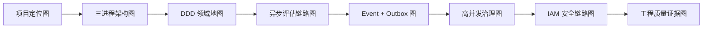

---

## 3. 图的使用规则

### 3.1 每张图必须回答一个问题

| 图类型 | 应回答 |
| ------ | ------ |
| 定位图 | 这个项目到底是什么，不是什么 |
| 运行时图 | 请求和事件在几个进程之间怎么流动 |
| 领域图 | 为什么这些模块要拆开 |
| 时序图 | 同步和异步边界在哪里 |
| Outbox 图 | 为什么 MQ 之外还需要可靠出站 |
| 治理图 | 压力在哪些层被挡住 |
| 安全图 | 认证、租户、授权、服务身份如何分层 |
| 证据图 | 如何证明不是纸面架构 |

### 3.2 图不要承担太多职责

不要让一张图同时讲：

```text
业务领域 + 三进程 + Event + Redis + IAM + 部署端口 + 测试
```

这样听众只会记住“很复杂”。

### 3.3 图要能回链到 truth layer

宣讲图可以简化，但不能虚构。

每张图至少要能回链到：

- 源码。
- 现有文档。
- 接口契约。
- 配置文件。
- 测试或 Verify 命令。

---

## 4. 图 1：项目定位图

### 4.1 适合放在哪

- `00-项目一句话定位.md`
- `01-业务背景与问题.md`
- 30 分钟分享的第 1 页

### 4.2 回答什么

```text
qs-server 是什么？
为什么不是普通问卷 CRUD？
```

### 4.3 推荐图

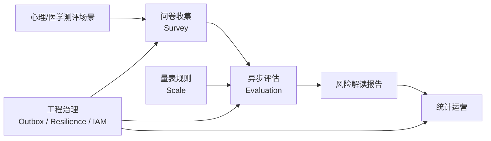

### 4.4 讲图脚本

```text
这张图只说明一件事：
用户填的不是普通表单，而是一份要被量表规则解释的测评数据。
Survey 负责收集，Scale 负责规则，Evaluation 负责产出报告，后面还有统计运营。
所以 qs-server 的技术难点不是 CRUD，而是边界、异步链路和工程治理。
```

### 4.5 不要这样讲

不要在这张图里讲：

- gRPC 细节。
- Redis family。
- Outbox state。
- IAM snapshot。
- 测试脚本。

这些放后面。

---

## 5. 图 2：三进程架构图

### 5.1 适合放在哪

- `02-三进程架构讲法.md`
- 30 分钟分享的第 2-3 页
- 面试介绍运行时架构时

### 5.2 回答什么

```text
collection-server、qs-apiserver、qs-worker 分别做什么？
```

### 5.3 推荐图

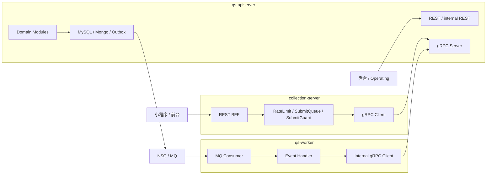

### 5.4 讲图脚本

```text
左边 collection-server 是前台入口，负责挡住流量和适配前台。
中间 apiserver 是主业务中心，负责领域模型和主数据写入。
右边 worker 是异步执行器，消费事件后通过 internal gRPC 回到 apiserver。
这不是微服务，而是以 apiserver 为中心的三进程协作架构。
```

### 5.5 不要这样讲

不要说：

```text
这是三个微服务
```

应该说：

```text
这是三进程协作。
```

---

## 6. 图 3：DDD 领域地图

### 6.1 适合放在哪

- `03-DDD与限界上下文讲法.md`
- 30 分钟分享的 DDD 段
- 面试官问“你怎么做领域建模”时

### 6.2 回答什么

```text
为什么 Survey、Scale、Evaluation 要拆开？
```

### 6.3 推荐图

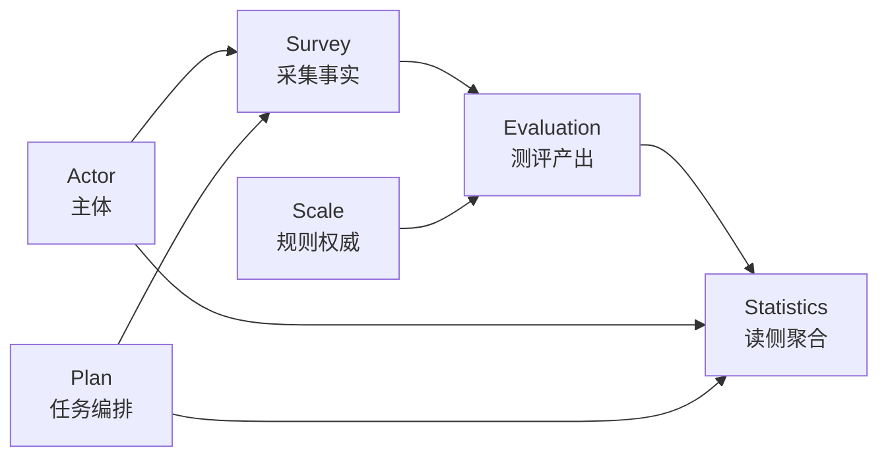

### 6.4 讲图脚本

```text
中间三块是核心边界。
Survey 管问卷和答卷，是采集事实。
Scale 管量表、因子、计分和解读，是规则权威。
Evaluation 管 Assessment、Score、Report，是测评产出。
左边 Actor 和 Plan 是支撑上下文，右边 Statistics 是读侧聚合。
它们不是按表拆，而是按变化原因拆。
```

### 6.5 不要这样讲

不要说：

```text
这些都是微服务
```

也不要说：

```text
DDD 就是分包
```

---

## 7. 图 4：异步评估链路图

### 7.1 适合放在哪

- `04-异步评估链路讲法.md`
- 30 分钟分享最核心段
- 面试官问“主链路怎么跑”时

### 7.2 回答什么

```text
从用户提交答卷到报告生成，中间发生了什么？
```

### 7.3 推荐图

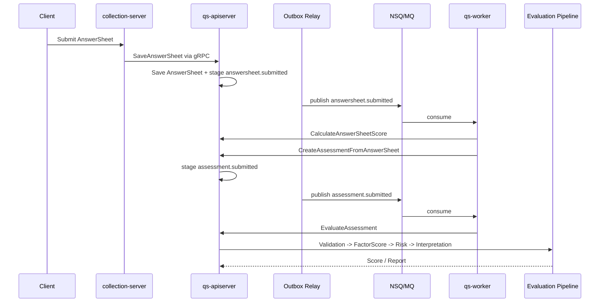

### 7.4 讲图脚本

```text
这张图分两半。
左半边是同步提交，目标是保存 AnswerSheet。
右半边是异步评估，目标是创建 Assessment 并生成 Report。
中间用 Outbox 和 MQ 断开。
worker 不直接写数据库，而是通过 internal gRPC 回到 apiserver。
```

### 7.5 不要这样讲

不要说：

```text
提交成功就生成报告
```

应该说：

```text
提交成功表示答卷事实保存或请求已受理，报告是异步结果。
```

---

## 8. 图 5：Event + Outbox 图

### 8.1 适合放在哪

- `05-事件与Outbox讲法.md`
- 异步链路之后
- 面试官问“MQ 怎么保证可靠”时

### 8.2 回答什么

```text
为什么用了 NSQ 之后还需要 Outbox？
```

### 8.3 推荐图

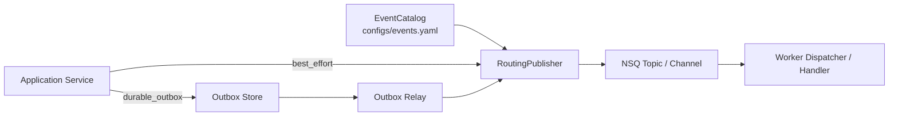

### 8.4 讲图脚本

```text
这张图讲事件系统的分层。
EventCatalog 管事件契约，RoutingPublisher 管 topic 路由。
普通轻量事件可以 best_effort publish。
关键事件先进入 Outbox，再由 relay 发到 NSQ。
NSQ 负责传输，Worker 负责消费。
所以 MQ 和 Outbox 不是替代关系。
```

### 8.5 不要这样讲

不要说：

```text
NSQ 保证整个链路可靠
```

应该说：

```text
Outbox 解决生产端可靠出站，NSQ 解决消息传输，worker 解决消费处理。
```

---

## 9. 图 6：高并发治理图

### 9.1 适合放在哪

- `06-高并发治理讲法.md`
- 面试高频追问“怎么抗高并发”
- 技术分享后半段

### 9.2 回答什么

```text
高并发压力在哪些层被挡住？
```

### 9.3 推荐图

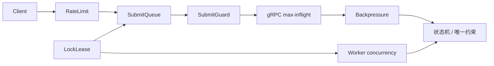

### 9.4 讲图脚本

```text
高并发不是一个限流器解决。
入口先被 RateLimit 挡住。
答卷提交再进入 SubmitQueue 削峰。
重复提交由 SubmitGuard 处理。
collection 到 apiserver 有 gRPC max-inflight。
apiserver 对 MySQL/Mongo/IAM 有 Backpressure。
跨实例互斥用 LockLease。
worker 消费用 concurrency 控制。
最后正确性还要靠状态机和唯一约束兜底。
```

### 9.5 不要这样讲

不要说：

```text
用了 Redis 就能抗高并发
```

应该说：

```text
Redis 只是限流、锁、幂等的支撑设施，业务正确性还要靠状态机和唯一约束。
```

---

## 10. 图 7：IAM 安全链路图

### 10.1 适合放在哪

- `07-IAM与安全讲法.md`
- 面试官问认证授权
- 解释 qs-server 与 IAM 项目连接

### 10.2 回答什么

```text
JWT、TenantScope、AuthzSnapshot、CapabilityDecision 分别负责什么？
```

### 10.3 推荐图

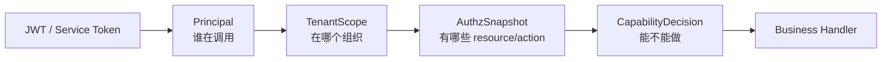

### 10.4 讲图脚本

```text
Token 只证明请求来源。
Principal 回答谁在调用。
TenantScope 回答在哪个组织范围。
AuthzSnapshot 从 IAM 拉取当前 resource/action。
CapabilityDecision 再判断能不能执行某个业务能力。
所以 JWT roles 不是权限真值。
```

### 10.5 不要这样讲

不要说：

```text
JWT roles 有 admin 就放行
```

应该说：

```text
业务授权基于 AuthzSnapshot 和 CapabilityDecision。
```

---

## 11. 图 8：工程质量证据图

### 11.1 适合放在哪

- `08-工程质量与测试讲法.md`
- 分享尾声
- 面试官问“怎么证明不是纸面设计”

### 11.2 回答什么

```text
这个架构怎么证明是真的？
```

### 11.3 推荐图

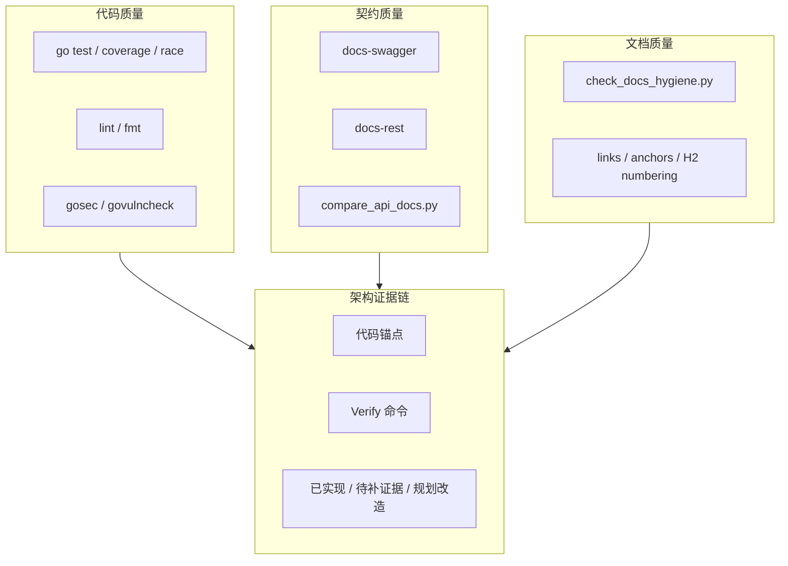

### 11.4 讲图脚本

```text
我把工程质量分四层。
代码层有测试、覆盖率、race、lint、安全扫描。
契约层有 swagger 和 api/rest 对比。
文档层有 docs-hygiene 检查链接、锚点和编号。
架构层要求每个设计结论有代码锚点和 Verify 命令。
```

### 11.5 不要这样讲

不要说：

```text
文档和代码完全一致
```

应该说：

```text
通过校验脚本降低漂移风险。
```

---

## 12. 可选图：系统演进路线图

### 12.1 适合放在哪

- 分享结尾
- 面试官问“下一步怎么演进”
- 系统路线规划

### 12.2 推荐图

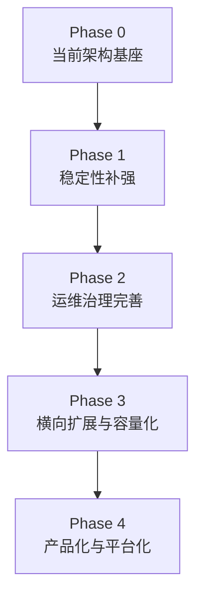

### 12.3 讲图脚本

```text
当前不是从零开始，而是已经有三进程、业务边界、Outbox、读侧统计和 IAM 安全基座。
下一步不是盲目拆微服务，而是先补可靠性和治理，再做多实例容量化，最后产品化和平台化。
```

---

## 13. 可选图：统计读侧聚合图

### 13.1 适合放在哪

- 如果听众关心运营统计
- 面试官问 CQRS/read model
- `05-为什么需要读侧统计聚合.md`

### 13.2 推荐图

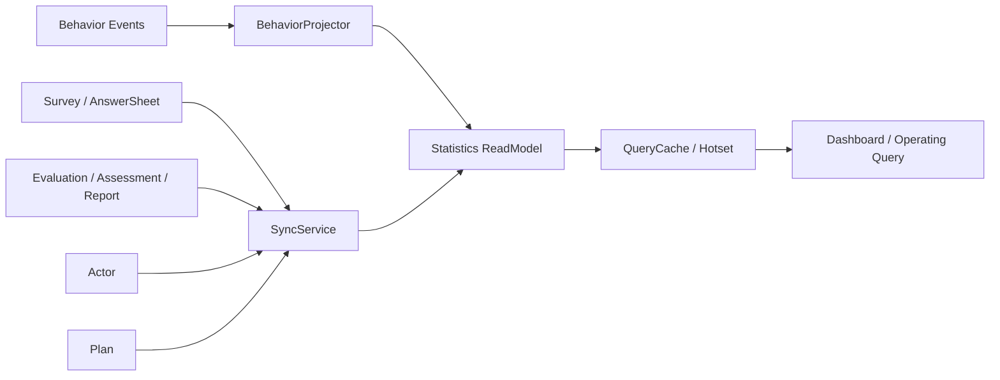

### 13.3 讲图脚本

```text
统计不是每次实时扫所有业务表。
业务事实来自 Survey、Evaluation、Actor、Plan。
行为事件通过 Projector 投影。
周期性数据通过 SyncService 重建。
查询从 ReadModel 和 QueryCache 走。
这样后台统计有稳定口径，也可以修复和重建。
```

---

## 14. 图的命名建议

如果做 PPT，可以这样命名页面：

| 页码 | 标题 |
| ---- | ---- |
| 1 | 项目定位：不是问卷 CRUD，而是测评后端 |
| 2 | 运行时：前台保护层 + 主业务中心 + 异步执行器 |
| 3 | 领域边界：Survey / Scale / Evaluation |
| 4 | 主链路：从 AnswerSheet 到 Report |
| 5 | 事件可靠性：Outbox + NSQ + Worker |
| 6 | 高并发治理：分层保护链 |
| 7 | 安全链路：Principal / TenantScope / AuthzSnapshot |
| 8 | 工程质量：代码、契约、文档、证据 |
| 9 | 演进路线：从稳定性到平台化 |

---

## 15. Mermaid 使用建议

### 15.1 适合 flowchart 的图

- 三进程架构。
- DDD 领域地图。
- Event System 分层。
- 高并发治理。
- IAM 安全链路。
- 工程质量证据。
- 系统演进路线。

### 15.2 适合 sequenceDiagram 的图

- 答卷提交主链路。
- 异步评估链路。
- Outbox relay。
- AuthzSnapshot 加载。
- SubmitQueue 状态流转。

### 15.3 适合 stateDiagram 的图

- Assessment 状态机。
- PlanTask 状态机。
- Outbox 状态。
- SubmitQueue job status。

### 15.4 适合表格的内容

- 进程职责。
- 模块职责。
- 事件 delivery 对比。
- 高并发保护点矩阵。
- IAM 概念边界。
- 测试证据链。

---

## 16. 图的维护原则

1. 宣讲层可以简化图，但不能改事实。
2. 真值变更后，优先修改 `00-05` truth layer 图。
3. 宣讲图只保留表达所需的最小元素。
4. 一张图最多讲一个主问题。
5. 图里不要塞过多包名和文件名。
6. 面试图优先表达职责和方向，不优先表达完整类图。
7. 图中如果出现“已实现”能力，必须能回链源码或文档。
8. 规划能力必须标注为“规划”或不要画入当前架构图。

---

## 17. 不建议使用的图

### 17.1 超大系统全景图

问题：

- 信息密度太高。
- 听众不知道看哪里。
- 面试时很难讲清。

替代：

```text
三进程图 + DDD 图 + 异步链路图
```

### 17.2 纯包结构图

问题：

- 像目录介绍，不像架构说明。
- 难回答“为什么这样设计”。

替代：

```text
领域边界图 / 运行时调用图
```

### 17.3 过细类图

问题：

- 面试前几分钟不适合。
- 容易被拉进实现细节。

替代：

```text
聚合职责表 + 状态机图
```

### 17.4 包含未来规划但不标注的图

问题：

- 容易被误认为已实现。
- 追问时证据不足。

替代：

```text
当前架构图 + 演进路线图
```

---

## 18. 讲图通用模板

每张图都可以按这个模板讲：

```text
这张图回答的是【问题】。

从左到右 / 从上到下看：
第一块是【模块/进程】，
它负责【职责】，
不负责【边界】。

第二块是【模块/进程】，
它和前一块通过【调用/事件/引用】协作。

这里最重要的边界是【核心边界】。

这张图不要误解成【常见误区】。
```

例子：

```text
这张图回答的是“从答卷到报告怎么异步推进”。
从左到右看，collection 保护前台入口，apiserver 保存 AnswerSheet 和 outbox，worker 消费事件后回调 apiserver，Evaluation Pipeline 生成报告。
这里最重要的边界是：worker 不是业务事实中心，真正的状态机和持久化仍在 apiserver。
这张图不要误解成“MQ 保证 exactly-once”。
```

---

## 19. 本文与宣讲目录的关系

| 宣讲文档 | 推荐图 |
| -------- | ------ |
| `00-项目一句话定位.md` | 项目定位图 |
| `01-业务背景与问题.md` | 业务问题映射图 |
| `02-三进程架构讲法.md` | 三进程架构图 |
| `03-DDD与限界上下文讲法.md` | DDD 领域地图 |
| `04-异步评估链路讲法.md` | 异步评估时序图 |
| `05-事件与Outbox讲法.md` | Event + Outbox 图 |
| `06-高并发治理讲法.md` | 高并发治理图 |
| `07-IAM与安全讲法.md` | IAM 安全链路图 |
| `08-工程质量与测试讲法.md` | 工程质量证据图 |
| `09-30分钟技术分享脚本.md` | 按脚本依次使用 1-8 图 |
| `11-面试追问证据索引.md` | 图只做辅助，重点看证据表 |

---

## 20. 证据回链

| 判断 | 证据 |
| ---- | ---- |
| 宣讲图不应复制维护第二份事实 | 旧版 `docs/06-宣讲/10-架构图素材索引.md` |
| 图要优先从 truth layer 找 | 旧版 `docs/06-宣讲/10-架构图素材索引.md` |
| 每张图应回答明确问题 | 旧版 `docs/06-宣讲/10-架构图素材索引.md` |
| 新版图素材来自 00-09 宣讲文档 | `docs/06-宣讲/00-项目一句话定位.md` 到 `09-30分钟技术分享脚本.md` |
