# 10-架构图素材索引

**本文回答**：`06-宣讲` 中应该使用哪些架构图；每张图回答什么问题、适合放在哪个讲述位置、讲图时应该怎么讲；哪些旧图需要废弃；如何把 qs-server 从“问卷&量表系统”的旧视觉主线，升级为“多解释模型测评平台”的新视觉主线。

---

## 30 秒结论

本篇直接废弃旧图主线。

旧图主线是：

```text
Survey -> Scale -> Evaluation
AnswerSheet -> CalculateAnswerSheetScore -> Assessment -> Report
Validation -> FactorScore -> RiskLevel -> Interpretation
```

这条线在只支持 Scale 时可以帮助理解，但现在已经不能作为宣讲主图。

新版架构图主线统一升级为：

```text
Survey 作答事实
  -> Interpretation Model 接入协议
  -> Scale / MBTI / BigFive 具体解释模型
  -> Evaluation 通用测评执行引擎
  -> Event / Redis / ReadModel / Security / Observability 治理闭环
```

本目录建议准备 9 张主图：

| 顺序 | 图 | 回答 |
| ---- | -- | ---- |
| 1 | 项目定位图 | qs-server 到底是什么，不是什么 |
| 2 | 三进程运行时图 | collection / apiserver / worker 如何协作 |
| 3 | DDD 业务边界图 | Survey / Interpretation Model / Concrete Models / Evaluation 为什么拆 |
| 4 | 异步测评执行链路图 | AnswerSheet 如何推进到 Assessment / Provider / Report |
| 5 | Evaluation Provider 执行图 | Scale / MBTI / BigFive 如何同级接入 Evaluation |
| 6 | Event + Outbox 可靠出站图 | 为什么有 MQ 还需要 Outbox |
| 7 | 高并发分层治理图 | RateLimit / SubmitQueue / SubmitGuard / Backpressure 如何分层保护 |
| 8 | IAM 安全链路图 | Principal / OrgScope / AuthzSnapshot / Capability 如何分层授权 |
| 9 | 工程质量与证据链图 | 如何证明不是纸面架构 |

一句话原则：

> **宣讲图不是为了好看，而是为了让听众沿着“业务问题 -> 领域边界 -> 运行时链路 -> 可靠性治理 -> 扩展性”逐步建立认知。**

---

## 1. 图的更新原则

### 1.1 旧图直接废弃

凡是以下图示，都不再作为主图使用：

```text
Survey -> Scale -> Evaluation
Scale -> Evaluation
Evaluation Pipeline = Validation -> FactorScore -> RiskLevel -> Interpretation
CalculateAnswerSheetScore -> CreateAssessmentFromAnswerSheet -> EvaluateAssessment
assessment.submitted -> assessment.interpreted
```

这些图可以作为“历史旧表达”或“ScaleProvider 内部细节”保留在旧文档里，但不应该进入新版宣讲主线。

---

### 1.2 新图统一围绕四层业务边界

新版图统一围绕：

```text
Survey
Interpretation Model
Concrete Models
Evaluation
```

其中：

| 边界 | 图中表达 |
| ---- | -------- |
| Survey | Questionnaire / AnswerSheet / answersheet.submitted |
| Interpretation Model | ModelRef / Provider / Context / Registry |
| Concrete Models | Scale / MBTI / BigFive |
| Evaluation | Assessment / EvaluationRun / EvaluationResult / InterpretReport |

---

### 1.3 每张图只回答一个问题

不要把所有内容塞进一张图。

错误做法：

```text
一张图同时画业务模块、三进程、数据库、MQ、Redis、IAM、部署端口、测试脚本。
```

正确做法：

```text
项目定位图只讲项目是什么；
三进程图只讲运行时职责；
DDD 图只讲业务边界；
时序图只讲主链路；
Outbox 图只讲可靠出站；
治理图只讲压力和故障怎么被挡住。
```

---

### 1.4 图可以简化，但不能虚构

宣讲图可以省略很多实现细节，但不能把规划能力画成已实现能力。

例如：

| 能力 | 图中表述 |
| ---- | -------- |
| MBTIProvider 若未完全落地 | 标注为 future / next version / planned provider |
| 完整 ACL 未落地 | 标注为 mTLS / ACL seam 或 planned |
| 完整 operating 平台未落地 | 标注为 governance endpoint / future operating |
| 压测 QPS 未完成 | 不在图里写“已支持 1000 QPS” |

---

## 2. 推荐使用顺序

30 分钟分享中，建议按下面顺序使用图：

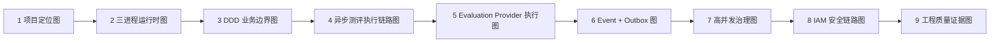

讲述节奏：

```text
先让听众知道项目是什么；
再让听众知道系统怎么跑；
再让听众知道领域为什么这么拆；
再讲最核心的答卷到报告链路；
再讲模型扩展能力；
再讲事件可靠性；
最后讲高并发、安全和工程质量。
```

---

## 3. 图 1：项目定位图

### 3.1 适合放在哪

- `00-项目一句话定位.md`
- `01-业务背景与问题.md`
- `09-30分钟技术分享脚本.md` 开场
- 简历项目介绍第一页

### 3.2 回答什么

```text
qs-server 是什么？
为什么不是普通问卷 CRUD？
为什么不是单纯医学量表系统？
```

### 3.3 推荐图

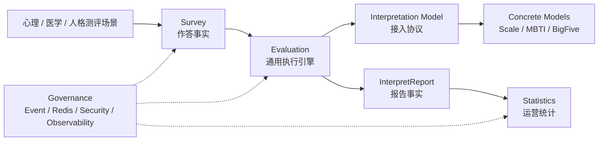

### 3.4 讲图脚本

```text
这张图只回答一个问题：qs-server 是什么。
用户填写的不是普通表单，而是一份需要被解释模型处理的测评数据。
Survey 保存作答事实；Evaluation 负责一次测评执行；Interpretation Model 提供统一接入协议；Scale、MBTI、BigFive 是具体模型；最后形成报告和统计。
所以 qs-server 的技术重点不是 CRUD，而是领域边界、异步执行、模型扩展和工程治理。
```

### 3.5 不要这样讲

不要说：

```text
Scale 管所有解释。
```

应该说：

```text
Scale 是医学量表解释模型；MBTI、BigFive 是同级具体解释模型。
```

---

## 4. 图 2：三进程运行时图

### 4.1 适合放在哪

- `02-三进程架构讲法.md`
- 30 分钟分享第 2-3 页
- 面试官问“系统怎么部署和运行”时

### 4.2 回答什么

```text
collection-server、qs-apiserver、qs-worker 分别做什么？
请求和事件如何在进程间流动？
```

### 4.3 推荐图

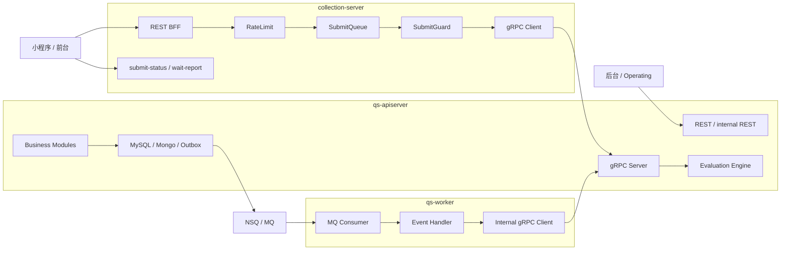

### 4.4 讲图脚本

```text
这不是三个微服务，而是以 apiserver 为主业务中心的三进程协作架构。
collection-server 面向前台，负责 BFF、限流、SubmitQueue、SubmitGuard 和提交状态查询。
qs-apiserver 是主业务中心，负责领域模型、REST/gRPC、MySQL、Mongo、Outbox 和 Evaluation Engine。
qs-worker 是异步驱动器，消费 MQ 事件后通过 internal gRPC 回到 apiserver 推进业务。
```

### 4.5 不要这样讲

不要说：

```text
worker 负责评估业务。
```

应该说：

```text
worker 负责消费事件和驱动流程，真正的业务状态机和持久化仍在 apiserver。
```

---

## 5. 图 3：DDD 业务边界图

### 5.1 适合放在哪

- `03-DDD与限界上下文讲法.md`
- 30 分钟分享 DDD 段
- 面试官问“你怎么做领域建模”时

### 5.2 回答什么

```text
为什么 Survey、Interpretation Model、Scale、Evaluation 要拆开？
为什么 MBTI 不应该放进 Scale？
```

### 5.3 推荐图

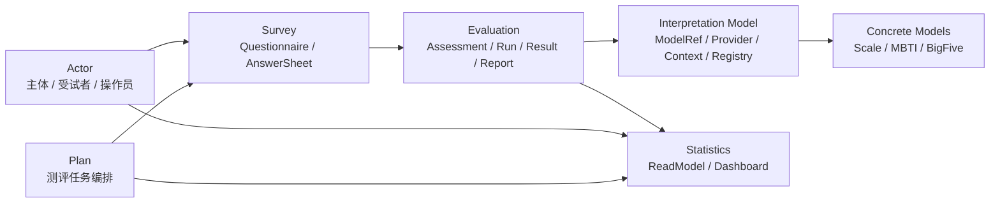

### 5.4 讲图脚本

```text
这张图回答的是业务边界。
Survey 管问卷、题目、提交规格和答卷事实。
Interpretation Model 管统一接入协议，包括 ModelRef、Provider、Context 和 Registry。
Scale、MBTI、BigFive 是具体解释模型，分别维护自己的规则事实。
Evaluation 管 Assessment、EvaluationRun、EvaluationResult 和 InterpretReport，也就是一次测评执行生命周期。
Statistics 是读侧聚合，服务后台运营和报表查询。
这些边界不是按表拆，而是按变化原因、生命周期和事实源拆。
```

### 5.5 不要这样讲

不要说：

```text
Survey / Scale / Evaluation 三个模块就够了。
```

应该说：

```text
Scale 是 Concrete Models 中的一个具体模型；Interpretation Model 才是多模型接入抽象。
```

---

## 6. 图 4：异步测评执行链路图

### 6.1 适合放在哪

- `04-异步测评执行链路讲法.md`
- `09-30分钟技术分享脚本.md` 核心段
- 面试官问“从提交到报告怎么跑”时

### 6.2 回答什么

```text
从用户提交答卷到报告生成，中间发生了什么？
同步边界在哪里？
异步边界在哪里？
```

### 6.3 推荐图

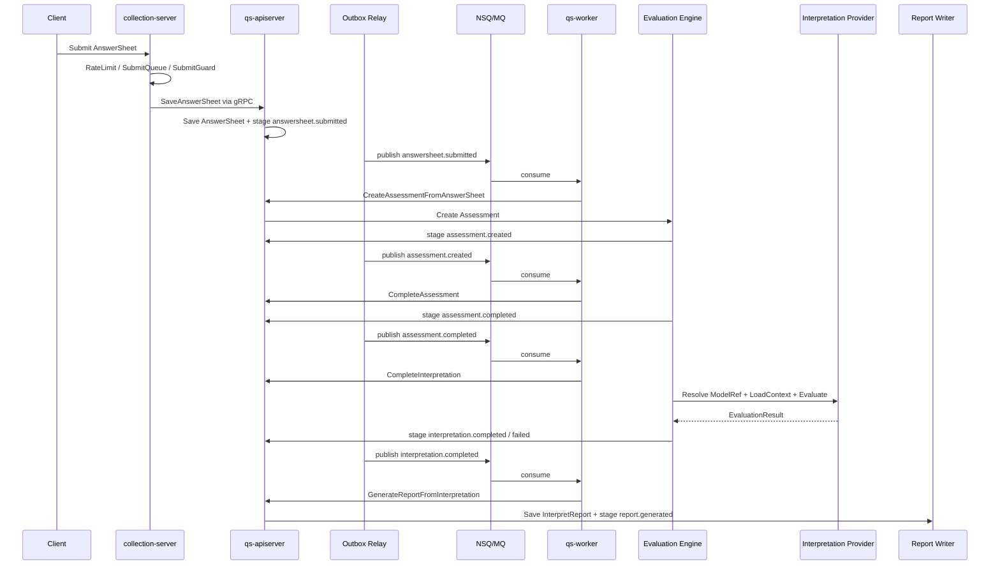

### 6.4 讲图脚本

```text
这张图分两段看。
左边是同步提交，目标是让 AnswerSheet 事实可靠保存。
右边是异步测评执行，目标是把 AnswerSheet 推进为 Assessment、EvaluationResult 和 InterpretReport。
中间用 Outbox 和 MQ 断开。
worker 消费事件后不会直接写主业务表，而是通过 internal gRPC 回到 apiserver。
Evaluation Engine 通过 ModelRef 找 Provider，Provider 可能是 ScaleProvider，也可能是 MBTIProvider。
```

### 6.5 旧图替换说明

废弃旧链路：

```text
CalculateAnswerSheetScore
assessment.submitted
EvaluateAssessment
Validation -> FactorScore -> RiskLevel -> Interpretation
```

使用新链路：

```text
answersheet.submitted
assessment.created
assessment.completed
interpretation.completed / interpretation.failed
report.generated
```

---

## 7. 图 5：Evaluation Provider 执行图

### 7.1 适合放在哪

- `03-DDD与限界上下文讲法.md`
- `09-30分钟技术分享脚本.md` 多解释模型段
- 面试官问“MBTI 怎么接入”时

### 7.2 回答什么

```text
Scale、MBTI、BigFive 如何同级接入 Evaluation？
Evaluation 如何避免依赖具体模型？
```

### 7.3 推荐图

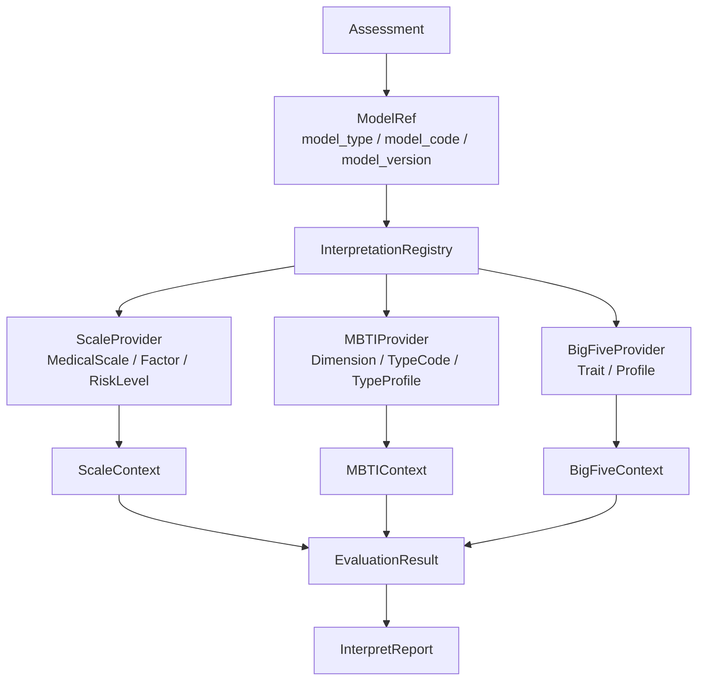

### 7.4 讲图脚本

```text
这张图讲多解释模型扩展。
Assessment 持有 ModelRef，ModelRef 里有 model_type、model_code 和 model_version。
Evaluation 通过 Registry 找到对应 Provider。
ScaleProvider 负责医学量表规则，MBTIProvider 负责 MBTI 规则，BigFiveProvider 负责 BigFive 规则。
Provider 输出结构化 EvaluationResult，Evaluation 再统一保存 InterpretReport。
所以新增 MBTI 不需要污染 Scale，也不应该让 Evaluation 直接依赖 MedicalScale。
```

### 7.5 不要这样讲

不要说：

```text
MBTI 是 Scale 的一种。
```

应该说：

```text
MBTI 与 Scale 同级，都是具体解释模型。
```

---

## 8. 图 6：Event + Outbox 可靠出站图

### 8.1 适合放在哪

- `05-事件与Outbox讲法.md`
- `09-30分钟技术分享脚本.md` Outbox 段
- 面试官问“MQ 怎么保证可靠”时

### 8.2 回答什么

```text
为什么用了 MQ 之后还需要 Outbox？
EventCatalog、RoutingPublisher、Outbox、Relay、Worker 分别做什么？
```

### 8.3 推荐图

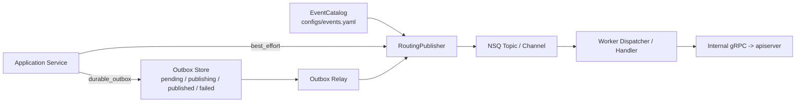

### 8.4 讲图脚本

```text
EventCatalog 管事件契约和 topic 路由。
RoutingPublisher 负责按事件类型发布。
轻量事件可以 best_effort。
关键事件先进入 Outbox，业务事实和事件同事务落库。
Relay 后台把 Outbox event 发布到 MQ。
MQ 负责传输，worker 负责消费，消费后通过 internal gRPC 回到 apiserver。
所以 MQ 和 Outbox 不是替代关系。
```

### 8.5 不要这样讲

不要说：

```text
Outbox 保证 exactly-once。
```

应该说：

```text
Outbox 保证 producer-side reliable publish，consumer 仍需要幂等。
```

---

## 9. 图 7：高并发分层治理图

### 9.1 适合放在哪

- `06-高并发治理讲法.md`
- 技术分享后半段
- 面试官问“怎么抗高并发”时

### 9.2 回答什么

```text
高并发压力在哪些层被挡住？
限流、队列、背压、锁、状态机分别负责什么？
```

### 9.3 推荐图

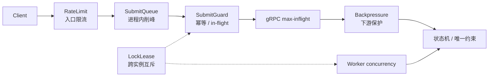

### 9.4 讲图脚本

```text
高并发不是一个限流器解决。
入口先被 RateLimit 挡住。
答卷提交再进入 SubmitQueue 削峰。
重复提交由 SubmitGuard 处理。
collection 到 apiserver 有 gRPC max-inflight。
apiserver 对 MySQL、Mongo、IAM 有 Backpressure。
跨实例互斥依赖 LockLease。
worker 消费用 concurrency 控制。
最后正确性仍靠状态机和唯一约束兜底。
```

### 9.5 不要这样讲

不要说：

```text
用了 Redis 就能抗高并发。
```

应该说：

```text
Redis 支撑限流、锁、幂等和缓存，但业务正确性还要靠状态机、唯一约束和降级策略。
```

---

## 10. 图 8：IAM 安全链路图

### 10.1 适合放在哪

- `07-IAM与安全讲法.md`
- 面试官问认证授权
- 解释 qs-server 与 IAM 项目连接时

### 10.2 回答什么

```text
JWT、Principal、OrgScope、AuthzSnapshot、CapabilityDecision 分别负责什么？
为什么不能直接用 JWT roles 做业务权限？
```

### 10.3 推荐图

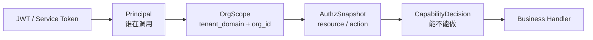

### 10.4 讲图脚本

```text
JWT 或 Service Token 先证明请求来源。
Principal 回答谁在调用。
OrgScope 回答在哪个 IAM 授权域 / QS 业务组织范围。
AuthzSnapshot 从 IAM 拉取当前 resource/action 权限。
CapabilityDecision 再判断能不能执行某个业务能力。
所以 JWT roles 不是业务权限真值。
```

### 10.5 解释模型权限补充

如果讲 MBTI，要补一句：

```text
能管理 MBTI 模型规则，不等于能查看用户 MBTI 报告。
前者是 manage_interpretation_models，后者是 read_interpretation_reports。
```

---

## 11. 图 9：工程质量与证据链图

### 11.1 适合放在哪

- `08-工程质量与测试讲法.md`
- 分享尾声
- 面试官问“怎么证明不是纸面设计”时

### 11.2 回答什么

```text
这个架构如何证明不是只停留在文档？
```

### 11.3 推荐图

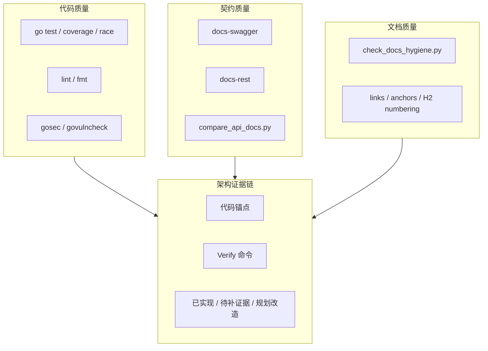

### 11.4 讲图脚本

```text
我把工程质量分四层。
代码层有测试、覆盖率、race、lint、安全扫描。
契约层有 swagger 和 api/rest 对比。
文档层有 docs-hygiene 检查链接、锚点和编号。
架构层要求每个设计结论有代码锚点和 Verify 命令。
```

### 11.5 不要这样讲

不要说：

```text
文档和代码完全一致。
```

应该说：

```text
通过校验脚本和代码锚点降低漂移风险。
```

---

## 12. 可选图：解释模型事件与缓存治理图

### 12.1 适合放在哪

- 讲 MBTI / BigFive 扩展时
- 讲 `report.changed` 和 `interpretation.completed` 区别时
- 面试官问“规则变化后会不会重算历史报告”时

### 12.2 推荐图

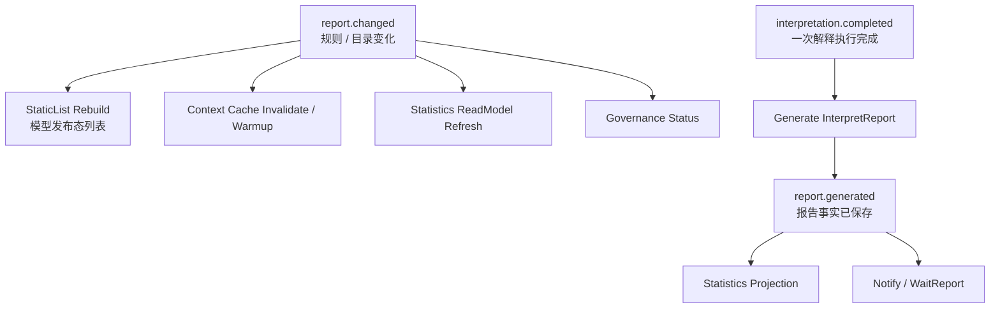

### 12.3 讲图脚本

```text
这里最重要的是区分两类事件。
report.changed 是规则变化，主要触发缓存失效、列表重建、Context warmup 和读模型刷新。
interpretation.completed 是某次 Assessment 的解释执行完成，后续会生成报告。
规则变化不应该默认触发历史 Assessment 重算。
历史重算必须建模成 ReEvaluationJob 或 RepairJob。
```

---

## 13. 可选图：事实源边界图

### 13.1 适合放在哪

- 讲数据设计
- 讲缓存边界
- 讲为什么 Redis / ReadModel 不是事实源时

### 13.2 推荐图

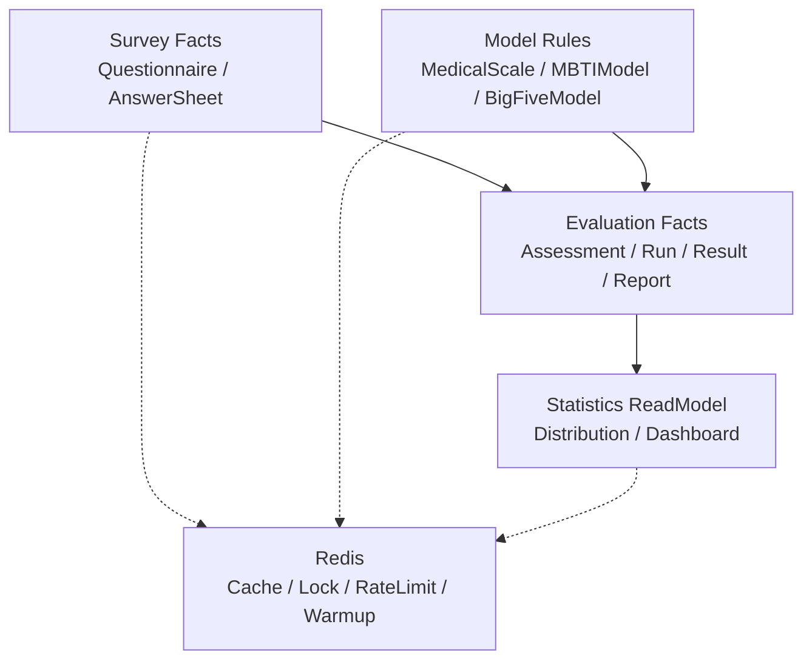

### 13.3 讲图脚本

```text
这张图讲事实源边界。
Survey 保存问卷和答卷事实。
具体模型模块保存规则事实。
Evaluation 保存执行事实和报告事实。
Statistics 保存读侧统计投影。
Redis 只是缓存、锁、限流和 warmup，不是业务事实源。
```

---

## 14. 可选图：系统演进路线图

### 14.1 适合放在哪

- 分享结尾
- 面试官问“下一步怎么演进”
- 系统路线规划

### 14.2 推荐图

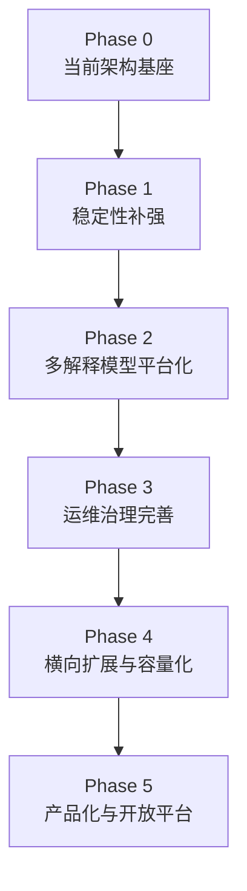

### 14.3 讲图脚本

```text
当前系统已经有三进程、业务边界、Outbox、读侧统计和 IAM 安全基座。
下一步不是盲目拆微服务，而是先补稳定性，再把 ModelRef / Provider / Context 固化，接入 MBTIProvider，之后补运维治理、压测和产品化能力。
```

---

## 15. PPT 页面命名建议

如果做 slides，可以这样命名：

| 页码 | 标题 |
| ---- | ---- |
| 1 | 项目定位：不是问卷 CRUD，而是多解释模型测评平台 |
| 2 | 业务挑战：作答、解释、报告、统计、权限 |
| 3 | 运行时：前台保护层 + 主业务中心 + 异步驱动器 |
| 4 | 领域边界：Survey / Interpretation Model / Concrete Models / Evaluation |
| 5 | 主链路：从 AnswerSheet 到 Assessment、Provider、Report |
| 6 | 多解释模型：Scale、MBTI、BigFive 同级 Provider |
| 7 | 事件可靠性：Outbox + MQ + Worker |
| 8 | 高并发治理：分层保护链 |
| 9 | 安全链路：Principal / OrgScope / AuthzSnapshot |
| 10 | 工程质量：代码、契约、文档、证据 |
| 11 | 演进路线：从稳定性到多模型平台化 |

---

## 16. Mermaid 使用建议

### 16.1 适合 flowchart 的图

- 项目定位图。
- 三进程架构图。
- DDD 业务边界图。
- Provider 执行图。
- Event System 分层。
- 高并发治理。
- IAM 安全链路。
- 工程质量证据。
- 系统演进路线。

### 16.2 适合 sequenceDiagram 的图

- 答卷提交主链路。
- 异步测评执行链路。
- Outbox relay。
- AuthzSnapshot 加载。
- SubmitQueue 状态流转。

### 16.3 适合 stateDiagram 的图

- Assessment 状态机。
- EvaluationRun 状态。
- Outbox 状态。
- SubmitQueue job status。
- PlanTask 状态。

### 16.4 适合表格的内容

- 进程职责。
- 模块职责。
- 事件 delivery 对比。
- 高并发保护点矩阵。
- IAM 概念边界。
- 测试证据链。

---

## 17. 图的维护原则

1. 宣讲层可以简化图，但不能改事实。
2. 真值变更后，优先修改 `00-05` truth layer 图。
3. 宣讲图只保留表达所需的最小元素。
4. 一张图最多讲一个主问题。
5. 图里不要塞过多包名和文件名。
6. 面试图优先表达职责和方向，不优先表达完整类图。
7. 图中如果出现“已实现”能力，必须能回链源码或文档。
8. 规划能力必须标注为“规划”或不要画入当前架构图。
9. 新增解释模型时，必须检查 DDD 图、Provider 图、事件图、缓存治理图是否需要同步更新。
10. 事件图必须使用 `assessment.created / assessment.completed / interpretation.completed / report.generated` 新语义，不再使用旧 `assessment.submitted / assessment.interpreted`。

---

## 18. 不建议使用的图

### 18.1 超大系统全景图

问题：

- 信息密度太高。
- 听众不知道看哪里。
- 面试时很难讲清。

替代：

```text
三进程图 + DDD 图 + 异步测评执行链路图
```

### 18.2 纯包结构图

问题：

- 像目录介绍，不像架构说明。
- 难回答“为什么这样设计”。

替代：

```text
领域边界图 / 运行时调用图
```

### 18.3 过细类图

问题：

- 面试前几分钟不适合。
- 容易被拉进实现细节。

替代：

```text
聚合职责表 + 状态机图
```

### 18.4 包含未来规划但不标注的图

问题：

- 容易被误认为已实现。
- 追问时证据不足。

替代：

```text
当前架构图 + 演进路线图
```

### 18.5 Scale 中心图

问题：

- 会让听众误以为 Scale 是所有解释模型的中心。
- 不利于解释 MBTI 与 Scale 同级。

替代：

```text
Interpretation Model + Provider 图
```

---

## 19. 讲图通用模板

每张图都可以按这个模板讲：

```text
这张图回答的是【问题】。

从左到右 / 从上到下看：
第一块是【模块/进程】，
它负责【职责】，
不负责【边界】。

第二块是【模块/进程】，
它和前一块通过【调用/事件/引用】协作。

这里最重要的边界是【核心边界】。

这张图不要误解成【常见误区】。
```

例子：

```text
这张图回答的是“从答卷到报告怎么异步推进”。
从左到右看，collection 保护前台入口，apiserver 保存 AnswerSheet 和 outbox，worker 消费事件后回调 apiserver，Evaluation Engine 通过 Provider 执行具体模型并生成报告。
这里最重要的边界是：worker 不是业务事实中心，真正的状态机和持久化仍在 apiserver。
这张图不要误解成“MQ 保证 exactly-once”。
```

---

## 20. 本文与宣讲目录的关系

| 宣讲文档 | 推荐图 |
| -------- | ------ |
| `00-项目一句话定位.md` | 项目定位图 |
| `01-业务背景与问题.md` | 项目定位图 / 业务问题图 |
| `02-三进程架构讲法.md` | 三进程运行时图 |
| `03-DDD与限界上下文讲法.md` | DDD 业务边界图 / Provider 执行图 |
| `04-异步测评执行链路讲法.md` | 异步测评执行时序图 |
| `05-事件与Outbox讲法.md` | Event + Outbox 图 |
| `06-高并发治理讲法.md` | 高并发分层治理图 |
| `07-IAM与安全讲法.md` | IAM 安全链路图 |
| `08-工程质量与测试讲法.md` | 工程质量与证据链图 |
| `09-30分钟技术分享脚本.md` | 按脚本依次使用 1-9 图 |
| `11-面试追问证据索引.md` | 图只做辅助，重点看证据表 |

---

## 21. 证据回链

| 判断 | 证据 |
| ---- | ---- |
| 项目不是普通问卷 CRUD | `00-项目一句话定位.md`、`01-业务背景与问题.md` |
| 三进程协作 | `02-三进程架构讲法.md`、`../01-运行时/README.md` |
| DDD 新边界 | `03-DDD与限界上下文讲法.md`、`../05-专题分析/01-为什么拆分Survey-InterpretationModel-Evaluation.md` |
| 异步测评执行链路 | `04-异步测评执行链路讲法.md`、`../05-专题分析/02-为什么同步提交但异步测评执行.md` |
| 多解释模型扩展 | `../05-专题分析/08-多解释模型扩展专题--从Scale到MBTI.md` |
| Evaluation 通用执行引擎 | `../05-专题分析/09-Evaluation通用执行引擎专题.md` |
| 解释模型事件与缓存治理 | `../05-专题分析/10-解释模型事件与缓存治理专题.md` |
| Outbox 可靠出站 | `05-事件与Outbox讲法.md`、`../05-专题分析/04-为什么使用Outbox.md` |
| 高并发治理 | `06-高并发治理讲法.md`、`../03-基础设施/concurrency/README.md` |
| IAM 安全链路 | `07-IAM与安全讲法.md`、`../03-基础设施/security/README.md` |
| 工程质量 | `08-工程质量与测试讲法.md` |
