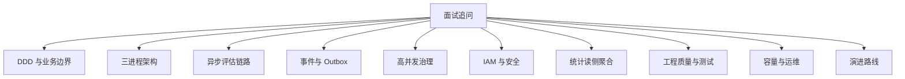

# 面试追问证据索引

**本文回答**：面试官围绕 `qs-server` 继续追问时，应该如何快速回答、如何回链证据、哪些话可以讲、哪些话不能讲过头；如何把 DDD、三进程、异步评估、Outbox、高并发、IAM、统计、测试质量和演进路线组织成一套可答辩的证据索引。

---

## 1. 使用方式

这不是一篇从头到尾朗读的文章，而是面试时的“追问导航表”。

建议使用方式：

```text
面试官问什么
  -> 先判断问题类型
  -> 用 30 秒回答
  -> 再给 1 个核心取舍
  -> 最后回链证据
```

旧版宣讲文档里给过一个很好的回答格式，建议继续沿用：

| 顺序 | 内容 | 示例 |
| ---- | ---- | ---- |
| 1 | 先说问题 | “这里要解决的是答卷提交不能被评估耗时拖住。” |
| 2 | 再说模型 | “所以同步保存答卷，评估通过 Outbox + worker 异步推进。” |
| 3 | 再说模式和取舍 | “用 Outbox 保证出站一致性，但不承诺 exactly-once。” |
| 4 | 最后给证据 | “证据在 Event 文档、Outbox 实现和测试入口。” |

一句话原则：

> **不要把回答讲成“用了某技术”，要讲成“为了解决某问题，我做了某设计，并知道它的代价和证据”。**

---

## 2. 追问分类地图



---

## 3. 最常见 12 个追问速查

| 追问 | 30 秒回答 | 证据入口 |
| ---- | --------- | -------- |
| 这个项目不是问卷 CRUD 的难点在哪里？ | 难点在量表规则、评估状态、报告生成、统计运营和权限边界，不是保存题目答案 | `00-项目一句话定位.md`、`01-业务背景与问题.md` |
| 为什么 Survey / Scale / Evaluation 要拆开？ | 问卷是收集载体，量表是规则资产，评估是执行实例，三者变化原因不同 | `03-DDD与限界上下文讲法.md`、`05-专题分析/01-*` |
| 为什么不是单进程？ | 前台入口、主业务事实、异步评估压力不同，所以拆成 collection / apiserver / worker | `02-三进程架构讲法.md` |
| 为什么不是微服务？ | 当前是以 apiserver 为主业务中心的三进程协作，不是完全独立服务治理 | `02-三进程架构讲法.md`、`05-专题分析/07-*` |
| 为什么提交同步、评估异步？ | 提交要保证答卷事实可靠落库，评估涉及计分/报告，慢且失败面大，应异步执行 | `04-异步评估链路讲法.md` |
| 有 MQ 为什么还要 Outbox？ | MQ 只负责传输，Outbox 解决 DB commit 与 MQ publish 双写一致性 | `05-事件与Outbox讲法.md` |
| 怎么处理重复提交？ | collection 有 SubmitGuard，AnswerSheet durable submit 有 idempotency key，Assessment 有唯一约束和状态机 | `06-高并发治理讲法.md` |
| 怎么抗高并发？ | 入口限流、SubmitQueue、SubmitGuard、gRPC max-inflight、Backpressure、LockLease、worker concurrency 分层治理 | `06-高并发治理讲法.md` |
| 怎么做权限？ | JWT 做认证，TenantScope 确定组织，AuthzSnapshot 做授权，CapabilityDecision 做业务能力判断 | `07-IAM与安全讲法.md` |
| 为什么不用 JWT roles 授权？ | roles 可能滞后且粒度粗，业务权限需要 resource/action 和 authz_version | `07-IAM与安全讲法.md` |
| 统计为什么不用实时 SQL？ | 统计是运营读侧，跨模块、口径复杂、高频查询，需要 read model、sync、cache、projection | `05-专题分析/05-*` |
| 怎么证明不是纸面架构？ | 有 Go test/lint/security、OpenAPI/Swagger 对比、docs hygiene、代码锚点和 Verify 命令 | `08-工程质量与测试讲法.md` |

---

## 4. 项目定位类追问

### 4.1 问：这个项目一句话是什么？

**推荐回答：**

> **qs-server 是一个面向心理/医学测评场景的 Go 后端系统，通过 Survey、Scale、Evaluation 的领域拆分和 collection-server、apiserver、worker 的三进程协作，实现前台可靠提交答卷、后台异步评估生成报告、读侧统计与安全治理可持续演进。**

**证据入口：**

- `06-宣讲/00-项目一句话定位.md`
- `06-宣讲/01-业务背景与问题.md`

**不要这样说：**

```text
这是一个问卷系统。
```

这会把项目讲低。

---

### 4.2 问：这个项目最核心的技术难点是什么？

**推荐回答：**

> **我认为有三类难点。第一是业务边界：问卷、量表规则和评估报告不能混在一起；第二是链路时序：提交答卷要快，但评估报告适合异步执行；第三是工程治理：要处理高峰提交、事件可靠出站、重复消费、权限和统计查询。**

**可以展开：**

- DDD：Survey / Scale / Evaluation。
- 异步：Outbox + worker + pipeline。
- 高并发：SubmitQueue + Backpressure + LockLease。
- 安全：AuthzSnapshot。

**不要这样说：**

```text
难点是用了很多技术栈。
```

技术栈不是难点，问题和取舍才是难点。

---

## 5. DDD 与限界上下文类追问

### 5.1 问：你怎么体现 DDD？

**推荐回答：**

> **我主要用 DDD 解决边界问题，而不是套术语。测评业务里有三类变化源：Survey 管问卷和答卷，是采集事实；Scale 管量表、因子、计分和解读规则，是规则权威；Evaluation 管 Assessment、Score、Report 和状态机，是测评产出。它们通过引用、快照、事件和应用服务协作，不用一个大聚合硬塞所有逻辑。**

**证据入口：**

- `06-宣讲/03-DDD与限界上下文讲法.md`
- `05-专题分析/01-为什么拆分survey-scale-evaluation.md`

**不要这样说：**

```text
我用了实体、值对象、聚合、领域服务。
```

这太空，需要落到业务边界。

---

### 5.2 问：为什么 Survey 和 Scale 不放一起？

**推荐回答：**

> **Survey 是收集载体，关心题目、选项、校验和答卷；Scale 是规则资产，关心因子、计分规则、风险阈值和解读文案。新增题型主要影响 Survey，修改风险规则主要影响 Scale，变化原因不同，所以拆开。**

**追问时可补：**

> **一个量表可以绑定问卷，但不等于问卷。问卷解决“填什么”，量表解决“怎么算和怎么解释”。**

**证据入口：**

- `03-DDD与限界上下文讲法.md`
- `05-专题分析/01-*`

---

### 5.3 问：AnswerSheet 和 Assessment 有什么区别？

**推荐回答：**

> **AnswerSheet 是用户提交的答案事实；Assessment 是系统基于这份答卷和某套量表规则执行的一次评估实例。提交成功不代表评估完成，所以它们不能合并成一个对象。**

**证据入口：**

- `03-DDD与限界上下文讲法.md`
- `04-异步评估链路讲法.md`
- `05-专题分析/02-*`

---

### 5.4 问：Statistics 为什么也算一个上下文？

**推荐回答：**

> **Statistics 不是写模型的一部分，而是运营读侧。它面向 overview、clinician、entry、questionnaire batch 等查询，涉及 ReadService、BehaviorProjector、SyncService、QueryCache 和 Hotset。如果每次实时 join Survey/Evaluation/Actor/Plan，会压主库、口径散、难修复。**

**证据入口：**

- `05-专题分析/05-为什么需要读侧统计聚合.md`

---

## 6. 三进程架构类追问

### 6.1 问：为什么要拆 collection-server、apiserver、worker？

**推荐回答：**

> **因为它们面对的压力和职责不同。collection-server 面向前台，是 BFF 和保护层；apiserver 是主业务中心，保存事实和承载领域模型；worker 是异步执行器，消费事件后回调 apiserver 推进评估。这样前台高峰、主业务写入和后台慢任务可以分层治理。**

**证据入口：**

- `02-三进程架构讲法.md`
- `04-接口与运维/00-接口契约总览.md`

---

### 6.2 问：这是微服务吗？

**推荐回答：**

> **我不会强行讲成微服务。更准确是以 apiserver 为主业务中心的三进程协作架构。业务模块仍在 apiserver 内按 DDD 边界组织，collection 是前台 BFF，worker 是异步执行器。**

**不要这样说：**

```text
这是三个微服务。
```

除非能证明独立业务边界、独立数据所有权、独立发布治理。

---

### 6.3 问：为什么 collection 不直接写数据库？

**推荐回答：**

> **collection 的职责是前台入口保护，不是主业务事实源。如果它直接写数据库，就要复制 Survey 的答卷校验、幂等、Outbox 和事务逻辑。主写模型会分裂。所以 collection 只做认证、限流、SubmitQueue、SubmitGuard、监护关系校验和 DTO 转换，真正保存 AnswerSheet 交给 apiserver。**

---

### 6.4 问：为什么 worker 不直接写数据库？

**推荐回答：**

> **worker 负责异步驱动，不拥有 Evaluation 业务模型。Assessment 状态机、Score/Report 持久化和 Outbox 都在 apiserver。worker 如果直接写库，会把状态机和事务边界复制一份。**

---

## 7. 异步评估链路类追问

### 7.1 问：异步评估链路怎么跑？

**推荐回答：**

> **链路是：用户提交 AnswerSheet 后，apiserver 保存答卷并 stage `answersheet.submitted` Outbox；relay 发布到 MQ；worker 消费后通过 internal gRPC 回调 apiserver，先计算答卷分，再创建 Assessment；Assessment submitted 后再触发 EvaluateAssessment，进入 Validation、FactorScore、RiskLevel、Interpretation、WaiterNotify 的 pipeline，最终保存 Score 和 Report。**

**证据入口：**

- `04-异步评估链路讲法.md`

---

### 7.2 问：为什么不提交时同步生成报告？

**推荐回答：**

> **报告生成涉及加载量表规则、因子计分、风险判断、解读报告、Mongo/MySQL 写入、事件和通知，慢且失败面大。如果放在提交请求里，会拖慢前台体验，也会让报告失败影响答卷提交。当前设计是同步保存答卷事实，异步推进评估结果。**

---

### 7.3 问：如果 worker 挂了会怎样？

**推荐回答：**

> **AnswerSheet 已经保存，事件起点在 Outbox 或 MQ 中。worker 挂了不会导致答卷丢失，只会导致评估延迟。worker 恢复后继续消费；如果事件还没发布，Outbox relay 会继续发布 pending/failed 事件。**

**不要说：**

```text
worker 挂了也完全无影响。
```

准确说是：

```text
提交事实不丢，但报告生成会延迟。
```

---

### 7.4 问：这条链是 exactly-once 吗？

**推荐回答：**

> **不是。更准确是至少一次投递 + 业务幂等。Outbox 解决 producer 端不丢事件，MQ 负责投递，worker handler 可能重复执行，所以要用 Redis lock、唯一约束、状态机和 checkpoint 做幂等。**

---

## 8. 事件与 Outbox 类追问

### 8.1 问：有 NSQ 了为什么还要 Outbox？

**推荐回答：**

> **NSQ 解决消息传输，不解决数据库 commit 和 publish MQ 之间的原子性。比如 AnswerSheet 保存成功后，进程还没 publish NSQ 就崩溃，消息就丢了。Outbox 把业务事实和待发布事件放在同一个事务里，再由 relay 发布到 NSQ。**

**证据入口：**

- `05-事件与Outbox讲法.md`
- `05-专题分析/04-为什么使用Outbox.md`

---

### 8.2 问：Outbox 和 MQ 的区别？

**推荐回答：**

> **Outbox 是 producer-side reliability，解决业务事实和事件出站一致性；MQ 是 transport，负责进程间投递；worker 是 consumer，负责处理消息和 Ack/Nack。**

---

### 8.3 问：所有事件都需要 Outbox 吗？

**推荐回答：**

> **不需要。主链路关键事件，比如答卷提交、Assessment 生命周期、报告生成，适合 durable_outbox；缓存刷新、轻量通知、部分 task 事件可以 best_effort。事件可靠性要按业务重要性分层。**

---

### 8.4 问：事件系统是不是 Event Sourcing？

**推荐回答：**

> **不是。当前是事件驱动 + Outbox。业务状态仍然存储在 MySQL/Mongo 的聚合表/文档中，事件用于异步驱动和副作用通知，不是重建全部业务状态的唯一事实源。**

---

## 9. 高并发治理类追问

### 9.1 问：你怎么做高并发？

**推荐回答：**

> **我按链路分层治理。前台入口有 RateLimit；答卷提交有 SubmitQueue 削峰；重复提交有 SubmitGuard；collection 到 apiserver 有 gRPC max-inflight；apiserver 对 MySQL/Mongo/IAM 有 Backpressure；worker 消费有 concurrency 和 duplicate suppression；最终通过 resilienceplane 统一记录 rate_limited、queue_full、backpressure_timeout、lock_contention、duplicate_skipped 等 outcome。**

**证据入口：**

- `06-高并发治理讲法.md`
- `03-基础设施/resilience/00-整体架构.md`

---

### 9.2 问：SubmitQueue 和 MQ 有什么区别？

**推荐回答：**

> **SubmitQueue 是 collection 进程内有界队列，解决前台短峰削峰；MQ 是进程间消息系统，解决异步事件投递。SubmitQueue 不持久化，不跨实例，不替代 Outbox 和 NSQ。**

---

### 9.3 问：Redis 锁能保证 exactly-once 吗？

**推荐回答：**

> **不能。Redis lock 只能做短期互斥和重复抑制，正确性还要靠 done marker、唯一约束、状态机和幂等记录。**

---

### 9.4 问：Backpressure 和限流有什么区别？

**推荐回答：**

> **限流挡的是入口速率，Backpressure 挡的是下游并发槽位。比如调用 MySQL/Mongo/IAM 前先拿槽位，避免下游慢时上游继续加压。它不等于 SQL timeout。**

---

### 9.5 问：你做过压测吗？

**推荐回答：**

> **当前可以讲系统有容量档位建议和高并发保护点，但如果没有完整压测报告，我不会承诺固定 QPS。真正 QPS 要看 k6 压测、p95/p99、5xx、429、queue depth、backpressure timeout、DB 慢查询、MQ backlog 等指标。**

---

## 10. IAM 与安全类追问

### 10.1 问：你怎么做认证授权？

**推荐回答：**

> **认证用 IAM TokenVerifier 验证 JWT，投影成 Principal；租户范围用 TenantScope 表达 tenant_id 和 org_id；授权不直接看 JWT roles，而是通过 AuthzSnapshotLoader 调 IAM GetAuthorizationSnapshot，拿到 roles、permissions、authz_version，再用 CapabilityDecision 判断业务能力。**

**证据入口：**

- `07-IAM与安全讲法.md`
- `03-基础设施/security/00-整体架构.md`

---

### 10.2 问：为什么不用 JWT roles 做权限？

**推荐回答：**

> **JWT roles 可能滞后，且粒度粗，不能完整表达 resource/action。比如读取问卷、管理量表、读取答卷、触发评估是不同能力，所以业务授权要基于 AuthzSnapshot。**

---

### 10.3 问：IAM SDK 会不会侵入业务？

**推荐回答：**

> **不会直接侵入 domain。IAM SDK 通过 IAMModule 和 infra wrapper 嵌入 runtime，业务层消费 Principal、TenantScope、AuthzSnapshot、ServiceIdentity 等投影模型或 port。domain 只保存必要外部引用 ID，不 import IAM SDK。**

---

### 10.4 问：ServiceAuth 和 mTLS 怎么分工？

**推荐回答：**

> **ServiceAuth 提供 bearer token 中的服务声明，mTLS 提供连接证书身份。两者可以做 identity match，比如 JWT service_id 和证书 CN 一致性。用户级权限仍走 Principal/TenantScope/AuthzSnapshot，不和 service identity 混用。**

---

### 10.5 问：Operator local roles 能授权吗？

**推荐回答：**

> **不能。Operator local roles 是 IAM snapshot roles 的本地投影，用于展示和协作查询，不作为权限真值。权限判断仍看 AuthzSnapshot。**

---

## 11. 统计与读模型类追问

### 11.1 问：为什么统计不用实时 SQL？

**推荐回答：**

> **因为统计涉及 Survey、Evaluation、Actor、Plan 等多个模块，维度多、口径复杂、查询高频。每次实时 join 会压主库，也难以修复历史口径。所以做 Statistics 读侧聚合，包含 ReadService、BehaviorProjector、SyncService、QueryCache 和 Hotset。**

---

### 11.2 问：BehaviorProjector 解决什么？

**推荐回答：**

> **它把行为事件投影成统计读侧需要的轨迹和归因数据。因为事件发生时关联对象可能还没准备好，所以需要 checkpoint 和 pending retry，避免事件丢失或重复归因。**

---

### 11.3 问：统计不准怎么排查？

**推荐回答：**

> **先看源数据是否存在，再看行为事件是否投影、pending 是否积压、SyncService 是否运行、repair window 是否覆盖目标日期、QueryCache 是否返回旧值，最后查 read model SQL。**

---

## 12. 工程质量与测试类追问

### 12.1 问：你怎么保证代码质量？

**推荐回答：**

> **我分代码、契约、文档和架构证据四层。代码层有 go test、coverage、race、lint、安全扫描；契约层有 swagger 生成和 api/rest 对比；文档层有 docs-hygiene 检查链接、锚点和 H2 编号；架构层每篇核心文档有代码锚点和 Verify 命令。**

**证据入口：**

- `08-工程质量与测试讲法.md`
- `Makefile`
- `scripts/check_docs_hygiene.py`
- `scripts/compare_api_docs.py`

---

### 12.2 问：你怎么证明文档不漂？

**推荐回答：**

> **不能说完全不漂，但通过工具降低漂移风险。docs-hygiene 检查 Markdown 相对链接、锚点和 H2 编号；compare_api_docs 比对 api/rest 和 swagger 的 path/method 覆盖；docs-verify 把这些动作组合起来。**

---

### 12.3 问：异步链路怎么测试？

**推荐回答：**

> **拆层测试：Outbox 测 stage/claim/mark published/failed；worker handler 测事件解析和 internal gRPC 调用；Evaluation pipeline 测每个 step；状态机测 submitted/interpreted/failed；端到端再测 submit 到 report。**

---

## 13. 容量与运维类追问

### 13.1 问：系统如何扩容？

**推荐回答：**

> **按压力来源扩。前台压力大扩 collection；主业务处理慢扩 apiserver 和优化 DB/Mongo；事件积压扩 worker 或调整 worker concurrency。扩容前提是 SubmitGuard、Outbox claim、worker 幂等、scheduler leader lock 都能支持多实例。**

---

### 13.2 问：healthz ok 是否表示业务可用？

**推荐回答：**

> **不一定。healthz 通常只表示 HTTP router 活着。Redis degraded、MQ backlog、DB 慢、IAM snapshot 失败要看 governance status、metrics 和日志。**

---

### 13.3 问：系统现在能承载多少 QPS？

**推荐回答：**

> **如果没有完整压测报告，我不直接承诺数字。可以说有容量档位和资源配置建议，也有 RateLimit、SubmitQueue、Backpressure、worker concurrency 等保护点，但真实 QPS 要通过压测验证 p95/p99、错误率、429、queue depth、backpressure timeout、DB/Mongo/Redis/MQ 指标。**

---

## 14. 系统演进类追问

### 14.1 问：下一步怎么演进？

**推荐回答：**

> **我不会优先拆微服务，而是先补强生产级治理：Outbox failed/replay、Evaluation failed retry、SubmitQueue/SubmitGuard 契约、Statistics sync governance、Authz capability matrix、worker backlog dashboard 和压测报告。之后再考虑多实例、数据层独立、operating 平台和产品化能力。**

**证据入口：**

- `05-专题分析/07-系统演进路线.md`

---

### 14.2 问：为什么不先拆微服务？

**推荐回答：**

> **当前更重要的是把模块化单体主业务中心的边界和可靠性打稳。过早拆微服务会增加部署、数据一致性、服务治理和排障复杂度。Survey/Scale/Evaluation 先作为代码和模型边界稳定下来，未来再按瓶颈拆物理服务更稳。**

---

### 14.3 问：以后 AI 解读怎么接？

**推荐回答：**

> **不建议直接塞进基础报告主链路。更合理是把基础 Evaluation Report 作为稳定结果，AI 解读作为异步增强层，带 prompt/version trace、审核和回退，不影响基础报告生成。**

---

## 15. 可讲与不可讲总表

| 说法 | 是否可讲 | 推荐表达 |
| ---- | -------- | -------- |
| qs-server 不是普通问卷 CRUD | 可讲 | 它是问卷&量表测评后端 |
| 使用了 DDD 限界上下文 | 可讲 | 强调变化原因拆分，不堆术语 |
| 三进程架构 | 可讲 | 叫三进程协作，不强行叫微服务 |
| 同步提交、异步评估 | 可讲 | 事实同步，结果异步 |
| Outbox 保证 producer-side reliable publish | 可讲 | 不保证 exactly-once |
| NSQ 保证全链路可靠 | 不可讲 | NSQ 只负责传输 |
| SubmitQueue 保证提交不丢 | 不可讲 | SubmitQueue 是内存削峰，durable submit 才保证事实 |
| JWT roles 做业务权限 | 不可讲 | AuthzSnapshot 做 capability 判断 |
| Operator roles 是权限真值 | 不可讲 | 它只是本地投影 |
| 已经完整压测 1000 QPS | 无报告不可讲 | 只能讲容量建议和待压测 |
| 完整 ACL 已落地 | 谨慎 | 当前有 seam，完整策略仍需完善 |
| 这是 Event Sourcing | 不可讲 | 当前是事件驱动 + Outbox |

---

## 16. 回答模板库

### 16.1 设计类追问模板

```text
这个设计解决的是【问题】。
我没有选择【替代方案】，因为它会导致【代价】。
当前方案是【设计】。
它的收益是【收益】，代价是【代价】。
证据可以看【文档/源码/测试】。
```

### 16.2 风险类追问模板

```text
这里不能讲成完全闭环。
当前已实现的是【已实现】。
还需要补的是【待补证据/规划】。
所以我会把它描述为【准确表述】，不会说成【过度表述】。
```

### 16.3 性能类追问模板

```text
我先区分压力来源。
如果是入口压力，看 RateLimit / SubmitQueue。
如果是下游压力，看 Backpressure / DB / Mongo / IAM。
如果是异步积压，看 Outbox / MQ / worker。
具体 QPS 需要压测指标支撑，不能只靠配置估算。
```

---

## 17. 快速证据入口

| 主题 | 宣讲文档 |
| ---- | -------- |
| 项目定位 | `00-项目一句话定位.md` |
| 业务背景 | `01-业务背景与问题.md` |
| 三进程 | `02-三进程架构讲法.md` |
| DDD | `03-DDD与限界上下文讲法.md` |
| 异步评估 | `04-异步评估链路讲法.md` |
| Event / Outbox | `05-事件与Outbox讲法.md` |
| 高并发 | `06-高并发治理讲法.md` |
| IAM / 安全 | `07-IAM与安全讲法.md` |
| 工程质量 | `08-工程质量与测试讲法.md` |
| 30 分钟脚本 | `09-30分钟技术分享脚本.md` |
| 图素材 | `10-架构图素材索引.md` |

---

## 18. 真值层证据入口

| 主题 | Truth layer |
| ---- | ----------- |
| Survey / Scale / Evaluation 拆分 | `05-专题分析/01-为什么拆分survey-scale-evaluation.md` |
| 同步提交异步评估 | `05-专题分析/02-为什么同步提交但异步评估.md` |
| collection 保护层 | `05-专题分析/03-为什么需要collection保护层.md` |
| Outbox | `05-专题分析/04-为什么使用Outbox.md` |
| 统计读侧聚合 | `05-专题分析/05-为什么需要读侧统计聚合.md` |
| IAM SDK 边界 | `05-专题分析/06-IAM嵌入式SDK边界分析.md` |
| 系统演进路线 | `05-专题分析/07-系统演进路线.md` |
| Resilience | `03-基础设施/resilience/README.md` |
| Security | `03-基础设施/security/README.md` |
| Event | `03-基础设施/event/README.md` |
| Redis | `03-基础设施/redis/README.md` |
| Interfaces/Ops | `04-接口与运维/README.md` |

---

## 19. 源码锚点入口

| 能力 | 源码锚点 |
| ---- | -------- |
| apiserver container | `internal/apiserver/container` |
| collection container | `internal/collection-server/container` |
| worker handlers | `internal/worker/handlers` |
| Survey domain/application | `internal/apiserver/domain/survey`、`internal/apiserver/application/survey` |
| Scale domain/application | `internal/apiserver/domain/scale`、`internal/apiserver/application/scale` |
| Evaluation domain/application | `internal/apiserver/domain/evaluation`、`internal/apiserver/application/evaluation` |
| Evaluation pipeline | `internal/apiserver/application/evaluation/engine/pipeline` |
| Outbox | `internal/apiserver/application/eventing`、`internal/apiserver/infra/mysql/eventoutbox`、`internal/apiserver/infra/mongo/eventoutbox` |
| Resilience | `internal/pkg/resilienceplane`、`internal/pkg/backpressure`、`internal/pkg/locklease`、`internal/pkg/ratelimit` |
| SubmitQueue | `internal/collection-server/application/answersheet` |
| Security | `internal/pkg/securityplane`、`internal/pkg/securityprojection`、`internal/pkg/iamauth` |
| Statistics | `internal/apiserver/application/statistics` |
| REST routes | `internal/apiserver/transport/rest`、`internal/collection-server/transport/rest` |
| gRPC registry | `internal/apiserver/transport/grpc` |

---

## 20. Verify 命令入口

```bash
# 全量测试
make test

# 单元测试
make test-unit

# 覆盖率
make test-coverage

# Race
make test-race

# Lint / format
make lint
make fmt-check

# Security
make security-govulncheck
make security-gosec

# REST + docs verify
make docs-rest
make docs-hygiene
make docs-verify
```

专题改动后建议：

```bash
make docs-hygiene
git diff --check
```

---

## 21. 最终面试收束句

如果面试最后让你总结项目，可以这样说：

> **这个项目我最想强调的不是用了多少技术，而是对复杂业务边界和异步可靠性的治理。业务上，我把问卷收集、量表规则和评估报告拆成 Survey、Scale、Evaluation；运行时上，我用 collection、apiserver、worker 三进程隔离前台入口、主业务事实和异步执行；工程上，我用 Outbox、SubmitQueue、Backpressure、LockLease、AuthzSnapshot、Statistics read model 和文档/契约校验，把提交、评估、统计、安全和质量都做成可解释、可演进的链路。对于还没完全闭环的地方，比如固定重试次数、完整 ACL、完整压测报告，我会明确讲成后续演进，而不是包装成现状。**
