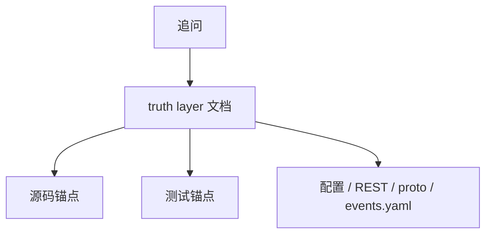

# 面试追问证据索引

**本文回答**：当听众继续追问“代码在哪里、测试在哪里、为什么这样设计”时，应该如何快速回链到证据。

## 30 秒结论

| 追问类型 | 回答策略 |
| -------- | -------- |
| 架构边界 | 先回到 `00-总览` 和 `02-业务模块` 的模型图 |
| 异步链路 | 回到 Event 深讲、Evaluation 深讲和 outbox tests |
| 高并发治理 | 回到 Resilience Plane 能力矩阵和 contract tests |
| Redis 设计 | 回到 Redis 深讲目录，不用单独口述旧历史 |
| 行为投影 | 回到 behavior projection 深讲目录和 statistics projector |

## 证据路径图



## 回答格式

被追问时建议固定成四句话，避免只抛名词：

| 顺序 | 内容 | 示例 |
| ---- | ---- | ---- |
| 1 | 先说问题 | “这里要解决的是答卷提交不能被评估耗时拖住。” |
| 2 | 再说模型 | “所以同步保存答卷，评估通过 outbox + worker 异步推进。” |
| 3 | 再说模式和取舍 | “用 Outbox 保证出站一致性，但不承诺 exactly-once。” |
| 4 | 最后给证据 | “证据在 Event 文档和 outbox tests。” |

这个格式能避免把回答讲成“用了 MQ、用了 Redis、用了 DDD”的技术清单。

## 高频追问索引

| 追问 | 推荐回答 | 证据 |
| ---- | -------- | ---- |
| 为什么不是单进程单模块 | 三进程承接不同职责：apiserver 权威写模型，collection 入口保护，worker 异步执行 | [../00-总览/02-代码组织与边界.md](../00-总览/02-代码组织与边界.md)、[../01-运行时/README.md](../01-运行时/README.md) |
| 为什么 survey / scale / evaluation 分离 | 采集事实、规则权威、产出状态三类变化原因不同 | [../05-专题分析/01-测评业务模型：survey、scale、evaluation 为什么分离.md](../05-专题分析/01-测评业务模型：survey、scale、evaluation%20为什么分离.md) |
| 提交后为什么异步评估 | 前台提交要短路径成功，计分和报告生成放到 durable outbox + worker | [../05-专题分析/02-异步评估链路：从答卷提交到报告生成.md](../05-专题分析/02-异步评估链路：从答卷提交到报告生成.md)、[../03-基础设施/event/02-Publish与Outbox.md](../03-基础设施/event/02-Publish与Outbox.md) |
| 怎么防止重复提交 | collection 使用 SubmitGuard 表达 idempotency guard，worker 使用 duplicate suppression gate | [../03-基础设施/resilience/04-RedisLock幂等与重复抑制.md](../03-基础设施/resilience/04-RedisLock幂等与重复抑制.md) |
| 事件系统怎么保证可靠 | durable 事件走 outbox，best-effort 事件直接发布；不承诺 exactly-once | [../03-基础设施/event/01-事件契约与Catalog.md](../03-基础设施/event/01-事件契约与Catalog.md)、[../03-基础设施/event/02-Publish与Outbox.md](../03-基础设施/event/02-Publish与Outbox.md) |
| Redis 在项目中到底做什么 | Redis 分 Cache、Lock、Governance 和 rate limit 等不同语义，不是单一缓存 | [../03-基础设施/redis/README.md](../03-基础设施/redis/README.md)、[../03-基础设施/resilience/README.md](../03-基础设施/resilience/README.md) |
| 统计为什么需要 projector | 行为和测评事件需要异步归因到 episode，再写读模型 | [../05-专题分析/behavior-projection/README.md](../05-专题分析/behavior-projection/README.md)、[../02-业务模块/statistics/README.md](../02-业务模块/statistics/README.md) |
| 有没有治理和观测 | Redis/Event/Resilience 都有 Prometheus + 文档 truth layer，事件和高并发治理只读摘要不做写操作治理 | [../03-基础设施/event/05-观测与排障.md](../03-基础设施/event/05-观测与排障.md)、[../03-基础设施/resilience/05-观测降级与排障.md](../03-基础设施/resilience/05-观测降级与排障.md) |

## 可讲与不可讲

| 说法 | 是否可讲 | 原因 |
| ---- | -------- | ---- |
| `qs-server` 有清晰的 DDD 业务边界 | 可讲 | 02 业务模块和 05 三界分离均有证据 |
| 事件系统支持 exactly-once | 不可讲 | 当前明确不承诺 exactly-once |
| collection-server 持有业务权威写模型 | 不可讲 | collection 是入口 BFF，apiserver 是主写模型 |
| Redis 统一承担所有缓存/锁/治理语义 | 不可这样讲 | Redis 能力按语义分层，不应混成一个抽象 |
| 行为投影可手工 replay 任意事件 | 不可讲 | 当前没有 operating replay 治理动作 |

## 追问到源码

| 能力 | 源码锚点 |
| ---- | -------- |
| Event catalog/runtime | [internal/pkg/eventcatalog](../../internal/pkg/eventcatalog)、[internal/pkg/eventruntime](../../internal/pkg/eventruntime) |
| Event observability | [internal/pkg/eventobservability](../../internal/pkg/eventobservability) |
| Resilience model | [internal/pkg/resilienceplane](../../internal/pkg/resilienceplane)、[internal/pkg/ratelimit](../../internal/pkg/ratelimit)、[internal/pkg/backpressure](../../internal/pkg/backpressure) |
| Redis lock | [internal/pkg/redislock](../../internal/pkg/redislock) |
| Survey / Scale / Evaluation | [internal/apiserver/domain/survey](../../internal/apiserver/domain/survey)、[internal/apiserver/domain/scale](../../internal/apiserver/domain/scale)、[internal/apiserver/domain/evaluation](../../internal/apiserver/domain/evaluation) |
| Behavior projection | [internal/apiserver/application/statistics/journey.go](../../internal/apiserver/application/statistics/journey.go) |

## Verify

```bash
python scripts/check_docs_hygiene.py
```
