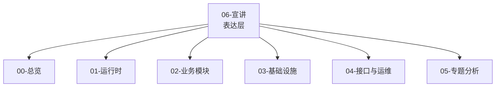

# 06-宣讲 阅读地图

**本文回答**：`06-宣讲/` 这一组文档应该如何使用；如何把 qs-server 讲给面试官、技术同事、业务方或朋友听；如何把项目从“问卷&量表系统”准确升级为“多解释模型测评平台”来表达；哪些文档用于项目开场，哪些文档用于技术深讲，哪些文档用于面试追问；宣讲层和 `00-05` 真值层之间是什么关系。

---

## 30 秒结论

`06-宣讲/` 是 qs-server 的 **对外表达层**。

它不重新定义事实，也不替代源码、接口契约和架构文档。它的职责是把 `00-05` 已经沉淀的事实，组织成能对外讲清楚、讲准确、讲出亮点、讲得住追问的表达材料。

当前宣讲主线必须从旧的：

```text
问卷 + 量表 + 异步评估 + 报告
```

升级为：

```text
Survey 作答事实
  -> Interpretation Model 接入协议
  -> Scale / MBTI / BigFive 具体解释模型
  -> Evaluation 通用测评执行引擎
  -> Event / Redis / ReadModel / Security / Observability 治理闭环
```

一句话概括：

> **00-05 是事实层，06 是表达层；事实层保证“讲得对”，宣讲层保证“讲得清楚”。**

---

## 1. 宣讲层的新定位

qs-server 不应该再被讲成“一个问卷&量表系统”。

更准确的定位是：

> **qs-server 是一个面向心理、医学和人格测评场景的 Go 后端系统。它把作答事实、解释模型规则、测评执行生命周期、报告事实、统计投影和基础设施治理拆开，形成一个可扩展的多解释模型测评平台。**

这个定位里有四个关键词：

| 关键词 | 含义 |
| ------ | ---- |
| 作答事实 | Survey 管 Questionnaire / AnswerSheet |
| 解释模型 | Scale、MBTI、BigFive 等具体模型 |
| 执行引擎 | Evaluation 管 Assessment / Run / Result / Report |
| 治理闭环 | Event / Redis / ReadModel / Security / Observability |

---

## 2. 06-宣讲 是什么

`06-宣讲/` 是：

- 项目介绍材料。
- 技术分享脚本。
- 面试表达素材。
- 架构图素材库。
- 追问答辩索引。
- 简历项目讲述底稿。
- 对外沟通时的统一口径。

它的目标不是“写更多文档”，而是把复杂系统组织成不同场景下可复用的表达：

```text
10 秒能说清项目是什么；
30 秒能说清核心价值；
3 分钟能说清业务、架构和难点；
30 分钟能讲成一次完整技术分享；
面试追问时能回链到代码和文档证据。
```

---

## 3. 06-宣讲 不是什么

`06-宣讲/` 不是：

- 源码真值。
- API 契约真值。
- 运维手册真值。
- 新功能设计稿。
- 规划能力的证明。
- 可以脱离源码独立维护的第二份事实文档。

宣讲层只能重组事实，不能制造事实。

如果宣讲中出现新的架构判断，必须能回链到：

- 源码。
- `00-总览/`。
- `01-运行时/`。
- `02-业务模块/`。
- `03-基础设施/`。
- `04-接口与运维/`。
- `05-专题分析/`。
- 测试、脚本、配置或接口契约。

---

## 4. 新版目录

```text
06-宣讲/
├── README.md
├── 00-项目一句话定位.md
├── 01-业务背景与问题.md
├── 02-三进程架构讲法.md
├── 03-DDD与限界上下文讲法.md
├── 04-异步测评执行链路讲法.md
├── 05-事件与Outbox讲法.md
├── 06-高并发治理讲法.md
├── 07-IAM与安全讲法.md
├── 08-工程质量与测试讲法.md
├── 09-30分钟技术分享脚本.md
├── 10-架构图素材索引.md
└── 11-面试追问证据索引.md
```

> 如果仓库中仍存在 `04-异步评估链路讲法.md`，建议重命名为 `04-异步测评执行链路讲法.md`，避免继续使用旧的 Scale 中心表达。

---

## 5. 文档地图

| 顺序 | 文档 | 负责 |
| ---- | ---- | ---- |
| 1 | [00-项目一句话定位.md](./00-项目一句话定位.md) | 用一句话、10 秒、30 秒、1 分钟、3 分钟讲清项目是什么 |
| 2 | [01-业务背景与问题.md](./01-业务背景与问题.md) | 说明为什么这是心理/医学/人格测评后端，不是普通问卷 CRUD |
| 3 | [02-三进程架构讲法.md](./02-三进程架构讲法.md) | 讲清 collection-server、qs-apiserver、qs-worker 的职责和边界 |
| 4 | [03-DDD与限界上下文讲法.md](./03-DDD与限界上下文讲法.md) | 讲清 Survey、Interpretation Model、Scale、Evaluation、Actor、Plan、Statistics 的边界 |
| 5 | [04-异步评估链路讲法.md](./04-异步评估链路讲法.md) | 串起答卷提交、事件、worker、Internal gRPC、Evaluation Engine、Provider、Report |
| 6 | [05-事件与Outbox讲法.md](./05-事件与Outbox讲法.md) | 讲清 EventCatalog、Outbox、NSQ、Worker Ack/Nack 和事件可靠性 |
| 7 | [06-高并发治理讲法.md](./06-高并发治理讲法.md) | 讲清 RateLimit、SubmitQueue、SubmitGuard、Backpressure、LockLease、worker concurrency |
| 8 | [07-IAM与安全讲法.md](./07-IAM与安全讲法.md) | 讲清 Principal、OrgScope、AuthzSnapshot、CapabilityDecision、ServiceAuth |
| 9 | [08-工程质量与测试讲法.md](./08-工程质量与测试讲法.md) | 讲清测试、契约校验、文档卫生和架构证据链 |
| 10 | [09-30分钟技术分享脚本.md](./09-30分钟技术分享脚本.md) | 一份可以直接照着讲的 30 分钟完整分享稿 |
| 11 | [10-架构图素材索引.md](./10-架构图素材索引.md) | 统一管理宣讲可用的架构图、时序图、证据图和讲图脚本 |
| 12 | [11-面试追问证据索引.md](./11-面试追问证据索引.md) | 高频面试追问的标准回答、证据入口、可讲/不可讲边界 |

---

## 6. 项目介绍模板

### 6.1 10 秒版本

> **qs-server 是一个面向心理、医学和人格测评场景的多解释模型测评后端。**

---

### 6.2 30 秒版本

> **qs-server 是一个面向心理、医学和人格测评场景的 Go 后端系统。它把测评分成四层：Survey 负责问卷和答卷事实；Interpretation Model 定义解释模型接入协议；Scale、MBTI、BigFive 等具体模型负责规则表达；Evaluation 作为通用测评执行引擎，按 ModelRef 加载 Provider 执行模型，并产出 EvaluationResult 和 InterpretReport。系统通过 Outbox、Worker、Redis、ReadModel、安全控制面和 Governance endpoint，保证答卷提交、异步执行、报告生成、统计查询和排障观测的可靠性。**

---

### 6.3 1 分钟版本

> **这个项目不是普通问卷 CRUD，也不只是医学量表系统。它的业务核心是“用户提交答卷后，系统基于不同解释模型生成结构化结果和报告”。所以我把它拆成四层：Survey 管作答事实，Interpretation Model 管统一接入协议，Scale / MBTI / BigFive 管具体规则，Evaluation 管一次测评执行生命周期。运行时上，collection-server 保护前台入口，qs-apiserver 保存主业务事实并提供内部 gRPC，qs-worker 消费事件推进异步执行。工程上用 Outbox 解决业务事实和事件发布的双写一致性，用 Redis / Resilience 做限流、排队、锁和缓存治理，用 ReadModel 支撑统计查询，用 IAM AuthzSnapshot 做授权边界，用 Metrics 和 Governance endpoint 支撑排障。**

---

### 6.4 3 分钟版本结构

按以下顺序展开：

```text
1. 业务背景：测评不是简单问卷，而是“作答 + 模型解释 + 报告”
2. 领域拆分：Survey / Interpretation Model / Concrete Models / Evaluation
3. 主链路：AnswerSheet -> Assessment -> Provider -> Result -> Report
4. 可靠性：Outbox / Worker / Retry / Idempotency
5. 高并发：collection-server / RateLimit / SubmitQueue / SubmitGuard
6. 数据层：Mongo / MySQL / ReadModel / Redis
7. 安全与观测：AuthzSnapshot / Capability / Metrics / Governance
8. 扩展性：MBTI 与 Scale 同级接入
```

---

## 7. 推荐阅读路径

### 7.1 第一次准备项目介绍

按这个顺序读：

```text
00-项目一句话定位
  -> 01-业务背景与问题
  -> 02-三进程架构讲法
  -> 03-DDD与限界上下文讲法
  -> 04-异步测评执行链路讲法
```

读完后应该能回答：

1. 项目一句话是什么？
2. 为什么不是普通问卷系统？
3. 为什么不是单纯医学量表系统？
4. 为什么是三进程架构？
5. 为什么 Survey / Interpretation Model / Scale / Evaluation 要拆开？
6. 从答卷提交到报告生成怎么跑？

---

### 7.2 准备技术分享

按这个顺序读：

```text
09-30分钟技术分享脚本
  -> 10-架构图素材索引
  -> 00-项目一句话定位
  -> 04-异步测评执行链路讲法
  -> 05-事件与Outbox讲法
  -> 06-高并发治理讲法
  -> 07-IAM与安全讲法
  -> 08-工程质量与测试讲法
```

准备顺序：

1. 先确定 30 分钟脚本。
2. 再选架构图。
3. 再背 30 秒、1 分钟、3 分钟版本。
4. 最后准备 Q&A 证据索引。

---

### 7.3 准备面试项目讲述

按这个顺序读：

```text
00-项目一句话定位
  -> 11-面试追问证据索引
  -> 03-DDD与限界上下文讲法
  -> 04-异步测评执行链路讲法
  -> 05-事件与Outbox讲法
  -> 06-高并发治理讲法
  -> 07-IAM与安全讲法
  -> 08-工程质量与测试讲法
```

面试时最常被追问：

| 追问 | 优先文档 |
| ---- | -------- |
| 这个项目是做什么的？ | 00 |
| 难点是什么？ | 01 / 11 |
| 怎么体现 DDD？ | 03 |
| 为什么 MBTI 不放进 Scale？ | 03 / 11 / `05-专题分析/08-*` |
| Evaluation 为什么是通用执行引擎？ | 04 / 11 / `05-专题分析/09-*` |
| 异步测评执行怎么做？ | 04 |
| MQ 怎么保证可靠？ | 05 |
| 高并发怎么治理？ | 06 |
| 认证授权怎么做？ | 07 |
| 怎么证明不是纸面设计？ | 08 |
| 下一步怎么演进？ | 11 + `05-专题分析/07-系统演进路线.md` |

---

### 7.4 准备简历项目描述

重点读：

```text
00-项目一句话定位
  -> 01-业务背景与问题
  -> 11-面试追问证据索引
```

推荐简历版项目定位：

> **基于 Go 构建的多解释模型测评后端系统，面向心理、医学和人格测评场景，采用 Survey / Interpretation Model / Scale / Evaluation 领域拆分与 collection-server / apiserver / worker 三进程架构，通过 Outbox、SubmitQueue、Redis 锁、Backpressure、读侧统计聚合和 IAM 授权快照支撑答卷提交、异步测评执行、报告生成、模型扩展与运营统计。**

---

## 8. 对不同听众怎么讲

### 8.1 面试官

面试官关心：

- 你做了什么？
- 为什么这样设计？
- 有没有复杂度？
- 有没有证据？
- 有没有边界意识？
- 能不能应对追问？

推荐讲法：

```text
项目定位
  -> 业务问题
  -> DDD 拆分
  -> 三进程架构
  -> 异步测评执行 + Outbox
  -> 多解释模型扩展
  -> 高并发治理
  -> IAM 安全
  -> 工程质量证据
```

不要一开始堆技术名词。

---

### 8.2 技术同事 / 架构评审

技术同事关心：

- 运行时链路。
- 数据一致性。
- 事件可靠性。
- 幂等。
- 可观测。
- 运维成本。
- 后续演进。

推荐讲法：

```text
先画三进程图
再画 Survey / Interpretation Model / Concrete Models / Evaluation 边界图
再画异步测评执行链路
再展开 Outbox
再展开 Resilience
再讲 Security / Statistics / Observability
最后讲 Verify 和风险边界
```

---

### 8.3 业务方 / 产品

业务方关心：

- 这个系统解决什么业务问题？
- 用户怎么提交？
- 报告怎么出来？
- 后台能看什么？
- 系统是否稳定？
- 以后能不能接新模型？

推荐讲法：

```text
用户填写问卷
系统根据不同测评模型生成结果
医学量表、MBTI、人格模型都可以作为模型接入
报告异步生成，前台可以等待或查询状态
后台可以看测评进展、报告和统计
```

不要一上来讲：

- DDD。
- Outbox。
- NSQ。
- Backpressure。
- AuthzSnapshot。

---

### 8.4 朋友 / 非技术听众

推荐讲法：

> **这是一个心理测评系统的后端。用户填写问卷后，系统会根据不同测评模型自动计算结果、生成解读报告。比如医学量表是一种模型，未来 MBTI、人格测评也可以作为另一种模型接入。后台还能查看统计和测评进展。**

---

## 9. 统一讲述主线

所有宣讲最终都应该回到这一条主线：

```text
心理/医学/人格测评不是普通问卷
  -> 所以要拆 Survey / Interpretation Model / Concrete Models / Evaluation
  -> 前台提交要快，所以用 collection 保护入口
  -> 报告生成慢，所以异步测评执行
  -> 异步事件不能丢，所以用 Outbox + NSQ
  -> 高峰不能打穿，所以分层治理
  -> 数据敏感，所以接入 IAM 做认证授权
  -> 后台要统计，所以做读侧聚合
  -> 模型会扩展，所以 Scale、MBTI、BigFive 都通过 Provider 接入
  -> 架构要可信，所以有测试、契约和文档校验
```

这个顺序非常适合技术分享和面试。

---

## 10. 关键句速查

### 10.1 项目定位

> **qs-server 不是普通问卷 CRUD，而是一个面向心理、医学和人格测评场景的多解释模型测评后端系统。**

### 10.2 业务边界

> **Survey 管作答事实，Interpretation Model 管接入协议，Scale / MBTI / BigFive 管具体规则，Evaluation 管一次测评执行生命周期。**

### 10.3 三进程

> **collection 保护入口，apiserver 保存事实和编排业务能力，worker 消费事件推进异步。**

### 10.4 异步测评执行

> **同步保存答卷事实，异步推进 Assessment、Interpretation 和 Report。**

### 10.5 Outbox

> **MQ 解决消息传输，Outbox 解决业务数据库和消息发布的双写一致性。**

### 10.6 多解释模型

> **Scale 是医学量表模型，MBTI 是另一个解释模型，二者应通过统一 Provider 协议同级接入 Evaluation。**

### 10.7 Evaluation

> **Evaluation 不是 Scale 专用流水线，而是通用测评执行引擎。**

### 10.8 高并发

> **高并发治理不是一个限流开关，而是一条从入口到下游的分层保护链。**

### 10.9 IAM

> **JWT 证明“你是谁”，OrgScope 证明“在哪个授权域和组织范围”，AuthzSnapshot 判断“你能做什么”。**

### 10.10 工程质量

> **工程质量不是只有测试，而是代码、契约、文档和架构证据四层都能被验证。**

---

## 11. 可讲 / 不可讲边界

### 11.1 可以讲成已实现

| 能力 | 表达 |
| ---- | ---- |
| Survey / Scale / Evaluation 拆分 | 已有业务模块和专题分析支撑 |
| Interpretation Model 文档设计 | 已有文档体系支撑，代码需按事实谨慎表达 |
| collection / apiserver / worker 三进程 | 已有运行时和接口文档支撑 |
| SubmitQueue | 已有 collection submit queue |
| SubmitGuard | 已有 Redis done marker + in-flight lock |
| AnswerSheet / Assessment / Report 主链路 Outbox | 已有 Mongo/MySQL outbox 基座 |
| Statistics ReadService / SyncService / BehaviorProjector | 已有读侧统计模块 |
| IAMModule / AuthzSnapshot | 已有安全控制面 |
| docs-hygiene / docs-verify | 已有脚本和 Makefile 入口 |

### 11.2 必须谨慎讲

| 能力 | 推荐表述 |
| ---- | -------- |
| MBTIProvider | 下一阶段计划接入，用于验证多解释模型平台化 |
| Interpretation Model 代码实现 | 以当前源码事实为准，不把文档规划讲成已落地 |
| exactly-once | 不承诺；讲至少一次投递 + 业务幂等 |
| 完整压测 QPS | 没有压测报告不承诺 |
| 完整 ACL 平台 | 当前有 seam，完整策略仍需完善 |
| 所有事件 outbox 化 | 主链路关键事件 outbox 化，best_effort 事件仍存在 |
| 完整 operating 平台 | 下一阶段演进方向 |
| AI 解读 | 未来增强层，不是当前基础报告主链路 |

### 11.3 不要这样讲

| 错误讲法 | 正确讲法 |
| -------- | -------- |
| 这是微服务系统 | 这是以 apiserver 为主业务中心的三进程协作架构 |
| MQ 保证可靠 | Outbox 保证可靠出站，MQ 负责传输 |
| SubmitQueue 保证提交不丢 | SubmitQueue 是内存削峰，事实可靠性来自 apiserver durable submit |
| JWT roles 做权限 | AuthzSnapshot 做业务授权 |
| Worker 负责评估业务 | Worker 负责驱动，Evaluation 业务在 apiserver |
| Scale 管所有解释 | Scale 是医学量表解释模型，不是解释模型抽象层 |
| MBTI 是 Scale 的一种 | MBTI 与 Scale 同级，都是具体解释模型 |
| Evaluation 负责算量表分数 | Evaluation 负责通用测评执行生命周期 |
| 文档就是事实来源 | 宣讲层只重组事实，事实回链 truth layer |

---

## 12. 与 truth layer 的关系



| 宣讲结论 | Truth layer |
| -------- | ----------- |
| 项目不是普通问卷 CRUD | `05-专题分析/01-*`、`06/01-*` |
| 三进程协作 | `01-运行时/`、`04-接口与运维/` |
| DDD 边界 | `02-业务模块/`、`05-专题分析/01-*` |
| 异步测评执行 | `02-业务模块/30-evaluation/`、`05-专题分析/02-*` |
| 多解释模型扩展 | `02-业务模块/40-interpretation/`、`05-专题分析/08-*` |
| Evaluation 通用执行引擎 | `02-业务模块/30-evaluation/`、`05-专题分析/09-*` |
| 解释模型事件与缓存治理 | `03-基础设施/`、`05-专题分析/10-*` |
| Outbox | `03-基础设施/event/`、`05-专题分析/04-*` |
| 高并发 | `03-基础设施/concurrency/` |
| IAM 安全 | `03-基础设施/security/`、`05-专题分析/06-*` |
| 工程质量 | `Makefile`、`scripts/`、`08-工程质量与测试讲法.md` |

---

## 13. 30 分钟分享路线

如果只看一条完整路线，按这个讲：

```text
1. 项目定位：多解释模型测评平台，不是问卷 CRUD
2. 业务背景：作答、解释模型、评估报告、统计运营、权限隐私
3. 三进程：collection / apiserver / worker
4. DDD：Survey / Interpretation Model / Concrete Models / Evaluation
5. 异步测评执行：AnswerSheet -> Assessment -> Provider -> Result -> Report
6. 事件与 Outbox：EventCatalog / Outbox / NSQ / Worker
7. 多解释模型扩展：Scale -> MBTI -> BigFive
8. 高并发：RateLimit / SubmitQueue / Backpressure / LockLease
9. IAM 安全：Principal / OrgScope / AuthzSnapshot / Capability
10. 工程质量：测试 / 契约 / 文档 / 证据
11. 总结：现状、边界、演进路线
```

详细脚本见：

- [09-30分钟技术分享脚本.md](./09-30分钟技术分享脚本.md)

---

## 14. 面试准备路线

### 14.1 2 分钟项目介绍

背：

- `00-项目一句话定位.md` 的最终背诵版。
- `09-30分钟技术分享脚本.md` 的 2 分钟压缩脚本。

### 14.2 5 分钟项目介绍

背：

- `09-30分钟技术分享脚本.md` 的 5 分钟压缩脚本。

### 14.3 追问答辩

看：

- `11-面试追问证据索引.md`。

### 14.4 画图答辩

看：

- `10-架构图素材索引.md`。

---

## 15. 最小背诵包

如果时间很短，至少背这 6 段：

1. 项目一句话定位。
2. 三进程架构讲法。
3. DDD 与限界上下文讲法。
4. 异步测评执行 + Outbox 讲法。
5. 多解释模型扩展讲法。
6. 高并发 + IAM + 工程质量收束。

推荐最小背诵段：

> **qs-server 是一个面向心理、医学和人格测评场景的 Go 后端系统。它不是普通问卷 CRUD，而是把作答事实、解释模型规则、测评执行生命周期和报告事实拆开：Survey 负责问卷和答卷，Interpretation Model 负责统一接入协议，Scale、MBTI 等模型负责具体规则，Evaluation 负责 Assessment、EvaluationRun、EvaluationResult 和 InterpretReport。运行时上用 collection-server 保护前台入口，apiserver 处理主业务事实，worker 消费事件异步推进执行；工程上用 SubmitQueue、SubmitGuard、Outbox、Redis Lock、Backpressure、读侧统计聚合和 IAM AuthzSnapshot 解决提交高峰、重复提交、事件可靠出站、报告异步生成、统计查询和权限边界问题。**

---

## 16. 维护原则

### 16.1 宣讲文档更新时

每次更新宣讲文档，应检查：

- 是否新增了没有 truth layer 支撑的结论？
- 是否把规划讲成现状？
- 是否误把 best_effort 讲成 durable？
- 是否误把 JWT roles 讲成权限真值？
- 是否误把三进程讲成微服务？
- 是否误把 SubmitQueue 讲成 MQ？
- 是否误把 Outbox 讲成 exactly-once？
- 是否把 Scale 讲成所有解释模型的中心？
- 是否把 MBTI 讲成 Scale 的一种？
- 是否把 Evaluation 讲成 Scale 专用流水线？
- 是否有证据回链？

### 16.2 真值层变更时

如果 `00-05` truth layer 或源码发生重要变化，应同步检查：

- `00-项目一句话定位.md`
- `03-DDD与限界上下文讲法.md`
- `04-异步测评执行链路讲法.md`
- `05-事件与Outbox讲法.md`
- `06-高并发治理讲法.md`
- `07-IAM与安全讲法.md`
- `09-30分钟技术分享脚本.md`
- `10-架构图素材索引.md`
- `11-面试追问证据索引.md`

这些文档最容易受架构变化影响。

---

## 17. Verify

宣讲层文档不直接证明代码正确，但必须保证链接、锚点和结构不坏。

```bash
make docs-hygiene
git diff --check
```

如果修改了 REST 契约相关表达，同时跑：

```bash
make docs-verify
```

如果修改了代码锚点，应跑对应模块测试。

---

## 18. 后续可扩展文档

当前目录已经足够覆盖对外讲解和面试准备。

后续如需扩展，建议只补以下几类：

| 可选文档 | 价值 |
| -------- | ---- |
| `12-5分钟面试快讲.md` | 专门背诵版 |
| `13-常见面试题卡片.md` | 题卡化复习 |
| `14-项目复盘与不足.md` | 主动讲短板和改进 |
| `15-PPT页结构.md` | 技术分享 slide 版大纲 |

不建议无节制新增宣讲文档，否则会和 `00-11` 重复。
