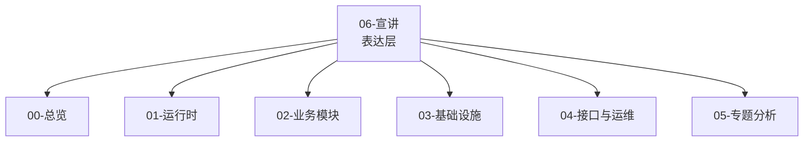

# 06-宣讲 阅读地图

**本文回答**：`06-宣讲/` 这一组文档应该如何使用；如何把 qs-server 讲给面试官、技术同事、业务方或朋友听；哪些文档用于项目开场，哪些文档用于技术深讲，哪些文档用于面试追问；宣讲层和前面 `00-05` 真值层之间是什么关系。

---

## 1. 先给结论

`06-宣讲/` 是 qs-server 的**对外表达层**。

它不负责重新定义事实，也不替代源码、接口契约和架构文档。它负责把前面已经整理好的业务模型、运行时、基础设施、接口运维和专题分析，重组为：

```text
能讲清楚
能讲准确
能讲出亮点
能回答追问
能回链证据
```

一句话概括：

> **00-05 是事实层，06 是表达层；事实层保证“讲得对”，宣讲层保证“讲得清楚”。**

---

## 2. 宣讲层的定位

### 2.1 它是什么

`06-宣讲/` 是：

- 项目介绍材料。
- 技术分享脚本。
- 面试表达素材。
- 架构图素材库。
- 追问答辩索引。
- 简历项目讲述底稿。

### 2.2 它不是什么

`06-宣讲/` 不是：

- 源码真值。
- API 契约真值。
- 运维手册真值。
- 新功能设计稿。
- 规划能力的证明。
- 可以脱离源码独立维护的第二份事实文档。

### 2.3 核心原则

> **宣讲层只能重组事实，不能制造事实。**

如果宣讲中出现新的架构判断，必须能回链到：

- 源码。
- `00-总览/`。
- `01-运行时/`。
- `02-业务模块/`。
- `03-基础设施/`。
- `04-接口与运维/`。
- `05-专题分析/`。
- 测试、脚本、配置或接口契约。

---

## 3. 新版目录

```text
06-宣讲/
├── README.md
├── 00-项目一句话定位.md
├── 01-业务背景与问题.md
├── 02-三进程架构讲法.md
├── 03-DDD与限界上下文讲法.md
├── 04-异步评估链路讲法.md
├── 05-事件与Outbox讲法.md
├── 06-高并发治理讲法.md
├── 07-IAM与安全讲法.md
├── 08-工程质量与测试讲法.md
├── 09-30分钟技术分享脚本.md
├── 10-架构图素材索引.md
└── 11-面试追问证据索引.md
```

---

## 4. 文档地图

| 顺序 | 文档 | 负责 |
| ---- | ---- | ---- |
| 1 | [00-项目一句话定位.md](./00-项目一句话定位.md) | 用一句话、10 秒、30 秒、1 分钟、3 分钟讲清项目是什么 |
| 2 | [01-业务背景与问题.md](./01-业务背景与问题.md) | 说明为什么这是心理/医学测评后端，不是普通问卷 CRUD |
| 3 | [02-三进程架构讲法.md](./02-三进程架构讲法.md) | 讲清 collection-server、qs-apiserver、qs-worker 的职责和边界 |
| 4 | [03-DDD与限界上下文讲法.md](./03-DDD与限界上下文讲法.md) | 讲清 Survey、Scale、Evaluation、Actor、Plan、Statistics 的边界 |
| 5 | [04-异步评估链路讲法.md](./04-异步评估链路讲法.md) | 串起答卷提交、事件、worker、Internal gRPC、Evaluation Pipeline、Report |
| 6 | [05-事件与Outbox讲法.md](./05-事件与Outbox讲法.md) | 讲清 EventCatalog、Outbox、NSQ、Worker Ack/Nack 和事件可靠性 |
| 7 | [06-高并发治理讲法.md](./06-高并发治理讲法.md) | 讲清 RateLimit、SubmitQueue、SubmitGuard、Backpressure、LockLease、worker concurrency |
| 8 | [07-IAM与安全讲法.md](./07-IAM与安全讲法.md) | 讲清 qs-server 与 IAM 的连接：Principal、TenantScope、AuthzSnapshot、CapabilityDecision |
| 9 | [08-工程质量与测试讲法.md](./08-工程质量与测试讲法.md) | 讲清测试、契约校验、文档卫生和架构证据链 |
| 10 | [09-30分钟技术分享脚本.md](./09-30分钟技术分享脚本.md) | 一份可以直接照着讲的 30 分钟完整分享稿 |
| 11 | [10-架构图素材索引.md](./10-架构图素材索引.md) | 统一管理宣讲可用的架构图、时序图、证据图和讲图脚本 |
| 12 | [11-面试追问证据索引.md](./11-面试追问证据索引.md) | 高频面试追问的标准回答、证据入口、可讲/不可讲边界 |

---

## 5. 推荐阅读路径

### 5.1 第一次准备项目介绍

按这个顺序读：

```text
00-项目一句话定位
  -> 01-业务背景与问题
  -> 02-三进程架构讲法
  -> 03-DDD与限界上下文讲法
  -> 04-异步评估链路讲法
```

读完后应该能回答：

1. 项目一句话是什么？
2. 为什么不是普通问卷系统？
3. 为什么是三进程架构？
4. 为什么 Survey / Scale / Evaluation 要拆开？
5. 从答卷提交到报告生成怎么跑？

---

### 5.2 准备技术分享

按这个顺序读：

```text
09-30分钟技术分享脚本
  -> 10-架构图素材索引
  -> 00-项目一句话定位
  -> 04-异步评估链路讲法
  -> 05-事件与Outbox讲法
  -> 06-高并发治理讲法
  -> 07-IAM与安全讲法
  -> 08-工程质量与测试讲法
```

准备顺序：

1. 先确定 30 分钟脚本。
2. 再选架构图。
3. 再背 30 秒、1 分钟、3 分钟版本。
4. 最后准备 Q&A 证据索引。

---

### 5.3 准备面试项目讲述

按这个顺序读：

```text
00-项目一句话定位
  -> 11-面试追问证据索引
  -> 03-DDD与限界上下文讲法
  -> 04-异步评估链路讲法
  -> 05-事件与Outbox讲法
  -> 06-高并发治理讲法
  -> 07-IAM与安全讲法
  -> 08-工程质量与测试讲法
```

面试时最常被追问：

| 追问 | 优先文档 |
| ---- | -------- |
| 这个项目是做什么的？ | 00 |
| 难点是什么？ | 01 / 11 |
| 怎么体现 DDD？ | 03 |
| 异步评估怎么做？ | 04 |
| MQ 怎么保证可靠？ | 05 |
| 高并发怎么治理？ | 06 |
| 认证授权怎么做？ | 07 |
| 怎么证明不是纸面设计？ | 08 |
| 下一步怎么演进？ | 11 + `05-专题分析/07-系统演进路线.md` |

---

### 5.4 准备简历项目描述

重点读：

```text
00-项目一句话定位
  -> 01-业务背景与问题
  -> 11-面试追问证据索引
```

可直接使用的简历版项目定位：

> **基于 Go 构建的问卷&量表测评后端系统，采用 Survey/Scale/Evaluation 领域拆分与 collection-server/apiserver/worker 三进程架构，通过 Outbox、SubmitQueue、Redis 锁、Backpressure、读侧统计聚合和 IAM 授权快照支撑答卷提交、异步评估、报告生成与运营统计。**

---

## 6. 对不同听众怎么讲

### 6.1 面试官

面试官关心：

- 你做了什么？
- 为什么这样设计？
- 有没有复杂度？
- 有没有证据？
- 有没有边界意识？
- 能不能应对追问？

推荐讲法：

```text
项目定位
  -> 业务问题
  -> DDD 拆分
  -> 三进程架构
  -> 异步评估 + Outbox
  -> 高并发治理
  -> IAM 安全
  -> 工程质量证据
```

不要一开始堆技术名词。

---

### 6.2 技术同事 / 架构评审

技术同事关心：

- 运行时链路。
- 数据一致性。
- 事件可靠性。
- 幂等。
- 可观测。
- 运维成本。
- 后续演进。

推荐讲法：

```text
先画三进程图
再画异步评估链路
再展开 Outbox
再展开 Resilience
再讲 Security 和 Statistics
最后讲 Verify 和风险边界
```

---

### 6.3 业务方 / 产品

业务方关心：

- 这个系统解决什么业务问题？
- 用户怎么提交？
- 报告怎么出来？
- 后台能看什么？
- 系统是否稳定？

推荐讲法：

```text
用户填问卷
系统按量表规则评估
生成风险解读报告
医生/机构查看统计
系统后台异步处理复杂计算
```

不要一上来讲：

- DDD。
- Outbox。
- NSQ。
- Backpressure。
- AuthzSnapshot。

---

### 6.4 朋友 / 非技术听众

推荐讲法：

> **这是一个心理测评系统的后端。用户填写问卷后，系统会根据不同量表规则自动计算结果、判断风险、生成解读报告，后台还能查看统计和测评进展。**

---

## 7. 统一讲述主线

所有宣讲最终都应该回到这一条主线：

```text
心理/医学测评不是普通问卷
  -> 所以要拆 Survey / Scale / Evaluation
  -> 前台提交要快，所以用 collection 保护入口
  -> 报告生成慢，所以异步评估
  -> 异步事件不能丢，所以用 Outbox + NSQ
  -> 高峰不能打穿，所以分层治理
  -> 数据敏感，所以接入 IAM 做认证授权
  -> 后台要统计，所以做读侧聚合
  -> 架构要可信，所以有测试、契约和文档校验
```

这个顺序非常适合技术分享和面试。

---

## 8. 关键句速查

### 8.1 项目定位

> **qs-server 不是普通问卷 CRUD，而是一个问卷&量表测评后端系统。**

### 8.2 业务边界

> **Survey 管“填什么”，Scale 管“怎么算和怎么解释”，Evaluation 管“这一次测评执行后的结果”。**

### 8.3 三进程

> **collection 保护入口，apiserver 保存事实，worker 推进异步。**

### 8.4 异步评估

> **同步保存答卷事实，异步推进测评结果。**

### 8.5 Outbox

> **MQ 解决消息传输，Outbox 解决业务数据库和消息发布的双写一致性。**

### 8.6 高并发

> **高并发治理不是一个限流开关，而是一条从入口到下游的分层保护链。**

### 8.7 IAM

> **JWT 证明“你是谁”，TenantScope 证明“你在哪个组织”，AuthzSnapshot 判断“你能做什么”。**

### 8.8 工程质量

> **工程质量不是只有测试，而是代码、契约、文档和架构证据四层都能被验证。**

---

## 9. 可讲 / 不可讲边界

### 9.1 可以讲成已实现

| 能力 | 表达 |
| ---- | ---- |
| Survey / Scale / Evaluation 拆分 | 已有业务模块和专题分析支撑 |
| collection / apiserver / worker 三进程 | 已有运行时和接口文档支撑 |
| SubmitQueue | 已有 collection submit queue |
| SubmitGuard | 已有 Redis done marker + in-flight lock |
| AnswerSheet / Assessment / Report 主链路事件 Outbox | 已有 Mongo/MySQL outbox 基座 |
| Evaluation Pipeline | 已有 engine pipeline |
| Statistics ReadService / SyncService / BehaviorProjector | 已有读侧统计模块 |
| IAMModule / AuthzSnapshot | 已有安全控制面 |
| docs-hygiene / docs-verify | 已有脚本和 Makefile 入口 |

### 9.2 必须谨慎讲

| 能力 | 推荐表述 |
| ---- | -------- |
| exactly-once | 不承诺；讲至少一次投递 + 业务幂等 |
| 完整压测 QPS | 没有压测报告不承诺 |
| 完整 ACL 平台 | 当前有 seam，完整策略仍需完善 |
| 所有事件 outbox 化 | 主链路关键事件 outbox 化，best_effort 事件仍存在 |
| 完整 operating 平台 | 下一阶段演进方向 |
| AI 解读 | 未来增强层，不是当前基础报告主链路 |

### 9.3 不要这样讲

| 错误讲法 | 正确讲法 |
| -------- | -------- |
| 这是微服务系统 | 这是以 apiserver 为主业务中心的三进程协作架构 |
| MQ 保证可靠 | Outbox 保证可靠出站，MQ 负责传输 |
| SubmitQueue 保证提交不丢 | SubmitQueue 是内存削峰，事实可靠性来自 apiserver durable submit |
| JWT roles 做权限 | AuthzSnapshot 做业务授权 |
| Worker 负责评估业务 | Worker 负责驱动，Evaluation 业务在 apiserver |
| 文档就是事实来源 | 宣讲层只重组事实，事实回链 truth layer |

---

## 10. 与 truth layer 的关系



| 宣讲结论 | Truth layer |
| -------- | ----------- |
| 项目不是普通问卷 CRUD | `05-专题分析/01-*`、`06/01-*` |
| 三进程协作 | `01-运行时/`、`04-接口与运维/` |
| DDD 边界 | `02-业务模块/`、`05-专题分析/01-*` |
| 异步评估 | `02-业务模块/evaluation/`、`05-专题分析/02-*` |
| Outbox | `03-基础设施/event/`、`05-专题分析/04-*` |
| 高并发 | `03-基础设施/resilience/` |
| IAM 安全 | `03-基础设施/security/`、`05-专题分析/06-*` |
| 工程质量 | `Makefile`、`scripts/`、`08-工程质量与测试讲法.md` |

---

## 11. 30 分钟分享路线

如果只看一条完整路线，按这个讲：

```text
1. 项目定位：测评系统，不是问卷 CRUD
2. 业务背景：量表规则、评估报告、统计运营、权限隐私
3. 三进程：collection / apiserver / worker
4. DDD：Survey / Scale / Evaluation
5. 异步评估：AnswerSheet -> Assessment -> Report
6. 事件与 Outbox：EventCatalog / Outbox / NSQ / Worker
7. 高并发：RateLimit / SubmitQueue / Backpressure / LockLease
8. IAM 安全：Principal / TenantScope / AuthzSnapshot / Capability
9. 工程质量：测试 / 契约 / 文档 / 证据
10. 总结：现状、边界、演进路线
```

详细脚本见：

- [09-30分钟技术分享脚本.md](./09-30分钟技术分享脚本.md)

---

## 12. 面试准备路线

### 12.1 2 分钟项目介绍

背：

- `00-项目一句话定位.md` 的最终背诵版。
- `09-30分钟技术分享脚本.md` 的 2 分钟压缩脚本。

### 12.2 5 分钟项目介绍

背：

- `09-30分钟技术分享脚本.md` 的 5 分钟压缩脚本。

### 12.3 追问答辩

看：

- `11-面试追问证据索引.md`。

### 12.4 画图答辩

看：

- `10-架构图素材索引.md`。

---

## 13. 最小背诵包

如果时间很短，至少背这 5 段：

1. 项目一句话定位。
2. 三进程架构讲法。
3. DDD 与限界上下文讲法。
4. 异步评估 + Outbox 讲法。
5. 高并发 + IAM + 工程质量收束。

推荐最小背诵段：

> **qs-server 是一个面向心理/医学测评场景的 Go 后端系统。它不是普通问卷 CRUD，而是把问卷收集、量表规则和评估报告拆成 Survey、Scale、Evaluation 三个边界；运行时上用 collection-server 保护前台入口，apiserver 处理主业务事实，worker 消费事件异步推进评估；工程上用 SubmitQueue、SubmitGuard、Outbox、Redis Lock、Backpressure、读侧统计聚合和 IAM AuthzSnapshot 解决提交高峰、重复提交、事件可靠出站、报告异步生成、统计查询和权限边界问题。**

---

## 14. 维护原则

### 14.1 宣讲文档更新时

每次更新宣讲文档，应检查：

- 是否新增了没有 truth layer 支撑的结论？
- 是否把规划讲成现状？
- 是否误把 best_effort 讲成 durable？
- 是否误把 JWT roles 讲成权限真值？
- 是否误把三进程讲成微服务？
- 是否误把 SubmitQueue 讲成 MQ？
- 是否误把 Outbox 讲成 exactly-once？
- 是否有证据回链？

### 14.2 真值层变更时

如果 `00-05` truth layer 或源码发生重要变化，应同步检查：

- `00-项目一句话定位.md`
- `04-异步评估链路讲法.md`
- `05-事件与Outbox讲法.md`
- `06-高并发治理讲法.md`
- `07-IAM与安全讲法.md`
- `11-面试追问证据索引.md`

这些文档最容易受架构变化影响。

---

## 15. Verify

宣讲层文档不直接证明代码正确，但必须保证链接、锚点和结构不坏。

```bash
make docs-hygiene
git diff --check
```

如果修改了 REST 契约相关表达，同时跑：

```bash
make docs-verify
```

如果修改了代码锚点，应跑对应模块测试。

---

## 16. 后续可扩展文档

当前目录已经足够覆盖对外讲解和面试准备。

后续如需扩展，建议只补以下几类：

| 可选文档 | 价值 |
| -------- | ---- |
| `12-5分钟面试快讲.md` | 专门背诵版 |
| `13-常见面试题卡片.md` | 题卡化复习 |
| `14-项目复盘与不足.md` | 主动讲短板和改进 |
| `15-PPT页结构.md` | 技术分享 slide 版大纲 |

不建议无节制新增宣讲文档，否则会和 `00-11` 重复。
