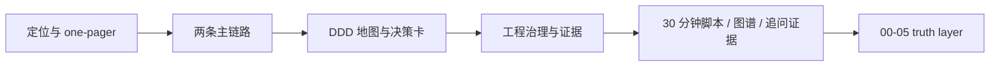

# 宣讲

**本文回答**：本目录负责把 `qs-server` 已有的真实实现重组为适合公开介绍、技术宣讲和项目讲解的材料；本文先给出宣讲层的定位、使用方式和阅读顺序，再列出每篇文档的用途与真值回链。

## 30 秒结论

如果只看一屏，先看下面这张表：

| 维度 | 结论 |
| ---- | ---- |
| 本组作用 | 把分散在代码和真值文档里的事实重组为可口述、可回链的讲解材料 |
| 不做什么 | 不替代 `00-05` 真值层，不单独维护 REST / proto / yaml 契约，也不把规划稿包装成现状 |
| 最重要的规则 | 每个关键结论都要能回链到源码、真值文档或机器契约 |
| 状态标签 | 统一区分 `已实现`、`待补证据`、`规划改造`，避免叙述层失真 |
| 阅读方式 | 先看定位与 one-pager，再看两条主链路、DDD 与决策卡，最后看 30 分钟脚本、图谱素材和追问证据 |
| 使用场景 | 适合公开介绍、技术分享、项目讲解和答疑准备，不适合替代代码级核对 |

## 宣讲层地图

## 重点速查（继续往下读前先记这几条）

1. **先讲骨架，再回链证据**：本目录的职责是把材料组织成可讲的顺序，而不是重新发明一套事实体系。  
2. **状态必须说清**：凡是当前代码没落地、证据不够硬的内容，必须留在 `待补证据` 或 `规划改造`。  
3. **宣讲层不维护契约真值**：REST、proto、events.yaml 这类机器契约只引用，不在这里复制成第二份。  
4. **用法上先入口后细节**：第一次准备讲解，先看阅读顺序；针对某个问题准备细节，再去“文档清单”按主题挑。  

本目录面向**公开介绍、技术宣讲与项目讲解**，不替代 [../README.md](../README.md) 与 `00-05` 真值层。宣讲层只做三件事：

- 把分散在现有文档和代码里的事实重组为可口述、可回链的材料。
- 明确哪些能力是**已实现**，哪些只是**规划改造**，避免把未来稿讲成现状。
- 给出高频问题的标准讲法，并把每个关键结论回链到代码或真值文档。

## 使用规则

- “怎么讲”看本目录，“代码到底是什么”回到 [../00-总览](../00-总览/)、[../02-业务模块](../02-业务模块/)、[../05-专题分析](../05-专题分析/) 和源码。
- 这里不重复维护 REST/proto/yaml 契约细节；契约以 [../../api/rest](../../api/rest)、[../../internal/apiserver/interface/grpc/proto](../../internal/apiserver/interface/grpc/proto)、[../../configs/events.yaml](../../configs/events.yaml) 为准。
- 文中统一使用以下状态标签：

| 标签 | 含义 |
| ---- | ---- |
| `已实现` | 仓库里已有代码与配置证据，可直接讲成“当前能力” |
| `待补证据` | 有方向或局部实现，但仓库里还缺少足够硬的统一证据，不建议说成已标准化能力 |
| `规划改造` | 当前代码未完成，对外说明时只能讲成下一步优化或终局方案 |

## 建议阅读顺序

1. [01-项目定位与受众画像.md](./01-项目定位与受众画像.md)
2. [02-qs-server one-pager.md](./02-qs-server%20one-pager.md)
3. [03-主链路 1：提交答卷.md](./03-主链路%201：提交答卷.md)
4. [04-主链路 2：异步评估流水线.md](./04-主链路%202：异步评估流水线.md)
5. [05-DDD 领域地图与模块协作.md](./05-DDD%20领域地图与模块协作.md)
6. [06-关键决策卡.md](./06-关键决策卡.md)
7. [07-工程治理与证据.md](./07-工程治理与证据.md)
8. [08-高频问答与追问脚本.md](./08-高频问答与追问脚本.md)
9. [09-30分钟技术分享脚本.md](./09-30分钟技术分享脚本.md)
10. [10-架构图素材索引.md](./10-架构图素材索引.md)
11. [11-面试追问证据索引.md](./11-面试追问证据索引.md)

## 文档清单

| 文档 | 用途 | 主要回链 |
| ---- | ---- | -------- |
| [01-项目定位与受众画像.md](./01-项目定位与受众画像.md) | 统一 30 秒 / 2 分钟项目口径 | [../00-总览](../00-总览/)、[../05-专题分析](../05-专题分析/) |
| [02-qs-server one-pager.md](./02-qs-server%20one-pager.md) | 一页结构化概览系统边界、模块、链路、亮点 | [../README.md](../README.md)、[../02-业务模块](../02-业务模块/) |
| [03-主链路 1：提交答卷.md](./03-主链路%201：提交答卷.md) | 讲同步入口、BFF、落库、发事件、幂等边界 | [../00-总览/03-核心业务链路.md](../00-总览/03-核心业务链路.md)、[../05-专题分析/02-异步评估链路：从答卷提交到报告生成.md](../05-专题分析/02-异步评估链路：从答卷提交到报告生成.md) |
| [04-主链路 2：异步评估流水线.md](./04-主链路%202：异步评估流水线.md) | 讲 worker、internal gRPC、pipeline、重试与状态机 | [../05-专题分析/02-异步评估链路：从答卷提交到报告生成.md](../05-专题分析/02-异步评估链路：从答卷提交到报告生成.md)、[../02-业务模块/03-evaluation.md](../02-业务模块/03-evaluation.md) |
| [05-DDD 领域地图与模块协作.md](./05-DDD%20领域地图与模块协作.md) | 讲 survey / scale / evaluation 的边界与协作 | [../05-专题分析/01-测评业务模型：survey、scale、evaluation 为什么分离.md](../05-专题分析/01-测评业务模型：survey、scale、evaluation%20为什么分离.md)、[../02-业务模块](../02-业务模块/) |
| [06-关键决策卡.md](./06-关键决策卡.md) | 统一三张核心架构决策卡 | [../00-总览](../00-总览/)、[../05-专题分析](../05-专题分析/) |
| [07-工程治理与证据.md](./07-工程治理与证据.md) | 讲背压、并发、校验链、现存风险 | [../03-基础设施](../03-基础设施/)、[../../scripts/check_docs_hygiene.py](../../scripts/check_docs_hygiene.py) |
| [08-高频问答与追问脚本.md](./08-高频问答与追问脚本.md) | 宣讲前排练与问答准备 | 本目录全部文档 |
| [09-30分钟技术分享脚本.md](./09-30分钟技术分享脚本.md) | 给出可直接口述的 30 分钟技术分享结构 | [../00-总览](../00-总览/)、[../02-业务模块](../02-业务模块/)、[../03-基础设施](../03-基础设施/) |
| [10-架构图素材索引.md](./10-架构图素材索引.md) | 索引可复用 Mermaid 架构图和主图来源 | `00-05` truth layer |
| [11-面试追问证据索引.md](./11-面试追问证据索引.md) | 把常见追问回链到源码、测试和 truth layer | 源码、配置、现行文档 |

## 真值层入口

- 总览：[../00-总览/README.md](../00-总览/README.md)
- 业务模块：[../02-业务模块/README.md](../02-业务模块/README.md)
- 专题分析：[../05-专题分析/README.md](../05-专题分析/README.md)
- 事件配置：[../../configs/events.yaml](../../configs/events.yaml)
- 内部 gRPC 契约：[../../internal/apiserver/interface/grpc/proto/internalapi/internal.proto](../../internal/apiserver/interface/grpc/proto/internalapi/internal.proto)
