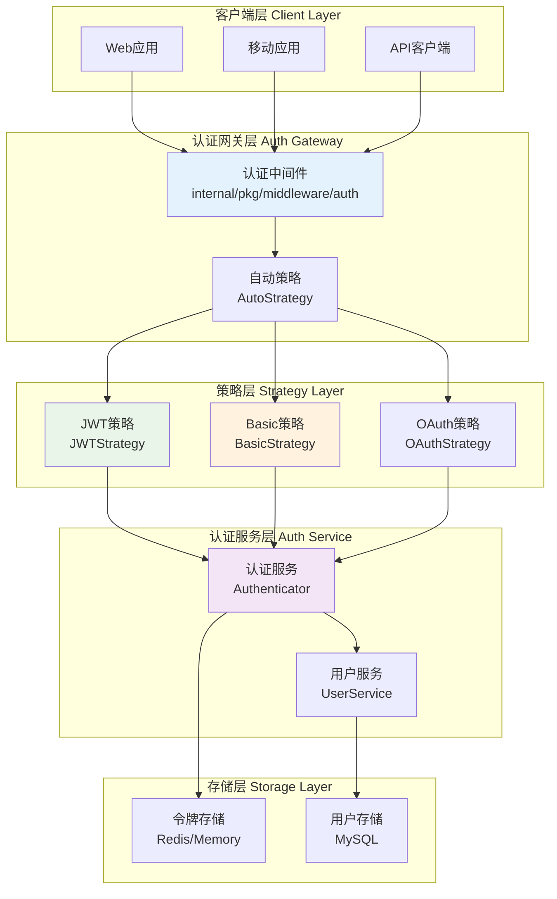

# 🔐 认证模块设计

## 📋 目录

- [设计概述](#design-overview)
- [多策略认证架构](#multi-strategy-auth-architecture)
- [JWT认证机制](#jwt-authentication-mechanism)
- [Basic认证支持](#basic-auth-support)
- [认证中间件系统](#auth-middleware-system)
- [安全策略与实践](#security-strategies-practices)

## 🎯 设计概述 {#design-overview}

本项目的认证模块采用**多策略认证架构**，支持**JWT**、**Basic Auth**和**自动选择**等多种认证方式，通过**策略模式**和**中间件系统**实现了灵活、安全、可扩展的身份认证机制。

### 🏗️ 设计目标

1. **多策略支持**: 支持多种认证方式的无缝切换
2. **安全性**: 企业级的安全认证机制
3. **可扩展性**: 易于添加新的认证策略
4. **性能优化**: 高效的认证处理
5. **用户友好**: 简单易用的API接口
6. **标准兼容**: 遵循OAuth 2.0、JWT等标准

### 🎨 核心设计原则

- **策略模式**: 不同认证方式的统一抽象
- **中间件模式**: 认证逻辑与业务逻辑分离
- **最小权限**: 认证后的最小权限授予
- **令牌管理**: 完整的令牌生命周期管理
- **安全优先**: 安全性是首要考虑因素

## 🏛️ 多策略认证架构 {#multi-strategy-auth-architecture}

### 📦 认证策略接口

```go
// internal/pkg/middleware/auth/strategys/strategy.go

// Strategy 认证策略接口
type Strategy interface {
    // AuthFunc 返回Gin中间件函数
    AuthFunc() gin.HandlerFunc
    
    // Authenticate 执行认证
    Authenticate(c *gin.Context) (bool, error)
    
    // GetUserInfo 获取用户信息
    GetUserInfo(c *gin.Context) (interface{}, error)
    
    // StrategyName 策略名称
    StrategyName() string
}

// BasicStrategy Basic认证策略接口
type BasicStrategy interface {
    Strategy
    ValidateUser(username, password string) bool
}

// JWTStrategy JWT认证策略接口  
type JWTStrategy interface {
    Strategy
    GenerateToken(userInfo interface{}) (string, time.Time, error)
    RefreshToken(c *gin.Context) (string, time.Time, error)
    ValidateToken(tokenString string) (interface{}, error)
}
```

### 🔄 认证架构图



### 🔧 自动策略选择器

```go
// internal/pkg/middleware/auth/auto.go

// AutoStrategy 自动选择认证策略
type AutoStrategy struct {
    strategies []Strategy
    logger     *zap.Logger
}

// NewAutoStrategy 创建自动策略
func NewAutoStrategy(strategies ...Strategy) *AutoStrategy {
    return &AutoStrategy{
        strategies: strategies,
        logger:     log.ZapLogger(),
    }
}

// AuthFunc 返回认证中间件
func (a *AutoStrategy) AuthFunc() gin.HandlerFunc {
    return func(c *gin.Context) {
        // 尝试每种策略进行认证
        for _, strategy := range a.strategies {
            success, err := strategy.Authenticate(c)
            if err != nil {
                a.logger.Warn("认证策略执行失败",
                    zap.String("strategy", strategy.StrategyName()),
                    zap.Error(err),
                )
                continue
            }
            
            if success {
                a.logger.Debug("认证成功",
                    zap.String("strategy", strategy.StrategyName()),
                    zap.String("path", c.Request.URL.Path),
                )
                
                // 设置认证策略信息
                c.Set("auth_strategy", strategy.StrategyName())
                c.Next()
                return
            }
        }
        
        // 所有策略都失败
        a.logger.Warn("所有认证策略都失败",
            zap.String("path", c.Request.URL.Path),
            zap.String("client_ip", c.ClientIP()),
        )
        
        c.JSON(http.StatusUnauthorized, gin.H{
            "code":    code.ErrTokenInvalid.Code(),
            "message": "Authentication required",
        })
        c.Abort()
    }
}
```

## 🎫 JWT认证机制 {#jwt-authentication-mechanism}

### 📦 JWT策略实现

```go
// internal/pkg/middleware/auth/strategys/jwt.go

// JWTStrategy JWT认证策略
type JWTStrategy struct {
    *jwt.GinJWTMiddleware
}

// NewJWTStrategy 创建JWT策略
func NewJWTStrategy(middleware jwt.GinJWTMiddleware) *JWTStrategy {
    return &JWTStrategy{&middleware}
}

// AuthFunc 返回JWT认证中间件
func (j *JWTStrategy) AuthFunc() gin.HandlerFunc {
    return j.MiddlewareFunc()
}

// Authenticate 执行JWT认证
func (j *JWTStrategy) Authenticate(c *gin.Context) (bool, error) {
    // 尝试从不同位置获取token
    token := j.extractToken(c)
    if token == "" {
        return false, nil
    }
    
    // 验证token
    claims, err := j.ParseToken(token)
    if err != nil {
        return false, err
    }
    
    // 设置用户信息到上下文
    c.Set("jwt_claims", claims)
    c.Set("X-Username", claims[j.IdentityKey])
    
    return true, nil
}

// extractToken 从多个位置提取token
func (j *JWTStrategy) extractToken(c *gin.Context) string {
    // 1. 从Authorization header提取
    authHeader := c.GetHeader("Authorization")
    if authHeader != "" {
        parts := strings.SplitN(authHeader, " ", 2)
        if len(parts) == 2 && parts[0] == "Bearer" {
            return parts[1]
        }
    }
    
    // 2. 从query参数提取
    if token := c.Query("token"); token != "" {
        return token
    }
    
    // 3. 从cookie提取
    if token, err := c.Cookie("jwt"); err == nil && token != "" {
        return token
    }
    
    return ""
}
```

### 🔑 JWT配置与生成

```go
// internal/apiserver/auth.go

// NewJWTAuth 创建JWT认证策略
func (cfg *Auth) NewJWTAuth() authStrategys.JWTStrategy {
    ginjwt, _ := jwt.New(&jwt.GinJWTMiddleware{
        Realm:            viper.GetString("jwt.realm"),
        SigningAlgorithm: "HS256",
        Key:              []byte(viper.GetString("jwt.key")),
        Timeout:          viper.GetDuration("jwt.timeout"),
        MaxRefresh:       viper.GetDuration("jwt.max-refresh"),
        
        // 认证器
        Authenticator:    cfg.createAuthenticator(),
        
        // 登录响应
        LoginResponse:    cfg.createLoginResponse(),
        
        // 注销响应
        LogoutResponse: func(c *gin.Context, code int) {
            c.JSON(http.StatusOK, gin.H{"message": "Successfully logged out"})
        },
        
        // 刷新响应
        RefreshResponse: cfg.createRefreshResponse(),
        
        // 负载生成
        PayloadFunc:     cfg.createPayloadFunc(),
        
        // 身份处理
        IdentityHandler: func(c *gin.Context) interface{} {
            claims := jwt.ExtractClaims(c)
            return claims[jwt.IdentityKey]
        },
        
        IdentityKey:  middleware.UsernameKey,
        
        // 授权器
        Authorizator: cfg.createAuthorizator(),
        
        // 未授权处理
        Unauthorized: func(c *gin.Context, code int, message string) {
            c.JSON(code, gin.H{
                "code":    code,
                "message": message,
            })
        },
        
        TokenLookup:   "header: Authorization, query: token, cookie: jwt",
        TokenHeadName: "Bearer",
        SendCookie:    true,
        TimeFunc:      time.Now,
    })

    return authStrategys.NewJWTStrategy(*ginjwt)
}
```

### 🔄 JWT生命周期管理

```go
// JWT负载生成
func (cfg *Auth) createPayloadFunc() func(data interface{}) jwt.MapClaims {
    return func(data interface{}) jwt.MapClaims {
        APIServerIssuer := "questionnaire-scale-apiserver"
        APIServerAudience := "questionnaire-scale.com"
        
        claims := jwt.MapClaims{
            "iss": APIServerIssuer,
            "aud": APIServerAudience,
            "iat": time.Now().Unix(),
            "exp": time.Now().Add(viper.GetDuration("jwt.timeout")).Unix(),
        }

        if user, ok := data.(*port.UserResponse); ok {
            claims[jwt.IdentityKey] = user.Username
            claims["sub"] = user.Username
            claims["user_id"] = user.ID
            claims["nickname"] = user.Nickname
            claims["roles"] = user.Roles // 用户角色
            claims["permissions"] = user.Permissions // 用户权限
        }

        return claims
    }
}

// JWT授权器
func (cfg *Auth) createAuthorizator() func(data interface{}, c *gin.Context) bool {
    return func(data interface{}, c *gin.Context) bool {
        if username, ok := data.(string); ok {
            log.L(c).Infof("User `%s` is authorized.", username)
            
            // 将用户名设置到上下文中
            c.Set(middleware.UsernameKey, username)
            
            // 可以在这里添加更复杂的授权逻辑
            // 例如：基于角色的访问控制(RBAC)
            if err := cfg.checkPermissions(c, username); err != nil {
                log.L(c).Warnf("User `%s` permission check failed: %v", username, err)
                return false
            }
            
            return true
        }

        return false
    }
}

// 权限检查
func (cfg *Auth) checkPermissions(c *gin.Context, username string) error {
    // 获取用户角色和权限
    claims := jwt.ExtractClaims(c)
    roles, _ := claims["roles"].([]string)
    permissions, _ := claims["permissions"].([]string)
    
    // 获取请求的资源和操作
    resource := extractResource(c.Request.URL.Path)
    action := strings.ToLower(c.Request.Method)
    
    // 检查权限
    if hasPermission(roles, permissions, resource, action) {
        return nil
    }
    
    return errors.WithCode(code.ErrAuthorizationFailed, 
        "用户 %s 没有权限访问资源 %s", username, resource)
}
```

## 🔑 Basic认证支持 {#basic-auth-support}

### 📦 Basic认证策略

```go
// internal/pkg/middleware/auth/strategys/basic.go

// BasicStrategy Basic认证策略
type BasicStrategy struct {
    validator func(username, password string) bool
    realm     string
}

// NewBasicStrategy 创建Basic认证策略
func NewBasicStrategy(validator func(username, password string) bool) *BasicStrategy {
    return &BasicStrategy{
        validator: validator,
        realm:     "Questionnaire Scale API",
    }
}

// AuthFunc 返回Basic认证中间件
func (b *BasicStrategy) AuthFunc() gin.HandlerFunc {
    return gin.BasicAuth(gin.Accounts{
        // 动态验证，通过validator函数
    })
}

// Authenticate 执行Basic认证
func (b *BasicStrategy) Authenticate(c *gin.Context) (bool, error) {
    // 获取Authorization header
    authHeader := c.GetHeader("Authorization")
    if authHeader == "" {
        return false, nil
    }
    
    // 解析Basic认证
    username, password, ok := b.parseBasicAuth(authHeader)
    if !ok {
        return false, errors.New("invalid basic auth format")
    }
    
    // 验证用户
    if !b.validator(username, password) {
        return false, errors.New("invalid credentials")
    }
    
    // 设置用户信息到上下文
    c.Set("X-Username", username)
    c.Set("auth_method", "basic")
    
    return true, nil
}

// parseBasicAuth 解析Basic认证header
func (b *BasicStrategy) parseBasicAuth(auth string) (username, password string, ok bool) {
    const prefix = "Basic "
    if len(auth) < len(prefix) || !strings.EqualFold(auth[:len(prefix)], prefix) {
        return "", "", false
    }
    
    c, err := base64.StdEncoding.DecodeString(auth[len(prefix):])
    if err != nil {
        return "", "", false
    }
    
    cs := string(c)
    username, password, ok = strings.Cut(cs, ":")
    if !ok {
        return "", "", false
    }
    
    return username, password, true
}

// StrategyName 返回策略名称
func (b *BasicStrategy) StrategyName() string {
    return "basic"
}
```

### 🔐 Basic认证配置

```go
// internal/apiserver/auth.go

// NewBasicAuth 创建Basic认证策略
func (cfg *Auth) NewBasicAuth() authStrategys.BasicStrategy {
    return authStrategys.NewBasicStrategy(func(username string, password string) bool {
        // 使用Authenticator进行认证
        authResp, err := cfg.authenticator.Authenticate(context.Background(), port.AuthenticateRequest{
            Username: username,
            Password: password,
        })
        if err != nil {
            log.Warnf("Basic auth failed for user %s: %v", username, err)
            return false
        }
        
        log.Infof("Basic auth successful for user: %s", authResp.User.Username)
        return true
    })
}
```

## 🌐 认证中间件系统 {#auth-middleware-system}

### 📝 认证中间件注册

```go
// internal/pkg/middleware/middleware.go

// Middlewares 中间件注册表
var Middlewares = map[string]gin.HandlerFunc{
    "recovery":        gin.Recovery(),
    "cors":            Cors(),
    "logger":          Logger(),
    "enhanced-logger": EnhancedLogger(),
    "limit":           Limit(),
    "auth":            Auth(), // 认证中间件
}

// Auth 认证中间件工厂
func Auth() gin.HandlerFunc {
    // 这里可以根据配置选择不同的认证策略
    authType := viper.GetString("auth.type")
    
    switch authType {
    case "jwt":
        return createJWTAuth()
    case "basic":
        return createBasicAuth()
    case "auto":
        return createAutoAuth()
    default:
        return createAutoAuth() // 默认使用自动选择
    }
}
```

### 🔄 路由级认证配置

```go
// internal/apiserver/routers.go

func (s *apiserver) installAPIServerRoutes() {
    // 公开路由（无需认证）
    s.registerPublicRoutes()
    
    // 受保护路由（需要认证）
    s.registerProtectedRoutes()
}

// 注册公开路由
func (s *apiserver) registerPublicRoutes() {
    publicGroup := s.Group("/api/v1")
    
    // 认证相关路由
    authGroup := publicGroup.Group("/auth")
    {
        // 登录（使用JWT中间件处理）
        authGroup.POST("/login", s.container.AuthModule.JWTMiddleware.LoginHandler)
        
        // 刷新token
        authGroup.POST("/refresh", s.container.AuthModule.JWTMiddleware.RefreshHandler)
        
        // 注销
        authGroup.POST("/logout", s.container.AuthModule.JWTMiddleware.LogoutHandler)
    }
    
    // 健康检查
    publicGroup.GET("/health", s.healthCheck)
}

// 注册受保护路由
func (s *apiserver) registerProtectedRoutes() {
    // 应用认证中间件
    protectedGroup := s.Group("/api/v1")
    protectedGroup.Use(s.container.AuthModule.AuthMiddleware.AuthFunc())
    
    // 用户相关路由
    userGroup := protectedGroup.Group("/users")
    {
        userGroup.GET("/:id", s.container.UserModule.UserHandler.GetUser)
        userGroup.PUT("/:id", s.container.UserModule.UserHandler.UpdateUser)
        userGroup.DELETE("/:id", s.container.UserModule.UserHandler.DeleteUser)
        userGroup.GET("", s.container.UserModule.UserHandler.ListUsers)
    }
    
    // 问卷相关路由
    questionnaireGroup := protectedGroup.Group("/questionnaires")
    {
        // 需要特定权限的路由可以添加额外的授权中间件
        questionnaireGroup.Use(RequirePermission("questionnaire:read"))
        questionnaireGroup.GET("", s.getQuestionnaires)
        
        questionnaireGroup.Use(RequirePermission("questionnaire:write"))
        questionnaireGroup.POST("", s.createQuestionnaire)
        questionnaireGroup.PUT("/:id", s.updateQuestionnaire)
        questionnaireGroup.DELETE("/:id", s.deleteQuestionnaire)
    }
}
```

### 🔒 权限控制中间件

```go
// internal/pkg/middleware/permission.go

// RequirePermission 权限检查中间件
func RequirePermission(permission string) gin.HandlerFunc {
    return func(c *gin.Context) {
        // 获取用户信息
        username, exists := c.Get("X-Username")
        if !exists {
            c.JSON(http.StatusUnauthorized, gin.H{
                "code":    code.ErrTokenInvalid.Code(),
                "message": "用户未认证",
            })
            c.Abort()
            return
        }
        
        // 检查权限
        if !hasUserPermission(username.(string), permission) {
            log.L(c).Warnw("权限检查失败",
                "username", username,
                "permission", permission,
                "path", c.Request.URL.Path,
            )
            
            c.JSON(http.StatusForbidden, gin.H{
                "code":    code.ErrAuthorizationFailed.Code(),
                "message": fmt.Sprintf("缺少权限: %s", permission),
            })
            c.Abort()
            return
        }
        
        c.Next()
    }
}

// 检查用户是否有指定权限
func hasUserPermission(username, permission string) bool {
    // 这里可以实现基于角色的权限检查(RBAC)
    // 1. 从数据库或缓存获取用户角色
    // 2. 获取角色对应的权限列表
    // 3. 检查是否包含所需权限
    
    // 示例实现
    userRoles := getUserRoles(username)
    for _, role := range userRoles {
        if roleHasPermission(role, permission) {
            return true
        }
    }
    
    return false
}

// RequireRole 角色检查中间件
func RequireRole(role string) gin.HandlerFunc {
    return func(c *gin.Context) {
        username, exists := c.Get("X-Username")
        if !exists {
            c.JSON(http.StatusUnauthorized, gin.H{
                "code":    code.ErrTokenInvalid.Code(),
                "message": "用户未认证",
            })
            c.Abort()
            return
        }
        
        if !hasUserRole(username.(string), role) {
            c.JSON(http.StatusForbidden, gin.H{
                "code":    code.ErrAuthorizationFailed.Code(),
                "message": fmt.Sprintf("需要角色: %s", role),
            })
            c.Abort()
            return
        }
        
        c.Next()
    }
}
```

## 🛡️ 安全策略与实践 {#security-strategies-practices}

### 🔐 密码安全

```go
// pkg/auth/auth.go

// Encrypt 密码加密
func Encrypt(source string) (string, error) {
    hashedPassword, err := bcrypt.GenerateFromPassword([]byte(source), bcrypt.DefaultCost)
    if err != nil {
        return "", err
    }
    return string(hashedPassword), nil
}

// Compare 密码比较
func Compare(hashedPassword, password string) error {
    return bcrypt.CompareHashAndPassword([]byte(hashedPassword), []byte(password))
}

// 密码强度检查
func ValidatePasswordStrength(password string) error {
    if len(password) < 8 {
        return errors.New("密码长度至少8位")
    }
    
    var (
        hasUpper   = false
        hasLower   = false
        hasNumber  = false
        hasSpecial = false
    )
    
    for _, char := range password {
        switch {
        case unicode.IsUpper(char):
            hasUpper = true
        case unicode.IsLower(char):
            hasLower = true
        case unicode.IsNumber(char):
            hasNumber = true
        case unicode.IsPunct(char) || unicode.IsSymbol(char):
            hasSpecial = true
        }
    }
    
    if !hasUpper {
        return errors.New("密码必须包含大写字母")
    }
    if !hasLower {
        return errors.New("密码必须包含小写字母")
    }
    if !hasNumber {
        return errors.New("密码必须包含数字")
    }
    if !hasSpecial {
        return errors.New("密码必须包含特殊字符")
    }
    
    return nil
}
```

### 🚫 安全防护机制

```go
// 防止暴力破解
type LoginAttemptTracker struct {
    mu       sync.RWMutex
    attempts map[string]*AttemptInfo
    cleanup  *time.Ticker
}

type AttemptInfo struct {
    Count     int
    LastAttempt time.Time
    BlockedUntil time.Time
}

// NewLoginAttemptTracker 创建登录尝试跟踪器
func NewLoginAttemptTracker() *LoginAttemptTracker {
    tracker := &LoginAttemptTracker{
        attempts: make(map[string]*AttemptInfo),
        cleanup:  time.NewTicker(1 * time.Hour),
    }
    
    // 清理过期记录
    go tracker.cleanupLoop()
    
    return tracker
}

// IsBlocked 检查是否被阻止
func (t *LoginAttemptTracker) IsBlocked(identifier string) bool {
    t.mu.RLock()
    defer t.mu.RUnlock()
    
    info, exists := t.attempts[identifier]
    if !exists {
        return false
    }
    
    return time.Now().Before(info.BlockedUntil)
}

// RecordFailedAttempt 记录失败尝试
func (t *LoginAttemptTracker) RecordFailedAttempt(identifier string) {
    t.mu.Lock()
    defer t.mu.Unlock()
    
    now := time.Now()
    info, exists := t.attempts[identifier]
    if !exists {
        info = &AttemptInfo{}
        t.attempts[identifier] = info
    }
    
    info.Count++
    info.LastAttempt = now
    
    // 超过5次失败，阻止30分钟
    if info.Count >= 5 {
        info.BlockedUntil = now.Add(30 * time.Minute)
    }
}

// RecordSuccessfulLogin 记录成功登录
func (t *LoginAttemptTracker) RecordSuccessfulLogin(identifier string) {
    t.mu.Lock()
    defer t.mu.Unlock()
    
    delete(t.attempts, identifier)
}
```

### 🔄 Token安全管理

```go
// JWT Token黑名单机制
type TokenBlacklist struct {
    redis  *redis.Client
    prefix string
}

// NewTokenBlacklist 创建Token黑名单
func NewTokenBlacklist(redis *redis.Client) *TokenBlacklist {
    return &TokenBlacklist{
        redis:  redis,
        prefix: "token_blacklist:",
    }
}

// AddToBlacklist 添加到黑名单
func (tb *TokenBlacklist) AddToBlacklist(token string, expiration time.Duration) error {
    key := tb.prefix + token
    return tb.redis.Set(context.Background(), key, "1", expiration).Err()
}

// IsBlacklisted 检查是否在黑名单
func (tb *TokenBlacklist) IsBlacklisted(token string) bool {
    key := tb.prefix + token
    result := tb.redis.Get(context.Background(), key)
    return result.Err() == nil
}

// Token刷新策略
type TokenRefreshStrategy struct {
    accessTokenTTL  time.Duration
    refreshTokenTTL time.Duration
    redis          *redis.Client
}

// RefreshTokens 刷新令牌
func (trs *TokenRefreshStrategy) RefreshTokens(refreshToken string) (accessToken, newRefreshToken string, err error) {
    // 验证refresh token
    claims, err := validateRefreshToken(refreshToken)
    if err != nil {
        return "", "", err
    }
    
    // 生成新的access token
    accessToken, err = generateAccessToken(claims.UserID)
    if err != nil {
        return "", "", err
    }
    
    // 生成新的refresh token
    newRefreshToken, err = generateRefreshToken(claims.UserID)
    if err != nil {
        return "", "", err
    }
    
    // 将旧的refresh token加入黑名单
    err = trs.blacklistToken(refreshToken)
    if err != nil {
        return "", "", err
    }
    
    return accessToken, newRefreshToken, nil
}
```

### 📊 安全审计

```go
// 安全事件记录
type SecurityEvent struct {
    Timestamp   time.Time `json:"timestamp"`
    EventType   string    `json:"event_type"`
    UserID      string    `json:"user_id"`
    Username    string    `json:"username"`
    ClientIP    string    `json:"client_ip"`
    UserAgent   string    `json:"user_agent"`
    Resource    string    `json:"resource"`
    Action      string    `json:"action"`
    Result      string    `json:"result"`
    Details     string    `json:"details"`
}

// SecurityAuditor 安全审计器
type SecurityAuditor struct {
    logger *zap.Logger
    store  SecurityEventStore
}

// LogSecurityEvent 记录安全事件
func (sa *SecurityAuditor) LogSecurityEvent(event SecurityEvent) {
    // 记录到日志
    sa.logger.Info("安全事件",
        zap.String("event_type", event.EventType),
        zap.String("username", event.Username),
        zap.String("client_ip", event.ClientIP),
        zap.String("result", event.Result),
    )
    
    // 存储到数据库
    if err := sa.store.Save(event); err != nil {
        sa.logger.Error("保存安全事件失败", zap.Error(err))
    }
    
    // 检查是否需要告警
    if sa.shouldAlert(event) {
        sa.sendSecurityAlert(event)
    }
}

// 安全事件类型常量
const (
    EventTypeLogin          = "login"
    EventTypeLogout         = "logout"
    EventTypeLoginFailed    = "login_failed"
    EventTypeTokenRefresh   = "token_refresh"
    EventTypePasswordChange = "password_change"
    EventTypePermissionDenied = "permission_denied"
    EventTypeSuspiciousActivity = "suspicious_activity"
)
```

## 📚 实际应用案例

### 🔧 完整认证流程

```go
// 1. 用户登录
func (h *AuthHandler) Login(c *gin.Context) {
    var req LoginRequest
    if err := c.ShouldBindJSON(&req); err != nil {
        core.WriteResponse(c, errors.WithCode(code.ErrBind, err.Error()), nil)
        return
    }
    
    // 检查是否被阻止
    if loginTracker.IsBlocked(req.Username) {
        securityAuditor.LogSecurityEvent(SecurityEvent{
            EventType: EventTypeLoginFailed,
            Username:  req.Username,
            ClientIP:  c.ClientIP(),
            Result:    "blocked",
            Details:   "too many failed attempts",
        })
        
        core.WriteResponse(c, errors.WithCode(code.ErrAuthenticationFailed, 
            "账户已被暂时锁定"), nil)
        return
    }
    
    // 认证用户
    user, err := h.authenticator.Authenticate(c.Request.Context(), port.AuthenticateRequest{
        Username: req.Username,
        Password: req.Password,
    })
    if err != nil {
        // 记录失败尝试
        loginTracker.RecordFailedAttempt(req.Username)
        
        securityAuditor.LogSecurityEvent(SecurityEvent{
            EventType: EventTypeLoginFailed,
            Username:  req.Username,
            ClientIP:  c.ClientIP(),
            Result:    "failed",
            Details:   err.Error(),
        })
        
        core.WriteResponse(c, err, nil)
        return
    }
    
    // 生成tokens
    accessToken, refreshToken, err := h.tokenService.GenerateTokens(user)
    if err != nil {
        core.WriteResponse(c, err, nil)
        return
    }
    
    // 记录成功登录
    loginTracker.RecordSuccessfulLogin(req.Username)
    
    securityAuditor.LogSecurityEvent(SecurityEvent{
        EventType: EventTypeLogin,
        UserID:    fmt.Sprintf("%d", user.ID),
        Username:  user.Username,
        ClientIP:  c.ClientIP(),
        Result:    "success",
    })
    
    core.WriteResponse(c, nil, gin.H{
        "access_token":  accessToken,
        "refresh_token": refreshToken,
        "user":          user,
    })
}

// 2. Token刷新
func (h *AuthHandler) RefreshToken(c *gin.Context) {
    var req RefreshTokenRequest
    if err := c.ShouldBindJSON(&req); err != nil {
        core.WriteResponse(c, errors.WithCode(code.ErrBind, err.Error()), nil)
        return
    }
    
    // 刷新tokens
    accessToken, newRefreshToken, err := h.tokenRefreshStrategy.RefreshTokens(req.RefreshToken)
    if err != nil {
        core.WriteResponse(c, err, nil)
        return
    }
    
    core.WriteResponse(c, nil, gin.H{
        "access_token":  accessToken,
        "refresh_token": newRefreshToken,
    })
}

// 3. 用户注销
func (h *AuthHandler) Logout(c *gin.Context) {
    // 从header获取token
    token := extractTokenFromHeader(c)
    if token != "" {
        // 添加到黑名单
        tokenBlacklist.AddToBlacklist(token, time.Hour*24)
    }
    
    username, _ := c.Get("X-Username")
    securityAuditor.LogSecurityEvent(SecurityEvent{
        EventType: EventTypeLogout,
        Username:  username.(string),
        ClientIP:  c.ClientIP(),
        Result:    "success",
    })
    
    core.WriteResponse(c, nil, gin.H{"message": "Successfully logged out"})
}
```

## 🎯 设计总结

认证模块设计实现了：

### 1. **多策略架构**

- 支持JWT、Basic Auth等多种认证方式
- 自动策略选择机制
- 易于扩展新的认证策略

### 2. **企业级安全**

- 密码强度检查和加密存储
- 防暴力破解机制
- Token黑名单管理

### 3. **细粒度权限控制**

- 基于角色的访问控制(RBAC)
- 资源级权限检查
- 动态权限验证

### 4. **安全审计**

- 完整的安全事件记录
- 实时安全监控
- 异常行为告警

### 5. **性能优化**

- Token缓存机制
- 权限信息缓存
- 高效的认证处理

### 6. **用户体验**

- 统一的认证接口
- 灵活的Token管理
- 友好的错误提示

这种设计为构建安全可靠的企业级应用提供了完整的认证和授权解决方案。
