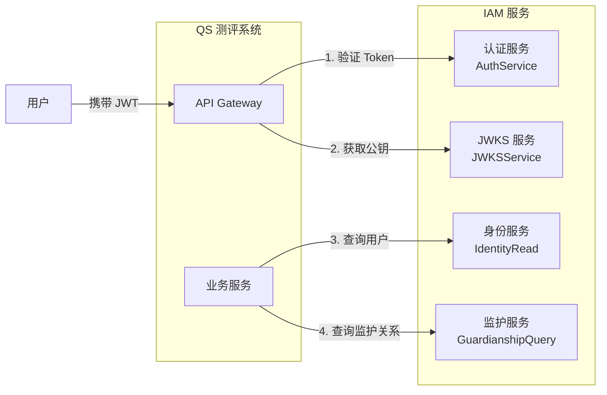
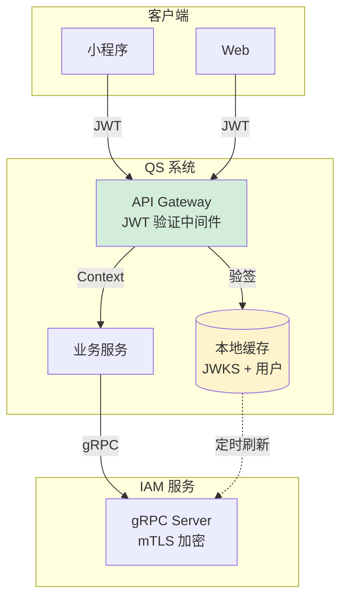

# QS 接入 IAM 实践指南

> 使用 IAM SDK 快速接入认证和身份服务，面向 QS（心理健康测评系统）的完整实践指南。

## 🎯 30 秒快速开始

### 三行代码完成接入

```go
// 1. 创建 SDK 客户端
client, _ := sdk.NewClient(ctx, &sdk.Config{
    Endpoint: "iam.example.com:8081",
    TLS: &sdk.TLSConfig{Enabled: true, CACert: "/path/to/ca.crt"},
})

// 2. 验证 JWT Token
verifier, _ := sdk.NewTokenVerifier(&sdk.TokenVerifyConfig{
    AllowedAudience: []string{"qs"},
}, &sdk.JWKSConfig{URL: "https://iam.example.com/.well-known/jwks.json"}, client)
result, _ := verifier.Verify(ctx, token, nil)

// 3. 查询用户信息
user, _ := client.Identity().GetUser(ctx, result.Claims.UserID)
```

### SDK vs 手动集成

| 对比项 | 手动集成 | 使用 SDK |
|-------|---------|----------|
| 代码量 | ❌ 500+ 行 | ✅ 10 行 |
| mTLS 配置 | ❌ 手动处理证书 | ✅ 自动配置 |
| 重试/超时 | ❌ 自己实现 | ✅ 内置支持 |
| JWKS 缓存 | ❌ 自己维护 | ✅ 自动管理 |
| 错误处理 | ❌ 需封装 | ✅ 统一错误体系 |
| 服务认证 | ❌ 需要轮询刷新 | ✅ 自动刷新 |

---

## 1. 接入概述

### 1.1 QS 需要 IAM 做什么？



| 能力 | 说明 | 调用方式 |
|------|------|----------|
| **Token 验证** | 验证用户的 JWT 是否有效 | gRPC 或本地 JWKS 验签 |
| **JWKS 获取** | 获取公钥用于本地验签 | gRPC 或 HTTP |
| **用户查询** | 获取用户基本信息 | gRPC |
| **监护关系查询** | 查询用户与儿童的监护关系 | gRPC |

### 1.2 推荐架构



**关键设计决策**：

1. **JWT 本地验签**：QS 缓存 JWKS 公钥，在 Gateway 层本地验签，避免每次请求都调用 IAM
2. **gRPC + mTLS**：服务间通信使用 mTLS 双向认证，确保安全
3. **数据缓存**：高频查询（如用户信息）可在 QS 侧缓存，减少对 IAM 的依赖

## 2. 准备工作

### 2.1 获取 mTLS 证书

> **证书架构说明（与服务器现状对齐）**：
>
> - **CA 证书**：`/data/infra/ssl/grpc/ca/ca-chain.crt`（或 `intermediate-ca.crt`/`root-ca.crt`，链式验证时首选 `ca-chain.crt`）
> - **IAM 服务端证书**：`/data/infra/ssl/grpc/server/iam-grpc.{crt,key}`，对外提供 gRPC 服务
> - **QS 客户端证书**：按服务拆分，例如  
>   - `qs-apiserver`：`/data/infra/ssl/grpc/server/qs-apiserver.{crt,key}`（或带链的 `qs-apiserver-fullchain.crt`）  
>   - `qs-collection`：`/data/infra/ssl/grpc/server/qs-collection.{crt,key}`（或带链的 `qs-collection-fullchain.crt`）
>
> 每个调用方服务都有独立证书，共享同一 CA 链做双向认证。

QS 作为 IAM gRPC 的客户端，需准备：

| 文件 | 说明 | 存储位置 |
|------|------|----------|
| `ca-chain.crt` | CA 证书链（验证 IAM 服务端） | `/data/infra/ssl/grpc/ca/ca-chain.crt` |
| `qs-apiserver.crt` / `qs-apiserver.key` | QS API 网关/服务调用 IAM 时的客户端证书与私钥 | `/data/infra/ssl/grpc/server/qs-apiserver.{crt,key}` |
| `qs-collection.crt` / `qs-collection.key` | （如采集侧单独调用 IAM）客户端证书与私钥 | `/data/infra/ssl/grpc/server/qs-collection.{crt,key}` |
| `*-fullchain.crt` | 可选，包含中间证书链的版本 | 与对应 `.crt` 同目录 |

**开发环境**：在 infra 项目中生成测试证书

```bash
# 1. 首次运行：生成 CA 证书（如果已存在则跳过）
cd /path/to/infra
./scripts/cert/generate-grpc-certs.sh generate-ca

# 2. 为 QS 生成证书
cd /path/to/infra
./scripts/cert/generate-grpc-certs.sh generate-server qs QS qs.internal.example.com

# 3. 验证证书
./scripts/cert/generate-grpc-certs.sh verify

# 证书存放位置：
# /data/infra/ssl/grpc/
# ├── ca/
# │   └── ca-chain.crt      # CA 证书链
# └── server/
#     ├── qs.crt            # QS 证书
#     └── qs.key            # QS 私钥
```

**生产环境**：联系运维团队，他们会在 infra 项目中生成并配置证书

### 2.2 配置信息

向 IAM 团队获取以下配置：

```yaml
# QS 配置示例
iam:
  # gRPC 连接配置
  grpc:
    address: "iam-grpc.internal.example.com:9090"
    timeout: 5s
    retry_max: 3
    
    # mTLS 证书路径（引用 infra 项目统一管理的证书）
    # 注意：根据实际服务选择对应证书
    #   - qs-apiserver 服务使用: qs-apiserver.{crt,key}
    #   - qs-collection 服务使用: qs-collection.{crt,key}
    #   - 简化示例统一使用: qs.{crt,key}
    tls:
      ca_file: "/data/infra/ssl/grpc/ca/ca-chain.crt"
      cert_file: "/data/infra/ssl/grpc/server/qs.crt"          # 或 qs-apiserver.crt
      key_file: "/data/infra/ssl/grpc/server/qs.key"           # 或 qs-apiserver.key
  
  # JWT 验证配置
  jwt:
    issuer: "https://iam.example.com"
    audience: "qs"
    algorithms: ["RS256", "ES256"]
    clock_skew: 60s
  
  # JWKS 配置
  jwks:
    refresh_interval: 5m
    cache_ttl: 30m
    
  # 功能开关（灰度用）
  enabled: true
  grpc_enabled: true
  jwks_enabled: true
```

### 2.3 依赖引入

#### Go 项目

```bash
# 添加 IAM SDK
go get github.com/FangcunMount/iam-contracts@latest
```

```go
import (
    sdk "github.com/FangcunMount/iam-contracts/pkg/sdk"
)
```

#### 其他语言

从 proto 文件生成客户端代码（不推荐，优先使用 SDK）：

```bash
# proto 文件位置
api/grpc/iam/authn/v1/authn.proto
api/grpc/iam/identity/v1/identity.proto
```

## 3. SDK 接入步骤（推荐）

### 3.1 步骤一：创建 SDK 客户端

```go
package iam

import (
    "context"
    "time"
    
    sdk "github.com/FangcunMount/iam-contracts/pkg/sdk"
)

// InitIAMClient 初始化 IAM SDK 客户端
func InitIAMClient(ctx context.Context) (*sdk.Client, error) {
    client, err := sdk.NewClient(ctx, &sdk.Config{
        // gRPC 连接配置
        Endpoint: "iam.example.com:8081",
        
        // mTLS 配置（SDK 自动处理证书加载）
        TLS: &sdk.TLSConfig{
            Enabled:  true,
            CACert:   "/data/infra/ssl/grpc/ca/ca-chain.crt",
            CertFile: "/data/infra/ssl/grpc/server/qs.crt",
            KeyFile:  "/data/infra/ssl/grpc/server/qs.key",
        },
        
        // 超时配置（可选，有默认值）
        Timeout: 5 * time.Second,
        
        // 全局重试策略（可选）
        RetryConfig: &sdk.RetryConfig{
            MaxRetries:    3,
            InitialDelay:  100 * time.Millisecond,
            MaxDelay:      2 * time.Second,
            BackoffFactor: 2.0,
        },
        
        // 方法级重试配置（可选，覆盖全局配置）
        MethodConfigs: map[string]*sdk.MethodRetryConfig{
            // 幂等方法使用更激进的重试
            "GetUser": {
                MaxRetries:    5,
                RetryableCodes: sdk.IdempotentRetryableCodes(),
            },
            // 关键方法使用更长超时
            "IsGuardian": {
                Timeout: 10 * time.Second,
            },
        },
        
        // 链路追踪（可选）
        EnableTracing: true,
    })
    if err != nil {
        return nil, err
    }
    
    return client, nil
}

// 全局客户端单例
var globalClient *sdk.Client

// GetClient 获取全局客户端
func GetClient() *sdk.Client {
    return globalClient
}

// InitGlobalClient 初始化全局客户端
func InitGlobalClient(ctx context.Context) error {
    client, err := InitIAMClient(ctx)
    if err != nil {
        return err
    }
    globalClient = client
    return nil
}
```

### 3.2 步骤二：配置 JWT 验证器

```go
package auth

import (
    "context"
    "time"
    
    sdk "github.com/FangcunMount/iam-contracts/pkg/sdk"
)

// InitTokenVerifier 初始化 Token 验证器
func InitTokenVerifier(ctx context.Context, client *sdk.Client) (*sdk.TokenVerifier, error) {
    verifier, err := sdk.NewTokenVerifier(
        // Token 验证配置
        &sdk.TokenVerifyConfig{
            Issuer:          "https://iam.example.com",
            AllowedAudience: []string{"qs"},           // QS 服务标识
            ClockSkew:       60 * time.Second,         // 时钟偏移容忍度
            RequiredClaims:  []string{"user_id"},      // 必需的 Claims
        },
        
        // JWKS 配置（SDK 自动管理缓存和刷新）
        &sdk.JWKSConfig{
            URL:             "https://iam.example.com/.well-known/jwks.json",  // HTTP 端点
            RefreshInterval: 5 * time.Minute,          // 定时刷新间隔
            CacheTTL:        30 * time.Minute,         // 缓存有效期
            
            // JWKS 多源配置（可选，提供降级能力）
            FetchStrategies: []sdk.JWKSFetchStrategy{
                sdk.JWKSFetchHTTP,   // 优先使用 HTTP
                sdk.JWKSFetchGRPC,   // 降级到 gRPC
                sdk.JWKSFetchCache,  // 最后使用缓存
            },
        },
        
        // IAM 客户端（用于远程验证降级）
        client,
    )
    if err != nil {
        return nil, err
    }
    
    return verifier, nil
}

// 全局验证器
var globalVerifier *sdk.TokenVerifier

// GetVerifier 获取全局验证器
func GetVerifier() *sdk.TokenVerifier {
    return globalVerifier
}

// InitGlobalVerifier 初始化全局验证器
func InitGlobalVerifier(ctx context.Context, client *sdk.Client) error {
    verifier, err := InitTokenVerifier(ctx, client)
    if err != nil {
        return err
    }
    globalVerifier = verifier
    return nil
}
```

### 3.3 步骤三：集成 JWT 验证中间件

#### Gin 框架示例

```go
package middleware

import (
    "strings"
    
    "github.com/gin-gonic/gin"
    sdk "github.com/FangcunMount/iam-contracts/pkg/sdk"
)

// JWTAuthMiddleware JWT 验证中间件（使用 SDK）
func JWTAuthMiddleware(verifier *sdk.TokenVerifier) gin.HandlerFunc {
    return func(c *gin.Context) {
        // 1. 提取 Token
        authHeader := c.GetHeader("Authorization")
        if authHeader == "" {
            c.AbortWithStatusJSON(401, gin.H{"error": "missing authorization header"})
            return
        }
        
        parts := strings.SplitN(authHeader, " ", 2)
        if len(parts) != 2 || strings.ToLower(parts[0]) != "bearer" {
            c.AbortWithStatusJSON(401, gin.H{"error": "invalid authorization format"})
            return
        }
        
        // 2. 使用 SDK 验证 Token（自动处理 JWKS 缓存、降级等）
        result, err := verifier.Verify(c.Request.Context(), parts[1], nil)
        if err != nil {
            c.AbortWithStatusJSON(401, gin.H{
                "error": "invalid token",
                "detail": err.Error(),
            })
            return
        }
        
        if !result.Valid {
            c.AbortWithStatusJSON(401, gin.H{
                "error": "token validation failed",
                "reason": result.ValidationError,
            })
            return
        }
        
        // 3. 将用户信息注入上下文
        c.Set("user_id", result.Claims.UserID)
        c.Set("tenant_id", result.Claims.TenantID)
        c.Set("roles", result.Claims.Roles)
        c.Set("token_claims", result.Claims.ExtraFields)
        
        c.Next()
    }
}

// 使用示例
func SetupRouter(verifier *sdk.TokenVerifier) *gin.Engine {
    r := gin.Default()
    
    // 公开接口
    r.GET("/health", func(c *gin.Context) {
        c.JSON(200, gin.H{"status": "ok"})
    })
    
    // 需要认证的接口
    authorized := r.Group("/api")
    authorized.Use(JWTAuthMiddleware(verifier))
    {
        authorized.GET("/profile", getProfile)
        authorized.GET("/children", listChildren)
    }
    
    return r
}

// 从上下文获取用户 ID
func GetUserID(c *gin.Context) (string, bool) {
    userID, exists := c.Get("user_id")
    if !exists {
        return "", false
    }
    return userID.(string), true
}
```

### 3.4 步骤四：调用身份服务

```go
package service

import (
    "context"
    "fmt"
    
    sdk "github.com/FangcunMount/iam-contracts/pkg/sdk"
    identityv1 "github.com/FangcunMount/iam-contracts/api/grpc/iam/identity/v1"
)

// UserService 用户服务（使用 SDK）
type UserService struct {
    client *sdk.Client
}

// NewUserService 创建用户服务
func NewUserService(client *sdk.Client) *UserService {
    return &UserService{client: client}
}

// GetUser 获取用户信息（SDK 自动处理重试、超时等）
func (s *UserService) GetUser(ctx context.Context, userID string) (*identityv1.User, error) {
    user, err := s.client.Identity().GetUser(ctx, userID)
    if err != nil {
        return nil, fmt.Errorf("获取用户信息失败: %w", err)
    }
    return user, nil
}

// BatchGetUsers 批量获取用户
func (s *UserService) BatchGetUsers(ctx context.Context, userIDs []string) ([]*identityv1.User, error) {
    users, err := s.client.Identity().BatchGetUsers(ctx, userIDs)
    if err != nil {
        return nil, fmt.Errorf("批量获取用户失败: %w", err)
    }
    return users, nil
}

// ListChildren 获取用户的儿童列表
func (s *UserService) ListChildren(ctx context.Context, userID string) ([]*identityv1.ChildEdge, error) {
    children, err := s.client.Guardianship().ListChildren(ctx, userID)
    if err != nil {
        return nil, fmt.Errorf("获取儿童列表失败: %w", err)
    }
    return children, nil
}

// IsGuardian 检查监护关系（核心方法）
func (s *UserService) IsGuardian(ctx context.Context, userID, childID string) (bool, error) {
    isGuardian, err := s.client.Guardianship().IsGuardian(ctx, userID, childID)
    if err != nil {
        return false, fmt.Errorf("检查监护关系失败: %w", err)
    }
    return isGuardian, nil
}

// GetChild 获取儿童信息
func (s *UserService) GetChild(ctx context.Context, childID string) (*identityv1.Child, error) {
    child, err := s.client.Identity().GetChild(ctx, childID)
    if err != nil {
        return nil, fmt.Errorf("获取儿童信息失败: %w", err)
    }
    return child, nil
}

// 使用示例：测评前校验
func (s *UserService) ValidateAssessmentAccess(ctx context.Context, userID, childID string) error {
    // 1. 检查监护关系
    isGuardian, err := s.IsGuardian(ctx, userID, childID)
    if err != nil {
        return fmt.Errorf("检查监护关系失败: %w", err)
    }
    if !isGuardian {
        return fmt.Errorf("用户 %s 不是儿童 %s 的监护人", userID, childID)
    }
    
    // 2. 获取儿童信息
    child, err := s.GetChild(ctx, childID)
    if err != nil {
        return fmt.Errorf("获取儿童信息失败: %w", err)
    }
    
    // 3. 检查儿童状态
    if child.Status != identityv1.UserStatus_USER_STATUS_ACTIVE {
        return fmt.Errorf("儿童账户已禁用")
    }
    
    return nil
}
```

### 3.5 步骤五：服务间认证（可选）

如果 QS 服务需要以服务身份调用 IAM（而非用户身份），使用 `ServiceAuthHelper`：

```go
package service

import (
    "context"
    "time"
    
    sdk "github.com/FangcunMount/iam-contracts/pkg/sdk"
    "google.golang.org/grpc"
)

// InitServiceAuth 初始化服务间认证
func InitServiceAuth(ctx context.Context, client *sdk.Client) (*sdk.ServiceAuthHelper, error) {
    helper, err := sdk.NewServiceAuthHelper(
        &sdk.ServiceAuthConfig{
            ServiceID:      "qs-service",                    // QS 服务 ID
            TargetAudience: []string{"iam-service"},         // 目标服务
            TokenTTL:       time.Hour,                       // Token 有效期
            RefreshBefore:  5 * time.Minute,                 // 提前刷新时间
            
            // 刷新策略（可选，有默认值）
            RefreshStrategy: &sdk.RefreshStrategy{
                JitterRatio:          0.05,                  // ±5% 随机抖动
                MinBackoff:           30 * time.Second,      // 最小退避
                MaxBackoff:           5 * time.Minute,       // 最大退避
                MaxRetries:           5,                     // 最大重试次数
                CircuitOpenDuration:  1 * time.Minute,       // 熔断持续时间
            },
        },
        client,
    )
    if err != nil {
        return nil, err
    }
    
    return helper, nil
}

// 使用示例：创建带服务认证的 gRPC 连接
func DialWithServiceAuth(authHelper *sdk.ServiceAuthHelper) (*grpc.ClientConn, error) {
    conn, err := grpc.Dial(
        "other-service:8081",
        grpc.WithTransportCredentials(insecure.NewCredentials()),
        // SDK 的 ServiceAuthHelper 实现了 PerRPCCredentials 接口
        grpc.WithPerRPCCredentials(authHelper),
    )
    return conn, err
}
```

---

## 4. SDK API 参考

### 4.1 Client 核心接口

```go
// 创建客户端
client, err := sdk.NewClient(ctx, &sdk.Config{...})

// 认证服务
authSvc := client.Auth()
token, err := authSvc.VerifyToken(ctx, tokenString)

// 身份服务
identitySvc := client.Identity()
user, err := identitySvc.GetUser(ctx, userID)
users, err := identitySvc.BatchGetUsers(ctx, userIDs)
child, err := identitySvc.GetChild(ctx, childID)

// 监护关系服务
guardianshipSvc := client.Guardianship()
isGuardian, err := guardianshipSvc.IsGuardian(ctx, userID, childID)
children, err := guardianshipSvc.ListChildren(ctx, userID)
guardians, err := guardianshipSvc.ListGuardians(ctx, childID)
```

### 4.2 TokenVerifier 接口

```go
// 创建验证器
verifier, err := sdk.NewTokenVerifier(
    &sdk.TokenVerifyConfig{...},
    &sdk.JWKSConfig{...},
    client,
)

// 验证 Token
result, err := verifier.Verify(ctx, tokenString, nil)
if result.Valid {
    userID := result.Claims.UserID
    roles := result.Claims.Roles
}
```

### 4.3 核心接口速查

| 服务 | SDK 方法 | 说明 |
|------|---------|------|
| **认证** | `Auth().VerifyToken()` | 远程验证 Token |
| **身份** | `Identity().GetUser()` | 获取用户信息 |
| **身份** | `Identity().BatchGetUsers()` | 批量获取用户 |
| **身份** | `Identity().GetChild()` | 获取儿童信息 |
| **监护** | `Guardianship().IsGuardian()` | **核心**：验证监护关系 |
| **监护** | `Guardianship().ListChildren()` | 获取儿童列表 |
| **监护** | `Guardianship().ListGuardians()` | 获取监护人列表 |

## 5. 错误处理

### 5.1 SDK 统一错误处理

SDK 提供了统一的错误分类和处理机制：

```go
import (
    sdk "github.com/FangcunMount/iam-contracts/pkg/sdk"
    sdkerrors "github.com/FangcunMount/iam-contracts/pkg/sdk/errors"
)

func handleSDKError(err error) {
    if err == nil {
        return
    }
    
    // SDK 错误分析
    details := sdkerrors.Analyze(err)
    
    switch details.Category {
    case sdkerrors.CategoryAuthentication:
        // 认证错误：401
        log.Warn("认证失败，跳转登录")
        
    case sdkerrors.CategoryAuthorization:
        // 授权错误：403
        log.Warn("无权限访问")
        
    case sdkerrors.CategoryNotFound:
        // 资源不存在：404
        log.Info("用户或儿童不存在")
        
    case sdkerrors.CategoryValidation:
        // 参数错误：400
        log.Error("请求参数错误:", details.Message)
        
    case sdkerrors.CategoryNetwork:
        // 网络错误：503/504
        if details.Action == sdkerrors.ActionRetry {
            log.Warn("网络错误，SDK 将自动重试")
        } else {
            log.Error("网络故障，启用降级策略")
        }
        
    case sdkerrors.CategoryInternal:
        // 服务内部错误：500
        log.Error("IAM 服务内部错误")
    }
    
    // 获取 HTTP 状态码
    httpStatus := details.ToHTTPStatus()
    log.Infof("HTTP 状态码: %d", httpStatus)
}
```

### 5.2 错误码快速映射

| SDK 错误类别 | gRPC 状态码 | HTTP 状态码 | 建议处理 |
|-------------|-------------|-------------|---------|
| `CategoryAuthentication` | `UNAUTHENTICATED` | 401 | 跳转登录 |
| `CategoryAuthorization` | `PERMISSION_DENIED` | 403 | 提示无权限 |
| `CategoryNotFound` | `NOT_FOUND` | 404 | 提示不存在 |
| `CategoryValidation` | `INVALID_ARGUMENT` | 400 | 检查参数 |
| `CategoryNetwork` | `UNAVAILABLE`, `DEADLINE_EXCEEDED` | 503, 504 | SDK 自动重试 |
| `CategoryInternal` | `INTERNAL` | 500 | 记录日志 |

### 5.3 降级策略（使用缓存）

SDK 支持在配置中启用降级策略：

```go
// 带降级的服务
type CachedUserService struct {
    service *UserService
    cache   *cache.Cache
}

func (s *CachedUserService) GetUser(ctx context.Context, userID string) (*identityv1.User, error) {
    // 1. 先查本地缓存
    if cached, ok := s.cache.Get(userID); ok {
        return cached.(*identityv1.User), nil
    }
    
    // 2. 调用 SDK（SDK 内部已处理重试）
    user, err := s.service.GetUser(ctx, userID)
    if err != nil {
        details := sdkerrors.Analyze(err)
        
        // 3. 如果是网络问题，尝试使用过期缓存
        if details.Category == sdkerrors.CategoryNetwork {
            if stale, ok := s.cache.GetStale(userID); ok {
                log.Warnf("IAM 不可用，使用过期缓存: user=%s", userID)
                return stale.(*identityv1.User), nil
            }
        }
        return nil, err
    }
    
    // 4. 更新缓存（5 分钟）
    s.cache.Set(userID, user, 5*time.Minute)
    return user, nil
}
```

## 6. 完整示例：应用初始化

```go
package main

import (
    "context"
    "log"
    "time"
    
    "github.com/gin-gonic/gin"
    sdk "github.com/FangcunMount/iam-contracts/pkg/sdk"
)

var (
    iamClient *sdk.Client
    verifier  *sdk.TokenVerifier
)

func main() {
    ctx := context.Background()
    
    // 1. 初始化 SDK 客户端
    var err error
    iamClient, err = sdk.NewClient(ctx, &sdk.Config{
        Endpoint: "iam.example.com:8081",
        TLS: &sdk.TLSConfig{
            Enabled:  true,
            CACert:   "/data/infra/ssl/grpc/ca/ca-chain.crt",
            CertFile: "/data/infra/ssl/grpc/server/qs.crt",
            KeyFile:  "/data/infra/ssl/grpc/server/qs.key",
        },
        Timeout: 5 * time.Second,
        EnableTracing: true,
    })
    if err != nil {
        log.Fatalf("初始化 IAM 客户端失败: %v", err)
    }
    defer iamClient.Close()
    
    // 2. 初始化 Token 验证器
    verifier, err = sdk.NewTokenVerifier(
        &sdk.TokenVerifyConfig{
            Issuer:          "https://iam.example.com",
            AllowedAudience: []string{"qs"},
            ClockSkew:       60 * time.Second,
        },
        &sdk.JWKSConfig{
            URL:             "https://iam.example.com/.well-known/jwks.json",
            RefreshInterval: 5 * time.Minute,
            CacheTTL:        30 * time.Minute,
        },
        iamClient,
    )
    if err != nil {
        log.Fatalf("初始化 Token 验证器失败: %v", err)
    }
    
    // 3. 启动 Web 服务
    r := setupRouter()
    if err := r.Run(":8080"); err != nil {
        log.Fatalf("启动服务失败: %v", err)
    }
}

func setupRouter() *gin.Engine {
    r := gin.Default()
    
    // 健康检查
    r.GET("/health", func(c *gin.Context) {
        c.JSON(200, gin.H{"status": "ok"})
    })
    
    // 需要认证的接口
    api := r.Group("/api")
    api.Use(JWTAuthMiddleware(verifier))
    {
        api.GET("/profile", getProfile)
        api.GET("/children", listChildren)
        api.POST("/assessment", startAssessment)
    }
    
    return r
}

// 获取用户资料
func getProfile(c *gin.Context) {
    userID, _ := c.Get("user_id")
    
    user, err := iamClient.Identity().GetUser(c.Request.Context(), userID.(string))
    if err != nil {
        c.JSON(500, gin.H{"error": err.Error()})
        return
    }
    
    c.JSON(200, user)
}

// 获取儿童列表
func listChildren(c *gin.Context) {
    userID, _ := c.Get("user_id")
    
    children, err := iamClient.Guardianship().ListChildren(c.Request.Context(), userID.(string))
    if err != nil {
        c.JSON(500, gin.H{"error": err.Error()})
        return
    }
    
    c.JSON(200, children)
}

// 开始测评
func startAssessment(c *gin.Context) {
    var req struct {
        ChildID string `json:"child_id"`
    }
    if err := c.ShouldBindJSON(&req); err != nil {
        c.JSON(400, gin.H{"error": "参数错误"})
        return
    }
    
    userID, _ := c.Get("user_id")
    
    // 验证监护关系
    isGuardian, err := iamClient.Guardianship().IsGuardian(
        c.Request.Context(),
        userID.(string),
        req.ChildID,
    )
    if err != nil {
        c.JSON(500, gin.H{"error": err.Error()})
        return
    }
    if !isGuardian {
        c.JSON(403, gin.H{"error": "您不是该儿童的监护人"})
        return
    }
    
    // 开始测评...
    c.JSON(200, gin.H{"message": "测评已开始"})
}
```

## 7. 可观测性

### 7.1 SDK 内置指标

SDK 自动收集以下指标（通过 Prometheus）：

| 指标 | 类型 | 说明 |
|------|------|------|
| `iam_sdk_requests_total` | Counter | SDK 请求总数 |
| `iam_sdk_request_duration_seconds` | Histogram | 请求延迟 |
| `iam_sdk_errors_total` | Counter | 错误总数 |
| `iam_sdk_jwks_refresh_total` | Counter | JWKS 刷新次数 |
| `iam_sdk_token_validation_total` | Counter | Token 验证次数 |

### 7.2 链路追踪

SDK 内置 OpenTelemetry 支持：

```go
client, err := sdk.NewClient(ctx, &sdk.Config{
    EnableTracing: true,  // 启用链路追踪
    // ...
})
```

### 7.3 日志

SDK 使用结构化日志（兼容 logrus/zap）：

```go
import (
    "github.com/sirupsen/logrus"
    sdklog "github.com/FangcunMount/iam-contracts/pkg/sdk/logger"
)

// 设置日志级别
sdklog.SetLevel(logrus.InfoLevel)

// 设置自定义 logger
sdklog.SetLogger(yourLogger)
```

## 8. 验收清单

### 8.1 环境准备 ✅

- [ ] 安装 SDK：`go get github.com/FangcunMount/iam-contracts@latest`
- [ ] 获取 mTLS 证书（ca-chain.crt, qs.crt, qs.key）
- [ ] 配置 IAM gRPC 地址和证书路径
- [ ] 配置 JWT 验证参数（issuer, audience, JWKS URL）

### 8.2 SDK 集成验证 ✅

- [ ] SDK 客户端创建成功：`sdk.NewClient()` 无错误
- [ ] Token 验证器创建成功：`sdk.NewTokenVerifier()` 无错误
- [ ] JWT 验证：合法 Token 通过，过期/非法 Token 拒绝
- [ ] 用户查询：`client.Identity().GetUser()` 正常返回
- [ ] 监护关系：`client.Guardianship().IsGuardian()` 正常工作

### 8.3 安全验证 🔒

- [ ] mTLS 证书验证：无证书或错误证书无法连接
- [ ] 私钥权限：`chmod 600 qs.key`
- [ ] 证书路径：不在代码仓库，使用 Kubernetes Secrets 管理
- [ ] Token 签名验证：篡改的 Token 被拒绝

### 8.4 可靠性验证 💪

- [ ] 超时处理：SDK 配置的超时生效，不阻塞
- [ ] 重试机制：SDK 自动重试（查看日志确认）
- [ ] JWKS 降级：HTTP 失败后降级到 gRPC
- [ ] 服务降级：IAM 不可用时使用本地缓存

### 8.5 性能验证 ⚡

- [ ] JWT 本地验证：<5ms（通过 JWKS 缓存）
- [ ] gRPC 调用延迟：<50ms（P95）
- [ ] 并发测试：100 QPS 无错误
- [ ] 缓存命中率：JWKS 缓存命中率 >99%

### 8.6 可观测性验证 📊

- [ ] Prometheus 指标：能采集到 `iam_sdk_*` 指标
- [ ] 日志输出：包含 trace_id、user_id、method、latency
- [ ] 链路追踪：在 Jaeger/Zipkin 中能看到完整链路
- [ ] 告警配置：IAM 调用失败率 >1% 触发告警

### 8.7 灰度发布 🚀

- [ ] 功能开关：可通过配置关闭 IAM 集成
- [ ] 回滚方案：回滚后系统可正常运行（降级到旧逻辑）
- [ ] 预发环境：在 staging 环境完整验证
- [ ] 生产环境：按比例灰度（10% → 50% → 100%）

## 9. 常见问题

### Q1: SDK 客户端创建失败

```text
Error: failed to load TLS credentials: tls: failed to find any PEM data in certificate input
```

**解决方案**：

1. 检查证书文件路径是否正确
2. 确认证书文件格式为 PEM（以 `-----BEGIN CERTIFICATE-----` 开头）
3. 检查证书是否过期：`openssl x509 -in qs.crt -noout -dates`
4. 确认证书 CN 在 IAM 白名单中

### Q2: Token 验证一直失败

```go
result, err := verifier.Verify(ctx, token, nil)
// err: invalid signature
```

**排查步骤**：

1. 检查 JWKS URL 是否正确配置
2. 确认 `AllowedAudience` 包含 "qs"
3. 查看 SDK 日志，确认 JWKS 刷新成功
4. 验证 Token 的 `aud` claim：`jwt.io` 解码查看

### Q3: SDK 重试次数太多/太少

**调整重试配置**：

```go
// 全局配置
client, _ := sdk.NewClient(ctx, &sdk.Config{
    RetryConfig: &sdk.RetryConfig{
        MaxRetries: 5,  // 最多重试 5 次
    },
})

// 方法级配置（覆盖全局）
client, _ := sdk.NewClient(ctx, &sdk.Config{
    MethodConfigs: map[string]*sdk.MethodRetryConfig{
        "GetUser": {
            MaxRetries: 3,  // GetUser 只重试 3 次
        },
    },
})
```

### Q4: JWKS 刷新失败影响服务

**SDK 自动处理**：

- ✅ JWKS 刷新失败时，SDK 使用上一次成功的缓存
- ✅ 支持 HTTP → gRPC → Cache 多级降级
- ✅ 刷新失败不会影响已有 Token 验证

**监控建议**：

```bash
# 监控 JWKS 刷新失败率
rate(iam_sdk_jwks_refresh_errors_total[5m]) > 0.1
```

### Q5: 监护关系查询返回 false，但实际存在

**可能原因**：

1. 传入的 `userID` 或 `childID` 格式错误（多余空格、大小写）
2. 监护关系刚创建，缓存未更新（等待几秒）
3. 监护关系已被撤销

**调试方法**：

```go
isGuardian, err := client.Guardianship().IsGuardian(ctx, userID, childID)
if err != nil {
    details := sdkerrors.Analyze(err)
    log.Errorf("检查监护关系失败: category=%s, message=%s", 
        details.Category, details.Message)
}
if !isGuardian {
    // 打印实际参数
    log.Warnf("监护关系不存在: userID=%q, childID=%q", userID, childID)
}
```

### Q6: 如何在测试中 Mock SDK？

```go
// 定义接口
type IAMClient interface {
    Identity() IdentityService
    Guardianship() GuardianshipService
}

// 测试中使用 Mock
type MockIAMClient struct {
    mock.Mock
}

func (m *MockIAMClient) Identity() IdentityService {
    args := m.Called()
    return args.Get(0).(IdentityService)
}

// 测试
func TestGetUser(t *testing.T) {
    mockClient := new(MockIAMClient)
    mockIdentity := new(MockIdentityService)
    
    mockClient.On("Identity").Return(mockIdentity)
    mockIdentity.On("GetUser", mock.Anything, "user-123").
        Return(&identityv1.User{UserId: "user-123"}, nil)
    
    // 使用 mockClient 测试...
}
```

## 10. SDK vs 手动集成对比

| 项目 | 手动集成 | 使用 SDK | 节省时间 |
|------|---------|----------|---------|
| mTLS 配置 | ~100 行代码 | 3 行配置 | 2 小时 |
| JWKS 缓存 | ~200 行代码 | SDK 内置 | 4 小时 |
| 重试/超时 | ~150 行代码 | 配置项 | 3 小时 |
| 错误处理 | ~100 行代码 | 统一错误体系 | 2 小时 |
| 链路追踪 | ~50 行代码 | 一行配置 | 1 小时 |
| 单元测试 | 自己维护 | SDK 已测试 | 8 小时 |
| **总计** | **~600 行** | **<50 行** | **~20 小时** |

## 11. 相关文档

| 文档 | 说明 |
|------|------|
| [SDK 快速开始](../../pkg/sdk/docs/01-quick-start.md) | SDK 详细使用指南 |
| [SDK 配置详解](../../pkg/sdk/docs/02-configuration.md) | 完整配置选项 |
| [JWT 验证机制](../../pkg/sdk/docs/03-jwt-verification.md) | JWKS 管理和降级 |
| [服务间认证](../../pkg/sdk/docs/04-service-auth.md) | ServiceAuthHelper 使用 |
| [gRPC 服务设计](./03-grpc服务设计.md) | mTLS 和拦截器详解 |
| [核心概念术语](./02-核心概念术语.md) | 领域术语表 |

## 12. 联系方式

| 事项 | 联系方式 |
|------|----------|
| SDK 使用问题 | GitHub Issues / IAM 团队 |
| 证书申请 | IAM 团队 / 运维团队 |
| API 问题 | IAM 开发团队 |
| 紧急故障 | On-Call 值班 |
