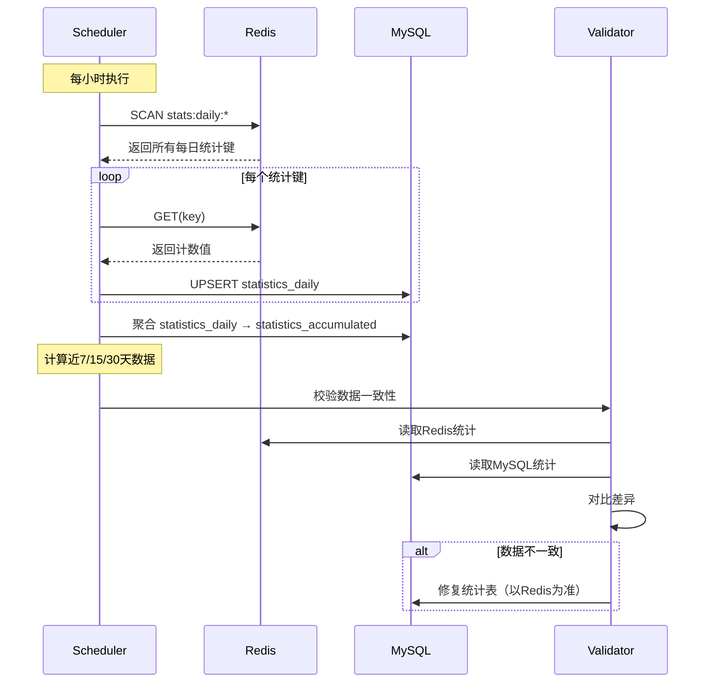

# 统计模块设计（V2）

> **版本**：V2.0  
> **范围**：问卷&量表 BC 中的 statistics 子域  
> **目标**：设计系统级、问卷/量表级、受试者级、计划级的统计能力  
> **更新日期**：2025-01-XX  
> **实现状态**：⏳ 设计阶段

---

## 1. 结论（3行内）

统计模块采用**三层架构**：**事件驱动增量更新（Redis）** + **定时任务持久化（MySQL统计表）** + **实时查询兜底（原始表聚合）**。事件触发时只写Redis预聚合，定时任务同步到MySQL统计表，查询时优先查统计表，未命中时实时聚合原始表。通过幂等性保证和定时校验确保数据一致性。

---

## 2. 模块职责与边界

### 2.1 子域定位

**statistics 子域关注的核心问题**：

- **系统整体数据统计**：问卷数量、答卷数量、受试者数量、测评总数等全局指标
- **问卷/量表维度统计**：单个问卷的填写总数、近7/15/30天填写趋势、完成率等
- **受试者维度统计**：单个受试者的填写情况、测评结果分布、趋势分析等
- **测评计划维度统计**：计划的完成率、任务执行情况、趋势分析等
- **筛查项目维度统计**：项目的参与率、风险分布、异常名单等

**statistics 子域不关心的问题**：

- "如何计分和解读"：这是 scale 子域的职责
- "如何收集答卷"：这是 survey 子域的职责
- "如何管理测评生命周期"：这是 assessment 子域的职责

### 2.2 核心设计原则

1. **最终一致性**：统计采用最终一致性，允许短暂延迟（秒级）
2. **性能优先**：事件触发时只写Redis，不阻塞主流程
3. **可恢复性**：支持从原始表实时聚合，统计表丢失可重建
4. **幂等性保证**：所有更新操作必须幂等，支持事件重放
5. **可观测性**：统计更新失败不影响主流程，但需要监控告警

---

## 3. 三层架构设计

### 3.1 架构总览

```text
┌─────────────────────────────────────────────────────────────┐
│                    统计查询层（Query Layer）                    │
│  ┌──────────────┐  ┌──────────────┐  ┌──────────────┐     │
│  │ Redis Cache  │→ │ MySQL Stats   │→ │ Raw Tables    │     │
│  │ (查询结果缓存) │  │ (预聚合统计表) │  │ (实时聚合兜底) │     │
│  └──────────────┘  └──────────────┘  └──────────────┘     │
└─────────────────────────────────────────────────────────────┘
                            ↑
┌─────────────────────────────────────────────────────────────┐
│                  统计更新层（Update Layer）                    │
│  ┌──────────────┐  ┌──────────────┐  ┌──────────────┐     │
│  │ Event Handler│→ │ Redis Incr   │→ │ MySQL Stats  │     │
│  │ (事件处理器)  │  │ (实时预聚合)  │  │ (定时同步)    │     │
│  └──────────────┘  └──────────────┘  └──────────────┘     │
└─────────────────────────────────────────────────────────────┘
                            ↑
┌─────────────────────────────────────────────────────────────┐
│                   数据源层（Source Layer）                     │
│  ┌──────────────┐  ┌──────────────┐  ┌──────────────┐     │
│  │ Assessment   │  │ AnswerSheet   │  │ Assessment   │     │
│  │ Submitted    │  │ Interpreted   │  │ Plan/Task    │     │
│  └──────────────┘  └──────────────┘  └──────────────┘     │
└─────────────────────────────────────────────────────────────┘
```

### 3.2 第一层：事件驱动增量更新（Redis）

**职责**：事件触发时实时更新Redis预聚合，不阻塞主流程

**更新策略**：

- 事件触发时：只写Redis，使用 `INCR` 原子操作
- 幂等性保证：使用 `event_id` 作为幂等键
- 数据格式：计数器（整数）或Hash（分布数据）

**Redis键设计**：

```text
# 每日统计（事件触发时递增）
stats:daily:{org_id}:{type}:{key}:{date}          # 每日计数
示例：stats:daily:1:questionnaire:Q001:2025-01-20

# 滑动窗口统计（事件触发时递增，定时清理过期数据）
stats:window:{org_id}:{type}:{key}:{window}       # 近N天计数
示例：stats:window:1:questionnaire:Q001:last7d

# 累计统计（事件触发时递增）
stats:accum:{org_id}:{type}:{key}:{metric}        # 累计指标
示例：stats:accum:1:questionnaire:Q001:total_submissions

# 分布统计（事件触发时更新Hash）
stats:dist:{org_id}:{type}:{key}:{dimension}     # 分布数据
示例：stats:dist:1:questionnaire:Q001:origin_type

# 幂等性标记
event:processed:{event_id}                        # 事件处理标记（TTL=7天）
```

### 3.3 第二层：定时任务持久化（MySQL统计表）

**职责**：定时将Redis预聚合结果同步到MySQL统计表，保证数据持久化

**同步策略**：

- 同步频率：每小时执行一次
- 同步方式：从Redis读取，UPSERT到MySQL
- 数据校验：同步后校验Redis和MySQL数据一致性

**MySQL统计表设计**：

```sql
-- ==================== 1. 每日统计表（时间序列数据） ====================
CREATE TABLE statistics_daily (
    id BIGINT PRIMARY KEY AUTO_INCREMENT,
    org_id BIGINT NOT NULL COMMENT '机构ID',
    statistic_type VARCHAR(50) NOT NULL COMMENT '统计类型：questionnaire/testee/plan/screening',
    statistic_key VARCHAR(255) NOT NULL COMMENT '统计键（如 questionnaire_code、testee_id）',
    stat_date DATE NOT NULL COMMENT '统计日期',
    
    -- 计数指标
    submission_count BIGINT NOT NULL DEFAULT 0 COMMENT '提交数',
    completion_count BIGINT NOT NULL DEFAULT 0 COMMENT '完成数',
    
    -- 扩展指标（JSON，支持灵活扩展）
    extra_metrics JSON COMMENT '扩展指标：{"risk_distribution": {...}, "origin_distribution": {...}}',
    
    created_at TIMESTAMP DEFAULT CURRENT_TIMESTAMP,
    updated_at TIMESTAMP DEFAULT CURRENT_TIMESTAMP ON UPDATE CURRENT_TIMESTAMP,
    
    UNIQUE KEY uk_org_type_key_date (org_id, statistic_type, statistic_key, stat_date),
    KEY idx_org_date (org_id, stat_date),
    KEY idx_type_key (statistic_type, statistic_key)
) ENGINE=InnoDB DEFAULT CHARSET=utf8mb4 COMMENT='每日统计表';

-- ==================== 2. 累计统计表（维度预聚合） ====================
-- 设计理念：统一表结构，通过 statistic_type 区分不同维度
CREATE TABLE statistics_accumulated (
    id BIGINT PRIMARY KEY AUTO_INCREMENT,
    org_id BIGINT NOT NULL COMMENT '机构ID',
    statistic_type VARCHAR(50) NOT NULL COMMENT '统计类型：questionnaire/testee/plan/screening/system',
    statistic_key VARCHAR(255) NOT NULL COMMENT '统计键',
    
    -- 基础指标
    total_submissions BIGINT NOT NULL DEFAULT 0 COMMENT '总提交数',
    total_completions BIGINT NOT NULL DEFAULT 0 COMMENT '总完成数',
    
    -- 时间窗口指标（从 statistics_daily 聚合）
    last7d_submissions BIGINT NOT NULL DEFAULT 0 COMMENT '近7天提交数',
    last15d_submissions BIGINT NOT NULL DEFAULT 0 COMMENT '近15天提交数',
    last30d_submissions BIGINT NOT NULL DEFAULT 0 COMMENT '近30天提交数',
    
    -- 分布指标（JSON）
    distribution JSON COMMENT '分布数据：{"risk": {...}, "origin": {...}, "status": {...}}',
    
    -- 时间维度
    first_occurred_at TIMESTAMP NULL COMMENT '首次发生时间',
    last_occurred_at TIMESTAMP NULL COMMENT '最近发生时间',
    
    -- 最后更新时间
    last_updated_at TIMESTAMP DEFAULT CURRENT_TIMESTAMP ON UPDATE CURRENT_TIMESTAMP,
    
    UNIQUE KEY uk_org_type_key (org_id, statistic_type, statistic_key),
    KEY idx_org_type (org_id, statistic_type),
    KEY idx_type_key (statistic_type, statistic_key)
) ENGINE=InnoDB DEFAULT CHARSET=utf8mb4 COMMENT='累计统计表';

-- ==================== 3. 计划任务统计表（计划维度专用） ====================
-- 设计理念：计划统计需要关联任务表，单独设计更清晰
CREATE TABLE statistics_plan (
    id BIGINT PRIMARY KEY AUTO_INCREMENT,
    org_id BIGINT NOT NULL COMMENT '机构ID',
    plan_id BIGINT UNSIGNED NOT NULL COMMENT '计划ID',
    
    -- 任务统计
    total_tasks BIGINT NOT NULL DEFAULT 0 COMMENT '总任务数',
    completed_tasks BIGINT NOT NULL DEFAULT 0 COMMENT '已完成任务数',
    pending_tasks BIGINT NOT NULL DEFAULT 0 COMMENT '待完成任务数',
    expired_tasks BIGINT NOT NULL DEFAULT 0 COMMENT '已过期任务数',
    
    -- 受试者统计
    enrolled_testees BIGINT NOT NULL DEFAULT 0 COMMENT '已加入计划的受试者数',
    active_testees BIGINT NOT NULL DEFAULT 0 COMMENT '活跃受试者数（有完成任务的）',
    
    -- 最后更新时间
    last_updated_at TIMESTAMP DEFAULT CURRENT_TIMESTAMP ON UPDATE CURRENT_TIMESTAMP,
    
    UNIQUE KEY uk_plan (org_id, plan_id),
    KEY idx_org_id (org_id)
) ENGINE=InnoDB DEFAULT CHARSET=utf8mb4 COMMENT='计划统计表';
```

**表设计说明**：

| 表名 | 用途 | 数据来源 | 更新频率 |
|-----|------|---------|---------|
| `statistics_daily` | 每日时间序列数据 | Redis → MySQL | 每小时同步 |
| `statistics_accumulated` | 累计统计（统一表） | Redis + statistics_daily聚合 | 每小时更新 |
| `statistics_plan` | 计划维度统计（专用表） | assessment_tasks表聚合 | 每小时更新 |

### 3.4 第三层：实时查询兜底（原始表聚合）

**职责**：统计表未命中时，实时聚合原始表作为兜底

**查询策略**：

- 优先查Redis缓存（查询结果缓存，TTL=5分钟）
- 其次查MySQL统计表（预聚合数据）
- 最后查原始表实时聚合（assessments、assessment_tasks等）

**原始表聚合查询示例**：

```sql
-- 问卷统计：从 assessments 表聚合
SELECT 
    questionnaire_code,
    COUNT(*) AS total_submissions,
    COUNT(CASE WHEN status = 'interpreted' THEN 1 END) AS total_completions,
    COUNT(CASE WHEN created_at >= DATE_SUB(NOW(), INTERVAL 7 DAY) THEN 1 END) AS last7d_submissions
FROM assessments
WHERE org_id = ? AND questionnaire_code = ?
GROUP BY questionnaire_code;

-- 受试者统计：从 assessments 表聚合
SELECT 
    testee_id,
    COUNT(*) AS total_assessments,
    COUNT(CASE WHEN status = 'interpreted' THEN 1 END) AS completed_assessments,
    MAX(interpreted_at) AS last_assessment_date,
    MIN(created_at) AS first_assessment_date
FROM assessments
WHERE org_id = ? AND testee_id = ?
GROUP BY testee_id;
```

---

## 4. 关键流程设计

### 4.1 事件驱动更新流程


### 4.2 统计查询流程


### 4.3 定时任务同步流程



---

## 5. 统计维度设计

### 5.1 系统整体统计

```go
type SystemStatistics struct {
    OrgID int64
    
    // 基础数量统计
    QuestionnaireCount int64  // 问卷总数（从 questionnaires 表 COUNT）
    AnswerSheetCount   int64  // 答卷总数（从 answer_sheets 表 COUNT，status=submitted）
    TesteeCount        int64  // 受试者总数（从 testees 表 COUNT）
    AssessmentCount    int64  // 测评总数（从 assessments 表 COUNT）
    
    // 状态分布
    AssessmentStatusDistribution map[string]int64 // 按状态统计
    
    // 今日新增（每日凌晨清零）
    TodayNewAssessments    int64 // 今日新增测评
    TodayNewAnswerSheets   int64 // 今日新增答卷
    TodayNewTestees        int64 // 今日新增受试者
    
    // 趋势数据（近30天）
    AssessmentTrend []DailyCount // 每日测评数量趋势
}
```

### 5.2 问卷/量表统计

```go
type QuestionnaireStatistics struct {
    OrgID            int64
    QuestionnaireCode string
    
    // 基础统计
    TotalSubmissions int64   // 总提交数
    TotalCompletions int64   // 总完成数（已解读）
    CompletionRate   float64 // 完成率 = TotalCompletions / TotalSubmissions
    
    // 时间维度统计
    Last7DaysCount   int64  // 近7天提交数
    Last15DaysCount  int64  // 近15天提交数
    Last30DaysCount  int64  // 近30天提交数
    
    // 趋势数据（近30天）
    DailyTrend       []DailyCount // 每日提交趋势
    
    // 来源分布
    OriginDistribution map[string]int64 // 按来源统计（adhoc/plan/screening）
}
```

### 5.3 受试者统计

```go
type TesteeStatistics struct {
    OrgID   int64
    TesteeID uint64
    
    // 测评统计
    TotalAssessments     int64  // 总测评数
    CompletedAssessments int64  // 已完成测评数
    PendingAssessments   int64  // 待完成测评数
    
    // 风险分布
    RiskDistribution     map[string]int64 // 按风险等级统计
    
    // 时间维度
    LastAssessmentDate   *time.Time // 最近测评日期
    FirstAssessmentDate  *time.Time // 首次测评日期
}
```

### 5.4 测评计划统计

```go
type PlanStatistics struct {
    OrgID int64
    PlanID uint64
    
    // 任务统计
    TotalTasks     int64  // 总任务数
    CompletedTasks int64  // 已完成任务数
    PendingTasks   int64  // 待完成任务数
    ExpiredTasks   int64  // 已过期任务数
    
    // 完成率
    CompletionRate float64 // 完成率 = CompletedTasks / TotalTasks
    
    // 受试者统计
    EnrolledTestees int64  // 已加入计划的受试者数
    ActiveTestees   int64  // 活跃受试者数（有完成任务的）
}
```

### 5.5 筛查项目统计

```go
type ScreeningStatistics struct {
    OrgID       int64
    ScreeningID uint64
    
    // 参与统计
    TotalParticipants    int64  // 总参与人数
    CompletedParticipants int64  // 已完成人数
    ParticipationRate    float64 // 参与率 = TotalParticipants / TargetParticipants
    
    // 风险分布
    RiskDistribution     map[string]int64 // 按风险等级统计
    
    // 目标人数
    TargetParticipants   int64  // 目标参与人数
}
```

---

## 6. 核心组件设计

### 6.1 应用服务层

| 服务 | 职责 | 查询策略 |
|-----|------|---------|
| `SystemStatisticsService` | 系统整体统计 | Redis缓存 → statistics_accumulated → 原始表聚合 |
| `QuestionnaireStatisticsService` | 问卷/量表统计 | Redis缓存 → statistics_accumulated → assessments表聚合 |
| `TesteeStatisticsService` | 受试者统计 | Redis缓存 → statistics_accumulated → assessments表聚合 |
| `PlanStatisticsService` | 计划统计 | Redis缓存 → statistics_plan → assessment_tasks表聚合 |
| `ScreeningStatisticsService` | 筛查项目统计 | Redis缓存 → statistics_accumulated → assessments表聚合 |

### 6.2 领域服务层

| 服务 | 职责 |
|-----|------|
| `StatisticsAggregator` | 统计聚合器，封装统计计算逻辑 |
| `TrendAnalyzer` | 趋势分析器，计算时间序列趋势 |
| `StatisticsValidator` | 统计校验器，校验Redis和MySQL数据一致性 |

### 6.3 基础设施层

| 组件 | 职责 |
|-----|------|
| `StatisticsRepository` | 统计查询仓储（MySQL统计表查询） |
| `StatisticsCache` | 统计缓存（Redis操作封装） |
| `StatisticsEventHandler` | 领域事件处理器（订阅事件，更新Redis） |
| `StatisticsSyncService` | 统计同步服务（定时任务，Redis → MySQL） |
| `StatisticsValidatorService` | 统计校验服务（定时任务，数据一致性校验） |

---

## 7. 关键设计决策

### 7.1 统一累计统计表设计

**决策**：使用统一的 `statistics_accumulated` 表存储所有维度的累计统计，通过 `statistic_type` 区分维度。

**原因**：

- 减少表数量，简化维护
- 统一的查询接口，易于扩展
- 通过索引优化查询性能

**实现**：

```sql
-- 问卷统计
INSERT INTO statistics_accumulated (org_id, statistic_type, statistic_key, ...)
VALUES (1, 'questionnaire', 'Q001', ...);

-- 受试者统计
INSERT INTO statistics_accumulated (org_id, statistic_type, statistic_key, ...)
VALUES (1, 'testee', '123', ...);
```

### 7.2 事件处理幂等性

**决策**：所有事件处理必须幂等，使用 `event_id` 作为幂等键。

**实现**：

```go
func (h *EventHandler) Handle(ctx context.Context, event Event) error {
    // 幂等性检查
    idempotencyKey := fmt.Sprintf("event:processed:%s", event.ID())
    if exists, _ := cache.Exists(ctx, idempotencyKey); exists {
        return nil // 已处理，跳过
    }
    
    // 处理事件（更新Redis）
    if err := h.updateRedis(ctx, event); err != nil {
        return err
    }
    
    // 标记已处理（TTL=7天）
    cache.Set(ctx, idempotencyKey, "1", 7*24*time.Hour)
    return nil
}
```

### 7.3 数据一致性保证

**决策**：采用最终一致性，通过定时校验修复不一致。

**策略**：

1. **事件驱动更新**：事件触发时只写Redis，保证实时性
2. **定时同步**：每小时将Redis同步到MySQL，保证持久化
3. **定时校验**：每小时校验Redis和MySQL数据一致性，修复差异
4. **兜底查询**：统计表未命中时实时聚合原始表

**校验逻辑**：

```go
func (v *ValidatorService) Validate(ctx context.Context) error {
    // 1. 从Redis读取统计
    redisStats := v.cache.GetStatistics(ctx, type, key)
    
    // 2. 从MySQL读取统计
    mysqlStats := v.repo.GetStatistics(ctx, type, key)
    
    // 3. 对比差异
    if redisStats.TotalSubmissions != mysqlStats.TotalSubmissions {
        // 4. 修复MySQL（以Redis为准）
        v.repo.UpdateStatistics(ctx, type, key, redisStats)
    }
    
    return nil
}
```

---

## 8. 实现路径

### 8.1 阶段一：核心统计查询（P0）

**目标**：实现基础统计查询能力

1. 实现 `StatisticsRepository`：MySQL统计表查询
2. 实现 `SystemStatisticsService`：系统整体统计
3. 实现 `QuestionnaireStatisticsService`：问卷/量表统计
4. 提供 REST API 接口

**预计工作量**：3-5 天

### 8.2 阶段二：事件驱动更新（P0）

**目标**：通过事件实时更新Redis统计

1. 实现 `StatisticsEventHandler`：订阅领域事件
2. 实现 `StatisticsCache`：Redis操作封装
3. 实现幂等性检查机制
4. 实现Redis预聚合逻辑

**预计工作量**：3-5 天

### 8.3 阶段三：定时任务同步（P0）

**目标**：定时将Redis同步到MySQL统计表

1. 创建MySQL统计表（migration）
2. 实现 `StatisticsSyncService`：Redis → MySQL同步
3. 实现定时任务调度
4. 实现数据校验逻辑

**预计工作量**：3-5 天

### 8.4 阶段四：完善统计维度（P1）

**目标**：完善所有统计维度

1. 实现 `TesteeStatisticsService`（扩展已有）
2. 实现 `PlanStatisticsService`
3. 实现 `ScreeningStatisticsService`
4. 实现趋势分析功能

**预计工作量**：3-5 天

### 8.5 阶段五：性能优化（P2）

**目标**：优化查询性能，支持高并发

1. 优化MySQL索引
2. 实现查询结果缓存
3. 实现实时聚合兜底
4. 监控与告警

**预计工作量**：2-3 天

---

## 9. 代码结构

```text
internal/apiserver/
├── application/
│   └── statistics/
│       ├── system_service.go          # 系统统计服务
│       ├── questionnaire_service.go    # 问卷统计服务
│       ├── testee_service.go          # 受试者统计服务
│       ├── plan_service.go            # 计划统计服务
│       ├── screening_service.go       # 筛查统计服务
│       ├── sync_service.go            # 统计同步服务（定时任务）
│       ├── validator_service.go       # 统计校验服务（定时任务）
│       └── interfaces.go               # 服务接口定义
├── domain/
│   └── statistics/
│       ├── aggregator.go              # 统计聚合器
│       ├── trend_analyzer.go          # 趋势分析器
│       ├── validator.go               # 统计校验器
│       └── types.go                   # 统计类型定义
└── infra/
    └── statistics/
        ├── repository.go              # 统计仓储实现（MySQL）
        ├── cache.go                   # 统计缓存实现（Redis）
        ├── event_handler.go          # 事件处理器
        └── sync_job.go               # 定时同步任务
```

---

## 10. 风险点 & 取舍

### 10.1 实时性 vs 性能

**风险**：实时聚合查询在高并发场景下可能成为性能瓶颈。

**取舍**：

- ✅ **高频统计**：Redis预聚合 + MySQL统计表，查询时直接读取
- ✅ **低频统计**：实时聚合原始表，结果缓存5分钟
- ✅ **历史趋势**：从 `statistics_daily` 表查询，无需实时聚合

### 10.2 数据一致性

**风险**：事件丢失或处理失败导致统计不准确。

**取舍**：

- ✅ **最终一致性**：允许短暂延迟（秒级），通过定时校验修复
- ✅ **幂等性保证**：事件处理器必须幂等，支持重复消费
- ✅ **补偿机制**：定时任务每小时全量校验，修复不一致

### 10.3 存储选型

**风险**：统计查询需要跨多个表JOIN，MySQL性能可能不足。

**取舍**：

- ✅ **MySQL为主**：利用统计表预聚合，减少JOIN查询
- ✅ **Redis为辅**：高频统计使用Redis预聚合，减少MySQL压力
- ✅ **原始表兜底**：统计表未命中时实时聚合，保证可用性
- ⚠️ **不引入OLAP**：当前数据量下，MySQL + Redis足够，避免过度设计

### 10.4 表设计统一性

**风险**：多个统计表设计不统一，维护成本高。

**取舍**：

- ✅ **统一累计表**：使用 `statistics_accumulated` 统一存储所有维度累计统计
- ✅ **专用表补充**：计划统计需要关联任务表，单独设计 `statistics_plan`
- ✅ **每日统计表**：时间序列数据统一存储在 `statistics_daily`

---

## 11. 后续优化方向

1. **OLAP集成**：数据量达到百万级后，考虑引入ClickHouse或StarRocks
2. **实时大屏**：基于WebSocket推送实时统计更新
3. **自定义报表**：支持用户自定义统计维度和时间窗口
4. **数据导出**：支持导出统计报表（Excel、PDF）
5. **统计快照**：存储某个时间点的完整统计快照，便于对比分析

---

**本文档作为统计模块设计的蓝图，后续实现均以此为准。**
