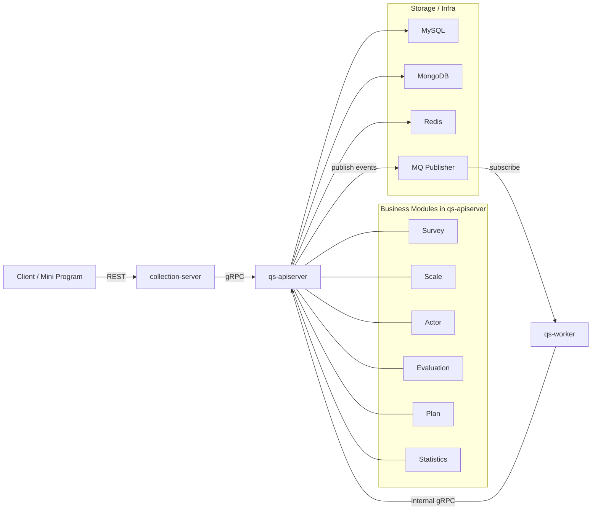

# qs-server 文档

本文档目录以当前代码实现为准，保留高层叙事入口，但不再重复维护脱离代码的大段设计稿和示例实现。

## 30 秒了解系统

`qs-server` 当前是一个由三个核心进程组成的问卷与量表测评系统：

- `qs-apiserver`：主业务服务，负责领域模块、主 REST API、gRPC 和内部服务
- `collection-server`：前台 BFF，面向小程序和收集端，负责轻量查询、答卷提交和访问控制前置
- `qs-worker`：异步处理服务，消费事件并回调 `apiserver` 执行评估、统计、打标签

主业务能力集中在 `apiserver`，主链路是：

`前台提交答卷 -> apiserver 保存并发事件 -> worker 异步评估 -> 生成报告/更新统计`

## 核心架构

## 核心设计原则

- 以当前代码为准：文档优先说明已经存在的运行时、模块和链路，不把规划稿写成现状。
- 主业务集中在 `apiserver`：`collection-server` 和 `worker` 都围绕它协作，而不是各自维护一套主业务。
- 事件驱动串联异步流程：答卷、测评、报告、统计等后台动作通过事件解耦。
- 文档少写重复代码：文档给职责、边界、流程和代码锚点，具体实现直接链接到仓库文件。

## 阅读顺序

1. [00-总览/README.md](./00-总览/README.md)（四篇索引，可选）
2. [00-总览/01-系统地图.md](./00-总览/01-系统地图.md)
3. [00-总览/02-代码组织与边界.md](./00-总览/02-代码组织与边界.md)
4. [00-总览/03-核心业务链路.md](./00-总览/03-核心业务链路.md)
5. [00-总览/04-本地开发与配置约定.md](./00-总览/04-本地开发与配置约定.md)（环境变量、端口、`configs` 与 `make`）
6. 按角色选读：[01-运行时](./01-运行时/)（建议先读该目录 [README](./01-运行时/README.md) 中的整体视图）→ [02-业务模块](./02-业务模块/) → [03-基础设施](./03-基础设施/) → [04-接口与运维](./04-接口与运维/)

## 本地开发速查

- **环境**：`ENV=dev`（默认）或 `ENV=prod` 控制 `Makefile` 选用的 yaml 与 HTTP 端口；详见 [00-总览/04-本地开发与配置约定.md](./00-总览/04-本地开发与配置约定.md)。
- **契约**：REST 见 [api/rest/apiserver.yaml](../api/rest/apiserver.yaml)、[api/rest/collection.yaml](../api/rest/collection.yaml)；gRPC proto 见 [internal/apiserver/interface/grpc/proto](../internal/apiserver/interface/grpc/proto)。
- **事件**：Topic 与 handler 以 [configs/events.yaml](../configs/events.yaml) 为单一事实来源。
- **根目录 README**：快速开始、常用 `make` 目标见仓库根 [README.md](../README.md)。

## 辅助工具（cmd/tools）

非线上进程，用于运维与联调：

| 路径 | 用途（概要） |
| ---- | ------------ |
| [cmd/tools/seeddata](../cmd/tools/seeddata) | 种子数据 / 联调灌数（配置见 [configs/seeddata.yaml](../configs/seeddata.yaml)） |
| [cmd/tools/redis-stats-ttl-fix](../cmd/tools/redis-stats-ttl-fix) | Redis 统计相关 TTL 修复类工具 |

具体子命令与参数以各 `main.go` 及 `-h` 为准。

## 当前文档结构

- [00-总览](./00-总览/)：系统地图、代码组织、主链路、本地开发与配置约定；入口 [00-总览/README](./00-总览/README.md)
- [01-运行时](./01-运行时/)：服务组件整体视图、示意图/时序图、各进程核心功能与组件间引用；入口 [README](./01-运行时/README.md)；与 [02](./02-业务模块/)、[03](./03-基础设施/)、[04](./04-接口与运维/) 交叉引用
- [02-业务模块](./02-业务模块/)：按模块说明 `survey`、`scale`、`evaluation`、`actor`、`plan`、`statistics`；入口 [02-业务模块/README](./02-业务模块/README.md)；六篇均已按 [CONTRIBUTING-DOCS.md](./CONTRIBUTING-DOCS.md) 的**业务模块推荐结构**对齐（文首约定、`30 秒` 分层、`模型与服务`、`核心设计`、`边界`、锚点索引）
- [03-基础设施](./03-基础设施/)：事件、存储、缓存与限流、IAM、配置；五篇已按 [CONTRIBUTING-DOCS.md](./CONTRIBUTING-DOCS.md) 与 [02-业务模块](./02-业务模块/)、[05-专题分析](./05-专题分析/) 对齐（横切机制 + Verify + 与 02/05 分工）
- [04-接口与运维](./04-接口与运维/)：REST、gRPC、部署端口、调度与后台任务；四篇已按 [CONTRIBUTING-DOCS.md](./CONTRIBUTING-DOCS.md) 与 [02](./02-业务模块/)、[03](./03-基础设施/) 对齐（契约入口 + Verify + 与异步/IAM 交叉引用）
- [05-专题分析](./05-专题分析/)：从业务模型、异步链路和保护层三个角度解释系统核心设计
- [_archive](./_archive/)：历史设计稿、迁移前文档和零散专题归档，不作为当前实现的默认入口

## 代码锚点

- `apiserver` 入口与装配：
  [cmd/qs-apiserver/apiserver.go](../cmd/qs-apiserver/apiserver.go)
  [internal/apiserver/container/container.go](../internal/apiserver/container/container.go)
- `collection-server` 入口与装配：
  [cmd/collection-server/main.go](../cmd/collection-server/main.go)
  [internal/collection-server/container/container.go](../internal/collection-server/container/container.go)
- `worker` 入口与装配：
  [cmd/qs-worker/main.go](../cmd/qs-worker/main.go)
  [internal/worker/container/container.go](../internal/worker/container/container.go)
- 事件配置：
  [configs/events.yaml](../configs/events.yaml)
- REST 契约：
  [api/rest/apiserver.yaml](../api/rest/apiserver.yaml)
  [api/rest/collection.yaml](../api/rest/collection.yaml)

## 文档约定

- 文档描述“当前实现”，不是历史设计蓝图。
- 代码细节尽量通过文件链接锚定，不在文档里重复抄写实现。
- 历史文档已移动到 [_archive](./_archive/)，阅读现状时默认以新总览、新分组文档和代码为准。
- **写作规范与业务模块模板**（维护 `docs/` 时必读）：[CONTRIBUTING-DOCS.md](./CONTRIBUTING-DOCS.md)
