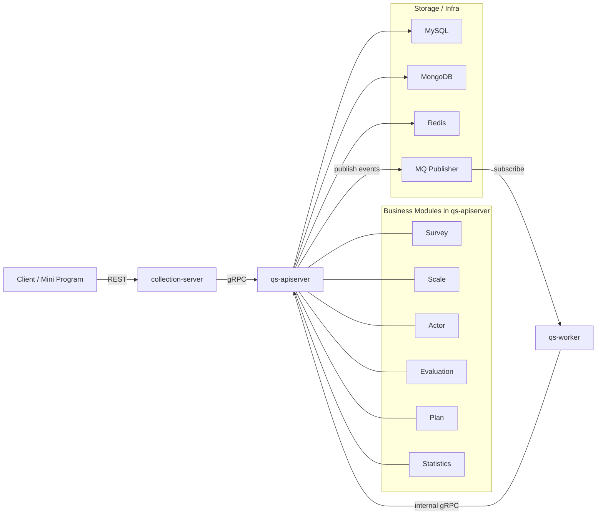

# qs-server 文档

**本文回答**：根 `docs/README` 负责回答两件事：`qs-server` 这套文档为什么要分层，以及第一次读仓库时应该从哪一层进入；它给出整体坐标系和阅读路径，不重复替代各目录正文。

本文档目录以当前代码实现为准，保留高层叙事入口，但不再重复维护脱离代码的大段设计稿和示例实现。

## 30 秒结论

| 维度 | 结论 |
| ---- | ---- |
| 系统形态 | `qs-server` 是三进程协作的问卷与量表测评系统：`qs-apiserver + collection-server + qs-worker` |
| 主业务中心 | 主状态、主业务写链和领域模块都收口在 `qs-apiserver` |
| 主链路 | `前台提交答卷 -> apiserver 保存并发事件 -> worker 异步评估 -> 生成报告 / 更新统计` |
| 文档分层 | `00` 讲总览，`01` 讲运行时，`02` 讲业务模块，`03` 讲基础设施，`04` 讲接口与运维，`05` 讲专题分析，`06` 讲宣讲 |
| 阅读原则 | 先建立系统地图，再按“我现在要解决什么问题”进入对应目录；`_archive` 不作为现行入口 |

## 重点速查

1. **第一次读仓库，先看 `00-总览`**：先拿到系统地图、代码边界和主业务链路，再进入模块和专题。  
2. **想看“谁调谁、怎么跑”去 `01-运行时`**；想看“模块怎么设计”去 `02-业务模块`；想看“为什么这样设计”去 `05-专题分析`。  
3. **横切机制和契约分开读**：事件、存储、IAM、缓存、配置在 `03`，REST / gRPC / 端口 / 调度在 `04`。  
4. **`06-宣讲` 是公开讲解层，不是第二真值层**；现状仍以 `00-05` 和代码为准。  
5. **`_archive` 只作历史参考**：默认不纳入现行文档校验，后续会删除。  

## 系统地图（先建立整体坐标系）

## 为什么 docs 要这样分层

| 文档层 | 先回答什么问题 | 什么时候进入这一层 |
| ------ | -------------- | ------------------ |
| [00-总览](./00-总览/) | 系统地图、代码边界、主业务链路、本地开发入口 | 第一次读仓库，或需要重建整体坐标系时 |
| [01-运行时](./01-运行时/) | 三进程协作、同步/异步路径、运行时组件关系 | 需要确认谁调谁、协议怎么穿过进程边界时 |
| [02-业务模块](./02-业务模块/) | 六个业务模块的边界、模型、服务分层和模块内关键设计 | 需要解释某个模块到底负责什么时 |
| [03-基础设施](./03-基础设施/) | 事件、存储、缓存、限流、IAM、配置等横切机制 | 需要核对 `events.yaml`、缓存、数据库、配置入口时 |
| [04-接口与运维](./04-接口与运维/) | REST / gRPC 契约、端口、调度、部署事实 | 需要确认机器契约和运维入口时 |
| [05-专题分析](./05-专题分析/) | 三界拆分、异步评估链、保护层与读侧等系统级判断 | 需要回答“为什么这么设计”时 |
| [06-宣讲](./06-宣讲/) | 对外介绍、项目讲解、公开叙事 | 需要把项目讲清楚而不是核对代码时 |

## 核心设计原则

- 以当前代码为准：文档优先说明已经存在的运行时、模块和链路，不把规划稿写成现状。
- 主业务集中在 `apiserver`：`collection-server` 和 `worker` 都围绕它协作，而不是各自维护一套主业务。
- 事件驱动串联异步流程：答卷、测评、报告、统计等后台动作通过事件解耦。
- 文档少写重复代码：文档给职责、边界、流程和代码锚点，具体实现直接链接到仓库文件。

## 首次阅读顺序

1. [00-总览/README.md](./00-总览/README.md)（四篇索引，可选）
2. [00-总览/01-系统地图.md](./00-总览/01-系统地图.md)
3. [00-总览/02-代码组织与边界.md](./00-总览/02-代码组织与边界.md)
4. [00-总览/03-核心业务链路.md](./00-总览/03-核心业务链路.md)
5. [00-总览/04-本地开发与配置约定.md](./00-总览/04-本地开发与配置约定.md)（环境变量、端口、`configs` 与 `make`）
6. 再按当前问题进入分组入口页：[01-运行时](./01-运行时/)、[02-业务模块](./02-业务模块/)、[03-基础设施](./03-基础设施/)、[04-接口与运维](./04-接口与运维/)、[05-专题分析](./05-专题分析/)；每组内的细读顺序由各自 `README` 负责维护。

## 宣讲阅读入口

若目标是把 `qs-server` 讲成一套适合公开介绍、技术宣讲和项目讲解的材料，建议把文档分成两层来看：

- **真值层**：现有 [00-总览](./00-总览/)、[01-运行时](./01-运行时/)、[02-业务模块](./02-业务模块/)、[03-基础设施](./03-基础设施/)、[04-接口与运维](./04-接口与运维/)、[05-专题分析](./05-专题分析/)；回答“代码现在是什么”。
- **宣讲层**：新增 [06-宣讲](./06-宣讲/)；回答“对外怎么讲、先讲什么、哪些点要主动说风险和边界”。

宣讲场景下，根入口只负责告诉你“有这一层”；具体顺序、使用规则和每篇用途统一由 [06-宣讲/README.md](./06-宣讲/README.md) 维护，避免根入口和分组 README 双重维护同一套讲解顺序。

## 本地开发速查

- **环境**：`ENV=dev`（默认）或 `ENV=prod` 控制 `Makefile` 选用的 yaml 与 HTTP 端口；详见 [00-总览/04-本地开发与配置约定.md](./00-总览/04-本地开发与配置约定.md)。
- **契约**：REST 见 [api/rest/apiserver.yaml](../api/rest/apiserver.yaml)、[api/rest/collection.yaml](../api/rest/collection.yaml)；gRPC proto 见 [internal/apiserver/interface/grpc/proto](../internal/apiserver/interface/grpc/proto)。
- **事件**：Topic 与 handler 以 [configs/events.yaml](../configs/events.yaml) 为单一事实来源。
- **根目录 README**：快速开始、常用 `make` 目标见仓库根 [README.md](../README.md)。

## 辅助工具（cmd/tools）

非线上进程，用于运维与联调：

| 路径 | 用途（概要） |
| ---- | ------------ |
| [cmd/tools/seeddata](../cmd/tools/seeddata) | 种子数据 / 联调灌数（配置见 [configs/seeddata.yaml](../configs/seeddata.yaml)） |
| [cmd/tools/redis-stats-ttl-fix](../cmd/tools/redis-stats-ttl-fix) | Redis 统计相关 TTL 修复类工具 |

具体子命令与参数以各 `main.go` 及 `-h` 为准。

## 当前文档结构

根入口只维护“哪一层解决什么问题”，不重复维护每组内部目录与细读顺序。各组具体文档清单统一在对应 `README` 中维护。

| 目录 | 根入口只保留的一句话定位 | 组内细节入口 |
| ---- | ---------------------- | ------------ |
| [00-总览](./00-总览/) | 系统地图、代码边界、主链路、本地开发入口 | [00-总览/README.md](./00-总览/README.md) |
| [01-运行时](./01-运行时/) | 三进程协作、同步/异步路径、运行时组件关系 | [01-运行时/README.md](./01-运行时/README.md) |
| [02-业务模块](./02-业务模块/) | 模块边界、对象、服务分层和模块内关键设计 | [02-业务模块/README.md](./02-业务模块/README.md) |
| [03-基础设施](./03-基础设施/) | 事件、存储、缓存、限流、IAM、配置等横切机制 | [03-基础设施/README.md](./03-基础设施/README.md) |
| [04-接口与运维](./04-接口与运维/) | REST/gRPC 契约、端口、部署和后台任务入口 | [04-接口与运维/README.md](./04-接口与运维/README.md) |
| [05-专题分析](./05-专题分析/) | 跨模块、跨运行时的设计判断与主链专题 | [05-专题分析/README.md](./05-专题分析/README.md) |
| [06-宣讲](./06-宣讲/) | 面向公开讲解的结构化叙事层 | [06-宣讲/README.md](./06-宣讲/README.md) |
| [_archive](./_archive/) | 历史设计稿与迁移前文档，只作参考 | [docs/_archive/README.md](./_archive/README.md) |

## 代码锚点

- `apiserver` 入口与装配：
  [cmd/qs-apiserver/apiserver.go](../cmd/qs-apiserver/apiserver.go)
  [internal/apiserver/container/container.go](../internal/apiserver/container/container.go)
- `collection-server` 入口与装配：
  [cmd/collection-server/main.go](../cmd/collection-server/main.go)
  [internal/collection-server/container/container.go](../internal/collection-server/container/container.go)
- `worker` 入口与装配：
  [cmd/qs-worker/main.go](../cmd/qs-worker/main.go)
  [internal/worker/container/container.go](../internal/worker/container/container.go)
- 事件配置：
  [configs/events.yaml](../configs/events.yaml)
- REST 契约：
  [api/rest/apiserver.yaml](../api/rest/apiserver.yaml)
  [api/rest/collection.yaml](../api/rest/collection.yaml)

## 文档约定

- 现行文档统一遵循：**先一针见血，再娓娓道来**。默认顺序是“`本文回答` → `30 秒结论` → 主图/主表 → 详细展开 → 证据与回链”。
- 结构化的目标不是删信息，而是把信息改成更适合阅读和叙述的层次：先重点，再细节，再证据。
- 文档描述“当前实现”，不是历史设计蓝图。
- 代码细节尽量通过文件链接锚定，不在文档里重复抄写实现。
- 历史文档已移动到 [_archive](./_archive/)，阅读现状时默认以新总览、新分组文档和代码为准；`_archive` 仅作临时参考，后续会删除，默认不纳入现行文档校验。
- 维护现行文档时，提交前运行 `make docs-hygiene`。
- **写作规范与业务模块模板**（维护 `docs/` 时必读）：[CONTRIBUTING-DOCS.md](./CONTRIBUTING-DOCS.md)
